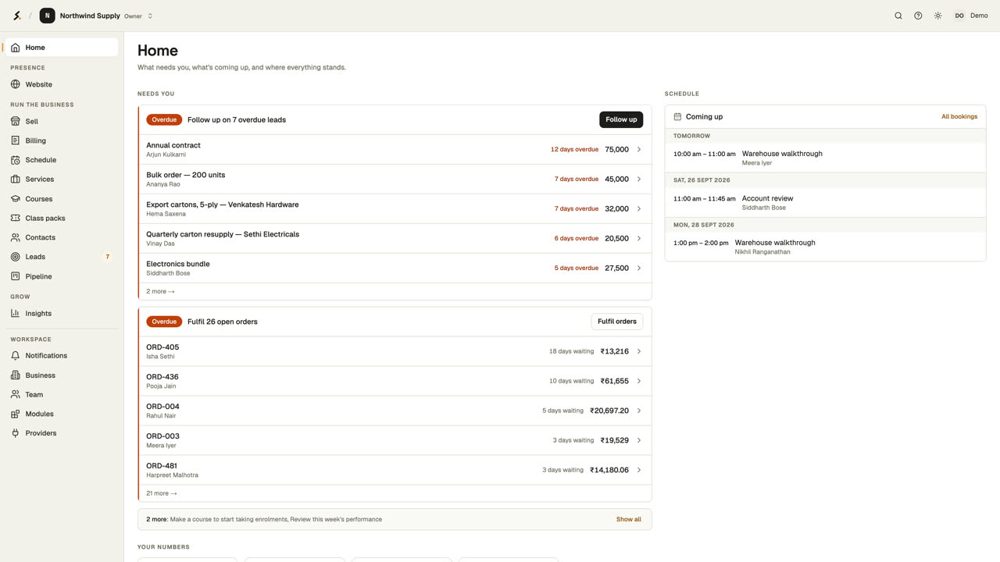

# Saroh

**One place a small business sells, takes bookings, follows up on enquiries,
bills its regulars and keeps a website in step.**

Saroh is built for businesses like a gym, a yoga studio, a clinic, a design
studio or a shop: one login instead of four tools. It is **source-available**,
so you can use, modify and self-host it, including to run your own business
([licence](#licence)).

> **Where it stands:** early, and built in the open. The hosted service is not
> open yet — [join the waitlist at saroh.in](https://saroh.in). The whole
> product runs on your machine today; running your own copy for real use works
> but has no step-by-step guide yet
> ([what it takes](setup-instructions.md#running-your-own-copy)).

## Watch it

[](docs/demos/tour/saroh-tour.mp4)

**[A four-minute tour](docs/demos/tour/saroh-tour.mp4)** of the workspace, with
voice-over: a shop's products and orders, a gym's members, memberships and
invoices, a yoga studio's courses and class packs, a team and its roles, and
the same person seeing less as a member of staff. Filmed from the running
product against the showcase seed, so every screen is real.

## What it does

A business turns on the parts it needs. Each part is a module that can be
switched on or off.

| Area                 | What a business does there                                                                                                                                |
| -------------------- | --------------------------------------------------------------------------------------------------------------------------------------------------------- |
| **Website**          | Pages, posts, publishing, custom domains and draft previews. The site carries the business's brand, never Saroh's                                         |
| **Schedule**         | Services, availability, bookings, rescheduling and outcomes. Classes can run in person or online, and class packs are sold ahead and spent as people book |
| **Courses**          | A course is a fixed set of sessions. Enrolling someone books every session and sends one invoice                                                          |
| **Sell**             | Catalogue, storefront, orders, customers, discounts and CSV import                                                                                        |
| **Contacts & leads** | Everyone the business knows, plus leads, a pipeline and follow-ups                                                                                        |
| **Billing**          | Plans, subscriptions that renew on their own, and invoices, paid by hand or through a pay link on the business's own payment provider                     |
| **Insights**         | Site views, enquiries and sales over the last 7, 30 or 90 days                                                                                            |
| **Team**             | Owners, admins, members and reviewers. Each role sees only what it may use                                                                                |

Messaging (with each contact's consent, over the business's own providers) and
automations exist in the API but have no workspace screens yet. Platform staff
have an admin app for feature flags and the audit log. The
[roadmap](docs/architecture/PRODUCT_ROADMAP.md) tracks what is next.

## Try it

```bash
pnpm install && cp .env.example .env        # fill in DATABASE_URL and BETTER_AUTH_SECRET
npm install -g portless && portless service install --wildcard   # once per machine
pnpm --filter @saroh/database build && pnpm --filter @saroh/database db:migrate:deploy
pnpm --filter @saroh/database db:seed:showcase && pnpm dev:app
```

Open https://app.saroh.localhost and sign in as `demo@saroh.dev` /
`demo-password-123`. The showcase gives that login a gym, a yoga studio, a
clinic and a shop to look around. Every step is explained in
[setup-instructions.md](setup-instructions.md).

## How it is built

A pnpm + Turborepo monorepo:

- **Nine Next.js apps** (Next.js 16, React 19). The main ones are the merchant
  workspace, sign-in, platform admin, the public renderer for merchant sites
  and the marketing site.
- **One NestJS API** (`apps/api.saroh.in`). It hosts **Better Auth**, and it is
  the only service that reads or writes the database.
- **PostgreSQL through Prisma 7.** The **Organization** is the tenant root. Every
  query is scoped to it, and PostgreSQL row-level security backs that up.

## Find your way around

| You want to…                                 | Go to                                                                                                                       |
| -------------------------------------------- | --------------------------------------------------------------------------------------------------------------------------- |
| Run it on your machine                       | [setup-instructions.md](setup-instructions.md)                                                                              |
| Understand what it is for and who it serves  | [PRODUCT.md](PRODUCT.md)                                                                                                    |
| See how the code is meant to be written      | [docs/patterns/](docs/patterns/README.md)                                                                                   |
| Read the decisions behind the architecture   | [DECISIONS.md](docs/architecture/DECISIONS.md) · [ADRs](docs/architecture/adr/)                                             |
| Check what is built and what is risky        | [CURRENT_STATE.md](docs/architecture/CURRENT_STATE.md) · [RISKS_AND_TECH_DEBT.md](docs/architecture/RISKS_AND_TECH_DEBT.md) |
| Look up an app's URL or an environment value | [ENVIRONMENT.md](docs/architecture/ENVIRONMENT.md)                                                                          |
| Debug something odd                          | [DEV_LEARNINGS.md](docs/architecture/DEV_LEARNINGS.md)                                                                      |
| Work on it with an AI coding agent           | [AGENTS.md](AGENTS.md)                                                                                                      |
| Contribute                                   | [CONTRIBUTING.md](CONTRIBUTING.md) · [CLA.md](CLA.md)                                                                       |

| Folder      | Holds                                                               |
| ----------- | ------------------------------------------------------------------- |
| `apps/`     | The API and the Next.js apps                                        |
| `packages/` | Shared code: auth, database, UI, site blocks, emails and utilities  |
| `tooling/`  | ESLint, Tailwind and TypeScript configuration                       |
| `e2e/`      | Playwright tests against the running stack                          |
| `docs/`     | Architecture, patterns and product docs, plus plans kept as history |

## Licence

Saroh is licensed under the **[Elastic License 2.0](LICENSE.md)**.

| What you want to do                                      | Allowed?              |
| -------------------------------------------------------- | --------------------- |
| Read it, learn from it, take ideas from it               | Yes                   |
| Modify it, self-host it, run your own business on it     | Yes                   |
| Build client work on it, run it inside a company         | Yes                   |
| Offer it to third parties as a hosted or managed service | Not without asking us |

There is no fee and no registration. Keep the licence and copyright notices in
the source, and mark any copy you modify. That is all the licence asks. Sites
built with Saroh carry no Saroh branding, and the licence doesn't change that.
The one restriction, on offering Saroh as a hosted service, keeps the hosted
service from simply being resold. If that is what you want to build,
[get in touch](mailto:mohit@saroh.in).

The [Open Source Definition](https://opensource.org/osd) doesn't allow limits on
how software is used, so Saroh is source-available rather than open source.

Saroh is built part-time. Issues and pull requests may wait a while, and a
nudge after a week or two is fair. Your first pull request needs the one-line
agreement in [CLA.md](CLA.md).

## Contact

<mohit@saroh.in>
