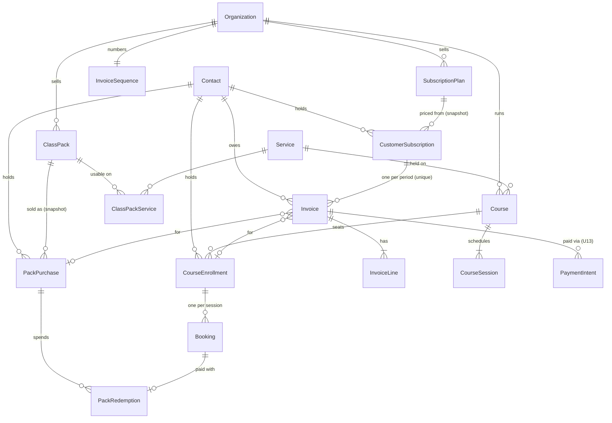
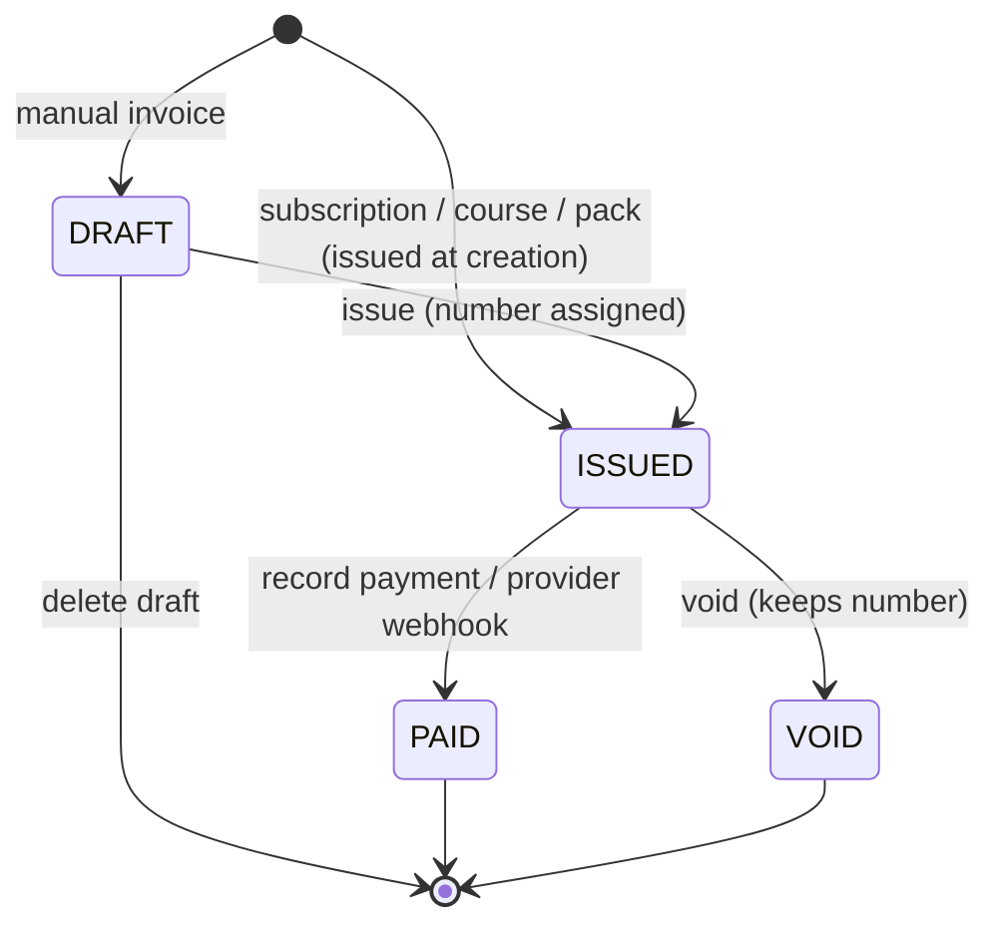
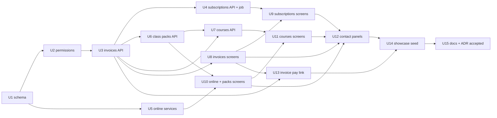

# feat: Subscriptions, invoices, online classes, courses and class packs

## Summary

Add five things a service business sells beyond products and single bookings —
recurring subscriptions invoiced each period, simple numbered invoices, online
classes, fixed-date courses and prepaid class packs — as Organization-owned
records tied to a CRM Contact. One additive migration, new API modules under the
existing Appointments and Payments capabilities, a self-rescheduling renewal
job, workspace screens, contact-page panels, an invoice pay link through the
business's own provider, and a showcase seed that uses all of it.

---

## Problem Frame

Gyms, yoga studios, clinics and coaches — the businesses Saroh is most useful
to — sell memberships, courses and class packs and send invoices. Saroh can list
their classes and take bookings, but cannot say who is a member, what they owe,
when it renews, or how many classes they have left, so that lives in a
spreadsheet beside Saroh. Decisions and the product shape are in ADR-007 (see
origin).

---

## Requirements

- R1. A business can define plans (name, price, interval: week, month, quarter,
  year) and subscribe a contact to one, starting on a chosen date — including a
  date in the past for a member moved over from a spreadsheet.
- R2. Each subscription period produces an invoice automatically on its renewal
  date; no card-on-file or auto-debit. Billing is forward only: a past start
  date keeps its renewal day but invoices only the period containing today.
  Pausing skips renewals; resuming extends the already-invoiced period by the
  days paused (a new invoice only when the pause outlasted it). Cancelling
  stops the next renewal and lets the current period run out, or ends it now.
- R3. A subscription is overdue when **any** of its issued invoices is past its
  due date — derived, never stored — and shows how many are unpaid and the total
  owed.
- R4. Invoices are numbered per business (INV-0001…), have lines, one tax amount
  and a total, move DRAFT → ISSUED → PAID or VOID, and never change once issued.
  A mistake is voided and reissued as a new draft carrying the same links.
- R5. A payment taken outside Saroh (cash, UPI, bank, card at the counter) is
  recorded against an invoice by hand; nothing is charged.
- R6. An invoice can be printed from the browser, legibly in any theme.
- R7. A service can be online, with a meeting link that reaches the business
  and the person who booked, without claiming an email that is not sent.
- R8. A course is a named series of dated sessions on one service with seats
  and a price; enrolling a contact books every remaining session and, when
  Payments is on, issues an invoice.
- R9. A class pack is N credits for a price, valid for D days, on named
  services; selling one records a purchase and, when Payments is on, issues an
  invoice; booking with it spends a credit; cancelling that booking returns it.
  The balance is derived.
- R10. A contact's page shows their subscriptions, packs (with balance), courses
  and invoices, each section degrading on its own and offering its one action
  for this person.
- R11. Only owners and admins manage subscriptions, invoices, courses and packs
  by default; the capability catalogue names each new permission in plain words;
  every client-supplied reference is checked against the caller's business.
- R12. An issued invoice can be paid online through the business's own
  Razorpay/Cashfree via a link, reconciling to PAID from the provider webhook,
  with the amount always taken from the stored invoice.
- R13. The showcase seed carries the new line-up (Northwind Supply, Pulse
  Fitness, Prana Yoga, CarePoint Clinic, Lumen Studio) and exercises every
  feature above with believable volume.

---

## Scope Boundaries

- GST tax invoices (GSTIN, HSN/SAC, CGST/SGST/IGST split, FY numbering).
- Automatic charging: saved cards, UPI AutoPay, e-NACH mandates, retries.
- Invoicing store orders; orders keep their own receipt.
- Hotel stays or any multi-day booking.
- Booking or invoice emails — `booking.notify` still has no handler; nothing in
  the UI may claim a message was sent.
- Hosted video, lessons or course content; an online class is a link only.
- The Pipeline board rework and other UX-audit findings (tracked separately).

### Deferred to Follow-Up Work

- Invoice/renewal reminder messages: once the Communications module sends
  booking and payment messages (separate issue).
- Proration and mid-period plan changes: a later iteration; v1 changes a plan
  by cancelling and subscribing again.
- Customer self-service (a member viewing their own invoices): later, with a
  customer identity.

---

## Context & Research

### Relevant Code and Patterns

- Module layout, guards and gating: `apps/api.saroh.in/src/modules/bookings/`
  (`bookings.module.ts`, `bookings.controller.ts` with `@RequireModule`),
  `docs/patterns/backend-nestjs.md`, gating annotations in
  `apps/api.saroh.in/src/modules/capabilities/module-annotations.spec.ts`.
- Permissions: `apps/api.saroh.in/src/modules/organizations/organization-actions.ts`
  (`OrgAction`, `ORG_ACTIONS`, `READ_ONLY_ACTIONS`), `organization-policy.ts`,
  `capability-catalogue.ts` (+ spec), app mirror `NavAction`/`REACHABLE` in
  `apps/app.saroh.in/components/shared/nav-items.tsx`.
- Module registry: `apps/api.saroh.in/src/modules/capabilities/module-registry.ts`
  (APPOINTMENTS depends on CRM; PAYMENTS has no dependencies, `requiredAction:
payment:read`), readiness adapters in `capabilities/readiness/`.
- Money: `apps/api.saroh.in/src/common/money.ts` (`toMoneyString`),
  cents arithmetic in `modules/orders/orders.service.ts` (`toCents`/`fromCents`),
  order-number retry loop; DEV_LEARNINGS #325 (cents are always ×100).
- Bookings: `modules/bookings/bookings.service.ts` — `reserve()` (the shared
  Serializable reservation), `bookByHand`, `cancelBooking`, `buildSnapshot`;
  public `public-bookings.controller.ts`; site block
  `packages/site-blocks/src/blocks/booking.tsx` (success state ignores the body).
- Jobs: `docs/patterns/backend-jobs.md`, `modules/jobs/` (poll-loop worker,
  lease fencing), handler template `modules/analytics/analytics.module.ts` +
  `analytics-aggregate.handler.ts`, `modules/jobs/job-consumers.spec.ts`.
- Payments: `modules/payments/payments.service.ts` (`createIntentInternal`),
  `payments/providers/provider.port.ts` (Razorpay `receipt`, Cashfree
  `order_id`), `modules/webhooks/webhooks.service.ts` (`findIntent`,
  `applySuccess`), `orders/order-state.ts`.
- Credit/cap races: discount redemption in `modules/discounts/` and
  `orders.service.ts` `recordRedemption` (+ `redeem.spec.ts`).
- Migrations and RLS: `.agents/skills/saroh-migrations/SKILL.md`, template
  `packages/database/prisma/migrations/20260921140000_discount_codes/migration.sql`
  (ENABLE + FORCE RLS, `org_isolation` policy, child tables via EXISTS).
- Workspace: list exemplar `components/stores/orders-screen.tsx` (DataView,
  filters as tabs, `?view=`), `components/services/services-view.tsx`; detail +
  print exemplar `app/(shell)/commerce/orders/[orderId]/page.tsx` with
  `components/commerce/order-actions.tsx` (`print:hidden`, `window.print`);
  forms `components/bookings/edit-service-form.tsx`,
  `components/stores/product-form.tsx`; dialogs
  `components/contacts/add-contact-dialog.tsx`,
  `components/bookings/new-booking-dialog.tsx` (idempotency key per attempt);
  data access `lib/api/http.ts`, `lib/services/{service,actions}.ts`; states
  `@saroh/ui/data-state`; money `lib/format/money.ts`.
- Contact page `app/(shell)/contacts/[contactId]/page.tsx` (sections after
  Leads); booking detail `components/bookings/booking-detail.tsx`.

### Institutional Learnings

- DEV_LEARNINGS "Jobs — a stale worker re-sends…": terminal job writes are
  fenced on `(id, PROCESSING, lockedBy)`; handlers must be idempotent.
- DEV_LEARNINGS "booking notifications recorded as delivered, never sent":
  every produced job type needs a handler (`job-consumers.spec.ts` enforces it).
- `packages/database/src/rls-proxy.ts`: under an org context with RLS
  enforcement on, `wrapTransaction` drops `$transaction` options — Serializable
  silently degrades. New race-sensitive paths cannot rely on isolation level.
- DEV_LEARNINGS #286: DTO classes only; no implicit conversion.
- `docs/patterns/frontend-data-and-state.md`: a failed read is not an empty
  read; required reads are never wrapped in try/catch (it swallows
  `forbidden()`).
- `scripts/check-app-routes.mjs` does not check `href:` keys in
  `nav-items.tsx`; every page must exist before its nav row is added.

### External References

- None used; the codebase has strong local patterns for every layer.

---

## Key Technical Decisions

- **Names:** `SubscriptionPlan`, `CustomerSubscription`, `Invoice`,
  `InvoiceLine`, `InvoiceSequence`, `Course`, `CourseSession`,
  `CourseEnrollment`, `ClassPack`, `ClassPackService`, `PackPurchase`,
  `PackRedemption`. Saroh's own `Plan`/`Subscription` (DEC-014) stay untouched.
- **Ownership and tenant checks:** every new table carries a required, indexed
  `organizationId` and links to `Contact` (CRM), never `Customer`/`Store`. RLS
  is off by default and foreign keys ignore organization, so every
  client-supplied reference (contact, plan, service, pack, purchase, course,
  invoice) is loaded with its organization before use — a miss is a 404 — and
  child rows take `organizationId` from the verified parent, never from input
  (the `assertTargets` pattern in `modules/discounts/`).
- **Money:** `Decimal(12,2)` for every new amount (matching `Order`), computed
  by the API in integer minor units; strings across the wire. Service keeps its
  existing `priceCents`.
- **Snapshots:** a subscription, purchase and enrollment copy the price,
  currency (and interval, credits, validity) at the moment of sale. A
  subscription also snapshots its **timezone** (IANA), defaulting to a new
  `BusinessProfile.timezone`, because no business-level timezone exists today.
  An issued invoice snapshots its **bill-to** name and email, so a printed or
  paid invoice never changes when the contact is edited or deleted.
- **Invoice numbering:** a per-business counter allocated with one statement —
  insert-or-increment on `InvoiceSequence` returning the new value — on the
  caller's transaction. No count-and-retry, no dependence on isolation level,
  and the first invoice of a business needs no pre-existing row. Drafts have no
  number; a voided invoice keeps its number.
- **Invoice sources and reissue:** an invoice records what it is for
  (subscription period, course enrollment, pack purchase, or manual).
  Subscription invoices carry `(subscriptionId, periodStart)` with a **partial**
  unique index over non-VOID invoices — the renewal job's idempotency key, which
  still lets a voided period be reissued. "Void and reissue" voids and opens a
  draft with the same contact, source link and lines.
- **Due date and status wording:** issued invoices are due seven days after
  issue (overridable on manual invoices). Tabs never overlap: Issued means
  issued and not yet due; Overdue means issued and past due. Nothing is sent to
  the customer, and every issue surface says so.
- **Renewal trigger:** there is no scheduler, so `subscription.renew` is a
  self-rescheduling job. A partial unique index allows one PENDING run of that
  type; the next run is enqueued with insert-on-conflict-do-nothing (at boot and
  at the end of every run), so duplicates collapse. The handler never throws —
  per-subscription failures are logged and retried on the next run — so the
  worker never dead-letters the chain.
- **Renewal semantics (forward only):** a period advances at most to the period
  containing now, in one transaction per subscription, taking the subscription
  row lock that pause/resume/cancel also take. Backdated subscriptions invoice
  only the current period. Resume extends `currentPeriodEnd` by the paused
  length inside an invoiced period. Renewal skips businesses whose Payments
  module is off ("disabling stops new activity", ADR-003).
- **Period arithmetic:** calendar intervals anchored to the start date in the
  subscription's timezone, clamped to month end (31 Jan → 28/29 Feb → 31 Mar),
  using luxon.
- **Race safety without Serializable:** pack redemption and course enrollment
  take a row lock on the purchase / course inside their transaction before
  counting, so they stay correct when the RLS proxy drops the isolation level.
- **One reservation core:** `reserve()`'s body becomes a `reserveInTx(tx, …)`
  that takes the caller's transaction and an option to skip the weekly-hours
  check; `reserve()` keeps its own transaction and error mapping. Course
  enrollment and pack redemption call it inside their single transaction, so a
  later failure leaves nothing behind.
- **Courses and capacity:** a course's seats may not exceed its service's
  capacity. Course sessions are real bookings on the course's service, linked
  to the enrollment. When counting capacity for non-course bookings on a
  session slot, the course's unfilled seats count as taken, so public bookers
  cannot take seats the course promised. Course-session bookings do not enqueue
  `booking.notify` (no handler exists; one enrolment would log eight failures).
- **Enrollment lifecycle:** `CourseEnrollment` has a status (ACTIVE,
  CANCELLED); a partial unique index over ACTIVE rows allows re-enrolling after
  a cancellation; seats count ACTIVE enrolments.
- **Payments off:** selling a pack or enrolling in a course with Payments off
  records the purchase or enrolment and the price paid, issues no invoice, and
  no copy mentions one. The internal issuing function runs under the caller's
  `pack:write` / `course:write`; it does not need `invoice:write`.
- **Capability gating:** courses, packs and online fields sit under
  APPOINTMENTS; subscriptions and invoices under PAYMENTS (no dependencies, so a
  gym need not turn on Sell). `@RequireModule` gains a readiness opt-out so
  PAYMENTS's "no provider connected" setup blocker does not refuse a business
  that records payments by hand once module enforcement is on.
- **Online classes:** `Service.locationType` (`IN_PERSON` | `ONLINE`) and
  `meetingUrl` (https only). Frozen into the booking snapshot; returned to the
  booker in a booker-safe projection of the public booking response (never the
  whole row) and shown in the site block's confirmation; never in the public
  services list. The link is a shared credential disclosed to every public
  booker without payment — recorded in ADR-007, and the service form tells the
  merchant to use a passcode, a waiting room or per-session links for paid
  classes.
- **Packs:** a pack must be unexpired at the booked session's start. When a
  person holds several usable packs, the one expiring soonest is spent and
  named. Public site bookings do not spend packs in v1; a merchant attaches a
  pack to an existing booking from its page.
- **Contact deletion:** holdings (subscriptions, purchases, enrollments)
  cascade; the contact's future course and pack-redeemed bookings are cancelled
  in the same transaction; invoices keep their bill-to snapshot with the contact
  link cleared and any pay link revoked. The delete confirmation names what goes.
- **Permissions:** four read/write pairs — `subscription:*`, `invoice:*`,
  `course:*`, `pack:*` — OWNER/ADMIN only (not in `READ_ONLY_ACTIONS`), labelled
  in the capability catalogue. Stored custom roles are not auto-granted
  (existing behaviour); built-in roles are. The workspace never requests a read
  the viewer's role lacks — a 403 from the app's HTTP layer replaces the whole
  page.
- **Navigation:** Schedule becomes a section like Sell (Bookings, Services,
  Courses, Class packs); a new Billing section (Subscriptions — with plans
  inside it — and Invoices), gated by PAYMENTS and actions. Each unit that ships
  a page adds its own rail rows and ⌘K entries after the page exists; active
  state is matched per route prefix since `/courses` and `/class-packs` are not
  nested under `/bookings`.
- **Pay link (U13):** `PaymentIntent` gains a nullable `invoiceId` beside a
  now-nullable `orderId`, with a CHECK that exactly one is set — additive, one
  deploy. The amount always derives from the stored invoice; the public request
  takes no amount. The token is ≥128 bits, stored only as a hash, never logged,
  keyed alone in the public route, rotatable, revoked on VOID or contact
  deletion, generated lazily the first time a link is requested (so invoices
  issued before U13 are covered). The public page shows an explicit allow-list
  (business, number, dates, lines, tax, total, status, billed-to name), sends
  no-referrer and noindex, and is rate-limited.

---

## Open Questions

### Resolved During Planning

- Where do these live when a business has no storefront? Organization +
  Contact.
- Does PAYMENTS force Commerce on? No — it has no dependencies; a readiness
  opt-out keeps pay-by-hand businesses working under enforcement.
- How is a daily job triggered with no cron? Self-rescheduling job, one PENDING
  run guaranteed by a partial unique index, never throwing.
- How to stay race-safe when RLS drops Serializable? Row locks, and one
  reservation core that runs in the caller's transaction.
- Whose timezone sets renewal dates? The subscription's snapshotted zone,
  defaulting to a new business-level timezone.
- Moving members over and resuming? Forward-only billing (decided with the
  user).
- Payments off? Record without invoices (decided with the user).
- Navigation? Two sections: Schedule and Billing (decided with the user).
- CarePoint demo role? Member, deliberately — the film shows a Member's
  restricted view there (decided with the user).
- Renewals for a business that turned Payments off? Skipped until it is back on.

### Deferred to Implementation

- Whether Payments' contact pickers need CRM switched on under module
  enforcement (contacts are CRM reads) — resolve in U3 by reading the contacts
  controller's gating; enforcement is dark today.
- Tick interval of the renewal job — hourly unless the jobs module suggests
  otherwise.
- Public pay page route on saroh.app — settle in U13 alongside the existing
  public order payment page.
- Copy for every new screen — written with the screens, checked against
  `saroh-product.md`.

---

## Output Structure

    apps/api.saroh.in/src/modules/
      invoices/           invoices.{module,controller,service}.ts, dto.ts, numbering.ts, *.spec.ts
      subscriptions/      subscriptions.{module,controller,service}.ts, periods.ts,
                          subscription-renew.handler.ts, dto.ts, *.spec.ts
      courses/            courses.{module,controller,service}.ts, dto.ts, *.spec.ts
      class-packs/        class-packs.{module,controller,service}.ts, dto.ts, *.spec.ts
    apps/app.saroh.in/
      app/(shell)/invoices/            page, [invoiceId]/page, new/page, layout, loading, error
      app/(shell)/subscriptions/       page, plans/page, plans/[planId]/page, layout, loading, error
      app/(shell)/courses/             page, [courseId]/page, new/page, layout, loading, error
      app/(shell)/class-packs/         page, [packId]/page, layout, loading, error
      components/{invoices,subscriptions,courses,class-packs}/
      lib/{invoices,subscriptions,courses,class-packs}/{service,actions}.ts (+ *.test.ts)

---

## High-Level Technical Design

> _This illustrates the intended approach and is directional guidance for review, not implementation specification. The implementing agent should treat it as context, not code to reproduce._

Renewal (per due subscription, one transaction): lock the subscription → if
ACTIVE and `currentPeriodEnd <= now` → issue invoice for
`[currentPeriodEnd, next)` (unique on subscription + period start; a duplicate
means already renewed → skip) → advance the period. Cancelled-at-period-end
subscriptions end instead of renewing; paused ones are skipped.

---

## Implementation Units

### U1. Data model and migration

**Goal:** Every new table and field, in one additive migration with RLS
policies and the partial indexes the design relies on.

**Requirements:** R1, R2, R4, R7, R8, R9 (foundation)

**Dependencies:** None

**Files:**

- Modify: `packages/database/prisma/schema.prisma`
- Create: `packages/database/prisma/migrations/<timestamp>_subscriptions_invoices_classes/migration.sql`
- Test: migration replay (`db:verify:replay`); `packages/database/src/rls-proxy.test.ts` only if the proxy needs to learn new models

**Approach:**

- Tables: `SubscriptionPlan`; `CustomerSubscription` (status, period, pause
  marker, cancel-at-period-end, snapshot price/currency/interval/timezone);
  `Invoice` (number, status, dates, totals, source links, bill-to name and
  email snapshot); `InvoiceLine`; `InvoiceSequence` (one row per business);
  `Course`; `CourseSession`; `CourseEnrollment` (status ACTIVE/CANCELLED);
  `ClassPack`; `ClassPackService`; `PackPurchase`; `PackRedemption` (unique
  `bookingId`, reversed marker).
- Additive columns: `Service.locationType` (default `IN_PERSON`),
  `Service.meetingUrl`; `Booking.courseEnrollmentId` (nullable, SetNull);
  `BusinessProfile.timezone` (nullable IANA).
- Constraints: unique `(organizationId, number)` on Invoice; **partial** unique
  `(subscriptionId, periodStart)` where status ≠ VOID; **partial** unique
  `(courseId, contactId)` where status = ACTIVE; **partial** unique on
  `Job(type)` where type = `subscription.renew` and status = PENDING. Each raw
  partial index is also declared in `schema.prisma` where Prisma can express
  it, per the migrations skill.
- Every tenant table: required indexed `organizationId`, ENABLE + FORCE RLS and
  an `org_isolation` policy.
- Contact deletion: holdings cascade; invoices keep their snapshot with the
  contact link SetNull.

**Patterns to follow:**

- `migrations/20260921140000_discount_codes/migration.sql` (RLS policy form),
  `20260921160000_product_reviews` (recent additive migration).

**Test scenarios:**

- Test expectation: schema only — verified by migration replay onto an empty
  database matching `schema.prisma`, and the existing suites still passing.

**Verification:**

- Replay passes; Prisma types exist for every new model; no existing column
  changed type or nullability.

### U2. Permissions and capability catalogue

**Goal:** The eight new actions exist, owners and admins hold them, and the
roles screen names them.

**Requirements:** R11

**Dependencies:** U1

**Files:**

- Modify: `apps/api.saroh.in/src/modules/organizations/organization-actions.ts`
- Modify: `apps/api.saroh.in/src/modules/organizations/capability-catalogue.ts`
- Modify: `apps/app.saroh.in/components/shared/nav-items.tsx` (`NavAction`, `REACHABLE`)
- Test: `apps/api.saroh.in/src/modules/organizations/capability-catalogue.spec.ts`, `organization-policy.spec.ts`, `apps/app.saroh.in/lib/nav/nav-items.test.ts`

**Approach:**

- `subscription:read|write`, `invoice:read|write` in the `money` group;
  `course:read|write`, `pack:read|write` in the `schedule` group. None in the
  MEMBER floor; REVIEWER untouched.

**Test scenarios:**

- Happy path: OWNER and ADMIN resolve all eight; MEMBER and REVIEWER resolve none.
- Edge case: a stored custom role without them is not granted them silently.
- Error path: the catalogue spec fails if any new action lacks a plain-word label.

**Verification:**

- The roles screen lists the new permissions with labels; policy specs pass.

### U3. Invoices API

**Goal:** Create, edit, issue, void and reissue, record payment, list and read
invoices; an internal issuing function the other modules call inside their
transactions.

**Requirements:** R4, R5, R6, R11

**Dependencies:** U2

**Files:**

- Create: `apps/api.saroh.in/src/modules/invoices/` (module, controller, service, dto, numbering)
- Modify: `apps/api.saroh.in/src/app.module.ts`, `apps/api.saroh.in/jest.config.js` (register specs), `apps/api.saroh.in/src/modules/capabilities/module-annotations.spec.ts`, `modules/capabilities/require-module.decorator.ts` and `module-enforcement.guard.ts` (readiness opt-out)
- Test: `apps/api.saroh.in/src/modules/invoices/invoices.service.spec.ts`, `numbering.spec.ts`, additions to `modules/capabilities/module-enforcement*.spec.ts`

**Approach:**

- Routes under the organization, `@RequireModule("PAYMENTS")` with the readiness
  opt-out; `invoice:read` / `invoice:write`.
- Manual draft (contact + lines + tax + due date) → edit while DRAFT → issue.
  Delete a DRAFT (refused once issued). Issue allocates the number with the
  insert-or-increment statement on the caller's transaction and snapshots the
  bill-to name and email.
- Void (reason) → VOID. "Void and reissue" voids and returns a new DRAFT with
  the same contact, source link and lines.
- Record payment: method (cash, UPI, bank transfer, card at counter, other),
  optional reference and note, paid date → PAID.
- Totals computed in minor units from lines, tax added, stored as Decimal
  strings.
- List filters: draft, issued (not yet due), overdue, paid, void; per-contact
  and per-subscription reads with the unpaid count and total.
- Every client-supplied contact id is verified against the business.
- Exported issuing function for U4, U6 and U7, run on their transaction.

**Patterns to follow:**

- `modules/discounts/` (money module, `assertTargets`), order totals in
  `orders.service.ts`, `authorize` + 404-for-other-org convention.

**Test scenarios:**

- Happy path: a draft with two lines and tax totals correctly (1 × ₹1,200 + 2 ×
  ₹500 + ₹396 tax = ₹2,596.00); issuing assigns INV-0001, the next INV-0002.
- Happy path: the first invoice of a business with no counter row gets
  INV-0001.
- Happy path: recording a UPI payment marks it PAID with method and date.
- Happy path: void and reissue of a subscription-period invoice produces a
  draft for the same period, and issuing it succeeds despite the voided one.
- Edge case: two concurrent issues in one business get distinct consecutive
  numbers.
- Edge case: issued-and-due-tomorrow is in Issued, not Overdue; past due is in
  Overdue only.
- Edge case: editing the contact after issue leaves the invoice's bill-to name
  unchanged.
- Error path: deleting or editing an ISSUED invoice is refused; paying a VOID or
  DRAFT invoice is refused; a line with quantity 0 or negative price is refused.
- Error path: another business's contact on a new invoice, or another
  business's invoice, is a 404; MEMBER is refused.
- Integration: the issuing function called inside a caller's transaction rolls
  back with it (no orphaned number).
- Integration: with module enforcement on, a business with PAYMENTS enabled and
  no provider connected can still issue and record invoices.

**Verification:**

- Owners can issue, pay, void and reissue invoices through the API; numbers
  never repeat within a business.

### U4. Subscriptions API and renewal job

**Goal:** Plans and subscriptions with pause, resume and cancel, and a job that
issues each period's invoice, forward only.

**Requirements:** R1, R2, R3, R11

**Dependencies:** U3

**Files:**

- Create: `apps/api.saroh.in/src/modules/subscriptions/` (module, controller, service, dto, `periods.ts`, `subscription-renew.handler.ts`)
- Modify: `apps/api.saroh.in/src/app.module.ts`, `jest.config.js`, `module-annotations.spec.ts`, `apps/api.saroh.in/src/modules/jobs/job-consumers.spec.ts` (if the produced/handled lists are explicit), business profile DTO/service for `timezone`
- Test: `subscriptions.service.spec.ts`, `periods.spec.ts`, `subscription-renew.handler.spec.ts`

**Approach:**

- Plans: create, edit (future sales only), archive.
- Subscribe: contact, plan, start date (past allowed) → snapshot price,
  currency, interval and timezone; set the current period to the one containing
  today; issue only that period's invoice.
- Pause, resume, cancel (now, or at period end) — each takes the subscription
  row lock. Resume extends `currentPeriodEnd` by the paused length inside an
  invoiced period; a new period and invoice only when the pause outlasted it.
- Renewal handler, per due subscription in its own transaction: advance at
  most to the period containing now, issue that period's invoice (a duplicate
  on the partial unique key means already renewed → skip), end subscriptions
  cancelled at period end; skip businesses with Payments off. Catch and log
  everything; never throw. Enqueue the next run with insert-on-conflict-do-
  nothing; module init does the same.
- Read model: status, current period, next renewal, unpaid count and total,
  overdue (any issued invoice past due), oldest unpaid invoice.
- Every client-supplied contact and plan id is verified against the business.

**Execution note:** Implement `periods.ts` test-first — month-end clamping,
leap years, timezone boundaries and backdated anchors are where this goes wrong.

**Patterns to follow:**

- `modules/analytics/analytics.module.ts` handler registration,
  `docs/patterns/backend-jobs.md`, lease fencing in `modules/jobs/`.

**Test scenarios:**

- Happy path: monthly from 31 Jan renews 28 Feb (29 in a leap year), then 31 Mar.
- Happy path: subscribing with a start date six months back invoices only the
  period containing today; no earlier periods are billed.
- Happy path: the handler renews a due subscription once and advances it.
- Happy path: pause on day 5 of a paid 30-day period, resume on day 10 → the
  period end moves 5 days later and no invoice is issued; pause then Undo within
  seconds → nothing changes.
- Edge case: a pause that outlasts the invoiced period → resume starts a new
  period with one invoice.
- Edge case: running the handler twice for the same period issues one invoice;
  two pending runs collapse to one.
- Edge case: an unpaid previous-period invoice still marks the subscription
  overdue after the next period's invoice is issued.
- Edge case: a period boundary at local midnight uses the subscription's
  timezone, not UTC.
- Edge case: cancel at period end → no new invoice, CANCELLED after the period;
  cancel now → CANCELLED, no future invoices; cancel racing a renewal never
  produces an invoice after the cancel.
- Edge case: a business with Payments off gets no renewal invoices.
- Error path: subscribing to an archived plan, or another business's plan or
  contact, is refused (404 for other-business ids).
- Integration: a thrown database error inside one subscription's renewal is
  logged, the rest renew, and the next run is still enqueued.

**Verification:**

- A subscription created today shows its first invoice and next renewal date; a
  simulated clock past the renewal produces exactly one new invoice.

### U5. Online classes

**Goal:** A service can be online with a meeting link that reaches the booker.

**Requirements:** R7

**Dependencies:** U1

**Files:**

- Modify: `apps/api.saroh.in/src/modules/bookings/dto.ts`, `bookings.service.ts` (`buildSnapshot`, service read/select), `public-bookings.controller.ts` (booker-safe response)
- Modify: `packages/site-blocks/src/blocks/booking.tsx`
- Modify: `docs/architecture/adr/ADR-007-subscriptions-invoices-classes.md` (the link is a shared credential)
- Test: `apps/api.saroh.in/src/modules/bookings/bookings.service.spec.ts`, `public-bookings.controller.spec.ts`, `packages/site-blocks/src/blocks/booking.test.tsx`

**Approach:**

- `locationType` + `meetingUrl` on create/update; https URL required when
  ONLINE; cleared when switched back to IN_PERSON.
- Frozen into the booking snapshot; the merchant booking read includes it.
- The public booking response becomes a booker-safe projection (time, service
  name, and the booker's own link) instead of the raw booking row — including
  the idempotent replay path.
- The site block's success state shows "Join online" with the link when present.

**Test scenarios:**

- Happy path: booking an online service returns and snapshots its link.
- Edge case: changing the service's link later does not change existing
  bookings' links.
- Edge case: an idempotent replay returns the same booker-safe shape.
- Error path: ONLINE without a link, or an `http:`/`javascript:` URL, is refused.
- Integration: the public services list never contains `meetingUrl`; the public
  booking response contains no internal ids beyond the booking reference.
- Happy path (site block): a response with a link renders the join link;
  without one, the existing message is unchanged.

**Verification:**

- Booking an online class on a published site shows the link on the
  confirmation; the merchant sees it on the booking.

### U6. Class packs API

**Goal:** Packs, selling a pack to a contact, booking with a pack (new or
existing booking), credit back on cancel, derived balance.

**Requirements:** R9, R11

**Dependencies:** U3

**Files:**

- Create: `apps/api.saroh.in/src/modules/class-packs/`
- Modify: `apps/api.saroh.in/src/modules/bookings/bookings.service.ts` (extract `reserveInTx`; redemption hook; `cancelBooking` reverses redemptions), `bookings/dto.ts` (`packPurchaseId` on book-by-hand)
- Modify: `app.module.ts`, `jest.config.js`, `module-annotations.spec.ts`
- Test: `class-packs.service.spec.ts`, additions to `bookings.service.spec.ts`

**Approach:**

- Pack CRUD with eligible services (each verified against the business).
- Sell → purchase with snapshot credits, price, expiry; an issued invoice in
  the same transaction when Payments is on.
- Booking with a pack (book-by-hand, or "Use a class pack" on an existing
  booking): lock the purchase row, check contact, eligible service, unexpired at
  the session's start, credits left; record the redemption. When several packs
  qualify, spend the one expiring soonest.
- Cancelling the booking reverses the redemption.
- Balance = credits − live redemptions; list purchases per contact.

**Patterns to follow:**

- Discount redemption race handling (`modules/discounts/redeem.spec.ts`).

**Test scenarios:**

- Happy path: a 10-class pack after 3 bookings shows 7 left; cancelling one
  shows 8.
- Happy path: "Use a class pack" on an existing booking spends a credit.
- Edge case: two concurrent bookings on the last credit → one succeeds, one is
  refused with a plain reason.
- Edge case: a pack valid until the 12th cannot pay for a session on the 15th,
  even when booked on the 1st.
- Edge case: with two usable packs, the one expiring soonest is spent.
- Edge case: with Payments off, selling records the purchase and issues no
  invoice.
- Error path: another business's pack, purchase or service is a 404; another
  contact's pack cannot be used; archived packs cannot be sold.
- Integration: a failed capacity check leaves no redemption; a redemption never
  exists without its booking.

**Verification:**

- Selling a pack shows a balance (and an invoice when Payments is on); booking
  with it spends a credit, cancelling returns it.

### U7. Courses API

**Goal:** Courses with dated sessions, enrolment that books every remaining
session, cancelling an enrolment, and sessions added later.

**Requirements:** R8, R11

**Dependencies:** U3, U6 (`reserveInTx`)

**Files:**

- Create: `apps/api.saroh.in/src/modules/courses/`
- Modify: `apps/api.saroh.in/src/modules/bookings/bookings.service.ts` (capacity counting honours unfilled course seats; course bookings skip `booking.notify`)
- Modify: `apps/api.saroh.in/src/modules/contacts/contacts.service.ts` (deletion cancels future course and pack bookings; reports what went)
- Modify: `app.module.ts`, `jest.config.js`, `module-annotations.spec.ts`
- Test: `courses.service.spec.ts`, additions to `bookings.service.spec.ts`, `contacts.service.spec.ts`

**Approach:**

- Course: service (verified against the business), name, description, price,
  seats (≤ the service's capacity, rechecked when capacity is lowered), status
  and sessions.
- Enrol: lock the course row; refuse a course whose sessions are all past; seats
  left and not already actively enrolled; create the enrollment; `reserveInTx`
  for each remaining session with the hours check skipped; issue the invoice
  (amount editable at enrolment, defaulting to the course price) when Payments
  is on — one transaction.
- Adding a session to a course with enrolments books every active enrollee into
  it, refused if capacity would be exceeded.
- Cancel enrolment: CANCELLED, cancel its future bookings; the invoice stays
  (voiding is a separate act offered by the dialog).
- Removing a session with bookings is refused.

**Test scenarios:**

- Happy path: enrolling in an 8-session course creates 8 bookings and one
  invoice for the course price.
- Happy path: enrolling after 2 of 8 sessions books the remaining 6.
- Happy path: adding a 9th session books every active enrollee.
- Edge case: the last seat taken concurrently → one enrollment, one refusal.
- Edge case: when the 3rd of 8 sessions is full, zero bookings exist afterwards
  — with RLS enforcement both on and off.
- Edge case: a public booking cannot take a session slot's seats that the
  course still has open.
- Edge case: re-enrolling after a cancellation succeeds.
- Error path: enrolling twice, in a closed course, or one whose sessions are all
  past, is refused; seats above the service's capacity are refused.
- Integration: cancelling an enrolment cancels only future sessions; deleting a
  contact cancels their future course bookings.

**Verification:**

- A course with enrolled people shows every session on the schedule with the
  right attendees and no stray `booking.notify` failures in the worker log.

### U8. Invoices screens

**Goal:** Invoices list, detail (printable), new manual invoice, issue, record
payment, void and reissue — and the Billing rail rows and ⌘K entry for them.

**Requirements:** R3, R4, R5, R6

**Dependencies:** U3

**Files:**

- Create: `apps/app.saroh.in/app/(shell)/invoices/` (page, `[invoiceId]/page.tsx`, `new/page.tsx`, layout with `ModuleGate moduleKey="PAYMENTS"`, loading, error)
- Create: `apps/app.saroh.in/components/invoices/` (list screen, detail, record-payment dialog, issue confirm, void-and-reissue, line editor)
- Create: `apps/app.saroh.in/lib/invoices/{service,actions}.ts`, `lib/invoices/status.ts`
- Modify: `apps/app.saroh.in/components/shared/nav-items.tsx` (Billing section with Invoices), `components/shared/command-menu.tsx` (New invoice), `app/workspace.css` or tokens (print uses light tokens)
- Test: `apps/app.saroh.in/lib/invoices/status.test.ts`, `lib/nav/nav-items.test.ts`

**Approach:**

- List: DataView tabs Draft / Issued / Overdue / Paid / Void (no overlap),
  columns number, contact, for, issued, due, total, status.
- Issue is a ConfirmDialog naming contact and total ("its lines can't change
  after this"); after issue, copy says Saroh does not send it — print it or
  share the pay link. Renewal invoices read "Issued automatically · not sent".
- Record payment is a dialog; Void (and "Void and reissue") and delete-draft are
  ConfirmDialogs.
- Detail laid out like the order page; `print:hidden` on actions; print forces
  light tokens so a dark-theme print is dark text on white.

**Test scenarios:**

- Happy path (status helper): ISSUED past due → "Overdue"; ISSUED due tomorrow →
  "Due tomorrow"; PAID → "Paid".
- Edge case: an invoice whose contact was deleted shows its bill-to name, not a
  broken link.
- Happy path (nav): OWNER with PAYMENTS sees Billing › Invoices; MEMBER does not.

**Verification:**

- In the browser (devtools, seeded data): create → issue → record payment →
  print preview shows only the invoice, legibly from the dark theme; void and
  reissue opens a draft; failed read shows the failed state; checked in the four
  scenes (desk, 390px phone, bright, dark) with 44px targets in the line editor.

### U9. Subscriptions screens

**Goal:** Plans and subscriptions, with subscribe, pause, resume and cancel,
unpaid invoices per subscription, and the Billing › Subscriptions rail row.

**Requirements:** R1, R2, R3

**Dependencies:** U4, U8

**Files:**

- Create: `apps/app.saroh.in/app/(shell)/subscriptions/` (page, `plans/page.tsx`, `plans/[planId]/page.tsx`, layout, loading, error)
- Create: `apps/app.saroh.in/components/subscriptions/` (list, plan form, subscribe dialog, cancel dialog)
- Create: `apps/app.saroh.in/lib/subscriptions/{service,actions}.ts`, `lib/subscriptions/renewal.ts`
- Modify: `components/shared/nav-items.tsx` (Billing › Subscriptions), `components/shared/command-menu.tsx` (Subscribe someone)
- Test: `apps/app.saroh.in/lib/subscriptions/renewal.test.ts`

**Approach:**

- List tabs Active (up to date) / Overdue / Paused / Cancelled; each row: person,
  plan, next renewal, unpaid count and total linking to the oldest unpaid
  invoice. Two or more periods overdue shows a "Pause or cancel" prompt.
- Subscribe dialog: contact, plan, start date (DatePicker); a past date explains
  in words which period is invoiced now and that earlier periods are not billed.
- Pause and resume are reversible (Undo toast). Cancel asks "now or at the end
  of this period" and names any open invoice with an unchecked "Void it too".

**Test scenarios:**

- Happy path (renewal helper): wording for "Renews 1 Oct", "Ends 1 Oct" (cancel
  at period end), "Paused".
- Happy path (renewal helper): a backdated start explains the current period.
- Edge case: an overdue subscription shows "2 invoices overdue · ₹3,000".

**Verification:**

- Subscribing a contact shows the subscription and its first invoice; pause →
  Undo restores it; checked in the four scenes.

### U10. Online services, class packs screens and booking with a pack

**Goal:** Online toggle and link on services and bookings; packs list/editor,
sell-a-pack dialog; "use a class pack" in New booking and on booking detail;
Schedule becomes a section with its new rows.

**Requirements:** R7, R9

**Dependencies:** U5, U6

**Files:**

- Modify: `apps/app.saroh.in/components/bookings/edit-service-form.tsx`, `create-service-form.tsx`, `booking-detail.tsx`, `new-booking-dialog.tsx`, `lib/services/service.ts`
- Create: `apps/app.saroh.in/app/(shell)/class-packs/` and `components/class-packs/`, `lib/class-packs/{service,actions}.ts`, `lib/class-packs/balance.ts`
- Modify: `components/shared/nav-items.tsx` (Schedule becomes a section: Bookings, Services, Class packs), `components/shared/command-menu.tsx` (New class pack)
- Test: `apps/app.saroh.in/lib/class-packs/balance.test.ts`, `lib/nav/nav-items.test.ts`

**Approach:**

- Service form: "Where it happens" In person / Online (segmented), link field
  when online, with help text about passcodes or per-session links for paid
  classes.
- Booking detail: "Join online" with a Copy link action for online bookings;
  "Use a class pack" when the person holds a usable one.
- New booking: when the chosen person has a usable pack for the service, offer
  it by name ("Morning pack · 7 left, expires 12 Oct"); otherwise unchanged.
- Packs: list (name, classes, valid for, price, sold), editor, sell dialog
  (mentions an invoice only when Payments is on).

**Test scenarios:**

- Happy path (balance helper): 10 credits, 3 live redemptions → "7 left";
  expired → "Expired".
- Edge case: a pack that doesn't cover the chosen service isn't offered.
- Happy path (nav): Schedule section lists Bookings, Services, Class packs and
  keeps Schedule lit on `/class-packs`.

**Verification:**

- Booking a person with a pack from New booking, or attaching one on booking
  detail, reduces their balance on the contact page; checked in the four scenes.

### U11. Courses screens

**Goal:** Courses list, editor with sessions, roster with enrol and cancel, and
the Schedule › Courses row.

**Requirements:** R8

**Dependencies:** U7, U10

**Files:**

- Create: `apps/app.saroh.in/app/(shell)/courses/` (page, `[courseId]/page.tsx`, `new/page.tsx`, layout, loading, error)
- Create: `apps/app.saroh.in/components/courses/`, `lib/courses/{service,actions}.ts`, `lib/courses/seats.ts`
- Modify: `components/shared/nav-items.tsx` (Schedule › Courses), `components/shared/command-menu.tsx` (New course)
- Test: `apps/app.saroh.in/lib/courses/seats.test.ts`

**Approach:**

- Editor: service, name, price, seats (limited to the service's capacity),
  sessions (date + time pickers, list with remove). Course page: sessions,
  roster, seats left, "Enrol someone".
- Enrol dialog states what it books and charges ("Books the 6 sessions left of
  8 · invoice ₹X", amount editable; no invoice line when Payments is off).
- Cancel enrolment is a ConfirmDialog (cancelled bookings can't be undone) that
  names the open invoice with an unchecked "Void it too".

**Test scenarios:**

- Happy path (seats helper): 12 seats, 9 enrolled → "3 seats left"; full →
  "Full".
- Edge case: a started course shows how many sessions remain for a new enrolee.

**Verification:**

- Enrolling shows the person on every remaining session in Schedule; checked in
  the four scenes with 44px targets in the session editor.

### U12. Contact panels

**Goal:** One place per person: subscriptions, packs, courses and invoices on
the contact page, each with its action.

**Requirements:** R10, R11

**Dependencies:** U8, U9, U10, U11

**Files:**

- Modify: `apps/app.saroh.in/app/(shell)/contacts/[contactId]/page.tsx`
- Create: `apps/app.saroh.in/components/contacts/{subscriptions,packs,courses,invoices}-panel.tsx`
- Modify: the subscribe, sell-pack, enrol and new-invoice dialogs to accept a preselected contact; contact delete confirmation copy
- Test: `apps/app.saroh.in/lib/contacts/panels.test.ts` (which panels to request for a role and module set)

**Approach:**

- Panels after Leads, same section style. A panel is not requested at all when
  the viewer's role lacks its read action or its module is off (hidden); a
  failed read shows a failed notice; none shows a one-line empty with the
  panel's action.
- Each panel header carries one action (Subscribe, Sell a pack, Enrol, New
  invoice) opening the existing dialog with this contact preselected; unpaid
  invoice rows offer Record payment; the invoices panel shows the total owed.
- The delete-contact confirmation names the subscriptions, packs and
  enrolments that go with the person.

**Test scenarios:**

- Happy path: OWNER with PAYMENTS + APPOINTMENTS gets all four panels requested.
- Edge case: MEMBER with both modules on opens the contact page with no panel
  requested and no forbidden screen.
- Edge case: PAYMENTS off hides the money panels; APPOINTMENTS on with Payments
  off still shows packs and courses without invoice mentions.

**Verification:**

- A contact with a subscription, a pack, a course and invoices shows all four
  panels with working actions; a Member sees the contact page without them.

### U13. Invoice pay link

**Goal:** A customer can pay an issued invoice online through the business's
own provider.

**Requirements:** R12

**Dependencies:** U3, U8

**Files:**

- Modify: `packages/database/prisma/schema.prisma` + a new migration (`PaymentIntent.invoiceId`, `orderId` nullable, CHECK exactly one, unique `(invoiceId, idempotencyKey)`, `Invoice.payTokenHash`)
- Modify: `apps/api.saroh.in/src/modules/payments/` (intent for an invoice, provider port reference), `modules/webhooks/webhooks.service.ts` (route every outcome by order or invoice)
- Create: public invoice routes (API) and the pay page on `apps/saroh.app`
- Modify: `apps/app.saroh.in/components/invoices/` ("Copy pay link" on issued invoices; hidden with a "Connect a payment provider" note when none is connected)
- Test: `payments.service.spec.ts`, `webhooks.service.spec.ts`, public invoice route spec

**Approach:**

- One deploy: relaxing `orderId` to nullable and adding `invoiceId` is additive
  and tolerated by the old code.
- Token: ≥128 random bits, base64url, stored only as a sha256 hash, never
  logged; generated the first time a link is requested (covers invoices issued
  before U13); "Copy pay link" can rotate it; revoked on VOID and contact
  deletion. The public route is keyed by token alone.
- Public view: explicit allow-list (business name, number, dates, lines, tax,
  total, currency, status, billed-to name); VOID shows "no longer payable",
  PAID a read-only paid state; `Referrer-Policy: no-referrer`, noindex; the
  public GET and intent POST are rate-limited.
- Intent amount and currency come from the stored invoice; the public request
  takes only provider and idempotency key; intents only for ISSUED invoices.
- Webhooks: success moves ISSUED → PAID under the invoice row lock; success on
  an already PAID or VOID invoice leaves it unchanged, marks the intent
  SUCCEEDED and records the attempt as a captured payment needing a refund;
  failure touches only the intent; refund records the PaymentRefund and marks
  the paid invoice refunded; `findIntent` resolves the reference to the invoice.

**Test scenarios:**

- Happy path: a webhook success for an invoice intent marks the invoice PAID.
- Edge case: a duplicate webhook is a no-op; void-then-success and
  cash-then-success keep the invoice as it was and surface the captured payment.
- Edge case: a refund webhook on an invoice intent records the refund.
- Error path: an unknown, rotated or revoked token is a 404; a request body
  carrying an amount is ignored; paying a PAID or VOID invoice is refused.
- Integration: every existing order-payment and webhook spec passes unchanged.

**Verification:**

- A test-mode payment on a seeded invoice turns it PAID in the workspace.

### U14. Showcase seed

**Goal:** The new line-up with believable subscriptions, invoices, packs,
courses and online classes.

**Requirements:** R13

**Dependencies:** U12, U13

**Files:**

- Modify: `packages/database/src/seed/showcase/` (data, runner), `docs/architecture/LOCAL_DEV.md`

**Approach:**

- Replace Mirror & Co. and Rye & Co. with Prana Yoga (studio + online classes,
  courses, packs; demo account ADMIN) and CarePoint Clinic (doctors'
  appointments, patients; demo account MEMBER on purpose, to show a Member's
  restricted view). Pulse Fitness gains monthly and quarterly plans, ~120
  subscriptions invoiced forward over the past year (most paid, some overdue),
  and packs. Businesses get a timezone.
- The seed writes no `booking.notify` jobs.

**Test scenarios:**

- Test expectation: data only — verified by counts, the invoice-total and
  capacity SQL checks the showcase already runs, and a second run changing
  nothing.

**Verification:**

- Pulse and Prana screens show the new features populated; CarePoint as Member
  shows appointments and patients without billing; totals reconcile.

### U15. Documentation and decision record

**Goal:** The decision and the new rules are written down.

**Requirements:** all

**Dependencies:** U14

**Files:**

- Modify: `AGENTS.md` (Triggers row for invoices, subscriptions and the renewal job), `docs/patterns/README.md`, `docs/architecture/adr/ADR-007-subscriptions-invoices-classes.md` (Proposed → Accepted), `docs/architecture/DECISIONS.md` (DEC-020), `docs/patterns/saroh-product.md`, `docs/patterns/backend-jobs.md` (the self-rescheduling pattern), `docs/architecture/DEV_LEARNINGS.md` (row locks vs RLS-dropped Serializable)

**Test scenarios:**

- Test expectation: none -- documentation only.

**Verification:**

- A new agent reading AGENTS.md → triggers finds the rules for invoices,
  subscriptions and the renewal job.

---

## System-Wide Impact

- **Interaction graph:** `reserve()` splits into `reserveInTx` used by courses
  and packs; `cancelBooking` reverses redemptions; capacity counting learns
  about unfilled course seats; the job worker gains a self-rescheduling type;
  contact deletion cancels future course and pack bookings; `@RequireModule`
  gains a readiness opt-out; webhooks route by order or invoice (U13).
- **Error propagation:** the API returns plain-sentence refusals (credits gone,
  seats full, invoice not editable); the workspace shows them via `showError` or
  field errors, never a raw code. The renewal handler logs and continues.
- **State lifecycle risks:** double renewal (partial unique period key), double
  spend of the last credit or seat (row locks), orphaned invoice numbers
  (counter on the caller's transaction), contact deletion (bill-to snapshot kept,
  holdings cascade, future bookings cancelled, pay link revoked).
- **API surface parity:** the public booking response becomes a booker-safe
  projection, including the idempotent replay; the public services list stays
  link-free; the public invoice view is an explicit allow-list.
- **Integration coverage:** renewal re-run and forked-run idempotency,
  concurrent last-credit and last-seat, all-or-nothing enrolment with RLS on and
  off, issuing inside a caller's rolled-back transaction, void-then-success
  webhooks.
- **Unchanged invariants:** store orders, their numbering, receipts and order
  payments are unchanged until U13, and U13 keeps every existing order-payment
  spec passing; Saroh's own `Plan`/`Subscription` billing is untouched; the
  booking snapshot keeps every existing field.

---

## Risks & Dependencies

| Risk                                                                          | Mitigation                                                                                                                 |
| ----------------------------------------------------------------------------- | -------------------------------------------------------------------------------------------------------------------------- |
| RLS proxy drops Serializable, letting two people take the last credit or seat | Row locks inside the transaction, independent of isolation level; one reservation core running in the caller's transaction |
| Renewal chain dies (dead-lettered) or forks (two chains)                      | One PENDING run by partial unique index, insert-on-conflict-do-nothing, a handler that never throws, boot re-ensures a run |
| Month-end, timezone and backdating bugs in renewal dates                      | `periods.ts` test-first; a snapshotted timezone per subscription; forward-only billing                                     |
| A cross-business id slips through with RLS off                                | Every client-supplied reference loaded with its organization; one cross-business test per module                           |
| Payments change (U13) breaks order payments                                   | Its own unit and PR; every existing payments and webhook spec must pass unchanged                                          |
| Money captured on a voided or already-paid invoice                            | Webhook records it as captured-needing-refund instead of failing                                                           |
| A Member hits a forbidden screen on a contact                                 | Panels are not requested without the read action                                                                           |
| PAYMENTS readiness blocks pay-by-hand businesses under enforcement            | Readiness opt-out on the invoices and subscriptions controllers                                                            |
| Meeting link shared beyond the people who booked                              | Documented as a shared credential; form help text on passcodes and per-session links                                       |
| Scope size (days of work)                                                     | Phased PRs; each unit ships behind its module, with its own rail rows, usable on its own                                   |

---

## Phased Delivery

- **Phase A — foundation:** U1, U2.
- **Phase B — money core:** U3, U4, U8, U9 (a gym can run memberships and invoices; Billing rows ship with the screens).
- **Phase C — classes:** U5, U6, U7, U10, U11 (each adds its own rail rows).
- **Phase D — one place per person:** U12 (contact panels).
- **Phase E — online payment:** U13.
- **Phase F — demo and docs:** U14, U15.

The UX-audit fixes and the film follow this plan as separate work.

Each unit is one PR against `development`, merged in dependency order.

---

## Documentation / Operational Notes

- Migrations run in the API rollout (backup first); U1 and U13 are additive and ship
  with their code in one deploy each.
- No new environment variables.
- The release PR to `main` lists the new migrations as the previous one did.

---

## Sources & References

- **Origin document:** [docs/architecture/adr/ADR-007-subscriptions-invoices-classes.md](../architecture/adr/ADR-007-subscriptions-invoices-classes.md)
- Related: ADR-001, ADR-003, ADR-006, DEC-010, DEC-014; epic #386 (CRUD flows)
- Patterns: `docs/patterns/backend-data-and-money.md`, `backend-jobs.md`,
  `backend-nestjs.md`, `backend-auth-and-access.md`, `frontend-*.md`
