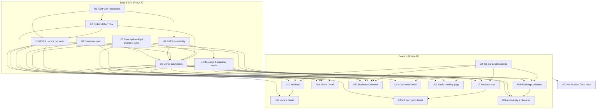

# feat: Billing, bookings, orders and customers to the design — and a phone tab bar

## Summary

Build ten screens from the claude.ai design project to match exactly — Invoices, Invoice Detail, Subscriptions, Subscription Detail, Bookings (calendar, availability, services), Business Calendar, Customer Detail, Order Detail, the customer's booking page on a merchant site, and the phone tab bar. Where a screen shows data the API does not have, the unit that needs it adds it: staff with their own hours, GST tax invoices with an invoice for every order, a kitchen flow for orders, skip and plan change for subscriptions, one read of a customer across everything, and a month of everything dated. Two demo businesses — Rye & Co. (a GST-registered bakery) and Pulse Fitness (a gym) — are seeded to film in. One epic, one sub-issue per unit, local commits only.

---

## Problem Frame

Payments (subscriptions, invoices), bookings and orders were built as working lists and forms (ADR-007, `docs/plans/2026-09-22-001-feat-subscriptions-invoices-classes-plan.md`), but the merchant sees them as tables with little of the day in them: bookings are a table, not a diary; there is no subscription page; an order cannot say what the kitchen is doing; a customer's page shows orders and nothing else; nothing shows the month at once. On a phone every screen hides the rail behind a hamburger.

The design project now has finished screens for all of this, worked out on shared sample data for two real-shaped businesses, with states, phone layouts and audited flows (the project's `handoff-products.md` records what each screen does and why). Several of them lean on things the product does not model yet — staff and their hours, GST, kitchen stages, an invoice per order — so this plan is both screens and the data under them.

---

## Requirements

**Screens (match the `.dc.html` exactly — icons, sizes, shapes, spacing, colour roles, copy; compared side by side at 1440 and 390, light and dark)**
- R1. Phone tab bar below 760px, built from the one nav source, with the section sheets the design gives (`SarohTabBar.dc.html`, `saroh-mobile-nav.js`).
- R2. Rail sections the designs use: **Payments** (Subscriptions, Invoices), **Bookings** (Calendar, Services, Availability), **Home › Calendar**; existing addresses keep working.
- R3. Invoices list: All / Due / Overdue / Paid / Drafts with counts, owed total, overdue banner, quick look, New invoice (`Saroh Invoices.dc.html`).
- R4. Invoice Detail: the invoice as sent — tax invoice (GST) or receipt — actions by status (send, copy pay link, mark paid, print, cancel with credit note, refund routes to the order), Connected panel, hand-written new invoice (`Saroh Invoice Detail.dc.html`).
- R5. Subscriptions list: Active / Payment failed / Paused / Cancelled, failed banner, quick look sheet with deep links to a step (`Saroh Subscriptions.dc.html`).
- R6. Subscription Detail (layout 2a): next charge first, collections with Skip, charges, changes, pause / change plan from next renewal / cancel with Undo; failed renewal: retry now, card-update (pay) link, pause or cancel (`Saroh Subscription Detail.dc.html`).
- R7. Bookings: calendar with day-by-person (default), week and agenda + month layouts; quick look per booking (check in, no-show, move, cancel with Undo; classes show who is booked and how they paid); new booking from a free gap; Availability (per-person weekly hours, time off, one-off extra hours, business rules, draft until saved, Undo); Services (cards, new/edit, pause) (`Saroh Bookings.dc.html`).
- R8. Business Calendar: one month of everything dated, layers with counts, per-day chips and a "to act on" chip, takings bar, day panel linking to each record (`Saroh Business Calendar.dc.html`).
- R9. Customer Detail: header, stat tiles, tabs by business kind (commerce: overview, orders, subscriptions, invoices, notes; bookings: overview, bookings, membership, invoices, notes), notes with allergy (`Saroh Customer Detail.dc.html`).
- R10. Order Detail (layout 1d, two-column desk): kitchen stepper (Members move stages; money and edits Owner/Admin), "waiting N min", allergy banner, change-this-order panels under Items (refund by line, edit items or address before preparing, courier handover by tracking link), timeline of every step, customer + money column; payment-failed, couldn't-load and not-found states (`Saroh Order Detail.dc.html`).
- R11. Public booking page on the merchant's site, in the site's own theme: service → day (14 days, N free / Full / Closed) → start time (or class session with places left) → details → pay now or pay at the desk; summary card; confirmation with add-to-calendar and the cancel rule (`Saroh Book Pulse Fitness.dc.html`). No credits online (user decision): the design's credit and buy-a-pack steps are left out; credits are used at the desk or by the merchant in the calendar.

**Data and rules under the screens**
- R12. Staff: people who take bookings (usually team members), which services each takes, each person's weekly hours, time off, one-off extra hours, and business-wide rules (book ahead, latest booking, free cancellation). Free times are worked out per person.
- R13. GST: a business may be GST-registered (GSTIN, state); products and services carry a GST rate and HSN/SAC code; prices include GST. A registered business issues tax invoices splitting CGST+SGST (same state) or IGST (other state) by place of supply; an unregistered one issues receipts. Financial-year invoice series per business.
- R14. Every order, every subscription charge and every paid online booking makes its own invoice; hand-written ones remain; a refund makes a credit note. An issued invoice is never edited or deleted — corrections are a credit note (down) or a supplementary invoice (up) referencing it. Overdue is worked out from the due date, never stored. The order stays the ledger for its own payments: its invoice has no pay link of its own and mirrors the order's payment and refunds. (Amends ADR-007.)
- R15. Orders: a kitchen stage under the status (New → Preparing → Ready → Collected / Handed to courier → Delivered), every step logged with who and when, Undo on each step, Ready held 10 s before it is recorded (no message is sent — the step shows on the order), collection vs delivery with address, notes, edit items/address before preparing (the difference charged or refunded on the order, with a supplementary invoice or credit note), refund by line (partial refunds). Members may move stages through a new narrow permission (amends DEC-020); refunds, edits and money stay Owner/Admin.
- R16. Subscriptions: skip one collection, change plan from the next renewal, a payment-failed state from an unpaid renewal with retry.
- R17. One read of a customer, rooted on the CRM contact (the record every business kind has): bookings, subscriptions, invoices, packs and notes, plus orders from store customers joined by a confirmed identity link. Exact-email matches are offered as "possible match — link?", never merged. Each source degrades on its own.
- R18. One read of a month: orders, collections, subscription renewals/failures, invoices due/overdue/paid, bookings and classes, per day, with what needs acting on.

**Demo, verification, docs**
- R19. Seed Rye & Co. (GST bakery: bread nil-rated, pastry 18%, coffee 5%, delivery 18%; Karnataka; a Sourdough subscription plan; trade cafés with hand-written invoices) and extend Pulse Fitness (staff, hours, time off, classes with named places, packs, memberships) — resettable, film-ready.
- R20. Every screen's loading, empty, failed, partial (per source), not-found, no-access and read-only states (one shared read-only treatment); four scenes (desk, phone, light, dark); keyboard and screen-reader access for the custom widgets (calendar gaps, kitchen stepper, tab bar and its sheets, quick looks) with visible focus and focus returned on close; a role without billing permission sees no money figures anywhere (stats, takings, fees, payouts); e2e for the main flows; decisions written the same day.

---

## Scope Boundaries

- Rooms / resources for classes.
- Courier integrations (Delhivery, Blue Dart booking APIs) — a tracking link is typed.
- Card-on-file, auto-debit, proration on plan change.
- Sending email or SMS (booking confirmations, renewal reminders, invoice emails). Copy never promises a message that is not sent.
- Waitlists for full classes.
- One-to-one services paid with credits (packs cover classes only — the design's handoff lists it as a separate decision).
- Using or buying credits on the public booking page (user decision: no verification without messaging). The design's "Use 1 credit" and "Buy a pack and use 1 now" steps are omitted.
- GST returns / filing exports, e-invoicing (IRN/QR), TCS.

### Deferred to Follow-Up Work

- The Packs screen (`Saroh Packs.dc.html`) and the Plans redesign: the existing `/class-packs` and `/billing/plans` stay; linked from the new rail sections.
- The customer self-serve page (pay, skip, pause, switch, cancel, update card).
- Packs as products vs a separate list (open design question in the handoff).

---

## Context & Research

### Relevant Code and Patterns

- **Billing (ADR-007):** `apps/api.saroh.in/src/modules/invoices/` (state, numbering `numbering.ts`, totals, pay token/link, serialize), `apps/api.saroh.in/src/modules/subscriptions/` (plans, renew job `renew-job.ts` + `subscription-renew.handler.ts`, `periods.ts`), public pay `apps/api.saroh.in/src/modules/payments/public-invoices.*`, app `apps/app.saroh.in/app/(shell)/billing/{invoices,subscriptions,plans}/`, `apps/app.saroh.in/components/{invoices,subscriptions}/`, `apps/app.saroh.in/lib/{invoices,subscriptions}/`, pay page `apps/saroh.app/app/pay/[token]/`.
- **Bookings:** `apps/api.saroh.in/src/modules/bookings/` (`availability.ts` pure slot engine with buffers/capacity/DST, `public-bookings.controller.ts` Serializable + rate-limited + idempotent), `class-packs/` (`redeem-pack.ts`), `courses/`; app `apps/app.saroh.in/app/(shell)/{bookings,services,class-packs,courses}/`, `apps/app.saroh.in/components/bookings/`, `apps/app.saroh.in/lib/{services,class-packs,courses}/`. Staff do not exist; availability is weekly per service; no org-wide bookings read (`lib/services/service.ts:listAllBookings` fans out).
- **Orders:** `apps/api.saroh.in/src/modules/orders/` (`order-state.ts`, `order-standing.ts`, `order-inventory.ts` — stock rows recorded per line on this branch), `payments/payments.controller.ts` (refund, payment intents), app `apps/app.saroh.in/app/(shell)/commerce/orders/[orderId]/page.tsx`, `apps/app.saroh.in/components/commerce/order-actions.tsx`, `apps/app.saroh.in/components/stores/order-payments.tsx`.
- **Customers:** store `Customer` (`apps/api.saroh.in/src/modules/customers/`, page `apps/app.saroh.in/app/(shell)/commerce/customers/[customerId]/page.tsx`), CRM contact holdings (`apps/app.saroh.in/lib/contacts/holdings.ts`, `panels.ts`), identity links + timeline (`apps/api.saroh.in/src/modules/customer-workspace/`, `CustomerIdentityLink`).
- **Shell / nav:** `apps/app.saroh.in/components/shared/{app-shell,app-sidebar,mobile-nav,nav-items}.tsx` (one source feeds rail, drawer, command menu; test `apps/app.saroh.in/lib/nav/nav-items.test.ts`); rail 238px ≥1100, 64px 760–1100, hidden <760.
- **Public site:** blocks `packages/site-blocks/src/blocks/{booking,services-list}.tsx`, theme `packages/site-blocks/src/site-theme.tsx` (`--site-*` only, gate G2), routes `apps/saroh.app/app/[domain]/…`.
- **Seed:** `packages/database/src/seed/showcase/{data,run,appointments,billing,boutique}.ts` — Pulse Fitness exists (appointments, CRM, payments, courses, packs); Leela & Loom (`boutique.ts`) is the per-business pattern to copy for Rye & Co.
- **Reference build on this branch:** products v2 (`docs/plans/2026-09-23-002-feat-product-detail-settings-editor-plan.md`) — design fidelity process, section-save editor, quick sheets, `toFailure` error envelope, Undo toasts, four-scene checks.
- **Design source:** project `1fef6fb9-c3b1-4c04-bfc2-86d09cb32a65`; `handoff-products.md` (in the project) describes every screen's rules; shared data `saroh-fixtures.js`, rules `saroh-order-flow.js`, phone nav `saroh-mobile-nav.js`. Each unit fetches its `.dc.html` (DesignSync `get_file`, main session only) and renders it locally beside the build.

### Institutional Learnings

- `docs/solutions/` does not exist. `docs/architecture/DEV_LEARNINGS.md` and this branch's history: the API dev watcher goes stale after `prisma generate` (restart it); the API error envelope is `{ error: { message, details } }` — read it with `toFailure`; React Compiler forbids ref writes and `Date.now()` in render; Playwright's `page.evaluate` can hang on dev pages — prefer locators.
- Patterns: `docs/patterns/backend-billing-and-classes.md` (Current), `backend-data-and-money.md` (money as Decimal/minor units, never floats; row locks for stock), `backend-auth-and-access.md` (a Member cannot read billing, courses or packs — DEC-020), `saroh-product.md` (don't claim customer unification; booking rules), `frontend-verification.md` (four scenes).

### External References

- Indian GST invoice contents (CGST Rules, rule 46): supplier GSTIN, consecutive serial unique per financial year (≤16 chars), date, recipient name/address (and GSTIN if registered), HSN/SAC, description, quantity, taxable value, rate, CGST/SGST or IGST amounts, place of supply (state + code), whether reverse charge applies. Intra-state → CGST + SGST halves; inter-state → IGST. Nil-rated lines appear with 0% (a supplier of only exempt/nil-rated goods issues a bill of supply). A credit note references the original invoice. Planning-level summary only — the implementer checks each field against rule 46 when building the paper.

---

## Key Technical Decisions

- **One epic, screens and data together per area.** Like products v2: each screen unit adds the API it needs; shared models (staff, GST, kitchen stages) come first so screens are built once against real shapes.
- **Staff are their own model, usually linked to a team member.** A `StaffMember` belongs to the organization, optionally to a `Membership` (a front-desk trainer may not log in), with services they take, weekly hours, time off and one-off extra hours. Booking rules live per business. The slot engine gains a per-person pass; a service with no staff keeps today's per-service weekly rules so existing businesses don't change.
- **Classes stay services with capacity.** A class session is a weekly start in the class's own rules; its instructor is used for display and clash checks only. One-to-one services with staff take slots from staff windows intersected with the service's rules. Each booking records how it was paid (membership, pack, paid, desk) and, for a membership, which subscription; plans may carry a monthly class allowance. Cancelling a class place after the free-cancellation window keeps the pack credit used.
- **GST is a business setting plus a rate on what's sold.** Registration and state live on `BusinessProfile` (its `taxId` holds the GSTIN); a registered business's orders ignore the storefront's old add-on tax setting. Prices stay GST-inclusive; an order discount is spread across lines in proportion before tax; delivery becomes a taxed line (SAC, business's delivery rate); tax is derived per line and frozen. Place of supply: the bill-to state if set, else the delivery state, else the business's state. Registered → tax invoice (with bill-to GSTIN/state/address when the buyer is registered); unregistered → receipt. Numbering: `InvoiceSequence` keyed by business + series (prefix + financial year for registered businesses; a plain prefix series such as `PF-0001` for unregistered ones); credit notes have their own series; the full number stays within 16 characters; existing invoices keep theirs. A registered business cannot void an issued invoice — only drafts are discarded and issued ones are credited; void remains for unregistered receipts.
- **Every order makes an invoice (ADR-008 amends ADR-007).** Created inside the webhook's payment reconciliation (and by the order service for pay-later or manual payment), once per order, bill-to copied from the order's customer and address; it has no pay link of its own — paying it pays the order — and it mirrors the order's payment and refunds (a refund reconciliation makes the credit note). Aggregates count each rupee once: takings and "spent" sum orders plus non-order invoices; owed sums unpaid invoices excluding order invoices. Paid online bookings invoice the same way (source booking). Written as ADR-008 + DEC-023 before code.
- **Kitchen stage sits under the order status, not instead of it.** Status values stay (PENDING/PROCESSING/SHIPPED/DELIVERED/CANCELLED); the transition table gains PROCESSING→DELIVERED (collection) and reverse moves allowed only through an event-backed Undo of the last step; a stage field and an `OrderEvent` log carry the flow. Refunds become partial: a line refund is capped at the line's unrefunded amount, locked and idempotent, and payment status derives "partly refunded" from refund sums instead of jumping to REFUNDED. Members move stages through a new `order:stage` permission (DEC-024 amends DEC-020). Ready and refund holds are 10 s, using the shared Undo toast extended with a duration option.
- **Customer Detail is rooted on the contact.** Every business kind has contacts; a gym has no store customers. The read starts at the contact (extending `customer-workspace`, page `/customers/[contactId]`), adds orders from store customers joined by a confirmed `CustomerIdentityLink`, and offers exact-email store customers as a "possible match — link?" that opens the existing link dialog. `/commerce/customers/[customerId]` redirects to its linked contact where one exists and keeps its current page otherwise. Notes carry structured allergens (ids from the store's allergen list), not free text, so Order Detail's banner matches exactly.
- **Calendar feed is one read, degrading per layer.** A month endpoint aggregates dated events per layer server-side, each layer read on its own (the Home service's per-source pattern) so a failed layer is named, not fatal; days bucket in `BusinessProfile.timezone`, else the first active service's zone, else Asia/Kolkata, and the response says which. Subscription collections come from a collection schedule (weekday per subscription), not from billing periods.
- **Public booking page is a saroh.app route, not a block.** `/<domain>/book` (and a link from the existing booking/services blocks) in `--site-*` tokens only. Pay now creates a pending booking holding its place for 15 minutes plus an invoice (source booking) paid through the existing invoice payment path; the price comes from the server; the provider webhook confirms the booking; an expired hold releases the place. No customer recognition and no credits online. Public reads expose a staff display name and an opaque id only — never time off or reasons. The one-service booking block stays.
- **Phone tab bar replaces the hamburger below 760px.** Built from `nav-items.tsx` (the design's `saroh-mobile-nav.js` model mapped onto it); section sheets list each section's children; the header keeps business switcher, search and account; the drawer (`mobile-nav.tsx`) is deleted.
- **Shared pieces, not per-screen copies.** The three quick looks (invoice, subscription, booking) share one sheet shell (from the product page's `quick-sheet.tsx`); read-only screens share one `ReadOnlyNote` promoted to a shared component; permissions for new writes are named: staff and booking rules need `service:write`, tax settings Owner/Admin, stage moves `order:stage`.
- **Branch:** `feat/billing-bookings-screens` stacked on `feat/products-v2` (neither pushed).

---

## Open Questions

### Resolved During Planning

- Staff, GST and kitchen flow in scope: yes (confirmed with the user).
- Invoice for every order vs ADR-007's "orders keep their receipt": the design wins; ADR-008 records it.
- Where the Business Calendar lives: Home › Calendar (`/calendar`).
- Payments rail section vs `/billing` URLs: the rail says Payments; URLs stay `/billing/*` (redirects already exist).
- Members and kitchen stages: allowed through `order:stage` (user decision; DEC-024).
- Credits on the public page: not offered (user decision).
- Renewal "last ran": already exposed (`GET subscriptions/renewals`).

### Deferred to Implementation

- Exact staff ↔ membership linking UI (who can be a staff member without an account): settled in U3 against the Availability design.
- How pay-later orders number their invoice (at placement vs at supply): settled in U5 against the GST time-of-supply rule and the designs.
- Server-side limit on undoing a kitchen step (so a stale tab cannot undo a delivered order long after): settled in U6.
- Final layout breakpoints inside the calendar grid at 760–1100px: settled in U15 by rendering the design.

---

## High-Level Technical Design

> *This illustrates the intended approach and is directional guidance for review, not implementation specification. The implementing agent should treat it as context, not code to reproduce.*

---

## Implementation Units

### U1. ADR-008 and the decisions this batch rests on

**Goal:** Write the decisions before code: invoice per order + credit notes (amending ADR-007), GST model, staff model, kitchen stage under status, customer read without unification.

**Requirements:** R12–R17

**Dependencies:** None

**Files:**
- Create: `docs/architecture/adr/ADR-008-operations-staff-gst-kitchen.md`
- Modify: `docs/architecture/DECISIONS.md` (DEC-023 invoice per order and GST; DEC-024 Members move kitchen stages, amending DEC-020), `docs/architecture/adr/ADR-007-subscriptions-invoices-classes.md` (amended-by note), `docs/patterns/backend-billing-and-classes.md` (invoice per order, GST, immutability), `docs/patterns/backend-auth-and-access.md` (`order:stage`, staff/booking-rule and tax-setting permissions)

**Approach:**
- One ADR covering the shifts, each with context, decision, consequences and what it is not: invoice per order and per paid online booking (the order is the ledger; its invoice mirrors it), issued invoices immutable (credit note / supplementary invoice; no void for registered businesses), GST (inclusive prices, place of supply order, numbering series), staff, kitchen stage under status with the widened transition table and event-backed Undo, contact-rooted customer read, no credits on the public page.
- DEC-023 and DEC-024 summary lines; ADR-007 marked "amended by ADR-008" at the orders/receipts paragraph.

**Test expectation:** none — documentation.

**Verification:**
- ADR-008 accepted in the doc; every later unit's data decision traces to it.

> **Done — #486** (`001dd538`). ADR-008 accepted; DEC-023 (invoice per order, immutability, GST) and DEC-024 (Members move kitchen stages via `order:stage`, which also grants a money-free kitchen read of the order; `order:read` stays Owner/Admin). ADR-007 marked amended; billing and access patterns updated. Money figures are gated on the money reads (`payment:read`, `invoice:read`, `subscription:read`) and omitted by the API.

---

### U2. Phone tab bar and the rail's new sections

**Goal:** Below 760px a bottom tab bar replaces the hamburger; the rail gains Payments, Bookings and Home › Calendar sections — one nav source for rail, tab bar, sheets and command menu.

**Requirements:** R1, R2, R20

**Dependencies:** None

**Files:**
- Create: `apps/app.saroh.in/components/shared/tab-bar.tsx`, `apps/app.saroh.in/components/shared/tab-bar-sheet.tsx`
- Modify: `apps/app.saroh.in/components/shared/nav-items.tsx`, `apps/app.saroh.in/components/shared/app-shell.tsx`, `apps/app.saroh.in/components/shared/app-header.tsx` (actions passed consistently)
- Delete: `apps/app.saroh.in/components/shared/mobile-nav.tsx` (the tab bar replaces the drawer)
- Create: `apps/app.saroh.in/components/shared/read-only-note.tsx` (promoted from product settings, shared by every read-only screen)
- Test: `apps/app.saroh.in/lib/nav/nav-items.test.ts`, `e2e/tests/four-scenes.spec.ts`

**Approach:**
- Fetch `SarohTabBar.dc.html` and `saroh-mobile-nav.js`; map its tab model (tabs, order, section sheets, badges, active marking by section) onto `NAV_GROUPS` so capability/role filtering is shared with the rail.
- Tab bar fixed to the bottom with safe-area inset; the shell's main scroll container gets bottom padding so sticky bars (bulk trays, the editor's save bars) sit above it; icon tabs carry labels for screen readers; sheets return focus to their tab on close.
- Rail: Payments (Subscriptions, Invoices; Plans kept as a child), Bookings (Calendar, Services, Availability; Class packs and Courses stay reachable), Home › Calendar. Existing `/billing`, `/bookings`, `/services` addresses keep working.
- Fix the drawer/rail inconsistency: both receive the resolved `actions`, so a custom role sees the same items everywhere.

**Patterns to follow:**
- `apps/app.saroh.in/components/shared/app-sidebar.tsx` (active marking, module gating), `docs/patterns/frontend-design-system.md` (touch targets `coarse:`).

**Test scenarios:**
- Happy path: at 390px the tab bar shows the design's tabs; tapping a section opens its sheet with the section's children; the current section is marked.
- Edge case: a module turned off hides its tab/child; a Member (DEC-020) sees no Payments.
- Edge case: a custom role's actions produce identical items in rail, tab bar and command menu.
- Integration: every route in `four-scenes` has no horizontal scroll and no control hidden under the tab bar at 320 and 390.

**Verification:**
- Rendered side by side with `SarohTabBar.dc.html` at 390 light/dark; nav test and four-scenes pass.

> **Done — #487** (merged `677734a9`). Tab bar below 760px from the one nav source (`lib/nav/mobile-nav.ts`, 16 tests): four seats by preference (Home, current section, Sell/Calendar, Notifications), More sheet "Everything else" grouped by section with parent icons, Workspace group, footer note; focus to Close, trapped, Escape, focus back. Drawer deleted; rail, tab bar and command menu share one role/permission pair. Payments (Subscriptions, Invoices, Plans) and Bookings (Calendar, Services, Courses, Class packs) sections; a child may carry its own module key. `--tab-bar-inset` pads content, sticky bars and toasts. Shared `ReadOnlyNote`. Checked at 390 on Orders against the design (bar, badge, sheet). Tabs and rows are links; the bar sits at z-40 under dialogs; the current bar and badge use the Saffron fill (`highlight`).

---

### U3. Staff, their hours, time off and booking rules

**Goal:** Model who takes bookings and when; work out free times per person.

**Requirements:** R12

**Dependencies:** U1

**Files:**
- Modify: `packages/database/prisma/schema.prisma` (StaffMember, StaffService, StaffHours, StaffTimeOff, StaffExtraHours, BookingRules per business, `Booking.staffId`, `Booking.paidWith` membership|pack|paid|desk, `Booking.subscriptionId`, `SubscriptionPlan.classesPerMonth`), migration `packages/database/prisma/migrations/<ts>_staff_and_hours/migration.sql`
- Modify: `apps/api.saroh.in/src/modules/bookings/bookings.service.ts` cancel (late cancel keeps the pack credit), `apps/api.saroh.in/src/common/organization-policy.ts` (or wherever permissions live) for staff writes
- Create: `apps/api.saroh.in/src/modules/staff/{staff.module,staff.controller,staff.service,dto}.ts`
- Modify: `apps/api.saroh.in/src/modules/bookings/availability.ts` (per-person pass), `apps/api.saroh.in/src/modules/bookings/bookings.service.ts` (assign staff; reject a person who is off or already booked)
- Test: `apps/api.saroh.in/src/modules/staff/staff.service.spec.ts`, `apps/api.saroh.in/src/modules/bookings/availability.spec.ts`

**Approach:**
- Weekly hours as minute ranges per weekday (overlap and end-before-start refused); time off by day or range with a team-only reason; one-off extra hours for a date; rules: book ahead (days), latest booking (minutes before), free cancellation (hours).
- Saving hours reports bookings that would fall outside them (kept, listed) — the Availability design's rule.
- One-to-one services with staff: slots from each person's windows intersected with the service's own rules when both exist (and which person); a service with none keeps today's weekly rules. Classes: sessions from the class's own rules; the instructor is display and clash check only.
- A person taking two services is checked for clashes across services inside the booking transaction.
- Cancel: before the free-cancellation window the pack redemption is reversed; after it, a late cancel is recorded and the credit stays used.
- Existing bookings get no staff backfill (the calendar shows them as Unassigned — U15).
- Writes need `service:write`; a Member is refused. RLS on every new org-owned table (org_isolation, FORCE).

**Patterns to follow:**
- `apps/api.saroh.in/src/modules/bookings/availability.ts` (pure, DST-aware), migrations skill `.agents/skills/saroh-migrations/SKILL.md`.

**Test scenarios:**
- Happy path: a person with Mon 6–12 and a 60-min service offers 6:00…11:00 starts; a booking at 7:00 removes it for that person only.
- Edge case: time off on a date removes all that person's slots; an extra hour on a closed day adds slots only that date.
- Edge case: overlapping ranges or end before start are refused with a field error.
- Edge case: DST/timezone: hours are business-local; slots stay correct across a DST boundary.
- Error path: booking a person who is off, or twice at once, is refused; booking later than the "latest booking" rule is refused.
- Integration: saving new hours returns the kept bookings now outside them.
- Edge case: cancelling a class place before the free-cancel window returns the credit; after it keeps it used and records a late cancel.
- Error path: a Member writing hours or rules is refused.

**Verification:**
- Migration replays; availability spec covers per-person windows; existing service-only bookings unchanged.

> **Done — #488** (merged `41675203`). `StaffMember` (optional Membership link), `StaffService`, `StaffHours`, `StaffTimeOff`, `StaffExtraHours`, `BookingRules`; `Booking.staffId/paidWith/subscriptionId/cancelledLate`, `SubscriptionPlan.classesPerMonth`. Staff API under `organizations/:org/staff` (`service:read`/`service:write`); saving hours returns kept bookings outside them; time off returns affected bookings. One-to-one slots = staff windows ∩ service rules, capacity per person; classes keep their rules, instructor clash-checked; services nobody takes book as before. Person row locked for cross-service clash checks. Late cancel keeps the pack class (`cancelledLate`); membership bookings refuse past `classesPerMonth`. Public staff endpoint returns name + id only; public refusals never mention time off. Book-ahead/latest rules apply to the booking page, not merchant bookings; an empty class doesn't block its instructor; hours in the business timezone (fallback: first service's zone, then Asia/Kolkata). Migration `20260927100000_staff_and_hours` (RLS on six tables). DB specs await test:int.

---

### U4. One read of bookings, and one of the month

**Goal:** An org-wide bookings read (range, by person, with classes' named places) and a month feed of everything dated.

**Requirements:** R7, R8, R18

**Dependencies:** U3 (and U5/U7 for invoice and subscription layers — the feed reads whatever exists and grows as they land)

**Files:**
- Create: `apps/api.saroh.in/src/modules/calendar/{calendar.module,calendar.controller,calendar.service}.ts`
- Modify: `apps/api.saroh.in/src/modules/bookings/bookings.controller.ts` + `bookings.service.ts` (org bookings in a range, grouped by person, class seats with pay method)
- Modify: `apps/app.saroh.in/lib/services/service.ts` (replace the fan-out `listAllBookings`)
- Test: `apps/api.saroh.in/src/modules/calendar/calendar.service.spec.ts`, `apps/api.saroh.in/src/modules/bookings/bookings.service.spec.ts`

**Approach:**
- Bookings read: range + optional person; each class start carries places, who is booked and how they paid (member / pack / paid / desk).
- Month feed: per day, per layer (orders, collections, subscription renewals/failures/resumes/ends, invoices due/overdue/paid, bookings, classes) counts + short items with a link target; "to act on" = failed renewals + overdue invoices; takings per day for the lead layer (each rupee once: orders plus non-order invoices). Layers depend on the business's modules; a role without billing permission gets no billing layers and no takings.
- Each layer is read on its own (the Home service's per-source `attempt()` pattern); a failed layer comes back as unavailable with its name, the rest still render.
- Days bucket in `BusinessProfile.timezone`, else the first active service's zone, else Asia/Kolkata; the response names the zone used.
- Collections come from each subscription's collection schedule (U7), skips excluded.

**Test scenarios:**
- Happy path: a month with 3 orders on the 5th, a renewal on the 6th and an overdue invoice returns those per day with counts and one "to act on".
- Edge case: a day with nothing is absent or empty consistently; month boundaries respect the business timezone.
- Error path: a Member requesting invoice/subscription layers gets them omitted, not an error, and no takings.
- Error path: the invoices read throws → the feed returns the other layers and names invoices as unavailable.
- Integration: a skipped collection (U7) disappears from the feed.

**Verification:**
- The calendar screen (U17) and bookings calendar (U15) render from these reads alone.

> **Done — #489** (merged). `GET organizations/:org/services/bookings?from&to[&staffId]` (`booking:read`): diaries per active person plus an Unassigned diary last, each booking with service, contact, staff, `paidWith` (stored, else pack, else subscription), and class sessions with capacity, places taken and who is booked with how they paid; prices only with `payment:read`. The app's `listAllBookings` now makes this one call (`lib/services/booking-calendar.ts`; register covers a year either side). `GET organizations/:org/calendar?month=YYYY-MM` (`org:read`): every day with every visible layer (orders, collections via `collections.ts`, subscription renewals/failed/ended, invoices due/overdue/paid, bookings, classes), items capped at 50 per day with true counts, to-act-on (failed renewals + overdue invoices, each once), takings counting each rupee once (orders plus non-order invoices; needs `payment:read` + `invoice:read`), per-layer failures in `unavailable`, days in the business zone (`businessZone()` fallback chain, named in the response). Not dated: subscription resumes (no resume record). To-act-on covers the month shown only.

---

### U5. GST, and an invoice for every order

**Goal:** GST registration, rates and HSN/SAC on what's sold, tax worked out on invoice lines, financial-year numbering, invoices for orders, credit notes for refunds.

**Requirements:** R13, R14

**Dependencies:** U1, U6 (order fulfilment and delivery address)

**Files:**
- Modify: `packages/database/prisma/schema.prisma` (`BusinessProfile.gstRegistered`, `gstState` — GSTIN in `taxId`; `Product.gstRate`/`hsnCode`, `Service.gstRate`/`sacCode`, business delivery rate/SAC; invoice line tax columns; `Invoice.orderId`, `Invoice.bookingId`, `Invoice.kind` invoice|credit_note|supplementary, `relatedInvoiceId`, bill-to GSTIN/state/address, place of supply; `InvoiceSequence` re-keyed to business + series), migration `<ts>_gst_and_order_invoices` (existing sequence rows → the legacy INV series)
- Modify: `apps/api.saroh.in/src/modules/invoices/{totals,numbering,serialize,invoice-state,invoices.service}.ts`, `apps/api.saroh.in/src/modules/webhooks/webhooks.service.ts` (order invoice inside the payment reconciliation; credit note inside refund reconciliation), `apps/api.saroh.in/src/modules/orders/orders.service.ts` (pay-later / manual payment; registered businesses ignore the storefront's add-on tax), `apps/api.saroh.in/src/modules/payments/*`
- Create: `apps/api.saroh.in/src/modules/invoices/gst.ts`
- Modify: products/services DTOs + editor fields for rate/HSN (products editor v2 `details` or `basics` section; service form)
- Test: `apps/api.saroh.in/src/modules/invoices/gst.spec.ts`, `totals.spec.ts`, `numbering.spec.ts`, `invoices.db.spec.ts`, `apps/api.saroh.in/src/modules/orders/orders.service.spec.ts`

**Approach:**
- `gst.ts` pure: from a GST-inclusive line amount, rate and intra/inter-state, derive taxable value and CGST/SGST or IGST, rounded to paise per line; totals sum frozen line values.
- Before tax, an order's discount is spread across lines in proportion; delivery becomes a taxed line (business's delivery rate and SAC); invoice total equals order total.
- Place of supply: bill-to state if set, else delivery state, else the business's state. Bill-to GSTIN/state/address printed for registered buyers.
- Numbering: `InvoiceSequence` keyed by business + series, incremented by the existing single upsert inside the issuing transaction; registered businesses use prefix + financial year (April–March), unregistered a plain prefix; credit notes have their own series; the prefix is validated so the number stays within 16 characters; existing invoices keep theirs.
- Order invoice created once (idempotent per order) with bill-to from the order's customer and address; it has no pay link (paying it pays the order) and becomes PAID/credited when the order does. Refund makes a credit note for the refunded lines referencing it.
- An issued invoice and its lines are immutable and never deleted; a registered business cannot void an issued invoice (discard drafts, credit issued ones); void stays for unregistered receipts.
- Tax settings are Owner/Admin only. RLS on new org-owned tables (org_isolation, FORCE). Overdue stays derived.

**Execution note:** Implement `gst.ts` and numbering test-first.

**Test scenarios:**
- Happy path: ₹118 pastry at 18% intra-state → taxable ₹100.00, CGST ₹9.00, SGST ₹9.00; inter-state → IGST ₹18.00.
- Edge case: nil-rated bread shows 0% with no tax; a mixed order totals correctly; odd-paise rounding sums to the line.
- Edge case: financial year rolls on 1 April — first April invoice is 0001 in the new series; numbers never repeat.
- Edge case: unregistered business issues a receipt with no GST columns.
- Error path: an invalid GSTIN format or state is refused on settings save.
- Edge case: a discounted order with delivery → invoice total equals order total; tax on the discounted amounts.
- Edge case: a Karnataka business billing a Goa café → IGST.
- Edge case: two invoices issued at once across 1 April get distinct numbers in the right series.
- Error path: updating or deleting an issued invoice is refused; voiding a registered business's issued invoice is refused.
- Integration: a verified payment webhook creates exactly one order invoice (replayed webhook creates none); a refund webhook creates the credit note; the invoice list shows both.
- Integration: owed totals exclude order invoices; takings count each rupee once.

**Verification:**
- The worked examples in `gst.spec.ts` pass; the paper check against the design happens in U9/U11.

> **Done — #490** (merged). `invoices/gst.ts` (test-first): inclusive line → taxable + CGST/SGST or IGST per line, discount spread, delivery a taxed line, place of supply bill-to → delivery → business state; `gst-states.ts` (state codes, GSTIN check). Numbering (test-first): `InvoiceSequence` keyed business + series — registered `RC/26-27/0001`, unregistered `PF-0001`, no prefix keeps legacy `INV-0001`; credit notes own series; ≤16 chars; FY in the business zone. `order-invoicing.ts`: one invoice per order (row lock + partial unique index) made in the webhook reconciliation or on a recorded / pay-later payment, PAID, no pay link, bill-to from the order; refunds → credit notes (by line when named), full refund → CREDITED; U6's edits → supplementary invoice / credit note. Registered businesses can't void — `POST invoices/:id/credit`. Registered orders ignore the storefront add-on tax (`Order.tax` = GST inside the total). Owed/spent count order paper once; customer read includes linked orders' invoices. Tax settings on `PATCH organizations/:id` (Owner/Admin); GST rate + HSN on products (editor v2 Basics), rate + SAC on services; GST card on Business. Migration `20260928100000_gst_and_order_invoices`. Not yet: plan/course/pack invoices of a registered business print at 0% (no rate on plans).

> **Phase A integration — green.** Full `test:int` after U1–U8 and U9 (Pulse): 133 suites / 1642 tests (`0961ce8d` fixed two fixtures — a subscription spec that moved dates but not its sign-up invoice, and an order spec whose fixture had over-reserved stock — and registered `collections.spec.ts` in the unit config after correcting two expectations).

---

### U6. The kitchen flow for orders

**Goal:** Stage under status, an event log, collection vs delivery with address, notes, edit before preparing, refund by line.

**Requirements:** R15

**Dependencies:** U1 (U5 for the difference invoice/credit note)

**Files:**
- Modify: `packages/database/prisma/schema.prisma` (`Order.stage`, `fulfilment` collect|delivery, delivery address, notes, tracking; `OrderEvent`), migration `<ts>_order_kitchen_flow`
- Modify: `apps/api.saroh.in/src/modules/orders/{order-state,orders.service,serialize,dto}.ts`, `apps/api.saroh.in/src/modules/payments/{payments.controller,payments.service}.ts` (refund by lines: amount computed server-side from lines), `apps/api.saroh.in/src/modules/webhooks/webhooks.service.ts` (a partial refund does not move the order to REFUNDED; payment status derives "partly refunded" from refund sums), the organization permission policy (`order:stage`)
- Create: `apps/api.saroh.in/src/modules/orders/order-stage.ts`
- Test: `apps/api.saroh.in/src/modules/orders/order-stage.spec.ts`, `orders.service.state.spec.ts`

**Approach:**
- Stage machine per `saroh-order-flow.js` rules: Members move stages (`order:stage`, DEC-024) and see no money figures; only Owner/Admin refund or edit; items editable only at New; a stage move maps to its status move (New→Preparing = PENDING→PROCESSING; Collected → PROCESSING→DELIVERED, a new transition; Handed to courier → SHIPPED; Delivered → DELIVERED).
- Every move writes an `OrderEvent` (who, when, from→to, note); Undo reverts only the last move by its event, within a server-side limit, and reverses its stock moves by the recorded stock rows.
- Line refunds: a row lock on the order, each line capped at its paid-and-unrefunded amount, an idempotency key so a retry returns the same refund and credit note.
- RLS on `OrderEvent` (org_isolation, FORCE).
- Edit before preparing: new lines/quantities/address; the difference is charged on the order (its payment link) or refunded, with a supplementary invoice or credit note — never editing the issued invoice; stock moves follow `order-inventory.ts` rows.
- Unpaid orders cannot start preparing (payment-failed state).

**Execution note:** Characterization tests for today's status transitions first; then add stages.

**Test scenarios:**
- Happy path: New → Preparing → Ready → Collected logs three events and ends DELIVERED.
- Edge case: Undo after Ready returns to Preparing and logs the undo; a second Undo is refused.
- Error path: a Member refunding is refused; editing items after Preparing is refused; starting an unpaid order is refused.
- Error path: a line refund above the line's remaining amount is refused; a double-submitted refund makes one refund.
- Edge case: Undo from Collected restores PROCESSING and does not double-apply stock; undo past the server limit is refused.
- Integration: editing a quantity up creates a pay link for the difference and reserves stock; down refunds and releases stock; a refund by lines leaves the rest paid.

**Verification:**
- Order Detail's stepper, timeline and panels render entirely from the order read.

> **Done — #491** (merged). `Order.stage`, fulfilment, delivery address (incl. state), notes, tracking; `OrderEvent` timeline; `PaymentRefundLine` + refund idempotency key. `order:stage` granted to Members. Status table gains PROCESSING→DELIVERED. `order-stage.ts`: mapping, unpaid can't start, Undo of the latest event only, once, within 10 minutes (`UNDO_WINDOW_MS`, in ADR-008), stock reversed on recorded rows. New org-scoped order read (`GET organizations/:org/orders/:id`, `order:read` or `order:stage`; money only with `payment:read`), stage + undo routes, edit (`order:write`; lines/fulfilment/address only while New; difference charged by a new payment on the order or refunded). Refund by lines: server-side amounts capped per line and order, two-phase under the row lock, idempotent; partial refunds keep the order PAID with a derived PARTLY_REFUNDED. Supplementary invoice/credit note are `TODO(U5)` hooks. Migration `20260927200000_order_kitchen_flow` (backfills stage from status; RLS). Open: the old store-scoped order read still shows money to `store:read` (Members) — U14 moves Order Detail to the new read; Commerce nav still needs `order:read`; edits keep a fixed discount amount. DB spec awaits test:int.

---

### U7. Subscriptions: skip, change plan, payment failed

**Goal:** The actions Subscription Detail offers.

**Requirements:** R16

**Dependencies:** None

**Files:**
- Modify: `packages/database/prisma/schema.prisma` (collection schedule — weekday and what is collected — on the subscription; `SubscriptionSkip` by collection date; `pendingPlanId`), migration `<ts>_subscription_skip_change`
- Modify: `apps/api.saroh.in/src/modules/subscriptions/{subscriptions.controller,subscriptions.service,renew-job,subscription-renew.handler,periods}.ts`
- Test: `apps/api.saroh.in/src/modules/subscriptions/subscriptions.db.spec.ts`, `subscription-renew.handler.spec.ts`

**Approach:**
- Collections: dated from the subscription's collection weekday within each period (so a monthly plan can collect weekly); skipping one collection removes it (and its charge when the plan charges per collection); Undo removes the skip.
- RLS on new tables (org_isolation, FORCE).
- Change plan: takes effect at the next renewal (price and plan switch then); Undo clears the pending change.
- Payment failed: derived from an unpaid renewal invoice past due; "retry now" re-issues its pay link; pause/cancel remain.

**Test scenarios:**
- Happy path: skip next week → renewal job advances the period without an invoice; the feed (U4) shows no collection.
- Edge case: skip then cancel at period end; change plan then pause — renewal applies the new plan on resume.
- Error path: skipping a past period or an already-skipped one is refused; changing to an archived plan is refused.
- Integration: renewal job is idempotent with skips and pending plan changes.

**Verification:**
- Subscription Detail's actions all map to one API call each with Undo.

> **Done — #492** (merged). Collection weekday + note per subscription, dated by `collections.ts` (pure; U4 reuses it) with the next 6 on the read; skip by date with Undo (future, on the collection day, within a year; a period fully skipped before invoicing advances uncharged — plans price per period, so partial skips are pickup-only); change plan from next renewal (`pendingPlanId`, applied by renewal or a resume starting a new period; Undo); payment failed derived from the latest unpaid past-due invoice, with retry re-issuing its pay link. Routes need `subscription:write`. Migration `20260927300000_subscription_skip_change` (`SubscriptionSkip`, RLS). DB specs await test:int.

---

### U8. One read of a customer

**Goal:** Everything a customer has, from the store customer and what is linked to it.

**Requirements:** R17

**Dependencies:** None (reads U5/U6/U7 data as it lands)

**Files:**
- Modify: `apps/api.saroh.in/src/modules/customer-workspace/{customer-workspace.controller,customer-workspace.service}.ts` (a contact-rooted detail read: stats, bookings, subscriptions, invoices, packs, notes; orders from linked store customers; possible matches)
- Modify: `packages/database/prisma/schema.prisma` (`ContactNote` with structured allergen ids), migration `<ts>_contact_notes`
- Test: `apps/api.saroh.in/src/modules/customer-workspace/customer-workspace.service.spec.ts`

**Approach:**
- Rooted on the contact; orders come from store customers joined by a confirmed `CustomerIdentityLink` (and invoices also through those orders); exact-email store customers are returned only as possible matches, with none of their data. Each block says where it came from.
- Each source read on its own; a failed one is named, the rest render.
- Stats: spent (paid, each rupee once), still owed, orders/bookings counts, attended / no-shows / late cancels, classes left (membership allowance + packs with use-by). A role without billing permission gets no money figures and no billing blocks.
- RLS on `ContactNote` (org_isolation, FORCE).

**Test scenarios:**
- Happy path: a contact with a subscription and pack and a linked store customer with orders returns all, each tagged with its source.
- Edge case: an unlinked store customer with the same email appears only as a possible match, contributing no orders or totals.
- Edge case: a gym contact with no store customer returns bookings, membership and packs.
- Error path: a Member gets no invoices/subscriptions/packs blocks and no spent/owed.
- Error path: the packs read throws → the rest returns with packs named unavailable.

**Verification:**
- Customer Detail renders from this read alone.

> **Done — #493** (merged `d08ca9ea`). `GET …/customers/:contactId/detail` rooted on the contact: stats, notes with structured allergens, linked store customers and their orders, bookings, subscriptions, invoices, packs; unlinked same-email customers come back only as possible matches. Each source reads on its own (`unavailable` names a failed one). Money needs `invoice:read` + `payment:read`. `ContactNote` + `ContactNoteAllergen` (RLS) with note CRUD; an allergen a note names can't be removed. Migration `20260928200000_contact_notes`. Seams for U5 (order invoices) and U3 (late cancels, membership classes). DB spec awaits test:int.

---

### U9. Two demo businesses to film in

**Goal:** Rye & Co. (new) and a richer Pulse Fitness, resettable.

**Requirements:** R19

**Dependencies:** U3, U5, U6, U7 (and U8 notes)

**Files:**
- Create: `packages/database/src/seed/showcase/bakery.ts`
- Modify: `packages/database/src/seed/showcase/{data,run,appointments,billing}.ts`, `packages/database/src/seed/showcase/check.ts`
- Test: `packages/database/src/seed/showcase/check.ts` assertions

**Approach:**
- Rye & Co.: GST-registered in Karnataka; products with rates/HSN (bread 1905 90 10 nil, pastry 18%, coffee 5%, delivery 18%); Sourdough plan with subscribers (Saturday collections, one failed, one paused); trade cafés with hand-written invoices (one overdue, one in Goa for IGST); orders across kitchen stages today, one with an allergy note conflict.
- Pulse Fitness: staff with weekly hours and time off, one-to-one services and classes, named places this week with member/pack/paid/desk, packs and memberships, a few web bookings.
- Identity links joining Rye's subscribers' contacts to their store customers, plus one customer left unlinked (the possible-match state).
- Deterministic (seeded PRNG), idempotent rewrite of its own rows, like `boutique.ts`.

**Test scenarios:**
- Happy path: seeding twice yields identical rows; check asserts counts per layer.
- Integration: every screen in U10–U19 has data for each designed state it can show from a seed (empty states use a flag or another business).

**Verification:**
- Screens rendered on the seed match the designs' sample numbers closely enough to film; Rye's invoices match the design's paper line by line.

> **Pulse half done — #494** (merged). `seed/showcase/pulse.ts`: 4 staff (Karan Mehta linked to the demo owner), 32 weekly-hours rows, time off, extra hours, booking rules; plans and packs to the design (Standard ₹2,500 / 8 classes, Off-peak ₹1,600 / 4, Yearly ₹25,000 / 8; packs 5 / ₹2,200 / 60 days, 10 / ₹4,000 / 90 days, First 3 ₹999 archived); one-to-one bookings by person with 4 Unassigned this week; class places paid by membership / pack / online / desk; 7 late cancels, 44 no-shows; 11 failed renewals, 9 paused, 1 plan change; packs expiring and expired; 4 contact notes. `check.ts` gains paid-with, allowance, late-cancel and staff-clash checks. Reseeded into saroh-dev (after `db:seed:reset`, with the user's OK). Rye & Co. half follows U5.

> **Done — #494** (Rye half merged). `seed/showcase/bakery.ts` (key `seed_sc_rc_`): Rye & Co., GST-registered in Karnataka (GSTIN 29AAGCR4375J1ZU, prefix RC, delivery 18% SAC 996813); 8 allergens; 11 products (breads 0% HSN 19059010, pastry 18%, coffee 5%); 16 customers, 65 orders — today's board 3 new (one payment failed; Priya's sourdough that may contain sesame vs her sesame note), 2 preparing (one edited → supplementary RC/26-27/0118), 2 ready, 2 collected, 1 with the courier; a line refund → credit note RCCN/26-27/0001; IGST deliveries (Goa, Telangana, Maharashtra) and the Salt Pan Café, Panaji trade invoice; RC/26-27/0001–0119; Sourdough weekly and monthly plans, 8 subscribers (paused, pending change weekly→monthly, a failed renewal, 3 skips ahead; renewals at 0% — plans carry no rate); 4 cafés with 7 hand-written invoices; 6 identity links and Rohan Das as the one possible match; counter login nisha.kulkarni@saroh.dev (MEMBER). `check.ts` validates GST paper, per-series gaps, one invoice per paid order. Reseeded into saroh-dev.

---

### U10. Invoices list

**Goal:** The Invoices screen as designed.

**Requirements:** R3, R20

**Dependencies:** U5, U2, U9

**Files:**
- Modify: `apps/app.saroh.in/app/(shell)/billing/invoices/page.tsx`, `apps/app.saroh.in/components/invoices/invoices-screen.tsx`
- Create: `apps/app.saroh.in/components/shared/quick-look.tsx` (one sheet shell for the three quick looks, from the product page's `quick-sheet.tsx`), `apps/app.saroh.in/components/invoices/invoice-quick-look.tsx`
- Modify: `apps/app.saroh.in/lib/invoices/{service,status}.ts`
- Test: `apps/app.saroh.in/lib/invoices/status.test.ts`

**Approach:**
- Fetch `Saroh Invoices.dc.html`; tabs All / Due / Overdue / Paid / Drafts with counts, owed total, overdue banner, rows (number, customer, source — order / subscription / hand-written, due, amount, status), quick look sheet (lines, tax, pay link, links to order / subscription / customer), New invoice. Phone rows as cards.

**Test scenarios:**
- Happy path: overdue derived from due date shows in Overdue and the banner total.
- Edge case: a credit note lists under its invoice with a negative amount and is excluded from owed.
- Error path: list read fails → failed state with retry; a Member has no access (module gate).

**Verification:**
- Side by side with the design at 1440/390, light/dark.

---

### U11. Invoice Detail and the hand-written invoice

**Goal:** The invoice as sent, actions by status, Connected panel, new invoice.

**Requirements:** R4, R13, R14, R20

**Dependencies:** U5, U10

**Files:**
- Modify: `apps/app.saroh.in/app/(shell)/billing/invoices/[invoiceId]/page.tsx`, `apps/app.saroh.in/app/(shell)/billing/invoices/new/page.tsx`, `apps/app.saroh.in/components/invoices/{invoice-paper,invoice-actions,invoice-form,pay-link}.tsx`
- Create: `apps/app.saroh.in/components/invoices/connected-panel.tsx`
- Test: `apps/app.saroh.in/lib/invoices/status.test.ts`, `e2e/tests/invoices.spec.ts`

**Approach:**
- Fetch `Saroh Invoice Detail.dc.html`; tax invoice (GSTIN, place of supply, HSN, CGST/SGST/IGST columns) vs receipt; print view; actions per status; cancel issues a credit note; refund routes to the order; Connected panel links order / subscription / customer / pack / calendar.

**Test scenarios:**
- Happy path: issue a draft → numbered in the FY series, lines locked; mark paid by hand records a payment.
- Edge case: inter-state trade invoice shows IGST only; unregistered business prints a receipt.
- Error path: cancelling a paid order's invoice routes to the order's refund rather than voiding.
- Integration (e2e): create hand-written invoice → issue → copy pay link → pay on the public page → Paid.

**Verification:**
- Paper matches the design at print size; e2e green.

---

### U12. Subscriptions list and quick look

**Goal:** The Subscriptions screen as designed.

**Requirements:** R5, R20

**Dependencies:** U7, U2, U9

**Files:**
- Modify: `apps/app.saroh.in/app/(shell)/billing/subscriptions/page.tsx`, `apps/app.saroh.in/components/subscriptions/subscriptions-screen.tsx`
- Create: `apps/app.saroh.in/components/subscriptions/subscription-quick-look.tsx`
- Test: `apps/app.saroh.in/lib/subscriptions/renewal.test.ts`

**Approach:**
- Fetch `Saroh Subscriptions.dc.html`; tabs Active / Payment failed / Paused / Cancelled; failed banner; quick look (status, next charge, older-price and plan-switch notes, next 3 collections, last 3 charges); "Change it" links open detail with `?do=pause|switch|cancel`.

**Test scenarios:**
- Happy path: a failed renewal counts in Payment failed and the banner.
- Edge case: a subscriber on an older price shows the note.
- Error path: renewals not run recently → "last ran" warning as designed.

**Verification:**
- Side by side with the design.

---

### U13. Subscription Detail

**Goal:** Layout 2a with every action and Undo.

**Requirements:** R6, R16, R20

**Dependencies:** U7, U12

**Files:**
- Create: `apps/app.saroh.in/app/(shell)/billing/subscriptions/[subscriptionId]/{page,loading,error,not-found}.tsx`, `apps/app.saroh.in/components/subscriptions/subscription-detail/*`
- Modify: `apps/app.saroh.in/lib/subscriptions/{service,actions}.ts`
- Test: `e2e/tests/subscriptions.spec.ts`

**Approach:**
- Fetch `Saroh Subscription Detail.dc.html`; next charge first; collections with Skip; charges linking to their invoices; changes; pause / change plan (from next renewal) / cancel with Undo; failed renewal panel (retry now, pay link, pause or cancel).

**Test scenarios:**
- Happy path: skip next collection → listed as skipped, Undo restores.
- Edge case: `?do=switch` opens the change-plan step; archived plans are not offered.
- Error path: not found and no-access states.
- Integration (e2e): pause → resume → change plan → next charge shows the new price.

**Verification:**
- Side by side with the design; e2e green.

---

### U14. Order Detail

**Goal:** Layout 1d with the kitchen flow.

**Requirements:** R10, R15, R20

**Dependencies:** U6, U5, U8, U9

**Files:**
- Modify: `packages/ui/src/components/ui/toast.tsx` (`showUndo` duration option)
- Modify: `apps/app.saroh.in/app/(shell)/commerce/orders/[orderId]/page.tsx`, `apps/app.saroh.in/components/commerce/order-actions.tsx`, `apps/app.saroh.in/components/stores/order-payments.tsx`
- Create: `apps/app.saroh.in/components/commerce/order-detail/{stepper,items,change-panels,timeline,customer-card,money-card,allergy-banner}.tsx`
- Modify: `apps/app.saroh.in/lib/orders/{service,actions,lifecycle}.ts`
- Test: `apps/app.saroh.in/lib/orders/lifecycle.test.ts`, `e2e/tests/order-detail.spec.ts`

**Approach:**
- Fetch `Saroh Order Detail.dc.html` (and `saroh-order-flow.js`); where its copy promises a text or email to the customer, the build says the step is recorded instead; stepper dots (keyboard-operable, labelled as progress); "waiting N min" (amber past 20 min, ticking via an effect not render); allergy banner when a customer note matches a line's "may contain"; change panels under Items (refund by line held 10 s with Undo, edit items or address before preparing, courier handover by tracking link); timeline from events; right column customer + money (method, fee, payout); states: payment failed (kitchen blocked, pay link or cash), couldn't load, not found; link to its invoice.

**Test scenarios:**
- Happy path: Start preparing → Mark ready (10 s hold, Undo) → Collected; timeline lists each.
- Edge case: collection order hides the address; nothing on the page claims the customer was messaged (no message is sent).
- Edge case: a Member sees the stepper and can move stages, but no money column figures, refund or edit controls.
- Error path: Member cannot refund/edit (controls absent); unpaid order cannot start.
- Integration (e2e): refund two of three lines → credit note on the invoice, order partly refunded.

**Verification:**
- Side by side with the design at 1440/390, both states.

---

### U15. Bookings calendar

**Goal:** Day by person (default), week, agenda + month; quick look; new booking from a free gap.

**Requirements:** R7, R20

**Dependencies:** U3, U4, U2, U9

**Files:**
- Modify: `apps/app.saroh.in/app/(shell)/bookings/page.tsx`
- Create: `apps/app.saroh.in/components/bookings/calendar/{day-by-person,week,agenda-month,booking-quick-look,new-booking-from-gap,class-seats}.tsx`
- Modify: `apps/app.saroh.in/components/bookings/{new-booking-dialog,reschedule-booking,cancel-booking-control,outcome-control}.tsx`, `apps/app.saroh.in/lib/services/{service,actions,booking-state}.ts`
- Test: `apps/app.saroh.in/lib/services/booking-state.test.ts`, `e2e/tests/bookings.spec.ts`

**Approach:**
- Fetch `Saroh Bookings.dc.html`; layouts on a switch; an "Unassigned" column whenever a day has bookings with no person (existing bookings); free gaps reachable and bookable by keyboard; free gaps clickable to book (only services that fit), closed time hatched → "Open <person> from <time>" (one day or every weekday) and "Block this time instead"; quick look: check in / no-show / move / cancel with Undo; classes: booked by name, how each paid, cancel returns the credit before the rule, used after; phone: one person at a time, week hidden, agenda instead.

**Test scenarios:**
- Happy path: click a free 60-min gap → only services that fit are offered → booking appears for that person.
- Edge case: cancel a class place before the free-cancel rule returns the pack credit; after it the credit is used (Undo restores).
- Error path: booking into a gap that filled meanwhile shows the API's refusal.
- Integration (e2e): open extra hour on a closed day → new free gap → book it.

**Verification:**
- Each layout side by side with the design.

---

### U16. Availability and Services editors

**Goal:** Bookings › Availability and Bookings › Services as designed.

**Requirements:** R7, R12, R20

**Dependencies:** U3, U15

**Files:**
- Create: `apps/app.saroh.in/app/(shell)/bookings/availability/page.tsx`, `apps/app.saroh.in/components/bookings/availability/*`
- Modify: `apps/app.saroh.in/app/(shell)/services/*` (or move under `/bookings/services` with redirects), `apps/app.saroh.in/components/services/services-view.tsx`, `apps/app.saroh.in/components/bookings/{create-service-form,edit-service-form}.tsx`
- Test: `apps/app.saroh.in/lib/services/availability-rules.test.ts`

**Approach:**
- Availability: per person Mon–Sun ranges (add/remove, overlap/end-before-start refused, copy Monday to weekdays), weekly total, bookings outside new hours listed and kept, time off with warning, business rules; draft until "Save hours", Undo.
- Services: cards (kind, price or credit, length + gap, places, who takes it, booked this week); new/edit dialog (refuses no name / <15 min / nobody / class under 2 places; price/length changes say only new bookings); pause with Undo.

**Test scenarios:**
- Happy path: copy Monday to weekdays → save → calendar free times update.
- Edge case: new hours exclude two existing bookings → listed as kept.
- Error path: a class with 1 place is refused with the design's copy.

**Verification:**
- Side by side with the design's `?view=avail` and `?view=services`.

---

### U17. Business Calendar

**Goal:** Home › Calendar as designed.

**Requirements:** R8, R18, R20

**Dependencies:** U4, U2, U9

**Files:**
- Create: `apps/app.saroh.in/app/(shell)/calendar/{page,loading,error}.tsx`, `apps/app.saroh.in/components/calendar/*`
- Create: `apps/app.saroh.in/lib/calendar/service.ts`
- Test: `apps/app.saroh.in/lib/calendar/layers.test.ts`

**Approach:**
- Fetch `Saroh Business Calendar.dc.html`; layers on/off with counts; per-day chips, "to act on" chip, takings bar scaled to the busiest day; side panel grouped by layer with links; month switcher; header summary; phone: dots per layer and the tapped day listed below.

**Test scenarios:**
- Happy path: toggling a layer hides its chips and updates counts.
- Edge case: a business without bookings shows only commerce/billing layers.
- Error path: feed read fails → failed state; a layer the role can't see is absent.

**Verification:**
- Side by side for Rye & Co. and Pulse Fitness.

> **Done — #502** (merged). `/calendar` (Home › Calendar in the rail; on a phone it takes the second tab while you're on it, else after Sell): layer switches with counts (a layer empty all month is hidden unless it is the lead or failed), per-day "to act on" chip then per-layer counts, takings bar (money roles; everything taken that day), day panel by layer (12 per layer, then "N more"), desk panel / sheet at 760–1100 / dots-and-list on phones. Fixed in the feed: an order's own invoice is its order — not on the Invoices layer, not counted twice in takings (post-U5 double count); booking lines read what · who, then with whom · how paid. Checked side by side with Playwright (Rye and Pulse, 1440/390, light/dark; 320 no scroll; 1024 sheet; a failed layer; a failed read); a Pulse Member sees only bookings and classes. Open: subscription links go to the list until U13's detail lands (`lib/calendar/layers.ts`); Rye's counter Member sees no orders layer (orders need `order:read`).

---

### U18. Customer Detail

**Goal:** The customer page as designed, for both business kinds.

**Requirements:** R9, R17, R20

**Dependencies:** U8, U9 (U5/U6/U7 for tabs' data)

**Files:**
- Modify: `apps/app.saroh.in/app/(shell)/customers/[contactId]/page.tsx` (becomes Customer Detail), `apps/app.saroh.in/app/(shell)/commerce/customers/[customerId]/page.tsx` (redirects to its linked contact when one exists)
- Create: `apps/app.saroh.in/components/customers/detail/{header,stats,tabs,orders-tab,bookings-tab,membership-tab,subscriptions-tab,invoices-tab,notes,possible-match}.tsx`
- Modify: `apps/app.saroh.in/lib/customer-workspace/{service,actions}.ts`
- Test: `apps/app.saroh.in/lib/customers/directory.test.ts`, `e2e/tests/customer-detail.spec.ts`

**Approach:**
- Fetch `Saroh Customer Detail.dc.html`; tabs by business kind (`?tab=` addresses), stat tiles (spent, still owed, classes left), notes with allergy (used by Order Detail), each block labelled with its source; edit details moves into a sheet (existing `CustomerForm`).

**Test scenarios:**
- Happy path: Rye customer shows orders, subscription and invoices; Pulse customer shows classes left and upcoming bookings.
- Edge case: unknown id → not found; an unlinked store customer with the same email shows as "possible match — link?" and linking it brings its orders in.
- Edge case: one source fails → a partial notice names it, the rest renders.
- Error path: Member sees no billing tabs.

**Verification:**
- Side by side for both businesses.

---

### U19. The customer's booking page on a merchant site

**Goal:** `/book` on the merchant's site, in the site's theme.

**Requirements:** R11, R12, R20

**Dependencies:** U3, U4, U5, U9

**Files:**
- Modify: `packages/database/prisma/schema.prisma` (pending-booking hold expiry), migration `<ts>_booking_hold`
- Create: `apps/saroh.app/app/[domain]/book/{page,actions}.tsx`, `packages/site-blocks/src/booking-flow/*` (or `apps/saroh.app/components/booking/*`)
- Modify: `apps/api.saroh.in/src/modules/bookings/public-bookings.controller.ts` + service (list a site's services with staff display names, class sessions with places, pay now via a booking invoice, pay at the desk), `apps/api.saroh.in/src/modules/webhooks/webhooks.service.ts` (confirm the booking when its invoice is paid)
- Modify: `packages/site-blocks/src/blocks/{booking,services-list}.tsx` (link to the page)
- Test: `apps/api.saroh.in/src/modules/bookings/public-bookings.controller.spec.ts`, `e2e/tests/public-booking.spec.ts`

**Approach:**
- Fetch `Saroh Book Pulse Fitness.dc.html`; steps service → day (next 14: N free / Full / Closed) → start (whole session fits, not sooner than latest-booking rule) or class session (places left; full shows Full) → details → pay now / at the desk (no customer recognition, no credits — user decision); summary card; confirmation with add-to-calendar (.ics) and the cancel rule, never promising an email or SMS; dark hero, accent, fixed bottom bar on phones — all `--site-*` tokens.
- Pay now: a pending booking holds its place for 15 minutes and gets an invoice (source booking, GST from U5) paid through the existing invoice payment path; the amount comes from the service price on the server; the provider webhook confirms; an expired hold releases the place (checked at read time and by a sweep); idempotent on the booking's key.
- Public reads expose a staff display name and an opaque id only.

**Test scenarios:**
- Happy path: book a one-to-one → appears in the calendar for the chosen person.
- Edge case: last place taken meanwhile → refused with Full; an abandoned pay-now hold frees the place after 15 minutes.
- Error path: rate limit and idempotency hold (double submit makes one booking); a client-sent amount is ignored.
- Error path: public responses contain no time-off data or reasons.
- Integration (e2e): pay now → webhook → booking confirmed and its invoice paid; pay at the desk → booking shows "desk" in the calendar.

**Verification:**
- Side by side with the design on phone and desk in the gym template's theme.

---

### U20. Verification, films and docs

**Goal:** Prove every screen in every state; write it down.

**Requirements:** R20

**Dependencies:** U2–U19

**Files:**
- Modify: `e2e/tests/four-scenes.spec.ts` (new routes), plan "What shipped", `docs/patterns/backend-billing-and-classes.md`, `docs/patterns/saroh-product.md` (staff, calendar), `docs/architecture/DECISIONS.md`
- Create (local, gitignored): `docs/demos/crud-flows/*` film scripts for invoices, subscription, order, booking

**Approach:**
- Browser pass per screen at 320 / 390 / 1440, light and dark, every state; the before-you-finish commands incl. test:int; e2e on desk and phone.

**Test expectation:** none — verification unit (the e2e specs live in the screen units).

**Verification:**
- All green; screenshots attached to the epic.

---

## System-Wide Impact

- **Interaction graph:** order payment → invoice creation (U5) → refund → credit note; subscription renewal job gains skips and plan changes (U7); booking creation gains staff assignment (U3) on both the app and public paths.
- **Error propagation:** every new refusal throws `{ message, field }` → `error.details.field` → `toFailure` in the app.
- **State lifecycle risks:** order invoice created exactly once (idempotent on order id); stage Undo must not double-apply stock; renewal job idempotency with skips.
- **API surface parity:** the one-service booking block and the new booking page both go through the same public booking service; the command menu, rail and tab bar share `nav-items.tsx`.
- **Integration coverage:** e2e for invoice pay, subscription change, order refund by line, public booking with a credit.
- **Unchanged invariants:** order `status` values (the transition table gains PROCESSING→DELIVERED and event-backed Undo; payment status gains a derived partly-refunded reading); existing invoice numbers; services without staff book exactly as today; the one-service booking block; `/billing/*`, `/bookings`, `/services` addresses keep working.

---

## Risks & Dependencies

| Risk | Mitigation |
|------|------------|
| GST mistakes on a tax document | `gst.ts` test-first with worked examples; fields checked against rule 46; receipts for unregistered businesses |
| Plan size (20 units) | Phase A data first, screens per area; each unit lands as its own commit and issue |
| Invoice-per-order changes ADR-007 | ADR-008 written first (U1); existing orders get no retroactive invoices |
| Staff model touches the booking engine | Services without staff keep today's path; availability spec extended before changes |
| Designs only readable in the main session | Each screen unit fetches its `.dc.html` itself and renders it locally for side-by-side checks |
| Stacked branch on unpushed products v2 | Rebase when products v2 merges; no push until the user says |

---

## Phased Delivery

### Phase A — data and decisions
U1, U3, U4, U5, U6, U7, U8, U9 (U2 can run in parallel: no data dependency).

### Phase B — screens
U10–U19, per area as its data lands: billing (U10–U13), orders (U14), bookings (U15, U16, U19), calendar (U17), customers (U18).

### Phase C — verification
U20.

---

## Sources & References

- **Epic:** #506 — units U1–U20 are #486–#505 in order

- Design project `1fef6fb9-c3b1-4c04-bfc2-86d09cb32a65`: `Saroh Invoices`, `Saroh Invoice Detail`, `Saroh Subscriptions`, `Saroh Subscription Detail`, `Saroh Bookings`, `Saroh Business Calendar`, `Saroh Customer Detail`, `Saroh Order Detail`, `Saroh Book Pulse Fitness`, `SarohTabBar` (`.dc.html`), `handoff-products.md`, `saroh-fixtures.js`, `saroh-order-flow.js`, `saroh-mobile-nav.js`
- `docs/architecture/adr/ADR-007-subscriptions-invoices-classes.md`, `docs/plans/2026-09-22-001-feat-subscriptions-invoices-classes-plan.md`, `docs/plans/2026-09-23-002-feat-product-detail-settings-editor-plan.md`
- `docs/patterns/backend-billing-and-classes.md`, `docs/patterns/saroh-product.md`, `docs/patterns/backend-auth-and-access.md`
