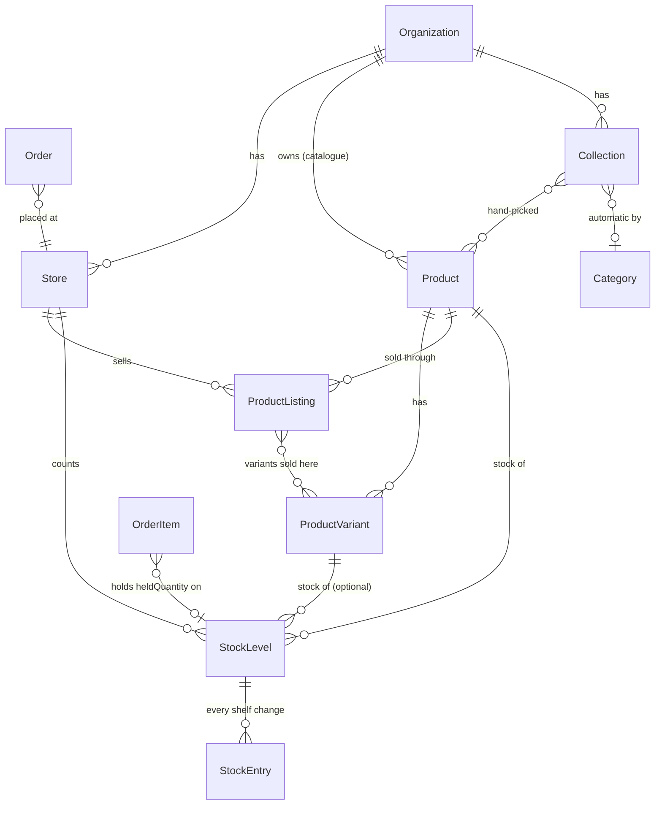
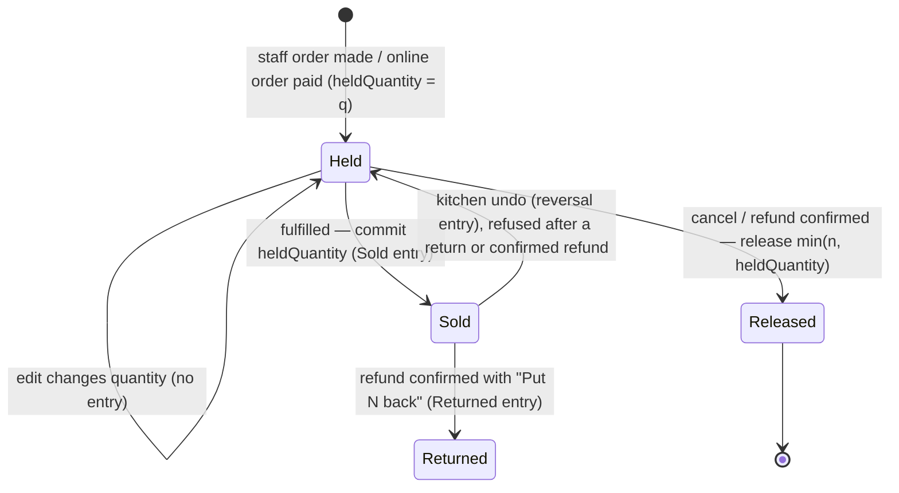
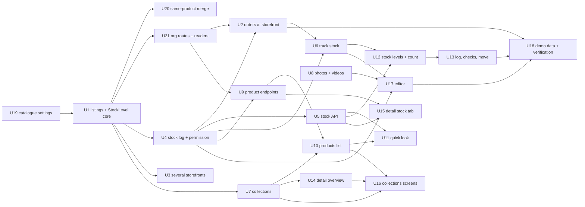

# Products and Stock

## Summary

Move the catalogue from "a product belongs to one storefront" to "the business owns one catalogue, storefronts sell from it through listings, and stock is counted per storefront", then build on that: a stock log every shelf change writes to, a Stock screen, Collections, 15 photos and 3 videos, and the Products list, Product Detail and Editor updated to the new designs. Foundations land first (data, API, rules), screens second.

---

## Problem Frame

Products v2 (#481) shipped from earlier versions of the four product designs. The designs have since moved on: Rye & Co. with a counter on Hill Road and an online shop that count stock separately, a Stock screen that logs every change and lets staff count the shelf, collections, and more media. The product today allows one storefront per business (ADR-006), ties each product to that storefront, and holds stock as a single number with no history — so the designs cannot be built as screens alone. The workspace fakes a business catalogue by grouping products with the same SKU across storefronts (`mergeCatalogue`), which is a guess.

---

## Requirements

- R1. A business can have several storefronts (plan entitlement, default 5); a single-storefront business sees no pickers or "across N storefronts" copy.
- R2. The catalogue belongs to the business. A storefront sells a product through a listing; a variant can be left out of a storefront.
- R3. Stock (on hand, promised, warning level) is counted per storefront and per variant (or per product without variants).
- R4. No overselling: a storefront sells on hand − promised; at 0 it is Sold out there and new orders are refused.
- R5. When stock is promised: an order made by staff (pay later, pay on collection, payment link) promises its units when it is made; an online checkout promises only when paid — a cart or unpaid checkout holds nothing. If two online payments race for the last unit, the loser is refunded in full automatically.
- R6. Promised units come back when an order is cancelled, or when a refund is confirmed by the provider while the line still holds units — per line for a line refund, never more than the line holds.
- R7. A refund after fulfilment can put items back on the shelf ("Put N back in stock", off by default), writing a Returned entry once the refund is confirmed.
- R8. Every shelf change writes one stock-log entry in the same transaction; entries are never edited or deleted; Undo writes a reversing entry.
- R9. A count may be saved below promised; the gap shows as "N short".
- R10. A "Count and move stock" permission (`inventory:write`) held by Owner and Admin — and by anyone holding `store:write`, including existing custom roles — grantable to custom roles; prices, names, listings and the Track stock switch still need `store:write`.
- R11. Stock can be moved between storefronts (only what isn't promised), as a pair of entries.
- R12. Stock tracking can be switched off per product and for the business; untracked products always sell.
- R13. Collections: hand-picked or automatic by category; a product shows its collections and the website pages that show it (from the published site).
- R14. 15 photos and 3 videos per product.
- R15. Products that are clearly the same in different storefronts of one business become one catalogue product listed at both, each storefront keeping its stock; anything not clearly the same stays separate and is listed for the owner.
- R16. The Products list, its quick look, the Stock screen, Product Detail and the Editor match the new designs (copy, sizes, colour roles, states, phone layout), within the decisions below and the deliberate differences named per unit.
- R17. Rye & Co. carries the designs' two storefronts (Hill Road, Online) for side-by-side checks; Northwind (the writable business) and Leela & Loom gain an "Online" storefront; all carry a week of stock log; the product-editor film script stays true.

---

## Scope Boundaries

- One website per business stays (ADR-006 for websites).
- No Paused status — "Stop selling" archives, "Sell again" publishes (DEC-032).
- No Scheduled publishing; no Tabs layout in the Editor (KD13 of the #481 plan).
- No video transcoding (U8).
- Stock checks cover the three kinds in the design.
- The public shop, cart and online checkout do not exist yet and are not built here; R5's online rules live in the stock-reserve function and DEC-032 so the shop inherits them.
- Stock changes are recorded in the stock log, not in Settings › Activity.

### Deferred to Follow-Up Work

- Public product page and a Products/Collection site block (#473): until it exists, "Shown on the website" reads "The website doesn't show products yet."
- Online checkout that creates an order only on payment, and wiring its automatic refund for a lost last unit (#473 / a shop epic). U2 provides `reserveOnPayment` with an idempotent refusal contract.
- A fourth stock check, "Promised to unpaid orders older than N days", with Cancel.
- Stock changes in Settings › Activity (a separate decision if wanted).
- Disconnecting a payment or email provider isn't recorded in Activity (#509 covers settings changes only).
- Manual "merge these two products" for pairs the migration left separate.
- Dropping `Product.storeId`, `Inventory` and `VariantInventory` (a later two-deploy change).

---

## Context & Research

### Relevant Code and Patterns

- Stock lifecycle today: `apps/api.saroh.in/src/modules/orders/order-inventory.ts` (`phaseOf`, `applyInventoryTransition`, `adjustReservation`, `RESERVING_STATUSES`, `heldRow`), triggered from `orders.service.ts` (create, `updateStatus`), `order-kitchen.service.ts` (`moveStage`, `undoStage`, `edit`). Refunds (`payments.service.ts` sync settle, `webhooks.service.ts` `applyRefund`/`settleRefund`, which locks `PaymentRefund` first) never touch stock. `OrderItem.stockRow` (PRODUCT | VARIANT | NONE) records where a hold landed. The first hold (`from === "RELEASED"`) reads with no row lock — an oversell race today.
- Products API: `modules/products/{products,inventory,variants,product-overview,product-images}.service.ts`, `open-promises.ts`, `serialize.ts` (the "product SKU" is `variants[0]?.sku` — `Product` has no SKU column), controllers under `stores/:storeId/products` with `@RequireModule("COMMERCE")`. Catalogue settings (per store today): `modules/catalogue/*`, `modules/categories/*`; `customer-workspace/contact-notes.service.ts` reads allergens across storefronts.
- Storefronts: cap in `modules/organizations/business-limits.ts`; creation `modules/stores/stores.service.ts` (`createForUser`); soft close `modules/stores/storefronts.service.ts` (`close`). Entitlements `modules/billing/entitlement.service.ts` (`FREE_ENTITLEMENTS` has no `storefronts` key — missing means unlimited); pattern `SitesService.createFromTemplate` (product cap first, entitlement second).
- Permissions: `modules/organizations/{organization-actions,organization-policy,capability-catalogue}.ts`; custom roles keep their stored action list verbatim (`resolveCapabilities`); product routes gate via `StoresService.writableOrganization` (with a legacy dual-read). App: `apps/app.saroh.in/lib/products/access.ts`.
- Media: `ProductImage`, `PRODUCT_IMAGE_LIMIT` (`modules/products/dto.ts`), `modules/media/media.service.ts` (`createUpload`, `completeUpload` HEADs size only), `packages/object-storage/src/validation.ts` (images only, 25 MB).
- Collections-adjacent: `Category` (per store, `parentId`), `Discount.appliesTo = "COLLECTION"` (really categories; `discounts/redeem.ts`), `Publication` snapshots (ADR-002), `servicesList` block as the ids-only live-fetch pattern.
- Append-only timeline with undo to mirror: `OrderEvent` in the kitchen service.
- App: `app/(shell)/commerce/products/*`, `components/stores/catalogue-screen.tsx` (with the inline `ProductPreview` quick look), `components/stores/products-tabs.tsx`, `components/commerce/product-page/*`, `lib/products/overview-rules.ts`, `components/commerce/product-editor-v2/*`, `lib/products/*` (`catalogue.ts` `mergeCatalogue`, `service.ts`, `links.ts` `?storefront=`). Pages that pick a lone store are listed under U3.
- Migrations to copy: `packages/database/prisma/migrations/20260923150000_products_v2/` (RLS policies); backfill scripts: `packages/database/src/backfill/` (e.g. `s1-002-organizations.ts`); partial unique indexes already used (`previewFeatures ["partialIndexes"]`, `Invoice_one_per_order`).
- Seeds: `packages/database/src/seed/run.ts` (Northwind `seed_org`/`seed_store`), `seed/showcase/{run,commerce,boutique,boutique-catalog,bakery,check}.ts` (Leela & Loom, Rye).
- Tests: unit `apps/api.saroh.in/jest.config.js` (explicit `testMatch` — new unit specs must be listed), integration `jest.integration.config.js` (DB via `db push`, so migration SQL never runs there), app `vitest` on `lib/**`, e2e `e2e/tests/*`, permissions matrix `e2e/permissions/*`, migration replay `packages/database/src/verify-migration-replay.cli.ts` (empty DB only).

### Institutional Learnings

- Migrations pass `db:verify:replay`; everything a migration creates is declared in `schema.prisma`; destructive changes ship in two deploys; every new org-owned table carries `organizationId` and gets `ENABLE/FORCE ROW LEVEL SECURITY` with an `org_isolation` policy.
- Stock races take an explicit row lock, not an isolation level (DEV_LEARNINGS "RLS quietly dropped Serializable"). Lock order is written down per flow; the reverse order deadlocked in #508. One reserve function on the caller's transaction (`reserveInTx`).
- A new permission needs a catalogue label (`capability-catalogue.spec.ts`).
- DEC-026: a refund is real only when the provider confirms it.
- Demo stores are film sets; Northwind is the only business written to in browser checks.

### External References

- None — strong local patterns for every layer.

---

## Key Technical Decisions

- **`StockLevel` keyed by storefront × product × variant (variant nullable)**, two partial unique indexes; writes use find-under-lock plus create rather than upsert (Prisma may not expose a partial compound unique for upsert).
- **`OrderItem.stockLevelId` and `OrderItem.heldQuantity`**: the row a line's hold sits on and how many units it holds now. Reserve, release, commit and return read and write `heldQuantity` under the row lock; release(n) takes min(n, heldQuantity); commit moves heldQuantity, not line quantity. This is what makes line refunds, cancels, kitchen undo and edits safe to combine. Lines with `stockRow = NONE` keep a null id for life.
- **Lock order, every flow:** Order → StockLevel rows (sorted by id) → PaymentRefund → payment intent → Invoice → Booking. The refund webhook resolves the order id without locking, then locks in this order; the success webhook that will call `reserveOnPayment` locks intent → Order → StockLevel and never takes an intent while holding StockLevel. Switching a product to variants locks the affected open Orders first.
- **One stock module** (`modules/stock/`) owns reserve, reserveOnPayment, commit, release, returnToShelf, adjust, count, move, reverse — all on the caller's transaction, all writing the log where the shelf changes. `order-inventory.ts` becomes a thin caller.
- **Promises are not logged**; the log records shelf changes only (sold, returned, baked, received, wasted, counted, moved, reversed), so it adds up to what's on the shelf. A check compares each row's promised with the sum of open lines' heldQuantity.
- **Reversal reverses the delta** (count 10→8, then 3 sold leaves 5; undoing the count adds the 2 back → 7, never "restore 10"), refused if on hand would go below 0; only hand-made entries (received, baked, wasted, counted, moved) can be reversed through the stock API — Sold and Returned only through their order flows; a moved pair always reverses both sides; a reversal can't be reversed; batch Undo is all-or-nothing.
- **Counts carry the expected value the counter was shown and the counted value;** the server compares the expected value with its locked on hand and flags "Count didn't match" when the shelf moved.
- **Refunds and stock:** a refund records its lines and any "put back" quantity when requested; release and Returned run only in the transaction where the refund moves into SUCCEEDED (idempotent across webhook redelivery and the sync path); a line already committed releases nothing; put-back ≤ units sold minus already returned; a refund with no lines (made in the provider's dashboard) releases stock only when it brings the order to fully refunded, otherwise it shows under Stock checks.
- **`reserveOnPayment` is idempotent per payment intent;** a refused intent is recorded, repeat calls return the same refusal, and the automatic refund uses a provider idempotency key from the intent id and follows DEC-026.
- **Permission helper:** `canWriteStock(ctx) = allows inventory:write or store:write`, and `resolveCapabilities` adds `inventory:write` whenever the resolved set holds `store:write` (so existing custom roles keep counting). Every stock endpoint and the `canStock` read flag use it.
- **Permission table:**

  | Action | Needs |
  |---|---|
  | Count, adjust (+N), receive/bake/waste/return entries, move, reverse, resolve a check, warning level | `inventory:write` (via `canWriteStock`) |
  | Track stock on/off (product or business), listings and "Sell it at", price, name, duplicate, collections | `store:write` |
  | "Put N back in stock" | the refund permission (part of the refund) |
  | Read levels, log, checks | `store:read`; people's names in the log need `audit:read`, order links need `order:read` |

  The Editor's Stock-section save refuses tracking and listing fields from an `inventory:write`-only caller.
- **Tenant safety:** every new table (ProductListing, ProductListingVariant, StockLevel, StockEntry, StockCheckResolution, Collection, CollectionProduct) has a required `organizationId`, RLS and an `org_isolation` policy; composite foreign keys tie (storeId, organizationId), (productId, organizationId) and (variantId, productId) together; new controllers use the COMMERCE module guard and an organization-context guard; store-route aliases resolve the store's organization and call the same organization-scoped service with the same permission helper.
- **Catalogue backfill runs as additive migrations plus a TypeScript backfill script** (`packages/database/src/backfill/`), so integration tests can seed old-shape rows, run it twice and assert the result.
- **Clearly-the-same rule for merging** (per organization only): same name, same option, the same full set of variant SKUs, the same prices and MRPs per variant, the same GST rate/HSN and the same tracking. Products without variants never merge. The oldest survives; variants map by SKU; every reference is re-pointed (order lines and their variants, reviews, photos within the limit, discount products de-duplicated, field values, allergens) before the loser is removed. Products or categories whose merge would widen a live discount's reach stay separate. Everything not merged, and every discarded value, goes into the merge report.
- **Product slugs unique per organization;** colliding slugs among unmerged products get a suffix, recorded in the report.
- **Forward-only rollout:** U19, U1 and U20 are forward-only once deployed. Rollback means restoring the database snapshot taken just before the deploy (a release step, verified), not redeploying old code.
- **Storefronts are soft-deleted only** (`StorefrontsService.close`), refused while any stock is on hand or promised there, checked under the storefront's StockLevel locks; stock writes refuse a closed storefront. `Product.storeId` becomes `onDelete: SetNull`, so no store deletion removes catalogue products.
- **Listings:** listing reuses an existing StockLevel row with its stock; unlisting with stock on hand is allowed, and that stock shows as "Not sold here · N on hand" and can be counted out or moved. Open orders at an unlisted storefront still fulfil; new ones are refused.
- **Tracking:** turning off locks the product's StockLevel rows, is refused while any are promised, and writes a counted-to-0 entry for rows with stock on hand, so the log still adds up; turning on writes nothing (rows are at 0). Reserve re-reads `stockTracked` after taking its locks. A kitchen undo on a product that is now untracked moves no stock. The business switch follows the same rules for every product.
- **Automatic collections are computed when read** from category (non-archived products); a category an automatic collection uses can't be deleted; hand-picked membership survives archiving (hidden), so "Sell again" restores it. The discounts "Collection" option is relabelled "Category".
- **Video:** MP4 and MOV up to 50 MB through a video purpose; on completion the server reads the first bytes and requires an ISO-BMFF `ftyp` box, otherwise the media is marked failed; a video slot needs a video media, a photo an image; posters come from a media id; media are served with `X-Content-Type-Options: nosniff`; no transcoding — a video the browser can't play falls back to its poster with "Open video". Duplicating copies photos and videos by reference.
- **Subscriptions, plans, bookings and class packs never reserve product stock.**
- **Layout for 3–5 storefronts:** the Stock screen's Levels and the product Stock tab keep the product column fixed and scroll storefront columns sideways beyond two; storefront chips narrow the view; the Move dialog lists every open storefront.

---

## Open Questions

### Resolved During Planning

- Unpaid holds: staff-made orders promise at creation; online checkouts promise only when paid (user, 25 Sep).
- Last unit, two online payments: the loser is refunded automatically — "Sorry, it sold out while you were paying — your money is on its way back." (user).
- Returns: the refund sheet offers "Put N back in stock", off by default (user).
- `inventory:write`: Owner and Admin by default; custom roles may be given it (user).
- Same-product pairs: merge when clearly the same (user; the clearly-the-same rule above).
- Track stock switch: Owner and Admin only (`store:write`), locked for stock-only roles — a deliberate difference from the Editor design (user).
- Reference business for side-by-side checks: Rye gets the designs' two storefronts in the seed; Northwind is where writes are tested.

### Deferred to Implementation

- Exact index and constraint names; whether each backfill fits one script or two after timing it on a production-sized copy.
- ~~Whether the merge report is a one-off banner or an Activity entry (U20, with real seed data); either way Owner/Admin only.~~ Resolved in U20: an entry, not a banner — the full report in the audit stream (`catalogue.products.merged`, read at `GET /organizations/:id/catalogue/merge-report` with `audit:read`) and one notice in the Owner/Admin inbox (`notification:read`), which the header's bell badge shows on every page. No banner state to build or dismiss.
- Poster capture on browsers without frame access: fall back to a generic poster.
- Whether legacy StoreOwner/StoreMember grants carry `inventory:write` on organization routes or are migrated to memberships first.

---

## High-Level Technical Design

> *This illustrates the intended approach and is directional guidance for review, not implementation specification. The implementing agent should treat it as context, not code to reproduce.*

A line's units at a storefront:

---

## Implementation Units

Units keep the issue numbers created on 25 Sep; U20 and U21 are new issues split out of U1. F/S labels are shown for cross-reference.

Ship order for the foundations: U19 → U1 → U20 → U21 → U4 → U2, each migration replay-checked and each preceded by a verified database snapshot.

### U19. Catalogue settings move to the business (#529 — new)

**Goal:** Categories, options, custom fields, catalogue defaults, allergens and the SKU pattern belong to the business.

**Requirements:** R2, R15

**Dependencies:** None

**Files:**
- Modify: `packages/database/prisma/schema.prisma` (Category, ProductOption, ProductField, CatalogueDefaults, StoreAllergen → organization-scoped)
- Create: `packages/database/prisma/migrations/<ts>_catalogue_settings_to_business/migration.sql`, `packages/database/src/backfill/<ts>-catalogue-settings.ts`
- Modify: `apps/api.saroh.in/src/modules/categories/*`, `modules/catalogue/{catalogue,fields,sku,options,allergens}.service.ts`, `catalogue.controller.ts`, `modules/customer-workspace/contact-notes.service.ts`
- Modify: `apps/app.saroh.in/lib/products/settings.ts`, `app/(shell)/commerce/products/settings/page.tsx`, `commerce/products/categories/page.tsx`
- Modify: `packages/database/src/seed/run.ts`, `seed/showcase/{commerce,boutique,bakery}.ts` (write organization-scoped settings)
- Test: `apps/api.saroh.in/src/modules/catalogue/catalogue.org-scope.db.spec.ts`, `packages/database/src/backfill/catalogue-settings.db.spec.ts`, `modules/categories/categories.service.spec.ts`

**Approach:**
- Add a required `organizationId`; the backfill fills it from the store and merges duplicates across a business's storefronts by slug (categories) or name (options, fields, allergens). It re-points products, `DiscountCategory`, `ProductFieldCategory`, `CatalogueDefaults.categoryId`, `Category.parentId`, `ProductVariant.optionValueId` and `ContactNoteAllergen`. CatalogueDefaults merge per key (first storefront wins; discarded values reported); categories with different parents stay separate.
- A category whose merge would let a live category discount reach another storefront's products stays separate (reported).
- Slugs unique per organization. Routes move to `organizations/:org/catalogue/...` (COMMERCE module guard, organization-context guard); old `stores/:storeId/...` routes stay as thin aliases for one release.
- RLS on every touched table.

**Execution note:** Characterization-first on the catalogue settings reads for a one-storefront business.

**Patterns to follow:** `20260923150000_products_v2` (RLS); `packages/database/src/backfill/s1-002-organizations.ts`.

**Test scenarios:**
- Happy path: a one-storefront business migrates with identical ids and no visible change.
- Edge case: two storefronts each with "Breads" → one category; products, category discounts and field categories point at it.
- Edge case: "Breads" at A is covered by a live category discount → A's and B's "Breads" stay separate and are reported.
- Edge case: same option name, different values → one option with the union; variant option values re-pointed.
- Error path: another business's categories → 404.
- Integration: the backfill script run twice changes nothing; `db:verify:replay` passes.

**Verification:** Product settings show the business's settings once, whatever the storefront; the seeds write the new shape.

---

### U1. Listings and stock per storefront — the core (#510, F1)

**Goal:** Products belong to the business; `ProductListing` says where each is sold; `StockLevel` holds stock per storefront; order lines know their held row and quantity.

**Requirements:** R2, R3

**Dependencies:** U19

**Files:**
- Modify: `packages/database/prisma/schema.prisma` (Product.organizationId required, `@@unique([organizationId, slug])`, storeId nullable with `onDelete: SetNull`; ProductListing; ProductListingVariant; StockLevel; OrderItem.stockLevelId, OrderItem.heldQuantity)
- Create: `packages/database/prisma/migrations/<ts>_catalogue_listings_stock_levels/migration.sql`, `packages/database/src/backfill/<ts>-listings-stock-levels.ts`
- Modify: `apps/api.saroh.in/src/modules/products/{products,inventory,variants,product-overview,product-images}.service.ts`, `open-promises.ts`, `serialize.ts`, `dto.ts`
- Create: `apps/api.saroh.in/src/modules/products/listings.service.ts`
- Modify: `packages/database/src/seed/run.ts`, `seed/showcase/{run,commerce,boutique,bakery,check}.ts` (write listings and StockLevel)
- Test: `packages/database/src/backfill/listings-stock-levels.db.spec.ts`, `apps/api.saroh.in/src/modules/products/listings.db.spec.ts`, updates to `variants.v2.spec.ts`, `products.sections.spec.ts`, `products.service.spec.ts`

**Approach:**
- New tables with required `organizationId`, RLS, composite foreign keys.
- Backfill: organization from the store (a product with no resolvable organization stops the backfill loudly); one listing per product at its store with all variants; one StockLevel per Inventory/VariantInventory row; `stockLevelId` and `heldQuantity` for every line with `stockRow` PRODUCT/VARIANT (or null on a tracked product), open or committed; slug collisions suffixed and reported.
- Services read and write through listings and StockLevel; `Inventory`/`VariantInventory` stop being written.
- Listing reuses an existing StockLevel; switching to variants locks the affected Orders first, then moves each storefront's held units to its variant rows.

**Execution note:** Characterization-first — pin today's product list/get/update and stock behaviour for a one-storefront business.

**Patterns to follow:** `open-promises.ts`; `packages/database/src/backfill/`.

**Test scenarios:**
- Happy path: a one-storefront business sees identical list, detail and stock after the backfill.
- Happy path: listing at a second storefront creates a StockLevel at 0; unlisting keeps it; relisting reuses it with its stock.
- Edge case: a variant excluded at storefront B is not orderable there and reads "Not sold here".
- Edge case: switching to variants with open orders at two storefronts moves each storefront's held units.
- Edge case: a fulfilled pre-backfill line gets its `stockLevelId`, so "Put back in stock" works on it.
- Error path: a listing at another business's storefront → 404; a StockLevel pairing ids from two businesses is rejected by the database.
- Integration: the backfill run twice changes nothing; `db:verify:replay` passes.

**Verification:** Every storefront's shelf numbers unchanged by the backfill; seeds produce listings and StockLevel.

---

### U20. Same-product merge and the merge report (#530 — new)

**Goal:** Products that are clearly the same across a business's storefronts become one catalogue product.

**Requirements:** R15

**Dependencies:** U1

**Files:**
- Create: `packages/database/src/backfill/<ts>-merge-same-products.ts`, `apps/api.saroh.in/src/modules/products/merge-report.service.ts`
- Test: `packages/database/src/backfill/merge-same-products.db.spec.ts`

**Approach:** Per organization only, apply the clearly-the-same rule; oldest survives; map variants by SKU; re-point order lines and variants, reviews, photos (within the limit), discount products (de-duplicated), field values and allergens; move the loser's listings and StockLevel rows onto the survivor; assert no cascaded rows remain; skip products whose merge would widen a live discount; write the report (Owner/Admin only).

**Test scenarios:**
- Happy path: identical product at Hill Road and Online → one product, two listings, two StockLevels with their original numbers; past orders point at the survivor.
- Edge case: same name and SKUs, different prices → stay separate, reported.
- Edge case: different variant sets → separate. Products without variants → never merged.
- Edge case: two businesses with the same product → never merged.
- Edge case: a product discount covering one of the pair → separate, reported.
- Integration: run twice → no further change.

**Verification:** The report lists every pair not merged and every discarded value.

---

### U21. Organization routes, the readers, and the app off `mergeCatalogue` (#531 — new)

**Goal:** Everything that reads products moves to the catalogue model.

**Requirements:** R2

**Dependencies:** U1

**Files:**
- Create: `apps/api.saroh.in/src/modules/products/listings.controller.ts`; organization-scoped product routes
- Modify: `apps/api.saroh.in/src/modules/products/{products,product-details}.controller.ts` (store aliases), `imports/imports.service.ts`, `discounts/{redeem,discounts.service}.ts`, `invoices/order-invoicing.ts`, `capabilities/module-backfill.ts`, `customer-workspace/customer-detail.service.ts`, `product-reviews/*`, `catalogue/*.service.ts`
- Modify: `apps/app.saroh.in/lib/products/{service,links,catalogue,actions}.ts` (remove `mergeCatalogue`), `lib/orders/service.ts`, `lib/discounts/options.ts`
- Test: `apps/api.saroh.in/src/modules/products/products.access.spec.ts`, `products.gate.spec.ts`, `products.alias.db.spec.ts`

**Approach:** `organizations/:org/products` with COMMERCE module and organization-context guards; `stores/:storeId/products` aliases resolve the store's organization and call the same service, requiring a listing at `:storeId`; the legacy inventory PUT routes through the stock module and writes an entry (after U4).

**Test scenarios:**
- Happy path: the app's product screens load through organization routes.
- Error path: another business's product id with this business's store id on an alias → 404.
- Error path: COMMERCE off → 403 on every new route.
- Integration: a stock write through the alias writes one StockEntry.

**Verification:** No app call uses `mergeCatalogue`; every reader listed above has a test on the new model.

---

### U2. Orders hold, sell and release at the storefront (#511, F2)

**Goal:** All order stock moves go through the stock module at the order's storefront with the new rules.

**Requirements:** R4, R5, R6, R7

**Dependencies:** U1, U4, U21

**Files:**
- Modify: `apps/api.saroh.in/src/modules/orders/{order-inventory,orders.service,order-kitchen.service,order-pricing}.ts`
- Modify: `apps/api.saroh.in/src/modules/payments/payments.service.ts`, `webhooks/webhooks.service.ts`
- Create: `apps/api.saroh.in/src/modules/stock/reserve.ts`
- Modify: `apps/app.saroh.in/components/commerce/order-detail/*` (refund sheet "Put N back in stock"), `components/stores/order-form.tsx`
- Test: `apps/api.saroh.in/src/modules/stock/reserve.db.spec.ts`, updates to `orders/order-kitchen.db.spec.ts`, `orders.service.spec.ts`, `payments/*.spec.ts`, `webhooks/*.spec.ts`

**Approach:** As in the Key Technical Decisions (held quantity, lock order, refund transition, idempotent `reserveOnPayment`). Staff-made orders hold at creation. Refusal copy "Sold out" or "Only N left at Hill Road". Order edits adding a variant not listed at the order's storefront are refused; edits write no entries. Kitchen undo from fulfilled writes a reversal and re-holds, refused once the line has a Returned entry or a confirmed refund.

**Execution note:** Start with a failing concurrency test: two orders for the last unit at one storefront.

**Patterns to follow:** `reserveInTx` in bookings/courses; lock-order notes in `docs/patterns/backend-billing-and-classes.md`.

**Test scenarios:**
- Happy path: 10 on hand, orders for 10 → Sold out there; an 11th order is refused.
- Happy path: cancelling returns its units.
- Edge case: 10 at Hill Road, 0 at Online → Online Sold out, Hill Road sells.
- Edge case: line refund confirmed, then the order is cancelled → the line is released once.
- Edge case: line refund confirmed, then the rest fulfilled → commit moves only what is still held.
- Edge case: refund PENDING, order fulfilled, then confirmed → stock unchanged, promised never negative.
- Edge case: refund webhook delivered twice → released once.
- Edge case: refund FAILED with "Put back" ticked → no Returned entry.
- Edge case: fulfil → kitchen undo → fulfil nets −q with Sold, reversal, Sold entries.
- Edge case: refund after fulfilment with "Put 2 back in stock" → +2 on hand on confirmation, Returned entry; without the tick → no change.
- Edge case: dashboard refund with no lines, partial → releases nothing, appears under Checks; bringing the order to fully refunded → releases the rest.
- Error path: two concurrent orders for the last unit → one succeeds, one gets "Sold out".
- Error path: `reserveOnPayment` twice for a losing intent → one refusal recorded, one refund request.
- Integration: a refund webhook racing a cancel on the same order doesn't deadlock.
- Integration: a line placed while untracked stays untracked after tracking is turned on.

**Verification:** For every row, promised equals the sum of open lines' heldQuantity; every shelf change from an order has one entry.

---

### U3. Several storefronts: lift the cap, create and manage them (#512, F3)

**Goal:** A business can add storefronts up to its plan; one-storefront businesses see no change.

**Requirements:** R1

**Dependencies:** U1

**Files:**
- Modify: `apps/api.saroh.in/src/modules/organizations/business-limits.ts`, `modules/stores/{stores,storefronts}.service.ts`, `modules/billing/entitlement.service.ts` (`storefronts` in `FREE_ENTITLEMENTS`), `packages/database/src/seed/data.ts`
- Modify: `apps/app.saroh.in/lib/business-limits.ts`, `app/(shell)/commerce/storefronts/new/page.tsx`, `components/stores/storefronts-screen.tsx`, and the pages that pick a lone store: `commerce/products/new`, `products/import`, `products/settings`, `customers/new`, `customers/import`, `orders/new`, `components/stores/{orders-screen,catalogue-screen,discounts-screen,discount-form,order-form,customers-screen}.tsx`, `components/organizations/business-hours-section.tsx`, `lib/discounts/options.ts`, `components/shared/command-menu.tsx`
- Test: `apps/api.saroh.in/src/modules/stores/{stores.service.create-cap,storefronts}.spec.ts`, `modules/billing/entitlement.service.spec.ts`, `apps/app.saroh.in/lib/business-limits.test.ts`

**Approach:** Product cap raised; entitlement checked second; `close` refused while stock is on hand or promised, checked under the storefront's StockLevel locks. Pickers only with more than one storefront.

**Test scenarios:**
- Happy path: a plan allowing 5 → a second storefront is created.
- Error path: at the plan limit → 403; at the product cap → 409.
- Error path: closing a storefront with 3 on hand → "Move or count out its stock first".
- Edge case: closing never removes catalogue products; a count or move into a closed storefront is refused.
- Integration: single-storefront screens render without a picker.

**Verification:** Northwind can add "Online"; one-storefront businesses look unchanged.

---

### U4. The stock log and the stock rules (#513, F4)

**Goal:** `StockEntry` records every shelf change; the stock module enforces counts, moves, reversals and the permission.

**Requirements:** R8, R9, R10, R11

**Dependencies:** U1

**Files:**
- Modify: `packages/database/prisma/schema.prisma` (StockEntry)
- Create: `packages/database/prisma/migrations/<ts>_stock_entries/migration.sql`
- Create: `apps/api.saroh.in/src/modules/stock/{stock.module,stock.service,stock-words}.ts`
- Modify: `apps/api.saroh.in/src/modules/organizations/{organization-actions,organization-policy,capability-catalogue}.ts`, `modules/products/inventory.service.ts` (remove the below-promised refusal; route through the stock module)
- Test: `apps/api.saroh.in/src/modules/stock/{stock.service.db,stock-words}.spec.ts`, `organizations/{capability-catalogue,organization-policy}.spec.ts`

**Approach:** Kinds and rules as in the Key Technical Decisions; `canWriteStock` helper; `resolveCapabilities` implies `inventory:write` from `store:write`; the migration writes one opening `counted` entry per StockLevel; the person on each entry is whoever acted (a Member moving a kitchen stage is recorded as themselves).

**Execution note:** Test-first for the arithmetic invariant.

**Patterns to follow:** `OrderEvent` (append-only with undo links).

**Test scenarios:**
- Happy path: count 10 → 8 writes counted −2 (before 10, after 8).
- Happy path: move 3 from Hill Road to Online writes −3 and +3 sharing a pair id.
- Edge case: count below promised (promised 5, count 3) saves; the row reads "2 short".
- Edge case: count 10 → 8, then 3 sold (on hand 5), Undo the count → reversal +2, on hand 7.
- Edge case: count sent with expected 10 while the shelf is now 9 → saved and flagged "Count didn't match".
- Edge case: batch Undo of three counts where one would go below 0 → none applied.
- Error path: reversing a Sold entry through the stock API → refused.
- Error path: moving more than unpromised → "Only N can be moved from Hill Road. The rest are promised to orders there."
- Error path: a stored custom role with `store:write` but no `inventory:write` can count; a Member without either gets 403; an `inventory:write`-only role changing a price → 403.
- Error path: a storefront id from another business in a move → 404.
- Integration: for every entry, before + quantity = after; the sum of entries per row equals on hand.

**Verification:** Every stock-changing endpoint writes exactly one entry (two for a move); the capability catalogue spec passes.

---

### U5. Stock API (#514, F5)

**Goal:** The endpoints the Stock screen, quick look and product page use.

**Requirements:** R8, R9, R10, R11

**Dependencies:** U4

**Files:**
- Create: `apps/api.saroh.in/src/modules/stock/{stock.controller,stock-checks.service,dto}.ts`
- Modify: `packages/database/prisma/schema.prisma` (StockCheckResolution with `organizationId` and RLS), migration
- Create: `apps/app.saroh.in/lib/stock/{service,levels}.ts`
- Test: `apps/api.saroh.in/src/modules/stock/{stock.controller.db,stock-checks.service.db,stock.gate}.spec.ts`, `apps/app.saroh.in/lib/stock/levels.test.ts`

**Approach:** `GET organizations/:org/stock`, `GET …/stock/log`, `POST …/stock/counts` (each row: expected, counted), `POST …/stock/entries`, `POST …/stock/adjust`, `POST …/stock/moves`, `POST …/stock/reverse`, `GET …/stock/checks` (short; count didn't match; sale not taken from stock; promised ≠ sum of held) and `POST …/stock/checks/:key/resolve`; permissions per the table; COMMERCE module guard. `lib/stock/levels.ts` holds can-sell / short / low / sold-out words for every screen. Client stock writes send an idempotency key.

**Test scenarios:**
- Happy path: levels for two storefronts return one column each with on hand, promised, can sell, warns at, last change.
- Happy path: log filtered by "Wasted" and a storefront returns only those.
- Edge case: an unlisted storefront reads "Not sold here" (with any stock on hand shown).
- Edge case: a line sold while untracked appears under "Sale not taken from stock".
- Error path: writes without `inventory:write` → 403; any id from another business → 404; log without `audit:read` hides names.
- Integration: adjust +5 writes a received entry and the levels read reflects it; a repeated idempotency key applies once.

**Verification:** Every Stock-screen number comes from these reads.

---

### U6. Track stock on and off (#515, F6)

**Goal:** A product (and the business) can stop counting stock.

**Requirements:** R12

**Dependencies:** U1, U2, U4

**Files:**
- Modify: `packages/database/prisma/schema.prisma` (Product.stockTracked, business switch), migration
- Modify: `apps/api.saroh.in/src/modules/products/inventory.service.ts`, `modules/stock/{reserve,stock.service}.ts`
- Test: `apps/api.saroh.in/src/modules/products/stock-tracking.db.spec.ts`

**Approach:** As in the Key Technical Decisions (locks, refusal while promised, counted-to-0 entry, re-read in reserve). Backfill `stockTracked` from whether rows existed. `store:write` only.

**Test scenarios:**
- Happy path: off → sells without limit, no entries written after the counted-to-0.
- Edge case: on again → on hand 0, Sold out until counted; the log still adds up.
- Edge case: tracking turned off while an order is being created → one of them waits; no hold lands on an untracked row.
- Error path: off with 3 promised → "3 are promised to open orders — fulfil or cancel them first".
- Error path: a stock-only role toggling → 403.

**Verification:** The Stock screen footer lists untracked products; orders for them never touch StockLevel.

---

### U7. Collections (#516, F7 — takes over #475)

**Goal:** Hand-picked and automatic collections, and where the website shows products.

**Requirements:** R13

**Dependencies:** U1, U19

**Files:**
- Modify: `packages/database/prisma/schema.prisma` (Collection, CollectionProduct — `organizationId`, RLS, composite keys), migration
- Create: `apps/api.saroh.in/src/modules/collections/{collections.module,collections.service,collections.controller,dto}.ts`
- Modify: `apps/api.saroh.in/src/modules/categories/categories.service.ts`, `apps/app.saroh.in/components/stores/discount-form.tsx` (relabel "Category")
- Test: `apps/api.saroh.in/src/modules/collections/{collections.service.db,collections.gate}.spec.ts`

**Approach:** As in the Key Technical Decisions. "Shown on the website" reads published snapshots for product or collection blocks; none exist yet, so it returns an empty list worded "The website doesn't show products yet." (#473).

**Test scenarios:**
- Happy path: a hand-picked collection lists its products in order; add/remove works.
- Happy path: an automatic "Breads" collection follows products moving into and out of Breads.
- Edge case: an archived product leaves both kinds; "Sell again" restores its hand-picked memberships.
- Error path: hand-editing an automatic collection → refused; deleting its category → refused, naming the collection.
- Error path: adding another business's product, or an automatic collection on another business's category → 404.

**Verification:** A product's overview lists its collections and (empty) website pages.

---

### U8. 15 photos and 3 videos (#517, F8 — takes over #474)

**Goal:** Products carry up to 15 photos and 3 videos.

**Requirements:** R14

**Dependencies:** None

**Files:**
- Modify: `packages/database/prisma/schema.prisma` (ProductImage.kind, durationSec, posterMediaId), migration
- Modify: `packages/object-storage/src/validation.ts`, `apps/api.saroh.in/src/modules/media/media.service.ts`, `modules/products/{dto,product-images.service}.ts`
- Modify: `apps/app.saroh.in/lib/products/editor-sections.ts`, `components/commerce/product-sections/photos-field.tsx`, `packages/site-blocks/src/product/product-page.tsx`
- Test: `apps/api.saroh.in/src/modules/products/product-images.service.spec.ts`, `modules/media/media.service.spec.ts`, `packages/object-storage/src/validation.test.ts`, `apps/app.saroh.in/lib/products/editor-sections.test.ts`

**Approach:** As in the Key Technical Decisions (content check, kind/type match, posters from media, nosniff, no transcoding).

**Test scenarios:**
- Happy path: 15 photos and 3 videos save; order and cover preserved.
- Error path: a 16th photo → "Already 15 photos — take one off first."; a 4th video → "Already 3 videos — take one off first."
- Error path: a 60 MB video → "That video is over 50 MB. Keep it under a minute, or export it smaller."; a PDF → "That is not a photo or a video. Choose a JPG, PNG, WebP, MP4 or MOV."
- Error path: a file labelled video/mp4 without an `ftyp` box → media failed; a video slot pointing at an image media → refused.
- Edge case: an existing product with 5 photos is unchanged.

**Verification:** The Editor's Photos and videos section and the product page show videos with their duration badge.

---

### U9. Product endpoints the screens need (#518, F9)

**Goal:** Duplicate, list stock detail, reviews waiting for a reply first, and permission flags in reads.

**Requirements:** R16

**Dependencies:** U4, U21

**Files:**
- Modify: `apps/api.saroh.in/src/modules/products/{products.service,products.controller,serialize,product-overview.service}.ts`
- Test: `apps/api.saroh.in/src/modules/products/{products.duplicate.db,product-overview.service}.spec.ts`

**Approach:** `POST …/products/:id/duplicate` (draft "… (copy)", SKUs "-copy" then "-copy-2", media by reference, listings copied, stock 0, slug unique per organization). List items carry promised and per-variant stock per storefront. Overview returns `canStock` (via `canWriteStock`), `canReply`, and reviews waiting for a reply first.

**Test scenarios:**
- Happy path: duplicate → draft with copied variants, media and listings; stock 0; unique slug.
- Edge case: duplicating twice → "-copy-2", no clash.
- Happy path: unanswered reviews come before answered ones.
- Error path: duplicate without `store:write` → 403.

**Verification:** The list and quick look show can sell / on hand / promised without extra calls.

---

### U10. Products list (#519, S1)

**Goal:** The list matches the design.

**Requirements:** R16

**Dependencies:** U7, U9

**Files:**
- Modify: `apps/app.saroh.in/components/stores/{catalogue-screen,products-tabs}.tsx`, `app/(shell)/commerce/products/page.tsx`
- Create: `apps/app.saroh.in/app/(shell)/commerce/products/{loading,error}.tsx`, `components/commerce/needs-you.tsx`, `lib/products/needs-you.ts`
- Modify: `apps/app.saroh.in/lib/products/catalogue.ts`
- Test: `apps/app.saroh.in/lib/products/{needs-you,catalogue}.test.ts`, `e2e/tests/products-list.spec.ts`

**Approach:** "More ▾" (Import from a spreadsheet, Product settings) and New product; tabs All · Collections · Inventory · Reviews with counts; Needs you panel with Restock; row menu Preview · Edit · Duplicate · Stop selling · Delete; variant price range with "varies"; storefront filter; "N in this view"; loading, failed, partial ("Inventory levels could not be read for X… It is not zero.") and no-results copy. Deliberate differences: the row tile shows the photo (initials only without one); the low threshold is each product's own warning level; the working status Filter stays.

**Test scenarios:**
- Happy path: Needs you lists out-of-stock and low items with the design's notes.
- Edge case: a short product shows "N short for orders already placed" with a danger dot.
- Edge case: no search results → "No products match "q"" with Clear search.
- Error path: stock read fails → "Not available", never 0.
- Integration (e2e, Northwind): Duplicate opens a draft copy.

**Verification:** Side-by-side with the design at 1440 and 390, light and dark (Rye for the reference data).

---

### U11. The list's quick look (#520, S2)

**Goal:** The quick look shows stock and lets staff add stock and stop selling.

**Requirements:** R4, R16

**Dependencies:** U5, U10

**Files:**
- Modify: `apps/app.saroh.in/components/stores/catalogue-screen.tsx` (the `ProductPreview` function; move it to its own file if it grows), `lib/stock/levels.ts`
- Test: `apps/app.saroh.in/lib/stock/levels.test.ts`, `e2e/tests/products-list.spec.ts`

**Approach:** Status pill, "3 of 12" with J/K and arrow keys; can sell · on hand · promised; short alert; per-variant "+N · Add" through adjust ("Added N to X — N can sell now"); Open product page · Edit · Stop selling / Sell again with an Undo toast. Deliberate additions beyond the list design: the per-storefront line ("Sold out at Online · 4 at Hill Road", borrowed from Product Detail) and Undo on Stop selling.

**Test scenarios:**
- Happy path: Add 5 to Large → toast and figures update.
- Edge case: J at the last product stays; K at the first stays.
- Error path: a stock-only role sees Add but not Stop selling.

**Verification:** Keyboard-only walk-through works; figures match the Stock screen.

---

### U12. Stock screen — Levels and counting (#527, S3)

**Goal:** Sell › Stock with Levels and inline counting.

**Requirements:** R3, R9, R16

**Dependencies:** U5, U6

**Files:**
- Create: `apps/app.saroh.in/app/(shell)/commerce/stock/{page,loading,error}.tsx`, `components/commerce/stock/{levels-table,count-bar}.tsx`
- Modify: `apps/app.saroh.in/components/shared/nav-items.tsx`
- Test: `apps/app.saroh.in/lib/stock/levels.test.ts`, `e2e/tests/stock.spec.ts`

**Approach:** Design copy and layout: chips, search, a column per storefront (sideways scroll beyond two with the product column fixed), "Last change", untracked footer; Count stock with the banner, 92px inputs, "Log says N / Matches the log / +N against the log", sticky bar, "Count saved: N counted, N changed." with Undo (batch reversal); locked and tracking-off states.

**Test scenarios:**
- Happy path (e2e, Northwind): count two sizes, save, Undo → reversals restore the counted rows.
- Edge case: an empty box is skipped; "1.5" → "Whole numbers only." and Save count stays off.
- Edge case: five storefronts → columns scroll, product column stays.
- Error path: without `inventory:write` there is no Count stock button.

**Verification:** Side-by-side with the design at 1440 and 390.

---

### U13. Stock screen — Log, Checks, Move stock, entries (#521, S4)

**Goal:** The rest of the Stock screen.

**Requirements:** R8, R11, R16

**Dependencies:** U12

**Files:**
- Create: `apps/app.saroh.in/components/commerce/stock/{log-list,checks-list,move-dialog,entry-sheet}.tsx`
- Test: `apps/app.saroh.in/lib/stock/log.test.ts`, `e2e/tests/stock.spec.ts`

**Approach:** Log filters (kind, storefront, `?product=`), grouped by day, the footer rules; Checks with their actions; Move stock dialog (hidden with one storefront; lists every open storefront); a sheet to record received, baked, wasted or returned.

**Test scenarios:**
- Happy path (e2e, Northwind): move 3 to Online → "Moved 3 to Online." with Undo; two entries in the log.
- Error path: "Pick two different storefronts." / "Only N can be moved from X. The rest are promised to orders there."
- Edge case: with one storefront, Move stock is not shown.
- Happy path: record 2 wasted → a warn pill entry.

**Verification:** Side-by-side with the design; log sums match levels.

---

### U14. Product Detail — header, tabs, Overview (#522, S5)

**Goal:** The top of the product page and its Overview match the design.

**Requirements:** R13, R16

**Dependencies:** U7

**Files:**
- Modify: `apps/app.saroh.in/components/commerce/product-page/{header,tabs,overview-tab,overview-parts,overview-details}.tsx`, `lib/products/{links,overview-rules}.ts`
- Create: `apps/app.saroh.in/app/(shell)/commerce/products/[productId]/error.tsx`
- Test: `apps/app.saroh.in/lib/products/overview-rules.test.ts`

**Approach:** Team/Customer switch in the crumb row, cover opens Photos, "· Changed 24 Sep"; tabs Overview · Stock (`?tab=variants` kept as alias) · Photos and videos · Reviews · Orders · Discounts · Collections with scroll fades; two stat cards, short alert, untracked card; Linked to this product (Orders, Discounts, Collections, Website, Reviews); Details grouped "How it's sold" / "On the product page" with their tags; product-specific error, 404 and locked copy.

**Test scenarios:**
- Happy path: a short product shows "Short for orders already placed" with Add stock / See the orders.
- Edge case: untracked shows "Not tracked / Always available on the shop." with Track stock (Owner/Admin only).
- Edge case: an empty field shows "Not filled in" with "Hidden until filled in".

**Verification:** Side-by-side with the design.

---

### U15. Product Detail — Stock tab and stock sheet (#523, S6)

**Goal:** Sizes and stock per storefront, recent changes, permission-aware editing.

**Requirements:** R3, R10, R16

**Dependencies:** U5, U9

**Files:**
- Modify: `apps/app.saroh.in/components/commerce/product-page/{variants-tab,sheets/stock-sheet,reviews-tab}.tsx`
- Test: `apps/app.saroh.in/lib/stock/levels.test.ts`, `e2e/tests/product-page-stock.spec.ts`

**Approach:** Columns Price · On hand · Promised · Can sell · Shop shows ("Warns at N"); a sub-row per storefront (sideways scroll beyond two), Total, footnote; Recent changes; Open checks; stock sheet per storefront; stock-only role sees prices read-only and the access line; reviews waiting for a reply first.

**Test scenarios:**
- Happy path: two storefronts show two sub-rows and a Total.
- Error path: a stock-only custom role saves on hand but prices are read-only.
- Edge case: the promised number links to that storefront's open orders.

**Verification:** Side-by-side with the design.

---

### U16. Collections on the screens (#524, S7)

**Goal:** Manage collections from the list and the product page.

**Requirements:** R13, R16

**Dependencies:** U7, U10, U14

**Files:**
- Create: `apps/app.saroh.in/components/commerce/collections/{collections-tab,collection-sheet}.tsx`, `lib/collections/service.ts`
- Modify: `apps/app.saroh.in/components/commerce/product-page/*`
- Test: `apps/app.saroh.in/lib/collections/service.test.ts`, `e2e/tests/collections.spec.ts`

**Approach:** The list's Collections tab (create, edit, hand-pick, by category); the product page's cards (automatic ones "fills itself: everything in Breads", locked), edit sheet, website cards.

**Test scenarios:**
- Happy path (e2e, Northwind): create a hand-picked collection, add two products, see it on both product pages.
- Error path: an automatic collection shows locked.

**Verification:** Side-by-side with the design.

---

### U17. Editor v2 to the new design (#525, S8)

**Goal:** The Editor matches the design and the new model.

**Requirements:** R2, R10, R12, R14, R16, R17

**Dependencies:** U4, U6, U8, U21

**Files:**
- Modify: `apps/app.saroh.in/components/commerce/product-editor-v2/{editor-shell,details-section,stock-section,photos-section,variants-section}.tsx`, `components/commerce/product-sections/description-editor.tsx`, `lib/products/editor-sections.ts`
- Modify: `docs/demos/crud-flows/01-product-editor.md`
- Test: `apps/app.saroh.in/lib/products/editor-sections.test.ts`, `e2e/tests/product-editor.spec.ts`

**Approach:** Read-only banner "You're viewing as {Role}…"; stock-only editing of the Stock section (its save refuses tracking and listing fields); "You can't open this product"; allergens while creating; description footer copy; details label by business type; Track stock switch (locked for stock-only roles — a deliberate difference from the design); "Sell it at" per variant, shown only with more than one storefront; Photos and videos with the new limits and copy. Deliberate difference: the variant control keeps "Add to list" for film continuity.

**Test scenarios:**
- Happy path (e2e): create a product with allergens set before the first save.
- Error path: a stock-only role saves Stock; Basics has no save; Track stock is locked.
- Edge case: unticking "Online" for a variant removes it from Online's listing.

**Verification:** The film script still matches the screen; side-by-side with the design.

---

### U18. Demo data, film script and verification (#526, S9)

**Goal:** The demo businesses show the new model; everything is checked end to end.

**Requirements:** R17

**Dependencies:** U2, U13, U17 (and all units)

**Files:**
- Modify: `packages/database/src/seed/showcase/{run,commerce,boutique,boutique-catalog,bakery,check}.ts`
- Modify: `docs/demos/crud-flows/*`
- Test: `packages/database/src/seed/showcase/check.ts`, `e2e/tests/four-scenes.spec.ts`, `e2e/permissions/permissions.spec.ts`

**Approach:** Rye gets the designs' Hill Road and Online storefronts (read-only in browser checks, used for side-by-side); Northwind and Leela & Loom gain "Online"; each gets its own stock and a week of stock log (sold, baked or received, wasted, a count that didn't match). The permissions matrix gets a row per endpoint in the permission table.

**Test scenarios:**
- Integration: the showcase check passes after a reset and a re-run.
- Integration: e2e list → detail → edit → stock → move on Northwind.
- Integration: the permissions matrix covers every stock endpoint.

**Verification:** Demo takes are reproducible after `db:seed:reset`.

---

## System-Wide Impact

- **Interaction graph:** orders (create, status PATCH, kitchen stage/undo, edit), payments sync settle and refund/success webhooks, invoices (lock order), imports, discounts, reviews, customer detail and contact notes, seeds, and every app page that resolves a lone storefront.
- **Error propagation:** stock refusals surface as the design's words from one place (`stock-words.ts`); a failed stock read shows "Not available", never 0.
- **State lifecycle risks:** backfills are idempotent scripts behind verified snapshots; double releases prevented by `heldQuantity` and the SUCCEEDED transition; counts racing orders use locked reads and the expected value; promised drift caught by a check.
- **API surface parity:** `stores/:storeId/...` product and catalogue routes stay as thin aliases for one release.
- **Integration coverage:** concurrency (last unit), refund webhook vs cancel, lock order with invoices, backfill scripts on old-shape data, e2e flows on Northwind, the permissions matrix.
- **Unchanged invariants:** one website per business; invoice numbering and GST (DEC-023/028); refund money rules (DEC-026); bookings, subscriptions and packs don't touch product stock.

---

## Risks & Dependencies

| Risk | Mitigation |
|------|------------|
| The catalogue change touches most commerce code | Split into U19, U1, U20, U21; characterization tests first; aliases for one release; snapshot before each deploy |
| A merge joins products that aren't the same, or widens a discount | Clearly-the-same rule per organization; discount check; everything else reported |
| Double release of promised units | `heldQuantity` per line; release only on the SUCCEEDED transition; drift check |
| Deadlocks between stock, refunds, invoices and bookings | One lock order per flow; concurrency tests |
| Existing oversell race | `FOR UPDATE` and a conditional check in U2 |
| Seeds break mid-epic | Seeds move with U19 and U1; U18 adds only the second storefronts, logs and film |
| Video a browser can't play | Poster fallback with "Open video" |

---

## Documentation / Operational Notes

- Update `docs/patterns/backend-billing-and-classes.md` (lock order with StockLevel and PaymentRefund), `docs/patterns/backend-data-and-money.md` (stock model, held quantity), DEC-032 (done), and `docs/architecture/DEV_LEARNINGS.md` when the backfills teach something.
- Each foundation deploy (U19, U1, U20, U4) is preceded by a database snapshot that is verified restorable; rollback is restoring it.
- New unit specs must be added to the explicit `testMatch` in `apps/api.saroh.in/jest.config.js`.

---

## Sources & References

- Designs: claude.ai design project 1fef6fb9-c3b1-4c04-bfc2-86d09cb32a65 (Saroh Products Screen, Product Detail, Product Editor v2, Stock)
- Decisions: `docs/architecture/adr/ADR-010-several-storefronts-one-catalogue.md`, `docs/architecture/DECISIONS.md` (DEC-030, DEC-031, DEC-032)
- Prior plan: `docs/plans/2026-09-23-002-feat-product-detail-settings-editor-plan.md` (#481)
- Issues: epic #528; #510–#527 and the new U19–U21 issues; takes over #474 (U8) and #475 (U7); defers to #473
