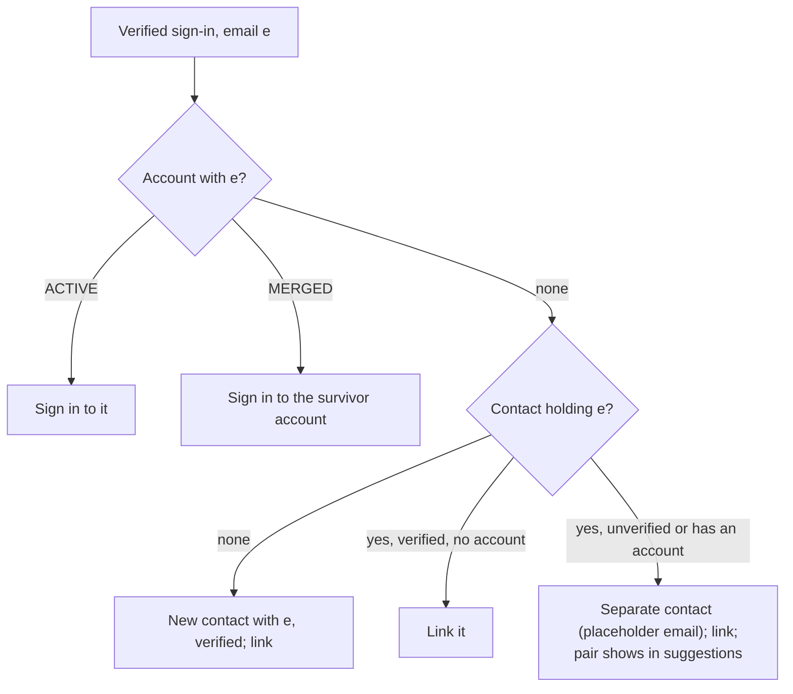
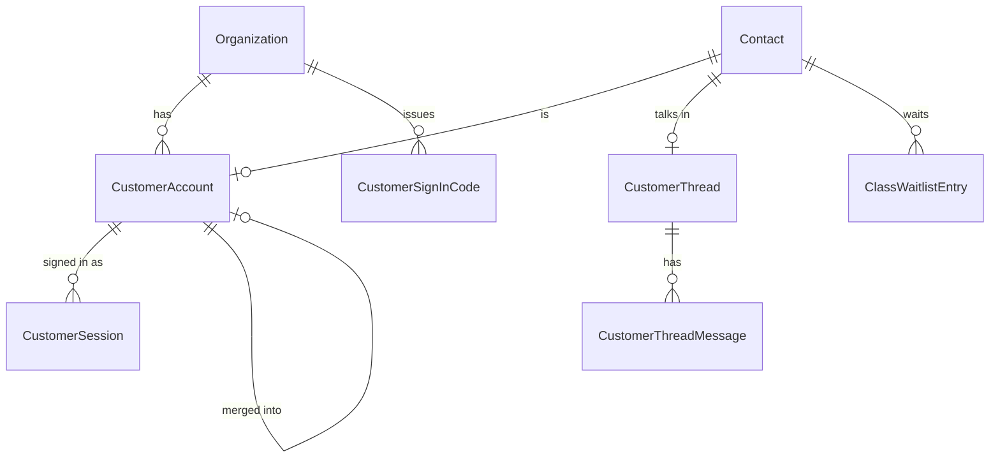
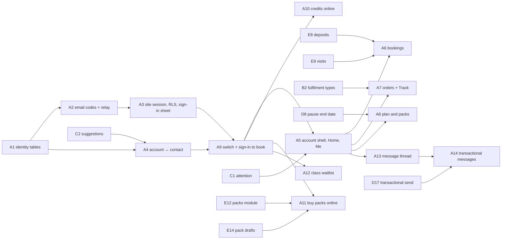

# Customer accounts and messaging on merchant sites

## Summary

Give a business's own customers an account on that business's website
(ADR-011). They sign in with a one-time code sent by email; each account belongs to one
business and is one Contact. The site then offers an account area:

- bookings, which can be moved and cancelled;
- orders, with tracking;
- the plan and packs;
- messages;
- Me.

A signed-in customer can spend class credits and buy packs online, join a
class waitlist, and message the business. Messages about their own orders,
bookings and invoices land in their account, and go out through the
business's own connected email provider.

**Phase 1 is one finished flow: sign in at the last step of booking**
(A1–A4 and A9, user, 2026-09-27). A merchant turns accounts on for a site, a
customer books with a code, and the booking lands on their customer record.
The account area (A5) ships in phase 2 with the pages it points at (A6–A8,
A13), so no customer meets a half-built account.

**Sign-in is email only this round** (user, 2026-09-27). Phone codes and SMS
are not in this plan; phone sign-in comes later as its own decision
(ADR-011 §6), listed under "Later" below and not counted as a unit.

---

## Problem Frame

The public booking page is anonymous today. ADR-008 decided so because Saroh
sent no email or SMS and could not check who was asking. Credits are spent
only at the desk, packs are sold only by staff, a full class is simply full,
and nothing tells a customer their order is ready. The Customer Site design
assumes all of these, and so do the two booking-page designs.

The user decided on 2026-09-26 to build customer accounts now (DEC-037).
Nothing in the repo models an end-customer identity. Public bookers are
stored as CRM Contacts: `Booking.contactId`, plus the booker's name, email and
phone on the booking.

---

## Requirements

- R1. A customer signs in on a merchant's site with a six-digit code sent by email. There is no phone sign-in this round. One flow serves new and returning people, and it never reveals whether an account existed.
- R2. An account belongs to one business (`organizationId`), links to exactly one Contact, and is never a Better Auth `User`.
- R3. The session is a host-only `__Host-` cookie on the site's own host. The API accepts it only for the business that host resolves to; a token from another site gets a 401. Every customer route runs under the database's row-level security for that business.
- R4. Codes and tokens are stored only as hashes. Codes expire and allow few tries. Limits apply per destination, per client address (the visitor's, relayed by the site's server under a signature) and per business, and the durable ones count database rows. No limit someone else can exhaust stops a customer from booking. Codes are refused while the business is suspended or closing.
- R5. A first sign-in links the account to an existing contact **only when that contact's email is verified** (DEC-049). Otherwise the account gets a separate contact and the pair is suggested to staff; Saroh never merges on its own. The merchant can undo a link ("This isn't them").
- R6. The account area follows the business's modules, with a bottom tab bar on phones. It holds Home, Bookings, Orders, Plan, Messages and Me, and shows only an allow-list of the customer's own data, never staff notes.
- R7. From the account, a customer can move a one-to-one booking to a free time with the same person, and cancel under the free-cancellation rule. A move never extends the free-cancellation or refund window. A class is moved on the site's booking page ("Moving: …").
- R8. Orders show their steps from the order's fulfilment type (Track), along with receipts.
- R9. From the account, a customer can see their plan, pause it for a set length and resume it, cancel it at period end (offered "pause instead"), and pay a failed invoice through its pay link. Default 8.
- R10. Signing in is asked for at the last step of booking or buying; browsing is open. The booking form fills in from the account, and a double booking of the same slot by the same person is refused. Accounts are switched on per site by the merchant, never by Saroh. Defaults 2 and 3.
- R11. A signed-in customer can spend a class credit online, under the same rules as at the desk (it covers the service, a class is left, it is valid when the class starts, and the late-cancel rule applies).
- R12. A signed-in customer can buy a published class pack online. The purchase is recorded only when the payment succeeds, on the terms shown when they started paying.
- R13. A full class offers "Join the waitlist". A freed place is offered to the first person in line and held for a while, then passed to the next. Default 9.
- R14. The customer and the business share one message thread per customer, answered by the team in the workspace.
- R15. Messages about the customer's own orders, bookings and invoices always go into the account thread. Outside it they go by email only, through the business's connected email provider, and only to the account's verified email. Saroh's own email sends sign-in codes and the sign-in-email-changed notice, and nothing else. Default 10.
- R16. Health notes a customer adds become suggestions for staff to confirm (default 12). A customer who wants their details removed asks the business by message or in person; staff use privacy removal (C11). There is no "Remove my details" in Me (user, 2026-09-27).
- R17. Workspace copy that says "Saroh doesn't message" changes only where a message is now really sent (`saroh-product.md`, "Communications").

---

## Scope Boundaries

- One account per business; there is no Saroh-wide customer identity (DEC-037).
- There are no passwords, magic links or social sign-in.
- Customers get no app and no push notifications.
- A customer cannot change plans themselves; that stays with the business (default 8).
- Saved cards and autopay are set up in D12, which depends on D11. Until then the account area shows pay links only (ADR-011 §4).
- Nothing changes for courses on the site (DEC-044). The waitlist is built for classes and can be reused for courses later.
- The invoice pay page (`/pay/<token>`) stays a token link that needs no sign-in, with no PDF download or "Share on WhatsApp" (user, 2026-09-27).
- No customer-side removal request. Privacy removal is a staff action (C11, DEC-042).

### Deferred to Follow-Up Work

- Phone sign-in, SMS codes, and SMS or WhatsApp messages to a verified phone: out of this round (ADR-011 §6, "Later" below).
- The shop's bag and checkout (G13) and the Prices page (G20). They use A3's sign-in step but are planned in epic G.
- A customer's own autopay set-up (D12).
- "Sign out everywhere" run by staff from Customer Detail. Removal (C11) and a merge (C9) already revoke sessions.
- A distributed rate limiter. The per-destination and per-business limits here are durable because they count code rows. The per-address limit uses the in-process `FixedWindowRateLimiter`, like the other public paths, keyed by the relayed visitor address.

---

## Context & Research

### Relevant Code and Patterns

- **The public site.** `apps/saroh.app/app/[domain]/{layout,page,error,loading}.tsx`,
  `[domain]/[slug]/`, `[domain]/book/page.tsx`,
  `[domain]/checkout/`. Server-side API reads live in
  `apps/saroh.app/lib/` (`publication.ts`, `booking-page.ts`, `checkout.ts`,
  `invoice-pay.ts`, `api-url.ts`). The pay page is `app/pay/[token]/`, with
  `actions.ts` for posting server-to-server. Nothing in `apps/saroh.app`
  forwards the visitor's address to the API today, and there is no shared
  secret between the two apps.
- **The booking flow.** `packages/site-blocks/src/booking-flow/` holds
  `booking-flow.tsx`, `model.ts`, `flow-state.ts`, `api.ts`, `summary.tsx`
  and `steps/`: `details-step.tsx`, `pay-step.tsx`, `pay-option.tsx`,
  `paying-card.tsx`, `done-card.tsx`, `expired-card.tsx`, `sessions.tsx`,
  `one-to-one.tsx`, `when-step.tsx`. **`api.ts` calls the API from the
  browser** (`public/services/:serviceId/book`), so a signed-in booking must
  go through a server route in `apps/saroh.app` that can read the cookie.
- **Site resolution.** `apps/api.saroh.in/src/modules/sites/public-sites.controller.ts`
  (`by-hostname/:hostname`, `by-subdomain/:subdomain`) and
  `modules/domains/domains.service.ts`. Site settings are
  `PATCH organizations/:org/sites/:siteId/settings` in `sites.controller.ts`,
  and the screen is `apps/app.saroh.in/components/sites/site-settings.tsx`.
- **Public bookings.**
  - `modules/bookings/public-bookings.controller.ts` (`public/services`:
    availability, days, holds, `:serviceId/book`; `public/sites/:siteId/booking`)
    and `public-bookings.service.ts` (`bookOnline`).
  - `booking-hold.ts` and `release-holds.handler.ts`: the 15-minute hold and
    its sweep.
  - `reservation.ts`: the serializable capacity check.
  - `rate-limiter.ts`: `FixedWindowRateLimiter`.
  - `use-membership.ts`: spends a membership's classes.
  - Tests: `public-booking.db.spec.ts`, `public-bookings.service.spec.ts`,
    `public-bookings.controller.spec.ts`; e2e `e2e/tests/public-booking.spec.ts`.
  - `Booking` has `contactId` (nullable), `bookerName/Email/Phone` and no
    record of who made it; `BookingEvent.actorUserId` is staff only.
- **Packs.** `modules/class-packs/redeem-pack.ts` (the desk's rule),
  `class-packs.service.ts` (`sell`) and `class-packs.controller.ts`.
- **Payments.** `modules/payments/public-invoices.{controller,service}.ts`
  (keyed limiters, a server-priced intent, and `runInOrgContext` once the
  token resolves the organization) and `payments.service.ts`.
  `modules/webhooks/webhooks.service.ts` (`applySuccess`) is where a success
  reconciles; a pay-now booking's invoice arrives there as a `DRAFT` and is
  issued on payment, which is the pattern a pack invoice follows (A11).
- **Identity email.** `apps/api.saroh.in/src/common/email.ts`
  (`sendVerificationOtpEmail`, `codeEmail`, a nodemailer transport). It is
  wired into Better Auth's `emailOTP` in `packages/auth/src/server.ts`, and
  the Better Auth adapter lives in `apps/api.saroh.in/src/common/auth/auth.ts`.
- **Guards, addresses and RLS.**
  - `common/guards/{better-auth,organization,origin}.guard.ts`,
    `common/client-ip.ts` (`hashClientIp`, `limitAddress`) and
    `common/trust-proxy.ts` (DEC-027). `organization-lifecycle.gate.ts`
    provides `assertOrganizationOpen`.
  - `common/interceptors/org-rls.interceptor.ts` runs a request inside
    `runInOrgContext` **only when `request.organizationContext` is set**,
    which only `OrganizationGuard` does. Public routes run with no context,
    which is the policies' permissive branch (`RLS_ROLLOUT_AND_OPS.md`).
    `public-invoices.service.ts` and `public-product-reviews.service.ts` call
    `runInOrgContext` themselves after resolving the organization.
  - `courses/courses.db.spec.ts` toggles `RLS_ENFORCEMENT` in a test;
    `packages/database/src/rls-proxy.ts` is the proxy.
- **Log redaction.** `common/logging/redact.ts` already redacts
  `/public/invoices/<token>`; the new token and code paths get the same
  treatment.
- **Communications.**
  - `modules/communications/communications.service.ts` and
    `message-send.handler.ts`.
  - `providers/{provider.port,email.provider,whatsapp.provider,provider.factory}.ts`.
  - The models are `CommunicationProvider` (EMAIL, WHATSAPP), `Message`,
    `Delivery` and `Consent`. There is no SMS channel.
- **Jobs.** `booking.notify` is enqueued in `bookings.service.ts`,
  `public-bookings.service.ts` and `reservation.ts`, but no handler is
  registered. `modules/jobs/job-handler.registry.ts` holds the registry and
  `job-consumers.spec.ts` pins it.
- **The workspace customer page.** `apps/app.saroh.in/app/(shell)/customers/[contactId]/page.tsx`
  and `components/customers/detail/{header,overview,notes,detail-screen}.tsx`.
  `modules/customer-workspace/customer-detail.service.ts` builds the aggregate.
- **Schema.** `packages/database/prisma/schema.prisma`. `Contact.email` is
  **required and `@@unique([organizationId, email])`**; `source` is a free
  string. `Invoice.number` is null while `DRAFT`. Migrations go under
  `packages/database/prisma/migrations/`, with RLS as in the products v2
  migration.

### Institutional Learnings

- Every new organization-owned table carries `organizationId` and
  `ENABLE/FORCE ROW LEVEL SECURITY` with an `org_isolation` policy. Migrations
  pass `db:verify:replay`. The integration suite uses `db push`, so a green
  `test:int` says nothing about a migration.
- RLS enforces nothing on a request with no org context, and nothing at all
  unless `RLS_ENFORCEMENT` is on **and** the connection is a `NOBYPASSRLS`
  role (`RLS_ROLLOUT_AND_OPS.md` §0). A test of the policy that sets the GUC
  itself says nothing about whether a request path sets it.
- Public routes derive the organization from the resource (here, the host's
  Site), never from the request (`backend-auth-and-access.md`).
- A token shown once and stored only as its SHA-256 is the established
  pattern (invoice pay link, ADR-007; invitations, #276).
- The in-process limiters are "a speed bump" (waitlist controller comment).
  Code limits must count rows to be real.
- A server-to-server call reaches the API from the caller's server, so the
  API's DEC-027 address is that server's, not the visitor's.
- Copy never promises a message that isn't sent (ADR-008 §3 still holds for
  what isn't built).

### External References

- `__Host-` cookie prefix rules (Secure, no Domain, Path=/) — RFC 6265bis.
- The Public Suffix List (private section): until `saroh.app` is listed,
  browsers treat every `*.saroh.app` site as the same site for `SameSite`.
- Indian transactional SMS needs a registered sender and template (DLT). This
  is relevant only to phone sign-in, later.

---

## Key Technical Decisions

- **Three tables, one family, and three columns** (A1):
  - `CustomerAccount` (organizationId, contactId unique, email, emailVerifiedAt, status ACTIVE|BLOCKED|MERGED|REMOVED, mergedIntoId, linkedAt, lastSignedInAt);
  - `CustomerSignInCode` (organizationId, destinationHash, codeHash, expiresAt, attempts, consumedAt, retiredAt, clientHash, newDestination);
  - `CustomerSession` (organizationId, accountId, siteId, tokenHash unique, expiresAt, lastSeenAt, revokedAt, userAgent summary);
  - `Contact.emailVerifiedAt` and `Contact.emailVerifiedVia` (SIGN_IN_CODE | ORDER_CONFIRMATION | BOOKING_CONFIRMATION | STAFF_CONFIRMED), both nullable;
  - `Site.customerAccountsEnabled Boolean @default(false)`.

  A partial unique index on `CustomerAccount (organizationId, email)` applies where status is not REMOVED, so a MERGED account keeps its email reserved (see Merging below). No phone column is added this round; phone sign-in adds one with its own migration.
- **Account ↔ contact linking (A4, DEC-049).** `Contact.email` is required and
  unique per business, so **at most one contact can match** an email. On the
  first verified sign-in with no account for that email:
  - **no contact holds the email** → create one with the real email, stamped verified (`SIGN_IN_CODE`), and link it;
  - **the contact holding it has a verified email and no account** → link it;
  - **the contact holding it is unverified, or already has an account under another email** → create a **separate contact** and link the account to it. The separate contact cannot take the email, so its `Contact.email` is a **reserved placeholder**, `account+<contactId>@account.invalid`, the same shape as C11's `removed+<contactId>@removed.invalid`. The verified email lives on `CustomerAccount.email`. The pair (separate contact, contact holding the email) is surfaced to staff through C2's computed suggestions, which pair a contact's account email with other contacts' emails. Staff merge it (C9/C10); nothing is linked automatically.

  Every reader of `Contact.email` goes through one helper
  (`contact-email.ts`: `isReservedContactEmail`, `contactEmailForDisplay`),
  which treats a reserved placeholder as "no email" and, for display, shows
  the account's email instead. Communications refuse to send to a reserved
  address. A4 writes no suggestion row: suggestions are computed (plan C).
- **What makes a contact's email verified.** A sign-in code proven for it (A4),
  or a transactional confirmation of an online order or booking that the
  contact made with that email, accepted by the business's email provider
  (A14 stamps it when the `Delivery` is sent). Staff confirming a merge that
  keeps the account's email stamps `STAFF_CONFIRMED` (C9). **A staff edit of
  the email clears the stamp** (C8). "This isn't them" clears it. Nothing is
  backfilled: at launch no contact is verified, so every existing customer's
  first sign-in makes a separate contact and a suggestion, until staff merge.
- **Keyed hashes.** The destination and the code are hashed with HMAC-SHA256 under a server secret from `env.ts`, so a database read does not reveal who asked or the code. The session token is plain SHA-256 of 256 random bits (high entropy, as with the pay token).
- **The site's server relays the visitor's address, signed** (A2, A3). Every
  call to `public/site-accounts/*` comes from `apps/saroh.app`'s server, whose
  DEC-027 address is its own, not the visitor's. So `apps/saroh.app` sends an
  `x-saroh-relay` header: the visitor's address (from its platform's client
  address header), the host it served and a timestamp, with an HMAC-SHA256
  over the three under a shared server-only secret (`SITE_RELAY_SECRET`, set
  in both apps). The API accepts the header only when the signature checks and
  the timestamp is within 60 seconds. **The site-accounts routes refuse a
  request without a valid relay signature (401)**: they are server-to-server
  only, so a direct caller cannot skip the site's `Origin` check or pick its
  own address. The relayed address is what the per-address limiter counts and
  what `CustomerSignInCode.clientHash` stores (hashed with `hashClientIp`).
- **Limits come from rows, and none can shut a business's booking.**
  - Per destination and client address: a resend no sooner than 30 s, at most 5 an hour and 10 a day (default 5), counted from `CustomerSignInCode` rows with the same `destinationHash` and `clientHash`.
  - Per destination overall: at most 20 a day across addresses, so an inbox cannot be flooded.
  - Per client address: `FixedWindowRateLimiter` keyed by the relayed address.
  - Per business, **only for new destinations** (an email with no ACTIVE or MERGED account, flagged `newDestination` on the row): a ceiling per hour, lower for a business in its first 14 days. Returning customers never count against it and are never stopped by it.
  - Per business per day, a ceiling on all site codes, for the sender's reputation; also lower for a new business.
  - Once a business passes half its hourly new-destination ceiling, the sign-in sheet asks for a bot challenge (Cloudflare Turnstile) before sending.
  - **Fallback.** When a code is refused by a limit the visitor did not cause (the destination-wide limit or either business ceiling), the API answers 429 with `reason: "busy"`, and the booking flow continues as a guest booking (today's form). An attacker can slow sign-ups; they cannot stop bookings.
- **One sign-in endpoint pair** under `public/site-accounts/`: `codes` (request) and `sessions` (verify). The API resolves the relayed host to a Site and Organization (the same lookup as `by-hostname`) and never takes an organization id from the body. The rest of the handler runs inside `runInOrgContext(organizationId)`.
- **Session transport.** The site's server routes read the `__Host-saroh_session` cookie and forward the token in an `x-customer-session` header, with the signed relay header. `CustomerSessionGuard` checks the relay signature, resolves the host, hashes the token and loads the session. It checks that the session's organization and site match the host's resolution and that it is neither expired nor revoked, then attaches `request.customerContext {organizationId, siteId, accountId, contactId}`. Sliding renewal writes `lastSeenAt` at most once an hour. Default 6.
- **Customer routes run under RLS** (A3). `OrgRlsInterceptor` reads
  `request.organizationContext?.organizationId ?? request.customerContext?.organizationId`,
  so every query on a customer route runs in that business's RLS context
  when enforcement is on. The guard sets `customerContext`, never
  `organizationContext`, so no staff permission check can mistake a customer
  for a member.
- **No workspace crossover.** The customer routes never read Better Auth cookies, and `BetterAuthGuard` never reads `x-customer-session`.
- **Origin.** State-changing site routes are Next.js server actions or route handlers in `apps/saroh.app`. They check `Origin` against the served host before calling the API. The check is mandatory and tested on every one: until `saroh.app` is on the Public Suffix List, `SameSite=Lax` does not separate one merchant's site from another's.
- **Email changes (A5).** A customer changes their email in Me with a code sent to the new address. The new email must be free among the business's accounts. On success: the account's email changes; the Contact's email changes with it when the Contact held the old one and no other contact holds the new one (and stays verified); otherwise the Contact keeps what it had and the pair shows in suggestions. The customer always sees the same neutral answer. **Every other session of the account is revoked**, and Saroh's identity sender tells the old address that the sign-in email was changed. A staff edit of a contact's email (C8) never changes the sign-in email.
- **The switch is per site, read live** (A9). `Site.customerAccountsEnabled` is set by `PUT organizations/:org/sites/:siteId/customer-accounts`, gated by `site:publish` because it changes the public site at once, with no publish. The options read and the booking flow read it live, never from the publication snapshot. It is off for every existing site; Saroh never turns it on.
- **Guest booking with accounts on.** With the switch on, the booking flow asks for sign-in instead of the guest details form (default 3). The anonymous API route stays open: it has no site to check (a service belongs to a business, not a site), guest booking is today's behaviour rather than a hole, and the fallback above needs it.
- **An allow-list serializer** (`customer-view.ts`) is the only way customer data leaves the API. Its tests assert that staff notes, Needs attention staff wording, other attendees and internal ids beyond opaque references never appear.
- **Spending a credit and buying a pack reuse the desk's rules.** `redeem-pack.ts` is called with a customer context. Buying goes through the invoice payment path: a `DRAFT` pack invoice with the pack's terms snapshotted, issued and turned into a `PackPurchase` in `applySuccess`, idempotent per intent. Prices always come from the server.
- **The waitlist** is a `ClassWaitlistEntry` table (organizationId, sessionKey: service + startsAt, contactId, position, status WAITING|OFFERED|ACCEPTED|EXPIRED|LEFT, offeredUntil). A freed place (cancel, release, hold expiry) enqueues `waitlist.offer`. The offer is a hold on the place, reusing booking-hold, so capacity counts stay correct. Accepting books it; expiry passes it on.
- **Messages.** One `CustomerThread` per contact and a `CustomerThreadMessage` (author CUSTOMER|STAFF|SYSTEM, body, kind, read state) rather than overloading the outbound `Message` model. `Message` and `Delivery` still record any external send, linked to the thread message.
- **Transactional sends.** One `customer.notify` job per event (order ready, booking confirmed, moved or cancelled, invoice sent, waitlist offer). It writes the thread message and then, if the business has a connected email provider, sends to the account's verified email through D17's transactional path in `CommunicationsService`, which skips marketing consent (default 10). The `booking.notify` handler is registered here and delegates to it.
- **The code email** (A2). The display name is "‹Business› via Saroh" and the subject "Your code for ‹Business›" (default 4). The business name is cleaned before it is used: control characters, URLs and anything that looks like a domain are stripped, it is cut to 40 characters, and it is HTML-escaped in the body. Site codes go out from their own sending address and stream on Saroh's identity domain, separate from workspace sign-in mail, so a complaint about one merchant's codes cannot hurt the workspace's.

---

## Permissions touched

| Action | Who | Used by | Change |
|---|---|---|---|
| `site:publish` | Owner, Admin | Turning customer accounts on or off for a site (A9) | Existing; reused because the switch changes the live site with no publish |
| `message:read` | Owner, Admin (custom grantable) | Customer Detail Messages tab, Home "Reply" row | Existing; reads customer threads |
| `message:write` | Owner, Admin | Replying to a customer | Existing |
| `contact:write` | Owner, Admin | "This isn't them" (unlink an account) | Existing; relabelled "Edit customers and contacts" in C13 (DEC-039) |
| `booking:read` | Owner, Admin, Member | Waitlist on a class's roster | Existing |
| (customer context) | the signed-in customer, own data only | every account endpoint | New guard, not an `OrgAction` (matrix §8) |

No new staff action is added in this epic.

---

## Open Questions

### Resolved During Planning

- One account per business, codes by email, through Saroh's identity sender (DEC-037, user).
- Email only this round; phone codes and SMS are out, and phone sign-in is a later decision of its own (ADR-011 §6, user, 2026-09-27).
- Credits and packs online, the waitlist, recognition, sign-in and messages are in scope (user, superseding ADR-008).
- Autopay comes from the business's provider (DEC-038, epic D).
- Linking only to a verified contact email; a separate contact otherwise (DEC-049, user, 2026-09-27).
- No "Remove my details" in Me (user, 2026-09-27).
- Phase 1 is A1–A4 and A9 (user, 2026-09-27).
- The separate contact's email is a reserved placeholder; the verified email lives on the account (this deepening, following C11's shape).

### Deferred to Implementation

- The exact session cookie name.
- The ceilings' numbers (per business per hour for new destinations, per day overall, and for new businesses). They start in code as defaults and are tuned from the first weeks' rows.
- How long the waitlist offer really needs to be for a gym at 06:00. Default 9 sets 2 hours (or 1 hour before the class); it may become a per-business setting.
- Where "Members can pause from their account" (A8) is stored: beside the business's other subscription settings.

---

## High-Level Technical Design

> *Directional guidance for review, not implementation specification.*

```mermaid
sequenceDiagram
    participant B as Browser (kavi.saroh.app)
    participant S as saroh.app server
    participant A as api.saroh.in
    B->>S: email (sign-in sheet)
    S->>S: check Origin; sign relay {visitor address, host, ts}
    S->>A: POST public/site-accounts/codes {email} + x-saroh-relay
    A->>A: verify relay; host → Site → Org (live switch on?)
    A->>A: runInOrgContext(org): limits; store hashed code; send email
    B->>S: code
    S->>A: POST public/site-accounts/sessions {email, code} + x-saroh-relay
    A->>A: verify; account ↔ contact (DEC-049); create session (hash)
    A-->>S: token (once)
    S-->>B: Set-Cookie __Host-…; HttpOnly; Secure; SameSite=Lax
    B->>S: book (server action)
    S->>A: POST public/site-accounts/bookings (x-customer-session + x-saroh-relay)
    A->>A: CustomerSessionGuard → customerContext → OrgRlsInterceptor
    A-->>S: booking
```





---

## Phases

- **Phase 1 (one finished flow: sign in to book):** A1, A2, A3, A4, A9.
  At the end of phase 1 a merchant can switch accounts on for a site; a
  customer books with an email code; the booking lands on their customer
  record, linked or suggested as a duplicate; the merchant sees "Signs in on
  your website" and can undo a link. The header's account entry stays hidden.
- **Phase 2:** A5 (the account area) with A6, A7, A8 and A13; then A10,
  A11, A12 and A14.

Ship order in phase 1: A1 → A2 → A3 → A4 → A9. A4 also waits on C2
(computed suggestions), which lands first in phase 1.

---

## Implementation Units



### A1. Customer identity tables

**Goal:** The schema for per-business customer accounts, sign-in codes and sessions, the contact's verified-email stamp and the per-site switch.

**Requirements:** R2, R4, R5, R10

**Dependencies:** None · **Phase:** 1

**Files:**
- Modify: `packages/database/prisma/schema.prisma` (CustomerAccount, CustomerSignInCode, CustomerSession; relations from Organization, Contact and Site; `Contact.emailVerifiedAt`, `Contact.emailVerifiedVia`; `Site.customerAccountsEnabled`)
- Create: `packages/database/prisma/migrations/<ts>_customer_accounts/migration.sql`
- Create: `apps/api.saroh.in/src/modules/site-accounts/site-accounts.module.ts`, `customer-account.repository.ts`
- Create: `apps/api.saroh.in/src/modules/contacts/contact-email.ts` (`reservedAccountEmail(contactId)`, `isReservedContactEmail`, `contactEmailForDisplay`), shared with C11's placeholder
- Test: `apps/api.saroh.in/src/modules/site-accounts/customer-account.db.spec.ts`, `modules/contacts/contact-email.spec.ts`

**Approach:**
- Every new table has a required `organizationId`, RLS and an `org_isolation` policy.
- Composite foreign keys tie `(contactId, organizationId)`, `(accountId, organizationId)` and `(mergedIntoId, organizationId)` together.
- Partial unique indexes: `CustomerAccount (organizationId, email)` where status ≠ REMOVED, and one account per contact where status ≠ REMOVED.
- `Site.customerAccountsEnabled` defaults to false, so every existing site is off.
- Declare everything in `schema.prisma`.
- Deleting a Contact cascades to its account and sessions. Removal in C11 is the normal path; the cascade is the backstop.
- `contact-email.ts` recognises both reserved shapes (`account+…@account.invalid`, `removed+…@removed.invalid`).

**Patterns to follow:** `20260923150000_products_v2` (RLS); the partial unique indexes (`Invoice_one_per_order`).

**Test scenarios:**
- Happy path: create an account for a contact; a second live account for the same contact is refused.
- Edge case: the same email is allowed in two businesses and refused twice in one; a REMOVED account frees its email; a MERGED account keeps it reserved.
- Edge case: `isReservedContactEmail` is true for both placeholder shapes and false for a real `.in` address.
- Error path: an account pointing at another business's contact is rejected by the database.
- Integration: `db:verify:replay` passes; inside `runInOrgContext` the policy hides another business's rows (the request-path check is A3's).

**Verification:** The migration replays from empty; existing sites read `customerAccountsEnabled = false`.

---

### A2. Sign-in codes by email, with limits and the signed relay

**Goal:** Request and verify a one-time code for a site, sent by Saroh's identity email in the business's name, with limits no outsider can use to stop bookings.

**Requirements:** R1, R4

**Dependencies:** A1 · **Phase:** 1

**Files:**
- Create: `apps/api.saroh.in/src/modules/site-accounts/{sign-in-codes.service.ts,sign-in.controller.ts,dto.ts,site-host.ts,site-relay.ts,code-limits.ts,sender-name.ts}`
- Modify: `apps/api.saroh.in/src/common/email.ts` (a `sendSiteSignInCodeEmail` beside `sendVerificationOtpEmail`, on its own sending address and stream), `apps/api.saroh.in/src/env.ts` (the code-hash secret, `SITE_RELAY_SECRET`, the challenge secret), `apps/api.saroh.in/src/common/logging/redact.ts`
- Test: `site-accounts/sign-in-codes.service.spec.ts`, `site-accounts/code-limits.spec.ts`, `site-accounts/site-relay.spec.ts`, `site-accounts/sender-name.spec.ts`, `site-accounts/sign-in.controller.db.spec.ts`, `common/logging/redact.spec.ts`

**Approach:**
- `site-relay.ts` verifies `x-saroh-relay` (HMAC over visitor address, host and timestamp; 60-second window; constant-time compare) and yields `{host, clientHash}`. Every site-accounts route refuses a missing, stale or forged relay with 401.
- `POST public/site-accounts/codes {email, challenge?}`:
  - resolve the relayed host to its Site and Organization (404 when unknown, when the site is unpublished, or when `customerAccountsEnabled` is off);
  - run the rest inside `runInOrgContext(organizationId)`;
  - apply `assertOrganizationOpen`;
  - normalise the email;
  - apply `code-limits.ts` (the limits in Key Technical Decisions) and the per-address limiter; ask for the challenge once the business is past half its new-destination ceiling;
  - retire earlier live codes, store HMACs and the relayed `clientHash`, flag `newDestination`, and send;
  - answer the same 202 shape for known and unknown emails. A limit the caller caused → 429 with `retryAfter`; a limit they did not cause → 429 with `reason: "busy"` (the booking flow's fallback, A9).
- `POST public/site-accounts/sessions {email, code}`:
  - verify with a constant-time compare;
  - increment attempts, and kill the code at 5;
  - consume it;
  - call A4's `linkOrCreate`;
  - create a session and return the token once.
- `sender-name.ts` cleans the business name for the display name and subject: strips control characters, URLs and domain-like runs, cuts to 40 characters, HTML-escapes for the body, and falls back to the site's host when nothing is left.
- The email's display name is "‹Business› via Saroh" (default 4) and the subject is "Your code for ‹Business›"; the copy says nothing else is sent from this address except a notice if the sign-in email changes.
- There is no SMS port, no channel field and no phone input. A body that carries a phone, a host, an organization id or an unknown field is refused (400), so nothing can half-enable a phone path or pick a business.
- `GET public/site-accounts/options` (relayed host) says whether accounts are on for the site, read live from `Site.customerAccountsEnabled`.

**Patterns to follow:** `public-invoices.service.ts` (keyed limiters, caller hash, `runInOrgContext` after resolving); `sendVerificationOtpEmail`.

**Test scenarios:**
- Happy path: request, then verify, gives a session token; verifying a destination with no account creates one.
- Edge case: a resend inside 30 s → 429 with retry-after; the 6th code in an hour from one address → 429; a new code kills the old one.
- Edge case: the response for a known email equals the one for an unknown email.
- Edge case: codes for a returning customer's email are sent while the business's new-destination ceiling is exhausted.
- Edge case: past the new-destination ceiling → 429 `busy` for a new email; past half of it → the challenge is required, and a missing or failed challenge → 400.
- Edge case: the 21st code for one email in a day, spread over many addresses → 429 `busy`, not a per-address error.
- Edge case: a business name "Bank Alert www.example.com\n" → the display name has no URL or newline and is at most 40 characters.
- Error path: 5 wrong codes → the code is dead; an expired code → 400; a suspended business → 403 with no send; an unknown host or a site with accounts off → 404.
- Error path: no relay header, a stale timestamp, or a header signed with another secret → 401; the limiter counts the relayed address, never the caller's.
- Error path: a body with a `phone`, `channel`, `host` or `organizationId` field → 400.
- Integration: logs contain neither the code nor the destination nor the relayed address.

**Verification:** A code email arrives on the local stack (the fake transport) for a Northwind site with accounts on, from the site-codes sender, and sign-in works.

---

### A3. Site session, RLS context, cookie and sign-in sheet

**Goal:** The session lives on the site's host. The site's server calls the API with it under the signed relay, every customer route runs in its business's RLS context, and a sign-in sheet asks for the code at the last step.

**Requirements:** R3, R4, R10 (the sheet)

**Dependencies:** A2 · **Phase:** 1

**Files:**
- Create: `apps/api.saroh.in/src/modules/site-accounts/{customer-session.guard.ts,customer-context.decorator.ts,sessions.service.ts}`
- Modify: `apps/api.saroh.in/src/common/interceptors/org-rls.interceptor.ts` (also read `request.customerContext`), and its spec
- Create: `apps/saroh.app/lib/site-relay.ts` (sign the relay header from the visitor's address and the served host), `apps/saroh.app/lib/customer-session.ts` (read the cookie, `accountFetch`), `apps/saroh.app/lib/origin.ts` (the one `Origin` check every action calls), `apps/saroh.app/app/[domain]/account/actions.ts` (request code, verify, sign out)
- Create: `packages/site-blocks/src/account/sign-in-sheet.tsx` (email step, code step, "Last step: confirm it's you", the challenge when asked), `packages/site-blocks/src/account/api.ts`
- Test: `site-accounts/customer-session.guard.spec.ts`, `site-accounts/customer-rls.db.spec.ts`, `common/interceptors/org-rls.interceptor.spec.ts`, `apps/saroh.app/lib/{customer-session,site-relay,origin}.test.ts`, `e2e/tests/site-sign-in.spec.ts`

**Approach:**
- The cookie is `__Host-`-prefixed, Secure, HttpOnly, SameSite=Lax, Path=/, with no Domain, and expires with the session (default 6).
- The guard verifies the relay, resolves the host, and enforces host = the session's site's organization. It sets `request.customerContext`, which `OrgRlsInterceptor` now reads when there is no `organizationContext`. Sliding renewal updates `lastSeenAt` at most hourly and extends `expiresAt` to at most `createdAt` + 90 days.
- Sign out revokes the session; "Sign out everywhere" revokes the account's sessions.
- Every state-changing action in `apps/saroh.app` calls `origin.ts` first. A test lists the actions and fails when one skips it.
- The sheet takes focus, keeps Tab inside and returns focus on close, as the design notes require. It uses only `--site-*` tokens (H1).
- Phase 1 renders no Sign in link or account entry in the site header; the sheet opens only from the booking flow (A9). A5 adds the header entry with the account area.

**Patterns to follow:** `app/pay/[token]/actions.ts` (server-to-server posting); `origin.guard.ts` (origin rules); `courses.db.spec.ts` (toggling `RLS_ENFORCEMENT` in a test).

**Test scenarios:**
- Happy path: sign in, then reload → still signed in; sign out → signed out.
- Error path: a token copied to another business's host → 401. A revoked or expired token → signed out, with a clean cookie.
- Error path: a state-changing action with a foreign `Origin` → refused before any API call.
- Edge case: the cookie is never set with a `Domain`; the test asserts the header.
- Integration (RLS): with `RLS_ENFORCEMENT=on` over a throwaway `NOBYPASSRLS` login role (as in `RLS_ROLLOUT_AND_OPS.md` §0), a customer route for site A runs a test-only query with **no** `organizationId` filter and sees none of business B's `CustomerAccount` or `Contact` rows.
- Integration (e2e): sign in on a Northwind site on the local stack, then open another site → not signed in.

**Verification:** Response headers show `__Host-` with no Domain; a workspace session does not sign anyone in on the site.

---

### A4. Account ↔ Contact linking, and the workspace badge

**Goal:** A first sign-in links to a contact only when its email is verified, and otherwise makes a separate contact that staff can merge; the merchant can see and undo a link.

**Requirements:** R2, R5

**Dependencies:** A1; C2 (computed suggestions pair account emails) · **Phase:** 1

**Files:**
- Create: `apps/api.saroh.in/src/modules/site-accounts/{account-linking.service.ts,unlink-plan.ts}`
- Modify: `apps/api.saroh.in/src/modules/customer-workspace/{customer-detail.service.ts,customer-workspace.controller.ts}` (the account on the detail, and `POST :contactId/account/unlink` with a preview `GET :contactId/account/unlink`)
- Modify: `apps/app.saroh.in/components/customers/detail/header.tsx` ("Signs in on your website as ‹email›", with a "This isn't them" menu item and its confirm), `apps/app.saroh.in/lib/customer-workspace/{detail,actions}.ts`
- Test: `site-accounts/account-linking.service.db.spec.ts`, `site-accounts/unlink-plan.spec.ts`, `customer-workspace/customer-detail.service.spec.ts`

**Approach:**
- `linkOrCreate(tx, org, email, name?)` follows the rule in Key Technical Decisions and the second diagram. It locks the contact holding the email (if any) before deciding, so two first sign-ins for one email make one account.
- A verified link or a new contact stamps `Contact.emailVerifiedAt` (`SIGN_IN_CODE`). A separate contact is never stamped on the contact holding the email: the code proves the inbox, not that the person is that contact.
- The separate contact gets `source` `site-account`, a blank name until the customer gives one, and the reserved placeholder email. Customer Detail and every other reader shows the account's email through `contactEmailForDisplay`.
- A4 writes no suggestion row. C2's `duplicates.ts` pairs a contact's account email with other contacts' emails, so the pair appears on its own.
- **"This isn't them"** (audited `customer.account.unlink`, `contact:write`):
  - moves the account to a new separate contact (placeholder email) and revokes its sessions;
  - moves every record the account made since `linkedAt` to it, listed in `unlink-plan.ts`: in phase 1, bookings with `customerAccountId` (A9); later units add theirs (orders and identity links made while signed in, thread messages the customer wrote, waitlist entries, mandates), each with a test;
  - clears the old contact's `emailVerifiedAt`, and records a C2 dismissal for the pair so it is not suggested again;
  - the confirm shows the counts that move ("2 bookings they made online move with them").

**Test scenarios:**
- Happy path: Farah exists with that email, verified by an earlier code → the account links to her, and Customer Detail shows the badge.
- Happy path: no contact has the email → a new contact with the real email, stamped verified.
- Edge case: Farah exists with that email, unverified (typed by staff) → a separate contact with a placeholder email; Farah is unchanged and unstamped; the pair appears in C2's suggestions; nothing of Farah's is readable through the account.
- Edge case: the contact holding the email already has an account under another email → a separate contact and a suggestion; accounts are never joined by matching.
- Edge case: two first sign-ins for one new email at once → one contact, one account.
- Edge case: unlink after one online booking → the booking moves to the new contact, the old contact loses its stamp, and the pair is dismissed.
- Error path: unlinking from another business → 404; a Member without `contact:write` → 403.

**Verification:** On Northwind, a sign-in with a staff-typed email shows two customers side by side in suggestions; a sign-in with a new email shows one verified customer with the badge.

---

### A5. Account area shell, Home and Me

**Goal:** The account pages on the site: the tab bar that follows the modules, Home, and Me, shipped with the pages Home links to.

**Requirements:** R6, R16

**Dependencies:** A3, A4, A9; C1 (health-note suggestions); C12 for the health-note item; ships together with A6, A7, A8 and A13 · **Phase:** 2

**Files:**
- Create: `apps/api.saroh.in/src/modules/site-accounts/{account.controller.ts,account-home.service.ts,customer-view.ts,email-change.service.ts}`
- Modify: `apps/api.saroh.in/src/common/email.ts` (the "sign-in email changed" notice)
- Create: `apps/saroh.app/app/[domain]/account/{layout,page,me/page}.tsx`, `packages/site-blocks/src/account/{tab-bar,account-home,me}.tsx`
- Modify: `apps/saroh.app/app/[domain]/layout.tsx` (the header's Sign in / account entry, only when the site's switch is on)
- Test: `site-accounts/customer-view.spec.ts` (allow-list), `site-accounts/account.controller.db.spec.ts`, `site-accounts/email-change.service.db.spec.ts`, `e2e/tests/site-account.spec.ts`

**Approach:**
- `GET public/site-accounts/me` returns the modules that are on (from the publication or availability, e.g. clinic: Home · Appointments · Messages · Me).
- Home shows the next booking (with Move and Cancel, A6), classes left, the latest orders and the plan. Each block is read on its own; a failed one says so and never shows zero. A tab or link appears only when its unit has shipped.
- Me holds:
  - details: name; a changed email, checked with a code (the rule in Key Technical Decisions: the contact follows only when it held the old email and the new one is free; other sessions are revoked; the old address gets the notice); and a phone number kept as a contact detail, not a way to sign in (default 75);
  - "Add a health note", which writes a C1 suggestion with source CUSTOMER (default 12). It shows only once C12 lets staff see and act on suggestions;
  - receipts: paid invoices with a print view through the pay-link paper;
  - sign out, and sign out everywhere.
- There is no "Remove my details" (user, 2026-09-27).
- Every response goes through `customer-view.ts`.

**Test scenarios:**
- Happy path: a clinic sees Appointments; a bakery sees Orders and no Appointments.
- Happy path: change email → the account and contact move to it, the old address gets the notice, and a second browser's session is signed out.
- Edge case: change to an email another contact holds → the account changes, the contact keeps its email, the pair shows in suggestions, and the customer sees the same answer as any change.
- Edge case: change to an email another account holds → the same neutral answer, and nothing changes.
- Error path: the orders read fails → "Orders couldn't be loaded", not "No orders".
- Integration: the allow-list test fails if a staff note, a Needs attention detail or another attendee appears.

**Verification:** Side by side with Saroh Customer Site.dc.html (the account tabs) on a phone width, in the site's own tokens.

---

### A6. Account bookings: Coming up, Past, Cancelled; move and cancel

**Goal:** The customer sees their bookings, moves a one-to-one booking and cancels, without a move ever widening the free-cancellation window.

**Requirements:** R7

**Dependencies:** A5, A9; E8 (deposit rule); E9 for treatments shown as visits · **Phase:** 2

**Files:**
- Modify: `packages/database/prisma/schema.prisma` (`Booking.freeCancelUntil DateTime?`), with a migration that fills it for future bookings from each service's rule
- Create: `apps/api.saroh.in/src/modules/site-accounts/account-bookings.service.ts`
- Modify: `apps/api.saroh.in/src/modules/bookings/{bookings.service.ts,reservation.ts,booking-rules.ts}` (move and cancel with an actor of type customer; history "by the customer"; cancel reads `freeCancelUntil`)
- Create: `packages/site-blocks/src/account/{bookings-list,move-sheet}.tsx`, `apps/saroh.app/app/[domain]/account/bookings/page.tsx`
- Test: `site-accounts/account-bookings.service.db.spec.ts`, `bookings/booking-rules.spec.ts`, `e2e/tests/site-account.spec.ts`

**Approach:**
- The lists are Coming up · Past · Cancelled.
- `freeCancelUntil` is set when a booking is made, from its start and the service's free-cancellation rule. **A move never changes it.** A staff move may reset it on purpose; a customer move never does.
- A customer move inside the late window is refused: "Call ‹business› to change this".
- A one-to-one Move opens free times over the next days with the same staff member, using the same serializable re-check as the desk.
- A class moves through the booking page with a "Moving: ‹class›" banner, and its credit moves with it.
- Cancel follows the free-cancellation rule against `freeCancelUntil`: before it a pack credit returns and a deposit follows E8's refund; after it the late cancel keeps the credit and the deposit (ADR-008).
- A treatment shows its visits: done, today, booked, and to book, with "Book visit N" once E9 and E10 exist.

**Test scenarios:**
- Happy path: move a check-up to a free slot; the diary shows "Moved by the customer".
- Edge case: a cancel before `freeCancelUntil` returns the credit; after it, the credit is kept and "late cancel" is recorded.
- Edge case: a booking moved a week out, then cancelled straight away inside the original window → late cancel; the deposit is not refunded.
- Error path: a customer move inside the late window → refused with the sentence; the slot was taken meanwhile → "That time just went"; another customer's booking id → 404.

**Verification:** The workspace booking history shows the customer as the actor.

---

### A7. Account orders and Track

**Goal:** Orders with their steps from the order's fulfilment type, and receipts.

**Requirements:** R8

**Dependencies:** A5, B2 · **Phase:** 2

**Files:**
- Create: `apps/api.saroh.in/src/modules/site-accounts/account-orders.service.ts`
- Create: `packages/site-blocks/src/account/{orders-list,track-sheet}.tsx`, `apps/saroh.app/app/[domain]/account/orders/page.tsx`
- Modify: `site-accounts/unlink-plan.ts` (orders and identity links made while signed in)
- Test: `site-accounts/account-orders.service.db.spec.ts`

**Approach:**
- Orders are read through the account's contact's confirmed identity links, plus orders placed while signed in (G13).
- The steps come from B2's per-type step list: ✓ done, ● now, ○ next. Each step has its line (for example "At the counter — show #1019", or the courier name and tracking number).
- A refunded order reads "Refunded · money back in 5–7 days".
- "Message the business" opens the thread (A13).

**Test scenarios:**
- Happy path: a Shipping order shows the courier and tracking number once they are recorded.
- Edge case: a refunded order shows every step done and the refund line.
- Error path: an order of another customer in the same business → 404.

**Verification:** Track matches the design's steps for each fulfilment type.

---

### A8. Account plan and packs

**Goal:** The customer manages their membership within the business's rules and sees their packs and credits.

**Requirements:** R9

**Dependencies:** A5, D8 · **Phase:** 2

**Files:**
- Create: `apps/api.saroh.in/src/modules/site-accounts/account-plan.service.ts`
- Modify: `apps/api.saroh.in/src/modules/subscriptions/subscriptions.service.ts` (pause, resume and cancel with an actor of type customer), the business's subscription settings ("Members can pause from their account", on by default) and its row in the workspace
- Create: `packages/site-blocks/src/account/{plan-tab,pause-sheet,cancel-sheet}.tsx`, `apps/saroh.app/app/[domain]/account/plan/page.tsx`
- Test: `site-accounts/account-plan.service.db.spec.ts`

**Approach:**
- Show the plan, the price paid, the next renewal and classes left.
- Pause offers 2, 4 or 8 weeks. "Until I resume" stays a staff choice (D8); a customer's pause always has an end date. When the business turns "Members can pause from their account" off, the pause button is gone.
- Cancel is at period end, with "Pause instead" offered first when pausing is allowed.
- A failed or overdue invoice shows "Pay now", which opens its pay link (a new link is minted server-side; the customer never sees an old one).
- The packs section shows balances and expiry.
- There is no plan change (default 8), and no autopay until D12.
- Every action finds the subscription by id **and** the context's contact.

**Test scenarios:**
- Happy path: pause for 4 weeks → Subscription Detail shows "Paused by the customer until …".
- Edge case: cancel on a plan already set to end → no-op, with the message saying so.
- Edge case: pausing turned off for the business → no pause button, and a pause post → 403.
- Error path: another customer's subscription id in the same business → 404 for pause, resume and cancel.
- Error path: Payments off → pause and cancel still work, and "Pay now" is hidden (no invoice).

**Verification:** The subscription events (D9) record the customer as the actor.

---

### A9. The site's accounts switch; sign-in at the last step of booking; recognition; double booking

**Goal:** A merchant turns customer accounts on for a site. The booking page then asks for a code at the last step, fills in from the account, refuses a double booking, and falls back to a guest booking when codes cannot be sent.

**Requirements:** R10, R4 (the fallback)

**Dependencies:** A3, A4 · **Phase:** 1

**Files:**
- Modify: `packages/database/prisma/schema.prisma` (`Booking.customerAccountId`, nullable, composite FK with the organization), with a migration
- Modify: `apps/api.saroh.in/src/modules/sites/{sites.controller.ts,sites.service.ts}` (`PUT :siteId/customer-accounts {enabled}`, `site:publish`, audited `site.customer_accounts.changed`)
- Create: `apps/api.saroh.in/src/modules/site-accounts/account-bookings.controller.ts` (`POST public/site-accounts/bookings`, behind `CustomerSessionGuard`)
- Modify: `apps/api.saroh.in/src/modules/bookings/public-bookings.service.ts` (`bookOnline` takes an optional customer context; the booker comes from the account's contact; the same-person double-booking check)
- Modify: `packages/site-blocks/src/booking-flow/{booking-flow.tsx,flow-state.ts,api.ts,steps/details-step.tsx,steps/pay-step.tsx,steps/done-card.tsx}`
- Create: `apps/saroh.app/app/[domain]/book/actions.ts` (the signed-in book, through the site's server with the cookie and relay)
- Modify: `apps/saroh.app/app/[domain]/book/page.tsx` (reads the options live)
- Modify: `apps/app.saroh.in/components/sites/site-settings.tsx` ("Let customers sign in on your site", with its confirm), `apps/app.saroh.in/lib/sites/*` (the action)
- Test: `bookings/public-booking.db.spec.ts`, `site-accounts/account-bookings.controller.db.spec.ts`, `sites/sites.service.spec.ts`, `packages/site-blocks/src/booking-flow/booking-flow.test.tsx`, `e2e/tests/public-booking.spec.ts`

**Approach:**
- **The switch.** Site settings gain "Let customers sign in on your site", off by default and never turned on by Saroh. Its confirm says what changes: "Customers will confirm their email with a code when they book. People who book as guests today will be asked to sign in." Turning it off restores guest booking at once. It is read live by the options read and the booking page; it is not in the publication.
- "Continue to sign in" appears after the time is chosen. The booking completes right after verifying, with the hold kept across the sign-in. A signed-in visitor sees "Booking as ‹name› · Not you?" instead of the details form.
- The signed-in book goes through `book/actions.ts` → `POST public/site-accounts/bookings`, which calls `bookOnline` with the account's contact and sets `customerAccountId`.
- With the switch on, the flow does not offer the guest details form (default 3), **except as the fallback**: when the code request answers `busy`, the sheet says "We can't send a code right now — you can still book" and the flow returns to the guest details form. The anonymous API route stays as it is (Key Technical Decisions).
- A same person, same slot booking (confirmed or pending) → 409 "You're already booked for this".
- The done card says where the booking lives until A5: "We've saved this to your details with ‹Business›."

**Test scenarios:**
- Happy path: the merchant turns the switch on → the site's booking page asks for sign-in; choose a time → sign in → booked, and the booking is on the account's contact in Customer Detail with `customerAccountId` set.
- Happy path: the merchant turns the switch off → the guest form is back on the next page load, with no publish.
- Edge case: the hold expires while signing in → the sheet says the time went and offers the next one.
- Edge case: the code request answers `busy` → the guest form appears and the booking is made as a guest.
- Error path: a second booking of the same slot by the same account → 409; the signed-in book route with a token from another site → 401.
- Error path: a Member without `site:publish` → 403 on the switch; a Reviewer does not see it.

**Verification:** Book Pulse Fitness and Book Kavi Dental flows match the designs' sign-in step on a Northwind site with the switch on; the switch's confirm reads as above.

---

### A10. Spend a class credit online

**Goal:** A signed-in member pays for a class with a pack credit.

**Requirements:** R11

**Dependencies:** A9 · **Phase:** 2

**Files:**
- Modify: `apps/api.saroh.in/src/modules/class-packs/redeem-pack.ts` (accept a customer actor), `bookings/public-bookings.service.ts` (a "use 1 credit" pay choice)
- Modify: `packages/site-blocks/src/booking-flow/steps/{pay-step,pay-option}.tsx`
- Test: `class-packs/redeem-pack.spec.ts`, `bookings/public-booking.db.spec.ts`

**Approach:**
- The pay step offers "Use 1 credit · ‹pack› · N left" only for packs that cover the service, have a credit left and are valid at the start. The API decides; the client never sends a pack it wasn't offered.
- Redemption and booking happen in one transaction, in the lock order of `backend-billing-and-classes.md`.
- Membership classes (`use-membership.ts`) are offered the same way.

**Test scenarios:**
- Happy path: book with a credit → the balance goes down by 1 and the booking is "Paid with ‹pack›".
- Edge case: a pack expiring before the class starts is not offered; the last credit spent by two tabs at once → one wins, the other is refused.
- Error path: a pack id from another contact → 404.

**Verification:** The desk sees the same redemption as a desk-made one.

---

### A11. Buy a class pack online

**Goal:** A signed-in customer buys a published pack through the business's provider, on the terms shown when they started paying.

**Requirements:** R12

**Dependencies:** A9, E12, E14 · **Phase:** 2

**Files:**
- Create: `apps/api.saroh.in/src/modules/class-packs/public-pack-purchase.service.ts`
- Modify: `apps/api.saroh.in/src/modules/webhooks/webhooks.service.ts` (`applySuccess`: issue the pack invoice and create the `PackPurchase` from its snapshot, idempotent per intent)
- Modify: the codes/intents cleanup job (discard stale pack drafts)
- Create: `packages/site-blocks/src/account/buy-pack-sheet.tsx`
- Test: `class-packs/public-pack-purchase.service.db.spec.ts`, `webhooks/webhooks.service.spec.ts`

**Approach:**
- Only published, non-draft packs are sold (E14). First-pack-only is enforced (E13).
- The business's Class packs module must be on (E12).
- A `DRAFT` invoice (source pack, no number) and an intent are created, with the price from the server and the pack's credits, validity and kind snapshotted on the invoice. On success, `applySuccess` issues the invoice (it takes its number then) and creates the purchase from the snapshot, as a pay-now booking's invoice is issued today.
- A draft unpaid after 24 hours is discarded; it never had a number, so DEC-023 is untouched. An account has at most 3 open pack attempts.
- A success on a pack the business archived or changed meanwhile still honours the sale on the snapshotted terms.

**Test scenarios:**
- Happy path: pay → the pack shows in the account with its credits; the invoice is numbered only now.
- Edge case: the merchant publishes new credits while the customer is paying → the purchase has the old terms.
- Edge case: a webhook delivered twice → one purchase; a first-only pack for someone who has had one → refused before payment; a fourth open attempt → refused.
- Error path: no provider connected → "Buy at the desk" and no pay button; a draft pack id → 404.

**Verification:** Pack Detail (E16) shows the sale as "Online"; no unpaid online attempt leaves a numbered invoice.

---

### A12. Class waitlist

**Goal:** A full class offers a waitlist, and a freed place goes to the first in line.

**Requirements:** R13

**Dependencies:** A9 · **Phase:** 2

**Files:**
- Modify: `packages/database/prisma/schema.prisma` (ClassWaitlistEntry), with a migration
- Create: `apps/api.saroh.in/src/modules/bookings/{waitlist.service.ts,waitlist-offer.handler.ts}`
- Modify: `bookings/{bookings.service.ts,booking-hold.ts,release-holds.handler.ts}` (enqueue `waitlist.offer` when a place frees), `jobs/job-handler.registry.ts`, `site-accounts/unlink-plan.ts`
- Modify: `packages/site-blocks/src/booking-flow/steps/sessions.tsx` ("Full · Join the waitlist"), `apps/app.saroh.in/components/bookings/booking-detail.tsx` (waitlist on the class)
- Test: `bookings/waitlist.service.db.spec.ts`, `bookings/waitlist-offer.handler.spec.ts`

**Approach:**
- Join (a unique entry per contact and class), and Leave. An account holds at most 10 WAITING or OFFERED entries at once.
- When a place frees, the first WAITING entry becomes OFFERED with a hold on the place, until the earlier of 2 hours and 1 hour before the class (default 9).
- The offer is a thread message (A13) and a transactional send (A14) when available.
- Accepting books through the normal path, with a credit or payment. Expiry offers the next person.
- No offers are made inside 1 hour of the start.

**Test scenarios:**
- Happy path: A is full, B joins, a place frees → B is offered it, accepts and is booked.
- Edge case: B doesn't answer → expired, and C is offered. Two places free at once → two offers.
- Edge case: an 11th waitlist join from one account → refused with a sentence.
- Error path: joining a class with free places → 409 "There's room — book it"; a cancelled class → entries closed.
- Integration: the capacity count includes held offers, so the desk can't double-book the offered place.

**Verification:** The workspace class roster shows the waitlist in order.

---

### A13. Customer message thread

**Goal:** One thread per customer: the customer writes from the site, and the team replies in the workspace.

**Requirements:** R14

**Dependencies:** A5 · **Phase:** 2

**Files:**
- Modify: `packages/database/prisma/schema.prisma` (CustomerThread, CustomerThreadMessage), with a migration
- Create: `apps/api.saroh.in/src/modules/site-accounts/{threads.service.ts,account-messages.controller.ts}`, `apps/api.saroh.in/src/modules/customer-workspace/threads.controller.ts`
- Create: `packages/site-blocks/src/account/messages.tsx`, `apps/saroh.app/app/[domain]/account/messages/page.tsx`
- Modify: `apps/app.saroh.in/components/customers/detail/detail-screen.tsx` (a Messages tab), `apps/app.saroh.in/lib/customer-workspace/{service,actions}.ts`, `site-accounts/unlink-plan.ts`
- Test: `site-accounts/threads.service.db.spec.ts`, `e2e/tests/customer-detail.spec.ts`

**Approach:**
- The customer posts from the account or from the Contact page's message form when signed in. Posts are rate-limited per account.
- Staff read with `message:read` and reply with `message:write`. Unread counts go to Home (F2).
- The body is plain text with a length cap and is never rendered as HTML.
- The unread dot clears on open.
- A customer asking for their details to be removed writes here or asks in person; staff act with privacy removal (C11).

**Test scenarios:**
- Happy path: the customer writes, staff reply, and the customer sees the reply.
- Error path: a Member without `message:read` → 403; posting from a revoked session → 401.
- Edge case: a removed customer's thread is emptied by C11.

**Verification:** Side by side with the design's Messages tab.

---

### A14. Transactional messages and the `booking.notify` handler

**Goal:** Messages about the customer's own orders, bookings, invoices and waitlist offers reach their account, and go out through the business's connected provider.

**Requirements:** R15, R17, R5 (the confirmation stamp)

**Dependencies:** A13, D17 (the transactional send path) · **Phase:** 2

**Files:**
- Create: `apps/api.saroh.in/src/modules/site-accounts/{customer-notify.handler.ts,notify-templates.ts}`, `apps/api.saroh.in/src/modules/bookings/booking-notify.handler.ts`
- Modify: `apps/api.saroh.in/src/modules/jobs/{job-handler.registry.ts,job-consumers.spec.ts}`, `modules/orders/order-kitchen.service.ts` (enqueue on Ready and on handover, delayed and cancellable), `modules/communications/message-send.handler.ts` (stamp the contact's email verified when a confirmation it carries is sent)
- Modify: the copy that says nothing is sent, where it is now sent (Order Detail Ready, booking confirmation)
- Test: `site-accounts/customer-notify.handler.spec.ts`, `bookings/booking-notify.handler.spec.ts`, `communications/message-send.handler.spec.ts`

**Approach:**
- Events: order ready, handed to the courier (with tracking), booking confirmed, moved or cancelled, invoice sent, and a waitlist offer.
- Each event writes a SYSTEM thread message. When the business has a connected email provider, a `Message`/`Delivery` to the account's verified email is also queued through D17's transactional path. A14 adds no send path of its own and no invoice enqueue: D17's invoice send enqueues `customer.notify`. Nothing goes by SMS or WhatsApp this round: there is no verified phone.
- Order-stage events (ready, handover) are enqueued with a 10-second delay keyed to the stage event id. Undoing the stage (B6) cancels a pending job; once it has gone, the undo toast says "They've already been told".
- When the send of an order or booking confirmation is accepted by the provider, and the contact made that order or booking online with that email, the contact's `emailVerifiedAt` is stamped (`ORDER_CONFIRMATION` or `BOOKING_CONFIRMATION`, DEC-049).
- A contact without an account gets nothing new, and copy says so ("They'll see it when they sign in on your site").
- The job is idempotent per event id. `booking.notify` stops dead-lettering.

**Test scenarios:**
- Happy path: Ready → after the delay, a thread message, plus an email through the business's Resend connection.
- Edge case: Ready, then Undo within 10 seconds → nothing is written or sent.
- Edge case: no provider → the thread message only, and Order Detail says "Shown in their account on your site".
- Edge case: a booking confirmation sent to the email the booker used → that contact is stamped verified; a send to a reserved placeholder is refused and stamps nothing.
- Error path: the provider send fails → Delivery FAILED, retried by the send handler, the thread message stays, and nothing is stamped.
- Integration: `job-consumers.spec.ts` lists `booking.notify` and `customer.notify` as handled.

**Verification:** No copy promises a message that isn't sent (a grep review of "text", "SMS", "WhatsApp" and "email" strings on the touched screens).

---

## Later — phone sign-in and SMS (not counted this round)

Out of this round (user, 2026-09-27; ADR-011 §6). It comes back as its own
decision, not as a unit waiting on one:

- a phone field on the sign-in sheet, and SMS codes;
- a verified phone on `CustomerAccount`, with its own migration and a partial
  unique index per business;
- SMS and WhatsApp transactional messages to that verified phone;
- who sends and pays for SMS (Saroh's account or the business's own
  provider), and the registered sender and template (DLT) Indian
  transactional SMS needs.

Nothing in A1–A14 depends on it, and no copy offers a phone sign-in or
promises a text until it ships.

---

## System-Wide Impact

- **Interaction graph:**
  - public bookings (holds, book, pay step, the signed-in book route);
  - sites (the switch);
  - class packs (redeem, sell);
  - subscriptions (pause, cancel actors);
  - webhooks `applySuccess` (pack purchases);
  - orders (Ready and handover enqueue, cancelled by undo);
  - communications (D17's transactional path; the verified stamp);
  - contacts (every reader of `Contact.email` through `contact-email.ts`);
  - the RLS interceptor (customer context);
  - jobs (two new handlers);
  - customer workspace (badge, unlink, Messages tab);
  - `apps/saroh.app` layout, routes and the relay signer.
- **Error propagation:** every account block reads on its own and names a failure. Sign-in errors are plain sentences ("That code didn't match", "Too many codes — try again in N minutes", "We can't send a code right now — you can still book").
- **State lifecycle risks:**
  - sessions revoked on sign-out, email change, unlink, removal and merge (C9, C11);
  - waitlist offers hold capacity and must expire, so the sweep reuses `release-holds.handler.ts`;
  - codes pile up, so a cleanup job deletes consumed or expired rows older than 30 days, and stale pack drafts after 24 hours;
  - a separate contact carries a placeholder email until merged; every reader must use `contact-email.ts`.
- **API surface parity:** the anonymous booking route stays for every site; with the switch on, the flow uses it only as the fallback.
- **Integration coverage:**
  - a cross-site token (401), and a forged or missing relay (401);
  - a customer route under RLS enforcement over a `NOBYPASSRLS` role;
  - linking: verified, unverified, and already-accounted contacts;
  - concurrent credit spend;
  - waitlist capacity;
  - webhook redelivery for pack buys;
  - the allow-list serializer.
- **Unchanged invariants:**
  - the organization is derived from the host, never from the request;
  - the price comes from the server;
  - invoices and numbering are unchanged (DEC-023): an online pack's invoice is numbered only when paid;
  - the workspace auth (Better Auth) is untouched.

---

## Risks & Dependencies

| Risk | Mitigation |
|------|------------|
| A cookie scoped to `.saroh.app` would leak sessions across businesses | `__Host-` prefix enforced in code, and a header test in A3 |
| Sibling `*.saroh.app` sites are same-site to each other | Mandatory, tested `Origin` check on every state-changing site action; submit `saroh.app` to the Public Suffix List (operational note) |
| A missing `organizationId` filter on a customer route leaks another business's customers | Customer routes run in the business's RLS context; A3's `NOBYPASSRLS` test |
| Wrong contact linked on first sign-in exposes someone's history | Link only to a contact whose email was verified before (DEC-049); otherwise a separate contact and a staff merge; "This isn't them" moves what the account made |
| A separate contact's placeholder email reaches a send or an export | One helper for every reader; communications refuse reserved addresses; A1's helper tests |
| Every existing customer's first sign-in makes a duplicate until staff merge | Expected at launch (nothing is verified yet). Suggestions surface each pair; merging ships in phase 2 (C9/C10), and phase 1 records the booking on the separate contact, where staff can see it |
| The per-address limit counts saroh.app's server | The signed relay header carries the visitor's address; unsigned calls are refused |
| Anyone exhausts a business's code ceiling, or a customer's destination limit, to block booking | The business ceiling counts only new destinations; returning customers are never stopped by it; a challenge past half the ceiling; when a limit the visitor didn't cause refuses a code, the flow books as a guest |
| Code spraying hurts the sender's reputation | Durable per-destination and per-business limits, a daily ceiling that starts low for new businesses, a cleaned business name, and a sending stream separate from workspace sign-in mail |
| A customer moves a booking to reset the free-cancel window and get a deposit back | `freeCancelUntil` is fixed at booking; a customer move inside the late window is refused |
| Accounts change a live site's booking without the merchant choosing it | The switch is off for every site, turned on only by the merchant, and its confirm says what changes |
| Waitlist offers double-book a place | Offers are holds counted by the serializable capacity check |
| Copy promising messages before A14 ships | Honest copy stays until the send exists (R17) |
| A customer without email can't sign in | Email only this round (default 1); with the switch off they book as today, and phone sign-in is a later decision |

---

## Documentation / Operational Notes

- Update `docs/patterns/backend-auth-and-access.md` with the `CustomerSessionGuard`, `customerContext` (read by the RLS interceptor), relay signature and `customer-view` rules once A3 lands.
- Update `docs/patterns/backend-jobs.md` known gaps: `booking.notify` is handled after A14.
- Add to `docs/architecture/ENVIRONMENT.md` (names only) with A2: the code-hash secret, `SITE_RELAY_SECRET` (both the API and `apps/saroh.app`), and the challenge keys.
- Submit `saroh.app` to the Public Suffix List's private section; until it is listed, the `Origin` check is the only thing between sibling sites.
- New unit specs go into the explicit `testMatch` of `apps/api.saroh.in/jest.config.js`.
- Browser checks write only on Northwind's site; Rye, Pulse and Kavi demo sites stay read-only.

---

## Sources & References

- Designs: Saroh Customer Site.dc.html, Saroh Book Kavi Dental.dc.html, Saroh Book Pulse Fitness.dc.html; DESIGN-NOTES.md ("Customer website + account", "Customer site audit", "Kavi Dental account")
- Gap report: bookings-site.md (E1–E7)
- Decisions: ADR-011, DEC-037, DEC-049, DEC-011 (amended), DEC-038, DEC-040, DEC-042; ADR-008 (superseded in part), ADR-007
- Overview: docs/plans/2026-09-26-000-round-2-overview.md (defaults 1–10, 12, 30)
- Doc review, round 2 (2026-09-27): coherence, feasibility, security, scope, product and adversarial findings on this plan
