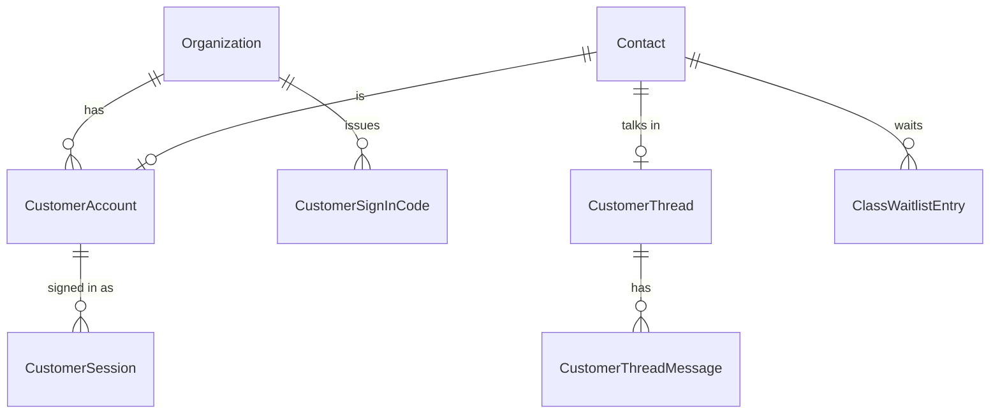
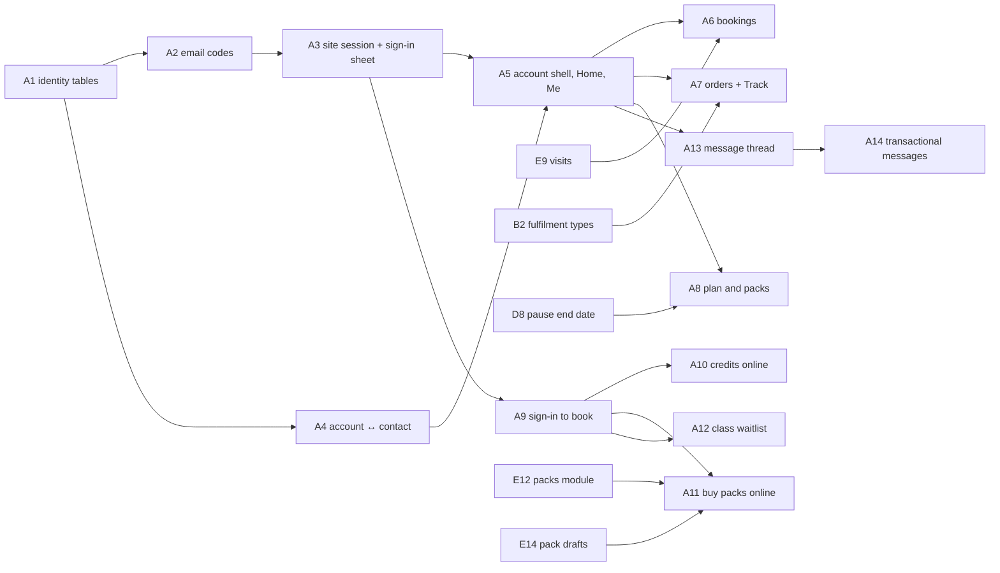

# Customer accounts and messaging on merchant sites

## Summary

Give a business's own customers an account on that business's website
(ADR-011). They sign in with a one-time code sent by email; each account belongs to one
business and is one Contact. The site then offers an account area:

- bookings, which can be moved and cancelled;
- orders, with tracking;
- the plan and packs;
- messages;
- Me.

A signed-in customer can spend class credits and buy packs online, join a
class waitlist, and message the business. Messages about their own orders,
bookings and invoices land in their account, and go out through the
business's own connected email provider. Identity and the session come first
(A1–A5). The account pages and the features ADR-008 used to forbid follow
(A6–A14).

**Sign-in is email only this round** (user, 2026-09-27). Phone codes and SMS
are not in this plan; phone sign-in comes later as its own decision
(ADR-011 §6), listed under "Later" below and not counted as a unit.

---

## Problem Frame

The public booking page is anonymous today. ADR-008 decided so because Saroh
sent no email or SMS and could not check who was asking. Credits are spent
only at the desk, packs are sold only by staff, a full class is simply full,
and nothing tells a customer their order is ready. The Customer Site design
assumes all of these, and so do the two booking-page designs.

The user decided on 2026-09-26 to build customer accounts now (DEC-037).
Nothing in the repo models an end-customer identity. Public bookers are
stored as CRM Contacts: `Booking.contactId`, plus the booker's name, email and
phone on the booking.

---

## Requirements

- R1. A customer signs in on a merchant's site with a six-digit code sent by email. There is no phone sign-in this round. One flow serves new and returning people, and it never reveals whether an account existed.
- R2. An account belongs to one business (`organizationId`), links to exactly one Contact, and is never a Better Auth `User`.
- R3. The session is a host-only `__Host-` cookie on the site's own host. The API accepts it only for the business that host resolves to; a token from another site gets a 401.
- R4. Codes and tokens are stored only as hashes. Codes expire and allow few tries. Limits apply per destination, per client address (DEC-027) and per business, and they are durable (kept in the database, not only in process). Codes are refused while the business is suspended or closing.
- R5. A first sign-in links the account to the single matching contact, or makes a new one and suggests the duplicates. The merchant can undo a link ("This isn't them"). Default 7.
- R6. The account area follows the business's modules, with a bottom tab bar on phones. It holds Home, Bookings, Orders, Plan, Messages and Me, and shows only an allow-list of the customer's own data, never staff notes.
- R7. From the account, a customer can move a one-to-one booking to a free time with the same person, and cancel under the free-cancellation rule. A class is moved on the site's booking page ("Moving: …").
- R8. Orders show their steps from the order's fulfilment type (Track), along with receipts.
- R9. From the account, a customer can see their plan, pause and resume it, cancel it at period end (offered "pause instead"), and pay a failed invoice through its pay link. Default 8.
- R10. Signing in is asked for at the last step of booking or buying; browsing is open. The booking form fills in from the account, and a double booking of the same slot by the same person is refused. Defaults 2 and 3.
- R11. A signed-in customer can spend a class credit online, under the same rules as at the desk (it covers the service, a class is left, it is valid when the class starts, and the late-cancel rule applies).
- R12. A signed-in customer can buy a published class pack online. The purchase is recorded only when the payment succeeds.
- R13. A full class offers "Join the waitlist". A freed place is offered to the first person in line and held for a while, then passed to the next. Default 9.
- R14. The customer and the business share one message thread per customer, answered by the team in the workspace.
- R15. Messages about the customer's own orders, bookings and invoices always go into the account thread. Outside it they go by email only, through the business's connected email provider, and only to the account's verified email. Saroh's own email sends sign-in codes and nothing else. Default 10.
- R16. A customer can ask for their details to be removed; staff act on the request (default 11). Health notes a customer adds become suggestions for staff to confirm (default 12).
- R17. Workspace copy that says "Saroh doesn't message" changes only where a message is now really sent (`saroh-product.md`, "Communications").

---

## Scope Boundaries

- One account per business; there is no Saroh-wide customer identity (DEC-037).
- There are no passwords, magic links or social sign-in.
- Customers get no app and no push notifications.
- A customer cannot change plans themselves; that stays with the business (default 8).
- Saved cards and autopay are set up in D12, which depends on D11. Until then the account area shows pay links only (ADR-011 §4).
- Nothing changes for courses on the site (DEC-044). The waitlist is built for classes and can be reused for courses later.
- The invoice pay page (`/pay/<token>`) stays a token link that needs no sign-in.

### Deferred to Follow-Up Work

- Phone sign-in, SMS codes, and SMS or WhatsApp messages to a verified phone: out of this round (ADR-011 §6, "Later" below).
- The shop's bag and checkout (G13) and the Prices page (G20). They use A3's sign-in step but are planned in epic G.
- A customer's own autopay set-up (D12).
- "Sign out everywhere" run by staff from Customer Detail. Removal (C11) and a merge (C9) already revoke sessions.
- A distributed rate limiter. The per-destination limits here are durable because they count code rows. The per-address limit uses the in-process `FixedWindowRateLimiter`, like the other public paths.

---

## Context & Research

### Relevant Code and Patterns

- **The public site.** `apps/saroh.app/app/[domain]/{layout,page}.tsx`,
  `[domain]/[slug]/`, `[domain]/book/page.tsx`,
  `[domain]/checkout/[orderId]/`. Server-side API reads live in
  `apps/saroh.app/lib/` (`publication.ts`, `booking-page.ts`, `checkout.ts`,
  `invoice-pay.ts`, `api-url.ts`). The pay page is `app/pay/[token]/`, with
  `actions.ts` for posting server-to-server.
- **The booking flow.** `packages/site-blocks/src/booking-flow/` holds
  `booking-flow.tsx`, `model.ts`, `flow-state.ts`, `api.ts`, `summary.tsx`
  and `steps/`: `details-step.tsx`, `pay-step.tsx`, `paying-card.tsx`,
  `done-card.tsx`, `sessions.tsx`, `one-to-one.tsx`, `when-step.tsx`.
- **Site resolution.** `apps/api.saroh.in/src/modules/sites/public-sites.controller.ts`
  (`by-hostname/:hostname`, `by-subdomain/:subdomain`) and
  `modules/domains/domains.service.ts`.
- **Public bookings.**
  - `modules/bookings/public-bookings.controller.ts` and
    `public-bookings.service.ts`: holds, book, and
    `public/sites/:siteId/booking`.
  - `booking-hold.ts` and `release-holds.handler.ts`: the 15-minute hold and
    its sweep.
  - `reservation.ts`: the serializable capacity check.
  - `rate-limiter.ts`: `FixedWindowRateLimiter`.
  - `use-membership.ts`: spends a membership's classes.
- **Packs.** `modules/class-packs/redeem-pack.ts` (the desk's rule),
  `class-packs.service.ts` (`sell`) and `class-packs.controller.ts`.
- **Payments.** `modules/payments/public-invoices.{controller,service}.ts`
  (keyed limiters, a server-priced intent) and `payments.service.ts`.
  `modules/webhooks/webhooks.service.ts` (`applySuccess`) is where a success
  reconciles.
- **Identity email.** `apps/api.saroh.in/src/common/email.ts`
  (`sendVerificationOtpEmail`, `codeEmail`, a nodemailer transport). It is
  wired into Better Auth's `emailOTP` in `packages/auth/src/server.ts`, and
  the Better Auth adapter lives in `apps/api.saroh.in/src/common/auth/auth.ts`.
- **Guards and addresses.** `common/guards/{better-auth,organization,origin}.guard.ts`,
  `common/client-ip.ts` and `common/trust-proxy.ts` (DEC-027).
  `organization-lifecycle.gate.ts` provides `assertOrganizationOpen`.
- **Log redaction.** `common/logging/redact.ts` already redacts
  `/public/invoices/<token>`; the new token and code paths get the same
  treatment.
- **Communications.**
  - `modules/communications/communications.service.ts` and
    `message-send.handler.ts`.
  - `providers/{provider.port,email.provider,whatsapp.provider,provider.factory}.ts`.
  - The models are `CommunicationProvider` (EMAIL, WHATSAPP), `Message`,
    `Delivery` and `Consent`. There is no SMS channel.
- **Jobs.** `booking.notify` is enqueued in `bookings.service.ts`,
  `public-bookings.service.ts` and `reservation.ts`, but no handler is
  registered. `modules/jobs/job-handler.registry.ts` holds the registry and
  `job-consumers.spec.ts` pins it.
- **The workspace customer page.** `apps/app.saroh.in/app/(shell)/customers/[contactId]/page.tsx`
  and `components/customers/detail/{header,overview,notes,detail-screen}.tsx`.
  `modules/customer-workspace/customer-detail.service.ts` builds the aggregate.
- **Schema.** `packages/database/prisma/schema.prisma` has `Contact`,
  `Booking`, `PackPurchase`, `PackRedemption`, `CustomerSubscription`,
  `Invoice` (`payTokenHash`), `Message` and `Consent`. Migrations go under
  `packages/database/prisma/migrations/`, with RLS as in the products v2
  migration.

### Institutional Learnings

- Every new organization-owned table carries `organizationId` and
  `ENABLE/FORCE ROW LEVEL SECURITY` with an `org_isolation` policy. Migrations
  pass `db:verify:replay`. The integration suite uses `db push`, so a green
  `test:int` says nothing about a migration.
- Public routes derive the organization from the resource (here, the host's
  Site), never from the request (`backend-auth-and-access.md`).
- A token shown once and stored only as its SHA-256 is the established
  pattern (invoice pay link, ADR-007; invitations, #276).
- The in-process limiters are "a speed bump" (waitlist controller comment).
  Code limits must count rows to be real.
- Copy never promises a message that isn't sent (ADR-008 §3 still holds for
  what isn't built).

### External References

- `__Host-` cookie prefix rules (Secure, no Domain, Path=/) — RFC 6265bis.
- Indian transactional SMS needs a registered sender and template (DLT). This
  is relevant only to phone sign-in, later.

---

## Key Technical Decisions

- **Three tables, one family** (A1):
  - `CustomerAccount` (organizationId, contactId unique, email, emailVerifiedAt, status ACTIVE|BLOCKED|REMOVED, lastSignedInAt);
  - `CustomerSignInCode` (organizationId, destinationHash, codeHash, expiresAt, attempts, consumedAt, retiredAt, clientHash);
  - `CustomerSession` (organizationId, accountId, siteId, tokenHash unique, expiresAt, lastSeenAt, revokedAt, userAgent summary).

  A partial unique index on `(organizationId, email)` applies where status ≠ REMOVED. No phone column is added this round; phone sign-in adds one with its own migration.
- **Keyed hashes.** The destination and the code are hashed with HMAC-SHA256 under a server secret from `env.ts`, so a database read does not reveal who asked or the code. The session token is plain SHA-256 of 256 random bits (high entropy, as with the pay token).
- **Limits come from rows.**
  - Per destination: a resend no sooner than 30 s, at most 5 an hour and 10 a day, counted from `CustomerSignInCode` rows.
  - Per business: a ceiling per hour, counted the same way.
  - Per client address: `FixedWindowRateLimiter` keyed by the DEC-027 address hash.

  Default 5.
- **One sign-in endpoint pair** under `public/site-accounts/`: `codes` (request) and `sessions` (verify). The caller is `apps/saroh.app`'s server, which sends the host it served. The API resolves the host to a Site and Organization (the same lookup as `by-hostname`) and never takes an organization id from the body.
- **Session transport.** The site's server routes read the `__Host-saroh_session` cookie and forward the token in an `x-customer-session` header, with an `x-site-host` header. `CustomerSessionGuard` hashes the token and loads the session. It checks that the session's organization and site match the host's resolution and that it is neither expired nor revoked, then attaches a `CustomerContext {organizationId, accountId, contactId}`. Sliding renewal writes `lastSeenAt` at most once an hour. Default 6.
- **No workspace crossover.** The customer routes never read Better Auth cookies, and `BetterAuthGuard` never reads `x-customer-session`.
- **Origin.** State-changing site routes are Next.js server actions or route handlers in `apps/saroh.app`. They check `Origin` against the served host before calling the API.
- **Contact linking (A4).** On the first verified sign-in, the service looks up contacts in the business with the same normalised email that have no account:
  - exactly one → link it;
  - none → create a contact from what is known;
  - several → create a new contact and write a duplicate suggestion (C2's suggestion store; until C2 lands, an entry on the timeline).

  A changed email is verified with its own code and must be unique in the business.
- **An allow-list serializer** (`customer-view.ts`) is the only way customer data leaves the API. Its tests assert that staff notes, Needs attention staff wording, other attendees and internal ids beyond opaque references never appear.
- **Spending a credit and buying a pack reuse the desk's rules.** `redeem-pack.ts` is called with a customer context. Buying goes through the invoice payment path: an invoice for the pack, with the `PackPurchase` created in `applySuccess` when the intent is paid, idempotent per intent. Prices always come from the server.
- **The waitlist** is a `ClassWaitlistEntry` table (organizationId, sessionKey: service + startsAt, contactId, position, status WAITING|OFFERED|ACCEPTED|EXPIRED|LEFT, offeredUntil). A freed place (cancel, release, hold expiry) enqueues `waitlist.offer`. The offer is a hold on the place, reusing booking-hold, so capacity counts stay correct. Accepting books it; expiry passes it on.
- **Messages.** One `CustomerThread` per contact and a `CustomerThreadMessage` (author CUSTOMER|STAFF|SYSTEM, body, kind, read state) rather than overloading the outbound `Message` model. `Message` and `Delivery` still record any external send, linked to the thread message.
- **Transactional sends.** One `customer.notify` job per event (order ready, booking confirmed, moved or cancelled, invoice sent, waitlist offer). It writes the thread message and then, if the business has a connected email provider, sends to the account's verified email through `CommunicationsService` with a `transactional` purpose that skips marketing consent (default 10). The `booking.notify` handler is registered here and delegates to it.

---

## Permissions touched

| Action | Who | Used by | Change |
|---|---|---|---|
| `message:read` | Owner, Admin (custom grantable) | Customer Detail Messages tab, Home "Reply" row | Existing; reads customer threads |
| `message:write` | Owner, Admin | Replying to a customer | Existing |
| `contact:write` | Owner, Admin | "This isn't them" (unlink an account) | Existing; relabelled "Edit customers and contacts" in C13 (DEC-039) |
| `booking:read` | Owner, Admin, Member | Waitlist on a class's roster | Existing |
| (customer context) | the signed-in customer, own data only | every account endpoint | New guard, not an `OrgAction` (matrix §8) |

No new staff action is added in this epic.

---

## Open Questions

### Resolved During Planning

- One account per business, codes by email, through Saroh's identity sender (DEC-037, user).
- Email only this round; phone codes and SMS are out, and phone sign-in is a later decision of its own (ADR-011 §6, user, 2026-09-27).
- Credits and packs online, the waitlist, recognition, sign-in and messages are in scope (user, superseding ADR-008).
- Autopay comes from the business's provider (DEC-038, epic D).

### Deferred to Implementation

- The exact session cookie name, and whether the site host header or the Site id travels with the token (both are resolved server-side either way).
- Whether an account's name and details edits in Me update the Contact directly or arrive as a suggestion. The proposal is that the customer's own name, email (re-verified) and phone (a contact detail, not verified) update directly, and nothing else does.
- How long the waitlist offer really needs to be for a gym at 06:00. Default 9 sets 2 hours (or 1 hour before the class); it may become a per-business setting.

---

## High-Level Technical Design

> *Directional guidance for review, not implementation specification.*

```mermaid
sequenceDiagram
    participant B as Browser (kavi.saroh.app)
    participant S as saroh.app server
    participant A as api.saroh.in
    B->>S: email (sign-in sheet)
    S->>A: POST public/site-accounts/codes {host, email}
    A->>A: host → Site → Org; limits; store hashed code; send email
    B->>S: code
    S->>A: POST public/site-accounts/sessions {host, email, code}
    A->>A: verify; account ↔ contact; create session (hash)
    A-->>S: token (once)
    S-->>B: Set-Cookie __Host-…; HttpOnly; Secure; SameSite=Lax
    B->>S: GET /account
    S->>A: GET public/site-accounts/me (x-customer-session, x-site-host)
    A-->>S: allow-listed view
```



---

## Implementation Units



### A1. Customer identity tables

**Goal:** The schema for per-business customer accounts, sign-in codes and sessions.

**Requirements:** R2, R4

**Dependencies:** None · **Phase:** 1

**Files:**
- Modify: `packages/database/prisma/schema.prisma` (CustomerAccount, CustomerSignInCode, CustomerSession; relations from Organization, Contact and Site)
- Create: `packages/database/prisma/migrations/<ts>_customer_accounts/migration.sql`
- Create: `apps/api.saroh.in/src/modules/site-accounts/site-accounts.module.ts`, `customer-account.repository.ts`
- Test: `apps/api.saroh.in/src/modules/site-accounts/customer-account.db.spec.ts`

**Approach:**
- Every table has a required `organizationId`, RLS and an `org_isolation` policy.
- Composite foreign keys tie `(contactId, organizationId)` and `(accountId, organizationId)` together.
- The partial unique indexes cover the email and the account's contact.
- Declare everything in `schema.prisma`.
- Deleting a Contact cascades to its account and sessions. Removal in C11 is the normal path; the cascade is the backstop.

**Patterns to follow:** `20260923150000_products_v2` (RLS); the partial unique indexes (`Invoice_one_per_order`).

**Test scenarios:**
- Happy path: create an account for a contact; a second account for the same contact is refused.
- Edge case: the same email is allowed in two businesses and refused twice in one; a REMOVED account frees its email.
- Error path: an account pointing at another business's contact is rejected by the database.
- Integration: `db:verify:replay` passes; the RLS policy hides another business's rows.

**Verification:** The migration replays from empty; the tables are visible only within their organization.

---

### A2. Sign-in codes by email, with limits

**Goal:** Request and verify a one-time code for a site, sent by Saroh's identity email in the business's name.

**Requirements:** R1, R4

**Dependencies:** A1 · **Phase:** 1

**Files:**
- Create: `apps/api.saroh.in/src/modules/site-accounts/{sign-in-codes.service.ts,sign-in.controller.ts,dto.ts,site-host.ts}`
- Modify: `apps/api.saroh.in/src/common/email.ts` (a `sendSiteSignInCodeEmail` beside `sendVerificationOtpEmail`), `apps/api.saroh.in/src/env.ts` (the code-hash secret), `apps/api.saroh.in/src/common/logging/redact.ts`
- Test: `site-accounts/sign-in-codes.service.spec.ts`, `site-accounts/sign-in.controller.db.spec.ts`, `common/logging/redact.spec.ts`

**Approach:**
- `POST public/site-accounts/codes {host, email}`:
  - resolve the host to its Site and Organization (404 when unknown, or when the site is unpublished);
  - apply `assertOrganizationOpen`;
  - normalise the email;
  - apply the limits from rows and the per-address limiter;
  - retire earlier live codes, store HMACs, and send;
  - always answer the same 202 shape.
- `POST public/site-accounts/sessions {host, email, code}`:
  - verify with a constant-time compare;
  - increment attempts, and kill the code at 5;
  - consume it;
  - call A4's `linkOrCreate`;
  - create a session and return the token once.
- The email's display name is "‹Business› via Saroh" (default 4) and the subject is "Your code for ‹Business›"; the copy says nothing else is sent from this address.
- There is no SMS port, no channel field and no phone input. A body that carries a phone or an unknown field is refused (400), so nothing can half-enable a phone path.
- A site-flags read (`GET public/site-accounts/options?host=`) says whether accounts are on for the site.

**Patterns to follow:** `public-invoices.service.ts` (keyed limiters, caller hash); `sendVerificationOtpEmail`.

**Test scenarios:**
- Happy path: request, then verify, gives a session token; verifying a destination with no account creates one.
- Edge case: a resend inside 30 s → 429 with retry-after; the 6th code in an hour → 429; a new code kills the old one.
- Edge case: the response for a known email equals the one for an unknown email.
- Error path: 5 wrong codes → the code is dead; an expired code → 400; a suspended business → 403 with no send; an unknown host → 404.
- Error path: a body with a `phone` or `channel` field → 400.
- Integration: logs contain neither the code nor the destination.

**Verification:** A code email arrives on the local stack (the fake transport) for a Northwind site, and sign-in works.

---

### A3. Site session, cookie and sign-in sheet

**Goal:** The session lives on the site's host. The site's server calls the API with it, and a sign-in sheet asks for the code at the last step.

**Requirements:** R3, R10 (the sheet)

**Dependencies:** A2 · **Phase:** 1

**Files:**
- Create: `apps/api.saroh.in/src/modules/site-accounts/{customer-session.guard.ts,customer-context.decorator.ts,sessions.service.ts}`
- Create: `apps/saroh.app/lib/customer-session.ts` (read the cookie, `accountFetch`), `apps/saroh.app/app/[domain]/account/actions.ts` (request code, verify, sign out; origin check)
- Create: `packages/site-blocks/src/account/sign-in-sheet.tsx` (email step, code step, "Last step: confirm it's you"), `packages/site-blocks/src/account/api.ts`
- Modify: `apps/saroh.app/app/[domain]/layout.tsx` (a signed-in state for the header)
- Test: `site-accounts/customer-session.guard.spec.ts`, `apps/saroh.app/lib/customer-session.test.ts`, `e2e/tests/site-sign-in.spec.ts`

**Approach:**
- The cookie is `__Host-`-prefixed, Secure, HttpOnly, SameSite=Lax, Path=/, with no Domain, and expires with the session (default 6).
- The guard enforces host = the session's site's organization. Sliding renewal updates `lastSeenAt` at most hourly and extends `expiresAt` to at most `createdAt` + 90 days.
- Sign out revokes the session; "Sign out everywhere" revokes the account's sessions.
- The sheet takes focus, keeps Tab inside and returns focus on close, as the design notes require. It uses only `--site-*` tokens (H1).

**Patterns to follow:** `app/pay/[token]/actions.ts` (server-to-server posting); `origin.guard.ts` (origin rules).

**Test scenarios:**
- Happy path: sign in, then reload → still signed in; sign out → signed out.
- Error path: a token copied to another business's host → 401. A revoked or expired token → signed out, with a clean cookie.
- Edge case: the cookie is never set with a `Domain`; the test asserts the header.
- Integration (e2e): sign in on a Northwind site on the local stack, then open another site → not signed in.

**Verification:** Response headers show `__Host-` with no Domain; a workspace session does not sign anyone in on the site.

---

### A4. Account ↔ Contact linking, and the workspace badge

**Goal:** A first sign-in finds or makes the person's Contact, and the merchant can see and undo it.

**Requirements:** R2, R5

**Dependencies:** A1 · **Phase:** 1

**Files:**
- Create: `apps/api.saroh.in/src/modules/site-accounts/account-linking.service.ts`
- Modify: `apps/api.saroh.in/src/modules/customer-workspace/{customer-detail.service.ts,customer-workspace.controller.ts}` (the account on the detail, and `POST :contactId/account/unlink`)
- Modify: `apps/app.saroh.in/components/customers/detail/header.tsx` ("Signs in on your website", with a "This isn't them" menu item), `apps/app.saroh.in/lib/customer-workspace/{detail,actions}.ts`
- Test: `site-accounts/account-linking.service.db.spec.ts`, `customer-workspace/customer-detail.service.spec.ts`

**Approach:**
- Match on the normalised email (lower-case, trimmed) among contacts in the business that have no account.
- Exactly one match → link it. Zero → create a Contact (name blank until the customer gives one, source `SITE_ACCOUNT`). Several → create a new contact and record the others as possible duplicates (C2's store when it exists, a timeline entry otherwise). Default 7.
- The unlink is audited (`customer.account.unlink`): it moves the account to a new contact and revokes its sessions.

**Test scenarios:**
- Happy path: Farah exists with that email → the account is linked, and the account area shows her bookings.
- Edge case: two contacts share the email → a new contact is made, both are suggested as duplicates, and no data is shown from either.
- Edge case: the matching contact already has an account (under an earlier email) → a new contact is made and suggested as a duplicate; accounts are never joined by matching.
- Error path: unlinking from another business → 404; a Member without `contact:write` → 403.

**Verification:** Customer Detail shows the badge, and "This isn't them" moves the account.

---

### A5. Account area shell, Home and Me

**Goal:** The account pages on the site: the tab bar that follows the modules, Home, and Me.

**Requirements:** R6, R16

**Dependencies:** A3, A4 · **Phase:** 1

**Files:**
- Create: `apps/api.saroh.in/src/modules/site-accounts/{account.controller.ts,account-home.service.ts,customer-view.ts}`
- Create: `apps/saroh.app/app/[domain]/account/{layout,page,me/page}.tsx`, `packages/site-blocks/src/account/{tab-bar,account-home,me}.tsx`
- Test: `site-accounts/customer-view.spec.ts` (allow-list), `site-accounts/account.controller.db.spec.ts`, `e2e/tests/site-account.spec.ts`

**Approach:**
- `GET public/site-accounts/me` returns the modules that are on (from the publication or availability, e.g. clinic: Home · Appointments · Messages · Me).
- Home shows the next booking (with Move and Cancel, linking to A6), classes left, the latest orders and the plan. Each block is read on its own; a failed one says so and never shows zero.
- Me holds:
  - details: name; a changed email, checked with a code; and a phone number kept as a contact detail, not a way to sign in (default 75);
  - "Add a health note", which writes a C1 suggestion with source CUSTOMER, or a thread note until C1 lands (default 12);
  - receipts: paid invoices with a print view through the pay-link paper;
  - "Ask the business to remove my details", which sends a message (default 11; A13, or recorded as a request until then);
  - sign out, and sign out everywhere.
- Every response goes through `customer-view.ts`.

**Test scenarios:**
- Happy path: a clinic sees Appointments; a bakery sees Orders and no Appointments.
- Error path: the orders read fails → "Orders couldn't be loaded", not "No orders".
- Integration: the allow-list test fails if a staff note, a Needs attention detail or another attendee appears.

**Verification:** Side by side with Saroh Customer Site.dc.html (the account tabs) on a phone width, in the site's own tokens.

---

### A6. Account bookings: Coming up, Past, Cancelled; move and cancel

**Goal:** The customer sees their bookings, moves a one-to-one booking and cancels.

**Requirements:** R7

**Dependencies:** A5; E9 for treatments shown as visits · **Phase:** 2

**Files:**
- Create: `apps/api.saroh.in/src/modules/site-accounts/account-bookings.service.ts`
- Modify: `apps/api.saroh.in/src/modules/bookings/{bookings.service.ts,reservation.ts}` (move and cancel with an actor of type customer; history "by the customer")
- Create: `packages/site-blocks/src/account/{bookings-list,move-sheet}.tsx`, `apps/saroh.app/app/[domain]/account/bookings/page.tsx`
- Test: `site-accounts/account-bookings.service.db.spec.ts`, `e2e/tests/site-account.spec.ts`

**Approach:**
- The lists are Coming up · Past · Cancelled.
- A one-to-one Move opens free times over the next days with the same staff member, using the same serializable re-check as the desk.
- A class moves through the booking page with a "Moving: ‹class›" banner, and its credit moves with it.
- Cancel follows the free-cancellation rule: before the window a pack credit returns, after it the late cancel keeps the credit (ADR-008). A deposit follows E8's rule.
- A treatment shows its visits: done, today, booked, and to book, with "Book visit N" once E9 and E10 exist.

**Test scenarios:**
- Happy path: move a check-up to a free slot; the diary shows "Moved by the customer".
- Edge case: a cancel inside the free window returns the credit; after it, the credit is kept and "late cancel" is recorded.
- Error path: the slot was taken meanwhile → "That time just went"; another customer's booking id → 404.

**Verification:** The workspace booking history shows the customer as the actor.

---

### A7. Account orders and Track

**Goal:** Orders with their steps from the order's fulfilment type, and receipts.

**Requirements:** R8

**Dependencies:** A5, B2 · **Phase:** 2

**Files:**
- Create: `apps/api.saroh.in/src/modules/site-accounts/account-orders.service.ts`
- Create: `packages/site-blocks/src/account/{orders-list,track-sheet}.tsx`, `apps/saroh.app/app/[domain]/account/orders/page.tsx`
- Test: `site-accounts/account-orders.service.db.spec.ts`

**Approach:**
- Orders are read through the account's contact's confirmed identity links, plus orders placed while signed in (G13).
- The steps come from B2's per-type step list: ✓ done, ● now, ○ next. Each step has its line (for example "At the counter — show #1019", or the courier name and tracking number).
- A refunded order reads "Refunded · money back in 5–7 days".
- "Message the business" opens the thread (A13).

**Test scenarios:**
- Happy path: a Shipping order shows the courier and tracking number once they are recorded.
- Edge case: a refunded order shows every step done and the refund line.
- Error path: an order of another customer in the same business → 404.

**Verification:** Track matches the design's steps for each fulfilment type.

---

### A8. Account plan and packs

**Goal:** The customer manages their membership and sees their packs and credits.

**Requirements:** R9

**Dependencies:** A5, D8 · **Phase:** 2

**Files:**
- Create: `apps/api.saroh.in/src/modules/site-accounts/account-plan.service.ts`
- Modify: `apps/api.saroh.in/src/modules/subscriptions/subscriptions.service.ts` (pause, resume and cancel with an actor of type customer)
- Create: `packages/site-blocks/src/account/{plan-tab,pause-sheet,cancel-sheet}.tsx`, `apps/saroh.app/app/[domain]/account/plan/page.tsx`
- Test: `site-accounts/account-plan.service.db.spec.ts`

**Approach:**
- Show the plan, the price paid, the next renewal and classes left.
- Pause offers D8's choices (2, 4 or 8 weeks, or until resumed; default 30).
- Cancel is at period end, with "Pause instead" offered first.
- A failed or overdue invoice shows "Pay now", which opens its pay link (a new link is minted server-side; the customer never sees an old one).
- The packs section shows balances and expiry.
- There is no plan change (default 8), and no autopay until D12.

**Test scenarios:**
- Happy path: pause for 4 weeks → Subscription Detail shows "Paused by the customer until …".
- Edge case: cancel on a plan already set to end → no-op, with the message saying so.
- Error path: Payments off → pause and cancel still work, and "Pay now" is hidden (no invoice).

**Verification:** The subscription events (D9) record the customer as the actor.

---

### A9. Sign-in at the last step of booking; recognition; double booking

**Goal:** The booking page asks for a code at the last step, fills in from the account and refuses a double booking.

**Requirements:** R10

**Dependencies:** A3 · **Phase:** 2

**Files:**
- Modify: `apps/api.saroh.in/src/modules/bookings/{public-bookings.controller.ts,public-bookings.service.ts}` (the book route takes a customer context; the booker comes from the account's contact)
- Modify: `packages/site-blocks/src/booking-flow/{booking-flow.tsx,flow-state.ts,steps/details-step.tsx,steps/pay-step.tsx}`
- Modify: `apps/saroh.app/app/[domain]/book/page.tsx`
- Test: `bookings/public-bookings.service.db.spec.ts`, `e2e/tests/public-booking.spec.ts`

**Approach:**
- "Continue to sign in" appears after the time is chosen. The booking completes right after verifying, with the hold kept across the sign-in.
- With accounts on for a site, the anonymous book route is refused for that site (default 3). A site-level switch in the publication gates it, so rollout is per site.
- A same person, same slot booking (confirmed or pending) → 409 "You're already booked for this".

**Test scenarios:**
- Happy path: choose a time → sign in → booked, and it appears in A6.
- Edge case: the hold expires while signing in → the sheet says the time went and offers the next one.
- Error path: a second booking of the same slot → 409; an anonymous post to a site with accounts on → 401.

**Verification:** Book Pulse Fitness and Book Kavi Dental flows match the designs' sign-in step.

---

### A10. Spend a class credit online

**Goal:** A signed-in member pays for a class with a pack credit.

**Requirements:** R11

**Dependencies:** A9 · **Phase:** 2

**Files:**
- Modify: `apps/api.saroh.in/src/modules/class-packs/redeem-pack.ts` (accept a customer actor), `bookings/public-bookings.service.ts` (a "use 1 credit" pay choice)
- Modify: `packages/site-blocks/src/booking-flow/steps/{pay-step,pay-option}.tsx`
- Test: `class-packs/redeem-pack.spec.ts`, `bookings/public-bookings.service.db.spec.ts`

**Approach:**
- The pay step offers "Use 1 credit · ‹pack› · N left" only for packs that cover the service, have a credit left and are valid at the start. The API decides; the client never sends a pack it wasn't offered.
- Redemption and booking happen in one transaction, in the lock order of `backend-billing-and-classes.md`.
- Membership classes (`use-membership.ts`) are offered the same way.

**Test scenarios:**
- Happy path: book with a credit → the balance goes down by 1 and the booking is "Paid with ‹pack›".
- Edge case: a pack expiring before the class starts is not offered; the last credit spent by two tabs at once → one wins, the other is refused.
- Error path: a pack id from another contact → 404.

**Verification:** The desk sees the same redemption as a desk-made one.

---

### A11. Buy a class pack online

**Goal:** A signed-in customer buys a published pack through the business's provider.

**Requirements:** R12

**Dependencies:** A9, E12, E14 · **Phase:** 2

**Files:**
- Create: `apps/api.saroh.in/src/modules/class-packs/public-pack-purchase.service.ts`
- Modify: `apps/api.saroh.in/src/modules/webhooks/webhooks.service.ts` (`applySuccess`: create the `PackPurchase` for a pack invoice, idempotent per intent)
- Create: `packages/site-blocks/src/account/buy-pack-sheet.tsx`
- Test: `class-packs/public-pack-purchase.service.db.spec.ts`, `webhooks/webhooks.service.spec.ts`

**Approach:**
- Only published, non-draft packs are sold (E14). First-pack-only is enforced (E13).
- The business's Class packs module must be on (E12).
- An invoice (source pack) and an intent are created, with the price from the server. The purchase is created only on success.
- A success on a pack the business archived meanwhile still honours the sale.

**Test scenarios:**
- Happy path: pay → the pack shows in the account with its credits.
- Edge case: a webhook delivered twice → one purchase; a first-only pack for someone who has had one → refused before payment.
- Error path: no provider connected → "Buy at the desk" and no pay button; a draft pack id → 404.

**Verification:** Pack Detail (E16) shows the sale as "Online".

---

### A12. Class waitlist

**Goal:** A full class offers a waitlist, and a freed place goes to the first in line.

**Requirements:** R13

**Dependencies:** A9 · **Phase:** 2

**Files:**
- Modify: `packages/database/prisma/schema.prisma` (ClassWaitlistEntry), with a migration
- Create: `apps/api.saroh.in/src/modules/bookings/{waitlist.service.ts,waitlist-offer.handler.ts}`
- Modify: `bookings/{bookings.service.ts,booking-hold.ts,release-holds.handler.ts}` (enqueue `waitlist.offer` when a place frees), `jobs/job-handler.registry.ts`
- Modify: `packages/site-blocks/src/booking-flow/steps/sessions.tsx` ("Full · Join the waitlist"), `apps/app.saroh.in/components/bookings/booking-detail.tsx` (waitlist on the class)
- Test: `bookings/waitlist.service.db.spec.ts`, `bookings/waitlist-offer.handler.spec.ts`

**Approach:**
- Join (a unique entry per contact and class), and Leave.
- When a place frees, the first WAITING entry becomes OFFERED with a hold on the place, until the earlier of 2 hours and 1 hour before the class (default 9).
- The offer is a thread message (A13) and a transactional send (A14) when available.
- Accepting books through the normal path, with a credit or payment. Expiry offers the next person.
- No offers are made inside 1 hour of the start.

**Test scenarios:**
- Happy path: A is full, B joins, a place frees → B is offered it, accepts and is booked.
- Edge case: B doesn't answer → expired, and C is offered. Two places free at once → two offers.
- Error path: joining a class with free places → 409 "There's room — book it"; a cancelled class → entries closed.
- Integration: the capacity count includes held offers, so the desk can't double-book the offered place.

**Verification:** The workspace class roster shows the waitlist in order.

---

### A13. Customer message thread

**Goal:** One thread per customer: the customer writes from the site, and the team replies in the workspace.

**Requirements:** R14, R16

**Dependencies:** A5 · **Phase:** 2

**Files:**
- Modify: `packages/database/prisma/schema.prisma` (CustomerThread, CustomerThreadMessage), with a migration
- Create: `apps/api.saroh.in/src/modules/site-accounts/{threads.service.ts,account-messages.controller.ts}`, `apps/api.saroh.in/src/modules/customer-workspace/threads.controller.ts`
- Create: `packages/site-blocks/src/account/messages.tsx`, `apps/saroh.app/app/[domain]/account/messages/page.tsx`
- Modify: `apps/app.saroh.in/components/customers/detail/detail-screen.tsx` (a Messages tab), `apps/app.saroh.in/lib/customer-workspace/{service,actions}.ts`
- Test: `site-accounts/threads.service.db.spec.ts`, `e2e/tests/customer-detail.spec.ts`

**Approach:**
- The customer posts from the account or from the Contact page's message form when signed in. Posts are rate-limited per account.
- Staff read with `message:read` and reply with `message:write`. Unread counts go to Home (F2).
- The body is plain text with a length cap and is never rendered as HTML.
- The unread dot clears on open.

**Test scenarios:**
- Happy path: the customer writes, staff reply, and the customer sees the reply.
- Error path: a Member without `message:read` → 403; posting from a revoked session → 401.
- Edge case: a removed customer's thread is emptied by C11.

**Verification:** Side by side with the design's Messages tab.

---

### A14. Transactional messages and the `booking.notify` handler

**Goal:** Messages about the customer's own orders, bookings, invoices and waitlist offers reach their account, and go out through the business's connected provider.

**Requirements:** R15, R17

**Dependencies:** A13 · **Phase:** 2

**Files:**
- Create: `apps/api.saroh.in/src/modules/site-accounts/{customer-notify.handler.ts,notify-templates.ts}`, `apps/api.saroh.in/src/modules/bookings/booking-notify.handler.ts`
- Modify: `apps/api.saroh.in/src/modules/jobs/{job-handler.registry.ts,job-consumers.spec.ts}`, `modules/communications/communications.service.ts` (a transactional send that skips marketing consent, to verified addresses only), `modules/orders/order-kitchen.service.ts` (enqueue on Ready), `modules/invoices/invoices.service.ts` (enqueue on send, used by D17)
- Modify: the copy that says nothing is sent, where it is now sent (Order Detail Ready, booking confirmation)
- Test: `site-accounts/customer-notify.handler.spec.ts`, `bookings/booking-notify.handler.spec.ts`, `communications/communications.service.spec.ts`

**Approach:**
- Events: order ready, handed to the courier (with tracking), booking confirmed, moved or cancelled, invoice sent, and a waitlist offer.
- Each event writes a SYSTEM thread message. When the business has a connected email provider, a `Message`/`Delivery` to the account's verified email is also queued through `message-send.handler.ts`. Nothing goes by SMS or WhatsApp this round: there is no verified phone.
- A contact without an account gets nothing new, and copy says so ("They'll see it when they sign in on your site").
- The job is idempotent per event id. `booking.notify` stops dead-lettering.

**Test scenarios:**
- Happy path: Ready → a thread message, plus an email through the business's Resend connection.
- Edge case: no provider → the thread message only, and Order Detail says "Shown in their account on your site".
- Error path: the provider send fails → Delivery FAILED, retried by the send handler, and the thread message stays.
- Integration: `job-consumers.spec.ts` lists `booking.notify` and `customer.notify` as handled.

**Verification:** No copy promises a message that isn't sent (a grep review of "text", "SMS", "WhatsApp" and "email" strings on the touched screens).

---

## Later — phone sign-in and SMS (not counted this round)

Out of this round (user, 2026-09-27; ADR-011 §6). It comes back as its own
decision, not as a unit waiting on one:

- a phone field on the sign-in sheet, and SMS codes;
- a verified phone on `CustomerAccount`, with its own migration and a partial
  unique index per business;
- SMS and WhatsApp transactional messages to that verified phone;
- who sends and pays for SMS (Saroh's account or the business's own
  provider), and the registered sender and template (DLT) Indian
  transactional SMS needs.

Nothing in A1–A14 depends on it, and no copy offers a phone sign-in or
promises a text until it ships.

---

## System-Wide Impact

- **Interaction graph:**
  - public bookings (holds, book, pay step);
  - class packs (redeem, sell);
  - subscriptions (pause, cancel actors);
  - webhooks `applySuccess` (pack purchases);
  - orders (Ready enqueue);
  - invoices (send enqueue);
  - communications (transactional sends);
  - jobs (two new handlers);
  - customer workspace (badge, Messages tab);
  - `apps/saroh.app` layout and routes.
- **Error propagation:** every account block reads on its own and names a failure. Sign-in errors are plain sentences ("That code didn't match", "Too many codes — try again in N minutes").
- **State lifecycle risks:**
  - sessions revoked on removal and merge (C9, C11);
  - waitlist offers hold capacity and must expire, so the sweep reuses `release-holds.handler.ts`;
  - codes pile up, so a cleanup job deletes consumed or expired rows older than 30 days.
- **API surface parity:** the anonymous booking routes stay for sites without accounts until every published site is switched.
- **Integration coverage:**
  - a cross-site token (401);
  - concurrent credit spend;
  - waitlist capacity;
  - webhook redelivery for pack buys;
  - the allow-list serializer.
- **Unchanged invariants:**
  - the organization is derived from the host, never from the request;
  - the price comes from the server;
  - invoices and numbering are unchanged (DEC-023);
  - the workspace auth (Better Auth) is untouched.

---

## Risks & Dependencies

| Risk | Mitigation |
|------|------------|
| A cookie scoped to `.saroh.app` would leak sessions across businesses | `__Host-` prefix enforced in code, and a header test in A3 |
| Wrong contact linked on first sign-in exposes someone's history | Match only one-to-one on a verified email; "This isn't them"; staff notes never shown (allow-list) |
| Code spraying hurts the sender's reputation | Durable per-destination and per-business limits; email is the only channel |
| Waitlist offers double-book a place | Offers are holds counted by the serializable capacity check |
| Copy promising messages before A14 ships | Honest copy stays until the send exists (R17) |
| A customer without email can't sign in | Email only this round (default 1); they book and pay at the desk as today, and phone sign-in is a later decision |

---

## Documentation / Operational Notes

- Update `docs/patterns/backend-auth-and-access.md` with the `CustomerSessionGuard` and `customer-view` rules once A3 and A5 land (the rule lines were added with DEC-037).
- Update `docs/patterns/backend-jobs.md` known gaps: `booking.notify` is handled after A14.
- Add the code-hash secret to `docs/architecture/ENVIRONMENT.md` (name only) with A2.
- New unit specs go into the explicit `testMatch` of `apps/api.saroh.in/jest.config.js`.
- Browser checks write only on Northwind's site; Rye, Pulse and Kavi demo sites stay read-only.

---

## Sources & References

- Designs: Saroh Customer Site.dc.html, Saroh Book Kavi Dental.dc.html, Saroh Book Pulse Fitness.dc.html; DESIGN-NOTES.md ("Customer website + account", "Customer site audit", "Kavi Dental account")
- Gap report: bookings-site.md (E1–E7)
- Decisions: ADR-011, DEC-037, DEC-011 (amended), DEC-038, DEC-040, DEC-042; ADR-008 (superseded in part), ADR-007
- Overview: docs/plans/2026-09-26-000-round-2-overview.md (defaults 1–12, 30)
