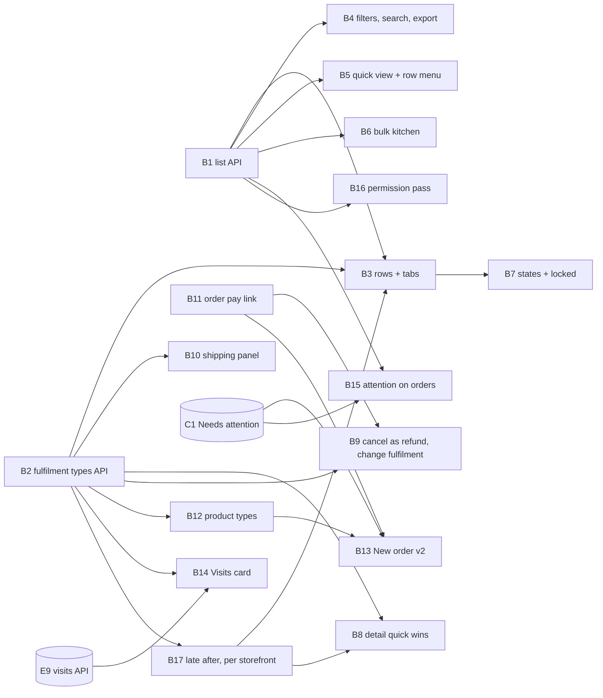

# Orders and fulfilment

## Summary

Bring Orders and Order Detail up to the 25 September designs. First, the
foundations:

- the organization order list API carries what a row needs (stage,
  fulfilment, payment standing, products, attention, late);
- an order has one of **six fulfilment types** with their own steps and late
  rule (DEC-045);
- shipping records the **courier and tracking number**;
- an unpaid order can be sent a **pay link**.

Then the screens:

- rows and tabs, filters and export, a quick view and row menu, and bulk
  kitchen actions with a 10-second hold and Undo all;
- states and locked cards, and Order Detail's remaining changes;
- the product's allowed fulfilment types;
- **New order v2**: walk-in, how it leaves, and the payment method with cash
  change;
- the Visits card for appointment orders;
- Needs attention on every order surface.

The permission split (`order:create/edit/refund/export`) follows the
capability model (DEC-039, 2026-09-27) and is phase 2 (B16). Until F18
applies the new Member bundle, a Member keeps today's kitchen view without
money (DEC-024).

Invoices (the bill of supply, PDF, sending, the source filter and invoice
locked states) are plan D's (`2026-09-26-004-feat-payments-plan.md`).

---

## Problem Frame

The Orders list today (`components/stores/orders-screen.tsx`) is far behind
the design.

- **Its API lacks the fields a row needs.**
  `GET organizations/:org/orders` returns no stage, fulfilment, payment
  standing, product ids or attention, so there is:
  - no step pill or progress bar;
  - no "Late";
  - no unpaid line and no Needs attention tag;
  - no filters beyond the storefront;
  - no quick view.
- **An order is Collect or Delivery** (`OrderFulfilment`, schema), with a
  fixed 20-minute wait rule in the app (`lib/orders/lifecycle.ts`
  `WAIT_TARGET_MIN`) and a typed tracking link. The designs serve any business
  (DESIGN-NOTES "Saroh is for any business"): a shop that ships, a clinic
  whose "order" is a treatment of three visits, a creator who sells a download.
- **New order is a page form** (`components/stores/order-form.tsx`) that
  requires a picked customer and has no way to say how the order leaves or how
  it was paid.
- **An unpaid order has no link to send**; the public checkout
  (`public/orders/:orderId`) is keyed by the order's raw id.

---

## Requirements

- R1. The organization order list returns, per order: stage, fulfilment type,
  payment standing (paid, unpaid, partly refunded, refunded), the product ids,
  whether its customer has Needs attention (sensitive entries only to the
  sensitive gate), whether it is late, and its age. A caller with `order:read`
  gets the whole row, money included (DEC-039). Until F18, a caller with
  `order:stage` only (today's Member) gets the kitchen view without money
  (DEC-024).
- R2. The list filters server-side by date range (with a custom range), step,
  fulfilment type, storefront, payment, product, Needs attention and late. It
  searches by order number or customer name (and phone or email only with the
  contact gate). It is newest first and paged, and returns tab counts
  (All · Open · Refunded; default 14).
- R3. An order has one of six fulfilment types (DEC-045), each with its own
  steps. Each type's steps map onto the existing order status, and existing
  orders keep their meaning (default 18).
  - Pick-up: New → Preparing → Ready → Collected.
  - Local delivery: New → Preparing → Ready → Out for delivery → Delivered.
  - Shipping: New → Preparing → Ready → Handed to courier → Delivered.
  - Digital: Paid → Sent.
  - Appointment in person and Appointment online: Booked → Attended, by
    their visits.
- R4. **When an order counts as late is a storefront setting** (default 16,
  decided 2026-09-27): one "Mark ‹type› orders late after N" per fulfilment
  type the storefront offers — Pick-up, Local delivery and Shipping — in
  hours, with minutes allowed for a counter. Defaults are 2 hours, 24 hours
  and 48 hours. Digital is never late, and appointments are judged by their
  visits. `late` is computed by the API from the order's storefront's setting
  and shown as "Late" in words, never colour alone, on the Orders list, the
  quick view and Order Detail.
- R5. Shipping records the courier's name and the tracking number, with an
  optional link. Saroh never books a courier.
- R6. How an order is fulfilled can change until handover. The change charges
  or refunds the difference in delivery on the order (default 17), and the
  type must be one every item allows (default 15).
- R7. Cancel is a full refund, and the order is kept as cancelled. Once an
  order is handed over it can't be edited, re-fulfilled or cancelled, but it
  can still be refunded (DESIGN-NOTES, Order Detail rule).
- R8. A refund carries a reason. "Or another amount" is allowed within what is
  refundable (default 13).
- R9. "Add an item" works in Edit while items can change (New only).
- R10. An unpaid order (or one whose payment failed) can get a pay link. The
  link is a token shown once, stored hashed, and replaceable. It pays the
  order through the existing order checkout, and the amount always comes from
  the server.
- R11. Bulk kitchen actions:
  - select rows, and move every eligible one a step at once;
  - a 10-second hold before anything is written, with "Send now" and
    "Undo all";
  - rows that can't move (unpaid, or on another step) are named, not
    silently skipped.
- R12. A quick view of an order, drawn from the same read as Order Detail,
  with "Open full page". A row menu gives each row's allowed actions.
- R13. The Orders list, Order Detail and the quick view have loading, empty
  (per tab and per filter), failed, partial and locked states. Locked covers
  a Reviewer, or a role with neither `order:read` nor `order:stage`.
- R14. New order v2:
  - a walk-in customer, or search by name or phone;
  - "How it leaves" (a type every item allows);
  - the payment method (cash with change worked out, UPI, card at the
    counter, pay later, or send a pay link);
  - an allergy clash warned per line.
- R15. A product lists the fulfilment types it allows (default 15).
- R16. An appointment order shows a Visits card: each visit's date, the
  person, in person or video, and status; "Mark visit N attended" and "Book
  visit N".
- R17. Needs attention (DEC-040) shows as a tag on rows, a filter, on the
  quick view, on Order Detail's customer card and on the kitchen view; the
  allergy banner keeps its exact allergen match.
- R18. The capabilities `order:create`, `order:edit`, `order:refund` and
  `order:export` are enforced (DEC-039, the capability model). Each implies
  `order:read` and is implied by the umbrella it replaces, so existing custom
  roles keep what they had.

---

## Scope Boundaries

- Orders are never deleted (DESIGN-NOTES): cancel or refund, and the record
  stays.
- No courier booking or rates; no courier integration (DEC-045).
- No draft orders (not designed; overview "Later").
- No per-business renaming of steps (DESIGN-NOTES "Not yet"); the step words
  are the type's.
- Abandoned (unpaid online) orders stay hidden from the list, as decided in
  DESIGN-NOTES.
- Messages to the customer (Ready, a changed fulfilment, a pay link sent)
  are plan A's (A14). Until A14 ships, Order Detail offers "Copy pay link"
  and says nothing is sent.
- Invoices are unchanged here: an order's invoice stays the order's mirror
  (DEC-023). The bill of supply, the PDF and sending invoices are plan D's.

### Deferred to Follow-Up Work

- A variant switch on an existing line in Edit (DESIGN-NOTES "Not yet").
- Per-business step names. (Late rules are per storefront, B17.)
- Returns as their own flow (today: "Put N back in stock" on a refund,
  DEC-032).
- The public shop's choice of fulfilment type at checkout: plan G (G13) uses
  B2's rules.

---

## Context & Research

### Relevant Code and Patterns

- **Schema** (`packages/database/prisma/schema.prisma`):
  - `Order` has `stage OrderStage`, `fulfilment OrderFulfilment
    @default(COLLECT)`, the `delivery*` address fields, `trackingUrl`, the
    legacy `status` and `paymentStatus` strings, `events`, `invoices` and
    `paymentIntents`.
  - `OrderItem` has `stockLevelId`, `heldQuantity` and `soldQuantity`.
  - `enum OrderStage` is NEW, PREPARING, READY, COLLECTED, HANDED_TO_COURIER,
    DELIVERED.
  - `enum OrderFulfilment` is COLLECT, DELIVERY.
  - `OrderEvent` has kind STAGE / UNDO / STATUS / EDIT / REFUND, plus
    `undoesEventId`.
  - Refund models: `PaymentRefund`, `PaymentRefundLine`.
- **API** (`apps/api.saroh.in/src/modules/orders/`):
  - `organization-orders.controller.ts`: `GET organizations/:org/orders`
    (only `?storeId=`; `kitchenOnly` for `order:stage`), `GET :orderId`,
    `POST :orderId/stage`, `POST :orderId/stage/undo` and `PATCH :orderId`.
  - `order-stage.ts`: `STAGE_MOVES` with an `only: OrderFulfilment` per
    move, `nextStages`, `planStageMove`, `planUndo`, `canEditItems`,
    `stageForStatus` and `UNDO_WINDOW_MS`.
  - `order-kitchen.service.ts`: `moveStage`, `undoStage`, `edit`.
  - Also: `order-refunds.ts`, `order-read.ts`, `order-standing.ts`,
    `orders.service.ts` (`listForOrganization`), `serialize.ts` and `dto.ts`
    (`fulfilment?: OrderFulfilment`, `trackingUrl?`).
- **Payments** (`apps/api.saroh.in/src/modules/payments/`):
  - `payments.controller.ts`: `POST orders/:orderId/refund` and `…/retry`.
  - `payments.service.ts`: `createIntentForOrderPublic` and `getReceipt`.
  - `dto.ts`: the refund DTO has `reason?` and `lines?`, and deliberately
    **no amount**.
  - `public-payments.controller.ts`: `public/orders/:orderId/payment-intent`
    and `/receipt`.
- **The invoice pay link to mirror:**
  - `modules/invoices/pay-token.ts` and `pay-link-url.ts`;
  - `payments/public-invoices.{controller,service}.ts`;
  - `Invoice.payTokenHash`;
  - `apps/saroh.app/app/pay/[token]/page.tsx` and `components/invoice-pay.tsx`;
  - ADR-007 "Invoice pay link".
- **App** (`apps/app.saroh.in`):
  - the list: `app/(shell)/commerce/orders/page.tsx` renders
    `components/stores/orders-screen.tsx`;
  - `lib/orders/`: `business-service.ts`, `read.ts`, `kitchen-service.ts`,
    `lifecycle.ts` (`WAIT_TARGET_MIN = 20`, `waiting`, `flowOf`,
    `allergyCheck`), `export.ts` (`ordersToCsv`), `actions.ts` and
    `links.ts`;
  - Order Detail: `app/(shell)/commerce/orders/[orderId]/page.tsx` renders
    `components/commerce/order-detail/*` (`stepper`, `courier-panel`,
    `change-panels`, `edit-panel`, `refund-panel`, `customer-card`,
    `money-card`, `timeline`, `use-kitchen.ts`);
  - New order: `app/(shell)/commerce/orders/new/page.tsx` renders
    `components/stores/order-form.tsx` (a required `customerId`);
  - the product editor: `components/commerce/product-editor-v2/*`
    (`details-section.tsx` is where "How it's fulfilled" goes).
- **Public checkout:** `apps/saroh.app/app/[domain]/checkout/[orderId]/page.tsx`.
- **Tests:**
  - API unit specs are listed explicitly in `apps/api.saroh.in/jest.config.js`
    (`order-stage.spec.ts`, `order-refunds.spec.ts` and others);
  - DB specs: `order-kitchen.db.spec.ts`;
  - app: `lib/orders/lifecycle.test.ts`, `export.test.ts`;
  - e2e: `e2e/tests/order-detail.spec.ts`, `order-form.spec.ts`,
    `e2e/permissions/permissions.spec.ts`.

### Institutional Learnings

- **Lock order, every flow** (`backend-billing-and-classes.md`, "Orders and
  the shelf"): Order → StockLevel rows (sorted) → PaymentRefund → payment
  intent → Invoice → Booking. A fulfilment change, a cancel as a refund and a
  pay-link payment all take the order's row lock first.
- **Money:**
  - count each rupee once (DEC-023);
  - money in has an invoice, money out a credit note;
  - an order edited after it was invoiced gets a supplementary invoice or a
    credit note — never an edit to the first one.
- **Refunds:** only a definite refusal frees money (DEC-026); a refund
  releases stock only when confirmed (DEC-032).
- **Kitchen undo** is by event, within `UNDO_WINDOW_MS`, and reverses that
  step's stock rows (ADR-008).
- **New permissions** need a capability-catalogue label
  (`capability-catalogue.spec.ts`), and built-in role changes live in
  `organization-policy.ts`.

### Designs

- `Saroh Orders Screen.dc.html`: rows (step pill and progress, age or Late,
  fulfilment, unpaid line, attention tag), tabs All · Open · Refunded,
  filters, the quick view, the bulk bar ("… 10 seconds for the whole batch",
  "Send now", "Undo all", "N isn't paid"), the row menu, and states per tab.
- `Saroh Order Detail.dc.html`: "Change how it's fulfilled…" (option B),
  "Cancel order…", refund reason and another amount, "Add an item", the
  Visits card (`?id=D301`), the locked state, and the printable ticket.
- `saroh-fixtures.js`: `FULFIL` (steps, the `lateH` rule, ticket name, done
  word), `PRODUCT_FULFIL`, `orderFulfil`, `fulfilOptions`, `orderLate` and
  `attentionOf`.

---

## Key Technical Decisions

- **Six types, stages extended, statuses unchanged.**
  - `OrderFulfilment` becomes PICKUP, LOCAL_DELIVERY, SHIPPING, DIGITAL,
    APPOINTMENT_IN_PERSON and APPOINTMENT_ONLINE. The migration renames
    COLLECT → PICKUP and DELIVERY → LOCAL_DELIVERY in place (default 18).
  - `OrderStage` gains OUT_FOR_DELIVERY and SENT.
  - `STAGE_MOVES` becomes per type, and every move still maps onto the
    existing statuses: OUT_FOR_DELIVERY is SHIPPED, SENT and Attended are
    DELIVERED. ADR-008's "status values stay" holds, so payments, stock and
    reports need no change.
  - Appointment orders have no kitchen stages. Their standing is derived from
    their visits (B14 and plan E's E9), and they reach DELIVERED when the last
    visit is attended.
- **One rules module per type.** `orders/fulfilment.ts`, pure, holds each
  type's steps, handover stage, default late threshold, ticket name and done
  word. It is
  mirrored in the app's `lib/orders/fulfilment.ts`, kept in step by a shared
  test table in both specs — the pattern of `invoice-number.ts` ↔
  `numbering.ts`. The API computes `late` and `lateBy` for rows. The app
  mirror exists only to show steps offline-free and is never trusted for a
  decision.
- **Handover** is COLLECTED, OUT_FOR_DELIVERY, HANDED_TO_COURIER or SENT
  (and the first attended visit for appointments). From handover on:
  - Edit, "Change how it's fulfilled" and Cancel are refused (409, with a
    sentence);
  - Refund stays.
  - Items still lock at PREPARING (`canEditItems`, unchanged).
- **Courier fields.** `Order.courierName` and `Order.trackingNumber` are
  added (text, trimmed, ≤ 80 characters), and `trackingUrl` stays optional.
  Moving to HANDED_TO_COURIER on a Shipping order asks for the courier and
  number but doesn't require them. A missing number shows "No tracking number
  yet" with Add.
- **Late is the API's, and its threshold is the storefront's.** `late` is
  computed at read time from `placedAt` (or `paidAt` for online orders), the
  threshold the order's storefront sets for its type (B17; the type's default
  until set) and the business's time zone (DEC-033). It is never stored.
  Thresholds are stored in minutes on `StoreSettings`
  (`pickupLateAfterMinutes`, `localDeliveryLateAfterMinutes`,
  `shippingLateAfterMinutes`), defaulting to 120, 1,440 and 2,880 (default
  16). Changing one re-labels open orders on the next read, and nothing is
  rewritten.
- **Changing fulfilment** runs in one transaction under the order's row lock:
  - check the new type against every item's allowed types (B12, or
    everything before B12 ships);
  - recompute delivery;
  - a higher delivery charge → a pay link for the difference, or record it
    at the counter, with a supplementary invoice through
    `correctOrderInvoiceForEdit`;
  - a lower one → a refund of the difference through the refund path, with a
    credit note (DEC-026 rules);
  - write an `OrderEvent` (kind EDIT) "Changed from Pick-up to Local
    delivery".
- **Cancel = refund in full.** "Cancel order…" calls the refund path with no
  lines (everything refundable) and the reason, then moves the status to
  CANCELLED in the same order-locked transaction. Promised stock is released
  only when the refund is confirmed (DEC-032). An unpaid order cancels with
  no refund, as today.
- **"Or another amount"** (default 13) is the one place a client sends an
  amount for a refund:
  - it is capped server-side at the order's refundable balance, under the
    order's row lock;
  - it needs a reason;
  - it is recorded as a `PaymentRefund` with no lines;
  - it returns no stock, and makes a credit note against the order invoice
    for that amount (spread as the #508 credit notes are);
  - the DTO keeps "no amount" for line refunds; `amount` is accepted only
    with `lines` absent and `kind: "goodwill"`.

  The security note in `payments/dto.ts` is updated to say exactly that.
- **The order pay link** mirrors the invoice pay link:
  - `Order.payTokenHash` holds the SHA-256 of 256 random bits;
  - the address is shown once ("Copy pay link"; "New link" replaces it);
  - the log redacts `/public/order-pay/<token>`;
  - the page is `saroh.app/pay/o/<token>` in the business's site theme,
    showing an allow-list (business name, order number, lines, total, status,
    customer first name);
  - the payment request carries only a provider and an idempotency key and
    creates the intent through the existing `createIntentForOrder` path
    (amount from `order.total` less what is paid);
  - the link is cleared when the order is paid, cancelled or refunded.
- **The list API is one new endpoint shape on the same route.**
  - `GET organizations/:org/orders?tab=&stage=&fulfilment=&payment=&productId=&attention=&late=&from=&to=&q=&storeId=&cursor=`
    returns `{ rows, counts: {all, open, refunded}, nextCursor }`.
  - Rows are built by one serializer shared with the quick view
    (`order-row.ts`). Money fields are omitted without `order:read`, and
    customer phone and email without `contact:read` (which C13 relabels; there
    is no separate contact gate under the capability model).
  - Product filtering joins through `OrderItem`. Attention reads plan C's C1
    read helper, which returns only non-sensitive kinds unless the caller
    holds the sensitive gate. Before C1 ships, `attention` is null and the
    filter is hidden.
- **Bulk moves are client-held, server-atomic per order.** The 10-second
  hold lives in the browser (like Home's inline actions). "Send now" or the
  timer then calls `POST organizations/:org/orders/stage/bulk` with
  `{moves: [{orderId, from, to}]}`:
  - each move runs in its own order-locked transaction (never one lock across
    many orders);
  - it returns per-order results;
  - "Undo all" after the send calls the existing undo per order within
    `UNDO_WINDOW_MS`;
  - an order whose stage moved since it was selected fails its move with
    "Moved by someone else".
- **Walk-in.** `Order.customerId` stays optional. A walk-in order stores a
  name only (`walkInName`). A contact is made only if a phone or email is
  typed (default 19), through plan C's C2 "ensure contact on payment" helper.
- **The payment method on New order** reuses the recorded-payment path (cash,
  UPI, card at the counter) or pay later or a pay link (B11).
  - "Cash — change ₹X" is computed in the browser from what was typed. Only
    the method and the amount received are stored; the change is written in
    the event note.
  - Stock promises follow DEC-032: staff orders promise when made.
- **Product allowed types** are `Product.fulfilmentTypes OrderFulfilment[]`,
  empty meaning every type its storefronts offer (default 15). An order's
  options are the intersection over its items. Services (an appointment
  product) carry APPOINTMENT_* only.

### Permissions touched

| Action | Today | This plan | Needs |
|---|---|---|---|
| List orders with money, filters, tab counts | `order:read` | unchanged | `order:read` |
| List and quick view without money (until F18); bulk stage moves; ticket print | `order:stage` | bulk uses the same action | `order:stage` (implies `order:read` from F18) |
| Change fulfilment, Add an item, edit address | `order:write` | unchanged until B16 | `order:write` → `order:edit` (B16) |
| Cancel as refund, refund reason, another amount | `payment:manage` | unchanged until B16 | → `order:refund` (B16) |
| Make and replace an order pay link | — | new | `order:write` (→ `order:create` or `order:edit`, B16) |
| New order v2 | `order:write` | unchanged until B16 | → `order:create` (B16) |
| Export CSV | `order:read` | unchanged until B16 | → `order:export` (B16) |
| See customer phone and email on rows | `contact:read` | unchanged | `contact:read`, relabelled (C13) |
| See sensitive Needs attention | — | C1 interim: `contact:write` | → `customer:sensitive` (C13, per matrix Q2) |
| Sell rail rows | the module | gated on their own reads (B16, matrix W-1) | `order:read`, `store:read`, `contact:read` |
| Set a product's allowed types | `store:write` | unchanged | `store:write` |
| Set when a storefront's orders are late (B17) | — | new setting | `store:write` |

---

## Open Questions

### Resolved During Planning

- Six types and shipping tracking without courier booking (DEC-045).
- The change-fulfilment option is B: allowed until handover, charging or
  refunding the delivery difference (DESIGN-NOTES, Orders audit).
- Tabs are All · Open · Refunded (default 14).
- "Or another amount" stays, capped and with a reason (default 13).
- The capability model (DEC-039, 2026-09-27): `order:read` shows the whole
  order, and the order writes are split where a business would grant one
  without another. The Member keeps `order:stage` without money until F18
  applies the new Member bundle (matrix Q1).
- **When an order is late** (default 16; user, 2026-09-27): a storefront
  setting per fulfilment type it offers, measured from when the order was
  placed. Defaults: Pick-up 2 hours, Local delivery 24 hours, Shipping 48
  hours; a café-like storefront can set 20 minutes. Digital is never late,
  and appointments are judged by their visits. Built in B17, read by B2's
  rule.

### Deferred to Implementation

- Exact enum-migration mechanics (Postgres `ALTER TYPE … RENAME VALUE` in
  place, versus a new enum and a cast); either way `db:verify:replay` must
  pass.
- Whether tab counts come from one grouped query or three counts (measure on
  the seeded data).
- Where the "late" clock starts for a pay-later order (placed or paid): start
  with placed, and revisit with real data.
- Whether the quick view reuses `order-read.ts` whole or a slimmer projection.

---

## High-Level Technical Design

> *Directional guidance for review, not implementation specification.*

```mermaid
stateDiagram-v2
    state "Pick-up" as P {
        [*] --> NEW
        NEW --> PREPARING
        PREPARING --> READY
        READY --> COLLECTED: handover
    }
    state "Local delivery" as L {
        [*] --> NEW2: NEW
        NEW2 --> PREP2: PREPARING
        PREP2 --> READY2: READY
        READY2 --> OUT: OUT_FOR_DELIVERY (handover)
        OUT --> DEL2: DELIVERED
    }
    state "Shipping" as S {
        [*] --> NEW3: NEW
        NEW3 --> PREP3: PREPARING
        PREP3 --> READY3: READY
        READY3 --> HAND: HANDED_TO_COURIER (handover; courier + number)
        HAND --> DEL3: DELIVERED
    }
    state "Digital" as D {
        [*] --> PAID: NEW (shown "Paid")
        PAID --> SENT: SENT (handover)
    }
```

Appointment types have no kitchen stages; their visits (bookings) carry the
order to DELIVERED.

---

## Implementation Units

Phase 1: B1, B2, B3, B4, B5, B6, B7, B10, B11, B17. Phase 2: B8, B9, B12,
B13, B14, B15, B16.

---

### B1. Orders list API v2

**Goal:** One organization order list that serves rows, filters, tab counts
and paging, with money and contact details left out by permission.

**Requirements:** R1, R2

**Dependencies:** None. It reads C1's attention helper when present; before
C1 it returns `attention: null`.

**Phase:** 1

**Files:**
- Modify:
  - `apps/api.saroh.in/src/modules/orders/organization-orders.controller.ts`
    (query params);
  - `orders.service.ts` (`listForOrganization` → filters, cursor, counts);
  - `dto.ts` (`ListOrdersQuery`).
- Create: `apps/api.saroh.in/src/modules/orders/order-row.ts` (the row
  serializer shared with B5), `order-list-filters.ts` (the query builder, pure
  where possible).
- Modify: `apps/app.saroh.in/lib/orders/business-service.ts`, `read.ts`
  (types).
- Test:
  - `apps/api.saroh.in/src/modules/orders/order-list-filters.spec.ts` (add
    to `jest.config.js` `testMatch`);
  - `order-list.db.spec.ts`;
  - update `organization-orders.controller.spec.ts` and
    `orders.service.read-access.spec.ts`.

**Approach:**
- The filters are:
  - tab (all / open / refunded, where open = not terminal and not
    cancelled);
  - stage[], fulfilment[], payment (paid / unpaid / partly refunded /
    refunded, derived from refund sums as `order-standing.ts` does);
  - productId (through `OrderItem`), storeId;
  - from/to in the business's zone;
  - attention (has any visible entry), late (computed; filtered after the
    page query with a bounded over-fetch, or by a SQL expression from B2's
    rule table);
  - q (order number or customer name; phone or email only with the contact
    gate).
- Cursor paging (`placedAt desc, id desc`), 50 a page.
- Counts per tab honour every filter except the tab.
- The row has: id, number, placedAt, storefront, customer name, stage, the
  type's steps and index, fulfilment, payment standing, the unpaid amount
  (money-gated), total (money-gated), product names (first two and "+N"),
  attention labels (non-sensitive unless gated), late and lateBy, and age.
- Abandoned (unpaid online, never promised) orders stay excluded, as today.

**Patterns to follow:** today's `listForOrganization` `kitchenOnly`
projection; `order-standing.ts`; DEC-024's "money left out by the API".

**Test scenarios:**
- Happy path: 3 storefronts, 60 orders → the first page has 50, newest
  first, with a cursor; the counts match per tab.
- Happy path: `payment=unpaid&fulfilment=SHIPPING` returns only unpaid
  shipping orders.
- Edge case: an `order:stage` caller gets rows with no `total`, no
  `unpaidAmount` and no email; the counts still come back.
- Edge case: `q=98…` (a phone number) from a caller without the contact
  gate matches nothing by phone; it does not leak whether the number
  exists.
- Edge case: the date range is read in the business's zone (an order at
  00:30 IST on the 1st is on the 1st).
- Error path: a `storeId` from another business → empty (it narrows, never
  widens); a Reviewer → 403.
- Integration: a sensitive-only attention entry does not set `attention` for
  a caller without the gate.

**Verification:** The seeded Northwind list filters and pages correctly
through the API; the permission matrix spec still passes.

---

### B2. Fulfilment types, steps, late rules, courier and tracking number (API)

**Goal:** An order has one of six types, with steps and a late rule per
type, and shipping records the courier and number.

**Requirements:** R3, R4, R5

**Dependencies:** None

**Phase:** 1

**Files:**
- Modify: `packages/database/prisma/schema.prisma` (`OrderFulfilment` gains
  six values with COLLECT → PICKUP and DELIVERY → LOCAL_DELIVERY; `OrderStage`
  gains OUT_FOR_DELIVERY and SENT; `Order.courierName`,
  `Order.trackingNumber`).
- Create:
  - `packages/database/prisma/migrations/<ts>_order_fulfilment_types/migration.sql`;
  - `apps/api.saroh.in/src/modules/orders/fulfilment.ts` (the rule table:
    steps, handover, default late threshold, ticket, done word, stage
    moves);
  - `apps/app.saroh.in/lib/orders/fulfilment.ts` (the mirror).
- Modify:
  - `apps/api.saroh.in/src/modules/orders/order-stage.ts` (`STAGE_MOVES`
    keyed by type, `nextStages`, `planStageMove`, `stageForStatus`);
  - `order-kitchen.service.ts` (the courier fields on a move to
    HANDED_TO_COURIER);
  - `dto.ts`, `serialize.ts`, `order-read.ts`, `orders.service.ts`
    (create with a type);
  - `apps/app.saroh.in/lib/orders/lifecycle.ts` (`flowOf` and `waiting`
    read the new table; `WAIT_TARGET_MIN` goes);
  - `packages/database/src/seed/run.ts`, `seed/showcase/*` (orders with each
    type; Kavi Dental's appointment orders as in `DENT_ORDERS`).
- Test:
  - `apps/api.saroh.in/src/modules/orders/fulfilment.spec.ts` (new;
    `testMatch`);
  - update `order-stage.spec.ts`, `order-kitchen.db.spec.ts`;
  - `apps/app.saroh.in/lib/orders/fulfilment.test.ts` (the same table as the
    API spec).

**Approach:**
- The migration renames the enum values in place, so no row changes meaning,
  and adds the new values and nullable columns. `db:verify:replay` must pass.
- Stage moves per type, each mapped to a status:
  - Pick-up: READY → COLLECTED (DELIVERED).
  - Local delivery: READY → OUT_FOR_DELIVERY (SHIPPED) → DELIVERED.
  - Shipping: READY → HANDED_TO_COURIER (SHIPPED) → DELIVERED.
  - Digital: NEW → SENT (DELIVERED).
  - Appointments: no stage moves.
- The undo window and event writing are unchanged.
- The late rule takes (type, placedAt, now, zone, the storefront's
  thresholds) and returns `{late, lateBy}`. Until B17 lands, the thresholds
  are the type defaults in `fulfilment.ts` (default 16).
- The courier name and number are accepted on the HANDED_TO_COURIER move and
  on `PATCH :orderId`, which stays open after handover for these two fields
  only.

**Execution note:** Characterization first. Pin today's Collect and Delivery
move tables and undo behaviour before changing `order-stage.ts`.

**Patterns to follow:** `order-stage.ts`'s pure tables;
`invoice-number.ts` ↔ `numbering.ts` for the mirrored table.

**Test scenarios:**
- Happy path: each type's full path from its first to its done stage, each
  move writing an event and the mapped status.
- Happy path: a Shipping order handed over with "Delhivery" and a number;
  the number is added later by PATCH after handover.
- Edge case: an existing COLLECT order reads as PICKUP with identical steps
  and history after the migration.
- Edge case: Digital skips Preparing; an unpaid Digital order can't be Sent.
- Edge case: late is true only past the storefront's threshold for the type
  (the default when none is set), in the business's zone; Digital and
  appointments are never late.
- Error path: a move not in the type's table → 409 with the step words; a
  courier name over 80 characters → 400.
- Integration: `db:verify:replay` passes; the seeds produce one order per
  type.

**Verification:** Every existing kitchen e2e passes unchanged; new orders of
each type walk their steps through the API.

---

### B3. Orders list rows and tabs

**Goal:** The design's rows and tabs on `/commerce/orders`.

**Requirements:** R1, R2, R4

**Dependencies:** B1, B2

**Phase:** 1

**Files:**
- Modify: `apps/app.saroh.in/components/stores/orders-screen.tsx` (split
  into `components/commerce/orders/*`: `orders-screen.tsx`, `order-row.tsx`,
  `order-tabs.tsx`, `step-pill.tsx`), `app/(shell)/commerce/orders/page.tsx`.
- Modify: `apps/app.saroh.in/lib/orders/business-service.ts` (URL state:
  tab and cursor).
- Test: `apps/app.saroh.in/lib/orders/fulfilment.test.ts` (step index →
  progress), `e2e/tests/orders-list.spec.ts` (new).

**Approach:** Each row has:
- the number and customer;
- a step pill with the type's step word and tone, and a progress bar (the
  step index over the step count, said in words for screen readers);
- the age ("12 min", "Yesterday") or "Late · 3 h";
- the type label;
- "₹X unpaid" when unpaid (money-gated);
- a Needs attention tag (from B15; hidden until then);
- the total (money-gated).

Tabs All · Open · Refunded with counts. Newest first; Previous and Next by
cursor. Phone: the row stacks, and the whole row is the target (four
scenes).

**Patterns to follow:** `components/stores/catalogue-screen.tsx` rows;
`.agents/skills/saroh-four-scenes/SKILL.md`.

**Test scenarios:**
- Happy path (e2e on Northwind): the Open tab shows only open orders; a late
  Pick-up order reads "Late".
- Edge case: as a Member (`order:stage`), no totals and no unpaid amounts
  are shown, and the pill and progress still are.
- Edge case: a one-storefront business shows no storefront column.

**Verification:** Side by side with `Saroh Orders Screen.dc.html` at desk and
phone widths, in light and dark.

---

### B4. Filters, search and CSV export

**Goal:** The design's filter bar and a working Export.

**Requirements:** R2

**Dependencies:** B1

**Phase:** 1

**Files:**
- Create: `apps/app.saroh.in/components/commerce/orders/order-filters.tsx`.
- Modify: `apps/app.saroh.in/lib/orders/business-service.ts` (filters in the
  URL), `lib/orders/export.ts` (the new columns: type, step, late, payment),
  `components/stores/orders-screen.tsx`.
- Test: `apps/app.saroh.in/lib/orders/export.test.ts`, `e2e/tests/orders-list.spec.ts`.

**Approach:**
- The filters, all in the URL so a filtered list can be shared:
  - date (today, 7 days, 30 days, custom range);
  - step (per the types present);
  - fulfilment;
  - storefront (only with more than one);
  - payment;
  - product (a search picker);
  - Needs attention and Late (toggles).
- Search by number or name.
- Export walks the cursor over the current filters and builds the CSV in the
  browser from rows. Money columns appear only when rows carry money.
  Export stays under `order:read` until B16.
- A filter that returns nothing gets its own empty state ("No shipping orders
  in the last 7 days · Clear filters").

**Test scenarios:**
- Happy path: step, fulfilment and date filters survive a reload.
- Edge case: an export of 120 filtered orders has 120 rows and the filtered
  columns.
- Edge case: the Needs attention filter is hidden until B15.

**Verification:** Side by side with the design's filter bar; the CSV opens
cleanly in a spreadsheet.

---

### B5. Quick view and row menu

**Goal:** Open an order in a side panel from the list, and act on a row
without leaving it.

**Requirements:** R12

**Dependencies:** B1

**Phase:** 1

**Files:**
- Create: `apps/app.saroh.in/components/commerce/orders/order-quick-view.tsx`,
  `order-row-menu.tsx`.
- Modify: `apps/api.saroh.in/src/modules/orders/order-row.ts` (a detail
  projection reused by `GET :orderId?view=quick`, if needed),
  `apps/app.saroh.in/lib/orders/read.ts`.
- Test: `e2e/tests/orders-list.spec.ts`.

**Approach:**
- The quick view reads the same order read as Order Detail and shows:
  - the items, the type's steps with the current one, and the customer
    (contact-gated);
  - attention, notes, and money (gated);
  - the next action ("Mark ready"), and "Open full page".
- It is a sheet on phone and a panel on desk; Escape closes it and focus
  returns to the row.
- An appointment order shows "1 of 3 visits" and leaves marking visits to
  Order Detail (DESIGN-NOTES).
- The row menu holds the next step, Print ticket, Copy pay link (B11), Open
  full page, and Refund or Cancel (Owner and Admin, and only when allowed).
  An item the caller can't use is not drawn; one the order doesn't allow is
  drawn disabled with the reason.

**Test scenarios:**
- Happy path: open the quick view, mark it Ready, and the row updates.
- Edge case: an `order:stage`-only caller's quick view (today's Member,
  until F18) has no money and no refund in the menu.
- Error path: the quick view's read fails → a named notice in the panel; the
  list stays.

**Verification:** Keyboard-only: open, act and close with focus returned.

---

### B6. Bulk kitchen actions with a hold and Undo all

**Goal:** Move many orders a step at once, safely.

**Requirements:** R11

**Dependencies:** B1

**Phase:** 1

**Files:**
- Modify: `apps/api.saroh.in/src/modules/orders/organization-orders.controller.ts`
  (`POST stage/bulk`), `order-kitchen.service.ts` (`moveStages`, looping
  `moveStage`, one transaction per order), `dto.ts`.
- Create: `apps/app.saroh.in/components/commerce/orders/bulk-bar.tsx`,
  `lib/orders/bulk.ts` (the hold timer, pure where possible).
- Test: `apps/api.saroh.in/src/modules/orders/order-kitchen.db.spec.ts`
  (bulk cases), `apps/app.saroh.in/lib/orders/bulk.test.ts`,
  `e2e/tests/orders-list.spec.ts`.

**Approach:**
- Selecting rows shows the bar with the actions the whole selection can take
  ("Mark 4 ready"). Rows that can't take it are named: "1 isn't paid", "None
  of these are Preparing".
- The client holds for 10 seconds, with "Send now" and "Undo all". Then it
  sends `{moves: [{orderId, from, to}]}`.
- The API moves each order in its own order-locked transaction. The expected
  `from` guards against a stale selection, and the reply is a per-order
  result.
- "Undo all" after sending undoes each moved order (by event, within
  `UNDO_WINDOW_MS`).
- `order:stage` is enough.

**Test scenarios:**
- Happy path: 3 Preparing orders → Ready in one send; 3 events written.
- Edge case: one order moved by someone else during the hold → it fails
  with "Moved by someone else" and the other two succeed.
- Edge case: Undo all within the hold → no API call.
- Error path: 101 moves → 400 (a cap of 100).
- Integration: each move's stock commit happens only on its handover stage,
  per DEC-032.

**Verification:** On Northwind, bulk Ready and then Undo all leaves the
orders and stock as they were.

---

### B7. States and locked cards on Orders and Order Detail

**Goal:** Every data state the design draws.

**Requirements:** R13

**Dependencies:** B3

**Phase:** 1

**Files:**
- Create: `apps/app.saroh.in/app/(shell)/commerce/orders/loading.tsx`,
  `error.tsx` (if missing), `components/commerce/orders/orders-states.tsx`.
- Modify: `apps/app.saroh.in/components/commerce/order-detail/order-detail.tsx`
  (the locked card).
- Test: `e2e/tests/orders-list.spec.ts`, `e2e/permissions/permissions.spec.ts`.

**Approach:**
- The states:
  - loading skeletons that match the row shape;
  - empty per tab ("No refunds yet");
  - empty per filter;
  - failed (a named notice with Retry, never "no orders");
  - partial (attention couldn't be read: the tag reads "Not available");
  - locked for a role with neither `order:read` nor `order:stage`: "You
    can't see orders" with who can change that, rather than a hidden screen.
- Order Detail's locked card is the same.

**Patterns to follow:** `.agents/skills/saroh-product-states/SKILL.md`,
`docs/patterns/frontend-error-feedback.md`.

**Test scenarios:**
- Happy path: a Reviewer opening `/commerce/orders` sees the locked card.
- Error path: the list API returns 500 → the failed state, not an empty
  list.

**Verification:** Each state compared with the design's Data state tweak.

---

### B8. Order Detail quick wins: refund reason, another amount, Add an item, late per type

**Goal:** The small Order Detail differences.

**Requirements:** R4, R8, R9

**Dependencies:** B2

**Phase:** 2 (default 13)

**Files:**
- Modify: `apps/api.saroh.in/src/modules/payments/dto.ts` (`kind: "goodwill"`
  with `amount`, `reason` required for it), `payments.service.ts` (the
  goodwill path under the order lock), `orders/order-refunds.ts` (the
  refundable balance), `invoices/order-invoicing.ts` (a goodwill credit note
  through `creditNoteForRefund`).
- Modify: `apps/app.saroh.in/components/commerce/order-detail/refund-panel.tsx`
  (reason, "Or another amount"), `edit-panel.tsx` ("Add an item" with product
  and variant search), `order-header.tsx` (Late from the API).
- Test:
  - `apps/api.saroh.in/src/modules/orders/order-refunds.spec.ts`;
  - `payments/payments.refund-goodwill.db.spec.ts` (new);
  - `e2e/tests/order-detail.spec.ts`.

**Approach:** The refund reason is a short choice (Customer changed mind,
Item unavailable, Quality, Late, Other) plus free text, stored on
`PaymentRefund` (the existing `reason`).

The goodwill amount:
- is capped at paid minus refunded, under the order lock;
- follows DEC-026 (it holds until confirmed);
- returns no stock, and makes a credit note for the amount.

"Add an item" uses the existing edit path (New only) and reserves at the
order's storefront (DEC-032).

**Test scenarios:**
- Happy path: a goodwill ₹50 refund with the reason "Late" → a PaymentRefund
  with no lines, a credit note of ₹50, and no stock entry.
- Edge case: another amount above the refundable balance → 409 "At most
  ₹X can be refunded".
- Edge case: two concurrent goodwill refunds can't together exceed the
  balance.
- Error path: another amount with no reason → 400.
- Integration: Add an item at New reserves stock; at Preparing it is refused.

**Verification:** Order Detail's refund sheet matches the design, and takings
read the money out once.

---

### B9. Cancel as a full refund; change how it's fulfilled until handover

**Goal:** "Cancel order…" and "Change how it's fulfilled…" as the design
decides (option B).

**Requirements:** R6, R7

**Dependencies:** B2, B11 (a pay link for a higher delivery charge)

**Phase:** 2 (defaults 15, 17)

**Files:**
- Modify: `apps/api.saroh.in/src/modules/orders/order-kitchen.service.ts`
  (`changeFulfilment`, `cancelWithRefund`), `organization-orders.controller.ts`
  (`POST :orderId/fulfilment`, `POST :orderId/cancel`), `order-pricing.ts`
  (the delivery difference), `invoices/order-invoicing.ts`
  (`correctOrderInvoiceForEdit` reuse).
- Modify: `apps/app.saroh.in/components/commerce/order-detail/change-panels.tsx`
  (Change how it's fulfilled…, Cancel order…).
- Test: `apps/api.saroh.in/src/modules/orders/order-kitchen.db.spec.ts`,
  `e2e/tests/order-detail.spec.ts`.

**Approach:**
- `changeFulfilment` works under the order's row lock:
  - it refuses after handover;
  - the new type must be allowed for every item (B12 when present);
  - it takes the address for a delivery type;
  - it recomputes delivery. More → a supplementary invoice, and the
    difference is paid by a pay link (B11) or recorded at the counter. Less →
    a refund of the difference;
  - it writes an EDIT event.
- "Tell the customer" is shown as a checkbox only once A14 exists; until
  then the sheet says nothing is sent.
- `cancelWithRefund` refunds everything refundable with a reason, then sets
  CANCELLED. It is refused after handover ("Refund it instead").

**Test scenarios:**
- Happy path: Pick-up → Local delivery adds ₹40 → a supplementary invoice
  and a pay link; the event reads "Changed from Pick-up to Local delivery".
- Happy path: Local delivery → Pick-up refunds the delivery charge → a
  credit note.
- Edge case: Out for delivery → change and cancel refused with the sentence;
  Refund still offered.
- Edge case: an item that only allows Pick-up → Shipping isn't offered.
- Error path: the provider times out on the cancel's refund → the refund
  stays PENDING (DEC-026), and the order is not marked cancelled until it
  settles.
- Integration: the lock order (Order → StockLevel → PaymentRefund → intent →
  Invoice) under a concurrent refund webhook.

**Verification:** The design's option B end to end on Northwind.

---

### B10. Shipping panel on Order Detail

**Goal:** Record and show the courier and tracking number.

**Requirements:** R5

**Dependencies:** B2

**Phase:** 1

**Files:**
- Modify: `apps/app.saroh.in/components/commerce/order-detail/courier-panel.tsx`
  (courier name, tracking number, optional link; "No tracking number yet ·
  Add"), `stepper.tsx` (per-type steps), `lib/orders/kitchen-service.ts`.
- Test: `e2e/tests/order-detail.spec.ts`.

**Approach:**
- Marking a Shipping order "Handed to courier" opens the panel with the
  courier and number (both optional).
- Once saved, the card shows "‹Courier› · ‹number›" and the link if given.
- A Member (`order:stage`) can fill them in, since they belong to the
  handover step.
- The printable ticket is a packing slip for delivery types (the design's
  `FULFIL.ticket`).

**Test scenarios:**
- Happy path: hand over with a courier and number; they show on the card
  and in the timeline.
- Edge case: hand over with neither; add the number later.
- Edge case: Local delivery never asks for a courier.

**Verification:** Side by side with the design's shipping order.

---

### B11. Pay link for an order

**Goal:** An unpaid order, or one whose payment failed, can be paid from a
link.

**Requirements:** R10

**Dependencies:** None

**Phase:** 1

**Files:**
- Modify: `packages/database/prisma/schema.prisma` (`Order.payTokenHash`,
  unique).
- Create:
  - `packages/database/prisma/migrations/<ts>_order_pay_link/migration.sql`;
  - `apps/api.saroh.in/src/modules/payments/public-order-pay.controller.ts`
    and `.service.ts` (`public/order-pay/:token` GET and
    `POST :token/payment-intent`);
  - `apps/saroh.app/app/pay/o/[token]/page.tsx` and `actions.ts`.
- Modify: `apps/api.saroh.in/src/modules/orders/organization-orders.controller.ts`
  (`POST :orderId/pay-link`), reuse `invoices/pay-token.ts`
  (`newPayToken`/`hashPayToken`), the request-log redaction list,
  `payments.service.ts` (`createIntentForOrder` from a token), the webhook
  success path (clear the token when paid).
- Modify: `apps/app.saroh.in/components/commerce/order-detail/money-card.tsx`
  ("Copy pay link" / "New link"; on a failed payment "Send a pay link").
- Test:
  - `apps/api.saroh.in/src/modules/payments/public-order-pay.db.spec.ts`;
  - `pay-token.spec.ts` (reuse);
  - `e2e/tests/order-detail.spec.ts`.

**Approach:** As ADR-007's invoice pay link:
- the link is shown once and replaced by "New link";
- only an unpaid, not-cancelled order at a business with a connected
  provider gets one;
- the provider is the order's storefront's;
- the amount comes from the server (the total less what is paid);
- the page shows an allow-list;
- reads and payment starts are rate-limited;
- a link is cleared when the order is paid, cancelled or refunded.

The order's invoice is written by the existing reconciliation (DEC-023), so
the link never pays an invoice.

**Patterns to follow:** `payments/public-invoices.{controller,service}.ts`,
`invoices/pay-link-url.ts`, `apps/saroh.app/app/pay/[token]/page.tsx`.

**Test scenarios:**
- Happy path: make a link → pay through the fake provider → the order is
  paid, the invoice is PAID, and the token is cleared.
- Edge case: New link → the old token returns 404.
- Edge case: the order was paid at the counter meanwhile → the page says
  "Already paid" and makes no intent.
- Error path: no provider connected → 409 "Connect a payment provider to send
  a pay link".
- Error path: the token is logged nowhere (a request-log redaction test).
- Integration: a success webhook for an order cancelled meanwhile is recorded
  as needing a refund, as the invoice path does (`CAPTURED_NEEDS_REFUND`).

**Verification:** A pay link paid end to end on Northwind with the fake
provider.

---

### B12. Product fulfilment types

**Goal:** A product says how it can be fulfilled, and an order offers only
what every item allows.

**Requirements:** R15, R6

**Dependencies:** B2

**Phase:** 2 (default 15)

**Files:**
- Modify: `packages/database/prisma/schema.prisma`
  (`Product.fulfilmentTypes OrderFulfilment[] @default([])`).
- Create: `packages/database/prisma/migrations/<ts>_product_fulfilment_types/migration.sql`.
- Modify: `apps/api.saroh.in/src/modules/products/{dto,products.service,serialize}.ts`
  (the Basics or Details section save),
  `apps/api.saroh.in/src/modules/orders/fulfilment.ts` (`allowedTypes(items)`).
- Modify: `apps/app.saroh.in/components/commerce/product-editor-v2/details-section.tsx`
  ("How it's fulfilled" chips), `components/commerce/product-page/*` (a
  Details row).
- Test:
  - `apps/api.saroh.in/src/modules/orders/fulfilment.spec.ts` (intersection);
  - `products.sections.spec.ts`;
  - `e2e/tests/product-editor.spec.ts`.

**Approach:**
- Empty means every type its storefronts offer.
- A service-kind product (Kavi Dental's) offers only the appointment types.
- The intersection is computed by the API for New order (B13), the change
  sheet (B9) and later the shop (G13).
- A type the product disallows is refused on create (409 naming the item).

**Test scenarios:**
- Happy path: a cake allows Pick-up and Local delivery; an order with cake
  and a shipped jar offers Local delivery and Pick-up only if the jar allows
  them.
- Edge case: an empty list behaves as today.
- Error path: creating a Shipping order with a Pick-up-only item → 409.

**Verification:** The editor chip set matches the design's Details row.

---

### B13. New order v2

**Goal:** The design's New order: a walk-in, how it leaves, the payment
method with cash change, and an allergy clash per line.

**Requirements:** R14

**Dependencies:** B11, B12, C1 (plan C: the allergy clash reads Needs
attention); C2 (plan C: ensure a contact when a phone or email is typed).

**Phase:** 2 (default 19)

**Files:**
- Create: `apps/app.saroh.in/components/commerce/new-order/*`
  (`new-order-sheet.tsx`, `customer-step.tsx`, `lines-step.tsx`,
  `leaves-step.tsx`, `pay-step.tsx`), `lib/orders/new-order.ts` (the pure
  cash-change and allowed-types helpers).
- Modify: `apps/app.saroh.in/app/(shell)/commerce/orders/new/page.tsx`,
  retire `components/stores/order-form.tsx` (and
  `stores/[storeId]/orders/new/page.tsx` redirects).
- Modify: `apps/api.saroh.in/src/modules/orders/{dto,orders.service}.ts`
  (`walkInName`, payment `{method, received}` or `payLater` or `payLink`),
  `packages/database/prisma/schema.prisma` (`Order.walkInName`), migration.
- Test:
  - `apps/app.saroh.in/lib/orders/new-order.test.ts`;
  - `apps/api.saroh.in/src/modules/orders/orders.service.spec.ts`;
  - `e2e/tests/order-form.spec.ts` (rewritten).

**Approach:**
- The customer step:
  - search by name or phone, recent first (the phone needs the contact
    gate);
  - "+ Add ‹typed› as a new customer";
  - or Walk-in (a name only).
- The lines step:
  - product and variant search at the chosen storefront;
  - an allergy clash warns per line from the customer's Allergy entries (the
    exact allergen match, as `allergyCheck` does today).
- The leaves step offers only the allowed types, and the address for
  delivery types.
- The pay step:
  - Cash (amount received → change), UPI, Card at the counter, Pay later, or
    Send a pay link;
  - it says what is recorded and what is charged before the button.
- Stock is promised at creation (DEC-032), and the invoice is written as
  today (DEC-023).
- A business whose products are all appointment types doesn't show New
  order; bookings are made in Bookings (DESIGN-NOTES, Kavi Dental).

**Test scenarios:**
- Happy path (e2e): a walk-in, two lines, Pick-up, cash ₹500 for ₹430 →
  change ₹70; the order is paid and its invoice PAID.
- Happy path: a known customer with a peanut allergy adds a peanut item → a
  warning on that line, which the user can still add.
- Edge case: "Send a pay link" creates the order unpaid and shows the link
  once.
- Edge case: a walk-in with a phone typed → a contact is made (C2) and
  linked.
- Error path: a type not allowed for an item isn't offered; a forged request
  → 409.

**Verification:** Side by side with the design's New order at desk and phone.

---

### B14. Visits card for appointment orders

**Goal:** A treatment order shows its visits and is fulfilled by them.

**Requirements:** R16, R3

**Dependencies:** B2; E9 (plan E: an order with N bookings)

**Phase:** 2 (default 40)

**Files:**
- Create: `apps/app.saroh.in/components/commerce/order-detail/visits-card.tsx`.
- Modify: `apps/api.saroh.in/src/modules/orders/order-read.ts` (visits from
  E9's link), `order-kitchen.service.ts` (the order reaches DELIVERED when
  the last visit is attended, from the booking status hook E9 provides),
  `components/commerce/order-detail/order-detail.tsx` (no kitchen stepper for
  appointment types).
- Test: `apps/api.saroh.in/src/modules/orders/order-read.spec.ts`,
  `e2e/tests/order-detail.spec.ts` (a Kavi-like seeded order on Northwind or
  a writable clinic business).

**Approach:**
- Each visit has its number, date, person, "In person · Chair 2" or "Video
  call", and a status: done, today, booked or to book.
- The next action is "Mark visit N attended" (only once it has started, per
  DESIGN-NOTES) or "Book visit N", which opens New booking with the service
  and customer filled in.
- In person ⇄ online goes through B9's change sheet.

**Test scenarios:**
- Happy path: a 3-visit order with visit 1 attended → "Visit 2 · booked 19
  Sep" and "1 of 3 visits" on the quick view.
- Edge case: marking visit 3 attended completes the order.
- Error path: marking a future visit attended → refused.

**Verification:** Matches `Saroh Order Detail.dc.html?id=D301`.

---

### B15. Needs attention on orders

**Goal:** A customer's Needs attention shows wherever an order does.

**Requirements:** R17

**Dependencies:** B1, C1 (plan C)

**Phase:** 2

**Files:**
- Modify: `apps/api.saroh.in/src/modules/orders/order-row.ts`,
  `order-read.ts` (the attention read through C1's helper, the kitchen view
  included).
- Modify:
  - `apps/app.saroh.in/components/commerce/orders/order-row.tsx` (the tag);
  - `order-filters.tsx` (the filter shown);
  - `components/commerce/order-detail/customer-card.tsx` (labels, "from the
    booking page");
  - `hold-card.tsx` or the allergy banner (it keeps the exact allergen
    match).
- Test: `apps/api.saroh.in/src/modules/orders/order-read.spec.ts`
  (sensitive gating), `e2e/tests/order-detail.spec.ts`.

**Approach:**
- Labels read "Allergy: Peanuts", "Medical: Pregnant" or "Access: Anxious
  patient".
- Sensitive entries go only to the sensitive gate (C1's interim
  `contact:write`, then `customer:sensitive`).
- Allergy entries are not sensitive by default, so the kitchen view (a
  Member) still sees them.
- The printed ticket carries non-sensitive entries only.

**Test scenarios:**
- Happy path: a Member at the counter sees "Allergy: Sesame" on the ticket
  and the detail.
- Edge case: a Medical entry is absent from a Member's API response, not
  just hidden.
- Edge case: an order's attention tag disappears when the entry is removed.

**Verification:** The dental orders' tags match the design, with and without
the sensitive gate.

---

### B16. Orders permission pass: the split order capabilities

**Goal:** Enforce the order capabilities the capability model sets (DEC-039;
matrix §2 and §3).

**Requirements:** R18

**Dependencies:** B1, B5, B9, B13 (the endpoints it gates). Decided by the
capability model; no open question blocks it. The Member default bundle is
F18's, not this unit's.

**Phase:** 2

**Files:**
- Modify:
  - `apps/api.saroh.in/src/modules/organizations/organization-actions.ts`,
    `organization-policy.ts` (`withImplied`: `order:write` → `order:create`,
    `order:edit` and `order:export`; `payment:manage` → `order:refund`; each
    of the four → `order:read`);
  - `capability-catalogue.ts` (labels, including `order:stage` relabelled
    "Move orders through their steps and print");
  - the order controllers and services (each endpoint asks its capability);
  - the workspace rail (each Sell row on its own read, matrix W-1);
  - `apps/app.saroh.in/lib/orders/*` (`can*` flags from the API).
- Test:
  - `apps/api.saroh.in/src/modules/organizations/organization-policy.spec.ts`;
  - `capability-catalogue.spec.ts`;
  - `e2e/permissions/permissions.spec.ts` (a row per endpoint).

**Approach:**
- `order:create` gates New order and a new order's pay link; `order:edit`
  gates Edit, Change how it's fulfilled and replacing a pay link;
  `order:refund` gates refund and cancel; `order:export` gates the CSV.
- Implied holds keep every existing custom role working.
- The built-in bundles don't change here: Owner and Admin already hold every
  order capability, and the Member's is F18's.
- A Reviewer holds no Sell read, so the Sell rail group disappears for them.

**Test scenarios:**
- Happy path: a custom role saved with `order:write` before B16 can still
  create, edit and export.
- Happy path: a custom role with `order:create` only takes a new order and
  sees it whole, money included, but gets 403 on Edit and Refund.
- Error path: a role with `order:stage` only → New order 403; the quick view
  still works.
- Edge case: a Reviewer's rail has no Sell group.
- Integration: the permissions matrix spec covers every order endpoint.

**Verification:** The matrix's order rows match the API's refusals one to
one.

---

### B17. Late after, per storefront

**Goal:** Each storefront decides when its orders count as late, per
fulfilment type it offers, and every order surface reads it (default 16,
decided 2026-09-27; DEC-045).

**Requirements:** R4

**Dependencies:** B2

**Phase:** 1

**Files:**
- Modify: `packages/database/prisma/schema.prisma` (`StoreSettings.pickupLateAfterMinutes Int @default(120)`, `localDeliveryLateAfterMinutes Int @default(1440)`, `shippingLateAfterMinutes Int @default(2880)`), with a migration
- Modify: `apps/api.saroh.in/src/modules/stores/{dto,stores.service,stores.controller}.ts` (read and save the three thresholds with the storefront's settings, under `store:write` like the rest of them)
- Modify: `apps/api.saroh.in/src/modules/orders/{fulfilment,order-read,orders.service}.ts` (the late rule reads the order's storefront's thresholds; the list loads them once per storefront in the page)
- Modify: `apps/app.saroh.in/components/stores/store-settings-form.tsx` (a "When is an order late?" group: one "Mark ‹type› orders late after [N] [hours ▾]" row per type the storefront offers, hours or minutes)
- Modify: `apps/app.saroh.in/lib/orders/fulfilment.ts` (the mirror shows the storefront's value in copy, never decides)
- Test: `apps/api.saroh.in/src/modules/orders/fulfilment.spec.ts`, `stores/stores.service.spec.ts`, `e2e/tests/storefront-settings.spec.ts`

**Approach:**
- Stored in minutes; the field shows hours, and minutes when the value isn't
  a whole number of hours. Bounds: 5 minutes to 30 days, whole minutes.
- A row shows only for a type the storefront offers (collection for
  Pick-up; local delivery; shipping). Digital and appointments have no row:
  Digital is never late, and an appointment follows its visits.
- Every existing storefront starts on the defaults (2 h, 24 h, 48 h); the
  field's help says "A café counter often uses 20 minutes".
- The Orders list, the quick view, Order Detail's header, Home's late rows
  and the calendar's "late order" chip all read the API's `late` and
  `lateBy`, so none of them changes to follow the setting.
- The save is audited like other storefront settings.

**Test scenarios:**
- Happy path: set Pick-up to 20 minutes → a pick-up order placed 25 minutes
  ago reads "Late · 5 min" on the list and on Order Detail.
- Happy path: set Shipping to 72 hours → a shipping order 50 hours old is no
  longer late.
- Edge case: a storefront that offers no shipping shows no Shipping row, and
  its value keeps the default.
- Edge case: two storefronts with different Pick-up thresholds in one list
  page each use their own.
- Error path: 0 minutes, 3 minutes, 31 days or a fraction → 400 with a
  sentence; another business's storefront → 404.

**Verification:** Side by side with the Storefront Settings design's
fulfilment section; `db:verify:replay` passes.

---

## System-Wide Impact

- **Interaction graph:**
  - the order kitchen and stage machine;
  - refunds (`payments.service.ts`, `webhooks.service.ts`);
  - order invoicing (supplementary invoices and credit notes);
  - stock reserve and commit (DEC-032);
  - the public checkout and a new pay page on `saroh.app`;
  - the product editor;
  - seeds and film sets (product pages are demo-film sets; keep Rye's orders
    read-only);
  - the calendar's Pick-ups layer (plan E reads the new types);
  - the customer site's Track (plan A's A7 reads `fulfilment.ts`).
- **Error propagation:**
  - stage and fulfilment refusals are 409s with the step words;
  - a failed attention read shows "Not available", never no tag.
- **State lifecycle risks:**
  - the enum rename must not change any row's meaning (characterization
    first);
  - a goodwill refund and a line refund racing for the same balance are both
    checked under the order lock;
  - a pay-link payment on an order cancelled meanwhile is owed back.
- **API surface parity:** `stores/:storeId/orders` stays as it is; it
  refuses `order:stage`-only roles (money), as today.
- **Unchanged invariants:**
  - statuses (ADR-008);
  - one invoice per order, which is the order's mirror (DEC-023);
  - refund money rules (DEC-026);
  - no overselling (DEC-032);
  - a Member moves orders without seeing money until F18 applies the new
    Member bundle (DEC-024, DEC-039).

---

## Risks & Dependencies

| Risk | Mitigation |
|------|------------|
| The enum rename breaks readers that compare strings (`"COLLECT"`) | grep every reader; characterization tests on `order-stage.ts` and `lifecycle.ts`; the mirror test table |
| A counter storefront that relied on today's 20-minute wait sees orders go "Late" only after 2 hours | B17's field says "A café counter often uses 20 minutes", and the release note names the setting |
| The goodwill amount opens a client-sent amount on refunds | Accepted only with no lines and a reason, capped under the order lock; the DTO note is rewritten |
| Bulk moves deadlock | One transaction per order, never several order locks at once |
| A pay link paid after cancel | Recorded as owed back (`CAPTURED_NEEDS_REFUND`), as for invoices |
| B13, B14 and B15 wait on plans C and E | Those units ship behind the prerequisite; B1–B11 stand alone |

---

## Documentation / Operational Notes

- Update `docs/patterns/backend-billing-and-classes.md` (the fulfilment
  change's invoice corrections, goodwill credit notes and the order pay link)
  and `saroh-product.md` (six fulfilment types).
- Record anything non-obvious from the enum migration in
  `docs/architecture/DEV_LEARNINGS.md`.
- New unit specs go into `apps/api.saroh.in/jest.config.js` `testMatch`.
- The film-set rule: browser checks write only on Northwind.

---

## Sources & References

- Designs: `Saroh Orders Screen.dc.html`, `Saroh Order Detail.dc.html`,
  `saroh-fixtures.js` (`FULFIL`, `PRODUCT_FULFIL`, `orderFulfil`,
  `fulfilOptions`, `orderLate`, `attentionOf`), `saroh-orders-fixture.js`,
  `saroh-order-flow.js`, and `DESIGN-NOTES.md` ("Saroh is for any business",
  "Order Detail", "Kavi Dental").
- Gap report: `gap-reports/orders-invoices.md`.
- Decisions:
  - DEC-045, DEC-040, DEC-039, DEC-042;
  - DEC-023, DEC-024, DEC-026, DEC-032;
  - ADR-008, ADR-010, ADR-011 (messages).
- Related plans: overview `2026-09-26-000-round-2-overview.md`; plan C
  (C1, C2, C13); plan D (invoices); plan E (E9 visits); plan A (A7 Track,
  A14 messages); plan G (G13 checkout); the permission matrix.
