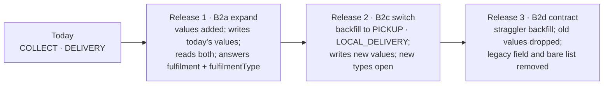
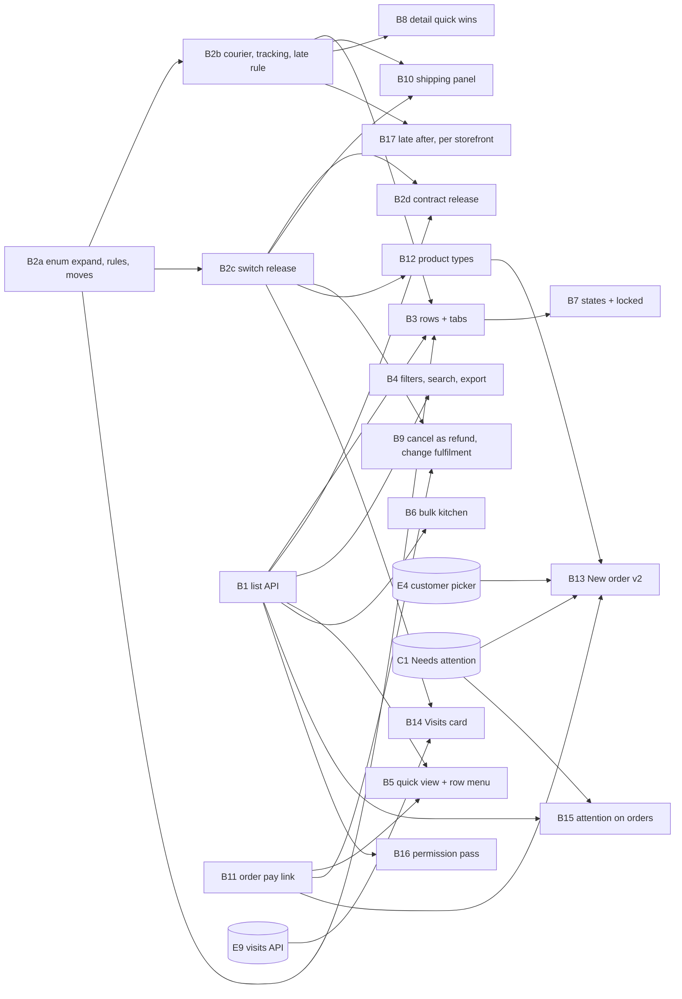

# Orders and fulfilment

## Summary

Bring Orders and Order Detail up to the 25 September designs. First, the
foundations:

- the organization order list API carries what a row needs (stage,
  fulfilment, payment standing, products, attention, late);
- an order has one of **six fulfilment types** with their own steps and late
  rule (DEC-045), brought in **expand and contract** over three releases so
  the running API, the previous image and the separately deployed app keep
  working at every step (B2a, B2c, B2d);
- shipping records the **courier and tracking number**;
- an unpaid order can be sent a **pay link**.

Then the screens:

- rows and tabs, filters and export, a quick view and row menu, and bulk
  kitchen actions with a 10-second hold and Undo all;
- states and locked cards, and Order Detail's remaining changes;
- the product's allowed fulfilment types;
- **New order v2**: walk-in, how it leaves, and the payment method with cash
  change;
- the Visits card for appointment orders;
- Needs attention on every order surface.

The permission split (`order:create/edit/refund/export`) follows the
capability model (DEC-039, 2026-09-27) and is phase 2 (B16). Until F18 makes
`order:stage` imply `order:read`, a caller holding `order:stage` without
`order:read` keeps today's kitchen view without money (DEC-024).

**Phase 1 is one finished flow** (user, 2026-09-27): the list API, the
fulfilment types, the rows and tabs, their states, the shipping panel and
the per-storefront late setting — B1, B2a, B2b, B2c, B3, B7, B10 and B17.
B17 is in phase 1 because the storefront sets the late rule (user,
2026-09-27): a café must be able to change the new 2-hour default the day it
ships. B3 does not depend on B17; the API's default thresholds apply until
B17's setting exists. Everything else is phase 2.

Invoices (the bill of supply, PDF, sending, the source filter and invoice
locked states) are plan D's (`2026-09-26-004-feat-payments-plan.md`).

---

## Problem Frame

The Orders list today (`components/stores/orders-screen.tsx`) is far behind
the design.

- **Its API lacks the fields a row needs.**
  `GET organizations/:org/orders` returns no stage, fulfilment, payment
  standing, product ids or attention, so there is:
  - no step pill or progress bar;
  - no "Late";
  - no unpaid line and no Needs attention tag;
  - no filters beyond the storefront;
  - no quick view.
- **An order is Collect or Delivery** (`OrderFulfilment`, schema), with a
  fixed 20-minute wait rule in the app (`lib/orders/lifecycle.ts`
  `WAIT_TARGET_MIN`) and a typed tracking link. The designs serve any business
  (DESIGN-NOTES "Saroh is for any business"): a shop that ships, a clinic
  whose "order" is a treatment of three visits, a creator who sells a download.
- **New order is a page form** (`components/stores/order-form.tsx`) that
  requires a picked customer and has no way to say how the order leaves or how
  it was paid.
- **An unpaid order has no link to send**; the public checkout
  (`public/orders/:orderId`) is keyed by the order's raw id.

---

## Requirements

- R1. The organization order list returns, per order: stage, fulfilment type,
  payment standing (paid, unpaid, partly refunded, refunded), the product ids,
  whether its customer has Needs attention (sensitive entries only to a
  caller holding the sensitive capability; added by B15), whether it is late,
  and its age. A caller with `order:read` gets the whole row, money included
  (DEC-039). Until F18, a caller with `order:stage` and not `order:read` gets
  the kitchen view without money (DEC-024).
- R2. The list filters server-side by date range (with a custom range), step,
  fulfilment type, storefront, payment, product, Needs attention and late. It
  searches by order number or customer name (and phone or email only with
  `contact:read`). It is newest first and paged, and returns tab counts
  (All · Open · Refunded; default 14).
- R3. An order has one of six fulfilment types (DEC-045), each with its own
  steps. Each type's steps map onto the existing order status, and existing
  orders keep their meaning (default 18).
  - Pick-up: New → Preparing → Ready → Collected.
  - Local delivery: New → Preparing → Ready → Out for delivery → Delivered.
  - Shipping: New → Preparing → Ready → Handed to courier → Delivered.
  - Digital: Paid → Sent.
  - Appointment in person and Appointment online: Booked → Attended, by
    their visits.
- R4. **When an order counts as late is a storefront setting** (default 16,
  decided 2026-09-27): one "Mark ‹type› orders late after N" per fulfilment
  type the storefront offers — Pick-up, Local delivery and Shipping — in
  hours, with minutes allowed for a counter. Defaults are 2 hours, 24 hours
  and 48 hours. The clock starts when the order was placed (`Order.createdAt`)
  for every order, online and pay-later ones included (DEC-045). Digital is
  never late, and appointments are judged by their visits. `late` is
  computed by the API from the order's storefront's setting
  and shown as "Late" in words, never colour alone, on the Orders list, the
  quick view and Order Detail.
- R5. Shipping records the courier's name and the tracking number, with an
  optional link. Saroh never books a courier.
- R6. How an order is fulfilled can change until handover. The change charges
  or refunds the difference in delivery on the order (default 17), and the
  type must be one every item allows (default 15). **Staff type the new
  delivery amount** in the change sheet (decided 2026-09-27, B9): there is no
  delivery fee per storefront yet, and today's `Order.shipping` is already a
  typed amount.
- R7. Cancel is a full refund, and the order is kept as cancelled. Once an
  order is handed over it can't be edited, re-fulfilled or cancelled, but it
  can still be refunded (DESIGN-NOTES, Order Detail rule).
- R8. A refund carries a reason. "Or another amount" is allowed within what is
  refundable (default 13).
- R9. "Add an item" works in Edit while items can change (New only).
- R10. An unpaid order (or one whose payment failed) can get a pay link. The
  link is a token shown once, stored hashed, and replaceable. It pays the
  order through the existing order checkout, and the amount always comes from
  the server.
- R11. Bulk kitchen actions:
  - select rows, and move every eligible one a step at once;
  - a 10-second hold before anything is written, with "Send now" and
    "Undo all";
  - rows that can't move (unpaid, or on another step) are named, not
    silently skipped.
- R12. A quick view of an order, drawn from the same read as Order Detail,
  with "Open full page". A row menu gives each row's allowed actions.
- R13. The Orders list, Order Detail and the quick view have loading, empty
  (per tab and per filter), failed, partial and locked states. Locked covers
  anyone holding neither `order:read` nor `order:stage` (the Reviewer
  bundle among them).
- R14. New order v2:
  - a walk-in customer (a name, and a phone if given, with no customer
    record), or search by name or phone;
  - "How it leaves" (a type every item allows);
  - the payment method (cash with change worked out, UPI, card at the
    counter, pay later, or send a pay link);
  - an allergy clash warned per line.
- R15. A product lists the fulfilment types it allows (default 15).
- R16. An appointment order shows a Visits card: each visit's date, the
  person, in person or video, and status; "Mark visit N attended" and "Book
  visit N".
- R17. Needs attention (DEC-040) shows as a tag on rows, a filter, on the
  quick view, on Order Detail's customer card and on the kitchen view; the
  allergy banner keeps its exact allergen match.
- R18. The capabilities `order:create`, `order:edit`, `order:refund` and
  `order:export` are enforced (DEC-039, the capability model). Each implies
  `order:read` and is implied by the umbrella it replaces, so existing custom
  roles keep what they had.

---

## Scope Boundaries

- Orders are never deleted (DESIGN-NOTES): cancel or refund, and the record
  stays.
- No courier booking or rates; no courier integration (DEC-045).
- No draft orders (not designed; overview "Later").
- No per-business renaming of steps (DESIGN-NOTES "Not yet"); the step words
  are the type's.
- Abandoned (unpaid online) orders stay hidden from the list, as decided in
  DESIGN-NOTES.
- Messages to the customer (Ready, a changed fulfilment, a pay link sent)
  are plan A's (A14). Until A14 ships, Order Detail shows a new pay link once
  to copy and says nothing is sent. A pay link is never re-readable: only its
  hash is stored (B11).
- Delivery fees per storefront or per type: not built here. A change of
  fulfilment takes an amount staff type (B9). The shop's checkout (G13) needs
  a priced delivery without staff and brings the fee model; B9's sheet then
  prefills from it.
- Invoices are unchanged here: an order's invoice stays the order's mirror
  (DEC-023). The bill of supply, the PDF and sending invoices are plan D's.

### Deferred to Follow-Up Work

- A variant switch on an existing line in Edit (DESIGN-NOTES "Not yet").
- Per-business step names. (Late rules are per storefront, B17.)
- Returns as their own flow (today: "Put N back in stock" on a refund,
  DEC-032).
- The public shop's choice of fulfilment type at checkout: plan G (G13) uses
  B2a's rules and the storefront's `fulfilmentTypes`, once B2c has made the
  new types writable. G13 also brings the delivery fee model the shop needs.

---

## Context & Research

### Relevant Code and Patterns

- **Schema** (`packages/database/prisma/schema.prisma`):
  - `Order` has `stage OrderStage`, `fulfilment OrderFulfilment
    @default(COLLECT)`, the `delivery*` address fields, `trackingUrl`, the
    legacy `status` and `paymentStatus` strings, `events`, `invoices` and
    `paymentIntents`.
  - `OrderItem` has `stockLevelId`, `heldQuantity` and `soldQuantity`.
  - `enum OrderStage` is NEW, PREPARING, READY, COLLECTED, HANDED_TO_COURIER,
    DELIVERED.
  - `enum OrderFulfilment` is COLLECT, DELIVERY.
  - `OrderEvent` has kind STAGE / UNDO / STATUS / EDIT / REFUND, plus
    `undoesEventId`.
  - Refund models: `PaymentRefund`, `PaymentRefundLine`.
  - `Order.customerId` is a **required** String with a required `Customer`
    relation, and `Customer.email` is required (unique per store). A
    `Contact.email` is required too (unique per business).
  - `Order` has `createdAt` and no `placedAt` or `paidAt`. The serializers
    already send `placedAt: order.createdAt` (`serialize.ts`,
    `order-read.ts`); this plan keeps that meaning.
  - `Order.shipping` is an amount typed into the create DTO; `StoreSettings`
    has `collectionEnabled`, `shippingEnabled` and `freeShippingThreshold`,
    and nothing says which fulfilment types a storefront offers.
- **Every reader of the fulfilment enum** (to move with B2a):
  - API: `orders/{dto,order-stage,order-kitchen.service,orders.service,order-read,serialize}.ts`,
    `invoices/order-invoice.ts` (bill-to address and **the GST place of
    supply**, `fulfilment === "DELIVERY"`), `invoices/order-invoicing.ts`,
    `customer-workspace/customer-detail.service.ts`;
  - app: `lib/orders/{read,lifecycle}.ts`, `lib/customer-workspace/view.ts`,
    `components/commerce/order-detail/{money-card,order-detail,order-header}.tsx`;
  - seeds: `packages/database/src/seed/showcase/bakery.ts` and the SQL
    checks in `seed/showcase/check.ts`;
  - `apps/saroh.app` reads no fulfilment (its receipt shows the status).
- **`stageForStatus`** (`order-stage.ts`), called by the store-scoped status
  PATCH in `orders.service.ts`, **rewrites the fulfilment**: SHIPPED forces
  `HANDED_TO_COURIER` and DELIVERY; DELIVERED forces COLLECTED/COLLECT or
  DELIVERED/DELIVERY.
- **Every reader of `order.customer`** (to move with B13): API
  `orders/{serialize,order-read,orders.service,order-kitchen.service}.ts`,
  `invoices/{order-invoice,order-invoicing}.ts` (bill-to name and email),
  `product-reviews/{product-reviews,public-product-reviews}.service.ts`
  (review invitations by the customer's email), `contacts/contacts.service.ts`
  (orders by `customerId`), `customer-workspace/customer-detail.service.ts`,
  `home/home.service.ts`, `calendar/calendar.service.ts`,
  `products/product-overview.service.ts`, `search/search.service.ts`; app
  `lib/orders/read.ts` (`business-service.ts` already types `customer` as
  nullable).
- **Callers of `GET organizations/:org/orders`** (to move with B1):
  `lib/orders/business-service.ts` `listBusinessOrders`, used by
  `app/(shell)/commerce/orders/page.tsx` and
  `app/(shell)/commerce/customers/[customerId]/page.tsx` (which filters the
  whole list by customer in the browser); `lib/orders/export.ts` (the type);
  `e2e/tests/order-detail.spec.ts` (`priyaOrderToday` reads the bare array).
- **Shipping the API** (`devops-tooling-and-deploy.md`,
  `backend-data-and-money.md`): migrations run before the new image serves,
  while the previous image still serves; rollback means deploying the
  previous tag; a destructive change ships in two deploys; the app deploys
  separately, after the API; a release with steps after its migrations writes
  an ordered checklist in `docs/architecture/` (as
  `PRODUCTS_STOCK_ROLLOUT.md` does).
- **Jobs** (`backend-jobs.md`): a `Job` row written in the business
  transaction, with a `runAt`; handlers idempotent; every type registered
  with a handler in the same change.
- **API** (`apps/api.saroh.in/src/modules/orders/`):
  - `organization-orders.controller.ts`: `GET organizations/:org/orders`
    (only `?storeId=`; `kitchenOnly` for `order:stage`), `GET :orderId`,
    `POST :orderId/stage`, `POST :orderId/stage/undo` and `PATCH :orderId`.
  - `order-stage.ts`: `STAGE_MOVES` with an `only: OrderFulfilment` per
    move, `nextStages`, `planStageMove`, `planUndo`, `canEditItems`,
    `stageForStatus` and `UNDO_WINDOW_MS`.
  - `order-kitchen.service.ts`: `moveStage`, `undoStage`, `edit`.
  - Also: `order-refunds.ts`, `order-read.ts`, `order-standing.ts`,
    `orders.service.ts` (`listForOrganization`), `serialize.ts` and `dto.ts`
    (`fulfilment?: OrderFulfilment`, `trackingUrl?`).
- **Payments** (`apps/api.saroh.in/src/modules/payments/`):
  - `payments.controller.ts`: `POST orders/:orderId/refund` and `…/retry`.
  - `payments.service.ts`: `createIntentForOrderPublic` and `getReceipt`.
  - `dto.ts`: the refund DTO has `reason?` and `lines?`, and deliberately
    **no amount**.
  - `public-payments.controller.ts`: `public/orders/:orderId/payment-intent`
    and `/receipt`.
- **The invoice pay link to mirror:**
  - `modules/invoices/pay-token.ts` and `pay-link-url.ts`;
  - `payments/public-invoices.{controller,service}.ts`;
  - `Invoice.payTokenHash`;
  - `apps/saroh.app/app/pay/[token]/page.tsx` and `components/invoice-pay.tsx`;
  - ADR-007 "Invoice pay link".
- **App** (`apps/app.saroh.in`):
  - the list: `app/(shell)/commerce/orders/page.tsx` renders
    `components/stores/orders-screen.tsx`;
  - `lib/orders/`: `business-service.ts`, `read.ts`, `kitchen-service.ts`,
    `lifecycle.ts` (`WAIT_TARGET_MIN = 20`, `waiting`, `flowOf`,
    `allergyCheck`), `export.ts` (`ordersToCsv`), `actions.ts` and
    `links.ts`;
  - Order Detail: `app/(shell)/commerce/orders/[orderId]/page.tsx` renders
    `components/commerce/order-detail/*` (`stepper`, `courier-panel`,
    `change-panels`, `edit-panel`, `refund-panel`, `customer-card`,
    `money-card`, `timeline`, `use-kitchen.ts`);
  - New order: `app/(shell)/commerce/orders/new/page.tsx` renders
    `components/stores/order-form.tsx` (a required `customerId`);
  - the product editor: `components/commerce/product-editor-v2/*`
    (`details-section.tsx` is where "How it's fulfilled" goes).
- **Public checkout:** `apps/saroh.app/app/[domain]/checkout/[orderId]/page.tsx`.
- **Tests:**
  - API unit specs are listed explicitly in `apps/api.saroh.in/jest.config.js`
    (`order-stage.spec.ts`, `order-refunds.spec.ts` and others);
  - DB specs: `order-kitchen.db.spec.ts`;
  - app: `lib/orders/lifecycle.test.ts`, `export.test.ts`;
  - e2e: `e2e/tests/order-detail.spec.ts`, `order-form.spec.ts`,
    `e2e/permissions/permissions.spec.ts`.

### Institutional Learnings

- **Lock order, every flow** (`backend-billing-and-classes.md`, "Orders and
  the shelf"): Order → StockLevel rows (sorted) → PaymentRefund → payment
  intent → Invoice → Booking. A fulfilment change, a cancel as a refund and a
  pay-link payment all take the order's row lock first.
- **Money:**
  - count each rupee once (DEC-023);
  - money in has an invoice, money out a credit note;
  - an order edited after it was invoiced gets a supplementary invoice or a
    credit note — never an edit to the first one.
- **Refunds:** only a definite refusal frees money (DEC-026); a refund
  releases stock only when confirmed (DEC-032).
- **Kitchen undo** is by event, within `UNDO_WINDOW_MS`, and reverses that
  step's stock rows (ADR-008).
- **New permissions** need a capability-catalogue label
  (`capability-catalogue.spec.ts`), and built-in role changes live in
  `organization-policy.ts`.

### Designs

- `Saroh Orders Screen.dc.html`: rows (step pill and progress, age or Late,
  fulfilment, unpaid line, attention tag), tabs All · Open · Refunded,
  filters, the quick view, the bulk bar ("… 10 seconds for the whole batch",
  "Send now", "Undo all", "N isn't paid"), the row menu, and states per tab.
- `Saroh Order Detail.dc.html`: "Change how it's fulfilled…" (option B),
  "Cancel order…", refund reason and another amount, "Add an item", the
  Visits card (`?id=D301`), the locked state, and the printable ticket.
- `saroh-fixtures.js`: `FULFIL` (steps, the `lateH` rule, ticket name, done
  word), `PRODUCT_FULFIL`, `orderFulfil`, `fulfilOptions`, `orderLate` and
  `attentionOf`.

---

## Key Technical Decisions

- **Six types, stages extended, statuses unchanged.**
  - `OrderFulfilment` ends as PICKUP, LOCAL_DELIVERY, SHIPPING, DIGITAL,
    APPOINTMENT_IN_PERSON and APPOINTMENT_ONLINE. COLLECT means PICKUP and
    DELIVERY means LOCAL_DELIVERY (default 18); nothing changes meaning.
  - `OrderStage` gains OUT_FOR_DELIVERY and SENT.
  - `STAGE_MOVES` becomes per type, and every move still maps onto the
    existing statuses: OUT_FOR_DELIVERY is SHIPPED, SENT and Attended are
    DELIVERED. ADR-008's "status values stay" holds, so payments, stock and
    reports need no change.
  - Appointment orders have no kitchen stages. Their standing is derived from
    their visits (B14 and plan E's E9), and they reach DELIVERED when the last
    visit is attended.
- **The enum changes by expand and contract, never by an in-place rename.**
  An `ALTER TYPE … RENAME VALUE` would break the API still serving while the
  migration runs (its Prisma client writes COLLECT and cannot read PICKUP),
  would make "deploy the previous tag" unusable as a rollback, and would
  break the separately deployed app, which compares `fulfilment ===
  "DELIVERY"` and sends COLLECT from the old order form. So there are three
  releases, each a normal API-then-app release, and **each can be rolled back
  by deploying the previous tag**:

  | Release | Unit | Database | API writes | API reads and answers |
  |---|---|---|---|---|
  | 1 · expand | B2a | adds PICKUP, LOCAL_DELIVERY, SHIPPING, DIGITAL, APPOINTMENT_IN_PERSON, APPOINTMENT_ONLINE, OUT_FOR_DELIVERY, SENT and `StoreSettings.fulfilmentTypes`; no row changes | exactly today's values and stages (COLLECT, DELIVERY, HANDED_TO_COURIER); the new types are refused | both vocabularies in and out; every response carries the legacy `fulfilment` **and** a new `fulfilmentType` |
  | 2 · switch | B2c | backfills COLLECT → PICKUP and DELIVERY → LOCAL_DELIVERY; the column default becomes PICKUP | only the new values; the new types and stages open | as release 1 |
  | 3 · contract | B2d | re-runs the backfill for stragglers, then drops COLLECT and DELIVERY | new values only | new values only; the legacy `fulfilment` field and the old list shape go |

  - **Why each rollback is safe.** Rolling back release 1 lands on today's
    image, and release 1 wrote nothing it can't read. Rolling back release 2
    lands on release 1, which reads every new value and stage. Rolling back
    release 3 lands on release 2, which writes only values that still exist.
    No release needs the snapshot to roll back; each still takes the usual
    backup before migrating.
  - **During a deploy.** Each migration only adds, or rewrites values the
    image still serving already reads, so that image keeps working until the
    new one is ready. The app follows the API (the usual order): an old app
    against a release-1 or release-2 API still gets `fulfilment` in the words
    it knows and may still send COLLECT or DELIVERY, which the API accepts
    until release 3.
  - **Mechanics.** Postgres can't use an enum value in the transaction that
    adds it, so the values are added in their own migration file and anything
    using them (the `fulfilmentTypes` backfill, the switch backfill) is a later
    file. Dropping values (release 3) builds a new type, casts `Order`,
    `Product.fulfilmentTypes` (B12, if shipped) and `StoreSettings.fulfilmentTypes`
    to it, and swaps the names; the cast rewrites `Order`, so the rollout
    checklist records how long it holds the table (as
    `PRODUCTS_STOCK_ROLLOUT.md` does). `db:verify:replay` passes after each.
  - **One normaliser.** `fulfilment.ts` exposes `typeOf(stored)` (COLLECT →
    PICKUP, DELIVERY → LOCAL_DELIVERY, otherwise itself) and
    `legacyWord(type)` (PICKUP, DIGITAL and the appointment types →
    COLLECT; LOCAL_DELIVERY and SHIPPING → DELIVERY). Every reader in the
    list under Context goes through `typeOf`; no reader compares the raw
    enum. `shipsToAddress(type)` (LOCAL_DELIVERY, SHIPPING) replaces
    `fulfilment === "DELIVERY"` in the invoice's bill-to address and **GST
    place of supply**, so a Shipping order is taxed where it goes.
  - **The write switch** in release 1 is a constant in `fulfilment.ts` that
    B2c's change flips, not an environment flag: it must follow the
    migration, not the environment.
  - B2a writes `docs/architecture/ORDER_FULFILMENT_ROLLOUT.md` (the three
    releases, what each migration locks and for how long, the rollback of
    each), and `devops-tooling-and-deploy.md` points at it.
- **Orders already with a courier on switch day don't get stuck.** A
  DELIVERY order at HANDED_TO_COURIER becomes a LOCAL_DELIVERY order at
  HANDED_TO_COURIER, whose new table is READY → OUT_FOR_DELIVERY →
  DELIVERED. LOCAL_DELIVERY therefore keeps **HANDED_TO_COURIER → DELIVERED
  as a legacy move** (never offered from READY after the switch), and
  HANDED_TO_COURIER counts as its handover, so its history, its stock commit
  and its undo stand. B2d leaves the legacy move in place: old orders keep
  their stage forever.
- **`stageForStatus` never changes an order's type.** Today a status PATCH
  to SHIPPED turns any order into DELIVERY at HANDED_TO_COURIER, and
  DELIVERED picks COLLECT or DELIVERY. It becomes per type:
  - SHIPPED → the type's SHIPPED-mapped stage (OUT_FOR_DELIVERY for Local
    delivery, HANDED_TO_COURIER for Shipping and for a legacy Local delivery
    already there); a type with no SHIPPED step (Pick-up, Digital, the
    appointments) → 409 "A pick-up order isn't shipped. Change how it's
    fulfilled first.";
  - DELIVERED → the type's done stage (COLLECTED, DELIVERED or SENT); the
    appointment types → 409 (their visits finish them);
  - PENDING, PROCESSING and CANCELLED as today.
  In release 1 the SHIPPED-mapped stage of a Local delivery is still
  HANDED_TO_COURIER (today's write).
- **One rules module, and no app mirror.** `orders/fulfilment.ts`, pure,
  holds each type's steps, handover stage, default late threshold, ticket
  name and done word, and the normaliser. **The app keeps no copy**: the list
  row and the order read carry the type's `steps` (words), the current
  `stepIndex`, `ticketName`, `lateAfterMinutes`, `late` and `lateBy`, and the
  app draws them. `lib/orders/lifecycle.ts` `flowOf` and `waiting` read
  those fields, and `WAIT_TARGET_MIN` goes. A step word changes in one place.
- **Handover** is COLLECTED, OUT_FOR_DELIVERY, HANDED_TO_COURIER or SENT
  (and the first attended visit for appointments). From handover on:
  - Edit, "Change how it's fulfilled" and Cancel are refused (409, with a
    sentence);
  - Refund stays.
  - Items still lock at PREPARING (`canEditItems`, unchanged).
- **Which types a storefront offers** is `StoreSettings.fulfilmentTypes
  OrderFulfilment[]`, holding only the physical ways an order leaves: PICKUP,
  LOCAL_DELIVERY and SHIPPING. Digital and the appointment types follow the
  product (B12), not the storefront. B2a adds the column; its backfill (a
  file after the enum values) sets PICKUP where `collectionEnabled`,
  SHIPPING where `shippingEnabled`, and LOCAL_DELIVERY where the storefront
  has any DELIVERY order. Until B17 replaces the two old toggles with a chip
  set, saving `collectionEnabled` or `shippingEnabled` keeps the array in
  step. B12's "empty means every type its storefronts offer", B13's leaves
  step, B17's late rows and G13's checkout choice read this one field.
- **Courier fields.** `Order.courierName` and `Order.trackingNumber` are
  added (text, trimmed, ≤ 80 characters), and `trackingUrl` stays optional.
  Moving to HANDED_TO_COURIER on a Shipping order asks for the courier and
  number but doesn't require them. A missing number shows "No tracking number
  yet" with Add.
- **Late is the API's, and its threshold is the storefront's.** `placedAt`
  means `Order.createdAt` (there is no other column), and **the late clock
  starts at placed for every order**, online and pay-later ones included
  (DEC-045); no paid time is read. `late` is computed at read time from
  `placedAt`, the threshold the order's storefront sets for its type (B17;
  the type's default until then) and the business's time zone (DEC-033). It
  is never stored. Thresholds are stored in minutes on `StoreSettings`
  (`pickupLateAfterMinutes`, `localDeliveryLateAfterMinutes`,
  `shippingLateAfterMinutes`), defaulting to 120, 1,440 and 2,880 (default
  16). Changing one re-labels open orders on the next read, and nothing is
  rewritten. Only an open order (not handed over, not cancelled) is late.
- **Changing fulfilment** runs in one transaction under the order's row lock:
  - check the new type against every item's allowed types (B12, or
    everything before B12 ships) and the storefront's `fulfilmentTypes`;
  - **the new delivery amount is typed by staff** (decided 2026-09-27): the
    sheet prefills the order's current `shipping` when moving between
    delivery types and 0 when moving to Pick-up, Digital or an appointment,
    and shows the difference before the button. There is no fee model to
    recompute from; G13 brings one for the shop, and the sheet then prefills
    from it;
  - a higher delivery charge → a pay link for the difference, or record it
    at the counter, with a supplementary invoice through
    `correctOrderInvoiceForEdit`;
  - a lower one → a refund of the difference through the refund path, with a
    credit note (DEC-026 rules);
  - write an `OrderEvent` (kind EDIT) "Changed from Pick-up to Local
    delivery".
- **Cancel = refund in full.** "Cancel order…" calls the refund path with no
  lines (everything refundable) and the reason, then moves the status to
  CANCELLED in the same order-locked transaction. Promised stock is released
  only when the refund is confirmed (DEC-032). An unpaid order cancels with
  no refund, as today.
- **"Or another amount"** (default 13) is the one place a client sends an
  amount for a refund:
  - it is capped server-side at the order's refundable balance, under the
    order's row lock;
  - it needs a reason;
  - it is recorded as a `PaymentRefund` with no lines;
  - it returns no stock, and makes a credit note against the order invoice
    for that amount (spread as the #508 credit notes are);
  - the DTO keeps "no amount" for line refunds; `amount` is accepted only
    with `lines` absent and `kind: "goodwill"`.

  The security note in `payments/dto.ts` is updated to say exactly that.
- **The order pay link** mirrors the invoice pay link:
  - `Order.payTokenHash` holds the SHA-256 of 256 random bits, and **the raw
    token is never stored**, so no one can read a link back: `order:read`
    shows whether a link exists and when it was made, never the link;
  - the address is shown once, to whoever makes it; "New pay link" (on Order
    Detail and the row menu) replaces it and says the old one stops working;
  - the log redacts `/public/order-pay/<token>`;
  - the page is `saroh.app/pay/o/<token>` in the business's site theme,
    showing an allow-list (business name, order number, lines, total, status,
    customer first name);
  - the payment request carries only a provider and an idempotency key and
    creates the intent through the existing `createIntentForOrder` path
    (amount from `order.total` less what is paid);
  - the link is cleared when the order is paid, cancelled or refunded.
- **The list gets a new shape beside the old one, for one release.** The API
  and the app deploy separately, so the bare array stays until every caller
  has moved.
  - `GET organizations/:org/orders?v=2&tab=&stage=&fulfilment=&payment=&productId=&customerId=&late=&from=&to=&q=&storeId=&cursor=`
    returns `{ rows, counts: {all, open, refunded}, nextCursor }`.
  - Without `v=2` the route returns today's `BusinessOrder[]`, unpaged, with
    today's `kitchenOnly` projection, plus `fulfilmentType` (additive). B1
    moves every caller listed under Context to `v=2` in the same PR (the
    customer page through `customerId=`), and B2d removes the bare array.
    Home follows the same rule (plan F).
  - Rows are built by one serializer shared with the quick view
    (`order-row.ts`). Money fields are omitted without `order:read`, and
    customer phone and email without `contact:read` (which C13 relabels).
  - Product filtering joins through `OrderItem`. Late filters by a SQL
    expression over `createdAt` and the storefront's thresholds (the
    defaults until B17), so counts and cursors stay exact.
  - **Needs attention is not in B1.** B15 adds the `attention` field and
    filter once C1 exists, so no unit ships an `attention: null` stand-in,
    and B1 does not wait on C1.
- **Bulk moves are held on the server.** A hold kept only in a browser tab
  loses the moves when the tab closes, and a retry after a lost reply can't
  tell its own moves from someone else's. So:
  - `POST organizations/:org/orders/stage/batches` with a client-made
    `batchId` (the idempotency key) and `{moves: [{orderId, from, to}]}` (at
    most 100) writes an `OrderStageBatch` (organization-owned, RLS) with one
    line per move, status HELD, and enqueues `orders.stage-batch.commit` with
    `runAt` ten seconds on, in the same transaction. Nothing moves yet.
  - "Send now" (`POST …/batches/:batchId/commit`) or the job commits it:
    each line in its own order-locked transaction (never one lock across
    many orders), writing the line's result and the stage event's id in the
    same transaction as the move. Commit is idempotent: done lines are
    skipped, so a retry, a second tab or the job running after "Send now"
    changes nothing twice.
  - "Undo all" while HELD (`POST …/batches/:batchId/cancel`) cancels the
    batch with no order touched. After commit it undoes each line by its
    event id through the existing undo, within `UNDO_WINDOW_MS`, and returns
    per-line results.
  - `GET …/batches/:batchId` returns every line's result: moved (with the
    event id), undone, or failed with a sentence ("Moved by someone else",
    "Not paid", "Already collected", "They've already been told", "Too late
    to undo"). A retry of the same `batchId` returns the stored results
    instead of re-running.
  - `order:stage` is enough, as for a single move.
- **Undo is never offered once the customer has been told.** When A14
  sends messages on a stage (Ready, handed over), the message waits for the
  same ten seconds, keyed to the stage event's id, and an undo within that
  time cancels it (A14 builds the delay and the cancel). Once a message for
  that event has left, the API refuses the undo (409 "They've already been
  told") and reports the event as not undoable, so Order Detail, the quick
  view, the row menu, the bulk bar and Home draw no Undo for it. Before A14
  nothing is sent and undo is unchanged.
- **Walk-in needs a migration: `Order.customerId` becomes nullable.** A
  walk-in order stores `walkInName` and, if typed, `walkInPhone`, with no
  customer. If an email is typed, it is not a walk-in: the storefront's
  `Customer` is found or made by email, as today, and C2's
  `ensureContactForPaidOrder` links a contact when it is paid. **A phone-only
  walk-in makes no contact**, because `Contact.email` is required; its phone
  stays on the order. The column change is additive, but a null customer
  breaks every reader listed under Context, so B13 ships in two deploys:
  first every reader handles a null customer (the name falls back to
  `walkInName`, invoices bill "‹name› (walk-in)" with no email, review
  invitations and customer rollups skip the order), then New order v2
  starts writing walk-ins.
- **The payment method on New order** reuses the recorded-payment path (cash,
  UPI, card at the counter) or pay later or a pay link (B11).
  - "Cash — change ₹X" is computed in the browser from what was typed. Only
    the method and the amount received are stored; the change is written in
    the event note.
  - Stock promises follow DEC-032: staff orders promise when made.
- **Product allowed types** are `Product.fulfilmentTypes OrderFulfilment[]`,
  empty meaning every type its storefront offers (`StoreSettings.fulfilmentTypes`,
  plus Digital for a digital product; default 15). An order's options are
  the intersection over its items and the storefront. Services (an
  appointment product) carry APPOINTMENT_* only.

### Permissions touched

| Action | Today | This plan | Needs |
|---|---|---|---|
| List orders with money, filters, tab counts | `order:read` | unchanged | `order:read` |
| List and quick view without money (until F18); bulk stage moves; ticket print | `order:stage` | bulk uses the same action | `order:stage` (implies `order:read` from F18) |
| Change fulfilment, Add an item, edit address | `order:write` | unchanged until B16 | `order:write` → `order:edit` (B16) |
| Cancel as refund, refund reason, another amount | `payment:manage` | unchanged until B16 | → `order:refund` (B16) |
| Make and replace an order pay link (the link is shown once, to its maker) | — | new | `order:write` (→ `order:create` for a new order's first link, `order:edit` to replace one, B16) |
| See whether a pay link exists and when it was made (never the link) | — | new | `order:read` |
| Hold, send, cancel and undo a bulk batch | — | new | `order:stage` |
| New order v2 | `order:write` | unchanged until B16 | → `order:create` (B16) |
| Export CSV | `order:read` | unchanged until B16 | → `order:export` (B16) |
| See customer phone and email on rows | `contact:read` | unchanged | `contact:read`, relabelled (C13) |
| See sensitive Needs attention | — | C1 interim: `contact:write` | → `customer:sensitive` (C13, per matrix Q2) |
| Sell rail rows | the module | gated on their own reads (B16, matrix W-1) | `order:read`, `store:read`, `contact:read` |
| Set a product's allowed types | `store:write` | unchanged | `store:write` |
| Set when a storefront's orders are late (B17) | — | new setting | `store:write` |

---

## Open Questions

### Resolved During Planning

- Six types and shipping tracking without courier booking (DEC-045).
- The change-fulfilment option is B: allowed until handover, charging or
  refunding the delivery difference (DESIGN-NOTES, Orders audit).
- Tabs are All · Open · Refunded (default 14).
- "Or another amount" stays, capped and with a reason (default 13).
- The capability model (DEC-039, 2026-09-27): `order:read` shows the whole
  order, and the order writes are split where a business would grant one
  without another. A caller with `order:stage` and not `order:read` keeps
  the kitchen view without money until F18 makes one imply the other
  (matrix Q1).
- **When an order is late** (default 16; user, 2026-09-27): a storefront
  setting per fulfilment type it offers, measured from when the order was
  placed. Defaults: Pick-up 2 hours, Local delivery 24 hours, Shipping 48
  hours; a café-like storefront can set 20 minutes. Digital is never late,
  and appointments are judged by their visits. Built in B17, read by B2b's
  rule. **The clock starts at placed (`createdAt`) for every order**, pay-later
  and online ones included (DEC-045; coherence review 2026-09-27).
- **The enum migration** is expand and contract over three releases (B2a,
  B2c, B2d), never an in-place rename (adversarial review 2026-09-27; Key
  Technical Decisions).
- **A delivery change's amount** is typed by staff (2026-09-27), prefilled
  from the order's current delivery charge. No per-storefront fee model is
  built here; G13 brings one for the shop.
- **Which types a storefront offers** is `StoreSettings.fulfilmentTypes`
  (B2a), read by B12, B13, B17 and G13.
- **Bulk holds** live on the server (`OrderStageBatch`), with per-line event
  ids, so a closed tab loses nothing and a partial failure can be retried or
  undone (B6).
- **Walk-in orders** make `Order.customerId` nullable, in two deploys (B13).

### Deferred to Implementation

- How long B2d's cast holds the `Order` table on production-sized data
  (measured in the rehearsal and written into the rollout checklist).
- Whether tab counts come from one grouped query or three counts (measure on
  the seeded data).
- Whether the quick view reuses `order-read.ts` whole or a slimmer projection.

---

## High-Level Technical Design

> *Directional guidance for review, not implementation specification.*

```mermaid
stateDiagram-v2
    state "Pick-up" as P {
        [*] --> NEW
        NEW --> PREPARING
        PREPARING --> READY
        READY --> COLLECTED: handover
    }
    state "Local delivery" as L {
        [*] --> NEW2: NEW
        NEW2 --> PREP2: PREPARING
        PREP2 --> READY2: READY
        READY2 --> OUT: OUT_FOR_DELIVERY (handover)
        OUT --> DEL2: DELIVERED
        LEG: HANDED_TO_COURIER (legacy, from before B2c)
        LEG --> DEL2: DELIVERED
    }
    state "Shipping" as S {
        [*] --> NEW3: NEW
        NEW3 --> PREP3: PREPARING
        PREP3 --> READY3: READY
        READY3 --> HAND: HANDED_TO_COURIER (handover; courier + number)
        HAND --> DEL3: DELIVERED
    }
    state "Digital" as D {
        [*] --> PAID: NEW (shown "Paid")
        PAID --> SENT: SENT (handover)
    }
```

Appointment types have no kitchen stages; their visits (bookings) carry the
order to DELIVERED.

The enum's three releases, each API first and then the app, each rolled back
by deploying the previous tag:

---

## Implementation Units

B2 is split in four (2026-09-27): **B2a** the enum's expand release, the
per-type rules and moves; **B2b** the courier and tracking fields and the late
rule; **B2c** the switch release; **B2d** the contract release, with the other
compatibility clean-ups. B2 as a single unit no longer exists; a reference to
"B2" elsewhere means B2a (the rule table) or B2c (the types writable).

**Phase 1** (one finished flow: the list, the types, the rows, their states,
the shipping panel, the late setting): B1, B2a, B2b, B2c, B3, B7, B10, B17 —
8 units. B2a → B2b → B2c land in that order on the order module, B2a and B2c
in different releases, and B10 lands with or after B2c. B17 lands after B2b,
in the same release as B2b or the one after it; until it does, the API's
default thresholds apply, and nothing else waits on it.

**Phase 2:** B2d, B4, B5, B6, B8, B9, B11, B12, B13, B14, B15, B16 — 12 units.
The plan has 20 units.
B2d waits one release after B2c and after every list caller is on `v=2`.

---

### B1. Orders list API v2

**Goal:** One organization order list that serves rows, filters, tab counts
and paging, with money and contact details left out by permission, beside
today's bare array for one release.

**Requirements:** R1, R2

**Dependencies:** None to start. Its rows carry B2a's steps and B2b's `late`
when those land (B1, B2a and B2b can merge in any order; the row fields are
added by whichever lands second). Needs attention is not in B1: B15 adds it
once C1 exists, so there is no stand-in.

**Phase:** 1

**Files:**
- Modify:
  - `apps/api.saroh.in/src/modules/orders/organization-orders.controller.ts`
    (query params; `v=2` picks the new shape);
  - `orders.service.ts` (`listForOrganization` keeps today's bare array;
    a new `listRows` → filters, cursor, counts);
  - `dto.ts` (`ListOrdersQuery`).
- Create: `apps/api.saroh.in/src/modules/orders/order-row.ts` (the row
  serializer shared with B5), `order-list-filters.ts` (the query builder, pure
  where possible).
- Modify, in the same PR, **every caller of the route**:
  - `apps/app.saroh.in/lib/orders/business-service.ts` (`listOrderRows` with
    `v=2`; `listBusinessOrders` goes once nothing calls it), `read.ts`
    (types), `lib/orders/export.ts` (the row type);
  - `app/(shell)/commerce/orders/page.tsx`;
  - `app/(shell)/commerce/customers/[customerId]/page.tsx` (asks
    `customerId=` instead of filtering the whole list in the browser);
  - `e2e/tests/order-detail.spec.ts` (`priyaOrderToday` reads `v=2` rows).
- Test:
  - `apps/api.saroh.in/src/modules/orders/order-list-filters.spec.ts` (add
    to `jest.config.js` `testMatch`);
  - `order-list.db.spec.ts`;
  - update `organization-orders.controller.spec.ts` and
    `orders.service.read-access.spec.ts`.

**Approach:**
- **Compatibility.** Without `v=2` the route answers exactly as today (the
  bare `BusinessOrder[]`, the `kitchenOnly` projection), so an app deployed
  before or after the API keeps working. B2d removes the bare array one
  release after every caller is on `v=2`.
- The filters are:
  - tab (all / open / refunded, where open = not terminal and not
    cancelled);
  - stage[], fulfilment[] (the new type names; the legacy values are
    matched too until B2d), payment (paid / unpaid / partly refunded /
    refunded, derived from refund sums as `order-standing.ts` does);
  - productId (through `OrderItem`), customerId, storeId;
  - from/to in the business's zone;
  - late: a SQL expression over `createdAt` and the order's storefront's
    thresholds (the type defaults until B17), so counts and cursors stay
    exact;
  - q (order number or customer name; phone or email only with
    `contact:read`).
- Cursor paging on `(createdAt desc, id desc)`, 50 a page. `placedAt` in the
  row is `createdAt`, as today's serializers already send it.
- Counts per tab honour every filter except the tab.
- The row has: id, number, placedAt, storefront, customer name (or the
  walk-in name, after B13), stage, `fulfilmentType`, the type's `steps` and
  `stepIndex` (B2a), payment standing, the unpaid amount (with `order:read`),
  total (with `order:read`), product names (first two and "+N"), late and
  lateBy (B2b), and age.
- Abandoned orders stay excluded, as today: an order that is `placedOnline`
  and UNPAID never appears in rows or counts. `Order.placedOnline` and
  `Order.paidAt` are added by whichever of B1 and G13 lands first (additive,
  `placedOnline` defaulting to false), so B1 filters on the column from the
  start.

**Patterns to follow:** today's `listForOrganization` `kitchenOnly`
projection; `order-standing.ts`; DEC-024's "money left out by the API".

**Test scenarios:**
- Happy path: 3 storefronts, 60 orders → the first page has 50, newest
  first, with a cursor; the counts match per tab.
- Happy path: `payment=unpaid&fulfilment=SHIPPING` returns only unpaid
  shipping orders.
- Happy path: without `v=2` the response equals today's (a snapshot of the
  seeded Northwind list).
- Edge case: a caller with `order:stage` and not `order:read` gets rows with
  no `total` and no `unpaidAmount`; phone and email follow `contact:read`;
  the counts still come back.
- Edge case: `q=98…` (a phone number) from a caller without `contact:read`
  matches nothing by phone; it does not leak whether the number exists.
- Edge case: the date range is read in the business's zone (an order at
  00:30 IST on the 1st is on the 1st).
- Edge case: `late=true` with two storefronts on different thresholds pages
  and counts exactly.
- Error path: a `storeId` from another business → empty (it narrows, never
  widens); a caller with neither `order:read` nor `order:stage` → 403.

**Verification:** The seeded Northwind list filters and pages correctly
through the API; the old app build still renders Orders against the new API;
the permission matrix spec still passes.

---

### B2a. Fulfilment types: the expand release, per-type rules and moves (API)

**Goal:** The six types and their steps exist in the schema and in one rule
table, every reader goes through it, and every write is still exactly
today's, so this release can be rolled back by deploying the previous tag.

**Requirements:** R3

**Dependencies:** None

**Phase:** 1 (release 1 of 3)

**Files:**
- Modify: `packages/database/prisma/schema.prisma` (`OrderFulfilment` gains
  PICKUP, LOCAL_DELIVERY, SHIPPING, DIGITAL, APPOINTMENT_IN_PERSON and
  APPOINTMENT_ONLINE beside COLLECT and DELIVERY; `OrderStage` gains
  OUT_FOR_DELIVERY and SENT; `StoreSettings.fulfilmentTypes
  OrderFulfilment[] @default([])`).
- Create:
  - `packages/database/prisma/migrations/<ts>_order_fulfilment_values/migration.sql`
    (the enum values only);
  - `packages/database/prisma/migrations/<ts+1>_store_fulfilment_types/migration.sql`
    (the column and its backfill, a later file because Postgres can't use a
    new enum value in the transaction that adds it);
  - `apps/api.saroh.in/src/modules/orders/fulfilment.ts` (the rule table:
    steps, handover, default late threshold, ticket, done word, stage moves
    per type; `typeOf`, `legacyWord`, `shipsToAddress`; the write switch,
    off);
  - `docs/architecture/ORDER_FULFILMENT_ROLLOUT.md` (the three releases,
    each migration's locks and timing, each rollback).
- Modify:
  - `apps/api.saroh.in/src/modules/orders/order-stage.ts` (`STAGE_MOVES`
    keyed by type from `fulfilment.ts`, `nextStages`, `planStageMove`,
    `stageForStatus` per type);
  - `order-kitchen.service.ts`, `orders.service.ts` (create and edit accept
    both vocabularies and store today's values; the new types refused while
    the switch is off), `dto.ts` (`ORDER_FULFILMENTS` accepts both),
    `serialize.ts`, `order-read.ts` (answer `fulfilment` in the legacy word
    and `fulfilmentType`, plus `steps`, `stepIndex`, `ticketName`);
  - every other reader listed under Context: `invoices/order-invoice.ts`
    (`shipsToAddress` for bill-to and place of supply),
    `invoices/order-invoicing.ts`,
    `customer-workspace/customer-detail.service.ts`;
  - `stores/{dto,stores.service}.ts` (the settings read carries
    `fulfilmentTypes`; saving `collectionEnabled` or `shippingEnabled` keeps
    it in step);
  - app: `lib/orders/read.ts` (`fulfilmentType`, `steps`, `stepIndex`),
    `lib/orders/lifecycle.ts` (`flowOf` and `waiting` read the API's fields;
    `WAIT_TARGET_MIN` goes), `lib/customer-workspace/view.ts`,
    `components/commerce/order-detail/{money-card,order-detail,order-header,stepper}.tsx`
    (read `fulfilmentType`; no raw enum comparisons);
  - `packages/database/src/seed/showcase/bakery.ts`, `seed/showcase/check.ts`
    (the SQL checks match both vocabularies).
  - `docs/patterns/devops-tooling-and-deploy.md` (points at the rollout
    checklist).
- Test:
  - `apps/api.saroh.in/src/modules/orders/fulfilment.spec.ts` (new;
    `testMatch`);
  - update `order-stage.spec.ts`, `order-kitchen.db.spec.ts`,
    `orders.service.state.spec.ts`, `invoices/order-invoice.spec.ts`;
  - `apps/app.saroh.in/lib/orders/lifecycle.test.ts`.

**Approach:**
- **Characterization first.** Pin today's Collect and Delivery move tables,
  undo, `stageForStatus`, the invoice's place of supply and the list and
  read responses before changing anything. This release must pass all of
  them unchanged, except the two deliberate `stageForStatus` refusals below.
- The migration adds values and a column and changes no row. The
  `fulfilmentTypes` backfill sets PICKUP where `collectionEnabled`, SHIPPING
  where `shippingEnabled`, and LOCAL_DELIVERY where the storefront has any
  DELIVERY order. Only PICKUP, LOCAL_DELIVERY and SHIPPING are ever stored
  there.
- The rule table holds the final per-type moves, each mapped to a status:
  - Pick-up: READY → COLLECTED (DELIVERED).
  - Local delivery: READY → OUT_FOR_DELIVERY (SHIPPED) → DELIVERED, and the
    legacy HANDED_TO_COURIER → DELIVERED (SHIPPED → DELIVERED).
  - Shipping: READY → HANDED_TO_COURIER (SHIPPED) → DELIVERED.
  - Digital: NEW → SENT (DELIVERED), only when paid.
  - Appointments: no stage moves.
- **While the write switch is off** (this release), a Local delivery still
  moves READY → HANDED_TO_COURIER, as today, and create, edit and the stage
  moves store COLLECT, DELIVERY and today's stages only; SHIPPING, DIGITAL
  and the appointment types are refused with 400 "Not available yet". So
  nothing is written that today's image can't read.
- `stageForStatus` becomes per type and never changes the type: SHIPPED on
  Pick-up, Digital or an appointment, and DELIVERED on an appointment, are
  refused with a sentence (today they silently turn the order into a
  delivery).
- Every reader goes through `typeOf`; nothing compares the raw enum.
- The undo window and event writing are unchanged.

**Execution note:** Characterization first, then the table, then the readers
one by one; the switch stays off.

**Patterns to follow:** `order-stage.ts`'s pure tables; the two-deploy rule
in `backend-data-and-money.md`; `PRODUCTS_STOCK_ROLLOUT.md` for the
checklist's shape.

**Test scenarios:**
- Happy path: every characterization test passes unchanged: a COLLECT order
  walks NEW → COLLECTED and a DELIVERY order NEW → HANDED_TO_COURIER →
  DELIVERED, with the same events, statuses and stock commits.
- Happy path: an order sent as `fulfilment: "PICKUP"` is stored COLLECT and
  answered `fulfilment: "COLLECT"`, `fulfilmentType: "PICKUP"`.
- Edge case: the old app's `fulfilment: "DELIVERY"` create still works, with
  its address rule.
- Edge case: a row stored as LOCAL_DELIVERY (inserted by the test) reads and
  moves correctly: release 1 can already serve release 2's data.
- Edge case: the invoice for a SHIPPING row (inserted by the test) takes its
  place of supply from the delivery state, as DELIVERY does.
- Error path: create with SHIPPING → 400 "Not available yet"; a status PATCH
  to SHIPPED on a Pick-up order → 409 with the sentence, and the order is
  unchanged.
- Integration: `db:verify:replay` passes; the showcase checks pass on a fresh
  seed.

**Verification:** Every existing kitchen and order e2e passes unchanged; the
previous API tag started against the migrated database serves orders
normally (the rollback rehearsal).

---

### B2b. Courier and tracking number, and the late rule (API)

**Goal:** Shipping records the courier and number, and every order read
says whether it is late by its type's rule.

**Requirements:** R4, R5

**Dependencies:** B2a

**Phase:** 1

**Files:**
- Modify: `packages/database/prisma/schema.prisma` (`Order.courierName`,
  `Order.trackingNumber`, both nullable), with a migration (additive; safe
  under the previous image).
- Modify:
  - `apps/api.saroh.in/src/modules/orders/fulfilment.ts` (`lateOf(type,
    placedAt, now, thresholds)` → `{late, lateBy}`);
  - `order-kitchen.service.ts` (the courier fields on a move to
    HANDED_TO_COURIER), `dto.ts`, `orders.service.ts` / the org `PATCH
    :orderId` (these two fields stay editable after handover, and only
    these);
  - `serialize.ts`, `order-read.ts`, `order-row.ts` (`late`, `lateBy`,
    `lateAfterMinutes`, the courier fields).
- Test: `fulfilment.spec.ts` (the late table), `order-kitchen.db.spec.ts`
  (courier on handover and PATCH after).

**Approach:**
- The late rule takes the type, `placedAt` (= `createdAt`), now, the
  business's zone and the storefront's thresholds. Until B17 the thresholds
  are the type defaults in `fulfilment.ts` (120, 1,440 and 2,880 minutes;
  default 16). Only an open order is late; Digital and appointments never
  are.
- The courier name and number are accepted on the HANDED_TO_COURIER move and
  on `PATCH :orderId` after handover; ≤ 80 characters, trimmed.
- This is where a counter's 20-minute "waiting" becomes 2 hours; see Risks.

**Test scenarios:**
- Happy path: a Shipping order handed over with "Delhivery" and a number;
  the number is added later by PATCH after handover.
- Edge case: late is true only past the type's threshold, in the business's
  zone; a collected order is never late; Digital and appointments never
  are.
- Edge case: a pay-later order placed 3 hours ago and paid 1 hour ago is
  late for Pick-up (the clock starts at placed).
- Error path: a courier name over 80 characters → 400; PATCH of any other
  field after handover → 409.

**Verification:** The seeded late Pick-up order reads late through the API.

---

### B2c. Fulfilment types: the switch release

**Goal:** Existing orders take the new names, new writes use them, and the
new types and stages open.

**Requirements:** R3

**Dependencies:** B2a in an earlier release (the image serving during this
migration and the rollback target must read the new values).

**Phase:** 1 (release 2 of 3)

**Files:**
- Create: `packages/database/prisma/migrations/<ts>_order_fulfilment_switch/migration.sql`
  (UPDATE COLLECT → PICKUP and DELIVERY → LOCAL_DELIVERY; the column default
  becomes PICKUP).
- Modify: `apps/api.saroh.in/src/modules/orders/fulfilment.ts` (the switch
  on), `packages/database/src/seed/showcase/bakery.ts` and the Northwind
  seed in `seed/run.ts` (new values; one order of each physical type and one
  Digital order on Northwind; appointment orders are seeded by E9/B14, not
  here), `seed/showcase/check.ts`.
- Modify: `docs/architecture/ORDER_FULFILMENT_ROLLOUT.md` (the backfill's
  row count and timing from the rehearsal).
- Test: `order-kitchen.db.spec.ts` (the in-flight order),
  `fulfilment.spec.ts`, `orders.service.state.spec.ts`.

**Approach:**
- The backfill rewrites values the running release-1 image already reads,
  so it keeps serving during the migration. It may still write COLLECT or
  DELIVERY until the new image serves; B2d catches those.
- With the switch on, a Local delivery moves READY → OUT_FOR_DELIVERY, and
  Shipping, Digital and the appointment types can be created (the
  appointment types only through E9's path).
- **In-flight courier orders.** A former DELIVERY order at
  HANDED_TO_COURIER is now LOCAL_DELIVERY at HANDED_TO_COURIER and moves on
  by the legacy move to DELIVERED. A move to HANDED_TO_COURIER from READY on
  a Local delivery is no longer offered.
- Responses keep sending the legacy `fulfilment` word beside
  `fulfilmentType` until B2d.
- Rollback: deploy the release-1 tag. It reads the new values and stages
  and writes only values that exist.

**Test scenarios:**
- Happy path: each type's full path from its first to its done stage, each
  move writing an event and the mapped status.
- Edge case: a DELIVERY order at HANDED_TO_COURIER before the migration
  reaches DELIVERED after it, with its stock commit, history and a
  within-window undo intact.
- Edge case: an existing COLLECT order reads as PICKUP with identical steps
  and history after the migration.
- Edge case: Digital skips Preparing; an unpaid Digital order can't be Sent.
- Error path: a move not in the type's table → 409 with the step words.
- Integration: `db:verify:replay` passes; the release-1 image, started
  against the switched database, serves and moves orders (the rollback
  rehearsal).

**Verification:** Every existing kitchen e2e passes; new orders of each
physical type and Digital walk their steps through the API.

---

### B2d. The contract release: drop the old values and the compatibility shapes

**Goal:** Remove what the earlier releases kept for the old image and the
old app.

**Requirements:** R3

**Dependencies:** B2c in an earlier release; B1's callers all on `v=2`; no
app build older than B2a's in production.

**Phase:** 2 (release 3 of 3)

**Files:**
- Create: `packages/database/prisma/migrations/<ts>_order_fulfilment_contract/migration.sql`
  (re-run the backfill for stragglers; fail loudly if any COLLECT or
  DELIVERY remains; build the new type without them, cast `Order.fulfilment`,
  `StoreSettings.fulfilmentTypes` and `Product.fulfilmentTypes` if B12 has
  shipped, swap the names, drop the old type).
- Modify: `packages/database/prisma/schema.prisma` (the enum without COLLECT
  and DELIVERY); `apps/api.saroh.in/src/modules/orders/{fulfilment,dto,serialize,order-read,organization-orders.controller,orders.service}.ts`
  (the legacy words, the legacy `fulfilment` field and the bare-array list
  go; `fulfilmentType` stays the one name); the app's reads of the legacy
  field, if any remain; `docs/architecture/ORDER_FULFILMENT_ROLLOUT.md`.
- Test: `fulfilment.spec.ts`, `organization-orders.controller.spec.ts` (no
  `v` → the new shape), `order-kitchen.db.spec.ts`.

**Approach:**
- The cast rewrites `Order` under an exclusive lock; the rehearsal measures
  it on a production-sized copy and the checklist records it.
- The legacy HANDED_TO_COURIER → DELIVERED move for Local delivery stays: it
  is a stage, not an enum value, and old orders keep it.
- Rollback: deploy the release-2 tag; it writes only values that remain.

**Test scenarios:**
- Happy path: after the migration, every order reads with its type and no
  legacy value exists.
- Edge case: a COLLECT row written by the release-1 image after B2c's
  backfill is converted, not lost.
- Error path: the migration aborts, changing nothing, if a legacy value
  survives the re-run backfill.
- Integration: `db:verify:replay` passes.

**Verification:** The Orders list, Order Detail, Home and the customer page
all render on the contracted API.

---

### B3. Orders list rows and tabs

**Goal:** The design's rows and tabs on `/commerce/orders`.

**Requirements:** R1, R2, R4

**Dependencies:** B1, B2a (steps), B2b (late)

**Phase:** 1

**Files:**
- Modify: `apps/app.saroh.in/components/stores/orders-screen.tsx` (split
  into `components/commerce/orders/*`: `orders-screen.tsx`, `order-row.tsx`,
  `order-tabs.tsx`, `step-pill.tsx`), `app/(shell)/commerce/orders/page.tsx`.
- Modify: `apps/app.saroh.in/lib/orders/business-service.ts` (URL state:
  tab and cursor).
- Test: `apps/app.saroh.in/lib/orders/lifecycle.test.ts` (the row's
  `stepIndex` and `steps` → progress words), `e2e/tests/orders-list.spec.ts`
  (new).

**Approach:** Each row has:
- the number and customer;
- a step pill with the type's step word (from the row's `steps`, never an
  app copy of the table) and tone, and a progress bar (`stepIndex` over the
  step count, said in words for screen readers);
- the age ("12 min", "Yesterday") or "Late · 3 h";
- the type label;
- "₹X unpaid" when unpaid (only when the row carries money, i.e. with
  `order:read`);
- the total (likewise).

The Needs attention tag is B15's; B3 leaves no placeholder for it.

Tabs All · Open · Refunded with counts. Newest first; Previous and Next by
cursor. Phone: the row stacks, and the whole row is the target (four
scenes).

**Patterns to follow:** `components/stores/catalogue-screen.tsx` rows;
`.agents/skills/saroh-four-scenes/SKILL.md`.

**Test scenarios:**
- Happy path (e2e on Northwind): the Open tab shows only open orders; a late
  Pick-up order reads "Late".
- Edge case: a caller with `order:stage` and not `order:read` sees no
  totals and no unpaid amounts, and the pill and progress still show.
- Edge case: a Local delivery order handed to a courier before B2c reads
  "Handed to courier" and its next step is Delivered.
- Edge case: a one-storefront business shows no storefront column.

**Verification:** Side by side with `Saroh Orders Screen.dc.html` at desk and
phone widths, in light and dark.

---

### B4. Filters, search and CSV export

**Goal:** The design's filter bar and a working Export.

**Requirements:** R2

**Dependencies:** B1

**Phase:** 2 (re-sliced 2026-09-27)

**Files:**
- Create: `apps/app.saroh.in/components/commerce/orders/order-filters.tsx`.
- Modify: `apps/app.saroh.in/lib/orders/business-service.ts` (filters in the
  URL), `lib/orders/export.ts` (the new columns: type, step, late, payment),
  `components/stores/orders-screen.tsx`.
- Test: `apps/app.saroh.in/lib/orders/export.test.ts`, `e2e/tests/orders-list.spec.ts`.

**Approach:**
- The filters, all in the URL so a filtered list can be shared:
  - date (today, 7 days, 30 days, custom range);
  - step (per the types present);
  - fulfilment;
  - storefront (only with more than one);
  - payment;
  - product (a search picker);
  - Late (a toggle); Needs attention joins it with B15.
- Search by number or name.
- Export walks the cursor over the current filters and builds the CSV in the
  browser from rows. Money columns appear only when rows carry money.
  Export stays under `order:read` until B16.
- A filter that returns nothing gets its own empty state ("No shipping orders
  in the last 7 days · Clear filters").

**Test scenarios:**
- Happy path: step, fulfilment and date filters survive a reload.
- Edge case: an export of 120 filtered orders has 120 rows and the filtered
  columns.
- Edge case: the Needs attention filter is hidden until B15.

**Verification:** Side by side with the design's filter bar; the CSV opens
cleanly in a spreadsheet.

---

### B5. Quick view and row menu

**Goal:** Open an order in a side panel from the list, and act on a row
without leaving it.

**Requirements:** R12

**Dependencies:** B1, B11 (the row menu's "New pay link")

**Phase:** 2 (re-sliced 2026-09-27)

**Files:**
- Create: `apps/app.saroh.in/components/commerce/orders/order-quick-view.tsx`,
  `order-row-menu.tsx`.
- Modify: `apps/api.saroh.in/src/modules/orders/order-row.ts` (a detail
  projection reused by `GET :orderId?view=quick`, if needed),
  `apps/app.saroh.in/lib/orders/read.ts`.
- Test: `e2e/tests/orders-list.spec.ts`.

**Approach:**
- The quick view reads the same order read as Order Detail and shows:
  - the items, the type's steps with the current one, and the customer
    (phone and email with `contact:read`);
  - notes, money (with `order:read`), and Needs attention once B15 ships;
  - the next action ("Mark ready"), and "Open full page".
- It is a sheet on phone and a panel on desk; Escape closes it and focus
  returns to the row.
- An appointment order shows "1 of 3 visits" and leaves marking visits to
  Order Detail (DESIGN-NOTES).
- The row menu holds the next step, Print ticket, "New pay link" (B11; with
  `order:write`, then `order:create` or `order:edit` from B16; it makes a
  fresh link, shows it once and says the old one stops working — no link is
  ever read back), Open full page, and Refund or Cancel (with `order:refund`
  from B16, `payment:manage` until then, and only when the order allows).
  An item the caller can't use is not drawn; one the order doesn't allow is
  drawn disabled with the reason.
- The next step's Undo follows the undo rule: none once the customer has been
  told (Key Technical Decisions).

**Test scenarios:**
- Happy path: open the quick view, mark it Ready, and the row updates.
- Edge case: a caller with `order:stage` and not `order:read` (until F18)
  gets a quick view with no money, and no refund or pay link in the menu.
- Edge case: "New pay link" on an order with a link → a new address shown
  once; the old one returns 404.
- Error path: the quick view's read fails → a named notice in the panel; the
  list stays.

**Verification:** Keyboard-only: open, act and close with focus returned.

---

### B6. Bulk kitchen actions with a hold and Undo all

**Goal:** Move many orders a step at once, safely, with the hold kept on the
server so nothing is lost with a closed tab and every result can be retried
or undone.

**Requirements:** R11

**Dependencies:** B1, B2c

**Phase:** 2 (re-sliced 2026-09-27)

**Files:**
- Modify: `packages/database/prisma/schema.prisma` (`OrderStageBatch`:
  organization-owned, RLS, `id` = the client's `batchId`, status HELD /
  COMMITTED / CANCELLED, `commitAt`, the actor; `OrderStageBatchLine`: the
  order, `from`, `to`, result, the stage event's id, the undo event's id, a
  reason), with a migration and its RLS policy.
- Create: `apps/api.saroh.in/src/modules/orders/order-stage-batch.service.ts`
  and `order-stage-batch.handler.ts` (`orders.stage-batch.commit`,
  registered in the module's `onModuleInit`).
- Modify: `apps/api.saroh.in/src/modules/orders/organization-orders.controller.ts`
  (`POST stage/batches`, `GET stage/batches/:batchId`, `POST
  stage/batches/:batchId/commit`, `/cancel`, `/undo`),
  `order-kitchen.service.ts` (the single move and undo reused per line),
  `dto.ts`, `modules/jobs/job-consumers.spec.ts` (the new type).
- Create: `apps/app.saroh.in/components/commerce/orders/bulk-bar.tsx`,
  `lib/orders/bulk.ts` (the countdown's display and the per-line wording;
  the countdown reuses G3's `apps/app.saroh.in/lib/hold-undo.ts`, the one
  owner of the 10-second hold, rather than a timer of its own).
- Test: `apps/api.saroh.in/src/modules/orders/order-stage-batch.db.spec.ts`
  (new), `apps/app.saroh.in/lib/orders/bulk.test.ts`,
  `e2e/tests/orders-list.spec.ts`.

**Approach:**
- Selecting rows shows the bar with the actions the whole selection can take
  ("Mark 4 ready"). Rows that can't take it are named: "1 isn't paid", "None
  of these are Preparing".
- Choosing the action posts the batch at once, with a `batchId` the client
  makes: the server writes it HELD with its lines and enqueues the commit
  job ten seconds on, in one transaction. The bar counts down with "Send
  now" and "Undo all". Leaving the page doesn't lose the moves; the job
  commits them.
- Commit (by the job or "Send now") runs each line in its own order-locked
  transaction: the expected `from` guards against a stale selection, and the
  line's result and the stage event's id are written with the move. Lines
  already done are skipped, so commit is idempotent.
- "Undo all" while HELD cancels the batch; nothing was moved. After commit
  it undoes each moved line by its event id (the existing undo, within
  `UNDO_WINDOW_MS`) and returns each line's result.
- A retry of the same `batchId` (after a lost reply or a timeout) returns the
  stored results instead of moving anything again, so the user's own moves
  are never reported as "Moved by someone else".
- The bar reports partial results in words: "3 marked ready. 1 couldn't be:
  moved by someone else", and after Undo all "2 undone. 1 couldn't be:
  already collected".
- **No undo once the customer has been told** (A14): A14 enqueues its
  ready and handed-over messages 10 seconds after the stage event, keyed to
  that event's id, and `undoStage` cancels the pending job. Undo all
  therefore cancels them with the moves; a line whose message has already
  left is reported "They've already been told" and not undone.
- `order:stage` is enough, as for a single move. A batch holds at most 100
  moves.

**Test scenarios:**
- Happy path: 3 Preparing orders → Ready: the batch is HELD, then committed
  by the job after ten seconds; 3 events written, their ids on the lines.
- Happy path: "Send now" commits at once; the job then finds nothing to do.
- Edge case: one order moved by someone else during the hold → that line
  fails "Moved by someone else" and the other two succeed.
- Edge case: Undo all during the hold → CANCELLED, no order touched.
- Edge case: the tab closes during the hold → the job commits the batch.
- Edge case: the commit reply is lost and the client retries the same
  `batchId` → the stored results, no second move.
- Edge case: Undo all after commit where one order has since been collected
  → 2 undone, 1 named "already collected".
- Error path: 101 moves → 400 (a cap of 100); a batch for another business's
  orders → 404 per line, nothing moved.
- Integration: each move's stock commit happens only on its handover stage,
  per DEC-032; the job type has a handler (`job-consumers.spec.ts`).

**Verification:** On Northwind, bulk Ready and then Undo all leaves the
orders and stock as they were; closing the tab mid-hold still moves them.

---

### B7. States and locked cards on Orders and Order Detail

**Goal:** Every data state the design draws.

**Requirements:** R13

**Dependencies:** B3

**Phase:** 1

**Files:**
- Create: `apps/app.saroh.in/app/(shell)/commerce/orders/loading.tsx`,
  `error.tsx` (if missing), `components/commerce/orders/orders-states.tsx`.
- Modify: `apps/app.saroh.in/components/commerce/order-detail/order-detail.tsx`
  (the locked card).
- Test: `e2e/tests/orders-list.spec.ts`, `e2e/permissions/permissions.spec.ts`.

**Approach:**
- The states:
  - loading skeletons that match the row shape;
  - empty per tab ("No refunds yet");
  - failed (a named notice with Retry, never "no orders");
  - locked for someone holding neither `order:read` nor `order:stage`: "You
    can't see orders" with who can change that, rather than a hidden screen.
- Empty per filter arrives with B4, and the partial state (Needs attention
  couldn't be read: "Not available") with B15.
- Order Detail's locked card is the same.

**Patterns to follow:** `.agents/skills/saroh-product-states/SKILL.md`,
`docs/patterns/frontend-error-feedback.md`.

**Test scenarios:**
- Happy path: someone holding neither `order:read` nor `order:stage` (the
  Reviewer bundle, for one) opening `/commerce/orders` sees the locked card.
- Error path: the list API returns 500 → the failed state, not an empty
  list.

**Verification:** Each state compared with the design's Data state tweak.

---

### B8. Order Detail quick wins: refund reason, another amount, Add an item, late per type

**Goal:** The small Order Detail differences.

**Requirements:** R4, R8, R9

**Dependencies:** B2b (late in the header)

**Phase:** 2 (default 13)

**Files:**
- Modify: `apps/api.saroh.in/src/modules/payments/dto.ts` (`kind: "goodwill"`
  with `amount`, `reason` required for it), `payments.service.ts` (the
  goodwill path under the order lock), `orders/order-refunds.ts` (the
  refundable balance), `invoices/order-invoicing.ts` (a goodwill credit note
  through `creditNoteForRefund`).
- Modify: `apps/app.saroh.in/components/commerce/order-detail/refund-panel.tsx`
  (reason, "Or another amount"), `edit-panel.tsx` ("Add an item" with product
  and variant search), `order-header.tsx` (Late from the API).
- Test:
  - `apps/api.saroh.in/src/modules/orders/order-refunds.spec.ts`;
  - `payments/payments.refund-goodwill.db.spec.ts` (new);
  - `e2e/tests/order-detail.spec.ts`.

**Approach:** The refund reason is a short choice (Customer changed mind,
Item unavailable, Quality, Late, Other) plus free text, stored on
`PaymentRefund` (the existing `reason`).

The goodwill amount:
- is capped at paid minus refunded, under the order lock;
- follows DEC-026 (it holds until confirmed);
- returns no stock, and makes a credit note for the amount.

"Add an item" uses the existing edit path (New only) and reserves at the
order's storefront (DEC-032).

**Test scenarios:**
- Happy path: a goodwill ₹50 refund with the reason "Late" → a PaymentRefund
  with no lines, a credit note of ₹50, and no stock entry.
- Edge case: another amount above the refundable balance → 409 "At most
  ₹X can be refunded".
- Edge case: two concurrent goodwill refunds can't together exceed the
  balance.
- Error path: another amount with no reason → 400.
- Integration: Add an item at New reserves stock; at Preparing it is refused.

**Verification:** Order Detail's refund sheet matches the design, and takings
read the money out once.

---

### B9. Cancel as a full refund; change how it's fulfilled until handover

**Goal:** "Cancel order…" and "Change how it's fulfilled…" as the design
decides (option B).

**Requirements:** R6, R7

**Dependencies:** B2c (the new types writable), B11 (a pay link for a
higher delivery charge)

**Phase:** 2 (defaults 15, 17)

**Files:**
- Modify: `apps/api.saroh.in/src/modules/orders/order-kitchen.service.ts`
  (`changeFulfilment`, `cancelWithRefund`), `organization-orders.controller.ts`
  (`POST :orderId/fulfilment`, `POST :orderId/cancel`), `order-pricing.ts`
  (the delivery difference), `invoices/order-invoicing.ts`
  (`correctOrderInvoiceForEdit` reuse).
- Modify: `apps/app.saroh.in/components/commerce/order-detail/change-panels.tsx`
  (Change how it's fulfilled…, Cancel order…).
- Test: `apps/api.saroh.in/src/modules/orders/order-kitchen.db.spec.ts`,
  `e2e/tests/order-detail.spec.ts`.

**Approach:**
- `changeFulfilment` works under the order's row lock:
  - it refuses after handover;
  - the new type must be allowed for every item (B12 when present);
  - the type must also be one the storefront offers
    (`StoreSettings.fulfilmentTypes`, B2a);
  - it takes the address for a delivery type;
  - **it takes the new delivery amount, typed by staff** (decided
    2026-09-27): the sheet prefills the order's current `shipping` when
    moving between delivery types and ₹0 when moving to Pick-up, Digital or
    an appointment, and shows "₹40 more to pay" or "₹40 back to them" before
    the button. The amount is validated as money (≥ 0, two decimals) and the
    difference is worked out on the server from `order.shipping` under the
    lock. More → a supplementary invoice, and the difference is paid by a
    pay link (B11) or recorded at the counter. Less → a refund of the
    difference;
  - it writes an EDIT event.
- "Tell the customer" is shown as a checkbox only once A14 exists; until
  then the sheet says nothing is sent.
- `cancelWithRefund` refunds everything refundable with a reason, then sets
  CANCELLED. It is refused after handover ("Refund it instead").

**Test scenarios:**
- Happy path: Pick-up → Local delivery with ₹40 typed → a supplementary invoice
  and a pay link; the event reads "Changed from Pick-up to Local delivery".
- Happy path: Local delivery → Pick-up refunds the delivery charge → a
  credit note.
- Edge case: Out for delivery → change and cancel refused with the sentence;
  Refund still offered.
- Edge case: an item that only allows Pick-up → Shipping isn't offered.
- Error path: the provider times out on the cancel's refund → the refund
  stays PENDING (DEC-026), and the order is not marked cancelled until it
  settles.
- Integration: the lock order (Order → StockLevel → PaymentRefund → intent →
  Invoice) under a concurrent refund webhook.

**Verification:** The design's option B end to end on Northwind.

---

### B10. Shipping panel on Order Detail

**Goal:** Record and show the courier and tracking number.

**Requirements:** R5

**Dependencies:** B2b (the courier fields), B2c (Shipping orders exist)

**Phase:** 1

**Files:**
- Modify: `apps/app.saroh.in/components/commerce/order-detail/courier-panel.tsx`
  (courier name, tracking number, optional link; "No tracking number yet ·
  Add"), `stepper.tsx` (per-type steps), `lib/orders/kitchen-service.ts`.
- Test: `e2e/tests/order-detail.spec.ts`.

**Approach:**
- Marking a Shipping order "Handed to courier" opens the panel with the
  courier and number (both optional).
- Once saved, the card shows "‹Courier› · ‹number›" and the link if given.
- Anyone holding `order:stage` can fill them in, since they belong to the
  handover step (matrix §2).
- The printable ticket is a packing slip for delivery types (the design's
  `FULFIL.ticket`).

**Test scenarios:**
- Happy path: hand over with a courier and number; they show on the card
  and in the timeline.
- Edge case: hand over with neither; add the number later.
- Edge case: Local delivery never asks for a courier.

**Verification:** Side by side with the design's shipping order.

---

### B11. Pay link for an order

**Goal:** An unpaid order, or one whose payment failed, can be paid from a
link.

**Requirements:** R10

**Dependencies:** None

**Phase:** 2 (re-sliced 2026-09-27)

**Files:**
- Modify: `packages/database/prisma/schema.prisma` (`Order.payTokenHash`,
  unique; `Order.payLinkCreatedAt`).
- Create:
  - `packages/database/prisma/migrations/<ts>_order_pay_link/migration.sql`;
  - `apps/api.saroh.in/src/modules/payments/public-order-pay.controller.ts`
    and `.service.ts` (`public/order-pay/:token` GET and
    `POST :token/payment-intent`);
  - `apps/saroh.app/app/pay/o/[token]/page.tsx` and `actions.ts`.
- Modify: `apps/api.saroh.in/src/modules/orders/organization-orders.controller.ts`
  (`POST :orderId/pay-link`), reuse `invoices/pay-token.ts`
  (`newPayToken`/`hashPayToken`), the request-log redaction list,
  `payments.service.ts` (`createIntentForOrder` from a token), the webhook
  success path (clear the token when paid).
- Modify: `apps/app.saroh.in/components/commerce/order-detail/money-card.tsx`
  ("Make a pay link" shows the address once to copy; after that the card
  says "Pay link made ‹when›" with "New pay link", which replaces it and says
  the old one stops working; on a failed payment "Send a pay link"). The
  order read carries `payLinkCreatedAt`, never the link.
- Test:
  - `apps/api.saroh.in/src/modules/payments/public-order-pay.db.spec.ts`;
  - `pay-token.spec.ts` (reuse);
  - `e2e/tests/order-detail.spec.ts`.

**Approach:** As ADR-007's invoice pay link:
- the link is shown once, to whoever makes it, and replaced by "New pay
  link"; the raw token is never stored, so `order:read` sees only that a
  link exists;
- only an unpaid, not-cancelled order at a business with a connected
  provider gets one;
- the provider is the order's storefront's;
- the amount comes from the server (the total less what is paid);
- the page shows an allow-list;
- reads and payment starts are rate-limited;
- a link is cleared when the order is paid, cancelled or refunded.

The order's invoice is written by the existing reconciliation (DEC-023), so
the link never pays an invoice.

**Patterns to follow:** `payments/public-invoices.{controller,service}.ts`,
`invoices/pay-link-url.ts`, `apps/saroh.app/app/pay/[token]/page.tsx`.

**Test scenarios:**
- Happy path: make a link → pay through the fake provider → the order is
  paid, the invoice is PAID, and the token is cleared.
- Edge case: New link → the old token returns 404.
- Edge case: the order was paid at the counter meanwhile → the page says
  "Already paid" and makes no intent.
- Error path: no provider connected → 409 "Connect a payment provider to send
  a pay link".
- Error path: the token is logged nowhere (a request-log redaction test).
- Integration: a success webhook for an order cancelled meanwhile is recorded
  as needing a refund, as the invoice path does (`CAPTURED_NEEDS_REFUND`).

**Verification:** A pay link paid end to end on Northwind with the fake
provider.

---

### B12. Product fulfilment types

**Goal:** A product says how it can be fulfilled, and an order offers only
what every item allows.

**Requirements:** R15, R6

**Dependencies:** B2c (the new values are what the array stores)

**Phase:** 2 (default 15)

**Files:**
- Modify: `packages/database/prisma/schema.prisma`
  (`Product.fulfilmentTypes OrderFulfilment[] @default([])`).
- Create: `packages/database/prisma/migrations/<ts>_product_fulfilment_types/migration.sql`.
- Modify: `apps/api.saroh.in/src/modules/products/{dto,products.service,serialize}.ts`
  (the Basics or Details section save),
  `apps/api.saroh.in/src/modules/orders/fulfilment.ts` (`allowedTypes(items)`).
- Modify: `apps/app.saroh.in/components/commerce/product-editor-v2/details-section.tsx`
  ("How it's fulfilled" chips), `components/commerce/product-page/*` (a
  Details row).
- Test:
  - `apps/api.saroh.in/src/modules/orders/fulfilment.spec.ts` (intersection);
  - `products.sections.spec.ts`;
  - `e2e/tests/product-editor.spec.ts`.

**Approach:**
- Empty means every type its storefront offers
  (`StoreSettings.fulfilmentTypes`, B2a), plus Digital for a digital
  product.
- A service-kind product offers only the appointment types.
- The array stores only new values; B2d's cast includes this column if B12
  has shipped by then.
- The intersection is computed by the API for New order (B13), the change
  sheet (B9) and later the shop (G13).
- A type the product disallows is refused on create (409 naming the item).

**Test scenarios:**
- Happy path: a cake allows Pick-up and Local delivery; an order with cake
  and a shipped jar offers Local delivery and Pick-up only if the jar allows
  them.
- Edge case: an empty list behaves as today.
- Error path: creating a Shipping order with a Pick-up-only item → 409.

**Verification:** The editor chip set matches the design's Details row.

---

### B13. New order v2

**Goal:** The design's New order: a walk-in, how it leaves, the payment
method with cash change, and an allergy clash per line.

**Requirements:** R14

**Dependencies:** B11, B12; E4 (plan E: the shared customer picker and its
contacts search); C1 (plan C: the allergy clash reads Needs attention); C2
(plan C: `ensureContactForPaidOrder` and the phone normalisation in
`duplicates.ts`).

**Phase:** 2 (default 19)

**Files:**
- Create: `apps/app.saroh.in/components/commerce/new-order/*`
  (`new-order-sheet.tsx`, `lines-step.tsx`, `leaves-step.tsx`,
  `pay-step.tsx`), `lib/orders/new-order.ts` (the pure cash-change helper).
  The customer step is E4's `apps/app.saroh.in/components/customers/customer-picker.tsx`
  and its `GET organizations/:orgId/contacts/search` (E4 owns both), with
  the `allowWalkIn` prop B13 turns on; no second picker and no second
  search.
- Modify: `apps/app.saroh.in/app/(shell)/commerce/orders/new/page.tsx`,
  retire `components/stores/order-form.tsx` (and
  `stores/[storeId]/orders/new/page.tsx` redirects).
- Modify, **deploy 1 (readers)**: `packages/database/prisma/schema.prisma`
  (`Order.customerId` nullable and the relation optional; `Order.walkInName`,
  `Order.walkInPhone`), a migration (additive: `DROP NOT NULL` and two
  nullable columns), and every reader of `order.customer` listed under
  Context:
  - `orders/{serialize,order-read,orders.service,order-kitchen.service}.ts`
    (the name falls back to `walkInName`; no email);
  - `invoices/{order-invoice,order-invoicing}.ts` (bill-to "‹name›
    (walk-in)", no email; a walk-in's invoice is never emailed);
  - `product-reviews/{product-reviews,public-product-reviews}.service.ts`
    (no review invitation without a customer);
  - `contacts/contacts.service.ts`,
    `customer-workspace/customer-detail.service.ts`, `home/home.service.ts`,
    `calendar/calendar.service.ts`, `products/product-overview.service.ts`,
    `search/search.service.ts` (skip or label walk-ins, never throw);
  - app `lib/orders/read.ts` and the order-detail customer card ("Walk-in ·
    ‹name›").
- Modify, **deploy 2 (writers)**:
  `apps/api.saroh.in/src/modules/orders/{dto,orders.service}.ts`
  (`walkIn: {name, phone?}` or `customerId` or a new customer by email;
  payment `{method, received}` or `payLater` or `payLink`).
- Test:
  - `apps/app.saroh.in/lib/orders/new-order.test.ts`;
  - `apps/api.saroh.in/src/modules/orders/orders.service.spec.ts`;
  - `invoices/order-invoice.spec.ts`, `product-reviews/product-reviews.service.spec.ts`
    (a walk-in order);
  - `e2e/tests/order-form.spec.ts` (rewritten).

**Approach:**
- **Two deploys.** A null customer would break every reader that assumes one,
  so deploy 1 makes the column nullable and teaches every reader to handle
  it while nothing writes a null yet; deploy 2 lets New order write walk-ins.
  Rolling back deploy 2 by tag is safe (deploy 1 reads walk-ins); rolling
  back deploy 1 is safe while no walk-in exists.
- **A walk-in makes `Order.customerId` nullable.** Plan E is told when
  deploy 1 lands, since E9's rule that a treatment order needs a customer
  email could relax then (cross-plan note to E9).
- The customer step (E4's picker):
  - search by name or phone, recent first (phone search with
    `contact:read`), normalised as C2's `duplicates.ts` does;
  - "+ Add ‹typed› as a new customer" (needs an email, since a storefront
    customer and a contact both need one);
  - or Walk-in: a name, and a phone if given.
- **Who gets a record:** an email typed → the storefront's `Customer` is
  found or made by email (as today) and C2 links a contact when it is paid;
  a name only, or a name and phone → a walk-in with no customer and **no
  contact**, because `Contact.email` is required. The phone stays on the
  order (`walkInPhone`) for "call when it's ready", and it is kept, like any
  order's contact details, under DEC-042.
- The lines step:
  - product and variant search at the chosen storefront;
  - an allergy clash warns per line from the customer's Allergy entries (the
    exact allergen match, as `allergyCheck` does today). A walk-in has none.
- The leaves step offers only the allowed types (every item's, and the
  storefront's `fulfilmentTypes`), and the address for delivery types.
- The pay step:
  - Cash (amount received → change), UPI, Card at the counter, Pay later, or
    Send a pay link;
  - it says what is recorded and what is charged before the button.
- Stock is promised at creation (DEC-032), and the invoice is written as
  today (DEC-023).
- A business whose products are all appointment types doesn't show New
  order; bookings are made in Bookings (DESIGN-NOTES).

**Test scenarios:**
- Happy path (e2e): a walk-in, two lines, Pick-up, cash ₹500 for ₹430 →
  change ₹70; the order is paid and its invoice PAID, billed to "‹name›
  (walk-in)".
- Happy path: a known customer with a peanut allergy adds a peanut item → a
  warning on that line, which the user can still add.
- Edge case: "Send a pay link" creates the order unpaid and shows the link
  once.
- Edge case: a walk-in with a phone and no email → no contact, the phone on
  the order; with an email → a storefront customer, and a contact linked
  once paid (C2).
- Edge case (deploy 1): a walk-in row inserted by the test reads correctly
  on the list, Order Detail, Home, the calendar, search and the invoice, and
  gets no review invitation.
- Error path: a type not allowed for an item isn't offered; a forged request
  → 409; a walk-in with no name → 400.

**Verification:** Side by side with the design's New order at desk and phone.

---

### B14. Visits card for appointment orders

**Goal:** A treatment order shows its visits and is fulfilled by them.

**Requirements:** R16, R3

**Dependencies:** B2c (the appointment types writable); E9 (plan E: an
order with N bookings, whose service lines use `OrderItem.serviceId`; a
service is never a Product); E29 (the Kavi Dental clinic seed, where E9
puts the appointment orders)

**Phase:** 2 (default 40)

**Files:**
- Create: `apps/app.saroh.in/components/commerce/order-detail/visits-card.tsx`.
- Modify: `apps/api.saroh.in/src/modules/orders/order-read.ts` (visits from
  E9's link), `order-kitchen.service.ts` (the order reaches DELIVERED when
  the last visit is attended, from the booking status hook E9 provides),
  `components/commerce/order-detail/order-detail.tsx` (no kitchen stepper for
  appointment types). The seed's appointment orders (the former
  `DENT_ORDERS`) are E9's, on Kavi Dental (E29); B14 adds no seed of its own.
- Test: `apps/api.saroh.in/src/modules/orders/order-read.spec.ts`,
  `e2e/tests/order-detail.spec.ts` (a seeded appointment order on Kavi
  Dental, E29, in the test run's own database).

**Approach:**
- Each visit has its number, date, person, "In person · Chair 2" or "Video
  call", and a status: done, today, booked or to book.
- The next action is "Mark visit N attended" (only once it has started, per
  DESIGN-NOTES) or "Book visit N", which opens New booking with the service
  and customer filled in.
- In person ⇄ online goes through B9's change sheet.
- Money on a treatment comes back only through the order's refund (B9, the
  one refund path for a treatment); a cancelled visit refunds nothing by
  itself (default 112).

**Test scenarios:**
- Happy path: a 3-visit order with visit 1 attended → "Visit 2 · booked 19
  Sep" and "1 of 3 visits" on the quick view.
- Edge case: marking visit 3 attended completes the order.
- Error path: marking a future visit attended → refused.

**Verification:** Matches `Saroh Order Detail.dc.html?id=D301` on Kavi Dental (E29), opened read-only; anything that writes is checked by the e2e test on its own seeded database.

---

### B15. Needs attention on orders

**Goal:** A customer's Needs attention shows wherever an order does.

**Requirements:** R17

**Dependencies:** B1, C1 (plan C)

**Phase:** 2

**Files:**
- Modify: `apps/api.saroh.in/src/modules/orders/order-row.ts` (the
  `attention` labels on each row), `order-list-filters.ts` (the `attention=`
  filter: has any entry the caller may see), `order-read.ts` (the attention
  read through C1's helper, the kitchen view included).
- Modify:
  - `apps/app.saroh.in/components/commerce/orders/order-row.tsx` (the tag);
  - `order-filters.tsx` (the Needs attention toggle, if B4 has shipped);
  - `orders-states.tsx` (the partial state: attention couldn't be read, so
    the tag reads "Not available", never no tag);
  - `components/commerce/order-detail/customer-card.tsx` (labels, "from the
    booking page");
  - `hold-card.tsx` or the allergy banner (it keeps the exact allergen
    match).
- Test: `apps/api.saroh.in/src/modules/orders/order-read.spec.ts`
  (sensitive gating), `e2e/tests/order-detail.spec.ts`.

**Approach:**
- Labels read "Allergy: Peanuts", "Medical: Pregnant" or "Access: Anxious
  patient".
- Sensitive entries go only to a caller holding the sensitive capability
  (C1's interim `contact:write`, then `customer:sensitive`), and the API
  leaves them out; a sensitive-only entry doesn't set the row's tag or match
  the filter for anyone else.
- Allergy entries are not sensitive by default, so the kitchen view (a
  caller with `order:stage`) still sees them.
- The printed ticket carries non-sensitive entries only.

**Test scenarios:**
- Happy path: a caller with `order:stage` and `contact:read` (the counter)
  sees "Allergy: Sesame" on the ticket and the detail.
- Edge case: a Medical entry is absent from the API response of a caller
  without the sensitive capability, not just hidden, and the row's tag and
  the attention filter ignore it.
- Edge case: an order's attention tag disappears when the entry is removed.

**Verification:** The seeded clinic orders' tags match the design, with and
without the sensitive capability.

---

### B16. Orders permission pass: the split order capabilities

**Goal:** Enforce the order capabilities the capability model sets (DEC-039;
matrix §2 and §3).

**Requirements:** R18

**Dependencies:** B1, B5, B9, B13 (the endpoints it gates). Decided by the
capability model; no open question blocks it. The Member default bundle is
F18's, not this unit's.

**Phase:** 2

**Files:**
- Modify:
  - `apps/api.saroh.in/src/modules/organizations/organization-actions.ts`,
    `organization-policy.ts` (`withImplied`: `order:write` → `order:create`,
    `order:edit` and `order:export`; `payment:manage` → `order:refund`; each
    of the four → `order:read`);
  - `capability-catalogue.ts` (labels, including `order:stage` relabelled
    "Move orders through their steps and print");
  - the order controllers and services (each endpoint asks its capability);
  - the workspace rail (each Sell row on its own read, matrix W-1);
  - `apps/app.saroh.in/lib/orders/*` (`can*` flags from the API).
- Test:
  - `apps/api.saroh.in/src/modules/organizations/organization-policy.spec.ts`;
  - `capability-catalogue.spec.ts`;
  - `e2e/permissions/permissions.spec.ts` (a row per endpoint).

**Approach:**
- `order:create` gates New order and a new order's pay link; `order:edit`
  gates Edit, Change how it's fulfilled and replacing a pay link;
  `order:refund` gates refund and cancel; `order:export` gates the CSV.
- Implied holds keep every existing custom role working.
- The built-in bundles don't change here: Owner and Admin already hold every
  order capability, and the Member's is F18's.
- A Reviewer holds no Sell read, so the Sell rail group disappears for them.

**Test scenarios:**
- Happy path: a custom role saved with `order:write` before B16 can still
  create, edit and export.
- Happy path: a custom role with `order:create` only takes a new order and
  sees it whole, money included, but gets 403 on Edit and Refund.
- Error path: a role with `order:stage` only → New order 403; the quick view
  still works.
- Edge case: a Reviewer's rail has no Sell group.
- Integration: the permissions matrix spec covers every order endpoint.

**Verification:** The matrix's order rows match the API's refusals one to
one.

---

### B17. Late after, per storefront

**Goal:** Each storefront decides when its orders count as late, per
fulfilment type it offers, and every order surface reads it (default 16,
decided 2026-09-27; DEC-045).

**Requirements:** R4

**Dependencies:** B2a (`fulfilmentTypes`), B2b (the late rule)

**Phase:** 1 (moved back into phase 1, 2026-09-27: the storefront sets the late rule, so the setting ships with it; the API's defaults apply only until this unit lands)

**Files:**
- Modify: `packages/database/prisma/schema.prisma` (`StoreSettings.pickupLateAfterMinutes Int @default(120)`, `localDeliveryLateAfterMinutes Int @default(1440)`, `shippingLateAfterMinutes Int @default(2880)`), with a migration
- Modify: `apps/api.saroh.in/src/modules/stores/{dto,stores.service,stores.controller}.ts` (read and save the three thresholds with the storefront's settings, under `store:write` like the rest of them)
- Modify: `apps/api.saroh.in/src/modules/orders/{fulfilment,order-read,orders.service}.ts` (the late rule reads the order's storefront's thresholds; the list loads them once per storefront in the page)
- Modify: `apps/app.saroh.in/components/stores/store-settings-form.tsx` (a "How orders leave" chip set for Pick-up, Local delivery and Shipping, saved to `fulfilmentTypes` and replacing the two old toggles, which the API keeps in step; and a "When is an order late?" group: one "Mark ‹type› orders late after [N] [hours ▾]" row per type the storefront offers, hours or minutes)
- Create: `apps/app.saroh.in/components/commerce/orders/late-rule-notice.tsx` (the one-time notice)
- Modify: `apps/api.saroh.in/src/modules/stores/stores.service.ts` (the notice's flag: the storefront had pick-up orders in the last 30 days and still has the default; dismissal stored per storefront)
- Test: `apps/api.saroh.in/src/modules/orders/fulfilment.spec.ts`, `stores/stores.service.spec.ts`, `e2e/tests/storefront-settings.spec.ts`, `e2e/tests/orders-list.spec.ts` (the notice)

**Approach:**
- Stored in minutes; the field shows hours, and minutes when the value isn't
  a whole number of hours. Bounds: 5 minutes to 30 days, whole minutes.
- A row shows only for a type in the storefront's `fulfilmentTypes`.
  Digital and appointments have no row: Digital is never late, and an
  appointment follows its visits.
- Every existing storefront starts on the defaults (2 h, 24 h, 48 h); the
  field's help says "A café counter often uses 20 minutes".
- **Counters are told where it matters, not only in a release note.** A
  storefront that had pick-up orders in the last 30 days and is still on the
  Pick-up default sees a one-time notice on Orders: "Pick-up orders now count
  as late after 2 hours. A café counter often uses 20 minutes · Change it"
  (opening the setting), dismissed per storefront. Someone without
  `store:write` sees it without "Change it", and with who can change it.
- The Orders list, the quick view, Order Detail's header, Home's late rows
  and the calendar's "late order" chip all read the API's `late` and
  `lateBy`, so none of them changes to follow the setting.
- The save is audited like other storefront settings.

**Test scenarios:**
- Happy path: set Pick-up to 20 minutes → a pick-up order placed 25 minutes
  ago reads "Late · 5 min" on the list and on Order Detail.
- Happy path: set Shipping to 72 hours → a shipping order 50 hours old is no
  longer late.
- Edge case: a storefront that offers no shipping shows no Shipping row, and
  its value keeps the default.
- Edge case: the notice shows once for a storefront with recent pick-up
  orders on the default, not after it is dismissed or the value changed, and
  never for a storefront without pick-up orders.
- Edge case: two storefronts with different Pick-up thresholds in one list
  page each use their own.
- Error path: 0 minutes, 3 minutes, 31 days or a fraction → 400 with a
  sentence; another business's storefront → 404.

**Verification:** Side by side with the Storefront Settings design's
fulfilment section; `db:verify:replay` passes.

---

## System-Wide Impact

- **Interaction graph:**
  - the order kitchen and stage machine;
  - refunds (`payments.service.ts`, `webhooks.service.ts`);
  - order invoicing (supplementary invoices and credit notes);
  - stock reserve and commit (DEC-032);
  - the public checkout and a new pay page on `saroh.app`;
  - the product editor;
  - seeds and film sets (product pages are demo-film sets; keep Rye's orders
    read-only);
  - the calendar's Pick-ups layer (plan E reads `fulfilmentType`);
  - the customer site's Track (plan A's A7 reads the steps the API sends);
  - the job worker (`orders.stage-batch.commit`, B6);
  - A14's stage messages and the undo rule (Key Technical Decisions).
- **Error propagation:**
  - stage and fulfilment refusals are 409s with the step words;
  - a failed attention read shows "Not available", never no tag (B15);
  - a bulk batch reports each line's result in words, never a bare count.
- **State lifecycle risks:**
  - the enum change must not change any row's meaning, and every release
    must leave the database readable by the image before it (expand and
    contract, B2a–B2d);
  - Local delivery orders already handed to a courier keep a legal next step
    (the legacy move, B2c);
  - a walk-in order has no customer, and every reader handles that before
    the first one is written (B13, two deploys);
  - a goodwill refund and a line refund racing for the same balance are both
    checked under the order lock;
  - a pay-link payment on an order cancelled meanwhile is owed back.
- **API surface parity:** `stores/:storeId/orders` stays as it is (it
  accepts both fulfilment vocabularies until B2d); it refuses a caller with
  `order:stage` and not `order:read` (money), as today.
  `GET organizations/:org/orders` answers today's bare array without `v=2`
  until B2d.
- **Unchanged invariants:**
  - statuses (ADR-008);
  - one invoice per order, which is the order's mirror (DEC-023);
  - refund money rules (DEC-026);
  - no overselling (DEC-032);
  - a caller with `order:stage` and not `order:read` moves orders without
    seeing money until F18 makes one imply the other (DEC-024, DEC-039).

---

## Risks & Dependencies

| Risk | Mitigation |
|------|------------|
| The enum change breaks the API still serving during the migration, the rollback, or the separately deployed app | Expand and contract over three releases (B2a, B2c, B2d), each rolled back by the previous tag; both vocabularies accepted and the legacy word answered until B2d; the rollout checklist; a rollback rehearsal in B2a and B2c |
| A reader compares the raw enum and misreads a new value (the invoice's GST place of supply above all) | Every reader listed under Context goes through `typeOf` / `shipsToAddress`; characterization tests on `order-stage.ts`, `order-invoice.ts` and `lifecycle.ts` |
| A Local delivery order already with a courier gets stuck at the switch | The legacy HANDED_TO_COURIER → DELIVERED move; a B2c test through the migration |
| The list's shape changes under an app deployed at a different time | `v=2` beside the bare array for one release; every caller moved in B1's PR |
| A counter storefront that relied on today's 20-minute wait sees orders go "Late" only after 2 hours, from B2b | B17 is in phase 1 and lands with B2b or in the release after it, so the setting exists the day the new rule does; B17's one-time notice on Orders for storefronts with recent pick-up orders, and the field's help |
| Bulk moves lost with a closed tab, or a retry double-counting | The hold lives on the server (`OrderStageBatch`), with a client `batchId` as the idempotency key and per-line event ids |
| An undo after the customer was told | The API refuses it once A14's message for that event has left; A14 holds its messages ten seconds so an early undo cancels them |
| A walk-in order breaks a reader that assumes a customer | B13 ships readers first, writers a deploy later |
| The goodwill amount opens a client-sent amount on refunds | Accepted only with no lines and a reason, capped under the order lock; the DTO note is rewritten |
| Bulk moves deadlock | One transaction per order, never several order locks at once |
| A pay link paid after cancel | Recorded as owed back (`CAPTURED_NEEDS_REFUND`), as for invoices |
| B13, B14 and B15 wait on plans C and E | Those units ship behind the prerequisite; phase 1 (B1, B2a–B2c, B3, B7, B10, B17) needs no other plan |

---

## Documentation / Operational Notes

- Update `docs/patterns/backend-billing-and-classes.md` (the fulfilment
  change's invoice corrections, goodwill credit notes and the order pay link)
  and `saroh-product.md` (six fulfilment types).
- Record anything non-obvious from the enum migration in
  `docs/architecture/DEV_LEARNINGS.md`.
- `docs/architecture/ORDER_FULFILMENT_ROLLOUT.md` (B2a, kept up by B2c and
  B2d): the three releases in order, each API first and then the app; what
  each migration locks and for how long; the rollback of each (the previous
  tag); the rehearsal of each rollback. `devops-tooling-and-deploy.md` points
  at it.
- The release note for B2b names the new Pick-up default; B17's notice tells
  counters in the product.
- New unit specs go into `apps/api.saroh.in/jest.config.js` `testMatch`.
- The film-set rule: browser checks write only on Northwind.

---

## Sources & References

- Designs: `Saroh Orders Screen.dc.html`, `Saroh Order Detail.dc.html`,
  `saroh-fixtures.js` (`FULFIL`, `PRODUCT_FULFIL`, `orderFulfil`,
  `fulfilOptions`, `orderLate`, `attentionOf`), `saroh-orders-fixture.js`,
  `saroh-order-flow.js`, and `DESIGN-NOTES.md` ("Saroh is for any business",
  "Order Detail", "Kavi Dental").
- Gap report: `gap-reports/orders-invoices.md`.
- Decisions:
  - DEC-045, DEC-040, DEC-039, DEC-042;
  - DEC-023, DEC-024, DEC-026, DEC-032;
  - ADR-008, ADR-010, ADR-011 (messages).
- Related plans: overview `2026-09-26-000-round-2-overview.md`; plan C
  (C1, C2, C13); plan D (invoices); plan E (E9 visits); plan A (A7 Track,
  A14 messages); plan G (G13 checkout); the permission matrix.
