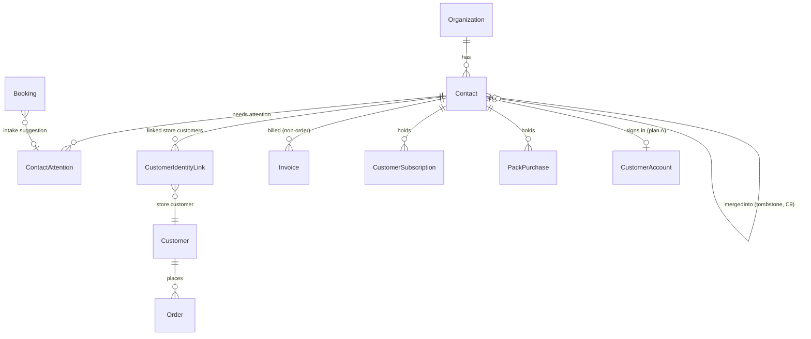
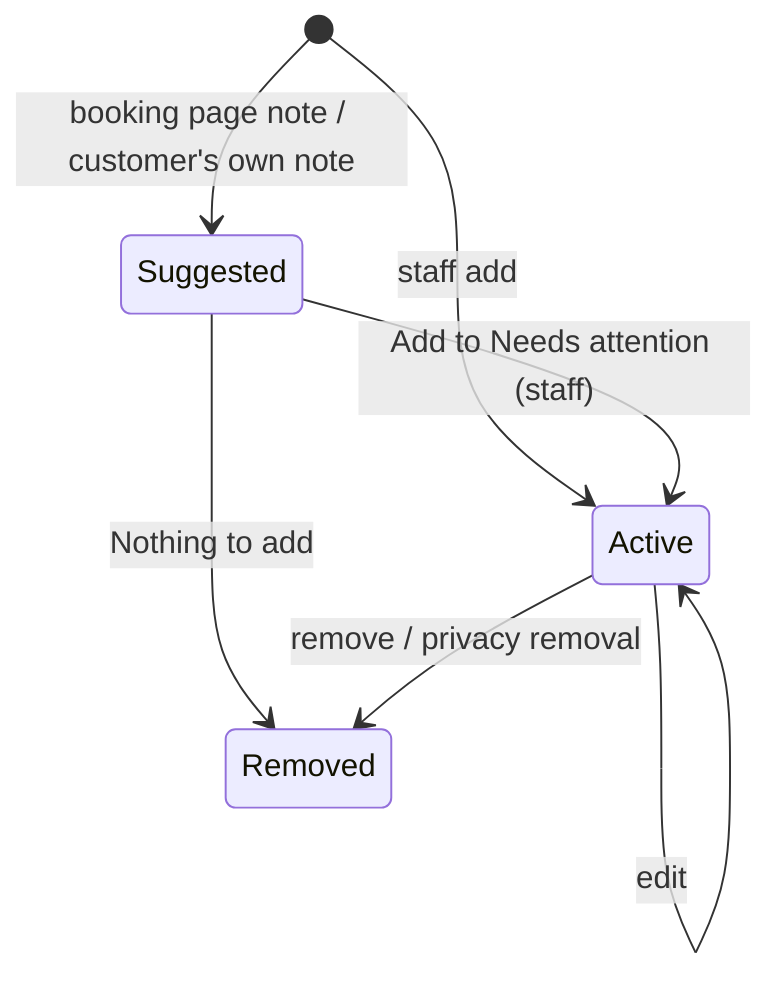
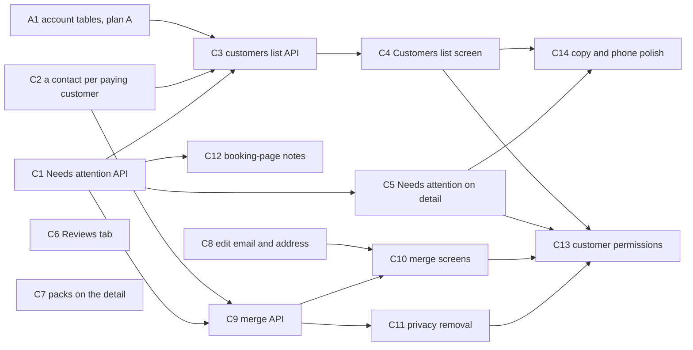

# Customers

## Summary

Make Customers one list for the whole business, keyed on the Contact and served by one organization-level API. It replaces the per-storefront list the app merges on the client today. Then:

- give every customer one **Needs attention** list (Allergy, Medical, Access, Other), with sensitive entries left out by the API for roles without the sensitive permission;
- close Customer Detail's gaps: header tags, a Reviews tab, packs, editing the email and the address, phone layout and copy;
- add **merge** and **privacy removal** (DEC-042).

Phase 1 is one finished flow: Needs attention (C1, C5), a contact for every paying customer (C2), and the business-wide list with its API (C3, C4). Everything else — the detail's new tabs, editing the email and address, merge, privacy removal, booking-page notes, the customer capabilities and the polish — is phase 2 (C6–C14). The customer capabilities follow the capability model (DEC-039, 2026-09-27).

Deepened 2026-09-27 against the review findings and the user's answers: a merge keeps the merged contact as a tombstone rather than deleting it; the merge handles message threads, waitlists and mandates and names the site account that will see the combined record; privacy removal reaches every place the person's details live; C2's link schema is spelled out; and the list names paying customers it can't show yet.

---

## Problem Frame

`/commerce/customers` (`components/stores/customers-screen.tsx`, `lib/customers/directory.ts`) fetches each storefront's `Customer` rows and merges them in the browser. So:

- there is no business-wide search, sort, filter or paging;
- "Spent" disagrees with Customer Detail;
- a row opens the old store page unless someone has linked the customer to a contact by hand (#120).

Customer Detail (#503) is rooted on the Contact and mostly matches the design. It lacks:

- Needs attention in the header, a Reviews tab and packs;
- an edit sheet that can change the email or hold an address;
- merge and privacy removal. It offers link and a hard delete instead.

Allergies are structured note allergens (`ContactNoteAllergen`). A clinic cannot record a medical or access note that the kitchen, front desk or dentist see as appropriate. The user decided (2026-09-26):

- CRM stays as it is;
- Customers is everyone who pays or signs in on the business's site (DEC-041);
- duplicates are merged and details can be removed (DEC-042);
- Needs attention is one shared field (DEC-040).

---

## Requirements

- R1. One Customers list for the business, keyed on the Contact: everyone who has paid (an order, an invoice, a subscription or a pack) or signed in on the business's site (DEC-041). Leads, Pipeline and Contacts are unchanged.
- R2. Every paying store customer has a linked Contact: made at backfill and whenever they next pay. The link records why it was made (by staff, the backfill, a payment or a site sign-in) and, only for staff, who made it. A contact with exactly the same normalised email or phone is offered as a merge, never merged (DEC-041).
- R3. The list offers:
  - search by name, phone or email (all part of the person, `contact:read`);
  - filter chips with counts: All · Returning · Subscribers · Open order · Said yes to offers · Needs attention;
  - sort by Last order, Spent or Name;
  - a "Bought at …" storefront select, shown only with more than one storefront;
  - pages of 50 with Previous and Next;
  - a locked state for roles without access;
  - a notice naming paying store customers the list can't show yet, because they share an email with a contact and wait for the merchant to link them ("12 paying customers aren't linked to a contact yet · Review"). The list never quietly shows fewer customers than today's.
- R4. "Spent" counts each rupee once. It is paid orders (delivery included) plus paid non-order invoices, net of refunds and credit notes; "Customer since" is the first payment (default 20). The list and Customer Detail read the same rule.
- R5. Each part of a customer screen follows its own read (DEC-039, matrix §1): the person with `contact:read`, phone and email included; their orders with `order:read`, whole; "Spent", which sums orders and invoices, with both `order:read` and `invoice:read`. Nothing inside a part is hidden from someone who holds its read.
- R6. **Needs attention** (DEC-040). Each customer has one list of entries. An entry has:
  - a kind (Allergy, Medical, Access or Other), a label and optional detail;
  - a sensitive flag, on by default for Medical;
  - a source (staff, booking page or customer), plus who added it and when.

  Allergy entries carry a structured allergen. Sensitive entries go only to someone holding the sensitive capability (`customer:sensitive`, matrix Q2). Until C13 that means `contact:write`, Owner and Admin by default.
- R7. Existing note allergens become Allergy entries, and Order Detail's allergy banner still matches exactly.
- R8. Customer Detail shows Needs attention tags in the header, and entries can be added, edited and removed there. The list shows the red Allergy and Medical tags (Medical only with the sensitive permission).
- R9. Customer Detail gains a Reviews tab (reply and hide through the existing endpoints) and the person's class packs (a card on Overview and a tab). The Courses tab and card wait for Courses (DEC-044, default 27).
- R10. The edit sheet can change the email, unique per business, and edit a postal address (line 1, line 2, city, state, PIN, country). An email already held by another contact offers the merge.
- R11. **Merge** (DEC-042).
  - The merchant merges two customers and picks the survivor; the older one is offered (default 22).
  - The survivor keeps every order, note, booking, subscription, pack, invoice, message and message thread, consent, lead, form entry, Needs attention entry, waitlist place, autopay mandate and site account of the other, by the rules in C9.
  - The merchant picks the survivor's name, email and phone, as in the design. Company and address are the survivor's, filled from the other where the survivor has none.
  - The preview names the site account, if any, that will see the combined record, and Merge waits for the merchant to confirm it.
  - The merged contact is kept as a tombstone pointing at the survivor, never deleted, so late payments, jobs and sign-ins still land on the right person.
  - Orders and invoices keep the contact details they were placed with.
  - A merge is recorded on both timelines and in Activity.
  - It is refused while both hold a live subscription to the same plan (default 23).
- R12. **Privacy removal** (DEC-042).
  - It anonymises the person: name, phone, email, address, notes, Needs attention, messages and site account go (DEC-042).
  - It reaches every other place their details live: the storefront customer records linked to them and those links, the delivery recipient on their orders, message recipients, waitlist places, autopay mandates and their reviews' names. C11 lists each.
  - Issued invoices stay, with what was printed on them. Orders keep their lines, amounts and GST place of supply.
  - Leads and form entries are CRM records and are left as they are (DEC-041; the option to delete them is dropped, 2026-09-27).
  - Privacy requests reach staff by message or in person; there is no customer-side "Remove my details" (2026-09-27).
  - It is refused while an order is open or a subscription is live (default 25).
  - Future bookings are cancelled; past ones keep their time and service under "Removed customer" (default 26).
  - Hard delete stays only for a contact with no orders or invoices (#384).
- R13. A booking page's "Anything we should know?" note arrives on Customer Detail as a suggestion ("1 note from the booking page") with "Add to Needs attention" and "Nothing to add". It never goes straight onto the record (DEC-040).
- R14. Tabs scroll sideways on phones (default 28), and copy matches the design.
- R15. The customer capabilities of the capability model replace the stand-ins: `contact:read` and `contact:write` relabelled "See customers and contacts" and "Edit customers and contacts", plus `customer:merge`, `customer:remove` and `customer:sensitive` (the last as the user answers matrix Q2). `customer:merge` and `customer:remove` arrive with the powers they guard (C9, C11), so no saved role ever holds merge through `contact:write` and then loses it. There is no `customer:read`, `customer:write` or `customer:contact` key.

---

## Scope Boundaries

- Leads, Pipeline and Contacts (the CRM screens) are unchanged (DEC-041).
- Saroh never merges on its own. It suggests; the merchant merges.
- Linking a store customer to a known contact (#120) stays. Merging is contact to contact.
- The customer's own view of Needs attention and their health notes (plan A, A5) is not built here. Here: the API that A5 writes to (source `CUSTOMER`, arriving as a suggestion, default 12).
- Order and booking surfaces showing Needs attention are built in B15 and E4; this epic provides their read helper.
- Merging or removing a site account's sessions follows ADR-011 and uses A1's tables. A1 is phase 1 and C9 and C11 are phase 2, so the tables exist when they land.
- How a first sign-in links to a contact is plan A's (A4, the user's decision of 2026-09-27: only to a contact whose email is verified; otherwise a separate contact). This plan only reads the result: C2's duplicate pairs include that separate contact, and C9 merges it.
- A customer-side "Remove my details" is not built (dropped 2026-09-27). Privacy requests reach staff by message or in person, and staff use C11.
- Privacy removal leaves leads and form entries alone (dropped 2026-09-27): they are the CRM's records, which stay as they are (DEC-041).

### Deferred to Follow-Up Work

- The Courses tab and card on Customer Detail (DEC-044).
- The #247 action rail (overview "Later").
- Undoing a merge. A merge is final, and the preview says so; a mistaken merge is fixed by hand. (The tombstone keeps only ids, never the discarded values, so it is not an undo.)
- A stored "Dismiss" for a duplicate pair (`ContactDuplicateDismissal`, default 92). Deferred on 2026-09-27 as cheap to leave out: the suggestion is a quiet line on Customer Detail, not a Home task. If merchants ask to hide pairs, the table and one endpoint are added then.
- Merge field choices beyond name, email and phone (company, address): the design picks only those three.
- Export of a person's data (a subject access request): not designed.
- Needs attention warnings when an order line contains a noted allergen are B13's allergy clash, which reads C1.

---

## Context & Research

### Relevant Code and Patterns

- **Schema** (`packages/database/prisma/schema.prisma`):
  - `Contact` has a required `email`, `@@unique([organizationId, email])`, and no address.
  - `Customer` is the storefront's customer: `storeId`, a nullable `organizationId`, and `@@unique([storeId, email])`.
  - `CustomerIdentityLink`: `@@unique([contactId, customerId])`, and `linkedByUserId String`, **required**, with no reason column (checked 2026-09-27). The only writer today is `customer-workspace.service.ts` (`linkedByUserId: ctx.userId`). C2 changes both.
  - `Order` holds the delivery recipient as its own columns (`deliveryName`, `deliveryPhone`, `deliveryLine1`, `deliveryLine2`, `deliveryCity`, `deliveryState`, `deliveryPostalCode`) and a free-text `notes`. `deliveryState` is also the GST place of supply when no bill-to state is set.
  - `Invoice` keeps a bill-to snapshot (`billToName`, `billToEmail`, `billToGstin`, `billToState`, `billToAddress`), copied on issue.
  - `Message` holds `toAddress` and `body`; its `Delivery` rows hold the provider's status and `error`. `ReviewInvitation.toAddress` is the address a review link went to, and `ProductReview` carries a `displayName` and `body`.
  - `Booking` keeps `bookerName`, `bookerEmail` and `bookerPhone` as a snapshot.
  - `Consent` is one row per contact and channel (`EMAIL`, `WHATSAPP`), `GRANTED` or `REVOKED`, and does not record the address it was given for.
  - `ContactNote` and `ContactNoteAllergen`, which points at the business's allergen list after round 1.
  - `ProductReview` hangs off `customerId` (store customer), not the Contact.
- **Every relation on `Contact`**, which the merge must re-point (C9) and privacy removal must rule on (C11). The first eleven rows are today's schema (checked 2026-09-27); the rest come with this round's units:

  | Model | Field | On delete | Merge rule | Privacy removal rule |
  |---|---|---|---|---|
  | `Lead` | `contactId` | Cascade | re-point | left as is (CRM) |
  | `Submission` | `contactId?` | SetNull | re-point | left as is (CRM) |
  | `Booking` | `contactId?` | SetNull | re-point | future: cancelled; all: booker snapshot and intake note blanked |
  | `Message` | `contactId?` | SetNull | re-point | body and `toAddress` replaced; its `Delivery` rows keep status, `error` cleared |
  | `Consent` | `contactId` | Cascade | `@@unique([contactId, channel])`: the consent rule in C9 | deleted |
  | `CustomerIdentityLink` | `contactId` | Cascade | `@@unique([contactId, customerId])`: re-point, drop duplicates | deleted, and the store `Customer` anonymised (C11) |
  | `CustomerSubscription` | `contactId` | Cascade | `CustomerSubscription_one_live_per_person`: refuse (default 23) | refused while live (default 25); ended ones kept, no personal values |
  | `Invoice` | `contactId?` | SetNull | re-point (bill-to snapshot unchanged) | kept with its bill-to (the law needs the paper) |
  | `PackPurchase` | `contactId` | Cascade | re-point | kept, no personal values |
  | `CourseEnrollment` | `contactId` | Cascade | `CourseEnrollment_one_active_per_person`: refuse | kept, no personal values |
  | `ContactNote` | `contactId` | Cascade | re-point, both kept (default 24) | deleted |
  | `Contact.mergedInto` (new, C9) | `mergedIntoId?` | Cascade | tombstones already pointing at the merged contact re-point to the survivor | kept (ids only) |
  | `ContactAttention` (new, C1) | `contactId` | Cascade | re-point, collapse duplicates (default 24) | deleted |
  | `CustomerAccount` (plan A, A1) | `contactId` | — | ADR-011 "Merging and removing", as in C9 | deleted with sessions and pending codes |
  | `CustomerThread` (plan A, A13) | `contactId`, one per contact | — | the survivor's thread absorbs the other's messages | deleted with its messages |
  | `ClassWaitlistEntry` (plan A, A12) | `contactId`, one per contact and class | — | same class: keep the better place | deleted; an offered place passes on |
  | `PaymentMandate` (plan D, D11) | `contactId` | — | re-point with its subscription | cancelled at the provider, then detached |

  A spec (C9) reads the Prisma DMMF and fails when a relation to `Contact` exists that `merge-plan.ts` or `privacy-removal-plan.ts` doesn't handle. C11 adds a second spec over personal fields that don't hang off `Contact` (store `Customer`, order delivery, message and review addresses). A new table cannot be forgotten: whichever of C9, C11, A12, A13 or D11 lands last adds its rows' rules, and CI fails until it does.

- **API**:
  - `apps/api.saroh.in/src/modules/customer-workspace/`:
    - `customer-workspace.controller.ts` (`organizations/:org/customers`: `:contactId/detail`, notes, `links/by-customer/:customerId`, timeline, suggestions, links);
    - `customer-detail.service.ts`: the detail aggregate, with the "Spent counts each rupee once" rule and money gating by `invoice:read` / `payment:read`;
    - `contact-notes.service.ts`: notes and allergens;
    - `customer-workspace.service.ts`: links, timeline, suggestions.
  - `apps/api.saroh.in/src/modules/contacts/contacts.service.ts`: `list`, `get`, `create`, `update` and `remove`, with `contact:read` / `contact:write`. `remove` is the hard delete.
  - `apps/api.saroh.in/src/modules/customers/customers.service.ts`: the store customers' CRUD. `remove` refuses a customer who has ordered.
  - Money rules to reuse: `apps/api.saroh.in/src/modules/invoices/invoice-state.ts` (`OWED_WHERE`, the order-invoice exclusion) and `docs/patterns/backend-billing-and-classes.md` "Count each rupee once".
  - Where a payment makes an order's invoice (the hook for R2): `apps/api.saroh.in/src/modules/invoices/order-invoicing.ts` (`ensureOrderInvoice`).
  - Reviews: `apps/api.saroh.in/src/modules/product-reviews/product-reviews.controller.ts`: list, `PATCH :reviewId/reply`, `POST :reviewId/hide`, `POST :reviewId/unhide`.
  - Class packs: `apps/api.saroh.in/src/modules/class-packs/class-packs.controller.ts` (`purchases?contactId=` style reads).
  - Permissions: `modules/organizations/{organization-actions,organization-policy,capability-catalogue}.ts`. `withImplied` is the pattern for an umbrella action.
- **App** (`apps/app.saroh.in`):
  - the list: `components/stores/customers-screen.tsx`, `lib/customers/{directory,service,actions,links}.ts`, and the routes `app/(shell)/commerce/customers/{page,[customerId],new,import}`;
  - the detail: `app/(shell)/customers/[contactId]/{page,loading,error,not-found}.tsx` and `components/customers/detail/{detail-screen,header,overview,orders-tab,bookings-tab,billing-tabs,notes,notices,edit-sheet,parts}.tsx`. The edit sheet shows the email and does not edit it;
  - link and delete: `components/customers/identity-link-dialog.tsx`, `components/customers/delete-customer-menu.tsx`;
  - `lib/customer-workspace/{view,detail,service,actions}.ts` and `lib/contacts/{removal,panels,holdings}.ts`.
- **Tests**:
  - unit tests go in the explicit `testMatch` of `apps/api.saroh.in/jest.config.js`;
  - DB specs (`*.db.spec.ts`, e.g. `customer-detail.db.spec.ts`) run under `jest.integration.config.js`;
  - app `vitest` on `lib/**` (`lib/customers/directory.test.ts`, `lib/customer-workspace/view.test.ts`);
  - e2e `e2e/tests/customer-detail.spec.ts`, and the permission matrix `e2e/permissions/permissions.spec.ts`.
- **Backfills**: `packages/database/src/backfill/` (`merge-same-products.ts` with `.cli.ts` and tests is the nearest shape: idempotent, per organization, with a report).

### Institutional Learnings

- Cross-tenant ids are 404 (`backend-auth-and-access.md`). Merge takes both ids from the path and checks both under the organization.
- A new organization-owned table carries a required `organizationId` and `ENABLE`/`FORCE ROW LEVEL SECURITY` with `org_isolation`. The integration suite uses `db push`, so `db:verify:replay` is the migration check.
- Row locks, not isolation levels (DEV_LEARNINGS "RLS quietly dropped Serializable"). The merge locks both contacts by id order.
- Demo stores are film sets: browser writes only on Northwind (memory: never save on demo stores).
- DEC-035: Activity may not record a person's details by value. The merge's audit row records ids and counts, never the discarded email or phone.

### External References

- None. Local patterns cover every layer.

---

## Key Technical Decisions

- **`ContactAttention` is its own table**, not a JSON column on Contact. It has:
  - `organizationId`, `contactId`, `kind` (enum ALLERGY, MEDICAL, ACCESS, OTHER), `label` (≤ 60), `detail?` (≤ 500), `sensitive`;
  - `allergenId?` (required when kind is ALLERGY and the business has an allergen list);
  - `source` (STAFF, BOOKING_PAGE, CUSTOMER), `status` (SUGGESTED, ACTIVE), `bookingId?`;
  - `createdByUserId?`, `confirmedByUserId?`, timestamps and `removedAt`.

  Suggestions (R13, and a customer's own health notes, default 12) are the same row in `SUGGESTED`. So "Add to Needs attention" is a status change, and "Nothing to add" sets `removedAt`.
- **One read helper decides visibility:** `attentionFor(ctx, contactIds)` returns active entries. It leaves out sensitive entries unless `canSeeSensitive(ctx)`. It includes a `hiddenSensitiveCount` so a screen can say "1 more note you can't see" without its content. Orders (B15), bookings (E4), Home (F2) and the kitchen view all call it, and none filters on its own.
- **`canSeeSensitive(ctx)`** is `allows(ctx, "contact:write")` until C13, then `allows(ctx, "customer:sensitive")` (or, if the user answers matrix Q2 the other way, `contact:read`). It is one function, so the swap is one line plus the catalogue.
- **Allergy stays structured.** The backfill turns each `ContactNoteAllergen` into an Allergy entry, labelled with the allergen's name, not sensitive, with source STAFF. The note keeps its text. Order Detail's banner reads Allergy entries through `attentionFor`. During the transition `ContactNoteAllergen` rows are still written for one release, then dropped in a two-deploy change.
- **The list API is new and separate:** `GET organizations/:org/customers?q=&chip=&sort=&store=&page=`. It is keyed on Contact and computed in SQL: a CTE of paying contacts (orders via confirmed identity links, non-order invoices paid, subscriptions, pack purchases) union contacts with an active `CustomerAccount` (A1). Tombstones (`mergedIntoId` set) and removed contacts (`removedAt` set) are never rows. It returns:
  - `lastOrderAt`, `orderCount`, `spent[]` (per currency), `openOrder`, `subscriber`, `offersConsent` and `attentionTags`;
  - chip counts computed from the same CTE in one query;
  - `unlinkedPaying`: how many store customers have a paid order and no confirmed link (the ones C2 left for the merchant because a contact already holds their email). The screen names them so the new list never silently shows fewer customers than the old one.

  The raw SQL names `CustomerAccount`, so C3 depends on A1's migration. A1 is a schema-only phase-1 unit and lands first; if it slips, C3 ships with the paying branch only and the account branch is one added `UNION` when A1 lands. There is no runtime check for the table.

  Spent reuses the detail's rule. A shared SQL fragment and a spec assert that the list's and the detail's totals agree for the same person.
- **Search** matches the name, the phone and the email; anyone who can open the list holds `contact:read`, which covers all three (DEC-039). Phone matching is on digits only.
- **Paging is offset with 50 rows** and a stable tiebreak on id. The design pages by Previous and Next; businesses have hundreds, not millions.
- **The link records why it exists (C2's schema change).** `CustomerIdentityLink.linkedByUserId` becomes nullable, and a `reason` column is added: enum `CustomerLinkReason` = `MANUAL | BACKFILL | PAYMENT | SITE_ACCOUNT`, default `MANUAL`, so every existing row reads as a staff link without a backfill. A staff link keeps its user; `BACKFILL` and `PAYMENT` links have none; `SITE_ACCOUNT` is for plan A (A4, and G13's signed-in checkout), whose links are made by the customer's verified code, not a staff user. Rejected: a sentinel "system" user id, which would break the foreign-key-free `linkedByUserId` meaning "a person on the team" and show a fake name on the timeline. One migration, in C2.
- **"A contact for every paying customer" (C2)**:
  - A backfill script, idempotent, per organization: every store `Customer` with a paid order and no confirmed link gets a new Contact (their email, name and phone) and a link with `linkedByUserId = null` and reason `BACKFILL`.
  - A Contact with the same email already exists in the org (the unique email) → no second contact, and no link: linking silently is what #120 refused. The store customer stays unlinked until the merchant links or merges, and C3's `unlinkedPaying` count and C4's notice name them, so they are never lost from view.
  - After that, the same `ensureContactForPaidOrder(tx, order)` runs where an order's invoice is made (`ensureOrderInvoice`), so the next payment links them (reason `PAYMENT`).
- **Duplicate suggestions** are computed, not stored, by C2's `duplicates.ts`. Nothing writes a suggestion, so plan A's first sign-in (A4) writes nothing either: its separate contact shows up in suggestions on its own. Two contacts are a pair when:
  - their normalised emails are equal (only possible across a contact and a store customer, since the contact email is unique), or a contact's email equals another contact's **site account's verified email** (the separate contact A4 makes when the matching contact's email isn't verified, per the user's decision of 2026-09-27); or
  - their normalised phones are equal and **neither has a site account**. A phone typed in the customer's own Me (A5) is not proven by anything, so a phone-only pair with an account holder is never suggested; this keeps someone who types another person's phone from being offered as that person's duplicate (security review). Staff can still merge such a pair deliberately from the ⋯ menu, where C10's account confirmation applies.

  The existing `:contactId/suggestions` endpoint widens to include contacts as well as store customers. There is no stored "Dismiss" this round (deferred, above).
- **Merge is one serializable-free transaction with row locks**:
  1. Lock both Contact rows in id order (`SELECT … FOR UPDATE`).
  2. Check refusals: either is a tombstone (404 "already merged") or removed (409); the same live plan or the same active course. A site account on both is handled, not refused.
  3. Re-point every relation in the table above, by its merge rule.
  4. Turn the merged contact into a **tombstone**: `mergedIntoId` = the survivor, `mergedAt`, email set to a reserved placeholder (`merged+<contactId>@removed.invalid`), and name, phone, company and address cleared. Tombstones that already pointed at it re-point to the survivor, so a chain is never more than one hop.
  5. Give the survivor the chosen name, email and phone (freed by step 4, so the unique email holds), and fill its empty company and address from the merged contact.
  6. Write a timeline event on the survivor and an audit row (`customer.merged`: both ids and per-relation counts; no personal values, DEC-035).

  Store `Customer` rows are never merged. Their links move to the survivor.
- **Why a tombstone, not a delete.** Work that captured the merged contact's id outside the rows the merge moves can land after it: a checkout's success webhook that creates the order for the signed-in account's contact (G13), queued `customer.notify` and `waitlist.offer` jobs, a first sign-in's `linkOrCreate` waiting on the lock, a pay link for an invoice. With a delete, each would hit a foreign-key failure after money was taken or a code was spent. With a tombstone, the id stays valid and resolves to the survivor. Rejected: deleting and letting writers retry on a 404, because a webhook can't choose a different person.
  - **The rule for writers:** any write that takes a contact id from outside the request's own reads (a webhook, a job payload, a session's account, a token) calls `resolveContact(tx, contactId)` in its transaction. It takes `FOR SHARE` on the contact row and follows `mergedIntoId` one hop. `FOR SHARE` conflicts with the merge's `FOR UPDATE`, so the write either commits before the merge (and the merge moves its row) or after (and lands on the survivor). A removed contact resolves to itself with `removedAt`, and the writer refuses as it would today.
  - Reads: `GET :contactId/detail` for a tombstone answers `{ mergedInto: <id> }`, and the app's `/customers/[contactId]` redirects to the survivor. Lists and search leave tombstones out.
  - The tombstone holds ids only, never the discarded values (DEC-035), so it is not a way to undo.
- **The site account on a merge (ADR-011).** The survivor keeps its account. When the survivor has none, the other contact's account moves to it. Otherwise the other account is retired and its sessions revoked. Two accounts never end up on one contact.
  - **The retired account stays as a row**, on the tombstone, marked as retired by a merge (not deleted). Its email then still counts against the one-account-per-email rule, so the next sign-in with it can't make a new contact that recreates the duplicate just merged. Plan A's sign-in answers that email with "Sign in with ‹masked survivor email›" (cross-plan note to A1/A4).
  - **The preview names who will see the combined record.** Whenever a site account will see records it could not see before (the other contact's account moving to the survivor, or the survivor's account gaining the other's history), the preview says "‹masked email› signs in on your website and will see everything here", and Merge stays disabled until the merchant ticks "I've checked this email is theirs". If the merchant isn't sure, they can choose "Don't carry the sign-in over": the other account is retired as above instead of moving. This blocks the hand-over the security review found: someone who books with another person's phone and their own email, gets suggested as that person's duplicate, and is merged into their history.
  - When both contacts have accounts, the preview names the email that will stop reaching this record ("‹masked› will be asked to sign in with ‹masked› instead").
- **Consent on a merge.** Per channel, the more recent answer wins (default 24), with two guards, because a consent row doesn't record the address it was given for:
  - a `REVOKED` answer is never replaced by an older `GRANTED`, and an opt-out is never turned into an opt-in by a merge;
  - a `GRANTED` answer survives only when the survivor keeps the address it came with (EMAIL: the chosen email was that contact's; WHATSAPP: the chosen phone was). Otherwise it is dropped, and the channel reads "not asked" until the person says yes again.

  The preview shows the result per channel ("Offers by email: No — from Asha Rao's record").
- **Threads, waitlists and mandates on a merge.**
  - `CustomerThread` (one per contact, A13): when both have one, the other's messages move into the survivor's thread in time order, keeping their timestamps, authors and read state, and the other thread row is deleted. When only the other has one, it re-points.
  - `ClassWaitlistEntry` (one per contact and class, A12): for the same class, the better place is kept (an `OFFERED` entry wins, then the earlier position) and the other is deleted. When both are `OFFERED`, the other's hold is released and the place passes on through `waitlist.offer`. Different classes re-point.
  - `PaymentMandate` (D11): re-points to the survivor with its subscription. No provider call is made: the mandate still pays only its own subscription's renewals (D11).
- **Orders and invoices keep what they were placed with.** An order's customer and delivery fields and an invoice's bill-to snapshot are not touched by a merge or a removal.
- **Privacy removal anonymises in place, everywhere the person's details live.** The contact row stays, so foreign keys hold. It runs under the contact's row lock (so it serialises with a merge and with `resolveContact` writers). It is refused while an order is open or a subscription is live (default 25). It then:
  - **the contact:** name to null with a `removedAt` stamp, and email to a reserved non-deliverable placeholder unique per contact (`removed+<contactId>@removed.invalid`, since `email` is required and unique per org). Phone, company and address are cleared. Every reader treats a reserved placeholder as no email, through one helper (`isReservedEmail`);
  - **what hangs off the contact:** notes, Needs attention and consents deleted; the site account deleted with its sessions and pending codes (ADR-011); the message thread and its messages deleted (A13);
  - **storefront customer records:** each store `Customer` linked to the contact has its email set to `removed+<customerId>@removed.invalid` (unique per store) and its names, phone and address cleared, and the link is deleted. Its orders stay attached to it and read "Removed customer". A store customer also linked to another contact that isn't being removed keeps its details; only this contact's link goes. Anonymising the store record is what stops C2 or a signed-in checkout (G13) finding and re-linking the person by email;
  - **orders:** lines, amounts, status, `deliveryState` (the GST place of supply) and the invoice are kept. The delivery recipient (`deliveryName`, `deliveryPhone`, `deliveryLine1`, `deliveryLine2`, `deliveryCity`, `deliveryPostalCode`) and the order's free-text `notes` are cleared. Every order is closed, since an open one refuses the removal;
  - **invoices:** issued invoices keep their bill-to as printed; the law needs the paper (DEC-042, DEC-035's reasoning);
  - **messages sent to them:** each `Message` to the contact has its body replaced by "Removed" and `toAddress` by the placeholder; its `Delivery` rows keep their status and lose `error` (a provider error can quote the address). `ReviewInvitation.toAddress` for their orders gets the placeholder;
  - **bookings:** future bookings cancelled through the booking service's cancel, which returns pack credits (default 26); every booking's `bookerName` becomes "Removed customer", `bookerEmail` and `bookerPhone` and the intake note are cleared;
  - **waitlist places** (A12): deleted; an `OFFERED` place is released and passes to the next person;
  - **autopay mandates** (D11): each mandate not already cancelled is cancelled at the provider through `mandates.service.cancel`, with DEC-026's unsure-answer rule. An unsure or failed answer refuses the removal ("Autopay couldn't be cancelled at Razorpay yet. Try again in a few minutes"); a standing authority to debit must never outlive the person's record. Then the mandate is detached: its display hint (a masked UPI handle or last four digits) is cleared, and the provider's ids stay, so a late webhook still reconciles;
  - **reviews they wrote:** hidden, with `displayName` set to "A customer" and the body cleared; the stars keep counting in the product's rating;
  - **leads and form entries are left as they are** (2026-09-27): they are CRM records (DEC-041);
  - writes an audit row `customer.removed` with ids and counts, no values.

  Rejected: deleting the store `Customer` rows, which would take the orders with them (orders need a customer), and keeping the identity links, which would let the removed contact still own orders a later reader could tie back to a name.
- **Hard delete stays** (`contacts.service.ts remove`) for a contact with no orders or invoices, as #384 has it. The ⋯ menu offers "Remove their details (privacy request)…" otherwise, with a line saying why Delete isn't offered.
- **The address lives on Contact** (`addressLine1`, `addressLine2`, `city`, `state`, `postalCode`, `country`). It is not copied into orders already placed. New order v2 (B13) may prefill from it.
- **The email change** goes through `contacts.service.ts update`, now accepting `email`. A clash with another contact returns 409 with that contact's id when the caller may read it, so the sheet offers "Merge with ‹name›"; otherwise the 409 is a plain sentence.
- **Staff edits never change how someone signs in.** On a contact with a site account, a staff email edit changes the contact's email only; the account keeps its verified email, which is where sign-in codes and messages about their orders go (ADR-011). The sheet says so: "They sign in with a•••@gmail.com; messages about their orders go there." The other direction — a customer's own verified change in Me — is plan A's (A5), which updates both (cross-plan note).

### Permissions touched

| Action | Needs (until C13) | Needs (after C13, the capability model) |
|---|---|---|
| Read the Customers list and Customer Detail, phone and email included, and search by them | `contact:read` (Owner, Admin, Member) | `contact:read`, relabelled "See customers and contacts" |
| See the orders tab and order totals | `order:read` | unchanged |
| See "Spent" | `order:read` and `invoice:read` | unchanged |
| See sensitive Needs attention | `contact:write` (Owner, Admin) | `customer:sensitive` (matrix Q2) |
| Add, edit or remove Needs attention; confirm a suggestion; edit email and address | `contact:write` | `contact:write`, relabelled "Edit customers and contacts" |
| Merge | `customer:merge` from the start (added by C9; Owner, Admin) | unchanged |
| Privacy removal | `customer:remove` from the start (added by C11; Owner, Admin) | unchanged |
| Reply to or hide a review from Customer Detail | `product-review:write` | unchanged |
| See packs on the detail | `pack:read` | unchanged |

---

## Open Questions

### Resolved During Planning

- The list replaces `/commerce/customers` only; `/contacts` stays (DEC-041).
- The list is keyed on the Contact, and a paying store customer gets a contact made and linked (DEC-041).
- Merge rather than link for two contacts (DEC-042). Link (#120) stays for a store customer.
- Anonymise for privacy; hard delete only with no orders or invoices (DEC-042).
- Add customer and Import stay (default 21).
- Needs attention is a general field (DEC-040).
- #247 is deferred.
- Spent includes subscriptions and delivery (default 20).
- (2026-09-27) A merge keeps the merged contact as a tombstone; it is never deleted.
- (2026-09-27) The merge's field choices are name, email and phone, as in the design (default 89 narrowed). Company and address fill in where the survivor has none.
- (2026-09-27) A dismissed duplicate pair isn't stored this round (default 92 deferred).
- (2026-09-27) Privacy removal leaves leads and form entries alone (default 94 dropped), and there is no customer-side "Remove my details" (default 11 dropped).
- (2026-09-27) `customer:merge` and `customer:remove` ship with C9 and C11, never behind `contact:write` first.
- (2026-09-27) C3's accounts branch needs A1's table; C3 depends on A1.
- (2026-09-27) "Merge with a duplicate…" from the ⋯ menu keeps a search for the other contact. The design starts from a suggested pair, but a pair no rule finds (a new email and a new phone) can only be merged this way, and C8's clash offer needs it.

### Deferred to Implementation

- Whether the list's CTE is fast enough on the showcase data with 5,000 customers (the design's scale tweak), or needs a materialised "last paid" column on Contact. Measure first.
- The exact index set for phone-digit search (a generated column or a trigram index).
- Whether `ContactNoteAllergen` drops in this epic or the next release (two deploys either way).
- Label suggestions for booking-page notes: the design suggests a short label from the text. Start with the first words and let staff edit; no model.

---

## High-Level Technical Design

> *Directional guidance for review, not implementation specification.*



A merge, and a late writer that captured the merged contact's id:

```mermaid
sequenceDiagram
    participant M as Merge (C9)
    participant DB as Contact rows
    participant W as Webhook / job / sign-in
    M->>DB: FOR UPDATE survivor, other (id order)
    W->>DB: resolveContact(other): FOR SHARE (waits)
    M->>DB: re-point relations; other = tombstone(mergedIntoId = survivor)
    M-->>DB: commit
    DB-->>W: lock granted; other.mergedIntoId = survivor
    W->>DB: write against survivor
```

A Needs attention entry:



---

## Implementation Units



**Phase 1 (re-sliced 2026-09-27, one finished flow): C1, C2, C3, C4, C5.** A merchant opens one business-wide Customers list, sees who needs attention, and opens a customer to add or read their Needs attention entries.

**Phase 2: C6, C7, C8, C9, C10, C11, C12, C13, C14.** C6, C7, C8 and C14 moved from phase 1 on 2026-09-27; they keep their IDs.

**Landing order in phase 1.** C1, C2 and C3 all add routes to `customer-workspace.controller.ts` (and plan A's A4 touches the same module), so they land in that order, C1 → C2 → C3, rather than in parallel. C4 and C5 are app-side and can run side by side once C3 and C1 are in. A1 (plan A) lands before C3.

### C1. Needs attention API and backfill

**Goal:** One Needs attention list per customer, with sensitive entries left out by the API. The allergen notes become Allergy entries.

**Requirements:** R6, R7

**Dependencies:** None

**Phase:** 1

**Files:**
- Modify: `packages/database/prisma/schema.prisma` (`ContactAttention`, enums `AttentionKind`, `AttentionSource`, `AttentionStatus`; `Contact.attention`)
- Create: `packages/database/prisma/migrations/<ts>_contact_attention/migration.sql` (table, RLS `org_isolation`, indexes on `(organizationId, contactId)` and `(organizationId, status)`)
- Create: `packages/database/src/backfill/contact-attention.ts`, `contact-attention.cli.ts`
- Create: `apps/api.saroh.in/src/modules/customer-workspace/contact-attention.service.ts`, `attention-read.ts` (`attentionFor`, `canSeeSensitive`)
- Modify: `apps/api.saroh.in/src/modules/customer-workspace/customer-workspace.controller.ts` (`GET/POST :contactId/attention`, `PATCH/DELETE :contactId/attention/:id`, `POST :contactId/attention/:id/confirm`), `dto.ts`, `customer-detail.service.ts` (attention in the aggregate), `contact-notes.service.ts` (writing an allergen note writes the Allergy entry too, for one release)
- Modify: `apps/api.saroh.in/jest.config.js` (`testMatch`)
- Test: `apps/api.saroh.in/src/modules/customer-workspace/contact-attention.service.spec.ts`, `attention-read.spec.ts`, `contact-attention.db.spec.ts`, `packages/database/src/backfill/contact-attention.test.ts`

**Approach:**
- Kinds are ALLERGY, MEDICAL, ACCESS and OTHER. MEDICAL defaults to sensitive, and staff may untick it.
- An Allergy entry needs an allergen from the business's list; when the business has none, it takes free text as the label.
- Writes need `contact:write`. A sensitive entry can be created or changed only by someone who can see sensitive entries.
- `attentionFor` returns the active entries the caller may see, plus `hiddenSensitiveCount`. The detail aggregate uses it.
- Backfill: one Allergy entry per `ContactNoteAllergen` (deduplicated per contact and allergen), source STAFF, status ACTIVE, created by the note's author. It is idempotent.

**Execution note:** Characterisation first. Pin Order Detail's allergy banner output for the seeded contacts before the read switches.

**Patterns to follow:** `contact-notes.service.ts` (allergen checks), `20260923150000_products_v2` (RLS), `packages/database/src/backfill/merge-same-products.ts`.

**Test scenarios:**
- Happy path: staff add Medical "Blood thinners"; it is sensitive by default. An Owner reads it; a Member gets `hiddenSensitiveCount: 1` and no content.
- Happy path: the backfill turns two allergen notes (Sesame, Peanut) into two Allergy entries; run twice, it changes nothing.
- Edge case: an Allergy entry naming another business's allergen → 404.
- Edge case: a Member (no `contact:write`) tries to add an entry → 403. An Admin edits a sensitive entry → OK.
- Error path: a contact in another organization → 404.
- Integration: Order Detail's banner for a backfilled contact is unchanged.

**Verification:** Customer Detail's aggregate carries attention. The banner matches what was pinned. The migration replays.

---

### C2. A contact for every paying customer, and duplicate suggestions

**Goal:** Every store customer who has paid has a linked Contact, now and after each payment. Likely duplicate contacts are suggested, never merged.

**Requirements:** R1, R2

**Dependencies:** None

**Phase:** 1

**Files:**
- Create: `packages/database/src/backfill/paying-customer-contacts.ts`, `paying-customer-contacts.cli.ts`, `paying-customer-contacts.test.ts`
- Create: `apps/api.saroh.in/src/modules/customer-workspace/ensure-contact.ts` (`ensureContactForPaidOrder(tx, order)`), `duplicates.ts` (normalise, pair)
- Modify: `apps/api.saroh.in/src/modules/invoices/order-invoicing.ts` (call it inside `ensureOrderInvoice`, after the order lock, keeping the lock order in `backend-billing-and-classes.md`)
- Modify: `packages/database/prisma/schema.prisma` + migration `<ts>_customer_link_reason` (`CustomerIdentityLink.linkedByUserId` nullable; enum `CustomerLinkReason` `MANUAL | BACKFILL | PAYMENT | SITE_ACCOUNT`; `CustomerIdentityLink.reason CustomerLinkReason @default(MANUAL)`). Existing rows become `MANUAL` with their user, with no data backfill.
- Modify: `apps/api.saroh.in/src/modules/customer-workspace/customer-workspace.service.ts` (the manual link writes `reason: MANUAL`; suggestions include contacts, by the pairing rules in Key Technical Decisions; the timeline says "Linked when they paid" or "Linked when the list was set up" for a link with no user), and the shared `normalizePhone` there moves into `duplicates.ts`
- Modify: `apps/api.saroh.in/jest.config.js` (`testMatch`)
- Test: `ensure-contact.db.spec.ts`, `duplicates.spec.ts`, `customer-workspace.service.spec.ts`

**Approach:**
- Normalise the email by lower-casing and trimming, and the phone by digits only, with a leading 91 dropped for Indian 10-digit numbers.
- A paid store customer with no confirmed link:
  - no contact with that email → create one and link it (`reason` `BACKFILL` or `PAYMENT`, `linkedByUserId` null);
  - a contact with that email → leave both and let the suggestion surface. The unique email makes a second contact impossible, and linking silently is what #120 refused. C3 counts them (`unlinkedPaying`) and C4 names them.
- A contact that is a tombstone or removed never matches: its email is a reserved placeholder.
- Run it as a pure step in the caller's transaction, so no extra lock is needed.
- `duplicates.ts` pairs contacts as Key Technical Decisions says: email against a store customer's email or another contact's site-account email; phone only when neither contact has a site account. C2 lands before A1's table is guaranteed, so the site-account branches (the account-email pair and the phone guard) are added in C3, which depends on A1; the email-to-store-customer and phone branches ship here.

**Patterns to follow:** `CustomerIdentityLink` creation in `customer-workspace.service.ts`; the backfill layout of `merge-same-products`.

**Test scenarios:**
- Happy path: a pay-later order is paid → its customer gets a contact and link in the same transaction as the invoice.
- Happy path: the backfill writes links with `linkedByUserId` null and `reason` BACKFILL; a staff link made after the migration has its user and `reason` MANUAL; a link made before it reads MANUAL.
- Edge case: a contact with the same email exists → no contact is made, no link, and the store customer appears in suggestions and in C3's `unlinkedPaying` count.
- Edge case: two contacts share a phone, not an email, and neither signs in → suggested.
- Edge case: two contacts share a phone and one has a site account → not suggested.
- Edge case: a paid store customer whose email matches a tombstone's old address → a new contact (the tombstone holds a placeholder).
- Edge case: an order that isn't paid → nothing happens.
- Integration: the backfill on the showcase seed; run twice, it changes nothing, and the report counts made, linked and suggested.

**Verification:** Every paid store customer in the seed resolves to a contact or a suggestion. The migration replays (`db:verify:replay`).

---

### C3. Organization customers list API

**Goal:** One server-side list of the business's customers, with search, chips and counts, sort, storefront filter and paging.

**Requirements:** R1, R3, R4, R5

**Dependencies:** C2 (links exist); C1 (attention tags); A1 (plan A: the `CustomerAccount` table the SQL names). If A1 slips, C3 ships with the paying branch only and the account branch follows as one `UNION` when A1 lands; no code checks whether the table exists.

**Phase:** 1

**Files:**
- Create: `apps/api.saroh.in/src/modules/customer-workspace/customers-list.service.ts`, `customers-list.sql.ts` (the CTE and the shared spent fragment), `customers-list.dto.ts`
- Modify: `apps/api.saroh.in/src/modules/customer-workspace/customer-workspace.controller.ts` (`GET organizations/:org/customers`, `GET organizations/:org/customers/unlinked`), `customer-detail.service.ts` (use the shared spent fragment), `duplicates.ts` (the site-account pairing branches)
- Modify: `apps/api.saroh.in/jest.config.js` (`testMatch`)
- Test: `customers-list.service.spec.ts`, `customers-list.db.spec.ts`, `duplicates.spec.ts`

**Approach:**
- Customers are paying contacts plus contacts with an active `CustomerAccount`. A separate contact that plan A made for a sign-in whose email didn't match a verified contact (the user's decision of 2026-09-27) is a customer too; its row shows the account's email with "Signs in on your website" and "Possible duplicate" when C2's pairing finds one.
- Tombstones and removed contacts are never rows.
- `unlinkedPaying` counts store customers with a paid order and no confirmed link, honouring the storefront filter. `GET customers/unlinked` pages them (50) with the contact that holds their email when the caller may read it, for C4's review sheet; linking goes through the existing `POST :contactId/links` (#120).
- Chips:
  - Returning: two or more paid orders or invoices;
  - Subscribers: a live subscription;
  - Open order: an order not fulfilled, cancelled or refunded;
  - Said yes to offers: a GRANTED marketing consent on any channel;
  - Needs attention: any active entry the caller can see.

  Counts ignore the active chip but honour the search and storefront.
- "Bought at": an order at that storefront.
- Sort: last order (nulls last), spent (per the business's one currency, DEC-030 amendment), or name.
- Order counts and last order come back with `order:read`, and `spent` with both `order:read` and `invoice:read` (matrix §1 rule 3). The phone and email come with the person.
- A removed contact (C11) is not listed and can't be found by its old values; its orders stay in Orders under "Removed customer".

**Execution note:** Test first on the spent agreement between list and detail.

**Patterns to follow:** `contacts.service.ts` (`lastOrderByContact`), `invoice-state.ts` `OWED_WHERE`.

**Test scenarios:**
- Happy path: page 1 of 120 customers returns 50, `total: 120`, and chip counts.
- Happy path: Spent for a person with an order, a paid subscription invoice and a refund equals Customer Detail's Spent.
- Edge case: a store customer's order and that order's invoice count once.
- Edge case: a Member (`contact:read`) searches "98450" and finds the person by phone.
- Edge case: a caller without both `order:read` and `invoice:read` (today's Member) gets no `spent` field, not zeros.
- Edge case: a paying store customer left unlinked by C2 (a contact holds their email) → not a row, counted in `unlinkedPaying`, and listed by `customers/unlinked` with that contact; linking them makes them a row with their orders.
- Edge case: a contact that signed in and never paid (A1 seeded) → a row with no Spent and "Signs in on your website".
- Edge case: a tombstone and a removed contact → neither is a row nor counted.
- Error path: `store` of another business → 404.
- Integration: 5,000 seeded customers, first page under the measured budget (recorded in the PR).

**Verification:** The API answers every control on Saroh Customers.dc.html.

---

### C4. Customers list screen (replaces /commerce/customers)

**Goal:** The business-wide list, as in Saroh Customers.dc.html, at `/commerce/customers`. Old per-storefront pages redirect.

**Requirements:** R1, R3, R5, R14

**Dependencies:** C3

**Phase:** 1

**Files:**
- Create: `apps/app.saroh.in/components/customers/list/{customers-list,filters,rows,states}.tsx`, `apps/app.saroh.in/lib/customers/list.ts` (URL state: q, chip, sort, store, page)
- Modify: `apps/app.saroh.in/app/(shell)/commerce/customers/page.tsx`, `commerce/customers/[customerId]/page.tsx` (redirect to the linked contact, else the store customer page as today), `app/(shell)/stores/[storeId]/customers/page.tsx` (redirect to the list with `store=`)
- Delete (after the switch): `apps/app.saroh.in/components/stores/customers-screen.tsx`, `lib/customers/directory.ts` and its test
- Test: `apps/app.saroh.in/lib/customers/list.test.ts`, `e2e/tests/customers-list.spec.ts`

**Approach:**
- Rows show Customer · Last order · Orders · Spent, the red Allergy and Medical tags and a phone line when allowed.
- A row opens `/customers/[contactId]`.
- Add customer and Import stay (default 21).
- States: loading, empty, no match ("No customers match these filters"), partial (a source that failed is named, never shown as zero), failed, and locked ("You can't see customers", with who can grant it).
- The empty state says who counts and where everyone else is: "Customers are people who've paid or signed in on your website. Everyone else is in Contacts", linking to Contacts with its count when above zero. A clinic that takes money at the desk without invoices would otherwise see "No customers yet" beside hundreds of patients (product review).
- **Unlinked paying customers.** When `unlinkedPaying > 0`, a notice above the rows: "12 paying customers aren't linked to a contact yet · Review". Review opens a sheet from `customers/unlinked`: each store customer with the contact that holds their email, and Link (the #120 link, confirmed by the merchant). The notice goes when the count reaches zero. This is how the new list shows no fewer paying customers than the old one.
- The phone layout: chips scroll, rows stack.
- A single-storefront business sees no "Bought at".

**Patterns to follow:** `DataView` / `PageContainer` in `@saroh/ui`; `.agents/skills/saroh-product-states/SKILL.md`; `saroh-four-scenes`.

**Test scenarios:**
- Happy path (e2e, Northwind): search a name, pick "Returning", sort by Spent, open a row → Customer Detail.
- Edge case: a caller without both `order:read` and `invoice:read` sees no Spent column.
- Edge case: `/stores/<id>/customers` lands on the list filtered to that storefront.
- Edge case: two unlinked paying customers → the notice reads "2 paying customers…"; linking both from the sheet removes it and both appear as rows.
- Edge case: a business with contacts and no paying customer → the empty state names Contacts and its count.
- Error path: the API fails → the failed state, with Try again.

**Verification:** Side by side with Saroh Customers.dc.html in the four scenes, on Rye (read-only) and Northwind. On the showcase seed, the old list's store customers are each a row, in the notice's count, or (for the same person) in one merged row.

---

### C5. Needs attention on Customer Detail and in the list

**Goal:** Header tags, and add/edit/remove of entries on Customer Detail, with the sensitive tick. The list tags come from the same read.

**Requirements:** R6, R8

**Dependencies:** C1

**Phase:** 1

**Files:**
- Create: `apps/app.saroh.in/components/customers/detail/attention.tsx` (tags, sheet), `apps/app.saroh.in/lib/customer-workspace/attention.ts`
- Modify: `components/customers/detail/{header,overview,detail-screen}.tsx`, `lib/customer-workspace/{view,actions,service}.ts`
- Test: `apps/app.saroh.in/lib/customer-workspace/attention.test.ts`, `e2e/tests/customer-detail.spec.ts`

**Approach:**
- Tags read "Allergy: Sesame", "Medical: Pregnant" and "Access: Anxious patient", with red for Allergy and Medical and words, never colour alone.
- "1 more note you can't see" shows when `hiddenSensitiveCount > 0`.
- The editor offers kind, label, detail and sensitive (on by default for Medical), and an allergen picker for Allergy.
- Remove has Undo.
- A caller without `contact:write` reads but doesn't edit.

**Test scenarios:**
- Happy path: add Access "Wheelchair" → the tag shows in the header and on the list.
- Edge case: a Member sees the Allergy tags, and "1 more note you can't see" in place of the Medical one.
- Error path: a save fails → the sheet keeps the values and names the failure.

**Verification:** Matches Saroh Customer Detail.dc.html's header and Needs attention card.

---

### C6. Reviews tab on Customer Detail

**Goal:** The person's product reviews with reply and hide, as designed.

**Requirements:** R9

**Dependencies:** None

**Phase:** 2 (moved from phase 1 on 2026-09-27)

**Files:**
- Modify: `apps/api.saroh.in/src/modules/product-reviews/product-reviews.service.ts` and controller (list filter `contactId`, resolved through confirmed identity links)
- Create: `apps/app.saroh.in/components/customers/detail/reviews-tab.tsx`
- Modify: `components/customers/detail/detail-screen.tsx`, `lib/customer-workspace/view.ts`, `apps/app.saroh.in/lib/product-reviews/service.ts`
- Test: `product-reviews.service.spec.ts` (contact filter), `apps/app.saroh.in/lib/customer-workspace/view.test.ts`

**Approach:** The list reads with `product-review:read`; reply and hide go through the existing endpoints with `product-review:write`. A tab count shows in the tab bar. It is empty with "No reviews from ‹name› yet".

**Test scenarios:**
- Happy path: a contact linked to two store customers shows the reviews of both.
- Edge case: a review from an unlinked store customer with the same email is not shown.
- Error path: a reply refused (a Member) → the controls are hidden, and the API refuses too.

**Verification:** Reply and hide from the tab reflect on the product's Reviews tab.

---

### C7. Class packs on Customer Detail

**Goal:** A packs card on Overview (classes left, expiry) and a Packs tab with purchases and redemptions. Sell a pack from here.

**Requirements:** R9

**Dependencies:** None

**Phase:** 2 (moved from phase 1 on 2026-09-27)

**Files:**
- Modify: `apps/api.saroh.in/src/modules/customer-workspace/customer-detail.service.ts` (packs in the aggregate, gated on `pack:read` and module availability, like the other panels)
- Create: `apps/app.saroh.in/components/customers/detail/packs-tab.tsx`
- Modify: `components/customers/detail/{overview,detail-screen}.tsx`, `lib/customer-workspace/view.ts`, `lib/contacts/panels.ts`
- Test: `customer-detail.service.spec.ts`, `lib/contacts/panels.test.ts`

**Approach:**
- The balance is derived, never stored (ADR-007), and uses `lib/class-packs/balance.ts`.
- "Sell a pack" opens the existing `sell-pack-dialog.tsx` with the person chosen.
- Pack prices and sales show with `pack:read`, which covers them (DEC-039). The Courses tab is deferred (default 27).

**Test scenarios:**
- Happy path: a person with a pack of 10, 3 used, sees "7 left · expires 12 Oct".
- Edge case: Appointments off → no card, no tab.
- Error path: the packs read fails → a notice in the card only.

**Verification:** Matches the design's pack card on Rye and Pulse.

---

### C8. Edit email and address

**Goal:** The edit sheet changes the email (unique per business) and edits a postal address.

**Requirements:** R10

**Dependencies:** None

**Phase:** 2 (moved from phase 1 on 2026-09-27)

**Files:**
- Modify: `packages/database/prisma/schema.prisma` + migration (`Contact.addressLine1`, `addressLine2`, `city`, `state`, `postalCode`, `country`, all nullable)
- Modify: `apps/api.saroh.in/src/modules/contacts/{contacts.service,dto}.ts` (update takes email and address; a clash → 409 with the other contact's id when readable)
- Modify: `apps/app.saroh.in/components/customers/detail/edit-sheet.tsx`, `lib/customer-workspace/actions.ts`
- Test: `contacts.service.spec.ts`, `apps/app.saroh.in/lib/customer-workspace/view.test.ts`

**Approach:**
- The email is normalised. The state uses the GST state list when the country is India (`invoices/gst-states.ts`), and an Indian PIN is 6 digits (as in DEC-029).
- A changed email doesn't touch orders, invoices or consent records.
- On a contact with a site account, the change leaves the account's verified email alone, and the sheet says "They sign in with ‹masked›; messages about their orders go there" (Key Technical Decisions).
- The sheet's clash message offers "Merge with ‹name›", which opens C10's dialog. C8 and C10 are both phase 2; if C8 lands first, the clash is a plain sentence until C10.

**Test scenarios:**
- Happy path: change the email and add an address → saved, and the timeline notes "Details changed".
- Edge case: the email held by another contact → 409; the sheet names them.
- Edge case: a contact with a site account → the contact's email changes, the account's doesn't, and the sheet shows the sign-in line.
- Edge case: an email that is a tombstone's or removed contact's placeholder domain is refused as invalid.
- Error path: a PIN "5600" with country India → refused with a sentence.

**Verification:** Northwind edit round-trip.

---

### C9. Merge — API

**Goal:** Merge two contacts into a chosen survivor, re-pointing every relation under locks, keeping the merged contact as a tombstone, with refusals named.

**Requirements:** R11, R15 (`customer:merge`)

**Dependencies:** C1, C2; A1 (the account table, phase 1). The rules for `CustomerThread` (A13), `ClassWaitlistEntry` (A12) and `PaymentMandate` (D11) are specified here; whichever of C9 and those units lands second implements the rule in `merge-plan.ts`, and the DMMF spec fails CI until it does.

**Phase:** 2

**Files:**
- Modify: `packages/database/prisma/schema.prisma` + migration `<ts>_contact_merge_tombstone` (`Contact.mergedIntoId String?` self-relation, `onDelete: Cascade`, `Contact.mergedAt DateTime?`, index `(organizationId, mergedIntoId)`)
- Create: `apps/api.saroh.in/src/modules/customer-workspace/merge.service.ts`, `merge-plan.ts` (pure: which relations move, by which rule, the consent outcome, the account outcome and the refusals), `merge.dto.ts`, `resolve-contact.ts` (`resolveContact(tx, contactId)`: `FOR SHARE`, one hop through `mergedIntoId`), `reserved-email.ts` (`isReservedEmail`, the placeholder builders shared with C11)
- Modify: `customer-workspace.controller.ts` (`GET :contactId/merge/:otherId/preview`, `POST :contactId/merge/:otherId`; `:contactId/detail` answers `{ mergedInto }` for a tombstone)
- Modify: `apps/api.saroh.in/src/modules/organizations/{organization-actions,organization-policy,capability-catalogue}.ts` (+ specs): add `customer:merge` (Owner, Admin; not implied by `contact:write`)
- Modify: the writers that take a contact id from outside the request, to call `resolveContact`: `invoices/order-invoicing.ts` and the payments webhook completion (`payments/*`), `bookings/{reservation,public-bookings.service,bookings.service}.ts` (`reservation.ts` writes `contactId`; `bookings.service.ts` queues `booking.notify` with one), and the `class-packs` and `subscriptions` services where they write by contact id. Plan A's `customer.notify` and `waitlist.offer` handlers and its sign-in `linkOrCreate` call it too (cross-plan note); `resolve-contact.ts` is the shared helper they import
- Modify: `apps/api.saroh.in/src/modules/audit/*` (the `customer.merged` event, ids and counts only)
- Modify: `apps/api.saroh.in/jest.config.js` (`testMatch`)
- Test: `merge-plan.spec.ts`, `merge.db.spec.ts`, `merge.relations.spec.ts` (reads the Prisma DMMF: every relation to `Contact` has a merge rule), `resolve-contact.db.spec.ts`

**Approach:**
- The preview returns per-relation counts, the field choices (both values of name, email and phone, as in the design), the consent outcome per channel, the account outcome (which account will see the combined record, and which email stops reaching it), and the refusals. Company and address aren't choices: the survivor's are kept and empty ones filled from the other.
- The merge takes the survivor id, the three field choices, the account choice (carry the sign-in over, or not) and the confirmation that the named account's email is theirs. It refuses (400) when an account would gain records and the confirmation is missing. It locks both contacts in id order, re-checks the refusals, and re-points each relation by the rule in the table under Context & Research:
  - `Consent`: the consent rule in Key Technical Decisions (the newer answer wins; an opt-out is never lost; a grant survives only with the address it came with);
  - `CustomerIdentityLink`: re-point, skipping duplicates;
  - `ContactAttention`: re-point, collapsing equal kind, label and allergen (default 24);
  - `ContactNote`: re-point, both kept (default 24);
  - `CustomerAccount` per ADR-011: the survivor keeps its account; when the survivor has none, the other account moves to it (unless the merchant chose not to carry it over); otherwise the other account is retired, its sessions revoked, and the row kept on the tombstone as retired by a merge;
  - `CustomerThread`: the survivor's thread absorbs the other's messages in time order, and the other thread row is deleted;
  - `ClassWaitlistEntry`: same class → keep the better place (`OFFERED`, then the earlier position), delete the other, release a second hold through `waitlist.offer`; otherwise re-point;
  - `PaymentMandate`: re-point with its subscription, no provider call;
  - tombstones pointing at the merged contact: re-point to the survivor.
- Then the merged contact becomes a tombstone (placeholder email, personal fields cleared, `mergedIntoId`, `mergedAt`) **before** the survivor takes the chosen email, so the unique email holds in one transaction.
- It writes a timeline event on the survivor ("Merged with a duplicate") and the audit row.
- `resolveContact` is the only way a late writer turns an outside contact id into a row to write against. A writer that finds a removed contact refuses as it would today.

**Execution note:** Test first, with `merge-plan.ts` pure.

**Patterns to follow:** `merge-same-products.move.ts` (re-pointing with a report), the lock notes in `backend-billing-and-classes.md`, DEV_LEARNINGS "RLS quietly dropped Serializable" (row locks, not isolation levels).

**Test scenarios:**
- Happy path: A (2 orders via links, 1 booking, notes) + B (1 subscription, 1 pack) → the survivor holds everything; B is a tombstone pointing at A with a placeholder email and no personal values; the counts match the preview.
- Happy path: the survivor takes B's email → saved, because B's email was replaced first.
- Edge case: both on the live plan "Monthly" → 409 "Cancel one of their Monthly subscriptions first" (default 23).
- Edge case: both enrolled in the same active course → 409.
- Edge case (consent): A revoked email offers last year and B granted them last week with B's email, and the survivor keeps B's email → granted. The survivor keeps A's email → revoked. A granted and B revoked later → revoked.
- Edge case (accounts): only B has an account → it moves to A, and the preview named it; without the confirmation → 400. With "don't carry the sign-in over" → B's account is retired and kept on the tombstone.
- Edge case (accounts): both have accounts → B's account is retired, its sessions revoked, and a sign-in with B's email can't make a new account (the row still holds the email).
- Edge case (threads): both have a thread with messages → one thread, messages in time order, read state kept.
- Edge case (waitlist): both wait for the same class, B holding an offer → B's offered entry survives on A; A's waiting entry is deleted. Both offered → one hold is released and offered on.
- Edge case (mandates): B's subscription has a mandate → both re-point to A; no provider call.
- Edge case: C was merged into B earlier → after B merges into A, C's tombstone points at A.
- Error path: B in another business → 404. Merging a contact into itself → 400. B is already a tombstone → 404 "already merged". A removed contact → 409.
- Integration: two merges on the same pair at once → one succeeds, the other 404s on the tombstone.
- Integration (late writer): a checkout success webhook carrying B's id arrives while the merge holds B's lock → it waits, resolves to A, and the order and invoice land on A; nothing fails after the money was taken.
- Integration (late writer): a `customer.notify` job with B's id runs after the merge → it reaches A.
- Integration: the DMMF spec fails when a new `contactId` relation appears without a merge rule.
- Integration: a caller with `contact:write` but not `customer:merge` → 403.

**Verification:** A merged showcase pair on Northwind reads correctly in Orders, Bookings, Billing and Customer Detail, and the old contact's URL redirects to the survivor.

---

### C10. Merge — screens

**Goal:** "Merge with a duplicate…" from the ⋯ menu and from a duplicate suggestion, with a preview of what moves and the field choices.

**Requirements:** R11

**Dependencies:** C9; C8 (the clash offer)

**Phase:** 2

**Files:**
- Create: `apps/app.saroh.in/components/customers/detail/merge-dialog.tsx`, `apps/app.saroh.in/lib/customer-workspace/merge.ts`
- Modify: `components/customers/detail/{header,notices,edit-sheet}.tsx`, `components/customers/identity-link-dialog.tsx` (offer merge for contact pairs), `lib/customer-workspace/actions.ts`, `app/(shell)/customers/[contactId]/page.tsx` (redirect a tombstone to its survivor)
- Test: `apps/app.saroh.in/lib/customer-workspace/merge.test.ts`, `e2e/tests/customer-merge.spec.ts`

**Approach:**
- The flow: from a suggested duplicate (the design's way in), or from ⋯ "Merge with a duplicate…", which searches for the other contact (kept for pairs no rule finds and for C8's clash offer).
- The preview shows who stays (the older one offered, default 22), a choice of name, email and phone row by row as in the design, what moves as counts, consent per channel, and the refusals.
- **The site account.** When an account will see records it couldn't see before, the preview says "‹masked email› signs in on your website and will see everything here", with a tick "I've checked this email is theirs" that Merge waits for, and the choice "Don't carry the sign-in over". When both have accounts, it says "‹masked› will be asked to sign in with ‹masked› instead". Emails are masked (first letter and domain) as elsewhere on account screens.
- The dialog states: "This can't be undone. Orders and invoices keep the details they were placed with."
- Confirming leads to a toast "Merged. All of ‹name›'s orders, bookings and notes are here now."
- Suggested duplicates show as a quiet notice on Customer Detail with Merge. There is no Dismiss this round (deferred).
- The ⋯ item shows only with `customer:merge`.

**Test scenarios:**
- Happy path (e2e, Northwind): merge a seeded duplicate, then land on the survivor with its combined counts.
- Edge case: a refusal shows the sentence and disables Merge.
- Edge case: the other contact signs in and the survivor doesn't → the account line shows, and Merge stays disabled until the tick.
- Edge case: a caller without `customer:merge` sees no ⋯ item and no Merge on the suggestion.
- Edge case: opening the merged contact's old URL → lands on the survivor.
- Error path: the merge fails midway → nothing changes (one transaction), and the dialog names the failure.

**Verification:** Matches the merge flow in Saroh Customer Detail.dc.html.

---

### C11. Privacy removal

**Goal:** "Remove their details (privacy request)…" anonymises the person everywhere their details live, and keeps issued invoices and the orders' tax facts.

**Requirements:** R12, R15 (`customer:remove`)

**Dependencies:** C9 (the relation table, the DMMF spec, `resolveContact` and the reserved-email helper); A1 for the account. The rules for `CustomerThread` (A13), `ClassWaitlistEntry` (A12) and `PaymentMandate` (D11) are specified here, and whichever lands second implements its rule in `privacy-removal-plan.ts`; the specs fail CI until it does. The mandate rule calls D11's `mandates.service.cancel`.

**Phase:** 2

**Files:**
- Create: `apps/api.saroh.in/src/modules/customer-workspace/privacy-removal.service.ts`, `privacy-removal-plan.ts` (pure: each relation's rule, and the refusals), `privacy-removal.dto.ts`, `personal-data.ts` (the registry of personal fields outside `Contact`: model, field and removal rule)
- Modify: `packages/database/prisma/schema.prisma` + migration (`Contact.removedAt`)
- Modify: `customer-workspace.controller.ts` (`GET :contactId/removal/preview`, `POST :contactId/removal`), `contacts.service.ts` and `customers-list.service.ts` (read `isReservedEmail` as no email; leave removed contacts out), `bookings/bookings.service.ts` (cancel future bookings through the existing path), `customers/customers.service.ts` (the store customer anonymiser), `product-reviews/product-reviews.service.ts` (hide and clear a review's name and body)
- Modify: `apps/api.saroh.in/src/modules/organizations/{organization-actions,organization-policy,capability-catalogue}.ts` (+ specs): add `customer:remove` (Owner, Admin; not implied by `contact:write`)
- Create: `apps/app.saroh.in/components/customers/detail/remove-details-dialog.tsx`
- Modify: `components/customers/delete-customer-menu.tsx`, `lib/contacts/removal.ts`
- Modify: `apps/api.saroh.in/jest.config.js` (`testMatch`)
- Test: `privacy-removal-plan.spec.ts`, `privacy-removal.db.spec.ts`, `personal-data.spec.ts` (reads the DMMF), `apps/app.saroh.in/lib/contacts/removal.test.ts`

**Approach:**
- The removal follows Key Technical Decisions, in one transaction under the contact's row lock, except the provider call:
  - refused with an open order or a live subscription (default 25), or while it is a tombstone (404);
  - **first, outside the transaction, cancels any mandate not already cancelled** at the provider (DEC-026's unsure-answer path). An unsure or failed answer stops here with the sentence, and nothing else changes; a retry is safe, since a cancelled mandate is skipped;
  - then, in the transaction: anonymises the contact; deletes notes, attention, consents, the site account with its sessions and codes, and the message thread; anonymises each linked store `Customer` not linked to another live contact, and deletes the links; clears the delivery recipient and notes on their orders, keeping `deliveryState`; replaces message bodies and recipients, clears `Delivery.error`, and puts the placeholder on their review invitations; cancels future bookings (returning pack credits, default 26) and blanks every booking's booker snapshot and intake note; deletes waitlist places and passes an offered one on; clears the mandate's display hint; hides their reviews and clears the name and body;
  - leaves leads and form entries as they are (2026-09-27), and says so in the preview;
  - writes the `customer.removed` audit with ids and counts, no values.
- **Two specs keep it complete.** `merge.relations.spec.ts` (C9) also checks that every relation to `Contact` has a removal rule. `personal-data.spec.ts` reads the DMMF and fails when a model reachable from `Contact` or `Customer` has a field that looks personal (`email`, `phone`, `*Name`, `*Address`, `address*`, `delivery*`, `booker*`, `toAddress`, `displayName`) and isn't in `personal-data.ts` with a rule or an explicit "kept, and why" (the invoice bill-to, `deliveryState`).
- The dialog lists what goes and what stays (leads and form entries stay, and the preview says so), and asks for "remove" to be typed.
- A removed contact reads "Removed customer · details removed on ‹date›" everywhere.

**Test scenarios:**
- Happy path: a person with a past order and a future booking → the booking is cancelled, the order keeps its lines, amounts and state but loses the recipient name, phone and street; its invoice prints as before; the contact is anonymised.
- Happy path: their linked store customer → email is a placeholder, names and phone gone, link deleted; a later paid order with their old email makes a new store customer and contact, not a link to this one.
- Edge case: an open order → 409 "Finish or cancel their open order first".
- Edge case: they had a site account → sessions revoked and the account deleted; sign-in with that email makes a new account and contact.
- Edge case: an active mandate on an ended subscription → cancelled at the provider, then the removal runs. The provider answers unsure → 409 with the sentence, and nothing is removed.
- Edge case: a waitlist place with an offer → deleted, and the next person is offered it.
- Edge case: a store customer linked to this contact and to another → keeps its details; only this link goes.
- Edge case: a message sent to them → body "Removed", recipient a placeholder, delivery status kept.
- Edge case: their leads and form entries → unchanged.
- Error path: another business's contact → 404. A caller with `contact:write` but not `customer:remove` → 403.
- Integration: the list and search no longer find them by name, email or phone, nor does Orders' search find the store customer.
- Integration: `personal-data.spec.ts` fails when a new personal field is added without a rule.

**Verification:** Northwind removal leaves Orders and Invoices printing as before (the invoice's bill-to unchanged), and no page shows the removed person's name, email or phone.

---

### C12. Booking-page notes into Needs attention

**Goal:** "Anything we should know?" from the booking page becomes a suggestion on Customer Detail; staff add it or dismiss it.

**Requirements:** R13

**Dependencies:** C1; E7 (the booking page stores the note)

**Phase:** 2

**Files:**
- Modify: `apps/api.saroh.in/src/modules/bookings/public-bookings.service.ts` (on a confirmed booking with an intake note, write a SUGGESTED `ContactAttention`, sensitive, source BOOKING_PAGE, with `bookingId`)
- Modify: `customer-workspace/contact-attention.service.ts` (confirm with kind, label and sensitive; dismiss)
- Create: `apps/app.saroh.in/components/customers/detail/attention-suggestions.tsx`
- Modify: `components/customers/detail/{overview,notices}.tsx`
- Test: `contact-attention.service.spec.ts`, `public-bookings.service.spec.ts`

**Approach:**
- A suggestion is sensitive until confirmed, whatever its text, so only the sensitive permission sees it, and Home (F2) counts it the same way.
- The confirm sheet suggests a label (the first words) and a kind (Medical by default, as in the design), with the sensitive tick on.
- A confirmed entry shows "from the booking page".

**Test scenarios:**
- Happy path: Rahul's note about amlodipine → "1 note from the booking page"; Add → Medical tag, sensitive.
- Edge case: a Member sees neither the suggestion nor its count.
- Edge case: "Nothing to add" → gone; the booking still holds its note for staff with the permission.

**Verification:** The Kavi Dental flow in Saroh Customer Detail.dc.html (patient notes).

---

### C13. Customer capabilities

**Goal:** Apply the capability model for customers (DEC-039; matrix §2 and §3).

**Requirements:** R15

**Dependencies:** C4, C5, C10, C11. Decided by the capability model, except whether sensitive notes are their own capability (matrix Q2), which changes one line in `canSeeSensitive` and whether one key is added.

**Phase:** 2

**Files:**
- Modify: `apps/api.saroh.in/src/modules/organizations/{organization-actions,organization-policy,capability-catalogue}.ts` (+ spec), `customer-workspace/attention-read.ts` (`canSeeSensitive`), `customers-list.service.ts`, `merge.service.ts`, `privacy-removal.service.ts`
- Modify: `apps/app.saroh.in/lib/customer-workspace/view.ts`, `components/organizations/roles-tab.tsx` (labels)
- Test: `organization-policy.spec.ts`, `capability-catalogue.spec.ts`, `e2e/permissions/permissions.spec.ts` (one row per customer endpoint)

**Approach:**
- Relabel `contact:read` and `contact:write` ("See customers and contacts", "Edit customers and contacts"); `contact:write` implies `contact:read`.
- `customer:merge` and `customer:remove` already exist: C9 and C11 add them with the powers they guard, held by Owner and Admin and not implied by `contact:write`. Merge and privacy removal were never gated on `contact:write`, so no saved role ever held them and none loses anything here (this resolves the review's point that a stand-in gate would be taken away). C13 gives them their labels and places them in the role editor's customer group. The hard delete of a contact with no orders or invoices stays with `contact:write` (DEC-042).
- Add `customer:sensitive` (Owner and Admin) and swap `canSeeSensitive` to it, as the user answers Q2; until then the stand-in stays.
- The Customers list and detail follow matrix §1 rule 3: each part on its own read, nothing hidden inside a part.

**Test scenarios:**
- Happy path: a "Practitioner" custom role with `customer:sensitive` and `contact:read` reads Medical entries and cannot edit them.
- Happy path: a role with `contact:read` sees phone and email and searches by them.
- Edge case: a custom role holding `contact:write` can edit and hard-delete, as it could before C13, and gets 403 on merge and privacy removal, as it did since C9 and C11.
- Edge case: a caller with `order:read` but not `invoice:read` sees the orders tab and no "Spent".
- Integration: the permission matrix e2e covers list, detail, attention, merge and removal.

**Verification:** The matrix page's customer rows are each backed by a policy test.

---

### C14. Copy and phone polish on Customers and Customer Detail

**Goal:** Tabs scroll sideways on phones, copy matches the design, and the ⋯ More actions button is added.

**Requirements:** R14

**Dependencies:** C4, C5

**Phase:** 2 (moved from phase 1 on 2026-09-27)

**Files:**
- Modify: `apps/app.saroh.in/components/customers/detail/{detail-screen,header,parts,overview}.tsx`, `components/customers/list/*`
- Test: `e2e/tests/customer-detail.spec.ts` (phone viewport)

**Approach:**
- Tabs become a single scrollable row with the active tab kept in view (default 28).
- Copy is taken from Saroh Customer Detail.dc.html and Saroh Customers.dc.html.
- The ⋯ menu holds Merge, Remove their details and Delete (with the reason when it is not offered).
- No capability is dropped (00-universal §15): everything in today's header keeps a place.

**Test scenarios:**
- Happy path: at 375px the tabs scroll and the active one is visible.
- Edge case: a long name wraps without pushing the tags off-screen.

**Verification:** Four scenes, side by side with the designs.

---

## System-Wide Impact

- **Interaction graph:**
  - order invoicing (`ensureOrderInvoice` gains the ensure-contact step);
  - public bookings (intake suggestions);
  - bookings (cancel on removal);
  - class packs (credits returned on cancel);
  - product reviews (contact filter);
  - the audit stream;
  - plan A's account tables, thread and waitlist, and plan D's mandates (merge and removal rules);
  - every writer that takes a contact id from a webhook, a job or a session (`resolveContact`);
  - the orders, bookings and Home surfaces that call `attentionFor` (B15, E4, F2).
- **Error propagation:** a failed source on the list or the detail is named in a notice, never shown as zero. Merge and removal refusals are sentences a merchant can act on.
- **State lifecycle risks:**
  - a merge racing a payment, webhook, job or sign-in for the merged contact: the writer's `resolveContact` waits on the merge's lock and then lands on the survivor through the tombstone; nothing fails after money was taken;
  - removal racing a booking: the removal's check runs under the contact lock, and booking creation takes the same lock (`resolveContact`) when it links a contact;
  - removal and a mandate: the provider cancel runs first and must succeed before anything is removed, so a debit authority never outlives the record.
- **API surface parity:** `stores/:storeId/customers` stays for store customer CRUD. The app stops reading it for the list.
- **Integration coverage:** the DMMF relation spec (merge and removal rules), the personal-data spec, backfills run twice, list ↔ detail spent agreement, the late-webhook merge test, the permissions e2e.
- **Unchanged invariants:**
  - leads, pipeline and contacts screens;
  - invoice bill-to snapshots and order customer fields;
  - "Count each rupee once";
  - a customer who has ordered cannot be hard-deleted (#384).

---

## Risks & Dependencies

| Risk | Mitigation |
|------|------------|
| A merge forgets a relation added later | The DMMF spec fails on any relation to `Contact` without a merge and a removal rule |
| A webhook or job writes to a merged contact after the merge | The tombstone keeps the id valid; `resolveContact` follows it under `FOR SHARE`; a late-webhook test |
| A merge hands one person's history to someone else's sign-in | The preview names the account that will see it; Merge waits for the merchant's confirmation; phone-only pairs with an account are never suggested |
| A merge recreates the duplicate it just removed | The retired account row keeps its email, so a sign-in with it is pointed at the survivor's email instead of making a contact |
| The new list shows fewer customers than the old one | `unlinkedPaying` and C4's notice with a review sheet |
| Privacy removal misses a place the person's details live | The personal-data registry and its DMMF spec; store customers, order recipients, message recipients, waitlists, mandates and reviews each have a rule |
| An autopay mandate outlives a removed customer | Removal cancels it at the provider first and stops on an unsure answer |
| The list's CTE is slow at scale | Measure on 5,000 seeded customers; a materialised last-paid column if needed |
| Sensitive notes leak through a new surface | One read helper (`attentionFor`); no surface filters on its own; the permissions e2e |
| An auto-made contact duplicates a CRM contact | Never auto-link on an existing email; suggest instead (C2) |
| Removal breaks tax records | Orders and invoices untouched; tested by printing an invoice after removal |
| The sensitive answer (matrix Q2) changes who reads medical notes | One function (`canSeeSensitive`); C13 swaps it |

---

## Documentation / Operational Notes

- Update `docs/patterns/saroh-product.md` "Selling, customers and identity" to Current as units land. Replace the "one customer record … is not true yet" line only when C2 and C3 ship, and say exactly what is now true.
- Update `docs/patterns/backend-auth-and-access.md` with `canSeeSensitive`, and later the `customer:*` actions.
- Add C1 and C2's backfill CLIs to the release notes. Run them after the migration, each idempotent.
- C2's link-reason migration adds a column with a default and relaxes a NOT NULL; it is safe to deploy before the code that writes it.
- Update `docs/patterns/backend-auth-and-access.md` (or `backend-data-and-money.md`) with the `resolveContact` rule: a write that takes a contact id from outside the request resolves it first.
- New unit specs go in the explicit `testMatch` of `apps/api.saroh.in/jest.config.js`.
- Browser writes on Northwind only; Rye, Pulse and Kavi Dental are read-only (film sets).

---

## Sources & References

- Designs: `Saroh Customers.dc.html`, `Saroh Customer Detail.dc.html`, `saroh-fixtures.js` (`customersList`, `customerStats`, `attentionOf`, `intakeFor`, `PRODUCT_PERMS`), `DESIGN-NOTES.md`
- Gap report: `gap-reports/customers.md`
- Decisions: DEC-040, DEC-041, DEC-042, DEC-039, ADR-011, ADR-008 (amended), DEC-035
- Overview and defaults: `docs/plans/2026-09-26-000-round-2-overview.md` (defaults 12, 20–28)
- Matrix: `docs/plans/2026-09-26-permission-matrix.md` (§1–§3, Q2)
- Related plans: 001 (A1 accounts, A5 health notes), 002 (B13, B15), 005 (E4, E7), 006 (F2)
