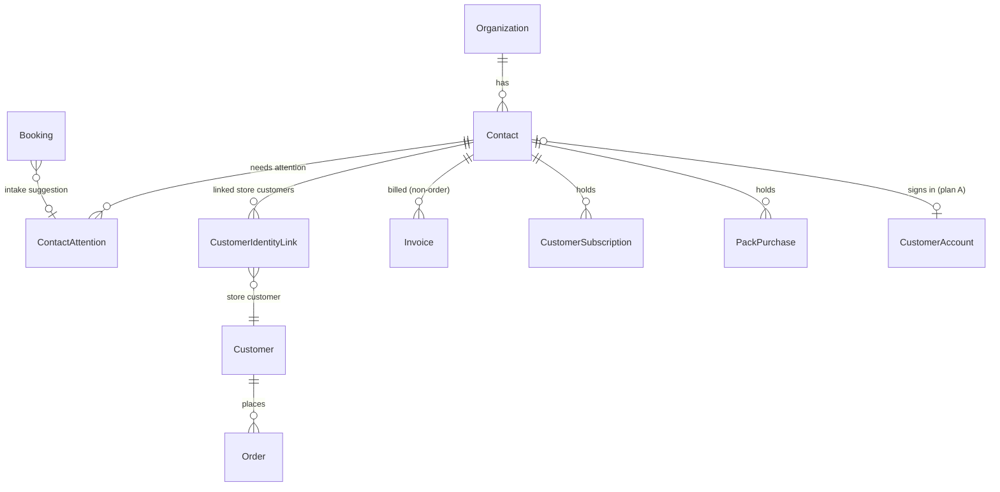
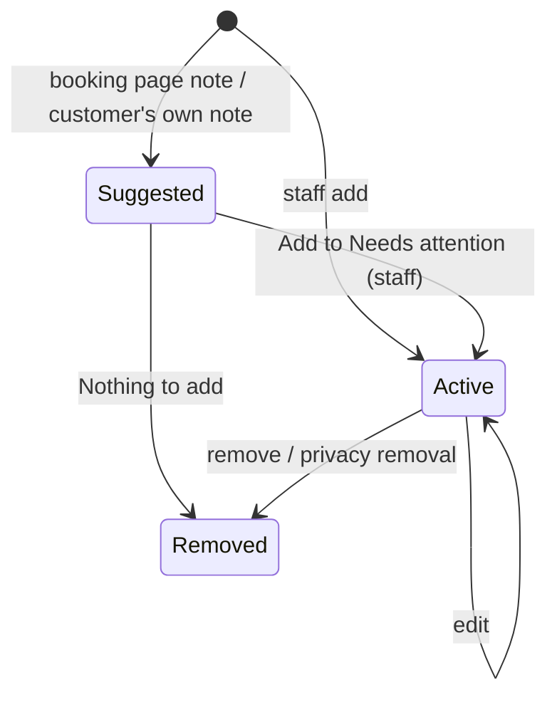
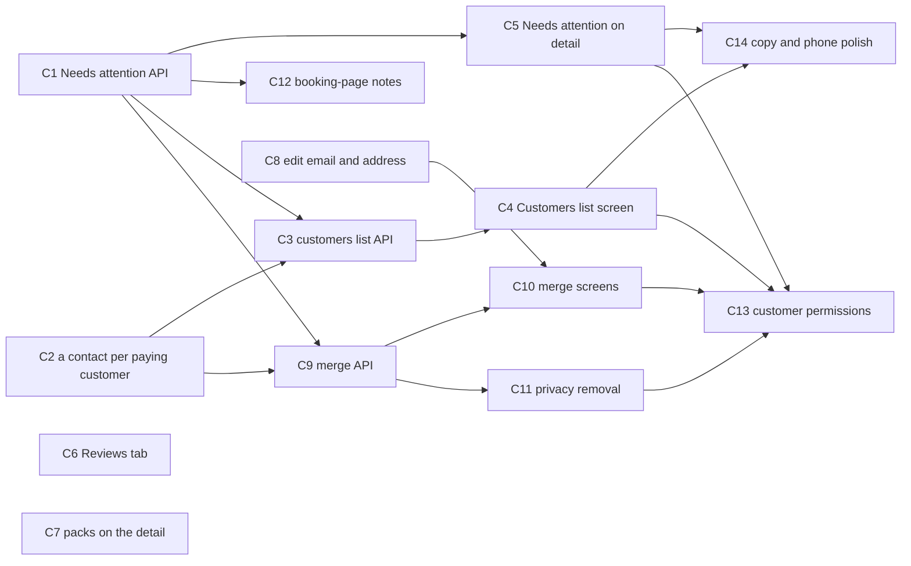

# Customers

## Summary

Make Customers one list for the whole business, keyed on the Contact and served by one organization-level API. It replaces the per-storefront list the app merges on the client today. Then:

- give every customer one **Needs attention** list (Allergy, Medical, Access, Other), with sensitive entries left out by the API for roles without the sensitive permission;
- close Customer Detail's gaps: header tags, a Reviews tab, packs, editing the email and the address, phone layout and copy;
- add **merge** and **privacy removal** (DEC-042).

The foundations come first: Needs attention, a contact for every paying customer, and the list API. Screens come second, and merge and removal third. The customer capabilities follow the capability model (DEC-039, 2026-09-27) and land in phase 2 (C13).

---

## Problem Frame

`/commerce/customers` (`components/stores/customers-screen.tsx`, `lib/customers/directory.ts`) fetches each storefront's `Customer` rows and merges them in the browser. So:

- there is no business-wide search, sort, filter or paging;
- "Spent" disagrees with Customer Detail;
- a row opens the old store page unless someone has linked the customer to a contact by hand (#120).

Customer Detail (#503) is rooted on the Contact and mostly matches the design. It lacks:

- Needs attention in the header, a Reviews tab and packs;
- an edit sheet that can change the email or hold an address;
- merge and privacy removal. It offers link and a hard delete instead.

Allergies are structured note allergens (`ContactNoteAllergen`). A clinic cannot record a medical or access note that the kitchen, front desk or dentist see as appropriate. The user decided (2026-09-26):

- CRM stays as it is;
- Customers is everyone who pays or signs in on the business's site (DEC-041);
- duplicates are merged and details can be removed (DEC-042);
- Needs attention is one shared field (DEC-040).

---

## Requirements

- R1. One Customers list for the business, keyed on the Contact: everyone who has paid (an order, an invoice, a subscription or a pack) or signed in on the business's site (DEC-041). Leads, Pipeline and Contacts are unchanged.
- R2. Every paying store customer has a linked Contact: made at backfill and whenever they next pay. A contact with exactly the same normalised email or phone is offered as a merge, never merged (DEC-041).
- R3. The list offers:
  - search by name, phone or email (all part of the person, `contact:read`);
  - filter chips with counts: All · Returning · Subscribers · Open order · Said yes to offers · Needs attention;
  - sort by Last order, Spent or Name;
  - a "Bought at …" storefront select, shown only with more than one storefront;
  - pages of 50 with Previous and Next;
  - a locked state for roles without access.
- R4. "Spent" counts each rupee once. It is paid orders (delivery included) plus paid non-order invoices, net of refunds and credit notes; "Customer since" is the first payment (default 20). The list and Customer Detail read the same rule.
- R5. Each part of a customer screen follows its own read (DEC-039, matrix §1): the person with `contact:read`, phone and email included; their orders with `order:read`, whole; "Spent", which sums orders and invoices, with both `order:read` and `invoice:read`. Nothing inside a part is hidden from someone who holds its read.
- R6. **Needs attention** (DEC-040). Each customer has one list of entries. An entry has:
  - a kind (Allergy, Medical, Access or Other), a label and optional detail;
  - a sensitive flag, on by default for Medical;
  - a source (staff, booking page or customer), plus who added it and when.

  Allergy entries carry a structured allergen. Sensitive entries go only to someone holding the sensitive capability (`customer:sensitive`, matrix Q2). Until C13 that means `contact:write`, Owner and Admin by default.
- R7. Existing note allergens become Allergy entries, and Order Detail's allergy banner still matches exactly.
- R8. Customer Detail shows Needs attention tags in the header, and entries can be added, edited and removed there. The list shows the red Allergy and Medical tags (Medical only with the sensitive permission).
- R9. Customer Detail gains a Reviews tab (reply and hide through the existing endpoints) and the person's class packs (a card on Overview and a tab). The Courses tab and card wait for Courses (DEC-044, default 27).
- R10. The edit sheet can change the email, unique per business, and edit a postal address (line 1, line 2, city, state, PIN, country). An email already held by another contact offers the merge.
- R11. **Merge** (DEC-042).
  - The merchant merges two customers and picks the survivor; the older one is offered (default 22).
  - The survivor keeps every order, note, booking, subscription, pack, invoice, message, consent, lead, form entry, Needs attention entry and site account of the other.
  - Orders and invoices keep the contact details they were placed with.
  - A merge is recorded on both timelines and in Activity.
  - It is refused while both hold a live subscription to the same plan (default 23).
- R12. **Privacy removal** (DEC-042).
  - It anonymises the person: name, phone, email, address, notes, Needs attention, messages and site account go.
  - Orders and issued invoices stay, with what was printed on them.
  - It is refused while an order is open or a subscription is live (default 25).
  - Future bookings are cancelled; past ones keep their time and service under "Removed customer" (default 26).
  - Hard delete stays only for a contact with no orders or invoices (#384).
- R13. A booking page's "Anything we should know?" note arrives on Customer Detail as a suggestion ("1 note from the booking page") with "Add to Needs attention" and "Nothing to add". It never goes straight onto the record (DEC-040).
- R14. Tabs scroll sideways on phones (default 28), and copy matches the design.
- R15. The customer capabilities of the capability model replace the stand-ins: `contact:read` and `contact:write` relabelled "See customers and contacts" and "Edit customers and contacts", plus `customer:merge`, `customer:remove` and `customer:sensitive` (the last as the user answers matrix Q2). There is no `customer:read`, `customer:write` or `customer:contact` key.

---

## Scope Boundaries

- Leads, Pipeline and Contacts (the CRM screens) are unchanged (DEC-041).
- Saroh never merges on its own. It suggests; the merchant merges.
- Linking a store customer to a known contact (#120) stays. Merging is contact to contact.
- The customer's own view of Needs attention and their health notes (plan A, A5) is not built here. Here: the API that A5 writes to (source `CUSTOMER`, arriving as a suggestion, default 12).
- Order and booking surfaces showing Needs attention are built in B15 and E4; this epic provides their read helper.
- Merging or removing a site account's sessions follows ADR-011 and uses A1's tables. If A1 hasn't shipped, the merge and removal have no account to move.

### Deferred to Follow-Up Work

- The Courses tab and card on Customer Detail (DEC-044).
- The #247 action rail (overview "Later").
- Undoing a merge. A merge is final, and the preview says so; a mistaken merge is fixed by hand.
- Export of a person's data (a subject access request): not designed.
- Needs attention warnings when an order line contains a noted allergen are B13's allergy clash, which reads C1.

---

## Context & Research

### Relevant Code and Patterns

- **Schema** (`packages/database/prisma/schema.prisma`):
  - `Contact` has a required `email`, `@@unique([organizationId, email])`, and no address.
  - `Customer` is the storefront's customer: `storeId`, a nullable `organizationId`, and `@@unique([storeId, email])`.
  - `CustomerIdentityLink`: `@@unique([contactId, customerId])`, `linkedByUserId`.
  - `ContactNote` and `ContactNoteAllergen`, which points at the business's allergen list after round 1.
  - `ProductReview` hangs off `customerId` (store customer), not the Contact.
- **Every relation on `Contact`**, which the merge must re-point (C9):

  | Model | Field | On delete | Merge conflict |
  |---|---|---|---|
  | `Lead` | `contactId` | Cascade | none |
  | `Submission` | `contactId?` | SetNull | none |
  | `Booking` | `contactId?` | SetNull | none |
  | `Message` | `contactId?` | SetNull | none |
  | `Consent` | `contactId` | Cascade | `@@unique([contactId, channel])`: keep the more recent answer per channel (default 24) |
  | `CustomerIdentityLink` | `contactId` | Cascade | `@@unique([contactId, customerId])`: drop duplicates |
  | `CustomerSubscription` | `contactId` | Cascade | `CustomerSubscription_one_live_per_person` (plan × contact, not cancelled): refuse (default 23) |
  | `Invoice` | `contactId?` | SetNull | none (bill-to snapshot unchanged) |
  | `PackPurchase` | `contactId` | Cascade | none |
  | `CourseEnrollment` | `contactId` | Cascade | `CourseEnrollment_one_active_per_person`: refuse |
  | `ContactNote` | `contactId` | Cascade | none (kept side by side) |
  | `ContactAttention` (new, C1) | `contactId` | Cascade | collapse duplicates (default 24) |
  | `CustomerAccount` (plan A, A1) | `contactId` | — | ADR-011 "Merging and removing" |
  | Plan A's message thread (A13) | `contactId` | — | re-point |

  A spec (C9) reads the Prisma DMMF and fails when a relation to `Contact` exists that the merge doesn't handle. A new table cannot be forgotten.

- **API**:
  - `apps/api.saroh.in/src/modules/customer-workspace/`:
    - `customer-workspace.controller.ts` (`organizations/:org/customers`: `:contactId/detail`, notes, `links/by-customer/:customerId`, timeline, suggestions, links);
    - `customer-detail.service.ts`: the detail aggregate, with the "Spent counts each rupee once" rule and money gating by `invoice:read` / `payment:read`;
    - `contact-notes.service.ts`: notes and allergens;
    - `customer-workspace.service.ts`: links, timeline, suggestions.
  - `apps/api.saroh.in/src/modules/contacts/contacts.service.ts`: `list`, `get`, `create`, `update` and `remove`, with `contact:read` / `contact:write`. `remove` is the hard delete.
  - `apps/api.saroh.in/src/modules/customers/customers.service.ts`: the store customers' CRUD. `remove` refuses a customer who has ordered.
  - Money rules to reuse: `apps/api.saroh.in/src/modules/invoices/invoice-state.ts` (`OWED_WHERE`, the order-invoice exclusion) and `docs/patterns/backend-billing-and-classes.md` "Count each rupee once".
  - Where a payment makes an order's invoice (the hook for R2): `apps/api.saroh.in/src/modules/invoices/order-invoicing.ts` (`ensureOrderInvoice`).
  - Reviews: `apps/api.saroh.in/src/modules/product-reviews/product-reviews.controller.ts`: list, `PATCH :reviewId/reply`, `POST :reviewId/hide`, `POST :reviewId/unhide`.
  - Class packs: `apps/api.saroh.in/src/modules/class-packs/class-packs.controller.ts` (`purchases?contactId=` style reads).
  - Permissions: `modules/organizations/{organization-actions,organization-policy,capability-catalogue}.ts`. `withImplied` is the pattern for an umbrella action.
- **App** (`apps/app.saroh.in`):
  - the list: `components/stores/customers-screen.tsx`, `lib/customers/{directory,service,actions,links}.ts`, and the routes `app/(shell)/commerce/customers/{page,[customerId],new,import}`;
  - the detail: `app/(shell)/customers/[contactId]/{page,loading,error,not-found}.tsx` and `components/customers/detail/{detail-screen,header,overview,orders-tab,bookings-tab,billing-tabs,notes,notices,edit-sheet,parts}.tsx`. The edit sheet shows the email and does not edit it;
  - link and delete: `components/customers/identity-link-dialog.tsx`, `components/customers/delete-customer-menu.tsx`;
  - `lib/customer-workspace/{view,detail,service,actions}.ts` and `lib/contacts/{removal,panels,holdings}.ts`.
- **Tests**:
  - unit tests go in the explicit `testMatch` of `apps/api.saroh.in/jest.config.js`;
  - DB specs (`*.db.spec.ts`, e.g. `customer-detail.db.spec.ts`) run under `jest.integration.config.js`;
  - app `vitest` on `lib/**` (`lib/customers/directory.test.ts`, `lib/customer-workspace/view.test.ts`);
  - e2e `e2e/tests/customer-detail.spec.ts`, and the permission matrix `e2e/permissions/permissions.spec.ts`.
- **Backfills**: `packages/database/src/backfill/` (`merge-same-products.ts` with `.cli.ts` and tests is the nearest shape: idempotent, per organization, with a report).

### Institutional Learnings

- Cross-tenant ids are 404 (`backend-auth-and-access.md`). Merge takes both ids from the path and checks both under the organization.
- A new organization-owned table carries a required `organizationId` and `ENABLE`/`FORCE ROW LEVEL SECURITY` with `org_isolation`. The integration suite uses `db push`, so `db:verify:replay` is the migration check.
- Row locks, not isolation levels (DEV_LEARNINGS "RLS quietly dropped Serializable"). The merge locks both contacts by id order.
- Demo stores are film sets: browser writes only on Northwind (memory: never save on demo stores).
- DEC-035: Activity may not record a person's details by value. The merge's audit row records ids and counts, never the discarded email or phone.

### External References

- None. Local patterns cover every layer.

---

## Key Technical Decisions

- **`ContactAttention` is its own table**, not a JSON column on Contact. It has:
  - `organizationId`, `contactId`, `kind` (enum ALLERGY, MEDICAL, ACCESS, OTHER), `label` (≤ 60), `detail?` (≤ 500), `sensitive`;
  - `allergenId?` (required when kind is ALLERGY and the business has an allergen list);
  - `source` (STAFF, BOOKING_PAGE, CUSTOMER), `status` (SUGGESTED, ACTIVE), `bookingId?`;
  - `createdByUserId?`, `confirmedByUserId?`, timestamps and `removedAt`.

  Suggestions (R13, and a customer's own health notes, default 12) are the same row in `SUGGESTED`. So "Add to Needs attention" is a status change, and "Nothing to add" sets `removedAt`.
- **One read helper decides visibility:** `attentionFor(ctx, contactIds)` returns active entries. It leaves out sensitive entries unless `canSeeSensitive(ctx)`. It includes a `hiddenSensitiveCount` so a screen can say "1 more note you can't see" without its content. Orders (B15), bookings (E4), Home (F2) and the kitchen view all call it, and none filters on its own.
- **`canSeeSensitive(ctx)`** is `allows(ctx, "contact:write")` until C13, then `allows(ctx, "customer:sensitive")` (or, if the user answers matrix Q2 the other way, `contact:read`). It is one function, so the swap is one line plus the catalogue.
- **Allergy stays structured.** The backfill turns each `ContactNoteAllergen` into an Allergy entry, labelled with the allergen's name, not sensitive, with source STAFF. The note keeps its text. Order Detail's banner reads Allergy entries through `attentionFor`. During the transition `ContactNoteAllergen` rows are still written for one release, then dropped in a two-deploy change.
- **The list API is new and separate:** `GET organizations/:org/customers?q=&chip=&sort=&store=&page=`. It is keyed on Contact and computed in SQL: a CTE of paying contacts (orders via confirmed identity links, non-order invoices paid, subscriptions, pack purchases) union signed-in accounts (plan A; empty until A1). It returns:
  - `lastOrderAt`, `orderCount`, `spent[]` (per currency), `openOrder`, `subscriber`, `offersConsent` and `attentionTags`;
  - chip counts computed from the same CTE in one query.

  Spent reuses the detail's rule. A shared SQL fragment and a spec assert that the list's and the detail's totals agree for the same person.
- **Search** matches the name, the phone and the email; anyone who can open the list holds `contact:read`, which covers all three (DEC-039). Phone matching is on digits only.
- **Paging is offset with 50 rows** and a stable tiebreak on id. The design pages by Previous and Next; businesses have hundreds, not millions.
- **"A contact for every paying customer" (C2)**:
  - A backfill script, idempotent, per organization: every store `Customer` with a paid order and no confirmed link gets a new Contact (their email, name and phone) and a link with `linkedByUserId = null` and reason `backfill`.
  - A Contact with the same email already exists in the org (the unique email) → no second contact. The pair is recorded as a **duplicate suggestion**, and the store customer stays unlinked until the merchant links or merges.
  - After that, the same `ensureContactForPaidOrder(tx, order)` runs where an order's invoice is made (`ensureOrderInvoice`), so the next payment links them.
- **Duplicate suggestions** are computed, not stored. Two contacts are a pair when their normalised email or phone is equal. The existing `:contactId/suggestions` endpoint widens to include contacts as well as store customers, and "Dismiss" is stored (`ContactDuplicateDismissal`, a pair of ids) so a dismissed pair stops showing.
- **Merge is one serializable-free transaction with row locks**:
  1. Lock both Contact rows in id order.
  2. Check refusals: the same live plan or the same active course; a site account on both with a clash per ADR-011 is handled, not refused.
  3. Re-point every relation in the table above.
  4. Copy the survivor's chosen field values (name, email, phone, company, address — the merchant picks each in the preview; unchosen values are dropped, see the defaults below).
  5. Delete the merged contact.
  6. Write a timeline event on the survivor and an audit row (`customer.merged`: both ids and per-relation counts; no personal values, DEC-035).

  Store `Customer` rows are never merged. Their links move to the survivor.
- **Orders and invoices keep what they were placed with.** An order's customer and delivery fields and an invoice's bill-to snapshot are not touched by a merge or a removal.
- **Privacy removal anonymises in place.** The contact row stays, so foreign keys hold. It is refused while an order is open or a subscription is live. It then:
  - sets name to null with a `removedAt` stamp, and email to a reserved non-deliverable placeholder unique per contact (`removed+<contactId>@removed.invalid`, since `email` is required and unique per org). Every reader treats a contact with `removedAt` as having no email;
  - clears phone, company and address;
  - deletes notes, Needs attention, consents and duplicate dismissals;
  - deletes the site account, its sessions and pending codes (ADR-011);
  - deletes message bodies but keeps a count;
  - cancels future bookings (the booking service's cancel, which returns pack credits) and sets past bookings' `bookerName/Email/Phone` to "Removed customer";
  - leaves leads and form entries: a form entry is the record of what someone typed (#385), and the removal asks whether to delete them too, unticked;
  - writes an audit row `customer.removed` with no values.
- **Hard delete stays** (`contacts.service.ts remove`) for a contact with no orders or invoices, as #384 has it. The ⋯ menu offers "Remove their details (privacy request)…" otherwise, with a line saying why Delete isn't offered.
- **The address lives on Contact** (`addressLine1`, `addressLine2`, `city`, `state`, `postalCode`, `country`). It is not copied into orders already placed. New order v2 (B13) may prefill from it.
- **The email change** goes through `contacts.service.ts update`, now accepting `email`. A clash with another contact returns 409 with that contact's id when the caller may read it, so the sheet offers "Merge with ‹name›"; otherwise the 409 is a plain sentence.

### Permissions touched

| Action | Needs (until C13) | Needs (after C13, the capability model) |
|---|---|---|
| Read the Customers list and Customer Detail, phone and email included, and search by them | `contact:read` (Owner, Admin, Member) | `contact:read`, relabelled "See customers and contacts" |
| See the orders tab and order totals | `order:read` | unchanged |
| See "Spent" | `order:read` and `invoice:read` | unchanged |
| See sensitive Needs attention | `contact:write` (Owner, Admin) | `customer:sensitive` (matrix Q2) |
| Add, edit or remove Needs attention; confirm a suggestion; edit email and address | `contact:write` | `contact:write`, relabelled "Edit customers and contacts" |
| Merge | `contact:write` | `customer:merge` |
| Privacy removal | `contact:write` | `customer:remove` |
| Reply to or hide a review from Customer Detail | `product-review:write` | unchanged |
| See packs on the detail | `pack:read` | unchanged |

---

## Open Questions

### Resolved During Planning

- The list replaces `/commerce/customers` only; `/contacts` stays (DEC-041).
- The list is keyed on the Contact, and a paying store customer gets a contact made and linked (DEC-041).
- Merge rather than link for two contacts (DEC-042). Link (#120) stays for a store customer.
- Anonymise for privacy; hard delete only with no orders or invoices (DEC-042).
- Add customer and Import stay (default 21).
- Needs attention is a general field (DEC-040).
- #247 is deferred.
- Spent includes subscriptions and delivery (default 20).

### Deferred to Implementation

- Whether the list's CTE is fast enough on the showcase data with 5,000 customers (the design's scale tweak), or needs a materialised "last paid" column on Contact. Measure first.
- The exact index set for phone-digit search (a generated column or a trigram index).
- Whether `ContactNoteAllergen` drops in this epic or the next release (two deploys either way).
- Label suggestions for booking-page notes: the design suggests a short label from the text. Start with the first words and let staff edit; no model.

---

## High-Level Technical Design

> *Directional guidance for review, not implementation specification.*

A Needs attention entry:

---

## Implementation Units

Phase 1: C1, C2, C3, C4, C5, C6, C7, C8, C14. Phase 2: C9, C10, C11, C12, C13 (the capability model decides it).

### C1. Needs attention API and backfill

**Goal:** One Needs attention list per customer, with sensitive entries left out by the API. The allergen notes become Allergy entries.

**Requirements:** R6, R7

**Dependencies:** None

**Phase:** 1

**Files:**
- Modify: `packages/database/prisma/schema.prisma` (`ContactAttention`, enums `AttentionKind`, `AttentionSource`, `AttentionStatus`; `Contact.attention`)
- Create: `packages/database/prisma/migrations/<ts>_contact_attention/migration.sql` (table, RLS `org_isolation`, indexes on `(organizationId, contactId)` and `(organizationId, status)`)
- Create: `packages/database/src/backfill/contact-attention.ts`, `contact-attention.cli.ts`
- Create: `apps/api.saroh.in/src/modules/customer-workspace/contact-attention.service.ts`, `attention-read.ts` (`attentionFor`, `canSeeSensitive`)
- Modify: `apps/api.saroh.in/src/modules/customer-workspace/customer-workspace.controller.ts` (`GET/POST :contactId/attention`, `PATCH/DELETE :contactId/attention/:id`, `POST :contactId/attention/:id/confirm`), `dto.ts`, `customer-detail.service.ts` (attention in the aggregate), `contact-notes.service.ts` (writing an allergen note writes the Allergy entry too, for one release)
- Modify: `apps/api.saroh.in/jest.config.js` (`testMatch`)
- Test: `apps/api.saroh.in/src/modules/customer-workspace/contact-attention.service.spec.ts`, `attention-read.spec.ts`, `contact-attention.db.spec.ts`, `packages/database/src/backfill/contact-attention.test.ts`

**Approach:**
- Kinds are ALLERGY, MEDICAL, ACCESS and OTHER. MEDICAL defaults to sensitive, and staff may untick it.
- An Allergy entry needs an allergen from the business's list; when the business has none, it takes free text as the label.
- Writes need `contact:write`. A sensitive entry can be created or changed only by someone who can see sensitive entries.
- `attentionFor` returns the active entries the caller may see, plus `hiddenSensitiveCount`. The detail aggregate uses it.
- Backfill: one Allergy entry per `ContactNoteAllergen` (deduplicated per contact and allergen), source STAFF, status ACTIVE, created by the note's author. It is idempotent.

**Execution note:** Characterisation first. Pin Order Detail's allergy banner output for the seeded contacts before the read switches.

**Patterns to follow:** `contact-notes.service.ts` (allergen checks), `20260923150000_products_v2` (RLS), `packages/database/src/backfill/merge-same-products.ts`.

**Test scenarios:**
- Happy path: staff add Medical "Blood thinners"; it is sensitive by default. An Owner reads it; a Member gets `hiddenSensitiveCount: 1` and no content.
- Happy path: the backfill turns two allergen notes (Sesame, Peanut) into two Allergy entries; run twice, it changes nothing.
- Edge case: an Allergy entry naming another business's allergen → 404.
- Edge case: a Member (no `contact:write`) tries to add an entry → 403. An Admin edits a sensitive entry → OK.
- Error path: a contact in another organization → 404.
- Integration: Order Detail's banner for a backfilled contact is unchanged.

**Verification:** Customer Detail's aggregate carries attention. The banner matches what was pinned. The migration replays.

---

### C2. A contact for every paying customer, and duplicate suggestions

**Goal:** Every store customer who has paid has a linked Contact, now and after each payment. Likely duplicate contacts are suggested, never merged.

**Requirements:** R1, R2

**Dependencies:** None

**Phase:** 1

**Files:**
- Create: `packages/database/src/backfill/paying-customer-contacts.ts`, `paying-customer-contacts.cli.ts`, `paying-customer-contacts.test.ts`
- Create: `apps/api.saroh.in/src/modules/customer-workspace/ensure-contact.ts` (`ensureContactForPaidOrder(tx, order)`), `duplicates.ts` (normalise, pair)
- Modify: `apps/api.saroh.in/src/modules/invoices/order-invoicing.ts` (call it inside `ensureOrderInvoice`, after the order lock, keeping the lock order in `backend-billing-and-classes.md`)
- Modify: `packages/database/prisma/schema.prisma` + migration (`ContactDuplicateDismissal`: organizationId, contactAId, contactBId, dismissedByUserId; RLS)
- Modify: `apps/api.saroh.in/src/modules/customer-workspace/customer-workspace.service.ts` (suggestions include contacts; `POST :contactId/suggestions/:otherId/dismiss`)
- Test: `ensure-contact.db.spec.ts`, `duplicates.spec.ts`, `customer-workspace.service.spec.ts`

**Approach:**
- Normalise the email by lower-casing and trimming, and the phone by digits only, with a leading 91 dropped for Indian 10-digit numbers.
- A paid store customer with no confirmed link:
  - no contact with that email → create one and link it (reason `backfill` or `payment`);
  - a contact with that email → leave both and let the suggestion surface. The unique email makes a second contact impossible, and linking silently is what #120 refused.
- Run it as a pure step in the caller's transaction, so no extra lock is needed.

**Patterns to follow:** `CustomerIdentityLink` creation in `customer-workspace.service.ts`; the backfill layout of `merge-same-products`.

**Test scenarios:**
- Happy path: a pay-later order is paid → its customer gets a contact and link in the same transaction as the invoice.
- Edge case: a contact with the same email exists → no contact is made, and the pair appears in suggestions.
- Edge case: two contacts share a phone, not an email → suggested; dismissed → gone for good.
- Edge case: a guest order with no customer → nothing happens.
- Integration: the backfill on the showcase seed; run twice, it changes nothing, and the report counts made, linked and suggested.

**Verification:** Every paid store customer in the seed resolves to a contact or a suggestion.

---

### C3. Organization customers list API

**Goal:** One server-side list of the business's customers, with search, chips and counts, sort, storefront filter and paging.

**Requirements:** R1, R3, R4, R5

**Dependencies:** C2 (links exist); C1 (attention tags)

**Phase:** 1

**Files:**
- Create: `apps/api.saroh.in/src/modules/customer-workspace/customers-list.service.ts`, `customers-list.sql.ts` (the CTE and the shared spent fragment), `customers-list.dto.ts`
- Modify: `apps/api.saroh.in/src/modules/customer-workspace/customer-workspace.controller.ts` (`GET organizations/:org/customers`), `customer-detail.service.ts` (use the shared spent fragment)
- Test: `customers-list.service.spec.ts`, `customers-list.db.spec.ts`

**Approach:**
- Customers are paying contacts plus contacts with an active `CustomerAccount`; a `LEFT JOIN` is empty until A1.
- Chips:
  - Returning: two or more paid orders or invoices;
  - Subscribers: a live subscription;
  - Open order: an order not fulfilled, cancelled or refunded;
  - Said yes to offers: a GRANTED marketing consent on any channel;
  - Needs attention: any active entry the caller can see.

  Counts ignore the active chip but honour the search and storefront.
- "Bought at": an order at that storefront.
- Sort: last order (nulls last), spent (per the business's one currency, DEC-030 amendment), or name.
- Order counts and last order come back with `order:read`, and `spent` with both `order:read` and `invoice:read` (matrix §1 rule 3). The phone and email come with the person.
- A removed contact (C11) is listed as "Removed customer", with no search by the old values.

**Execution note:** Test first on the spent agreement between list and detail.

**Patterns to follow:** `contacts.service.ts` (`lastOrderByContact`), `invoice-state.ts` `OWED_WHERE`.

**Test scenarios:**
- Happy path: page 1 of 120 customers returns 50, `total: 120`, and chip counts.
- Happy path: Spent for a person with an order, a paid subscription invoice and a refund equals Customer Detail's Spent.
- Edge case: a store customer's order and that order's invoice count once.
- Edge case: a Member (`contact:read`) searches "98450" and finds the person by phone.
- Edge case: a caller without both `order:read` and `invoice:read` (today's Member) gets no `spent` field, not zeros.
- Error path: `store` of another business → 404.
- Integration: 5,000 seeded customers, first page under the measured budget (recorded in the PR).

**Verification:** The API answers every control on Saroh Customers.dc.html.

---

### C4. Customers list screen (replaces /commerce/customers)

**Goal:** The business-wide list, as in Saroh Customers.dc.html, at `/commerce/customers`. Old per-storefront pages redirect.

**Requirements:** R1, R3, R5, R14

**Dependencies:** C3

**Phase:** 1

**Files:**
- Create: `apps/app.saroh.in/components/customers/list/{customers-list,filters,rows,states}.tsx`, `apps/app.saroh.in/lib/customers/list.ts` (URL state: q, chip, sort, store, page)
- Modify: `apps/app.saroh.in/app/(shell)/commerce/customers/page.tsx`, `commerce/customers/[customerId]/page.tsx` (redirect to the linked contact, else the store customer page as today), `app/(shell)/stores/[storeId]/customers/page.tsx` (redirect to the list with `store=`)
- Delete (after the switch): `apps/app.saroh.in/components/stores/customers-screen.tsx`, `lib/customers/directory.ts` and its test
- Test: `apps/app.saroh.in/lib/customers/list.test.ts`, `e2e/tests/customers-list.spec.ts`

**Approach:**
- Rows show Customer · Last order · Orders · Spent, the red Allergy and Medical tags and a phone line when allowed.
- A row opens `/customers/[contactId]`.
- Add customer and Import stay (default 21).
- States: loading, empty ("No customers yet"), no match ("No customers match these filters"), partial (a source that failed is named, never shown as zero), failed, and locked ("You can't see customers", with who can grant it).
- The phone layout: chips scroll, rows stack.
- A single-storefront business sees no "Bought at".

**Patterns to follow:** `DataView` / `PageContainer` in `@saroh/ui`; `.agents/skills/saroh-product-states/SKILL.md`; `saroh-four-scenes`.

**Test scenarios:**
- Happy path (e2e, Northwind): search a name, pick "Returning", sort by Spent, open a row → Customer Detail.
- Edge case: a caller without both `order:read` and `invoice:read` sees no Spent column.
- Edge case: `/stores/<id>/customers` lands on the list filtered to that storefront.
- Error path: the API fails → the failed state, with Try again.

**Verification:** Side by side with Saroh Customers.dc.html in the four scenes, on Rye (read-only) and Northwind.

---

### C5. Needs attention on Customer Detail and in the list

**Goal:** Header tags, and add/edit/remove of entries on Customer Detail, with the sensitive tick. The list tags come from the same read.

**Requirements:** R6, R8

**Dependencies:** C1

**Phase:** 1

**Files:**
- Create: `apps/app.saroh.in/components/customers/detail/attention.tsx` (tags, sheet), `apps/app.saroh.in/lib/customer-workspace/attention.ts`
- Modify: `components/customers/detail/{header,overview,detail-screen}.tsx`, `lib/customer-workspace/{view,actions,service}.ts`
- Test: `apps/app.saroh.in/lib/customer-workspace/attention.test.ts`, `e2e/tests/customer-detail.spec.ts`

**Approach:**
- Tags read "Allergy: Sesame", "Medical: Pregnant" and "Access: Anxious patient", with red for Allergy and Medical and words, never colour alone.
- "1 more note you can't see" shows when `hiddenSensitiveCount > 0`.
- The editor offers kind, label, detail and sensitive (on by default for Medical), and an allergen picker for Allergy.
- Remove has Undo.
- A caller without `contact:write` reads but doesn't edit.

**Test scenarios:**
- Happy path: add Access "Wheelchair" → the tag shows in the header and on the list.
- Edge case: a Member sees the Allergy tags, and "1 more note you can't see" in place of the Medical one.
- Error path: a save fails → the sheet keeps the values and names the failure.

**Verification:** Matches Saroh Customer Detail.dc.html's header and Needs attention card.

---

### C6. Reviews tab on Customer Detail

**Goal:** The person's product reviews with reply and hide, as designed.

**Requirements:** R9

**Dependencies:** None

**Phase:** 1

**Files:**
- Modify: `apps/api.saroh.in/src/modules/product-reviews/product-reviews.service.ts` and controller (list filter `contactId`, resolved through confirmed identity links)
- Create: `apps/app.saroh.in/components/customers/detail/reviews-tab.tsx`
- Modify: `components/customers/detail/detail-screen.tsx`, `lib/customer-workspace/view.ts`, `apps/app.saroh.in/lib/product-reviews/service.ts`
- Test: `product-reviews.service.spec.ts` (contact filter), `apps/app.saroh.in/lib/customer-workspace/view.test.ts`

**Approach:** The list reads with `product-review:read`; reply and hide go through the existing endpoints with `product-review:write`. A tab count shows in the tab bar. It is empty with "No reviews from ‹name› yet".

**Test scenarios:**
- Happy path: a contact linked to two store customers shows the reviews of both.
- Edge case: a review from an unlinked store customer with the same email is not shown.
- Error path: a reply refused (a Member) → the controls are hidden, and the API refuses too.

**Verification:** Reply and hide from the tab reflect on the product's Reviews tab.

---

### C7. Class packs on Customer Detail

**Goal:** A packs card on Overview (classes left, expiry) and a Packs tab with purchases and redemptions. Sell a pack from here.

**Requirements:** R9

**Dependencies:** None

**Phase:** 1

**Files:**
- Modify: `apps/api.saroh.in/src/modules/customer-workspace/customer-detail.service.ts` (packs in the aggregate, gated on `pack:read` and module availability, like the other panels)
- Create: `apps/app.saroh.in/components/customers/detail/packs-tab.tsx`
- Modify: `components/customers/detail/{overview,detail-screen}.tsx`, `lib/customer-workspace/view.ts`, `lib/contacts/panels.ts`
- Test: `customer-detail.service.spec.ts`, `lib/contacts/panels.test.ts`

**Approach:**
- The balance is derived, never stored (ADR-007), and uses `lib/class-packs/balance.ts`.
- "Sell a pack" opens the existing `sell-pack-dialog.tsx` with the person chosen.
- Pack prices and sales show with `pack:read`, which covers them (DEC-039). The Courses tab is deferred (default 27).

**Test scenarios:**
- Happy path: a person with a pack of 10, 3 used, sees "7 left · expires 12 Oct".
- Edge case: Appointments off → no card, no tab.
- Error path: the packs read fails → a notice in the card only.

**Verification:** Matches the design's pack card on Rye and Pulse.

---

### C8. Edit email and address

**Goal:** The edit sheet changes the email (unique per business) and edits a postal address.

**Requirements:** R10

**Dependencies:** None

**Phase:** 1

**Files:**
- Modify: `packages/database/prisma/schema.prisma` + migration (`Contact.addressLine1`, `addressLine2`, `city`, `state`, `postalCode`, `country`, all nullable)
- Modify: `apps/api.saroh.in/src/modules/contacts/{contacts.service,dto}.ts` (update takes email and address; a clash → 409 with the other contact's id when readable)
- Modify: `apps/app.saroh.in/components/customers/detail/edit-sheet.tsx`, `lib/customer-workspace/actions.ts`
- Test: `contacts.service.spec.ts`, `apps/app.saroh.in/lib/customer-workspace/view.test.ts`

**Approach:**
- The email is normalised. The state uses the GST state list when the country is India (`invoices/gst-states.ts`), and an Indian PIN is 6 digits (as in DEC-029).
- A changed email doesn't touch orders, invoices or consent records.
- The sheet's clash message offers "Merge with ‹name›", which opens C10's dialog when C10 has shipped, and a plain sentence before then.

**Test scenarios:**
- Happy path: change the email and add an address → saved, and the timeline notes "Details changed".
- Edge case: the email held by another contact → 409; the sheet names them.
- Error path: a PIN "5600" with country India → refused with a sentence.

**Verification:** Northwind edit round-trip.

---

### C9. Merge — API

**Goal:** Merge two contacts into a chosen survivor, re-pointing every relation, under locks, with refusals named.

**Requirements:** R11

**Dependencies:** C1, C2; A1 for site accounts (handled when the table exists)

**Phase:** 2

**Files:**
- Create: `apps/api.saroh.in/src/modules/customer-workspace/merge.service.ts`, `merge-plan.ts` (pure: which relations move, and the refusals), `merge.dto.ts`
- Modify: `customer-workspace.controller.ts` (`GET :contactId/merge/:otherId/preview`, `POST :contactId/merge/:otherId`)
- Modify: `apps/api.saroh.in/src/modules/audit/*` (the `customer.merged` event, ids and counts only)
- Test: `merge-plan.spec.ts`, `merge.db.spec.ts`, `merge.relations.spec.ts` (reads the Prisma DMMF: every relation to `Contact` is handled)

**Approach:**
- The preview returns per-relation counts, field choices (both values of name, email, phone, company and address) and refusals.
- The merge takes the survivor id and the field choices, locks both contacts in id order, re-checks the refusals, and re-points each relation in the table under Context & Research:
  - `Consent`: per channel, the more recently updated wins; the other is deleted (default 24);
  - `CustomerIdentityLink`: re-point, skipping duplicates;
  - `ContactAttention`: re-point, collapsing equal kind, label and allergen (default 24);
  - `ContactNote`: re-point, both kept (default 24);
  - `CustomerAccount` per ADR-011: the survivor keeps its account; the other account's verified channel moves when the survivor has none for it; otherwise the account goes to REMOVED and its sessions are revoked.
- The survivor takes the chosen values, and the email uniqueness is kept by deleting the merged contact in the same transaction before the update.
- It writes a timeline event on the survivor ("Merged with a duplicate") and the audit row.

**Execution note:** Test first, with `merge-plan.ts` pure.

**Patterns to follow:** `merge-same-products.move.ts` (re-pointing with a report), the lock notes in `backend-billing-and-classes.md`.

**Test scenarios:**
- Happy path: A (2 orders via links, 1 booking, notes) + B (1 subscription, 1 pack) → the survivor holds everything; B is gone; the counts match the preview.
- Edge case: both on the live plan "Monthly" → 409 "Cancel one of their Monthly subscriptions first" (default 23).
- Edge case: both enrolled in the same active course → 409.
- Edge case: both have consent for email; the newer wins.
- Edge case: both have site accounts with emails → the other account is retired and its sessions revoked.
- Error path: B in another business → 404. Merging a contact into itself → 400.
- Integration: two merges on the same pair at once → one succeeds, one 404s.
- Integration: the DMMF spec fails when a new `contactId` relation appears unhandled.

**Verification:** A merged showcase pair on Northwind reads correctly in Orders, Bookings, Billing and Customer Detail.

---

### C10. Merge — screens

**Goal:** "Merge with a duplicate…" from the ⋯ menu and from a duplicate suggestion, with a preview of what moves and the field choices.

**Requirements:** R11

**Dependencies:** C9; C8 (the clash offer)

**Phase:** 2

**Files:**
- Create: `apps/app.saroh.in/components/customers/detail/merge-dialog.tsx`, `apps/app.saroh.in/lib/customer-workspace/merge.ts`
- Modify: `components/customers/detail/{header,notices,edit-sheet}.tsx`, `components/customers/identity-link-dialog.tsx` (offer merge for contact pairs), `lib/customer-workspace/actions.ts`
- Test: `apps/app.saroh.in/lib/customer-workspace/merge.test.ts`, `e2e/tests/customer-merge.spec.ts`

**Approach:**
- The flow: pick the duplicate (search), then the preview.
- The preview shows who stays (the older one offered, default 22), a field-by-field choice, what moves as counts and the refusals.
- The dialog states: "This can't be undone. Orders and invoices keep the details they were placed with."
- Confirming leads to a toast "Merged. All of ‹name›'s orders, bookings and notes are here now."
- Suggested duplicates show as a notice with Merge and Dismiss.

**Test scenarios:**
- Happy path (e2e, Northwind): merge a seeded duplicate, then land on the survivor with its combined counts.
- Edge case: a refusal shows the sentence and disables Merge.
- Error path: the merge fails midway → nothing changes (one transaction), and the dialog names the failure.

**Verification:** Matches the merge flow in Saroh Customer Detail.dc.html.

---

### C11. Privacy removal

**Goal:** "Remove their details (privacy request)…" anonymises the person and keeps orders and issued invoices.

**Requirements:** R12

**Dependencies:** C9 (shares the relation table and DMMF spec); A1 for the account

**Phase:** 2

**Files:**
- Create: `apps/api.saroh.in/src/modules/customer-workspace/privacy-removal.service.ts`, `privacy-removal.dto.ts`
- Modify: `packages/database/prisma/schema.prisma` + migration (`Contact.removedAt`)
- Modify: `customer-workspace.controller.ts` (`GET :contactId/removal/preview`, `POST :contactId/removal`), `contacts.service.ts` and `customers-list.service.ts` (treat `removedAt` as having no email), `bookings/bookings.service.ts` (cancel future bookings through the existing path)
- Create: `apps/app.saroh.in/components/customers/detail/remove-details-dialog.tsx`
- Modify: `components/customers/delete-customer-menu.tsx`, `lib/contacts/removal.ts`
- Test: `privacy-removal.service.spec.ts`, `privacy-removal.db.spec.ts`, `apps/app.saroh.in/lib/contacts/removal.test.ts`

**Approach:**
- The removal follows the Key Technical Decisions:
  - refused with an open order or a live subscription (default 25);
  - cancels future bookings, returning pack credits (default 26), and renames past bookers "Removed customer";
  - deletes notes, attention, consents, messages and the site account with its sessions and codes;
  - keeps orders and invoices as they are;
  - offers deleting their form entries and leads, unticked;
  - writes the `customer.removed` audit with no values.
- The dialog lists what goes and what stays, and asks for "remove" to be typed.
- A removed contact reads "Removed customer · details removed on ‹date›" everywhere.

**Test scenarios:**
- Happy path: a person with a past order and a future booking → the booking is cancelled, the order is untouched and the contact is anonymised.
- Edge case: an open order → 409 "Finish or cancel their open order first".
- Edge case: they had a site account → sessions revoked, and sign-in with that email makes a new account and contact.
- Error path: another business's contact → 404.
- Integration: the list and search no longer find them by name, email or phone.

**Verification:** Northwind removal leaves Orders and Invoices printing as before.

---

### C12. Booking-page notes into Needs attention

**Goal:** "Anything we should know?" from the booking page becomes a suggestion on Customer Detail; staff add it or dismiss it.

**Requirements:** R13

**Dependencies:** C1; E7 (the booking page stores the note)

**Phase:** 2

**Files:**
- Modify: `apps/api.saroh.in/src/modules/bookings/public-bookings.service.ts` (on a confirmed booking with an intake note, write a SUGGESTED `ContactAttention`, sensitive, source BOOKING_PAGE, with `bookingId`)
- Modify: `customer-workspace/contact-attention.service.ts` (confirm with kind, label and sensitive; dismiss)
- Create: `apps/app.saroh.in/components/customers/detail/attention-suggestions.tsx`
- Modify: `components/customers/detail/{overview,notices}.tsx`
- Test: `contact-attention.service.spec.ts`, `public-bookings.service.spec.ts`

**Approach:**
- A suggestion is sensitive until confirmed, whatever its text, so only the sensitive permission sees it, and Home (F2) counts it the same way.
- The confirm sheet suggests a label (the first words) and a kind (Medical by default, as in the design), with the sensitive tick on.
- A confirmed entry shows "from the booking page".

**Test scenarios:**
- Happy path: Rahul's note about amlodipine → "1 note from the booking page"; Add → Medical tag, sensitive.
- Edge case: a Member sees neither the suggestion nor its count.
- Edge case: "Nothing to add" → gone; the booking still holds its note for staff with the permission.

**Verification:** The Kavi Dental flow in Saroh Customer Detail.dc.html (patient notes).

---

### C13. Customer capabilities

**Goal:** Apply the capability model for customers (DEC-039; matrix §2 and §3).

**Requirements:** R15

**Dependencies:** C4, C5, C10, C11. Decided by the capability model, except whether sensitive notes are their own capability (matrix Q2), which changes one line in `canSeeSensitive` and whether one key is added.

**Phase:** 2

**Files:**
- Modify: `apps/api.saroh.in/src/modules/organizations/{organization-actions,organization-policy,capability-catalogue}.ts` (+ spec), `customer-workspace/attention-read.ts` (`canSeeSensitive`), `customers-list.service.ts`, `merge.service.ts`, `privacy-removal.service.ts`
- Modify: `apps/app.saroh.in/lib/customer-workspace/view.ts`, `components/organizations/roles-tab.tsx` (labels)
- Test: `organization-policy.spec.ts`, `capability-catalogue.spec.ts`, `e2e/permissions/permissions.spec.ts` (one row per customer endpoint)

**Approach:**
- Relabel `contact:read` and `contact:write` ("See customers and contacts", "Edit customers and contacts"); `contact:write` implies `contact:read`.
- Add `customer:merge` and `customer:remove`, held by Owner and Admin. Neither is implied by `contact:write`: both are new powers, so no saved role loses anything. The hard delete of a contact with no orders or invoices stays with `contact:write` (DEC-042).
- Add `customer:sensitive` (Owner and Admin) and swap `canSeeSensitive` to it, as the user answers Q2; until then the stand-in stays.
- The Customers list and detail follow matrix §1 rule 3: each part on its own read, nothing hidden inside a part.

**Test scenarios:**
- Happy path: a "Practitioner" custom role with `customer:sensitive` and `contact:read` reads Medical entries and cannot edit them.
- Happy path: a role with `contact:read` sees phone and email and searches by them.
- Edge case: a custom role saved before the change, holding `contact:write`, can edit and hard-delete as before but gets 403 on merge and privacy removal.
- Edge case: a caller with `order:read` but not `invoice:read` sees the orders tab and no "Spent".
- Integration: the permission matrix e2e covers list, detail, attention, merge and removal.

**Verification:** The matrix page's customer rows are each backed by a policy test.

---

### C14. Copy and phone polish on Customers and Customer Detail

**Goal:** Tabs scroll sideways on phones, copy matches the design, and the ⋯ More actions button is added.

**Requirements:** R14

**Dependencies:** C4, C5

**Phase:** 1

**Files:**
- Modify: `apps/app.saroh.in/components/customers/detail/{detail-screen,header,parts,overview}.tsx`, `components/customers/list/*`
- Test: `e2e/tests/customer-detail.spec.ts` (phone viewport)

**Approach:**
- Tabs become a single scrollable row with the active tab kept in view (default 28).
- Copy is taken from Saroh Customer Detail.dc.html and Saroh Customers.dc.html.
- The ⋯ menu holds Merge, Remove their details and Delete (with the reason when it is not offered).
- No capability is dropped (00-universal §15): everything in today's header keeps a place.

**Test scenarios:**
- Happy path: at 375px the tabs scroll and the active one is visible.
- Edge case: a long name wraps without pushing the tags off-screen.

**Verification:** Four scenes, side by side with the designs.

---

## System-Wide Impact

- **Interaction graph:**
  - order invoicing (`ensureOrderInvoice` gains the ensure-contact step);
  - public bookings (intake suggestions);
  - bookings (cancel on removal);
  - class packs (credits returned on cancel);
  - product reviews (contact filter);
  - the audit stream;
  - plan A's account tables;
  - the orders, bookings and Home surfaces that call `attentionFor` (B15, E4, F2).
- **Error propagation:** a failed source on the list or the detail is named in a notice, never shown as zero. Merge and removal refusals are sentences a merchant can act on.
- **State lifecycle risks:**
  - a merge racing a new order for the merged contact: the contact row lock, then a 404 for the later writer;
  - removal racing a booking: the removal's check runs under the contact lock, and booking creation takes the same lock when it links a contact.
- **API surface parity:** `stores/:storeId/customers` stays for store customer CRUD. The app stops reading it for the list.
- **Integration coverage:** the DMMF relation spec, backfills run twice, list ↔ detail spent agreement, the permissions e2e.
- **Unchanged invariants:**
  - leads, pipeline and contacts screens;
  - invoice bill-to snapshots and order customer fields;
  - "Count each rupee once";
  - a customer who has ordered cannot be hard-deleted (#384).

---

## Risks & Dependencies

| Risk | Mitigation |
|------|------------|
| A merge forgets a relation added later | The DMMF spec fails on any unhandled relation to `Contact` |
| The list's CTE is slow at scale | Measure on 5,000 seeded customers; a materialised last-paid column if needed |
| Sensitive notes leak through a new surface | One read helper (`attentionFor`); no surface filters on its own; the permissions e2e |
| An auto-made contact duplicates a CRM contact | Never auto-link on an existing email; suggest instead (C2) |
| Removal breaks tax records | Orders and invoices untouched; tested by printing an invoice after removal |
| The sensitive answer (matrix Q2) changes who reads medical notes | One function (`canSeeSensitive`); C13 swaps it |

---

## Documentation / Operational Notes

- Update `docs/patterns/saroh-product.md` "Selling, customers and identity" to Current as units land. Replace the "one customer record … is not true yet" line only when C2 and C3 ship, and say exactly what is now true.
- Update `docs/patterns/backend-auth-and-access.md` with `canSeeSensitive`, and later the `customer:*` actions.
- Add C1 and C2's backfill CLIs to the release notes. Run them after the migration, each idempotent.
- New unit specs go in the explicit `testMatch` of `apps/api.saroh.in/jest.config.js`.
- Browser writes on Northwind only; Rye, Pulse and Kavi Dental are read-only (film sets).

---

## Sources & References

- Designs: `Saroh Customers.dc.html`, `Saroh Customer Detail.dc.html`, `saroh-fixtures.js` (`customersList`, `customerStats`, `attentionOf`, `intakeFor`, `PRODUCT_PERMS`), `DESIGN-NOTES.md`
- Gap report: `gap-reports/customers.md`
- Decisions: DEC-040, DEC-041, DEC-042, DEC-039, ADR-011, ADR-008 (amended), DEC-035
- Overview and defaults: `docs/plans/2026-09-26-000-round-2-overview.md` (defaults 12, 20–28)
- Matrix: `docs/plans/2026-09-26-permission-matrix.md` (§1–§3, Q2)
- Related plans: 001 (A1 accounts, A5 health notes), 002 (B13, B15), 005 (E4, E7), 006 (F2)
