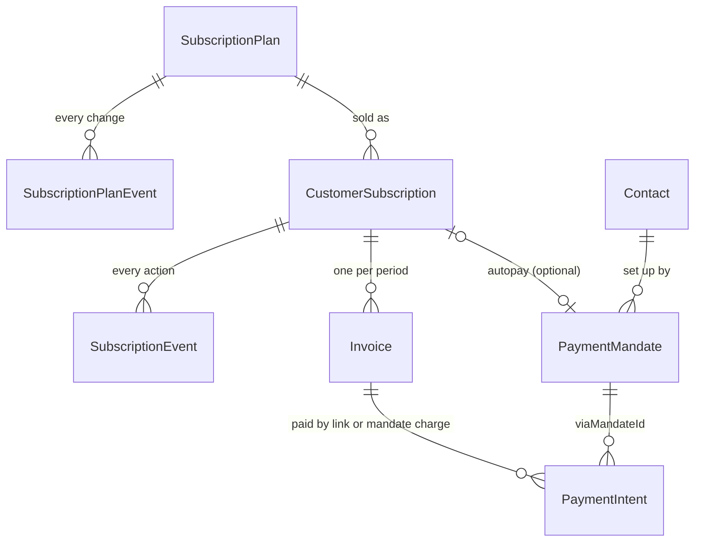
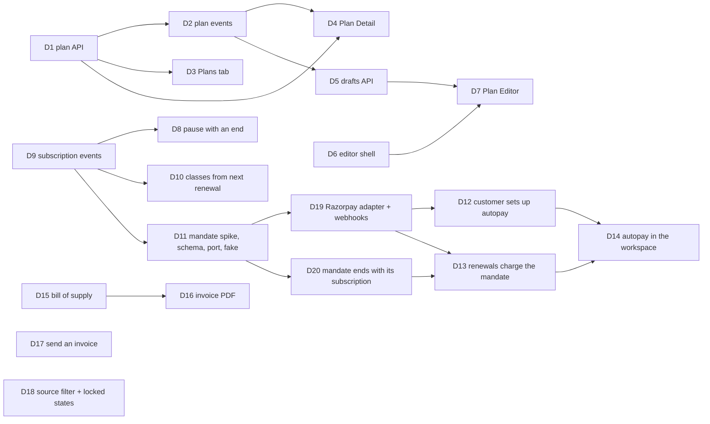

# Payments

## Summary

Bring the money a person owes up to the round-2 designs, in three parts.

- **Plans:** Plans become a tab inside Subscriptions, with a Plan Detail
  page. The `PlanDialog` modal is replaced by a Plan Editor page that
  autosaves, keeps a live plan's unpublished changes on the server, and
  publishes them in one step. Its editor shell is shared with the Pack Editor
  (E18) and, later, courses.
- **Subscriptions:** an event log for plans and subscriptions, a pause with
  an end date that resumes on its own, and classes that change from each
  member's next renewal.
- **Money:** autopay through the business's own payment provider (DEC-038),
  with the pay link staying as the fallback. The remaining invoice gaps are a
  bill of supply, a PDF, sending an invoice with its pay link, the source
  filter and locked states.

**Phase 1** is the Plans tab and Plan Detail with their event logs, and pause
with an end date: D1–D4, D8 and D9 (user, 2026-09-27). The drafts API, the
editor shell and the Plan Editor (D5–D7) move to phase 2 with the Pack Editor
(E14, E18), so the shell is built once for both. Until D7, "New plan" and
"Edit" keep opening today's `PlanDialog`. Classes from the next renewal (D10),
the invoice filter (D18), autopay (D11–D14, D19, D20) and the invoice gaps
(D15–D17) are phase 2.

---

## Problem Frame

Subscriptions and Subscription Detail shipped in #507 against an earlier
pass of the designs. The designs have since moved on.

- Plans are a tab of Subscriptions, and each plan has its own page
  (Overview, Subscribers, History).
- A plan is edited on a page, not in a modal. That page autosaves, and a live
  plan's price or classes change only when someone chooses "Publish changes".
- The Changes card on a subscription says who did what and when.
- Pause has an end date.
- The Plan Editor, Subscription Detail and Home's "Retry" assume a renewal can
  charge the customer without a link.

Today:

- `/billing/plans` is a card grid, and plans are edited in `PlanDialog`
  (`components/subscriptions/plans-screen.tsx`).
- A plan is ACTIVE or ARCHIVED, and nothing records how it changed.
- `classesPerMonth` exists on `SubscriptionPlan`, but the DTO and the app
  cannot set it. `use-membership.ts` reads it live, so a change hits every
  member at once.
- Pause has no end.
- "Retry" makes a new pay link, since ADR-007 had no card on file.

On invoices, the gaps are a bill of supply for exempt supplies, a PDF, a real
send, a filter by what the invoice was for, and locked states for roles
without `invoice:read`.

DEC-038 now allows autopay on the business's own provider's mandates. Every
period is still invoiced, and a pay link stays the fallback.

---

## Requirements

- R1. A plan's API returns and accepts its classes a month, a count of subscribers per price they pay, and a monthly-equivalent figure. Plan names are unique per business among plans that aren't archived.
- R2. Every change to a plan (created, published, price changed, classes changed, renamed, archived, restored, draft discarded) writes one plan event with who, when, and before → after for the changed fields. Events are never edited or deleted.
- R3. Plans are a tab of Subscriptions (`?tab=plans`), with the design's cards, Archive and "Sell again", each with Undo. `/billing/plans` redirects to the tab. A role without `subscription:read` sees the locked state.
- R4. Plan Detail (`/billing/plans/[planId]`) has Overview, Subscribers and History, with loading, empty ("Nobody's on this plan yet"), failed, not-found ("That plan isn't here") and locked states. Its figures show to anyone with `subscription:read`, which covers them (DEC-039).
- R5. A plan can be a **Draft**, which is refused at subscribe, on the site and in "Sell again" lists. A live plan can carry **one set of unpublished changes** on the server. Publish changes applies them in one transaction, Discard drops them, and Delete draft removes a plan that was never published (DEC-043). The pending set carries a revision: a save or a publish against a stale revision is refused with a 409, so one person never overwrites or publishes another's changes unseen.
- R6. One editor shell (autosave, the publish banner, Publish / Publish changes / Discard / Delete draft, leave-with-unsaved-work, a failed-save state) is shared by the Plan Editor and the Pack Editor (E18).
- R7. The Plan Editor (`/billing/plans/new`, `/billing/plans/[planId]/edit`) replaces `PlanDialog`. It has Details, Price and billing (month and year first, week and quarter under "More"; default 29), Classes included (shown only when Appointments is on; default 31), and an At a glance side panel. Its copy never promises autopay a business can't take (DEC-038).
- R8. Pause offers 2, 4 or 8 weeks, which resume on their own, or "Until I resume" (default 30). A pause with an end date resumes in the renewal job on that date, and the rest of ADR-007's pause rules stand.
- R9. Every subscription action (subscribe, pause, resume, cancel, keep, plan change and its cancellation, skip, retry, renewal invoiced, renewal failed, mandate set up, mandate cancelled, charged) writes one subscription event. The Changes card reads them, including who did it: a team member, "the customer" or "Saroh" for the job.
- R10. A plan's classes a month apply to a member from their next renewal. The allowance is saved on the subscription's period at renewal, and `use-membership.ts` reads the period's allowance, not the plan's (default 32).
- R11. The merchant payment port gains mandates: set up (a hosted authorisation link from the provider), charge against a mandate, cancel, and read status. Razorpay is the first adapter (default 34). Webhooks settle mandate and charge events idempotently. Saroh stores only provider references, never card or bank details.
- R12. A customer sets up autopay from a pay link, the site's join sheet (G20) or their account (A8). Autopay is offered only when the business's provider supports mandates.
- R13. A renewal still issues the period's invoice (ADR-007). With an active mandate, the renewal charges it for that invoice, unless the invoice total is above the mandate's limit, which is caught before charging and asks the customer to authorise again. A success pays the invoice through the existing reconciliation; a failure or an unanswered charge leaves the invoice issued, sends nothing on its own, and writes RENEWAL_FAILED, which Home's failed-renewal source (F1) reads. "Retry" retries the mandate when there is one, and makes a pay link otherwise (default 35). **While a mandate charge is pending, nothing else can charge the same invoice**: no new pay link, no "Pay now", no reminder and no Retry by pay link.
- R14. Subscription Detail shows the mandate ("Autopay · UPI · set up 3 Sep" or "No autopay — invoiced with a pay link"), with Cancel autopay and Send autopay set-up link. The Plan Editor's copy follows what the business's provider supports.
- R15. A GST-registered business's invoice whose lines are all exempt or nil-rated is titled "Bill of supply", with no tax columns, in the same number series (default 36).
- R16. An issued invoice can be downloaded as a PDF from Invoice Detail, rendered on request from the same data as the printed paper and never stored (default 37). The pay page has no PDF download (dropped, user 2026-09-27; default 106).
- R17. "Send with pay link" is offered when the invoice can really reach the person: through the business's connected email provider, or, **once A13 exists**, into the customer's account thread when they have a site account (thread only, when there is no provider). Otherwise the only option is "Copy pay link"; there is no WhatsApp share (dropped, default 106), and Saroh's email is never used (default 38). Invoice reminders (Home, F4) use the same path and the same rule, served by the API as one flag.
- R19. A mandate lives only as long as its subscription. When the subscription is cancelled (by staff, by the customer at period end, or at its natural end), when the contact's details are removed for privacy, and when the contact is merged away, the mandate is cancelled at the provider through the unsure-answer path (DEC-026). A mandate is charged only for its own subscription's renewal invoices.
- R18. The Invoices list filters by source (`?subscription=`, `?pack=`, `?course=`, `?order=`, `?booking=`, hand-written). Invoices, Invoice Detail and the Subscriptions/Plans screens show a locked card to a role without the read. Money is left out by the API, not hidden by the screen.

---

## Scope Boundaries

- Every period is invoiced, with or without a mandate (DEC-023, DEC-038). A mandate charge is a way to pay an invoice, not a replacement for one.
- No proration on a plan change (ADR-008 §3). A plan change still applies from the next renewal.
- No currency picker: plans use the business's currency (DEC-030 amendment).
- No mandate for class packs or one-off invoices this round. Mandates pay subscription renewals only, so a mandate always belongs to one subscription. Per-session charging waits for Courses (DEC-044, amended 2026-09-27), and the port is shaped so it can be added.
- Dropped by the user (2026-09-27): the pay page's PDF download and "Share on WhatsApp" (default 106).
- No new capabilities here. Units use today's (`subscription:*`, `invoice:*`, `payment:*`), which already fit the capability model (DEC-039): each shows everything in its scope, money included.
- Courses: the `?course=` filter keeps working for existing course invoices, and nothing else about courses changes (DEC-044).

### Deferred to Follow-Up Work

- Cashfree mandates (after D11; "Later" in the overview).
- Per-session charges against a mandate, for Courses when they return.
- Saroh's own billing (Settings › Plan & billing), which gets its own plan.
- GST returns and e-invoicing (DEC-023 deferrals).
- A reconcile job that settles a charge the provider never answered (as DEC-026 defers for refunds). Until then, "Retry" asks the provider first.

---

## Context & Research

### Relevant Code and Patterns

- Plans and subscriptions API, all in `apps/api.saroh.in/src/modules/subscriptions/`:
  - `subscriptions.controller.ts` is two controllers:
    - `organizations/:orgId/subscription-plans`: CRUD, `:planId/archive`, `:planId/restore`;
    - `.../subscriptions`: list, `renewals`, `:id` plus pause, resume, cancel, keep, collection, skips, plan-change and `retry`. `retry` makes a new pay link today (`retryPayment`).
  - `subscriptions.service.ts` serves both, with no separate plans service.
  - `dto.ts` has no `classesPerMonth`.
  - `subscription-renew.handler.ts` and `renew-job.ts` (`SUBSCRIPTION_RENEW_TYPE`) are the self-rescheduling renewal.
  - `periods.ts` and `collections.ts` hold helpers.
- Schema (`packages/database/prisma/schema.prisma`):
  - `SubscriptionPlan`: `status` is a `String` (ACTIVE | ARCHIVED), plus `classesPerMonth Int?` and `pendingSwitches`.
  - `CustomerSubscription`: `pausedAt`, `cancelAtPeriodEnd`, `currentPeriodStart/End`, `pendingPlanId`, `anchorAt`, `timezone`.
  - `SubscriptionSkip`.
  - `Invoice`: `source` String default MANUAL; `subscriptionId`, `packPurchaseId`, `courseEnrollmentId`, `orderId`, `bookingId`, `payTokenHash`, `kind`.
  - `PaymentIntent` pays an order or an invoice, and `MerchantPaymentProvider` is unique per org and provider.
- Membership allowance: `apps/api.saroh.in/src/modules/bookings/use-membership.ts` reads `plan.classesPerMonth` live, and `customer-workspace/customer-detail.service.ts` reads it too.
- Invoices, in `apps/api.saroh.in/src/modules/invoices/`:
  - `invoices.controller.ts`: list with `ListInvoicesQueryDto` (view, contactId, subscriptionId), plus issue, void, credit, reissue, `pay-link` and `payments`;
  - `invoices.service.ts`, `serialize.ts`, `invoice-state.ts` (`isPastDue`, `OWED_WHERE`);
  - `numbering.ts`, `gst.ts`, `order-invoice.ts`, `pay-token.ts`, `pay-link-url.ts`, `payments-on.ts`.
- Payments:
  - `apps/api.saroh.in/src/modules/payments/providers/provider.port.ts` (`MerchantProvider`: `createOrderIntent`, `refund`, `findRefund`), with `razorpay.provider.ts`, `cashfree.provider.ts`, `fake.provider.ts` and `provider.factory.ts`;
  - `payments.service.ts`, `intent-state.ts`, `public-invoices.{controller,service}.ts`.
  - Webhooks: `apps/api.saroh.in/src/modules/webhooks/webhooks.service.ts`, with `providers/{razorpay,cashfree,fake}.webhook.ts`, `providers/webhook-provider.port.ts` and `providers/webhook-provider.factory.ts` (the port is under `providers/`, not beside the service).
- Messaging, which D17 sends through: `apps/api.saroh.in/src/modules/communications/{communications.service.ts,message-send.handler.ts}`, `CommsProvider`, and consent gating.
- Home: `apps/api.saroh.in/src/modules/home/home.service.ts` (raises failed renewals, F1).
- App:
  - pages: `app/(shell)/billing/plans/page.tsx`, `billing/subscriptions/{page,layout,loading,error}.tsx`, `billing/subscriptions/[subscriptionId]/`, and `billing/invoices/{page,layout,loading,error}.tsx`, `[invoiceId]/`, `new/`;
  - `components/subscriptions/`: `plans-screen.tsx` (holds `PlanDialog`), `subscriptions-screen.tsx`, `subscribe-dialog.tsx`, `subscription-quick-look.tsx`, `payments-crumbs.tsx`, and `subscription-detail/{detail-screen,panels,action-sheets}.tsx` and `use-subscription-actions.ts`;
  - `components/invoices/`: `invoices-screen.tsx`, `invoice-detail.tsx`, `invoice-actions.tsx`, `invoice-paper.tsx`, `pay-link.tsx`, `invoice-quick-look.tsx`;
  - `lib/subscriptions/`: `service.ts`, `actions.ts`, `renewal.ts`, and `view.ts` (`olderPrice`);
  - `lib/invoices/`: `service.ts`, `status.ts`, `links.ts`, `invoice-number.ts`.
- Pay page: `apps/saroh.app/app/pay/[token]/{page,actions}.ts(x)`.
- Stale-write refusal to copy for drafts: the site editor's draft save carries a `revision` and answers a stale one with a 409 naming `yours` and `current` (`modules/sites/sites.service.ts`, #285; tested in `sites/draft-revision.service.spec.ts`; the revision is read with the id in `site-access.ts`).
- Invoice lines: `InvoiceLine.gstRate Decimal?` (frozen at issue) is the only rate signal; nothing models exempt versus nil versus 0%.
- `CustomerSubscription.status` is ACTIVE | PAUSED | CANCELLED; there is no ENDED. Cancel now, and cancel at period end when the renewal applies it, both set CANCELLED (`subscriptions.service.ts`, `subscription-renew.handler.ts`).
- Seeds: no clinic business is seeded today (a grep of `packages/database/src/seed` finds only the first name "Kavitha"). Units below that verify against "Kavi Dental" need the clinic seed the overview assigns (overview, "Seeds").
- Append-only logs with actors to mirror: `OrderEvent` (orders), `StockEntry` (DEC-032), and `modules/audit/audit.service.ts` (`auditMetadata`, operator masking, DEC-035).
- Tests:
  - unit specs listed explicitly in `apps/api.saroh.in/jest.config.js` `testMatch`;
  - `*.db.spec.ts` integration (via `db push`);
  - e2e `e2e/tests/subscriptions.spec.ts` and `e2e/tests/invoices.spec.ts`;
  - the permissions matrix `e2e/permissions/permissions.spec.ts`.

### Institutional Learnings

- Renewal is forward only and idempotent per subscription and period. Pausing skips renewals, and resuming extends the invoiced period by the days paused (ADR-007).
- Race safety is row locks plus Serializable; the RLS proxy preserves the isolation level (DEC-019). The lock order is Order → StockLevel → PaymentRefund → payment intent → Invoice → Booking (`backend-billing-and-classes.md`). A mandate charge follows the webhook's existing rule, intent then invoice. D13 keeps it by creating the intent before it touches the invoice row.
- DEC-026: an unsure provider answer holds the state and never frees or fails it. Try-again looks before it sends. The same holds for mandate charges.
- Webhooks: verify the signature on the raw body, then an idempotent inbox on `(provider, providerEventId)` (`backend-integrations.md`).
- Jobs: every enqueued type has a handler, handlers are idempotent, and payloads carry ids (`backend-jobs.md`).
- A new org-owned table gets `organizationId`, `ENABLE/FORCE ROW LEVEL SECURITY` and an `org_isolation` policy, and must pass `db:verify:replay`.
- Copy promises only what ships: "Saroh doesn't send this" stays true until D17 ships and a provider is connected (`saroh-product.md`).

### External References

- Razorpay Subscriptions and recurring payments (UPI Autopay, cards via tokens, e-mandate). Read the provider's current docs when D11 starts. The shape of the create-mandate, charge and webhook events is confirmed then, not assumed here.
- RBI e-mandate rules (pre-debit notification, limits for charges without extra authentication). The provider sends the pre-debit notice, and D11 confirms which side sends it.

---

## Key Technical Decisions

- **Plan events are their own table** (`SubscriptionPlanEvent`: organizationId, planId, kind, actorUserId nullable, actorKind TEAM | JOB | OPERATOR, changes JSON of `{field: [before, after]}` limited to plan fields, createdAt). It is append-only, with no update or delete path in the service. An operator's change reads as "Saroh support" (DEC-035).
- **Subscription events are their own table** (`SubscriptionEvent`: organizationId, subscriptionId, kind, actorKind TEAM | CUSTOMER | JOB | OPERATOR, actorUserId, customerAccountId nullable (A-epic), invoiceId nullable, note, data JSON, createdAt). Each is written in the same transaction as the action it records. No backfill from history: the Changes card says "Earlier changes weren't recorded" for older subscriptions — the same dateless words as D2's plan history, since anything between 26 Sep and the deploy is unrecorded too (default 99).
- **Drafts are a status plus a pending-changes column**, generic across record types:
  - `status` gains `DRAFT` (it is a String, so there is no enum migration), and `pendingChanges Json?` plus `pendingChangedAt`/`pendingChangedBy` are added to `SubscriptionPlan`. The same columns are added to `ClassPack` in E14.
  - A small shared module (`apps/api.saroh.in/src/common/drafts/`) owns: validating a patch against a record-type's publishable fields, merging the pending set over the live one for editor reads, publish (apply the pending set and clear it, under the row lock, writing one event), discard, and delete-draft (only a DRAFT with no sales).
  - Buyers read only published columns, so no reader changes except the ones that list plans for sale, which exclude DRAFT.
  - **A draft revision, as the site draft has (#285).** `draftRevision Int @default(0)` sits beside `pendingChanges` and is bumped by every autosave, publish and discard. The editor loads the revision, sends it with each autosave, and gets a 409 `{ yours, current, changedBy }` when it is stale; the shell says "Priya changed this plan — Reload" and keeps the typed values on screen. Publish sends the revision the publisher is looking at and is refused if the pending set changed since, so nobody publishes changes they never saw. Last-write-wins was rejected: it lets a second tab silently write back a colleague's stale values.
- **Autosave writes the pending set, never the live record.** The editor PATCHes `…/draft` with the fields in view and the revision it holds. A new plan is created as DRAFT on the first autosave that has a name.
- **Publishing a price change never touches existing subscriptions.** A subscription stores its price at sale (ADR-007), and the plan event records the change. Plan Detail's "Older price" reads it (`olderPrice` stays).
- **Classes from the next renewal:** `CustomerSubscription` gains `classesPerPeriod Int?`, set at subscribe and at each renewal from the plan, in the renewal transaction. `use-membership.ts` reads it. For live subscriptions, the migration copies today's plan value, so nothing changes for a member until their next renewal.
- **Pause with an end:** `CustomerSubscription.pausedUntil DateTime?`. The renewal job's scheduled run for a paused subscription is moved to `pausedUntil`. The job resumes it on that date through the same `resume` path (so a resume past the paid period invoices as today), writes RESUMED with actor JOB, and reschedules. "Until I resume" keeps `pausedUntil` null. Resuming by hand clears it.
- **Mandates:**
  - `PaymentMandate` holds organizationId, contactId, **subscriptionId (required)**, provider, the provider's customer id, the provider's mandate or token id, method (UPI | CARD | EMANDATE), a display hint (last four digits or UPI handle masked, only what the provider returns as displayable), status (PENDING | ACTIVE | PAUSED | CANCELLED | FAILED), maxAmount, createdAt, activatedAt, cancelledAt, cancelReason (CUSTOMER | STAFF | SUBSCRIPTION_ENDED | PRIVACY_REMOVAL | MERGED | PROVIDER) and `cancelConfirmedAt` (null while the provider's answer is unsure).
  - Card and bank data never reach Saroh.
  - A subscription has at most one ACTIVE mandate (a partial unique index).
  - **Lifecycle (D20).** A mandate is set up for one subscription and is charged only for that subscription's renewal invoices: the charge handler checks `invoice.subscriptionId = mandate.subscriptionId` and that the subscription is not CANCELLED. It ends when the subscription does. Any move to CANCELLED (staff cancel now, the customer's or staff's cancel at period end when the renewal applies it, a subscription's natural end), a privacy removal of the contact (C11) and a merge in which the contact is merged away (C9) call `mandates.service.cancelFor({ subscriptionId | contactId }, reason)`. It asks the provider first and records the answer (DEC-026). An unsure answer marks the row CANCELLED with `cancelConfirmedAt` null ("being confirmed with Razorpay"), so Saroh never charges it again even before the provider confirms. The nullable "later reuse" path is dropped: a per-session mandate for Courses will be its own row with its own purpose, never a left-over renewal mandate.
  - **The limit.** `maxAmount` is set at authorisation from the plan price plus the provider's headroom. The charge handler compares the invoice total with it before charging (D13), so a price rise, a plan switch or an interval change that goes above it is caught there, not by a decline.
  - **One charge at a time per invoice.** While an invoice has a PENDING mandate intent, creating a pay-link intent for it is refused (409 "Autopay charge in progress"). "Pay now" (A8), Send reminder (D17, F4) and Retry by pay link are hidden, and the account, Subscription Detail and Home say "Autopay charge in progress · ‹date›". UPI Autopay waits on a pre-debit notice, so a charge can be PENDING for a day or more; this rule is what stops a customer paying by link and then being debited too.
- **The port grows, the old calls stay:** `MerchantProvider` gains optional `mandates?: MandateCapability` with `createSetup`, `charge`, `cancel` and `status`. `supportsMandates(provider)` is read by the UI to decide whether to offer autopay. The fake provider implements it for tests.
- **A mandate charge is a `PaymentIntent` on the invoice**, marked `viaMandateId`, so success reconciles through the existing invoice path (ISSUED → PAID under its lock, `ONLINE`, the provider's payment id). It is idempotent per invoice and mandate: a charge key is derived from the invoice id and the attempt number. The unsure-answer rule is DEC-026's:
  - a timeout leaves the intent PENDING;
  - Retry first asks the provider for the charge under the key;
  - only a definite decline marks it FAILED.
- **Renewal ordering:** the renewal job issues the invoice in its transaction, then enqueues `subscription.charge` (a second job, since a job that does two independent things is two jobs). The charge handler charges only if the invoice is still ISSUED and unpaid. With no active mandate the handler is never enqueued (`backend-jobs` "never enqueue a no-op").
- **Nothing is sent by Saroh on a failed charge.** The provider's own failure notices, if any, are the provider's. Home and the Changes card show it, and the customer's account shows the unpaid invoice (A8).
- **Bill of supply** is a presentation of an invoice: `invoiceTitle(invoice, business)` in `order-invoice.ts`/`serialize.ts` returns "Bill of supply" when the business is registered and **every line's frozen `gstRate` is exactly 0** (exempt and nil-rated supplies are stored as 0). A null `gstRate` on a registered business's line means "not set", is **not** exempt, and keeps the title "Tax invoice". No new series and no new kind (default 36). The paper hides the tax columns and prints "Supply exempt from GST" with the SAC.
- **PDF on request:** `GET organizations/:org/invoices/:id/pdf` (`invoice:read`) renders with a pure-JS PDF library in the API from `serialize.ts`'s paper view. There is no headless browser. The response is `Content-Disposition: attachment` and is never cached publicly. The pay page has no download (dropped, default 106).
- **Sending is a Message, and D17 owns the transactional send path.** D17 adds the one transactional template path in `communications.service.ts`: no marketing consent is needed (default 10), a revoked email consent still suppresses, and it sends only to the bill-to or verified address. A14 (plan A) reuses it for its order, booking and waitlist messages and adds only the thread write and `customer.notify`; the invoice is enqueued from one place, D17's service. The send writes a `Message` (EMAIL) through `CommsProvider` with the invoice number, total, due date and the pay link (a fresh token is minted at send time, as "New link" does, and never logged).
- **Whether an invoice can be sent is one API flag.** The invoice read carries `send: { channels: ("email" | "thread")[], reason? }`. `email` needs a connected email provider and a bill-to email. `thread` needs A13 to exist and the contact to have a site account; with no provider it posts to the thread only. With neither, Send and Send reminder are not offered and the API answers 409; "Copy pay link" stays, and there is no WhatsApp share (default 106). Home's inline Send reminder (F4) and its confirm copy read the same flag, so Home and Invoice Detail can't disagree.
- **Source filter:** `ListInvoicesQueryDto` gains `source` (SUBSCRIPTION | PACK | COURSE | ORDER | BOOKING | MANUAL) plus `packId`, `courseId` and `orderId`. The app maps `?pack=`, `?course=` and `?subscription=` to them.

### Permissions touched

| Action | Needs (today's capabilities, which fit the capability model, DEC-039) |
|---|---|
| Read plans, Plan Detail, plan events, and their figures (monthly figure, per-price revenue) | `subscription:read` |
| Create, autosave, publish, discard, archive, restore, delete draft | `subscription:write` |
| Subscription actions, pause with an end, events | `subscription:read` / `subscription:write` as today |
| Send an autopay set-up link, cancel autopay, see the mandate | `subscription:write` (see below) / `subscription:read` |
| Retry (mandate charge or pay link) | `subscription:write` (as today's `retry`) |
| Invoices list, source filter, PDF | `invoice:read` |
| Send with pay link, reminders | `invoice:write` |
| Mandate webhooks | none (signed webhook, org from the route) |
| Customer autopay set-up (site, account) | a signed-in customer's own subscription (ADR-011) or a pay-link token |

**One owner for mandate actions: `subscription:write`** (decided while
deepening, 2026-09-27; the matrix says the same). A mandate belongs to one
subscription and ends with it, and whoever can cancel the subscription
already ends its mandate (D20); gating "Cancel autopay" on a different key
would let someone end the whole subscription but not its autopay.
`payment:manage` keeps what is business-wide: connecting providers (and so
whether mandates are possible at all) and refunding invoices.

No action is added or renamed in this plan.

---

## Open Questions

### Resolved During Planning

- Drafts stored on the server, not per browser (DEC-043; gap Q3/Q4).
- Autopay via the business's provider's mandates, with a pay link as the fallback (DEC-038; gap Q2): the editor copy "UPI Autopay or card" shows only where supported.
- Intervals: month and year first, week and quarter under More, the business's currency (default 29; gap Q1).
- Pause lengths (default 30; gap Q5). Classes section only with Appointments on (default 31; gap Q6). Classes change at next renewal (default 32; gap Q7). "Subscribe someone" and search stay; `/billing/plans` redirects (default 33; gap Q8, Q9).
- Retry behaviour (default 35; Home gap Q1). Invoice reminder in scope, through the connected provider (default 38; Home gap Q2).
- Bill of supply (default 36). PDF on request (default 37).

### Deferred to Implementation

- The exact Razorpay objects (Subscriptions vs recurring tokens per method) and their webhook event names: confirmed against the provider's docs and test mode in D11's spike, before D19 writes the adapter. Recorded in `backend-integrations.md`. The spike also answers how long a UPI Autopay charge stays unanswered after the pre-debit notice, which sets D13's retry spacing.
- Which PDF library (pure JS, no native dependencies, fits the API image). Chosen in D16 by bundle size and Devanagari support (the latter needed later for Hindi).
- Whether the draft module needs a per-record-type field allow-list or can read one from the DTO class. Decided in D5.
- The retry spacing for an unanswered mandate charge (before the reconcile job exists).

---

## High-Level Technical Design

> *This illustrates the intended approach and is directional guidance for review, not implementation specification.*



A renewal with and without autopay:

```mermaid
sequenceDiagram
    participant Job as subscription.renew
    participant Inv as Invoices
    participant Charge as subscription.charge
    participant P as Provider
    participant WH as Webhook
    Job->>Inv: issue period invoice (tx), save classesPerPeriod
    alt active mandate
        Job->>Charge: enqueue (invoiceId, mandateId)
        Charge->>P: charge(key = invoice+attempt)
        P-->>WH: payment.captured / failed
        WH->>Inv: ISSUED → PAID (existing path) or event RENEWAL_FAILED
    else no mandate
        Note over Inv: invoice issued; pay link on request (today)
    end
```

---

## Implementation Units



**Phase 1 (user, 2026-09-27):** D1 → D2 → D9 → D8, with D3 and D4 after D1
and D2. D1, D2, D9 and D8 all edit `subscriptions.service.ts` and
`subscriptions.controller.ts`, so they land one at a time in that order.

**Phase 2:** D5 → D6 → D7 (with E14 and E18 reusing D5 and D6); D10; D18
at any point; D11 → D19 and D20 → D13 → D12 → D14; D15 → D16; D17.

D5, D6, D7, D10 and D18 were phase 1 until the re-slice; they keep their IDs.
D19 and D20 are new (D19 split out of D11; D20 from the review's mandate
lifecycle finding).

### D1. Plan API: classes, per-price counts, a monthly figure, unique names

**Goal:** The plan read and write carry what the Plans tab, Plan Detail and the Editor show.

**Requirements:** R1

**Dependencies:** None · **Phase:** 1

**Files:**
- Modify: `apps/api.saroh.in/src/modules/subscriptions/dto.ts` (add `classesPerMonth` to the create and update plan DTOs, 1–60 or null), `subscriptions.service.ts` (plan reads: `byPrice` = subscribers grouped by the price they pay, live only; `monthly` = price normalised to a month for the At a glance; a name-uniqueness check), `subscriptions.controller.ts`
- Modify: `apps/app.saroh.in/lib/subscriptions/service.ts`, `lib/subscriptions/view.ts`
- Test: `apps/api.saroh.in/src/modules/subscriptions/dto.spec.ts`, `subscriptions.service.spec.ts`, `subscriptions.db.spec.ts`

**Approach:**
- Names are unique per organization among ACTIVE and DRAFT plans, case-insensitive after trimming. A clash is a 409 that names the other plan. An archived plan's name can be reused.
- `byPrice` is computed with one grouped query. Money fields are sent only with `subscription:read`, which every caller already holds.
- The monthly figure is minor-unit integer maths: week × 52 / 12, quarter / 3, year / 12, rounded to the paisa.

**Patterns to follow:** existing plan DTO validation; `olderPrice` in `lib/subscriptions/view.ts`.

**Test scenarios:**
- Happy path: create with `classesPerMonth: 8`, and the read returns it; `byPrice` lists ₹1,500 × 12 and ₹1,200 × 3 when three members bought at the older price.
- Edge case: yearly ₹12,000 → monthly ₹1,000.00; weekly ₹350 → ₹1,516.67.
- Error path: a second active plan named " Monthly " when "monthly" exists → 409; another business's plan → 404.
- Edge case: an archived "Monthly" doesn't block a new "Monthly".

**Verification:** the existing Plans grid still works with the new fields present.

---

### D2. Plan event log

**Goal:** Every plan change is recorded with who and what changed.

**Requirements:** R2

**Dependencies:** D1 · **Phase:** 1

**Files:**
- Modify: `packages/database/prisma/schema.prisma` (`SubscriptionPlanEvent`)
- Create: `packages/database/prisma/migrations/<ts>_subscription_plan_events/migration.sql` (table, index on `(organizationId, planId, createdAt)`, RLS `org_isolation`)
- Create: `apps/api.saroh.in/src/modules/subscriptions/plan-events.ts` (the writer and a `diff(before, after)` limited to plan fields)
- Modify: `subscriptions.service.ts` (create, update, archive, restore write events in the same transaction), `subscriptions.controller.ts` (`GET subscription-plans/:planId/events`, newest first, cursor paged)
- Modify: `apps/api.saroh.in/jest.config.js` (`testMatch`)
- Test: `apps/api.saroh.in/src/modules/subscriptions/plan-events.spec.ts`, `subscriptions.db.spec.ts`

**Approach:** the actor comes from the context. An operator writes `actorKind: OPERATOR`, and the read shows "Saroh support" (DEC-035). There is no backfill: a plan's history begins with "Created" only for plans made after the deploy, and older ones read "Earlier changes weren't recorded".

**Patterns to follow:** `OrderEvent` in `orders/order-kitchen.service.ts`; `auditMetadata()` in `modules/audit/audit.service.ts`.

**Test scenarios:**
- Happy path: changing the price from ₹1,200 to ₹1,500 writes one PRICE_CHANGED with `{price: ["1200.00","1500.00"]}`.
- Edge case: an update that changes nothing writes no event.
- Integration: a failed update (409 name) writes no event (same transaction).
- Error path: another business's plan's events → 404.

**Verification:** `db:verify:replay` passes; the History tab (D4) has real rows.

---

### D3. Plans as a tab of Subscriptions

**Goal:** Plans live inside Subscriptions as the design's cards, with Archive and "Sell again" and Undo.

**Requirements:** R3

**Dependencies:** D1 · **Phase:** 1

**Files:**
- Modify: `apps/app.saroh.in/app/(shell)/billing/subscriptions/page.tsx` (read `?tab=plans`), `components/subscriptions/subscriptions-screen.tsx` (tabs Subscriptions · Plans)
- Create: `apps/app.saroh.in/components/subscriptions/plans-tab.tsx` (cards: name, price, interval, classes, subscribers, drafts badged "Draft", "Unpublished changes")
- Modify: `apps/app.saroh.in/app/(shell)/billing/plans/page.tsx` (redirect to `/billing/subscriptions?tab=plans`), `lib/subscriptions/actions.ts` (archive and restore with an Undo that calls the opposite)
- Test: `apps/app.saroh.in/lib/subscriptions/view.test.ts`, `e2e/tests/subscriptions.spec.ts`

**Approach:**
- Cards link to Plan Detail (D4). "New plan" goes to the Editor (D7); until D7 lands it still opens `PlanDialog`.
- The locked state follows `saroh-product-states` for a role without `subscription:read`.
- Phone layout: cards stack, and the tabs stay reachable with a thumb.

**Patterns to follow:** tabs as URL state (`frontend-data-and-state.md`); the Undo toast pattern (`frontend-error-feedback.md`).

**Test scenarios:**
- Happy path (e2e): open Plans, archive "Drop-in", then Undo, and it's back.
- Edge case: `/billing/plans` redirects with the tab selected.
- Error path: the plans read fails → a named notice in the tab; subscriptions still render.
- Edge case: a Member (no `subscription:read`) sees the locked card.

**Verification:** side by side with Saroh Subscriptions.dc.html (Plans tab) on desk and phone.

---

### D4. Plan Detail page

**Goal:** `/billing/plans/[planId]` with Overview, Subscribers and History.

**Requirements:** R4

**Dependencies:** D1, D2 · **Phase:** 1

**Files:**
- Create: `apps/app.saroh.in/app/(shell)/billing/plans/[planId]/{page,loading,error,not-found}.tsx`
- Create: `apps/app.saroh.in/components/subscriptions/plan-detail/{detail-screen,overview,subscribers,history}.tsx`
- Modify: `apps/app.saroh.in/lib/subscriptions/service.ts` (plan read, `subscriptions?planId=`, events)
- Test: `apps/app.saroh.in/lib/subscriptions/view.test.ts`, `e2e/tests/subscriptions.spec.ts`

**Approach:**
- Overview has What's included, Who pays what (from `byPrice`, "Older price" per D1) and At a glance.
- Subscribers is the existing list filtered by `planId`.
- History reads D2's events in words ("Priya changed the price from ₹1,200 to ₹1,500 · 3 Sep").
- An "Edit plan" button, and "Unpublished changes" when a pending set exists (after D5).
- The states are the design's: "Nobody's on this plan yet", "That plan isn't here", failed with "Try again", and locked.

**Patterns to follow:** `components/subscriptions/subscription-detail/detail-screen.tsx`; `.agents/skills/saroh-product-states/SKILL.md`.

**Test scenarios:**
- Happy path: a plan with 15 members shows two price rows and History.
- Edge case: an archived plan shows "Archived" and "Sell again".
- Error path: an unknown id → the not-found state; the events read fails → History only shows a notice.

**Verification:** side by side with Saroh Plan Detail.dc.html.

---

### D5. Drafts on published records — API (plans; the shared draft module)

**Goal:** A plan can be a Draft, and a live plan can hold server-side unpublished changes, through a module packs reuse (E14).

**Requirements:** R5

**Dependencies:** D2 · **Phase:** 2 (moved with the editor shell and the Pack Editor, 2026-09-27)

**Files:**
- Create: `apps/api.saroh.in/src/common/drafts/{draft-record.ts,draft-record.spec.ts}` (pure: validate a patch against publishable fields, merge for editor reads, the publish diff for the event, the revision check)
- Modify: `packages/database/prisma/schema.prisma` (`SubscriptionPlan.pendingChanges Json?`, `pendingChangedAt`, `pendingChangedById`, `draftRevision Int @default(0)`; `status` now DRAFT | ACTIVE | ARCHIVED)
- Create: `packages/database/prisma/migrations/<ts>_plan_drafts/migration.sql`
- Modify: `apps/api.saroh.in/src/modules/subscriptions/{subscriptions.service.ts,subscriptions.controller.ts,dto.ts}`:
  - `PATCH subscription-plans/:id/draft` (autosave);
  - `POST :id/publish`;
  - `POST :id/discard`;
  - `DELETE :id` (only a DRAFT that was never sold).
- Modify: every reader that offers plans for sale: `subscribe` refuses DRAFT with a 409, and the public/site plan reads exclude it.
- Modify: `apps/api.saroh.in/jest.config.js`
- Test: `common/drafts/draft-record.spec.ts`, `subscriptions/subscriptions.drafts.db.spec.ts`

**Approach:**
- Creating a plan through the editor creates a DRAFT.
- Autosave on a DRAFT writes the columns directly (nothing is live). On an ACTIVE plan it writes `pendingChanges`, validated as a whole-record result: the name is unique, a price > 0 and classes are in range.
- Every autosave, publish and discard carries the revision the editor holds. Under the plan's row lock, a stale revision is a 409 `{ yours, current, changedBy, changedAt }` and nothing is written; a match writes and bumps `draftRevision` (the site draft's rule, #285).
- Publish takes the plan's row lock, checks the revision, re-validates, applies, clears pending, and writes one PUBLISHED or CHANGES_PUBLISHED event with the diff.
- Discard clears pending and writes an event. Delete draft is refused once any subscription references the plan.
- The existing `PATCH :planId` stays for one release for `PlanDialog`, then is removed in D7.
- **Rollout (overview, "Rollout and rollback").** DRAFT is a String value, so the old API image would sell a draft plan: it has no DRAFT refusal. D5 therefore ships in two releases. The first ships every reader that excludes DRAFT (subscribe, the site's plan reads, "Sell again") and the new columns, with no way to create a draft. The second turns on draft creation and the editor routes. Once any DRAFT exists, rolling back below the first release is not safe; the rollback boundary is the first release.

**Patterns to follow:** row lock plus Serializable (`backend-billing-and-classes.md`); `diff` from D2; the site draft revision check in `modules/sites/sites.service.ts` (#285).

**Test scenarios:**
- Happy path: an ACTIVE plan at ₹1,200 gets a pending ₹1,500. Subscribe still charges ₹1,200 and the site shows ₹1,200. Publish → ₹1,500, and the event records the change.
- Error path: Asha and Priya both open the plan at revision 4. Priya autosaves a price of ₹1,500 (revision 5). Asha's autosave of the description at revision 4 → 409 naming Priya, and the pending price stays ₹1,500.
- Error path: Asha presses Publish changes while looking at revision 4 after Priya saved revision 5 → 409; nothing is published.
- Error path: subscribe to a DRAFT → 409 "This plan isn't published yet"; delete a sold plan → 409.
- Edge case: a pending name clashes with another plan → publish is refused and names the field; autosave still stores it.
- Integration: publish and a concurrent subscribe don't deadlock; the subscribe sees the old or the new price, never a mix.

**Verification:** existing plans read as ACTIVE with no pending set; the public plan reads never list a DRAFT.

---

### D6. The shared editor shell

**Goal:** One workspace component for editing a published record: autosave, the publish banner and the actions.

**Requirements:** R6

**Dependencies:** None (D5 is its first API) · **Phase:** 2 (moved, 2026-09-27)

**Files:**
- Create: `apps/app.saroh.in/components/editor-shell/{editor-shell.tsx,publish-banner.tsx,use-autosave.ts,leave-guard.tsx}`
- Create: `apps/app.saroh.in/lib/editor-shell/{state.ts,state.test.ts}` (pure: idle → dirty → saving → saved | failed | conflict, banner copy per status: Draft / Live / Live with unpublished changes)
- Test: `apps/app.saroh.in/lib/editor-shell/state.test.ts`

**Approach:**
- Autosave is debounced (about 800 ms after the last keystroke) and flushed on blur and on route leave.
- A failed save keeps the edits and says "Not saved — Try again", never "Saved".
- A 409 from a stale revision is its own state, "Priya changed this plan — Reload". Autosave stops, the typed values stay on screen, and Reload loads the new revision (the site editor's conflict handling, #285). Publish is off in that state.
- Actions follow the status. Draft → Publish · Delete draft. Live with changes → Publish changes · Discard changes. Live → nothing (plus "View plan").
- Destructive actions confirm in words and name what goes.
- The shell takes a record-type adapter (load, save draft, publish, discard, delete), so the Pack Editor (E18) plugs in.
- Phone: the action bar is thumb-reachable at the bottom.

**Patterns to follow:** the product editor's per-section save states (`components/commerce/product-editor-v2/editor-shell.tsx`) and its leave-with-unsaved-work guard; `frontend-forms.md`.

**Test scenarios:**
- Happy path: typing → "Saving…" → "Saved"; leaving asks nothing.
- Error path: the save fails → "Not saved"; leaving asks first and names the unsaved fields.
- Edge case: the state machine never shows "Saved" after a failed request that ended in a later success of an older payload.
- Error path: an autosave answered 409 → the conflict state names who changed it; nothing further is sent until Reload.

**Verification:** used by D7; unit-tested state machine.

---

### D7. Plan Editor page

**Goal:** The plan is edited on a page, and `PlanDialog` goes.

**Requirements:** R7

**Dependencies:** D5, D6 · **Phase:** 2 (moved, 2026-09-27)

**Files:**
- Create: `apps/app.saroh.in/app/(shell)/billing/plans/new/page.tsx`, `billing/plans/[planId]/edit/{page,loading,error}.tsx`
- Create: `apps/app.saroh.in/components/subscriptions/plan-editor/{plan-editor.tsx,details-section.tsx,price-section.tsx,classes-section.tsx,at-a-glance.tsx}`
- Modify: `apps/app.saroh.in/components/subscriptions/plans-screen.tsx` (delete `PlanDialog`), `components/subscriptions/plans-tab.tsx` and `plan-detail/*` (link to the editor)
- Modify: `apps/api.saroh.in/src/modules/subscriptions/subscriptions.controller.ts` (remove the old whole-plan PATCH once no caller is left)
- Test: `e2e/tests/subscriptions.spec.ts` (create → publish; edit a live plan → publish changes; discard)

**Approach:**
- The sections are the design's: Details, Price and billing, Classes included, What's included.
- The intervals are month and year, with More → week and quarter (default 29).
- Classes chips show only when the Appointments module is on (default 31), read from the module projection.
- The side panel shows At a glance: the monthly figure, and what existing members pay ("12 pay ₹1,200 until they change plan").
- The payment copy reads "Invoiced each period with a pay link", or "…or by autopay, for members who set it up" when the business's provider supports mandates (after D11; before that, only the first).
- The not-found state is "That plan isn't here".

**Execution note:** list `PlanDialog`'s controls and states first, and give each a place in the new page (00-universal §15).

**Test scenarios:**
- Happy path (e2e on Northwind): a new plan autosaves as Draft; Publish makes it sellable.
- Happy path: on a live plan, change the classes from 8 to 10, and the banner reads "Unpublished changes"; Publish changes; members keep 8 until renewal (D10).
- Error path: a duplicate name shows beside the field; Publish is off with the reason written.
- Edge case: a business without Appointments sees no Classes section.

**Verification:** side by side with Saroh Plan Editor.dc.html, on desk and phone; `PlanDialog` is gone with no capability lost.

---

### D8. Pause with an end date

**Goal:** Pause for 2, 4 or 8 weeks and resume on its own, or until resumed.

**Requirements:** R8

**Dependencies:** D9 (writes RESUMED by JOB) · **Phase:** 1

**Files:**
- Modify: `packages/database/prisma/schema.prisma` (`CustomerSubscription.pausedUntil DateTime?`)
- Create: `packages/database/prisma/migrations/<ts>_subscription_paused_until/migration.sql`
- Modify: `apps/api.saroh.in/src/modules/subscriptions/{dto.ts,subscriptions.service.ts,subscription-renew.handler.ts}`
- Modify: `apps/app.saroh.in/components/subscriptions/subscription-detail/action-sheets.tsx` (the pause sheet), `panels.tsx` ("Paused until 20 Oct · resumes on its own")
- Test: `subscription-renew.handler.spec.ts`, `subscriptions.service.spec.ts`, `subscriptions.db.spec.ts`

**Approach:**
- `pause({weeks: 2|4|8} | {until: null})`: `pausedUntil` is dated in the subscription's timezone (start of that day).
- The renewal job's next run for a paused subscription is `pausedUntil` when set. When it runs on or after that date, it resumes through the same code as a manual resume, so the billing rules hold: the paid period extends by the days paused, and a new invoice is issued only when the pause outlasted it.
- A subscription set to end at period end still ends (ADR-007).
- With Payments off, a resume past the paid period is refused (ADR-007). The job then leaves it paused, raises it on Home, and writes a RESUME_REFUSED event.

**Test scenarios:**
- Happy path: pause 4 weeks on 1 Oct → the job on 29 Oct resumes it; its period extends by 28 days; no new invoice if the period still covered it.
- Edge case: a pause that outlasts the paid period → the resume issues the next invoice.
- Edge case: a manual resume before the date clears `pausedUntil`; the job no-ops idempotently.
- Error path: Payments off at resume time → it stays paused, an event is written, and Home shows it.
- Integration: a redelivered job on the same date resumes once.

**Verification:** Subscription Detail reads "Paused until…" and resumes in a seeded time-travel test.

---

### D9. Subscription event log and the Changes card

**Goal:** Every subscription action is recorded with who did it, and the Changes card reads the log.

**Requirements:** R9

**Dependencies:** None · **Phase:** 1

**Files:**
- Modify: `packages/database/prisma/schema.prisma` (`SubscriptionEvent`)
- Create: `packages/database/prisma/migrations/<ts>_subscription_events/migration.sql` (RLS)
- Create: `apps/api.saroh.in/src/modules/subscriptions/subscription-events.ts`
- Modify: `subscriptions.service.ts` (subscribe, pause, resume, cancel, keep, plan-change and its cancellation, skips, retry, collection), `subscription-renew.handler.ts` (RENEWED, INVOICED, ENDED), `subscriptions.controller.ts` (`GET subscriptions/:id/events`)
- Modify: `apps/app.saroh.in/components/subscriptions/subscription-detail/panels.tsx` (the Changes card), `lib/subscriptions/view.ts` (event words)
- Test: `subscription-events.spec.ts`, `subscriptions.db.spec.ts`, `lib/subscriptions/view.test.ts`

**Approach:**
- Each event is written in the action's transaction.
- The actor kind is TEAM (from ctx), CUSTOMER (from a customer session, epic A), JOB (the renewal job) or OPERATOR ("Saroh support").
- The Changes card shows the latest ten with "See all", in words: "Priya paused it until 20 Oct · 1 Oct". Older subscriptions show "Earlier changes weren't recorded" (default 99), as D2's plan history does.

**Test scenarios:**
- Happy path: pause, then resume → two events, in order, each with its actor.
- Integration: the renewal job writes RENEWED with the invoice id once per period, even on redelivery.
- Error path: a refused action writes no event.

**Verification:** the Changes card matches Saroh Subscription Detail.dc.html's "Changes".

---

### D10. Classes from the next renewal

**Goal:** A change to a plan's classes reaches each member at their next renewal.

**Requirements:** R10

**Dependencies:** D9 (events) · **Phase:** 2 (moved, 2026-09-27)

**Files:**
- Modify: `packages/database/prisma/schema.prisma` (`CustomerSubscription.classesPerPeriod Int?`, `classesPerPeriodSetAt DateTime?`)
- Create: `packages/database/prisma/migrations/<ts>_subscription_classes_per_period/migration.sql` (backfill from the plan for live subscriptions, setting `classesPerPeriodSetAt`)
- Create: `apps/api.saroh.in/scripts/backfill-classes-per-period.ts` (idempotent; re-run after deploy)
- Modify: `apps/api.saroh.in/src/modules/subscriptions/{subscriptions.service.ts,subscription-renew.handler.ts}`, `apps/api.saroh.in/src/modules/bookings/use-membership.ts`, `apps/api.saroh.in/src/modules/customer-workspace/customer-detail.service.ts`
- Test: `apps/api.saroh.in/src/modules/bookings/use-membership.spec.ts` (create if absent and list it in `testMatch`), `subscription-renew.handler.spec.ts`

**Approach:**
- Set at subscribe and at renewal, in the same transaction as the invoice, with `classesPerPeriodSetAt`.
- A plan change (switch plan) takes the new plan's classes at the renewal it applies from.
- `use-membership.ts` reads the subscription's value.
- The detail's "classes left" reads the same, and says "10 a month from 1 Nov" when the plan's differs.
- **Rollout (the risky one in this plan).** The migration's backfill runs before the new image serves, but the old image keeps creating subscriptions until it stops, and again after any rollback. Those rows have `classesPerPeriod` null and `classesPerPeriodSetAt` null, and a plain read of null means "unlimited or none". So, for one release, a subscription whose `classesPerPeriodSetAt` is null reads the plan's value (today's behaviour); only a set timestamp makes the subscription's own value, null included, authoritative. The backfill script is re-run after the deploy settles. A later release removes the fallback once a query shows no live subscription with a null `classesPerPeriodSetAt`.

**Test scenarios:**
- Happy path: the plan moves from 8 to 10 on 5 Oct; a member renewing on 1 Nov has 8 until then and 10 after.
- Edge case: a null (unlimited or none) set at renewal stays null.
- Edge case: a subscription created by the old image during the deploy (null value, null timestamp) reads the plan's 8, not unlimited.
- Integration: the backfill copies the plan value, and a booking made right after deploy behaves as before; running the script twice changes nothing.

**Verification:** no member's allowance changes at deploy, during the rollout window, or after a rollback to the previous image.

---

### D11. Mandates: the spike, the model, the port and the fake provider

**Goal:** Know which provider objects a mandate is, then give Saroh a mandate model and a port that the fake provider implements end to end, so every later unit can be built and tested before the Razorpay adapter exists.

**Requirements:** R11

**Dependencies:** D9 · **Phase:** 2

**Files:**
- Modify: `docs/patterns/backend-integrations.md` (the spike's answers: Razorpay's mandate objects per method, their webhook event names, who sends the pre-debit notice, how long a charge can stay unanswered, and the headroom a limit needs)
- Modify: `packages/database/prisma/schema.prisma` (`PaymentMandate` with a required `subscriptionId`; `PaymentIntent.viaMandateId`)
- Create: `packages/database/prisma/migrations/<ts>_payment_mandates/migration.sql` (RLS `org_isolation`; a partial unique index on one ACTIVE mandate per subscription; additive only)
- Modify: `apps/api.saroh.in/src/modules/payments/providers/{provider.port.ts,fake.provider.ts,provider.factory.ts}` (`MandateCapability`, `supportsMandates`)
- Modify: `apps/api.saroh.in/src/modules/webhooks/providers/{webhook-provider.port.ts,fake.webhook.ts}` (mandate status and charge events in the port's vocabulary)
- Create: `apps/api.saroh.in/src/modules/payments/mandates.service.ts`
- Test: `payments/mandates.service.spec.ts`, `webhooks/webhooks.mandate.spec.ts` (list them in `testMatch`), `payments/mandates.db.spec.ts`

**Approach:**
- **The spike comes first**, in Razorpay test mode, and its answers are written into the pattern file before any schema is merged. If the answers change the model (for example, a mandate that must be a provider "subscription" object rather than a token), the model changes here, not in D19.
- `createSetup(subscription, maxAmount, frequency)` returns the provider's hosted authorisation URL, and the PENDING row is written for that subscription.
- A webhook activates, pauses, cancels or fails it.
- `charge(mandate, invoice, key)` creates an intent (D13 calls it). It refuses when the invoice's subscription is not the mandate's.
- `cancel` asks the provider first. A definite answer marks the row CANCELLED and confirmed; an unsure one marks it CANCELLED with `cancelConfirmedAt` null ("being confirmed"), so Saroh never charges it again while it waits (DEC-026 style).
- The display hint is only what the provider returns as displayable.
- Errors are sanitised. A provider without the capability (Razorpay until D19, Cashfree this round) makes `supportsMandates` false, and the UI never offers autopay.

**Test scenarios:**
- Happy path (fake provider): set-up → PENDING; webhook authenticated → ACTIVE with the method and hint.
- Edge case: a duplicate webhook → one transition (inbox unique).
- Error path: a bad signature → 401, nothing written. A cancel that times out → CANCELLED, unconfirmed, and never charged.
- Error path: `charge` with an invoice from another subscription → refused, no intent.
- Integration: a second ACTIVE mandate for one subscription is refused by the index; the new one replaces the old only after the old is cancelled.
- Edge case: a Razorpay or Cashfree business before D19 → `supportsMandates` false.

**Verification:** fake-provider integration tests cover every state. No card or bank field exists in the schema. The pattern file records the spike's answers.

---

### D19. The Razorpay mandate adapter and its webhooks

**Goal:** A Razorpay business can take autopay: the adapter sets up, charges, cancels and reads mandates, and Razorpay's mandate and charge webhooks settle through the inbox.

**Requirements:** R11

**Dependencies:** D11 · **Phase:** 2 (split out of D11, 2026-09-27)

**Files:**
- Modify: `apps/api.saroh.in/src/modules/payments/providers/razorpay.provider.ts` (the `MandateCapability`, from the objects D11's spike named)
- Modify: `apps/api.saroh.in/src/modules/webhooks/providers/razorpay.webhook.ts` (map Razorpay's mandate and charge events onto the port's vocabulary)
- Modify: `apps/api.saroh.in/src/modules/webhooks/webhooks.service.ts` (route mandate events to `mandates.service`)
- Test: `payments/providers/razorpay.provider.spec.ts`, `webhooks/providers/webhook-provider.spec.ts` (Razorpay mandate payloads)

**Approach:**
- Only the adapter and the event mapping; the model, the port and the service are D11's.
- `supportsMandates` turns true for Razorpay only when the business's account has recurring payments enabled, read from the provider; Settings › Providers says when it isn't.
- Signature verification on the raw body and the `(provider, providerEventId)` inbox, as every webhook (`backend-integrations.md`).

**Test scenarios:**
- Happy path: recorded test-mode payloads for authorised, charged and cancelled map to ACTIVE, a captured intent and CANCELLED.
- Error path: a payload for an unknown mandate id → logged and acknowledged, nothing written.
- Edge case: an account without recurring payments → `supportsMandates` false, and no autopay is offered.

**Verification:** a test-mode run on a development business authorises a UPI mandate and settles one charge.

---

### D12. The customer sets up autopay

**Goal:** A customer can turn on autopay from the pay link, the site's join sheet or their account.

**Requirements:** R12

**Dependencies:** D11, D19; A3 and A5 (account); G20 (join sheet) for those entry points · **Phase:** 2

**Files:**
- Modify: `apps/api.saroh.in/src/modules/payments/{public-invoices.controller.ts,public-invoices.service.ts}` (`POST public/invoices/:token/autopay` for a subscription invoice)
- Create: the account endpoint for "Set up autopay" on the customer's own subscription (under epic A's customer routes, reusing `mandates.service.ts`)
- Modify: `apps/saroh.app/app/pay/[token]/{page.tsx,actions.ts}`, `apps/saroh.app/components/invoice-pay.tsx` ("Pay and turn on autopay")
- Test: `payments/public-invoices.service.spec.ts`, `e2e/tests/invoices.spec.ts` (fake provider)

**Approach:**
- Offered only for a subscription invoice, when the provider supports mandates.
- The pay-link entry ("Pay and turn on autopay") stays, although no design draws it: it is the one entry point that needs no A or G unit, so autopay can ship before accounts and Prices (default 151, to confirm).
- Paying the invoice and authorising the mandate are one provider flow where the provider allows it, and two steps otherwise.
- The amount limit is the plan's price with the provider's headroom (D11's spike). A later price above it is caught by D13 before charging, and the customer re-authorises through this same flow from the set-up link D14 sends.
- The account endpoint looks the subscription up by id **and** the session's contact (ADR-011's own-record rule), never by id and business alone.
- The pay page's allow-list gains only "Autopay on", with the method hint.

**Test scenarios:**
- Happy path: pay the October invoice with autopay → the invoice is PAID, the mandate ACTIVE and linked to that invoice's subscription.
- Error path: a pack invoice token → no autopay offered, and a POST → 409.
- Error path: a signed-in customer sends another customer's subscription id in the same business → 404, and no mandate is created.
- Edge case: the customer abandons the authorisation → the mandate stays PENDING and expires; the invoice is paid or unpaid as the payment went.
- Edge case: a re-authorisation for a subscription whose mandate was marked limit-too-low → the new mandate becomes ACTIVE and the old one is cancelled at the provider.

**Verification:** Subscription Detail shows the mandate after the flow.

---

### D13. Renewals charge the mandate; failure falls back to a pay link; Retry

**Goal:** With autopay on, a renewal pays itself, and a failure is visible and recoverable.

**Requirements:** R13

**Dependencies:** D11, D19, D20 · **Phase:** 2

**Files:**
- Create: `apps/api.saroh.in/src/modules/subscriptions/{subscription-charge.handler.ts,charge-job.ts}`
- Modify: `apps/api.saroh.in/src/modules/jobs/job-handler.registry.ts` (register `subscription.charge`), `subscription-renew.handler.ts` (enqueue after issuing when ACTIVE mandate), `subscriptions.service.ts` (`retryPayment`: mandate when ACTIVE and within its limit, else today's pay link)
- Modify: `apps/api.saroh.in/src/modules/webhooks/webhooks.service.ts` (a charge success reconciles the invoice as today; a failure writes RENEWAL_FAILED)
- Modify: `apps/api.saroh.in/src/modules/payments/{payments.service.ts,public-invoices.service.ts}` and `invoices/invoices.controller.ts` `pay-link` (refuse a pay-link intent while a PENDING mandate intent exists for the invoice)
- Modify: `apps/api.saroh.in/src/modules/home/home-money-sources.ts` (F1's failed-renewal source: a RENEWAL_FAILED or MANDATE_LIMIT_LOW event tags the row "Payment failed" or "Autopay limit too low"; a PENDING mandate intent tags it "Autopay charge in progress" with no Retry). D13 adds no Home row of its own.
- Modify: `apps/app.saroh.in/components/subscriptions/plan-editor/price-section.tsx` (D7's; a price change above members' mandate limits warns "Autopay covers up to ₹X; N members will need to authorise again")
- Test: `subscription-charge.handler.spec.ts`, `subscriptions.charge.db.spec.ts`, `jobs/job-consumers.spec.ts`, `payments/invoice-pay-link.db.spec.ts`

**Approach:**
- The charge key is `inv_<invoiceId>_<attempt>`. The handler charges only when the invoice is ISSUED and unpaid, belongs to the mandate's subscription, the subscription is not CANCELLED, and no PENDING intent exists for it.
- **The limit is checked before charging.** When the invoice total is above `maxAmount`, the handler does not charge. It writes MANDATE_LIMIT_LOW, leaves the invoice to the pay link, and Home and Subscription Detail offer "Send autopay set-up link" (D14). Retry then makes a pay link, never a mandate charge that would decline.
- **No double charge while pending.** A PENDING mandate intent blocks every other way to pay the same invoice: a pay-link intent is refused with 409 "Autopay charge in progress", and "Pay now" (A8), Send reminder (D17, F4) and Retry by link are hidden. The pending state shows in the account, on Subscription Detail and on Home as "Autopay charge in progress · ‹date›". If the provider later answers with a decline, the pay link opens again.
- A decline marks the intent FAILED and writes RENEWAL_FAILED. An unsure answer leaves it PENDING, and Retry asks the provider for the key first.
- After a failure nothing is sent by Saroh. F1's source raises it on Home, and the pay link path is unchanged.
- Retry says "Charge autopay again" or "Make a new pay link", and the API decides which (default 35).

**Test scenarios:**
- Happy path: the renewal issues the invoice, the charge succeeds, the invoice is PAID, and the events are RENEWED and CHARGED.
- Error path: a decline → the invoice stays ISSUED, RENEWAL_FAILED, and Home shows "Payment failed".
- Error path: a charge is PENDING and someone asks for a pay link (staff "New link", A8's "Pay now", D17's send) → 409 "Autopay charge in progress"; no second intent exists.
- Edge case: the plan moved from ₹1,200 to ₹1,800 and the mandate's limit is ₹1,500 → no charge is sent, MANDATE_LIMIT_LOW is written, Home says "Autopay limit too low", and Retry makes a pay link.
- Edge case: the invoice is paid by link before the job runs → the handler no-ops.
- Edge case: a timeout → the intent is PENDING; Retry finds the provider's capture and settles it without charging twice.
- Edge case: the subscription was cancelled between the renewal and the job → the handler no-ops.
- Integration: job redelivery charges once; lock order intent → invoice holds.

**Verification:** time-travel test with the fake provider; nobody is charged twice, and nobody is charged above their limit.

---

### D14. Autopay in the workspace

**Goal:** The merchant sees and manages autopay per subscription, and the plan copy is honest.

**Requirements:** R14

**Dependencies:** D12, D13 · **Phase:** 2

**Files:**
- Modify: `apps/app.saroh.in/components/subscriptions/subscription-detail/{panels.tsx,action-sheets.tsx,detail-screen.tsx}`, `use-subscription-actions.ts`, `lib/subscriptions/{service.ts,view.ts}`
- Modify: `apps/api.saroh.in/src/modules/subscriptions/subscriptions.controller.ts` (`POST :id/autopay/link` makes a set-up link shown once; `POST :id/autopay/cancel`)
- Modify: `apps/app.saroh.in/components/subscriptions/plan-editor/price-section.tsx` (copy by `supportsMandates`)
- Test: `lib/subscriptions/view.test.ts`, `e2e/tests/subscriptions.spec.ts`

**Approach:**
- The card reads "Autopay · UPI ••ab · since 3 Sep", "Autopay being set up" or "No autopay — invoiced with a pay link".
- "Send autopay set-up link" copies a link, and sends it through D17's path when D17's send flag allows.
- Cancel autopay confirms and says the next renewal will be invoiced with a pay link.
- **Limit too low** is a real state with a trigger: D13's MANDATE_LIMIT_LOW event. The card reads "Autopay limit too low — covers up to ₹1,500, this renewal is ₹1,800", and offers "Send autopay set-up link" for the customer to authorise again.
- "Autopay charge in progress · 3 Oct" shows while a mandate intent is PENDING, and Retry is hidden until it settles.
- Mandate actions need `subscription:write` (the one owner, "Permissions touched").

**Test scenarios:**
- Happy path: cancel autopay → the next renewal has no charge job.
- Happy path: after MANDATE_LIMIT_LOW, the card shows the limit state and the set-up link; once the customer re-authorises (D12), the card reads "Autopay · UPI ••ab".
- Edge case: a business without mandate support sees no autopay controls, only today's pay link.
- Error path: the cancel is unconfirmed → "Being confirmed with Razorpay", and no charge is enqueued.
- Permission: a role with `subscription:read` only sees the mandate card and no Cancel or Send link.

**Verification:** side by side with Saroh Subscription Detail.dc.html (Next charge, Charges).

---

### D15. Bill of supply

**Goal:** Exempt supplies from a registered business print as a bill of supply.

**Requirements:** R15

**Dependencies:** None · **Phase:** 2

**Files:**
- Modify: `apps/api.saroh.in/src/modules/invoices/{serialize.ts,order-invoice.ts}` (`invoiceTitle`), `apps/app.saroh.in/components/invoices/{invoice-paper.tsx,invoice-detail.tsx,invoices-screen.tsx}`, `lib/invoices/status.ts`
- Test: `invoices/order-invoice.spec.ts`, `lib/invoices/status.test.ts`

**Approach:**
- The title is a pure function of the registration and the lines' frozen `gstRate`: "Bill of supply" only when the business is registered and every line's `gstRate` is exactly 0. Numbers and series are unchanged (default 36).
- A null `gstRate` on a registered business's line is "not set", not exempt; such an invoice stays "Tax invoice".
- Credit notes against a bill of supply read "Credit note".
- The list shows the title in the kind column.

**Test scenarios:**
- Happy path: a registered clinic's invoice with SAC 9993 lines, every `gstRate` 0 → "Bill of supply", with no tax columns.
- Edge case: mixed 0 and 18% → "Tax invoice".
- Edge case: a registered shop's invoice with one line whose `gstRate` is null and the rest 0 → "Tax invoice", not a bill of supply.
- Edge case: an unregistered business → "Receipt".

**Verification:** the clinic seed's treatment bills (overview, "Seeds") match Saroh Invoice Detail.dc.html; until that seed exists, a Northwind fixture invoice with 0% lines.

---

### D16. Invoice PDF

**Goal:** "Download PDF" on an issued invoice in Invoice Detail. (The pay page's download was dropped, user 2026-09-27, default 106.)

**Requirements:** R16

**Dependencies:** D15 · **Phase:** 2

**Files:**
- Create: `apps/api.saroh.in/src/modules/invoices/invoice-pdf.ts` (render from the paper view), `invoice-pdf.spec.ts`
- Modify: `invoices.controller.ts` (`GET :id/pdf`)
- Modify: `apps/app.saroh.in/components/invoices/invoice-actions.tsx`
- Modify: `apps/api.saroh.in/package.json` (the chosen PDF library)
- Test: `invoice-pdf.spec.ts` (text extraction contains the number, total and GSTIN), `e2e/tests/invoices.spec.ts`

**Approach:**
- A draft has no PDF (409).
- The file name is the invoice number.
- The content matches the paper's allow-list.
- Rendering is on request, and nothing is stored (default 37).
- No public endpoint: the pay page keeps no PDF.

**Test scenarios:**
- Happy path: a tax invoice PDF with its CGST and SGST split.
- Error path: a draft → 409; another business's id → 404; a caller without `invoice:read` → 403.
- Edge case: a 40-line invoice paginates.

**Verification:** the PDF and the printed paper agree line for line.

---

### D17. Send an invoice (and its reminders) with its pay link

**Goal:** "Send with pay link" really sends, through the business's own provider.

**Requirements:** R17

**Dependencies:** None for email. The thread channel needs A13 (plan A); before A13 exists, `thread` is never offered. · **Phase:** 2

**Files:**
- Create: `apps/api.saroh.in/src/modules/invoices/invoice-send.service.ts` (the send, and `sendChannels(invoice)` → the `send` flag on the invoice read)
- Modify: `invoices.controller.ts` (`POST :id/send`, `POST :id/remind`), `invoices/serialize.ts` (the `send` flag), `invoices/pay-token.ts` (mint at send)
- Modify: `communications/communications.service.ts` (**the** transactional template path for the round: A14 reuses it rather than adding its own)
- Modify: `apps/app.saroh.in/components/invoices/{invoice-actions.tsx,invoice-detail.tsx}` (Send / Send reminder when the flag allows; otherwise "Copy pay link" only)
- Test: `invoice-send.service.spec.ts`, `communications.service.spec.ts`, `e2e/tests/invoices.spec.ts` (fake provider)

**Approach:**
- Only an ISSUED, unpaid invoice with no PENDING mandate charge (D13) can be sent.
- **The channel rule, served as one flag** (reconciles F4 and this unit): `email` when the business has a connected email provider and the invoice has a bill-to email; `thread` when A13 exists and the contact has a site account. With a provider and an account, both. With an account and no provider, the thread only. With neither, no Send and a 409 from the API. Home's inline Send reminder (F4) and its confirm copy ("This tells Farah by email" / "…in their account on your site") read the same flag.
- The send writes a Message (and Delivery) with the invoice id, mints a new pay link (the old one stops working, as with "New link"), and records "Sent to asha@… · 3 Sep" (or "Posted to their account · 3 Sep") on the invoice. The thread post is A14's writer, called from here, so the invoice is enqueued from one place.
- A reminder is the same send with reminder wording, at most one a day per invoice.
- A revoked email consent → SUPPRESSED for email, and the screen says why; the thread copy is not marketing and still posts (default 10).
- Saroh's email is never used (default 38), and there is no WhatsApp share (dropped, default 106).
- The honest copy changes only where a send can really happen.

**Test scenarios:**
- Happy path: send with a provider → a Message is queued and the pay link in the email works.
- Happy path (after A13): no provider, the contact has a site account → Send is offered, posts to the thread only, and records it.
- Error path: no provider and no account (or A13 not yet shipped) → no Send button, only "Copy pay link"; the API → 409.
- Error path: a mandate charge is PENDING → Send and Send reminder hidden; the API → 409 "Autopay charge in progress".
- Edge case: a second reminder the same day → 429 with the next time.
- Error path: a paid invoice → 409 "Already paid".

**Verification:** Home's "Send reminder" (F4) calls `remind` and shows the same channels as Invoice Detail for the same invoice.

---

### D18. Invoices: source filter and locked states

**Goal:** Filter invoices by what they were for, and lock screens for roles without the read.

**Requirements:** R18

**Dependencies:** None · **Phase:** 2 (moved, 2026-09-27)

**Files:**
- Modify: `apps/api.saroh.in/src/modules/invoices/{dto.ts,invoices.service.ts}` (`source`, `packId`, `courseId`, `orderId`)
- Modify: `apps/app.saroh.in/components/invoices/invoices-screen.tsx`, `app/(shell)/billing/invoices/page.tsx`, `lib/invoices/{links.ts,service.ts}`, `components/invoices/invoice-detail.tsx` (locked card), `components/subscriptions/subscriptions-screen.tsx` (locked card)
- Test: `invoices/invoices.service.spec.ts`, `e2e/tests/invoices.spec.ts`, `e2e/permissions/permissions.spec.ts`

**Approach:**
- Chips: All · Orders · Subscriptions · Packs · Courses (only when there are any) · By hand.
- `?pack=<id>` shows "Invoices for Morning pack", with a clear control.
- The locked state follows the product-states skill.

**Test scenarios:**
- Happy path: `?pack=` lists only that pack's purchase invoices.
- Edge case: a filter with no rows → "No invoices for Morning pack yet".
- Error path: a Member → the locked card; the API → 403.

**Verification:** side by side with Saroh Invoices.dc.html.

---

### D20. A mandate ends with its subscription, a privacy removal or a merge

**Goal:** No mandate outlives what the customer authorised it for: it is cancelled at the provider when its subscription ends, when the customer's details are removed, and when their contact is merged away.

**Requirements:** R19

**Dependencies:** D11 · **Phase:** 2 (new, 2026-09-27, from the security review)

**Files:**
- Modify: `apps/api.saroh.in/src/modules/payments/mandates.service.ts` (`cancelFor({ subscriptionId } | { contactId }, reason)`: every ACTIVE or PENDING mandate in scope, provider first, DEC-026 on an unsure answer)
- Modify: `apps/api.saroh.in/src/modules/subscriptions/{subscriptions.service.ts,subscription-renew.handler.ts}` (every path that sets CANCELLED calls `cancelFor` after its transaction commits, through a `mandate.cancel` job so a provider timeout never rolls back the cancel)
- Create: `apps/api.saroh.in/src/modules/payments/{mandate-cancel.handler.ts,mandate-cancel-job.ts}`; register in `jobs/job-handler.registry.ts`
- Modify (whichever lands second wires the call): C11's privacy removal service and C9's merge service in plan C (`cancelFor({ contactId }, PRIVACY_REMOVAL | MERGED)`)
- Test: `payments/mandates.service.spec.ts`, `payments/mandate-cancel.handler.spec.ts`, `subscriptions/subscriptions.db.spec.ts`

**Approach:**
- The trigger is the state change, not the button: staff cancel now, cancel at period end when the renewal applies it, the customer's cancel from their account (A8) when it takes effect, and a subscription's natural end all end in CANCELLED, and each enqueues `mandate.cancel` with the subscription id.
- A privacy removal cancels every mandate of the contact before the contact is anonymised, and the provider references are cleared from the row afterwards (the row stays, with its status and dates, for the invoice trail).
- A merge cancels the merged-away contact's mandates. A mandate is never moved to the survivor, because the survivor never authorised it; the survivor's subscription is invoiced with a pay link until they set up autopay themselves.
- The job is idempotent: a mandate already CANCELLED is skipped. An unsure answer marks it CANCELLED and unconfirmed (never charged again), and the job retries the provider for confirmation on the backoff schedule.
- The Changes card shows "Autopay cancelled — subscription ended" with actor JOB.

**Test scenarios:**
- Happy path: staff cancel a subscription with an ACTIVE mandate → one `mandate.cancel` job; the provider is asked; the mandate is CANCELLED with reason SUBSCRIPTION_ENDED.
- Happy path: cancel at period end → nothing happens until the renewal applies it; then the mandate is cancelled.
- Edge case: the provider times out → CANCELLED, unconfirmed, no charge job is ever enqueued for it, and the job retries confirmation.
- Integration: privacy removal of a contact with a mandate → the mandate is cancelled before the contact is anonymised, and no provider id is left on the row.
- Integration: a merge → the merged-away contact's mandate is cancelled; the survivor has none.
- Edge case: the job is delivered twice → the provider is asked once.

**Verification:** a query finds no ACTIVE mandate whose subscription is CANCELLED, whose contact is removed, or whose contact no longer exists.

---

## System-Wide Impact

- **Interaction graph:**
  - the renewal job (pause end, classes, charge enqueue);
  - payments and webhooks (the mandate and charge settle through the existing invoice path);
  - Home (renewal failed, Retry, reminders);
  - bookings (`use-membership.ts`);
  - the customer workspace (classes left);
  - the pay page;
  - the site's plan reads (DRAFT excluded);
  - the Pack Editor (D5, D6 reused in E14 and E18);
  - epic A (a customer's own actions write CUSTOMER events).
- **Error propagation:** an unsure provider answer is PENDING and "being confirmed", never FAILED. A failed read is a named notice, never a zero.
- **State lifecycle risks:** double charges (the key per invoice and attempt, the check that the invoice is ISSUED, and no pay link while a mandate charge is PENDING); a charge above the mandate's limit (checked before charging); a mandate outliving its subscription, a removal or a merge (D20); a pause resumed twice (idempotent on the date); a publish racing a subscribe (row lock); two staff editing one draft (the revision check, 409); drafts leaking to buyers (readers exclude DRAFT; tests on the public reads).
- **Rollout and rollback** (overview, "Rollout and rollback"): every migration here is additive. Two need care. D5's DRAFT status ships readers first, then draft creation, and its rollback boundary is the first release. D10's allowance reads the plan's value while a subscription's own value was never set, so the old image's rows during a deploy or after a rollback don't read as unlimited.
- **API surface parity:** the old whole-plan PATCH is kept for one release. The API ships before the app for every response change.
- **Unchanged invariants:**
  - every period is invoiced;
  - an issued invoice never changes (DEC-023);
  - numbering (DEC-028);
  - one live subscription per person per plan;
  - each figure shows with its own scope's read (DEC-039).

---

## Risks & Dependencies

| Risk | Mitigation |
|------|------------|
| A customer is charged twice | Charge key per invoice and attempt; the handler checks ISSUED and no pending intent; no pay-link intent, "Pay now" or reminder while a mandate charge is PENDING; try-again looks first (DEC-026) |
| A charge above what the customer authorised | The handler compares the total with `maxAmount` first and falls back to the pay link with a re-authorise path (D13, D14) |
| A mandate keeps debiting after the subscription, a removal or a merge | D20 cancels it at the provider on every path to CANCELLED, on removal and on merge; an unconfirmed cancel is never charged |
| Provider mandate APIs differ from assumptions | D11 starts with a test-mode spike before the schema merges; the adapter is its own unit (D19); the port is capability-shaped; Cashfree deferred |
| A plan's live price changes by accident during editing | Server-side pending set; publish is explicit, revision-checked and logged |
| Two staff overwrite each other's draft | The revision check (409), as the site editor (#285) |
| Members' allowance jumps at deploy or after a rollback | Backfill copies the plan value; an unset subscription value reads the plan's for one release; the script re-runs after deploy |
| The old image sells a DRAFT plan during a deploy or after a rollback | Readers that refuse DRAFT ship a release before drafts can be made |
| Copy promises autopay or sending that isn't there | Copy reads `supportsMandates` and connected-provider state from the API |
| PDF library bloats the API image | Pure-JS, chosen by size; rendered on request only |

---

## Documentation / Operational Notes

- Update:
  - `docs/patterns/backend-billing-and-classes.md` (drafts, events, pause end, classes per period, mandate charges and their lock order);
  - `backend-integrations.md` (mandate events);
  - `backend-jobs.md` (`subscription.charge`);
  - `saroh-product.md` "Money a person owes" once autopay and sending ship.
- New unit specs go in `apps/api.saroh.in/jest.config.js` `testMatch`.
- Mandates need the business's provider account to have recurring payments enabled. Settings › Providers says when it isn't; D11 reads it from the provider.

---

## Sources & References

- Designs: Saroh Subscriptions, Saroh Subscription Detail, Saroh Plan Detail, Saroh Plan Editor, Saroh Invoices, Saroh Invoice Detail (`.dc.html`, /saroh-designs); DESIGN-NOTES.md
- Gap reports: subscriptions-plans.md, orders-invoices.md, home-calendar-settings.md
- Decisions: ADR-007 (amended by DEC-038), ADR-008, DEC-023, DEC-026, DEC-028, DEC-038, DEC-039, DEC-043, DEC-044
- Overview: `docs/plans/2026-09-26-000-round-2-overview.md` (defaults 10, 29–38, 99–106, 151–152)
- Related plans: 001 (customer accounts: A5, A8, A13), 005 (packs: E14, E18 reuse D5/D6), 006 (Home: F1, F4), 007 (Prices: G20)
