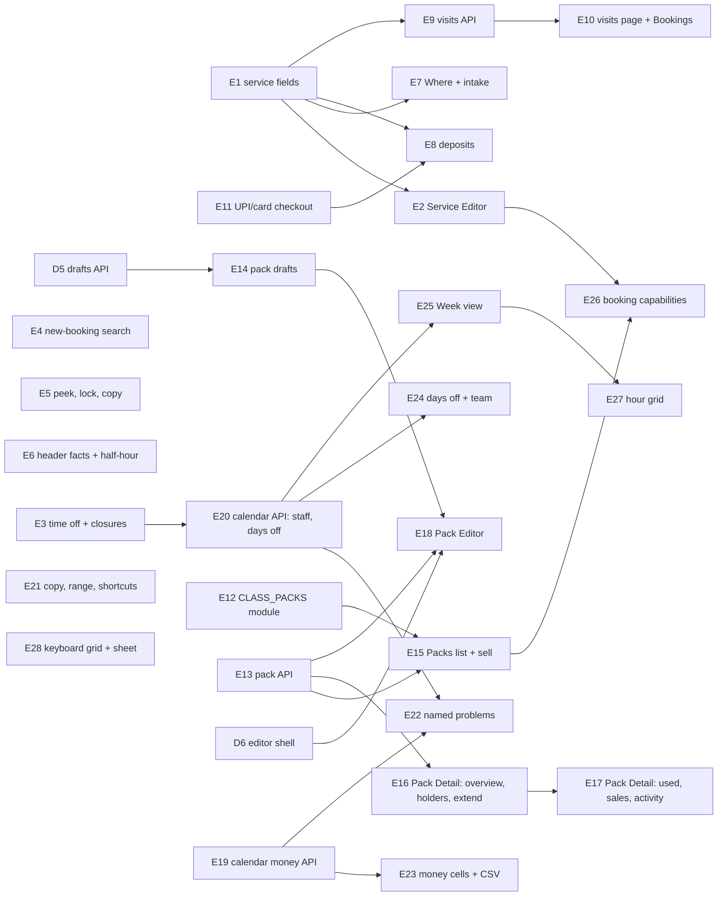

# Bookings, services, packs and calendar

## Summary

This epic brings every business that takes bookings up to the 25–26 Sep designs. The work goes in four passes:

1. **Services.** A Service Editor page with visits, "Either — they choose", a deposit and "Show on booking page". Time off gains date ranges, part-days and "Everyone — business closed". New booking finds a customer by name or phone.
2. **The public booking page.** It gains the business's facts, half-hour starts, Where, an intake note, deposits, multi-visit treatments and a wired UPI/card checkout.
3. **Class packs.** They become their own module, with kinds, first-pack-only, drafts (DEC-043), extensions, a Pack Detail page and a Pack Editor on the shared shell (D6).
4. **The Business Calendar's second pass.** It gains money in, out and due, named problems, days off, a team filter, a Week view with an hour grid for businesses with staff, and a keyboard grid.

Courses are paused (DEC-044). What a **signed-in** customer does on the booking page (credits online, buying packs, the waitlist, recognition) is in plan A (ADR-011), not here.

---

## Problem Frame

Bookings were built for Pulse Fitness: classes, weekly hours, pay now or at the desk. The designs add a clinic, Kavi Dental. A clinic's treatment is three visits of an hour, and its patients choose the clinic or a video call. It takes a deposit and asks what the dentist should know. The gym and the clinic both close for Diwali week. The service form is a single column with none of these fields.

Class packs are a table and a form with no detail page, no kind and no drafts. They sit under Appointments with no switch of their own.

The calendar's first pass (U17) reads one month of items. It shows no money, no named problems, no days off and no week.

---

## Requirements

- R1. A service carries its visits (1–12), where it happens (In person, Online, or Either — the customer chooses), what is paid at booking (Nothing, 25%, 50% or Full), whether it shows on the booking page, and a description for customers (Saroh Service Editor.dc.html).
- R2. Services are created and edited on a Service Editor page with an "At a glance" panel. Saving applies to new bookings only. Everything today's form can do stays: Delete, the time zone, buffers, capacity and per-service rules, kept under "More settings" (00-universal §15; default 42).
- R3. Time off covers a range of dates, all day or part of the day, for one person or "Everyone — business closed". The app warns about bookings already in that time. Availability, the booking page and the calendar honour closures.
- R4. New booking searches customers by name or phone (recent first, 8 shown), offers "+ Add "…" as a new customer", shows the customer's Needs attention once picked (DEC-040), and can send a pay link.
- R5. The booking peek shows Needs attention, "No phone yet", "With order #…" and "Open ‹name›'s page". A Reviewer sees a locked Bookings; copy changes to "Stop taking bookings".
- R6. The booking page shows the business's address, hours and phone; offers starts on the hour and half hour (default 41); asks Where for "Either" services; and asks "Anything we should know?". The answer is stored as a sensitive intake note on the booking, for plan C (C12) to turn into a Needs attention suggestion.
- R7. Deposits: a deposit is paid online through the existing pay-now path. A free cancellation refunds it automatically through the provider, and a late one keeps it (default 39). A pay-at-session booking's Due is the price less the deposit (default 50).
- R8. A multi-visit treatment is one order of the Appointment type with one booking per visit, invoiced once when paid (default 40). The booking page books visit 1 and "Book visit N" books the rest, from the booking page and from Bookings.
- R9. The booking page's UPI/card checkout is wired to the business's provider.
- R10. Class packs are their own module, CLASS_PACKS, which depends on Appointments. It is turned on for businesses that already have packs. "Also sell" on Services and Settings › Modules flip the same switch (default 44).
- R11. A pack has:
    - a kind (Classes or One-to-one sessions; default 45), locked once sold;
    - "first pack only";
    - validity of at least 7 days;
    - drafts and unpublished changes (DEC-043);
    - the way each sale was paid ("paid by");
    - extensions of at most 30 days each, logged (default 46);
    - an activity log.
- R12. The Packs list uses cards with kinds, and the sell dialog records the payment method. Pack Detail has Overview, Who has it (with Extend), Used this week, Sales and Activity. The Pack Editor runs on the shared editor shell.
- R13. The calendar shows money in, out and due per day for every business. Out is refunds plus provider-reported fees (default 47). A month strip opens a breakdown by kind, and "Export the month" downloads a CSV. Money reaches only a caller with the matching money read (DEC-024).
- R14. The calendar names problems ("1 renewal failed", "1 late order", "1 invoice overdue", "1 no-show", "N need you"), each with an action in the day panel.
- R15. The calendar reaches back to the month the business joined Saroh and forward 3 months; the edges say why. A day from today offers "New order" or "Book" with `?date=`. The copy says "Pick-ups", and roles without any layer read see a locked state.
- R16. Closed days and time off show on the calendar. Businesses with staff get a team filter (Everyone or one person).
- R17. A Week view (Mon–Sun) replaces Next 7 days. It has card columns for every business, and an hour grid (06:00–22:00, with an All day row) for businesses with staff.
- R18. The month grid is a keyboard grid (`role=grid`, one tab stop, arrows, Home/End, PageUp/PageDown). At narrow widths the day opens as a dialog sheet that traps and returns focus.
- R19. Clinics get a Payments layer, read from paid invoices (default 48). There is no Courses layer this round (default 49).
- R20. The capability model (DEC-039) applies to bookings and packs in E26: `service:write` is relabelled "Change services, hours, time off and booking rules" (the design's `booking:settings`, no new key), and `pack:sell` is added, implied by `pack:write`. `pack:read` covers a pack's prices and sales.

---

## Scope Boundaries

- Courses: no screens, no course money, no course layer (DEC-044). Existing course seats keep counting in capacity (`bookings/course-seats.ts`).
- Anything a signed-in customer does belongs to plan A: credits online (A10), buying packs (A11), the waitlist (A12), recognition and double-booking (A9), and moves and cancels from the account (A6).
- No rooms or resources (ADR-008). "Chair 2" in the designs is display text on the staff member or booking.
- No payouts and no expenses on the calendar (DESIGN-NOTES "Calendar, second pass").
- No per-business late rules or step names.

### Deferred to Follow-Up Work

- Courses on the calendar and online (Later, DEC-044).
- Estimating fees for providers that report none. Such payments show no fee rather than a guess.
- A Settings › Bookings page. "Also sell" and Settings › Modules share one switch until it exists.
- One-to-one packs sold online (plan A, A11, covers classes first).

---

## Context & Research

### Relevant Code and Patterns

- **Services and availability**
  - Model: `Service` in `packages/database/prisma/schema.prisma`. It has `durationMinutes`, the buffers, `capacity`, `priceCents`, `currency`, `gstRate`, `sacCode`, `timezone`, `status`, `locationType` (IN_PERSON | ONLINE) and `meetingUrl`.
  - Slot maths: `apps/api.saroh.in/src/modules/bookings/availability.ts` (`stepMinutes` spaces slot starts by duration), `booking-slots.ts` and `staff-availability.ts`.
  - Booking rules: `booking-rules.ts`, the model `BookingRules` (`bookAheadDays`, `latestBookingMinutes`, `freeCancelHours`) and the `booking-rules` controller in `modules/staff/staff.controller.ts`.
- **Staff**
  - `modules/staff/{staff.service,hours,dto}.ts`.
  - Models `StaffMember`, `StaffService`, `StaffHours` and `StaffExtraHours`.
  - `StaffTimeOff` (startAt, endAt exclusive, allDay, reason) always belongs to one staff member.
- **The bookings API**
  - `modules/bookings/bookings.controller.ts` (`organizations/:orgId/services`) and `bookings.service.ts`, which cancels with late-cancel.
  - `reservation.ts`, `booking-hold.ts` and `release-holds.handler.ts` (a pending booking holds its place for 15 minutes).
  - `use-membership.ts`, `course-seats.ts` and `appointments-open.ts`.
- **Public booking**
  - `modules/bookings/public-bookings.controller.ts` (`public/services`, `public/sites/:siteId/booking`), `public-bookings.service.ts` and `public-booking-page.ts`.
  - Renderer: `apps/saroh.app/app/[domain]/book/page.tsx` and `apps/saroh.app/lib/booking-page.ts`.
  - Flow: `packages/site-blocks/src/booking-flow/{booking-flow,model,flow-state,flow-helpers,api,summary}.tsx?`, with steps `steps/{service-step,when-step,details-step,pay-step,pay-option,paying-card,done-card,expired-card,one-to-one,sessions,step-head,field}.tsx`.
- **Paying for a booking.** ADR-008's pay-now path creates an invoice for the booking and pays it through the invoice payment intent. The webhook confirms it in `modules/webhooks/webhooks.service.ts`, and refunds go through `modules/payments/payments.service.ts` (DEC-026).
- **Class packs**
  - Models `ClassPack` (credits, validityDays, price, currency, status ACTIVE/ARCHIVED), `ClassPackService`, `PackPurchase` (terms at sale, `expiresAt`) and `PackRedemption`.
  - API: `modules/class-packs/{class-packs.controller,class-packs.service,redeem-pack,dto}.ts`.
  - App: `app/(shell)/class-packs/{page,layout,new,[packId],purchases}`, `components/class-packs/{packs-screen,purchases-screen,sell-pack-dialog,pack-form,class-packs-tabs}.tsx`, `lib/class-packs/{service,actions,balance,access}.ts` and `components/bookings/booking-pack-control.tsx`.
- **Modules.** The registry is `apps/api.saroh.in/src/modules/capabilities/module-registry.ts`, where APPOINTMENTS and COURSES show a dependent module and its flag. Readiness lives in `capabilities/readiness/module-readiness.registry.ts`, and the admin mirror in `apps/admin.saroh.in/lib/modules.ts`.
- **The workspace**
  - Services: `app/(shell)/services/{page,new,[serviceId]}`, `components/bookings/{create-service-form,edit-service-form,service-location-fields,service-gst-fields,availability-rules-editor}.tsx` and `lib/services/{service-editor,service,actions,diary,booking-state}.ts`.
  - Bookings: `app/(shell)/bookings/{page,all,availability,[bookingId]}`, `components/bookings/{new-booking-dialog,booking-detail,bookings-view,reschedule-booking,cancel-booking-control,outcome-control}.tsx`, `components/bookings/calendar/*` (`calendar-screen`, `week-view`, `booking-quick-look`, `day-by-person`, `new-booking-from-gap`) and `components/bookings/availability/*`.
- **The Business Calendar**
  - API: `modules/calendar/{calendar.controller,calendar.service,month,schedules,dto}.ts`. There is one `GET` with a month query.
  - App: `app/(shell)/calendar/page.tsx`, `components/calendar/{business-calendar,month-grid,day-panel,tones,calendar-nothing}.tsx` and `lib/calendar/{service,layers,money,types}.ts`.
- **Money reads.** `PaymentIntent.amountCents` holds the amount, and no fee is stored anywhere.
- **Permissions.** `organizations/{organization-actions,organization-policy,capability-catalogue}.ts`. Staff, hours, time off and booking rules need `service:write` (ADR-008).
- **Tests**
  - Unit: `apps/api.saroh.in/jest.config.js`, whose `testMatch` is explicit, so a new spec must be listed.
  - Integration: `*.db.spec.ts`, with the schema built by `db push`.
  - App: vitest on `lib/**`.
  - e2e: `e2e/tests/{bookings,public-booking}.spec.ts` and `e2e/permissions/permissions.spec.ts`.

### Institutional Learnings

- Availability is pure, timezone-aware geometry. Booking and rescheduling re-check capacity inside a serializable transaction under row locks (`saroh-product.md` Bookings; DEV_LEARNINGS "RLS quietly dropped Serializable").
- One lock order for every flow: Order → StockLevel → PaymentRefund → payment intent → Invoice → Booking (`backend-billing-and-classes.md`). Deposits and visits take the same order.
- An issued invoice never changes: a deposit refund is a credit note (DEC-023).
- A refund is real only when the provider confirms it, and an unsure answer holds the money (DEC-026).
- Each part of a screen follows its own read (DEC-039): a pack's prices and sales with `pack:read`, a booking's price and deposit with `booking:read`, and the Calendar's money cells with `payment:read`. Nothing inside a part is hidden from someone who holds its read.
- Demo stores are film sets. Rye and Pulse are read-only in browser checks, and writes happen on Northwind.

### External References

- None. Every layer has a local pattern.

---

## Key Technical Decisions

- **Service fields are additive columns**:
    - `visits Int @default(1)`, checked to be between 1 and 12;
    - `locationType` gains `EITHER`;
    - `depositMode` (`NONE | PERCENT_25 | PERCENT_50 | FULL`, default NONE);
    - `showOnBookingPage Boolean @default(true)`;
    - the description already exists.

  The deposit is worked out from `priceCents` on the server and never sent by the client. Existing services read as today: one visit, no deposit, shown.
- **"Either" is chosen per booking**: `Booking.locationType` records IN_PERSON or ONLINE. The meeting link shows only on an online booking.
- **A business closure is a row of its own**: `BusinessClosure(organizationId, startAt, endAt, allDay, reason)` with RLS. It is kept apart from `StaffTimeOff`, whose `staffId` stays required. Availability subtracts closures before staff windows and service rules. Time off and closures can both span a range; a part-day range repeats its hours on each day it covers, stored as one row per day in one transaction and shown as one line.
- **Half-hour starts** (default 41): slot starts snap to :00 and :30 within each window, instead of stepping by duration alone (`stepMinutes`). Capacity and overlap checks don't change.
- **Deposits ride the pay-now path** (ADR-008). A deposit booking's pending hold makes an invoice for the deposit, and the webhook confirms the booking as today. The balance is Due at the desk and shows on the calendar. A free cancel with a paid deposit issues a provider refund (DEC-026) and a credit note, both inside the cancel. The lock order is Booking last, so the refund, intent and invoice are taken before the booking. A late cancel keeps the deposit and says so.
- **Visits** (default 40): a multi-visit service booked online makes **one order** with fulfilment type Appointment (B2, DEC-045). One order line covers the whole treatment, and visit 1 is booked. Later visits are `Booking` rows linked to the order (`Booking.orderId`, `visitNumber`). The order is paid in full or by deposit. **The order invoice covers the whole treatment once** (DEC-023), and a booking of visit 2 or later is never invoiced on its own.
- **UPI/card checkout** uses the invoice payment intent's provider checkout (the pay page's client flow in `apps/saroh.app/lib/invoice-pay.ts`), embedded in `pay-step.tsx`. The amount comes from the server.
- **CLASS_PACKS is a module** (default 44) that depends on APPOINTMENTS and has a rollout flag like COURSES. Its registry entry names `pack:read`. A backfill enables it for every organization with a pack or a purchase. `/class-packs` routes and the pack controllers move from `@RequireModule("APPOINTMENTS")` to CLASS_PACKS. "Also sell" calls the same module lifecycle service as Settings › Modules (`module:manage`).
- **Pack additions**:
    - `kind` (`CLASSES | ONE_TO_ONE`, default CLASSES), refused once any purchase exists;
    - `firstPackOnly Boolean`, refused at sale when the person already holds or held this pack;
    - `validityDays ≥ 7`;
    - `PackPurchase.paidBy` (CASH | UPI | CARD | BANK | ONLINE | NONE);
    - `PackExtension(purchaseId, days ≤ 30, byUserId, reason)`, which moves `expiresAt`;
    - `PackEvent`, a log of created, published, changed, sold, extended, archived and restored.

  A ONE_TO_ONE pack redeems on one-to-one services (capacity 1). That amends ADR-008's "packs cover classes only" (default 45).
- **Pack drafts use D5's generic draft helper**: `DRAFT` status and a `pendingChanges` JSON column, with the same publish, discard and delete-draft service (DEC-043). A Draft pack is never sold, offered or redeemed. The sale, the site and the desk read only the published record.
- **Calendar money is computed on the server per item**:
    - In is paid orders, paid invoices that aren't order invoices, and paid bookings.
    - Out is refunds plus fees.
    - Due is unpaid invoices, future renewals, and each pay-at-session balance.

  Rupees are counted once (DEC-023). **Fees**: a nullable `feeCents` on `PaymentIntent` (or the attempt), filled from the provider's capture or settlement payload when it reports one, never estimated (default 47). The API leaves out money fields unless the caller holds `payment:read`. Each layer asks its own read.
- **The calendar reads a range**: `from`/`to` instead of month only, capped to the joined month (`Organization.createdAt`) and 3 months ahead. The hour grid needs start, duration and staff per item.
- **CSV export is built in the app** from the same server items, so the file and the screen agree.

### Permissions touched

| Action | Needs | Notes |
|---|---|---|
| Service fields, Service Editor, time off, closures, booking rules | `service:write` | Relabelled "Change services, hours, time off and booking rules" in E26 (the design's `booking:settings`) |
| New booking, move, cancel, deposit refund on free cancel | `booking:write` | Unchanged; the refund runs inside the cancel, no `payment:manage` asked |
| "Also sell" / CLASS_PACKS on and off | `module:manage` | Owner and Admin |
| Create, edit, publish, discard, archive and extend packs | `pack:write` | |
| Sell a pack at the desk | `pack:write` today; `pack:sell` after E26 | Implied by `pack:write` |
| Pack Detail, holders, prices and sales | `pack:read` | The whole pack, money included (DEC-039) |
| Calendar money cells and month strip | `payment:read` | The Payments scope (matrix §1 rule 3) |
| Calendar layers | `order:read` or `order:stage`, `booking:read`, `subscription:read`, `invoice:read` | Each layer asks its own |
| Needs attention on booking surfaces | C1's read; sensitive via `contact:write` until C13 | DEC-040 |

---

## Open Questions

### Resolved During Planning

- Deposits, visits, half-hour starts, the Service Editor's kept settings, auto-follow of "Show on booking page", the module, pack kind, extensions, fees, the clinic layer, no Courses layer and Due: defaults 39–50 in the overview.
- Where closures live: their own table, so `StaffTimeOff.staffId` stays required (this plan).
- "Either" per booking: recorded on the booking (this plan).

### Deferred to Implementation

- Whether a part-day range is stored as one row per day or as one row with daily hours. Choose after reading `staff-availability.ts` window building; the screen shows one line either way.
- Which Razorpay and Cashfree payload fields carry the fee (capture vs settlement), per provider.
- Exact index names and whether `Booking.orderId` needs a partial unique on `(orderId, visitNumber)`.

---

## Implementation Units

---

### E1. Service fields: visits, Either, deposit, show on booking page, description

**Goal:** Services carry the fields the Service Editor and the booking page need.

**Requirements:** R1

**Dependencies:** None

**Phase:** 1

**Files:**
- Modify: `packages/database/prisma/schema.prisma` (Service: `visits`, `depositMode`, `showOnBookingPage`; `locationType` accepts EITHER; Booking: `locationType`)
- Create: `packages/database/prisma/migrations/<ts>_service_visits_deposit/migration.sql`
- Modify: `apps/api.saroh.in/src/modules/bookings/{dto,bookings.service,public-bookings.service,public-booking-page}.ts`
- Modify: `apps/app.saroh.in/lib/services/{service,service-editor}.ts`
- Test: `apps/api.saroh.in/src/modules/bookings/bookings.service.spec.ts`, `public-booking-page.spec.ts`, `apps/app.saroh.in/lib/services/service-editor.test.ts`

**Approach:**
- Additive columns with defaults, so existing services read as today.
- Validate visits (1–12), the deposit only on a priced service, and a meeting link for ONLINE or EITHER (ADR-007's shared-credential note holds).
- The public listing leaves out services with `showOnBookingPage=false`. Staff New booking still sees them.
- Serialize the deposit amount worked out by the server (percent of `priceCents`, rounded to the paisa).

**Patterns to follow:** `service-location-fields.tsx`/`meeting-link.ts` for the online rules; `service-gst-fields.tsx` for money fields.

**Test scenarios:**
- Happy path: a new service with 3 visits and a 50% deposit round-trips. The public page shows it with its deposit.
- Edge case: an existing service reads 1 visit, no deposit, shown.
- Edge case: a hidden service is left out of `public/services`, but still offered in New booking.
- Error path: 13 visits, or a deposit on an unpriced service → 400 with a sentence.
- Error path: another business's service → 404.
- Integration: `db:verify:replay` passes.

**Verification:** The API serves the new fields, and nothing changes for existing services.

---

### E2. Service Editor page and service cards

**Goal:** Services are created and edited on their own page, which replaces the dialog forms.

**Requirements:** R1, R2, R5 (copy)

**Dependencies:** E1

**Phase:** 1

**Files:**
- Create: `apps/app.saroh.in/components/services/service-editor/{service-editor,at-a-glance,visits-field,where-field,deposit-field,more-settings}.tsx`
- Modify: `apps/app.saroh.in/app/(shell)/services/new/page.tsx`, `services/[serviceId]/page.tsx`, `services/page.tsx`
- Modify / retire: `components/bookings/{create-service-form,edit-service-form}.tsx` (their fields move into the editor)
- Modify: `apps/app.saroh.in/lib/services/service-editor.ts`
- Test: `apps/app.saroh.in/lib/services/service-editor.test.ts`, `e2e/tests/bookings.spec.ts`

**Approach:**
- Follow Saroh Service Editor.dc.html:
    - name, what to tell customers, and kind (hidden for a business without classes);
    - each visit's length and the gap after, then visits or places;
    - where, price, and what is paid at booking (the split worked out and shown);
    - who takes it, "Show on booking page", and Stop / Take bookings again.
- "At a glance" shows the price per visit, the time needed, and booked this week and still to come.
- "Saving applies to new bookings only" is said beside Save.
- **More settings** (default 42) keeps the time zone, buffer before, capacity, per-service availability rules, GST fields and Delete.
- The currency is the business's. Without `service:write`, fields are disabled and the header reads "View only".
- The service cards say "Stop taking bookings", "3 visits of 60 min", "Online" and "No booking page yet".

**Patterns to follow:** the product editor's per-section save (`components/commerce/product-editor-v2/editor-shell.tsx`); four-scenes skill for phone layout.

**Test scenarios:**
- Happy path (e2e, Northwind): create a service with visits and a deposit; it appears on Services with the new card copy.
- Edge case: a Member opens a service and every field is disabled, with "View only".
- Edge case: the time zone and rules edited under More settings save as before.
- Error path: leaving with unsaved changes asks first.

**Verification:** Side by side with Saroh Service Editor.dc.html. Every control the old forms had has a place (§15).

---

### E3. Time off ranges, part-days, and business closed

**Goal:** Time off spans dates, part of the day, and the whole business.

**Requirements:** R3

**Dependencies:** None

**Phase:** 1

**Files:**
- Modify: `packages/database/prisma/schema.prisma` (`BusinessClosure`)
- Create: `packages/database/prisma/migrations/<ts>_business_closure/migration.sql`
- Modify: `apps/api.saroh.in/src/modules/staff/{staff.service,staff.controller,dto,hours}.ts`, `modules/bookings/{staff-availability,booking-slots,availability}.ts`
- Modify: `apps/app.saroh.in/components/bookings/availability/{availability-editor,weekly-hours}.tsx`, `apps/app.saroh.in/lib/staff/{service,actions,types}.ts`
- Create: `apps/app.saroh.in/components/bookings/availability/time-off-dialog.tsx`
- Test: `apps/api.saroh.in/src/modules/staff/staff.db.spec.ts`, `modules/bookings/availability.spec.ts`, `staff.service.spec.ts`

**Approach:**
- The dialog has From and To dates (up to the end of the year), All day or a time range, and "Just ‹person›" or "Everyone — business closed".
- Before saving, the API returns the confirmed bookings inside the range, and the dialog lists them as a warning ("3 bookings in this time").
- Nothing is cancelled automatically.
- A closure subtracts from every service's and every person's windows, services with no staff included.
- A range shows as one line ("2 Nov – 6 Nov · 5 days · all day · business closed").
- Writes need `service:write` (ADR-008).

**Patterns to follow:** `StaffTimeOff` writes in `staff.service.ts`; RLS from `20260923150000_products_v2`.

**Test scenarios:**
- Happy path: a closure for 2–6 Nov removes every slot on those days for all services.
- Happy path: a part-day range (14:00–18:00, 3 days) removes only those hours.
- Edge case: a closure over a DST change in a non-India zone still removes whole local days.
- Edge case: a range with existing bookings returns them. Saving keeps the bookings.
- Error path: To before From → 400. Another business's staff → 404.
- Integration: the public booking page offers no slot inside a closure.

**Verification:** The Availability screen shows ranges as one line, and the booking page honours them.

---

### E4. New booking: customer search, add new, pay link, Needs attention

**Goal:** Staff find or add the customer quickly, see what needs attention, and can send a pay link.

**Requirements:** R4

**Dependencies:** C1 (for Needs attention; the search ships without it), B11 (pay link pattern)

**Phase:** 1

**Files:**
- Modify: `apps/app.saroh.in/components/bookings/new-booking-dialog.tsx`
- Create: `apps/app.saroh.in/components/bookings/customer-picker.tsx`
- Modify: `apps/api.saroh.in/src/modules/contacts/contacts.service.ts` (search by normalised phone, recent first)
- Test: `apps/api.saroh.in/src/modules/contacts/contacts.service.spec.ts`, `e2e/tests/bookings.spec.ts`

**Approach:**
- Search by name or phone. Results are ordered by last booking or payment, 8 at most.
- "+ Add "…" as a new customer" makes a contact from the typed name or phone.
- Once a customer is picked, their Needs attention entries show; sensitive entries only reach a caller with the sensitive permission (C1).
- For a priced booking, "Send a pay link" issues the booking's invoice and copies its pay link (ADR-007's link path). Nothing is sent by Saroh until A14 or D17.

**Patterns to follow:** `lib/customers/directory.ts` normalisation; the pay link component `components/invoices/pay-link.tsx`.

**Test scenarios:**
- Happy path: typing the last 4 digits of a phone finds the customer.
- Edge case: a new name makes a contact, and the booking is linked to it.
- Edge case: a Member sees an Allergy entry, and does not see a Medical (sensitive) one.
- Error path: the search fails → "Couldn't search customers — try again", and the typed name can still be added.

**Verification:** Side by side with Saroh Bookings.dc.html New booking.

---

### E5. Booking peek extras, Reviewer lock, calendar copy

**Goal:** The peek and the Bookings screens match the design's extra rows and states.

**Requirements:** R5

**Dependencies:** C1 (Needs attention row)

**Phase:** 1

**Files:**
- Modify: `apps/app.saroh.in/components/bookings/calendar/{booking-quick-look,calendar-screen,parts}.tsx`, `components/bookings/bookings-view.tsx`, `app/(shell)/bookings/layout.tsx`
- Test: `e2e/tests/bookings.spec.ts`

**Approach:**
- The peek shows Needs attention, "No phone yet — add it on their page", "With order #…" for paid visits, and "Open ‹name›'s page".
- Week totals cover the whole week. The legend follows the business (Class only where classes exist).
- A Reviewer (no `booking:read`) gets the locked card, not an error.
- Copy follows the design.

**Test scenarios:**
- Happy path: the peek for a booking with an order shows the order link.
- Edge case: a Reviewer opening `/bookings` sees the locked card.
- Edge case: a business without classes shows no Class legend.

**Verification:** Side by side with Saroh Bookings.dc.html in all four scenes.

---

### E6. Booking page header facts and half-hour starts

**Goal:** The booking page shows who the business is, and offers starts on the hour and half hour.

**Requirements:** R6

**Dependencies:** None

**Phase:** 2 (default 41)

**Files:**
- Modify: `apps/api.saroh.in/src/modules/bookings/{public-booking-page,availability}.ts`
- Modify: `packages/site-blocks/src/booking-flow/{booking-flow,summary}.tsx`, `steps/step-head.tsx`, `apps/saroh.app/lib/booking-page.ts`
- Test: `apps/api.saroh.in/src/modules/bookings/{availability,public-booking-page}.spec.ts`, `packages/site-blocks/src/booking-flow/booking-flow.test.tsx`

**Approach:**
- The public booking page read adds the business's address (the registered address, DEC-029), its opening hours (DEC-034) and its public phone.
- These are an explicit allow-list, and personal fields never appear.
- `stepMinutes` snaps starts to :00/:30 within each window. A service longer than 30 minutes still needs its whole length free.

**Test scenarios:**
- Happy path: a 60-minute service in a 09:00–12:00 window offers 09:00, 09:30, … up to 11:00.
- Edge case: a 20-minute service offers :00 and :30 only.
- Edge case: a business with no hours shows no hours line (not "Closed").

**Verification:** Book Kavi Dental's header matches the design; Pulse's slots are unchanged except for the added half hours.

---

### E7. Booking page: Where and "Anything we should know?"

**Goal:** "Either" services ask where, and every booking can carry an intake note.

**Requirements:** R6

**Dependencies:** E1

**Phase:** 1

**Files:**
- Modify: `packages/database/prisma/schema.prisma` (`Booking.intakeNote String?`, `Booking.locationType`)
- Modify: `apps/api.saroh.in/src/modules/bookings/{public-bookings.service,reservation,dto,bookings.service}.ts`
- Modify: `packages/site-blocks/src/booking-flow/steps/{details-step,done-card}.tsx`, `model.ts`
- Test: `apps/api.saroh.in/src/modules/bookings/public-bookings.service.spec.ts`, `public-booking.db.spec.ts`

**Approach:**
- "Where" (At the clinic / Video call) is asked only for EITHER. The confirmation says where it happens.
- "Anything we should know?" (medicines, allergies, pregnancy, nerves) is optional and at most 1,000 characters.
- It is stored on the booking as sensitive: it is served only to a caller with the sensitive permission (C1's gate), never in list reads, and redacted from logs.
- C12 turns it into a Needs attention suggestion.

**Test scenarios:**
- Happy path: an Either service booked as Video call records ONLINE and shows the meeting link on confirmation.
- Edge case: an In person service never asks Where.
- Edge case: a Member reading the booking gets no intake note.
- Error path: 1,001 characters → 400.

**Verification:** Book Kavi Dental's details step matches the design.

---

### E8. Deposits

**Goal:** A service's deposit is paid online. A free cancellation refunds it, and a late one keeps it.

**Requirements:** R7

**Dependencies:** E1, E11

**Phase:** 2 (defaults 39, 50)

**Files:**
- Modify: `apps/api.saroh.in/src/modules/bookings/{public-bookings.service,reservation,bookings.service,booking-rules}.ts`
- Modify: `apps/api.saroh.in/src/modules/invoices/invoices.service.ts` (a deposit invoice source), `modules/payments/payments.service.ts`
- Modify: `packages/site-blocks/src/booking-flow/steps/{pay-step,pay-option}.tsx`, `summary.tsx`
- Modify: `apps/app.saroh.in/components/bookings/{booking-detail,cancel-booking-control}.tsx`
- Test: `apps/api.saroh.in/src/modules/bookings/public-booking.db.spec.ts`, `bookings.service.spec.ts`, `e2e/tests/public-booking.spec.ts`

**Approach:**
- The pay step offers "Pay ₹X deposit now" or "Pay the full ₹Y now", and "Pay at the clinic" only when the deposit is NONE.
- The pending booking and its deposit invoice follow ADR-008's pay-now path. The balance is Due on the booking.
- On a staff or customer cancel inside the free window:
    - lock in the documented order;
    - request a provider refund for the deposit under DEC-026, with Saroh's reference;
    - have the credit note follow the refund.
- A late cancel keeps the deposit, records `cancelledLate`, and the dialog says "The deposit is kept".
- Booking detail shows "Deposit ₹X paid · ₹Y due at the clinic".

**Test scenarios:**
- Happy path: book with a 50% deposit, and the webhook confirms the booking with ₹Y due.
- Happy path: cancel within the free window → a refund PENDING then SUCCEEDED, and a credit note.
- Edge case: cancel after the window → no refund, and the deposit stays.
- Edge case: the provider times out on the refund → the refund is held PENDING and the merchant is told it is being confirmed (DEC-026).
- Error path: a client-sent amount is ignored.
- Integration: a refund racing an expiring hold doesn't deadlock (lock order).

**Verification:** Kavi Dental's flow works end to end on the fake provider.

---

### E9. Visits: a treatment is one order with a booking per visit (API)

**Goal:** A multi-visit service is sold once and booked visit by visit.

**Requirements:** R8

**Dependencies:** E1, B2 (Appointment fulfilment type)

**Phase:** 2 (default 40)

**Files:**
- Modify: `packages/database/prisma/schema.prisma` (`Booking.orderId`, `Booking.visitNumber`)
- Create: `packages/database/prisma/migrations/<ts>_booking_visits/migration.sql`
- Create: `apps/api.saroh.in/src/modules/bookings/visits.ts`
- Modify: `apps/api.saroh.in/src/modules/bookings/{public-bookings.service,bookings.service,reservation}.ts`, `modules/orders/orders.service.ts`
- Test: `apps/api.saroh.in/src/modules/bookings/visits.db.spec.ts`

**Approach:**
- Booking a multi-visit service creates an order (Appointment in person or online, by the booking's location) with one line for the treatment, and visit 1's booking linked to it.
- Payment (in full or deposit) is on the order, invoiced once (DEC-023).
- `bookVisit(orderId, n)` books the next visit under the same capacity rules. It is refused past `visits`, or before the previous visit.
- Cancelling a visit frees its slot and leaves the order.
- Money isn't refunded per visit; refunds go through the order's refund (B9).

**Test scenarios:**
- Happy path: a 3-visit root canal paid in full → an order, one invoice, visit 1 booked. Visit 2 is booked later with no new invoice.
- Edge case: visit 4 of 3 → 409 "All 3 visits are booked".
- Edge case: visit 3 before visit 2 → 409.
- Error path: another business's order → 404.
- Integration: the order invoice exists once, however many visits are booked.

**Verification:** DENT_ORDERS in the fixtures can be reproduced on Northwind.

---

### E10. Visits on the booking page and in Bookings

**Goal:** Customers and staff see a treatment as its visits and book the next one.

**Requirements:** R8

**Dependencies:** E9

**Phase:** 2

**Files:**
- Modify: `packages/site-blocks/src/booking-flow/{booking-flow,summary}.tsx`, `steps/{service-step,done-card}.tsx`
- Modify: `apps/app.saroh.in/components/bookings/{booking-detail,new-booking-dialog}.tsx`, `components/bookings/calendar/booking-quick-look.tsx`
- Test: `packages/site-blocks/src/booking-flow/booking-flow.test.tsx`, `e2e/tests/bookings.spec.ts`

**Approach:**
- The booking page says "3 visits · 60 min each", "Pay the full ₹Y for all 3 visits now", and after booking, "Visit 1 booked · book the others later".
- Booking detail and the peek show "Visit 2 of 3" with "Book visit 3". It opens New booking prefilled with the service, the customer and the order.
- The Visits card on Order Detail is B14.

**Test scenarios:**
- Happy path: from visit 1's booking, "Book visit 2" books against the same order.
- Edge case: all visits booked → the action is gone and "All visits booked" shows.

**Verification:** Side by side with Book Kavi Dental and Saroh Bookings.

---

### E11. UPI/card checkout on the booking page

**Goal:** Pay now takes a real payment through the business's provider.

**Requirements:** R9

**Dependencies:** None

**Phase:** 1

**Files:**
- Modify: `packages/site-blocks/src/booking-flow/steps/{pay-step,paying-card,expired-card}.tsx`, `api.ts`
- Modify: `apps/saroh.app/lib/{booking-page,invoice-pay}.ts`, `apps/saroh.app/app/[domain]/book/page.tsx`
- Test: `packages/site-blocks/src/booking-flow/booking-flow.test.tsx`, `e2e/tests/public-booking.spec.ts`

**Approach:**
- After the hold, start the provider checkout for the booking's invoice intent (the pay page's flow). Show "Paying…" until the webhook confirms it, "Expired" when the hold lapses, and a retry on failure.
- Offer only what the provider supports (UPI, card).
- With no provider connected, Pay now isn't offered, as today.

**Test scenarios:**
- Happy path (fake provider): pay → confirmed.
- Edge case: the hold expires mid-payment → the expired card, and the place is released.
- Error path: the provider refuses → "The payment didn't go through — try again", and the hold is kept.

**Verification:** Pulse's pay-now completes against the fake provider in e2e.

---

### E12. Class packs module and "Also sell"

**Goal:** Class packs switch on and off on their own, from Services or Settings.

**Requirements:** R10

**Dependencies:** None

**Phase:** 2 (default 44)

**Files:**
- Modify: `apps/api.saroh.in/src/modules/capabilities/module-registry.ts` (CLASS_PACKS, depends APPOINTMENTS, flag), `capabilities/readiness/module-readiness.registry.ts`, `apps/admin.saroh.in/lib/modules.ts`
- Modify: `apps/api.saroh.in/src/modules/class-packs/class-packs.controller.ts` (`@RequireModule("CLASS_PACKS")`)
- Create: `packages/database/src/backfill/<ts>-class-packs-module.ts`
- Modify: `apps/app.saroh.in/app/(shell)/services/page.tsx` ("Also sell" card), rail/nav config for `/class-packs`, `components/modules/module-list.tsx`
- Test: `apps/api.saroh.in/src/modules/capabilities/module-registry.spec.ts` (or its existing spec), `packages/database/src/backfill/class-packs-module.db.spec.ts`, `module-annotations.spec.ts`

**Approach:**
- The new module key has a rollout flag added in each environment (runbook MODULE_ROLLOUT).
- The idempotent backfill enables it where packs or purchases exist.
- "Also sell" (owners only, `module:manage`) toggles Courses and Class packs through `ModuleLifecycleService`.
- Turning packs off keeps every pack and purchase, and redemptions already made stay (DEC-016).

**Test scenarios:**
- Happy path: Pulse (has packs) sees Packs after the backfill; Kavi Dental (none) doesn't.
- Edge case: turning off hides `/class-packs` and refuses new sales. Existing bookings paid with a pack keep "Paid with …".
- Error path: turning CLASS_PACKS on with Appointments off → refused with a sentence.
- Integration: the backfill run twice changes nothing.

**Verification:** Settings › Modules and "Also sell" show the same state.

---

### E13. Pack API: kind, first-only, validity, paid-by, extensions, activity, reads

**Goal:** The pack model carries what the Packs, Pack Detail and Pack Editor designs show.

**Requirements:** R11

**Dependencies:** None (drafts are E14)

**Phase:** 2 (defaults 45, 46)

**Files:**
- Modify: `packages/database/prisma/schema.prisma` (`ClassPack.kind`, `firstPackOnly`; `PackPurchase.paidBy`; `PackExtension`; `PackEvent`)
- Create: `packages/database/prisma/migrations/<ts>_pack_kind_extensions/migration.sql`
- Modify: `apps/api.saroh.in/src/modules/class-packs/{class-packs.service,class-packs.controller,redeem-pack,dto}.ts`
- Test: `apps/api.saroh.in/src/modules/class-packs/{class-packs.service.spec,class-packs.db.spec,dto.spec}.ts`

**Approach:**
- The kind is refused as a change once a purchase exists. Validity must be at least 7 days.
- First-only is checked at sale under the contact's purchases.
- `extend(purchaseId, days ≤ 30, reason)` writes a PackExtension and a PackEvent and moves `expiresAt`. An expired pack can be extended too.
- A ONE_TO_ONE pack is offered for one-to-one services only, and CLASSES for classes only (`redeem-pack.ts`).
- New reads:
    - `GET class-packs/:id` gives the overview: holders, credits left in total, and sold this month;
    - `…/holders`;
    - `…/used?from&to`;
    - `…/sales`;
    - `…/events`.
- Money fields are included only with `payment:read` or `invoice:read`.

**Test scenarios:**
- Happy path: sell with `paidBy=UPI`; the Sales read shows the method.
- Happy path: extend by 14 days → `expiresAt` moves, and an event is written.
- Edge case: changing the kind after a sale → 409.
- Edge case: first-only when the person held it before → 409 "Only for a first pack".
- Edge case: a one-to-one pack isn't offered for a class.
- Error path: extending by 31 days → 400. Validity 6 → 400.
- Edge case: a caller with `pack:read` gets holders and prices; one without it gets 403.

**Verification:** The reads return what Saroh Pack Detail.dc.html needs.

---

### E14. Pack drafts

**Goal:** Packs can be drafts, and a live pack can hold unpublished changes (DEC-043).

**Requirements:** R11

**Dependencies:** D5 (the generic draft helper)

**Phase:** 1

**Files:**
- Modify: `packages/database/prisma/schema.prisma` (`ClassPack.status` accepts DRAFT; `pendingChanges Json?`)
- Modify: `apps/api.saroh.in/src/modules/class-packs/{class-packs.service,class-packs.controller,dto}.ts`
- Test: `apps/api.saroh.in/src/modules/class-packs/class-packs.db.spec.ts`

**Approach:**
- Plug packs into D5's helper: autosave to the draft or to `pendingChanges`, then Publish, Publish changes, Discard, or Delete draft.
- Sale, the site and the desk read only published fields and refuse DRAFT.
- A kind change in pending changes is refused once sold (E13's rule, checked at publish too).
- Publishing a new price keeps existing purchases on their terms (PackPurchase stores them).

**Test scenarios:**
- Happy path: a new pack saved as a draft → not sellable → Publish → sellable.
- Happy path: a live pack's price changed in pending changes → sales still use the old price until Publish changes.
- Edge case: Discard restores the published view. Delete draft removes a never-published pack.
- Error path: selling a DRAFT → 409.

**Verification:** The shared draft contract tests (from D5) pass for packs.

---

### E15. Packs list cards and sell dialog

**Goal:** Packs match the design's cards and sell dialog.

**Requirements:** R12

**Dependencies:** E12, E13

**Phase:** 2

**Files:**
- Modify: `apps/app.saroh.in/components/class-packs/{packs-screen,sell-pack-dialog,class-packs-tabs,purchases-screen}.tsx`, `lib/class-packs/{service,actions,access}.ts`
- Test: `apps/app.saroh.in/lib/class-packs/balance.test.ts`, `e2e/tests/` (new `class-packs.spec.ts`)

**Approach:**
- Cards show:
    - the kind, credits, validity, price, "First pack only" and Draft or "Changes not published";
    - holders and credits left.
- The sell dialog adds "Paid by" and states "Books nothing · invoice ₹X" only when Payments is on (`GET class-packs/selling`).
- The memberships section links to Plans (plan D).
- Draft cards open the editor.

**Test scenarios:**
- Happy path (e2e, Northwind): sell a pack with UPI; it appears under Who holds one.
- Edge case: Payments off → no invoice wording.
- Edge case: a Draft pack has no Sell button.

**Verification:** Side by side with Saroh Packs.dc.html.

---

### E16. Pack Detail: Overview, Who has it, Extend

**Goal:** A pack gets its own page.

**Requirements:** R12

**Dependencies:** E13

**Phase:** 2

**Files:**
- Create: `apps/app.saroh.in/app/(shell)/class-packs/[packId]/page.tsx` (and its `loading`, `error`, `not-found`), `components/class-packs/pack-detail/{pack-detail,overview,holders-tab,extend-dialog}.tsx`
- Modify: `apps/app.saroh.in/lib/class-packs/service.ts`
- Test: `e2e/tests/class-packs.spec.ts`

**Approach:**
- Tabs that scroll on phones.
- Overview has cards linking to the tabs.
- Who has it: each holder, credits left, expiry, "Extend" (≤ 30 days, with a reason), and "Open ‹name›".
- The failed, empty and locked states follow the product-states skill.

**Test scenarios:**
- Happy path: extend a holder by 7 days; the expiry updates and the Activity count rises.
- Edge case: a pack nobody holds shows the empty state with "Sell this pack".
- Error path: the holders read fails → a named notice in that tab only.

**Verification:** Side by side with Saroh Pack Detail.dc.html.

---

### E17. Pack Detail: Used this week, Sales, Activity

**Goal:** The remaining three tabs of Pack Detail.

**Requirements:** R12

**Dependencies:** E16

**Phase:** 2

**Files:**
- Create: `apps/app.saroh.in/components/class-packs/pack-detail/{used-tab,sales-tab,activity-tab}.tsx`
- Test: `e2e/tests/class-packs.spec.ts`

**Approach:**
- Used this week lists redemptions by day, with the class and person.
- Sales shows each sale with its method, amount and who sold it (`pack:read` covers them).
- Activity reads `PackEvent`.

**Test scenarios:**
- Happy path: a redemption booked today shows under Used this week.
- Edge case: a Sales row sold at the desk with no payment shows "None" as the method.

**Verification:** Side by side with Saroh Pack Detail.dc.html.

---

### E18. Pack Editor

**Goal:** Packs are created and edited on the shared editor shell.

**Requirements:** R11, R12

**Dependencies:** D6, E13, E14

**Phase:** 2

**Files:**
- Create: `apps/app.saroh.in/components/class-packs/pack-editor/{pack-editor,validity-chips,services-picker}.tsx`
- Modify: `apps/app.saroh.in/app/(shell)/class-packs/new/page.tsx`, `class-packs/[packId]/edit/page.tsx`
- Retire: `apps/app.saroh.in/components/class-packs/pack-form.tsx`
- Test: `e2e/tests/class-packs.spec.ts`

**Approach:**
- The editor runs on D6's shell: autosave, the banner, Publish or Publish changes, Discard, Delete draft, and a leave guard.
- Fields:
    - name, kind (locked once sold, saying why), credits and price;
    - "Use within" chips with a minimum of 7 days;
    - the services it covers, filtered by kind;
    - first-only and description.

**Test scenarios:**
- Happy path (e2e): create → autosaves as a draft → Publish → it appears on Packs.
- Edge case: on a sold pack, the kind is disabled with the reason.
- Error path: validity under 7 → an inline error, and Publish is off.

**Verification:** Side by side with Saroh Pack Editor.dc.html.

---

### E19. Calendar API: money in, out and due

**Goal:** Each calendar item and day carries its money, and fees are stored when reported.

**Requirements:** R13

**Dependencies:** None

**Phase:** 2 (default 47)

**Files:**
- Modify: `packages/database/prisma/schema.prisma` (`PaymentIntent.feeCents Int?`)
- Create: `packages/database/prisma/migrations/<ts>_payment_fee/migration.sql`
- Modify: `apps/api.saroh.in/src/modules/webhooks/providers/{razorpay,cashfree}.webhook.ts`, `webhooks/webhooks.service.ts` (record the fee when present)
- Modify: `apps/api.saroh.in/src/modules/calendar/{calendar.service,month,dto}.ts`
- Test: `apps/api.saroh.in/src/modules/calendar/{calendar.service.spec,calendar.db.spec,month.spec}.ts`

**Approach:**
- Each item gets `in`, `out` and `due` in minor units.
- Day and range totals count rupees once (orders plus non-order invoices; order invoices are left out, DEC-023).
- Failed renewals are totalled apart ("₹1,800 failed").
- Money fields are omitted unless the caller holds `payment:read`.
- The fee is taken from the provider payload's fee field when present.

**Test scenarios:**
- Happy path: a paid order + a refund + a reported fee → the day shows in, out = refund + fee.
- Edge case: an order and its invoice count once.
- Edge case: a caller without `payment:read` gets the calendar's items without the money cells (the Payments part), and their bookings with their prices (the Bookings part).
- Edge case: a provider payload with no fee → fee null, and Out = refunds only.
- Integration: `db:verify:replay` passes.

**Verification:** Totals for a seeded Northwind month match a hand sum.

---

### E20. Calendar API: staff, durations, clinic payments, late and no-show, days off, joined date, from/to

**Goal:** The calendar read carries what the hour grid, team filter, days off and range limits need.

**Requirements:** R15, R16, R17, R19

**Dependencies:** E3

**Phase:** 2 (default 48)

**Files:**
- Modify: `apps/api.saroh.in/src/modules/calendar/{calendar.controller,calendar.service,schedules,dto}.ts`
- Test: `apps/api.saroh.in/src/modules/calendar/{calendar.service.spec,calendar.db.spec}.ts`

**Approach:**
- The query takes `from`/`to` and is refused outside the joined month through 3 months ahead.
- Each item carries `staffId`, `durationMinutes` and flags (late, no-show, cancelled, failed).
- A Payments layer reads paid invoices for businesses without orders.
- The read also returns:
    - days off: closures and each staff member's time off, with names only for callers with `booking:read`;
    - the business's `joinedAt`;
    - `hasStaff`.

**Test scenarios:**
- Happy path: a week query returns bookings with staff and durations, plus closures.
- Edge case: a request before the joined month → 400 with the earliest month.
- Edge case: the clinic (no orders) has its Payments layer from invoices.
- Error path: a caller with none of the layer reads gets a 403 that the app shows as locked.

**Verification:** The data is enough to draw the Week hour grid for Pulse.

---

### E21. Calendar: copy, locked state, range limits, create from a day

**Goal:** The calendar's first-pass gaps that need no new data.

**Requirements:** R15

**Dependencies:** None (range limits use `joinedAt` once E20 lands; until then `Organization.createdAt` from the existing read)

**Phase:** 1

**Files:**
- Modify: `apps/app.saroh.in/components/calendar/{business-calendar,month-grid,day-panel,calendar-nothing,tones}.tsx`, `apps/app.saroh.in/lib/calendar/{layers,types}.ts`
- Test: `apps/app.saroh.in/lib/calendar/layers.test.ts`

**Approach:**
- The copy says "Pick-ups", and invoices get their own tone.
- The locked-by-role state is a card.
- ‹ › stop at the edges and say why. Days outside the range are muted.
- A day from today offers "New order" (with Commerce) or "Book" (with Appointments), opening with `?date=`.

**Test scenarios:**
- Happy path: clicking "Book" on the 20th opens Bookings on that date.
- Edge case: the month before joining has ‹ disabled, with "Saroh has your data from June 2026".
- Edge case: a role without any read sees the locked card.

**Verification:** Side by side with Saroh Business Calendar.dc.html (month view).

---

### E22. Calendar: named problems with actions

**Goal:** Days say what is wrong, and the day panel offers the fix.

**Requirements:** R14

**Dependencies:** E19, E20; the actions reuse D13 (Retry), D17 (Send a reminder) and order links

**Phase:** 2

**Files:**
- Modify: `apps/app.saroh.in/components/calendar/{month-grid,day-panel}.tsx`, `lib/calendar/layers.ts`
- Test: `apps/app.saroh.in/lib/calendar/layers.test.ts`

**Approach:**
- One chip per day: "1 renewal failed", "1 late order", "1 invoice overdue", "1 no-show", or "N need you" when mixed.
- The day panel lists each with its action: Retry charge (hidden until D13), Send a reminder (hidden until D17), Open order, Open booking.
- An action the caller can't take is not shown.

**Test scenarios:**
- Happy path: a day with an overdue invoice shows the chip and "Open invoice".
- Edge case: mixed problems → "2 need you".

**Verification:** Side by side with the design's day panel.

---

### E23. Calendar: money cells, month strip, CSV

**Goal:** Money shows per day, per month and in an export.

**Requirements:** R13

**Dependencies:** E19

**Phase:** 2

**Files:**
- Modify: `apps/app.saroh.in/components/calendar/{month-grid,day-panel,business-calendar}.tsx`, `lib/calendar/money.ts`
- Create: `apps/app.saroh.in/lib/calendar/export.ts`
- Test: `apps/app.saroh.in/lib/calendar/export.test.ts`

**Approach:**
- Cells show "+₹in" and "−₹out".
- The strip reads "In so far · Out so far · Net · Due", with "so far" only on the current month, and each part opens a breakdown by kind.
- "Export the month" writes date, kind, what, in, out, due.
- None of this renders without `payment:read`; the API left the fields out.

**Test scenarios:**
- Happy path: the CSV rows sum to the strip.
- Edge case: a past month drops "so far".
- Edge case: a viewer without `payment:read` sees no strip and no money cells.

**Verification:** Side by side with the design's month strip.

---

### E24. Calendar: days off and team filter

**Goal:** Closed days, time off and a filter to one person.

**Requirements:** R16

**Dependencies:** E20

**Phase:** 2

**Files:**
- Modify: `apps/app.saroh.in/components/calendar/{business-calendar,month-grid,day-panel}.tsx`, `lib/calendar/layers.ts`
- Test: `apps/app.saroh.in/lib/calendar/layers.test.ts`

**Approach:**
- Days read "Closed", "Dr. Pillai off" or "2 off", and are striped when closed or when the filtered person is off.
- The team filter (Everyone or one person) shows only when the business has staff, and narrows the items.

**Test scenarios:**
- Happy path: filtering to one dentist hides the other's bookings and stripes their day off.
- Edge case: a business with no staff shows no filter.

**Verification:** Side by side with the design.

---

### E25. Calendar: Week view (card columns)

**Goal:** Month | Week, with a Mon–Sun week of card columns for every business.

**Requirements:** R17

**Dependencies:** E20

**Phase:** 2

**Files:**
- Create: `apps/app.saroh.in/components/calendar/week-columns.tsx`
- Modify: `apps/app.saroh.in/components/calendar/business-calendar.tsx`, `lib/calendar/{layers,service}.ts`
- Test: `apps/app.saroh.in/lib/calendar/layers.test.ts`, `e2e/tests/` (calendar spec)

**Approach:**
- ‹ › step by week, with a "This week" button and the title "14–20 Sep 2026".
- Each column shows money in and out, "off" or closed, the problem chip, and time-ordered cards that open their record.
- A day header opens the day panel.
- The layers and the team filter apply.

**Test scenarios:**
- Happy path: the week of the 14th shows Rye's pick-ups by time.
- Edge case: a week crossing a month loads both halves.

**Verification:** Side by side with the design's Week view for Rye.

---

### E26. Booking capabilities: `service:write` relabelled and `pack:sell`

**Goal:** Apply the capability model to bookings and packs (DEC-039; matrix §2, answers 6 and 7).

**Requirements:** R20

**Dependencies:** E2, E15. Decided by the capability model; whether Members hold `pack:read` and `pack:sell` by default is F18's (matrix Q1), not this unit's.

**Phase:** 2

**Files:**
- Modify: `apps/api.saroh.in/src/modules/organizations/{organization-actions,organization-policy,capability-catalogue}.ts`, `modules/class-packs/class-packs.service.ts`, `modules/staff/staff.service.ts`, `modules/bookings/bookings.service.ts`
- Modify: `apps/app.saroh.in/lib/class-packs/access.ts`, the Service Editor's read-only rule
- Test: `apps/api.saroh.in/src/modules/organizations/capability-catalogue.spec.ts`, `e2e/permissions/permissions.spec.ts`

**Approach:**
- Relabel `service:write` "Change services, hours, time off and booking rules"; no `booking:settings` key (one power, one key).
- Add `pack:sell`, held by Owner and Admin, implied by `pack:write`, and implying `pack:read`. The sell endpoint asks `pack:sell`.
- `pack:read` serves the whole pack, prices and sales included; the money-free pack projection is removed.
- `booking:write` and `service:write` imply their reads.
- Every endpoint gets a row in the permissions matrix e2e.

**Test scenarios:**
- Happy path: a custom role with `pack:sell` only can sell and can't edit.
- Edge case: an existing custom role with `pack:write` still sells (implied).
- Edge case: a custom role with `pack:read` sees Pack Detail's Sales with amounts.

**Verification:** The permissions e2e covers every booking and pack endpoint.

---

### E27. Calendar: Week hour grid for businesses with staff

**Goal:** Pulse and Kavi Dental see their week as an hour grid.

**Requirements:** R17

**Dependencies:** E25

**Phase:** 2

**Files:**
- Create: `apps/app.saroh.in/components/calendar/week-hour-grid.tsx`, `apps/app.saroh.in/lib/calendar/hour-layout.ts`
- Test: `apps/app.saroh.in/lib/calendar/hour-layout.test.ts`

**Approach:**
- The grid runs 06:00–22:00 at 44px an hour, with an All day row for renewals, invoices and payments.
- Blocks are placed by start and duration, side by side when they overlap (a pure layout function).
- Hours outside working time are shaded. A day off or a closed day is striped.
- Each block shows its time range and a flag, and opens its record.
- The team filter narrows the blocks and the shaded hours.

**Test scenarios:**
- Happy path: two overlapping 60-minute bookings sit side by side at half width.
- Edge case: a booking starting at 05:30 is clipped to 06:00 with a "starts earlier" mark.
- Edge case: a filtered person's off day is striped.

**Verification:** Side by side with the design for Pulse and Kavi Dental.

---

### E28. Calendar: keyboard grid and narrow day sheet

**Goal:** The month grid works from the keyboard, and the day opens as a sheet on phones.

**Requirements:** R18

**Dependencies:** None

**Phase:** 1

**Files:**
- Modify: `apps/app.saroh.in/components/calendar/{month-grid,day-panel}.tsx`
- Create: `apps/app.saroh.in/lib/calendar/grid-keys.ts`
- Test: `apps/app.saroh.in/lib/calendar/grid-keys.test.ts`

**Approach:**
- `role=grid` with a roving tabindex: arrows, Home/End (week), PageUp/PageDown (month).
- Keys stop at the range edges.
- Below the narrow breakpoint the day panel is a dialog sheet that keeps Tab inside and returns focus to the day on Esc or close.

**Test scenarios:**
- Happy path: ArrowRight from the 30th moves to the 1st of the next month when it is in range.
- Edge case: PageDown at the last allowed month does nothing.

**Verification:** Keyboard-only walk-through; the four-scenes check on a phone.

---

## System-Wide Impact

- **Interaction graph:** availability (every public and staff booking path), holds and the release job, the invoice pay-now path, refunds and credit notes (deposit refunds), orders (visits), module gating (CLASS_PACKS), the webhooks (fees), Home and Customer Detail (they read packs and bookings), and plan A (it books through the same services).
- **Error propagation:** a failed calendar layer shows a named notice and never a zero. A refused deposit refund leaves the booking cancelled and the refund PENDING with its money held (DEC-026).
- **State lifecycle risks:**
    - closures added over existing bookings keep those bookings, and the warning says so;
    - a pack kind change is refused once sold;
    - draft packs are never read by sale paths.
- **API surface parity:** the calendar keeps its month query as an alias for one release. Pack routes keep their paths under the new module guard.
- **Integration coverage:** deposit refund vs hold expiry, visits and the one invoice, closures in availability, the module backfill, the draft contract.
- **Unchanged invariants:**
    - capacity is checked in a serializable transaction;
    - a client-sent amount is ignored;
    - Rs are counted once (DEC-023);
    - courses work as built.

---

## Risks & Dependencies

| Risk | Mitigation |
|---|---|
| Deposit refunds deadlock with holds or webhooks | The documented lock order, Booking last; concurrency test in `public-booking.db.spec.ts` |
| Half-hour starts change existing businesses' slots | Default 41 is to be confirmed. The change is one function (`stepMinutes`), tested with every existing duration |
| One-to-one packs contradict ADR-008 | Default 45 is to be confirmed; kind defaults to CLASSES, so nothing changes until a business chooses |
| Fees not reported by a provider | Show none; never estimate (default 47) |
| The CLASS_PACKS flag isn't set in an environment | Rollout runbook step, with the backfill run after the flag |
| Members' default packs access waits on matrix Q1 | E26 ships the capabilities; F18 changes the Member bundle, and screens read `can*` flags from the API either way |

---

## Documentation / Operational Notes

- Update `docs/patterns/backend-billing-and-classes.md`: pack kinds, drafts, extensions, deposits and the credit note on a free cancel. Update `saroh-product.md` Bookings: closures and visits.
- Add an ADR-008 note if default 45 (one-to-one packs) is confirmed.
- Add the `MODULE_CLASS_PACKS` flag to the rollout runbook (`docs/architecture/runbooks/MODULE_ROLLOUT.md`).
- Add new unit specs to `apps/api.saroh.in/jest.config.js` `testMatch`.

---

## Sources & References

- Designs: Saroh Bookings, Saroh Service Editor, Saroh Book Kavi Dental, Saroh Book Pulse Fitness, Saroh Packs, Saroh Pack Detail, Saroh Pack Editor and Saroh Business Calendar (`.dc.html`), with `saroh-fixtures.js` and `DESIGN-NOTES.md`.
- Gap reports: `bookings-site.md`, `courses-packs.md` (the packs half), `home-calendar-settings.md` (the calendar).
- Decisions: ADR-007, ADR-008, ADR-011, DEC-023, DEC-024, DEC-026, DEC-039, DEC-040, DEC-043, DEC-044.
- Overview: `docs/plans/2026-09-26-000-round-2-overview.md`. Related plans: 001 (A9–A12), 002 (B2, B11, B14), 003 (C1, C12), 004 (D5, D6, D13, D17).
