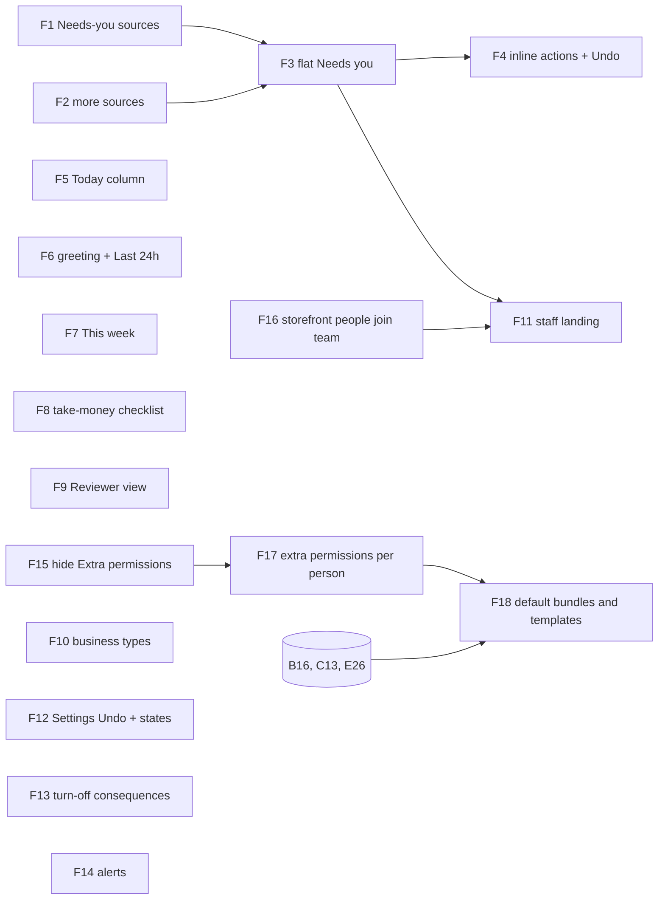

# Home and Settings

## Summary

Rebuild Home to the design: a greeting, a "Last 24 hours" strip, one flat
**Needs you** list with tone tags and inline actions, a **Today** column, a
**This week** money panel for those who hold `payment:read`, and a **Get ready
to take money** checklist. It also gets a Reviewer view and a staff landing.

Team gets the capability model (DEC-039, 2026-09-27): **extra permissions per
person** (F17), and **the default bundles** — the Member bundle, the
money-free kitchen view dropped, and role templates (F18), which waits on the
user's answers to the matrix's open questions.

Home's API gains the missing sources: failed renewals, overdue invoices, stock
short, site not live, low-star reviews, booking-page notes and unanswered
customer messages. Settings gets the differences that are real:
- the design's business types;
- Undo on saves, a failure message per tab, and the missing loading files;
- real counts when a module is turned off;
- the alerts grid, backed by per-person notification preferences.

Team hides its empty "Extra permissions" column. Adding someone to a
storefront also puts them on the business's team (DEC-048).

---

## Problem Frame

Home today (`components/home/home-dashboard.tsx`) groups Needs you by
severity, lists several days of Coming up, and shows count tiles. The design
(`Saroh Home.dc.html`) is one flat list: one row per thing that needs doing,
each with a tone tag ("Late · 2h", "Before their visit") and an inline action
that confirms and then offers Undo. Beside it are what's happening today, who
has arrived, and — for whoever holds `payment:read`, Owners and Admins by
default — how the week's money looks.
Several rows the design lists have no source in `home.service.ts` yet:
- a failed renewal;
- an overdue invoice;
- a size short for orders;
- a site that isn't live;
- a one-star review;
- a patient's booking-page note.

Settings is mostly built. The gap report names the real differences left:
- six business types in place of two;
- Undo on saves;
- a failure message per tab;
- turn-off warnings that name real counts;
- an alerts grid that has no preferences behind it.

Team has an "Extra permissions" column that says "—" for everyone. The
storefront's "People who work on it" roster (`StoreMembers`) is a second list
of people the business's Team doesn't know about, which DEC-048 settles: one
roster underneath.

---

## Requirements

- R1. Home's API returns a Needs-you item for each of these: a failed
  renewal, an overdue invoice, a size short for open orders, and a site that
  is not live. Each item carries its evidence, its link, a tone, and the
  action that can be taken inline.
- R2. Home's API adds these sources, each read only by a role that may read
  it: a low-star review with no reply, a booking-page note waiting for staff,
  and a customer message waiting for a reply.
- R3. Needs you is one flat list, ranked. Each row has a title, a line under
  it, a tone tag and at most one inline action. A source that fails becomes a
  named notice, never an empty list (saroh-product-states).
- R4. Inline actions (Mark sent, Retry, Send reminder, Reply) confirm first
  and say what they will do. Undo is offered only while nothing has left the
  business, with a 10-second hold before any message is sent (default 51).
- R5. A Today column lists today's bookings and pick-ups in time order, with
  Arrived and No-show states that write to the booking.
- R6. The header greets the viewer by name and shows a "Last 24 hours" strip:
  new orders, bookings, payments in, and reviews, each linking to the rows it
  counts.
- R7. This week (takings so far against the same days last week, bookings,
  orders, owed to you) shows each figure to whoever holds its own read
  (`payment:read` for takings); the API leaves out a figure the caller has no
  read for. "Payout on the way" is dropped
  (default 52).
- R8. "Get ready to take money" lists the steps still open, and the order
  follows the design. It can be hidden and shown again, and it disappears when
  every step is done.
- R9. A Reviewer's Home shows only the sites they were asked to review and the
  notes waiting on them, and nothing about the business.
- R10. Settings offers the design's business types (default 60).
- R11. Settings saves offer Undo. Each tab shows its own failure notice. Every
  settings section has a loading file.
- R12. Turning a module off names what it affects with real counts from the
  API — open orders, upcoming bookings, live subscriptions, packs held — and
  what stays (default 56).
- R13. Alerts: each person chooses which events reach them (new order, new
  booking, payment failed, someone joins the team, Monday summary) and by
  which channel (bell, email, WhatsApp). The channels are the ones the
  business can actually send on.
- R14. Team hides the "Extra permissions" column while no one has any. A
  person can be given capabilities beyond their role (F17), and the column
  then shows them.
- R15. Adding someone to a storefront also gives them a business membership
  (Member) when they have none. Removing them from the team removes their
  storefront roles. A storefront invite needs `member:invite` (DEC-048).
- R16. A staff member's Home shows the work for the storefronts they are
  assigned to, each row following their own capabilities (DEC-039, F11).
- R17. The built-in roles are default bundles (DEC-039). Member's bundle,
  `order:stage` implying `order:read`, and the role templates follow the
  user's answers to the matrix's Q1, Q3 and Q4 (F18).

---

## Scope Boundaries

- No financial-year picker: the year is set by GST law (DEC-028, default 55).
- Country stays in the Registered address card (DEC-029, default 59).
- Hours stay one card for every storefront (DEC-034).
- No new capability keys here; the order, customer and pack keys are B16's,
  C13's and E26's. F17 adds per-person grants, and F18 changes the built-in
  bundles.
- The Activity and Hours tabs stay (default 57). Custom roles are shown, not
  marked "Coming soon" (default 58).
- CRM follow-ups stay on Home (default 53).

### Deferred to Follow-Up Work

- **Saroh's own billing** (Settings › Plan & billing: Saroh invoices, usage,
  checkout and plan names) is "Later" in the overview and gets its own plan.
  `components/settings/plan-billing.tsx` stays as it is.
- Payouts and expenses (a separate Money area; DESIGN-NOTES "Calendar, second
  pass").
- Sending the Monday summary. F14 stores the preference; the job that sends
  it comes when business messages ship (plan A, A14).
- Renaming kitchen steps per business in Settings (DESIGN-NOTES "Not yet").

---

## Context & Research

### Relevant Code and Patterns

- **Home API:** `apps/api.saroh.in/src/modules/home/home.service.ts`, with
  its ranked `HomeAction` (ATTENTION → OVERDUE → SETUP → SUGGESTION),
  `HomeEvidence`, `HomeUnavailable` and the per-source `attempt()`. Existing
  sources:
  - `overdueFollowUps`, `openOrders`, `refundsOwed`, `upcomingBookings`,
    `crmNumbers`;
  - codes `CRM_OVERDUE_FOLLOWUPS`, `COMMERCE_OPEN_ORDERS`,
    `COMMERCE_SUGGEST_PRODUCT`, `PAYMENTS_REFUNDS_OWED`, `INSIGHTS_VIEW`.

  Gating is by `can(role, action)` inside the build. The controller is
  `home.controller.ts`; the specs are `home.service.spec.ts`,
  `home.leads.spec.ts` and `home.refunds.spec.ts`.
- **Sources to read from:**
  - Subscriptions: `modules/subscriptions/subscriptions.service.ts`
    (`retryPayment`, and `POST :subscriptionId/retry` in
    `subscriptions.controller.ts`).
  - Invoices: `modules/invoices/invoice-state.ts` (`isPastDue`, `OWED_WHERE`).
  - Stock: `modules/stock/stock-checks.service.ts` (the short checks).
  - Sites: `Site.currentPublicationId` in `schema.prisma`.
  - Reviews: `modules/product-reviews/product-reviews.service.ts`, whose
    `ProductReview` carries rating and reply.
- **Home app:** `apps/app.saroh.in/app/(shell)/page.tsx`, rendering
  `components/home/home-dashboard.tsx` with `needs-you.tsx`,
  `numbers-band.tsx`, `schedule.tsx`, `first-run-jobs.tsx` and `severity.ts`.
  Lib: `lib/home/service.ts` and `lib/home/first-run.ts`, tested in
  `first-run.test.ts`.
- **Checklist:** `lib/settings/ready.ts` (`readyChecklist`, tested in
  `ready.test.ts`), rendered by `components/settings/ready-checklist.tsx` at
  the top of Settings › Business. Home's "Get ready to take money" reuses the
  same steps.
- **Settings:**
  - Sections: `app/(shell)/settings/(sections)/{organization,modules,people,billing,profile,activity,providers}`.
    `people` and `profile` have no `loading.tsx`.
  - Components: `components/settings/{settings-tabs,settings-panel,settings-search,activity-list,plan-billing}.tsx`,
    `components/organizations/{organization-settings-form,business-section,business-setup-form,business-hours-section,use-leave-guard}.tsx`.
  - Business types: `apps/api.saroh.in/src/modules/organizations/dto.ts`
    (`BUSINESS_TYPES = ["individual", "company"]`), with the settings service
    in `organization-settings.service.ts` and the audit allowlist in
    `settings-audit.ts` (DEC-035).
- **Modules:**
  - `apps/api.saroh.in/src/modules/capabilities/module-lifecycle.service.ts`:
    disable with blockers and acknowledged warnings (`dto.ts`).
  - `readiness/module-readiness.registry.ts` (`deactivationBlockers` per
    module adapter).
  - App: `components/modules/module-list.tsx`, `lib/modules/{service,actions}.ts`.
- **Alerts:** `Notification` in `schema.prisma` (the bell inbox, `userId`
  nullable), and `modules/notifications/{notifications.service,enquiry-notify.handler}.ts`.
  There is no preference table.
- **Team:**
  - `components/organizations/team-screen.tsx`: the "Extra permissions"
    header is around line 401, and its always-"—" cell around line 467.
  - Also `roles-tab.tsx`, and `lib/organizations/{members,member-actions,roles,role-actions}.ts`.
  - API: `modules/organizations/{organization-members,organization-roles}.service.ts`.
    Its `remove(ctx, userId)` enforces the last-OWNER invariant.
- **Storefront roster:**
  - `apps/api.saroh.in/src/modules/members/{members.controller,members.service,dto}.ts`
    (`stores/:storeId/members`, `stores/:storeId/invitations`,
    `invitations/:token/accept`). Authorisation is by `StoreOwner`, not the
    organization policy.
  - Models `StoreMembers` (role ADMIN/MANAGER/EDITOR/VIEWER, `permissions`
    bitmask) and `StoreInvitation`; `Membership` (org role key, optional
    `staffMember`).
  - App: `app/(shell)/commerce/storefronts/[storeId]/people/page.tsx` and
    `components/stores/members-manager.tsx`.
- **Tests:**
  - Unit specs are listed explicitly in the `testMatch` of
    `apps/api.saroh.in/jest.config.js`.
  - `vitest` covers `apps/app.saroh.in/lib/**`.
  - e2e in `e2e/tests/business-settings.spec.ts` and `four-scenes.spec.ts`;
    the permissions matrix in `e2e/permissions/permissions.spec.ts`.

### Institutional Learnings

- A source that fails is named, never shown as zero or "all clear"
  (`saroh-product.md`, "What it must answer"; `HomeUnavailable`).
- The API leaves out what the caller has no read for; the screen does not
  hide it (`backend-auth-and-access.md`). Within a scope nothing is hidden
  (DEC-039).
- A new permission or policy change needs a label in the capability catalogue
  (`capability-catalogue.spec.ts`).
- Settings saves are audited per field (DEC-035). A new business type value
  must be on the allowlist.
- Demo businesses are film sets: browser checks write only to Northwind.

### External References

- None. The patterns in the repo cover every layer.

---

## Key Technical Decisions

- **One Needs-you list, one ranking.** Home keeps `HomeAction`'s four
  severities and adds `tone` and `tag` for the row's label ("Late · 2h",
  "Overdue 4 days", "Before their visit"). It also adds an optional
  `inline: { kind, label, confirm, undoable }`. The flat list is a rendering
  of the same ranked actions, with evidence rows promoted to one row each (a
  row per order, not "3 open orders"), capped at 12, with "See all N". The
  API does the flattening, so the ranking stays on the server.
- **Inline actions call existing endpoints.**

  | Action | Endpoint |
  |---|---|
  | Mark sent | the order stage move (`order:stage`) |
  | Retry | the subscription retry, which becomes a mandate retry when one exists (DEC-038, default 35) |
  | Send reminder | the invoice send (plan D, D17) |
  | Reply | a customer's message thread (plan A, A13) |

  Home adds no write endpoints of its own. Undo uses the target's own undo
  (the stage undo) within its window.
- **Undo never un-sends.** An action that tells someone waits 10 seconds
  before its message is queued. Undo within that time cancels both the action
  and the message; after it, the toast says "Sent" and offers no Undo
  (default 51). An action that sends nothing, such as No-show or Arrived,
  keeps Undo for the target's usual window.
- **This week is server-computed and money-gated.** A new `week` block holds
  takings to date against the same weekdays last week, bookings, orders and
  owed. Each figure is present only when the caller holds its read:
  `payment:read` for takings, `booking:read` for bookings, `order:read` or
  `order:stage` for order counts, and `invoice:read` for owed. The comparison
  is omitted, with a reason, when last week is too thin to compare. The
  business's time zone sets the week (DEC-033).
- **The checklist has one source.** `readyChecklist` (`lib/settings/ready.ts`)
  becomes the one list of steps: provider connected, registered address,
  GST, first product or service, site published. Home and Settings both read
  it. The "hidden" state is per person in local storage, a per-viewer
  convenience only.
- **The Reviewer and staff views are served by the API.** `GET /home` returns
  a `view` of `"business"`, `"reviewer"` or `"staff"`. The reviewer view
  reads only the sites `SiteReviewer` grants and their open review notes; it
  never calls another source. The staff view (F11) filters to the
  storefronts the person holds a storefront role on (DEC-048, default 61),
  and each source asks the person's own capabilities.
- **Business types.** `BUSINESS_TYPES` becomes `individual`, `partnership`,
  `llp`, `pvt`, `public` and `trust`. The stored value `company` is migrated
  to `pvt` (default 60). A null type reads as "Not set".
- **Turn-off consequences come from the readiness adapters.** Each module's
  adapter gains `deactivationImpact()`, which returns named counts (open
  orders, upcoming bookings, live subscriptions, packs held, a published
  site). It sits beside `deactivationBlockers`, and the modules tab renders
  the counts in the confirm. A count that can't be read is said to be unknown,
  never zero.
- **Alert preferences are per person, per business.** The new table
  `NotificationPreference(organizationId, userId, event, channel, enabled)`
  is RLS-scoped. Its defaults are code: the bell on for everything, email on
  for failed payments, WhatsApp off. Only the channels the business can send
  on are offered: the bell always; email and WhatsApp through the business's
  connected provider (DEC-011, DEC-036). An event a role cannot read is not
  offered to that person; Payment failed, for one, needs `payment:read` or
  `invoice:read`.
- **One roster underneath (DEC-048).** `MembersService.acceptInvitation` and
  every path that creates `StoreMembers` also upserts a `Membership`
  (MEMBER) in the store's organization when the person has none, in the same
  transaction. `OrganizationMembersService.remove` deletes the person's
  `StoreMembers` rows in that organization's stores, in the same
  serializable transaction. A storefront invite is refused without
  `member:invite` in the organization, alongside today's `StoreOwner` check.
  A backfill gives existing storefront members a Membership.

### Permissions touched

| Surface | Needs | New? |
|---|---|---|
| Needs you rows | each source's own read (`order:read` or `order:stage`, `subscription:read`, `invoice:read`, `store:read` + stock, `site:read`, `product-review:read`, `contact:read`, `message:read`) | no |
| Inline actions | the target's own write (`order:stage`, `subscription:write`, `invoice:write`, `message:write`) | no |
| This week | `payment:read`, `booking:read`, `order:read`, `invoice:read` per figure | no |
| Today: Arrived / No-show | `booking:write` | no |
| Reviewer view | `site:read`, narrowed by `SiteReviewer` | no |
| Staff landing (F11) | each source's own read, narrowed to the person's storefronts | no |
| Extra permissions per person (F17) | `member:role:update` | a per-person grants list |
| Default bundles and templates (F18) | — (shipped defaults) | Member bundle per matrix Q1, Q4 |
| Business types, Undo | `org:update` | no |
| Turn-off consequences | `module:manage`, plus `module:read` for the counts | no |
| Alerts | the signed-in person, for their own preferences | no |
| Storefront people | `StoreOwner` today, **plus `member:invite`** | rule change (DEC-048) |

---

## Open Questions

### Resolved During Planning

- Retry charges the mandate when one exists and sends a pay link otherwise
  (DEC-038, default 35).
- Invoice reminders are in scope, through the business's provider (plan D,
  D17; default 38).
- "Payout on the way" is dropped (default 52).
- CRM follow-ups stay (default 53).
- Undo is never offered after a customer has been messaged (default 51).
- Staff store assignments come from storefront roles; there is no new table
  (default 61).
- Modules off share one empty state (default 54).
- There is no financial-year picker (default 55).
- Class packs as a module is plan E, E12; this plan only renders its row.
- Turn-off consequences are real (default 56).
- The Activity and Hours tabs stay (default 57).
- Custom roles are shown (default 58).

### Deferred to Implementation

- Exactly which evidence rows are promoted, and the cap per source, to be
  tuned against the Rye, Pulse and Kavi seeds.
- Whether Arrived needs a new booking field (`arrivedAt`) or maps onto an
  existing status. Read `Booking.status` and `BookingEvent` first.
- How the Monday summary preference reads before its sender exists. The
  default is to show it with "Starts when business messages are on".

---

## Implementation Units

Cross-epic:
- F2 needs A13 (messages) and C12 (booking-page notes).
- F4 needs D13 (Retry through a mandate), D17 (Send reminder) and A13
  (Reply). It can ship first with Mark sent and Retry by pay link.
- F13 renders E12's Class packs row.
- F18 follows B16, C13 and E26 (the capabilities it bundles) and waits on
  the matrix's Q1, Q3 and Q4.

### F1. Home API: Needs-you sources — failed renewals, overdue invoices, stock short, site not live

**Goal:** Four new ranked sources in `GET /home`, each read on its own and
named when it fails.

**Requirements:** R1, R3

**Dependencies:** None

**Phase:** 1

**Files:**
- Modify: `apps/api.saroh.in/src/modules/home/home.service.ts`, `home.module.ts`
- Create: `apps/api.saroh.in/src/modules/home/home-money-sources.ts`, `home-site-stock-sources.ts`
- Test: `apps/api.saroh.in/src/modules/home/home.sources.spec.ts` (add to `jest.config.js` `testMatch`), updates to `home.service.spec.ts`

**Approach:**
- **Failed renewal:** a live subscription whose latest period invoice is past
  due (`isPastDue`). It is OVERDUE, tagged "Payment failed" (or "Overdue N
  days"), with evidence per subscription and an inline Retry. Needs
  `subscription:read`.
- **Overdue invoice:** invoices that are not order invoices, past due
  (`OWED_WHERE`, `isPastDue`). One row per invoice with an inline Send
  reminder, and the amount only with `invoice:read`.
- **Stock short:** the "short" checks from `StockChecksService` (sizes short
  for open orders). ATTENTION, with a link to Stock filtered to Needs you.
  Needs `store:read`, and is skipped when stock tracking is off for the
  business.
- **Site not live:** an enabled Website module with a site whose
  `currentPublicationId` is null, shown as SETUP, "Your website isn't live
  yet". Needs `site:read`.
- Each source goes through `attempt()`, so its failure adds a
  `HomeUnavailable`.

**Patterns to follow:** `refundsOwed` and `openOrders` (evidence plus a
count); `attempt()`.

**Test scenarios:**
- Happy path: an overdue subscription invoice gives one OVERDUE row with
  Retry; an issued invoice two days past due gives "Overdue 2 days".
- Edge case: an order invoice past due is not listed (the order is the
  ledger); a draft invoice is never overdue.
- Edge case: stock tracking off gives no stock row, and not an unavailable
  notice.
- Error path: the stock checks throw, so "Stock" is unavailable and the
  other rows still render.
- Permission: a caller without `invoice:read` and `subscription:read` (a
  Member by default) gets no invoice or renewal rows.

**Verification:** Rye shows its short size; Pulse its failed renewal; Kavi
Dental its overdue X-ray invoice.

---

### F2. Home API: low-star reviews, booking-page notes, unanswered messages

**Goal:** The remaining sources the design lists.

**Requirements:** R2, R3

**Dependencies:** F1; A13 (customer messages, plan A); C12 (booking-page notes, plan C)

**Phase:** 2

**Files:**
- Modify: `apps/api.saroh.in/src/modules/home/home.service.ts`
- Create: `apps/api.saroh.in/src/modules/home/home-people-sources.ts`
- Test: `apps/api.saroh.in/src/modules/home/home.people-sources.spec.ts`

**Approach:**
- **Low-star review:** a rating of 2 or less with no reply, newest first,
  with an inline Reply (`product-review:read`, and `product-review:write` to
  act).
- **Booking-page note:** a pending note from the booking page (C12), tagged
  "Before their visit" when the booking is within two days. A sensitive note
  goes only to a role with the sensitive read: `contact:write` until C13,
  then `customer:sensitive` (DEC-040).
- **Unanswered message:** a customer thread waiting on the business for more
  than an hour (A13), with an inline Reply (`message:read`).

**Test scenarios:**
- Happy path: a 1-star review without a reply gives a row; replying removes
  it.
- Edge case: a sensitive note for a Member is left out, and its count is not
  leaked in `count`.
- Error path: the messages source is unavailable, which is named.

**Verification:** Kavi Dental shows Rahul's note to the owner, and not to a
Member.

---

### F3. Home: flat Needs you rows with tone tags

**Goal:** Replace the grouped Needs you with the design's flat, ranked list.

**Requirements:** R3

**Dependencies:** F1

**Phase:** 1

**Files:**
- Modify: `apps/app.saroh.in/components/home/{home-dashboard,needs-you,severity}.tsx|ts`, `apps/app.saroh.in/lib/home/service.ts`
- Modify: `apps/api.saroh.in/src/modules/home/home.service.ts` (the flattened `needs` array with `tone`, `tag` and `inline`)
- Test: `apps/app.saroh.in/lib/home/needs.test.ts`, `e2e/tests/four-scenes.spec.ts` (Home in each scene)

**Approach:**
- One row per item: title, the line under it, a tone tag (colour and word,
  never colour alone), and one action (a link, or the inline action once F4
  lands).
- "All clear" appears only when every source was read. With an unavailable
  source it says what couldn't be checked.
- Rows are 44px or taller for touch, with no hover-only affordance. On phones
  the list comes first.

**Test scenarios:**
- Happy path: rows are in ranked order, and a late order sits above an
  overdue invoice as the design orders them.
- Edge case: nothing to do and every source read gives "All clear"; one
  source failed gives the notice, not "All clear".
- Integration (e2e): the four scenes render Home without horizontal scroll.

**Verification:** Side by side with `Saroh Home.dc.html` for Rye and Kavi.

---

### F4. Home: inline actions with confirm and Undo

**Goal:** Mark sent, Retry, Send reminder and Reply work from the row.

**Requirements:** R4

**Dependencies:** F3; D13 (Retry by mandate) and D17 (Send reminder) in plan D; A13 (Reply) in plan A. Mark sent and Retry by pay link can ship before those.

**Phase:** 2

**Files:**
- Create: `apps/app.saroh.in/components/home/inline-action.tsx`, `apps/app.saroh.in/lib/home/inline-actions.ts`
- Modify: `apps/app.saroh.in/components/home/needs-you.tsx`, `lib/home/service.ts`
- Test: `apps/app.saroh.in/lib/home/inline-actions.test.ts`, `e2e/tests/home.spec.ts` (new, on Northwind)

**Approach:**
- A confirm sheet says what will happen and who will be told ("This tells
  Farah by email…"), only when a message will really leave. That is when the
  business has a connected provider, or the person has an account thread
  (plan A). Otherwise it says nothing will be sent.
- A message-sending action waits 10 seconds before calling the endpoint.
  Undo in that time cancels the call; after it, the toast reads "Sent" with
  no Undo (default 51).
- A non-sending action (Mark sent with no message) calls at once, and Undo
  uses the target's own undo (the stage undo within `UNDO_WINDOW_MS`).
- The row leaves the list on success and comes back on Undo.

**Test scenarios:**
- Happy path: Mark sent moves the order to its handed-over stage, and Undo
  within the window restores it.
- Edge case: a reminder whose Undo is pressed at 9 seconds sends nothing.
  After 10 seconds there is no Undo.
- Error path: the endpoint refuses (409, already paid). The row stays, and
  the message names why.
- Permission: a role without `invoice:write` sees Send reminder as a link to
  the invoice, not an inline action.

**Verification:** On Northwind, each action and its Undo leave the records as
expected, and nothing is sent after an Undo.

---

### F5. Home: Today column (arrived, no-show)

**Goal:** Today's bookings and pick-ups in time order, marked Arrived or
No-show from Home.

**Requirements:** R5

**Dependencies:** None

**Phase:** 1

**Files:**
- Modify: `apps/api.saroh.in/src/modules/home/home.service.ts` (a `today` block: bookings and today's pick-ups in the business's zone)
- Modify: `apps/app.saroh.in/components/home/schedule.tsx` (becomes the Today column), `lib/home/service.ts`
- Modify (if needed): `apps/api.saroh.in/src/modules/bookings/bookings.service.ts` (an arrived mark)
- Test: `apps/api.saroh.in/src/modules/home/home.today.spec.ts`, `apps/app.saroh.in/lib/home/today.test.ts`

**Approach:**
- "Today" is the business's day (DEC-033), replacing today's per-booking
  grouping for this column.
- Arrived and No-show use the booking's existing check-in and no-show writes
  where they exist (`booking:write`); otherwise the unit adds `arrivedAt`
  (see Deferred).
- Without `booking:write` the states show read-only.
- Coming-up days beyond today move to the Calendar link.

**Test scenarios:**
- Happy path: three of today's bookings in order; marking one Arrived tags
  it "Arrived 09:32".
- Edge case: a booking at 23:30 in the business's zone belongs to today even
  when UTC says tomorrow.
- Error path: marking No-show on a cancelled booking is refused, with the
  reason shown.

**Verification:** Pulse's morning classes and Kavi's appointments read like
the design.

---

### F6. Home: greeting and Last 24 hours

**Goal:** The header line and the 24-hour strip.

**Requirements:** R6

**Dependencies:** None

**Phase:** 1

**Files:**
- Modify: `apps/api.saroh.in/src/modules/home/home.service.ts` (`since` counts, each with a filtered `href`)
- Modify: `apps/app.saroh.in/components/home/{home-dashboard,numbers-band}.tsx`
- Test: `apps/api.saroh.in/src/modules/home/home.since.spec.ts`

**Approach:**
- The greeting is "Good morning, ‹first name›" in the business's zone, and
  "Welcome, ‹name›" for a business with nothing yet.
- The date line names the business.
- The strip shows new orders, bookings, payments in (money only with
  `payment:read`) and reviews in the last 24 hours. Each count links to the
  exact rows.
- The numbers band's tiles fold into the strip.

**Test scenarios:**
- Happy path: counts match the rows their links open.
- Edge case: a new business gets no strip and the "Welcome" line.
- Permission: a Member's strip has no payments figure.

**Verification:** Every number opens its own filtered list.

---

### F7. Home: This week money panel

**Goal:** Whoever holds `payment:read` sees the week's money in words.

**Requirements:** R7

**Dependencies:** F6

**Phase:** 2

**Files:**
- Modify: `apps/api.saroh.in/src/modules/home/home.service.ts` (a `week` block, per the Key Technical Decision)
- Create: `apps/api.saroh.in/src/modules/home/home-week.ts` (the pure comparison)
- Create: `apps/app.saroh.in/components/home/this-week.tsx`
- Test: `apps/api.saroh.in/src/modules/home/home-week.spec.ts`

**Approach:**
- Takings so far = paid orders + paid invoices that aren't order invoices,
  net of refunds — each rupee counted once (`backend-billing-and-classes.md`).
- The comparison is against the same weekdays last week, as "Up 12%",
  "Level" or "Not enough last week to compare".
- Also shown: bookings this week, orders or treatments booked, and owed to
  you with its overdue count.
- No payout figure (default 52).

**Test scenarios:**
- Happy path: the design's worked figures for Rye.
- Edge case: fewer than three payments last week gives "Not enough last week
  to compare".
- Edge case: a refund this week lowers takings; an order invoice is never
  counted twice.
- Permission: a caller without `payment:read` (a Member by default) gets no
  takings figure at all; its bookings figure still shows with `booking:read`.

**Verification:** The figures agree with Invoices and Orders for the same
days.

---

### F8. Home: "Get ready to take money" checklist

**Goal:** One list of setup steps, shown on Home and in Settings.

**Requirements:** R8

**Dependencies:** None

**Phase:** 1

**Files:**
- Modify: `apps/app.saroh.in/lib/settings/ready.ts`, `ready.test.ts`
- Create: `apps/app.saroh.in/components/home/take-money-checklist.tsx`
- Modify: `apps/app.saroh.in/components/home/{home-dashboard,first-run-jobs}.tsx`, `components/settings/ready-checklist.tsx`
- Test: `apps/app.saroh.in/lib/settings/ready.test.ts`

**Approach:**
- The steps are the design's: connect payments, registered address, tax
  standing, first product or service, and publish the site. Each has why it
  matters and where to do it.
- The checklist leads Home when fewer than half the steps are done, and sits
  lower once more are done.
- Hide and Show are per viewer (localStorage, wrapped in try/catch).
- The checklist is gone when every step is done.
- Owner and Admin only (`org:update`).

**Test scenarios:**
- Happy path: 2 of 5 done means the card is first, with ticks and "2 of 5
  done".
- Edge case: all done means no card on Home or in Settings.
- Edge case: storage throws, and the card still renders.

**Verification:** Home and Settings show the same count for the same
business.

---

### F9. Home: Reviewer view

**Goal:** A Reviewer lands on what they were asked to review, and nothing
else.

**Requirements:** R9

**Dependencies:** None

**Phase:** 1

**Files:**
- Modify: `apps/api.saroh.in/src/modules/home/home.service.ts` (`view: "reviewer"`, which reads only granted sites and their open review notes)
- Create: `apps/app.saroh.in/components/home/reviewer-home.tsx`
- Test: `apps/api.saroh.in/src/modules/home/home.reviewer.spec.ts`, `e2e/permissions/permissions.spec.ts` (a Home row)

**Approach:**
- The API short-circuits for a REVIEWER: no module readiness, no numbers,
  no other source is read.
- Each granted site shows its pages waiting for review, links to
  `/sites/:id/review`, and says how many notes are open.
- The rail shows only Home and the sites.

**Test scenarios:**
- Happy path: a reviewer on one site sees that site only.
- Security: the API response carries no order, booking or money field, and
  no ungranted site id.
- Edge case: a reviewer with no sites gets "Nothing to review yet".

**Verification:** Dalia sees Rye's site and its notes only.

---

### F10. Settings: business types

**Goal:** The design's six business types.

**Requirements:** R10

**Dependencies:** None

**Phase:** 2 (default 60)

**Files:**
- Modify: `apps/api.saroh.in/src/modules/organizations/dto.ts` (`BUSINESS_TYPES`), `organization-settings.service.ts`, `settings-audit.ts`
- Create: `packages/database/prisma/migrations/<ts>_business_types/migration.sql` (`company` → `pvt`)
- Modify: `apps/app.saroh.in/components/organizations/{organization-settings-form,business-setup-form}.tsx`, `lib/organizations/settings-service.ts`
- Test: `apps/api.saroh.in/src/modules/organizations/dto.spec.ts`, `organization-settings.service.spec.ts`, `apps/app.saroh.in/lib/settings/search.test.ts`

**Approach:**
- Individual / sole proprietor, Partnership, LLP, Private limited company,
  Public limited company, Trust or society, plus "Not set".
- Existing `company` rows become `pvt`.
- Any label that changes with the type (the product details label, Activity)
  reads the new values.
- Settings search finds each type.

**Test scenarios:**
- Happy path: saving LLP records `type: individual → llp` in Activity.
- Edge case: an old client sending `company` is accepted and stored as `pvt`
  for one release.
- Error path: an unknown type gives a 400 "Unknown business type".

**Verification:** `db:verify:replay` passes, and existing businesses show
Private limited.

---

### F11. Staff landing

**Goal:** A Member (or a custom role such as Front desk or Dentist) lands on
their own day: the storefronts and work they are assigned to.

**Requirements:** R16

**Dependencies:** F3, F16. Decided by the capability model (DEC-039): each
row asks the person's own capabilities, so it needs no answer about who holds
what.

**Phase:** 2

**Files:**
- Modify: `apps/api.saroh.in/src/modules/home/home.service.ts` (`view: "staff"`, with sources filtered to the caller's storefront roles and the staff member's services)
- Create: `apps/app.saroh.in/components/home/staff-home.tsx`
- Test: `apps/api.saroh.in/src/modules/home/home.staff.spec.ts`, `e2e/permissions/permissions.spec.ts`

**Approach:**
- The storefronts come from the caller's `StoreMembers` rows (DEC-048); none
  means every storefront.
- Today is filtered to the caller's `StaffMember` where one is linked
  (`Membership.staffMember`).
- The date line says "Hill Road only" when the view is narrowed. There is no
  switch on Home (design).
- Each row follows the person's capabilities, as everywhere: orders with
  `order:read` or `order:stage` (the kitchen view until F18), sensitive notes
  with the sensitive capability, takings with `payment:read`, and so on.

**Test scenarios:**
- Happy path: a Member on Hill Road sees Hill Road's open orders only.
- Edge case: a Member with no storefront role sees every storefront.
- Edge case: a person given `payment:read` as an extra permission (F17) sees
  the takings figure; one without it doesn't.

**Verification:** Arjun, Sana and Dr. Arun from the design's roles match
their views.

---

### F12. Settings: Undo on saves, per-tab failure, loading files

**Goal:** Settings behaves like the design when a save lands or a tab fails.

**Requirements:** R11

**Dependencies:** None

**Phase:** 1

**Files:**
- Create: `apps/app.saroh.in/app/(shell)/settings/(sections)/{people,profile}/loading.tsx`, and `error.tsx` per section that lacks one
- Modify: `apps/app.saroh.in/components/settings/settings-panel.tsx`, `components/organizations/{organization-settings-form,business-section,business-hours-section}.tsx`, `lib/organizations/settings-actions.ts`
- Test: `apps/app.saroh.in/lib/organizations/settings-undo.test.ts`, `e2e/tests/business-settings.spec.ts`

**Approach:**
- After a save, the toast says what changed and offers Undo, which saves the
  previous values back through the same action (and is audited as its own
  change).
- Undo is not offered for a change that can't be reversed by a save: a
  registration that already numbered an invoice, a logo replaced (the old
  file is gone), or anything the API refuses to write back.
- Each section's read failure renders its own notice with Try again.
- The rest of Settings stays usable.

**Test scenarios:**
- Happy path: change the prefix, Undo, and the prefix is restored with two
  Activity entries.
- Edge case: Undo after another tab changed the same field is refused with
  "Changed since — reload".
- Error path: the Providers read fails, so only the Providers tab shows the
  notice.

**Verification:** Each section has loading and failure states in the four
scenes.

---

### F13. Settings: module turn-off consequences with real counts

**Goal:** "Turn off Bookings?" names what it touches, with real numbers.

**Requirements:** R12

**Dependencies:** None. Its Class packs row comes with E12.

**Phase:** 1

**Files:**
- Modify: `apps/api.saroh.in/src/modules/capabilities/readiness/{module-readiness.port,module-readiness.registry}.ts` (`deactivationImpact`), `module-lifecycle.service.ts`, `capabilities.controller.ts`, `dto.ts`
- Modify: `apps/app.saroh.in/components/modules/module-list.tsx`, `lib/modules/{service,actions}.ts`
- Test: `apps/api.saroh.in/src/modules/capabilities/module-lifecycle.service.spec.ts`, `readiness/module-readiness.registry.spec.ts`

**Approach:**
- `GET …/modules/:key/impact` returns named counts. Examples: Commerce's
  open orders and live products; Appointments' upcoming bookings and packs
  held; Payments' live subscriptions and unpaid invoices; Website's published
  site.
- Each count comes with what stops and what stays ("Upcoming bookings stay
  booked; the booking page stops taking new ones"), and ends "Nothing is
  deleted".
- A count that failed to read is "couldn't count".
- The confirm renders the counts, and blockers still block.

**Test scenarios:**
- Happy path: turning off Appointments with 3 upcoming bookings says "3
  upcoming bookings".
- Error path: a count read fails, and the sentence says it couldn't count.
  Turning off is still allowed unless a blocker applies.
- Permission: `impact` needs `module:read`; turning off needs
  `module:manage`.

**Verification:** Every module's confirm matches the design's wording shape.

---

### F14. Settings: alerts (notification preferences)

**Goal:** Each person picks what reaches them, and how.

**Requirements:** R13

**Dependencies:** None. Email and WhatsApp delivery ride on the business's
connected provider.

**Phase:** 2

**Files:**
- Modify: `packages/database/prisma/schema.prisma` (`NotificationPreference`)
- Create: `packages/database/prisma/migrations/<ts>_notification_preferences/migration.sql` (with RLS `org_isolation`)
- Modify: `apps/api.saroh.in/src/modules/notifications/{notifications.controller,notifications.service}.ts`, `enquiry-notify.handler.ts` (reads the preference)
- Create: `apps/app.saroh.in/components/settings/alerts-grid.tsx`, `apps/app.saroh.in/lib/settings/alerts.ts`
- Modify: `apps/app.saroh.in/app/(shell)/settings/(sections)/profile/page.tsx` ("Only for you — your team picks their own")
- Test: `apps/api.saroh.in/src/modules/notifications/notification-preferences.spec.ts`, `apps/app.saroh.in/lib/settings/alerts.test.ts`

**Approach:**
- The rows are New order, New booking, Payment failed, Someone joins the
  team and Monday summary. The columns are Bell, Email and WhatsApp.
- The defaults are in code, and a row is written only when changed.
- A channel the business has no provider for is shown off, with "Connect
  email in Providers".
- A row the person's role can't read is not offered.
- Existing senders (the enquiry notice) consult the preference.

**Test scenarios:**
- Happy path: turning off the bell for New order stops the inbox notice.
- Edge case: a WhatsApp cell with no provider can't be switched on.
- Security: the preference for another user can't be read or written.

**Verification:** `db:verify:replay` passes, and the grid matches the design.

---

### F15. Team: hide the empty "Extra permissions" column

**Goal:** No column that always says "—".

**Requirements:** R14

**Dependencies:** None

**Phase:** 1

**Files:**
- Modify: `apps/app.saroh.in/components/organizations/team-screen.tsx` (the header around line 401 and the cell around line 467; drop the column from `grid`)

**Approach:**
- Render the column only when some member has a grant beyond their role.
  Nothing grants one until F17, so it is hidden.
- The grid template loses the column, and the xl layout keeps its widths.
  Nothing else on Team changes (DEC-048).

**Test scenarios:**
- Happy path: Team at xl width has no Extra permissions header.

**Verification:** Side by side with `Saroh Team Roles.dc.html`, less the
column.

---

### F16. Storefront people join the team

**Goal:** One roster underneath: a storefront's people are on the business's
team (DEC-048).

**Requirements:** R15

**Dependencies:** None

**Phase:** 1

**Files:**
- Modify: `apps/api.saroh.in/src/modules/members/{members.service,members.controller,dto}.ts`
- Modify: `apps/api.saroh.in/src/modules/organizations/organization-members.service.ts` (`remove` also deletes the person's `StoreMembers` in that organization's stores)
- Create: `packages/database/src/backfill/<ts>-store-members-to-memberships.ts`
- Modify: `apps/app.saroh.in/components/stores/members-manager.tsx` ("Also added to your team as Member"), `components/organizations/team-screen.tsx` (a person's storefront roles under their name)
- Test: `apps/api.saroh.in/src/modules/members/members.service.spec.ts`, `packages/database/src/backfill/store-members-to-memberships.db.spec.ts`

**Approach:**
- Accepting a storefront invitation, and any direct add, upserts a
  `Membership` (MEMBER) in the store's organization inside the same
  transaction, unless one exists. An existing role is never lowered.
- A storefront invite requires `member:invite` in the organization as well
  as the existing `StoreOwner` check.
- Removing a person from the team deletes their `StoreMembers` rows for that
  organization's stores in the same serializable transaction as the
  last-owner check.
- The backfill is idempotent: one Membership per storefront member without
  one, logged with counts.

**Execution note:** Characterization-first on today's accept and remove paths.

**Test scenarios:**
- Happy path: accepting a Hill Road invite makes a MEMBER membership, and
  the person appears on Team.
- Edge case: an existing ADMIN accepting a storefront invite stays ADMIN.
- Edge case: removing someone from Team removes their storefront roles; the
  last OWNER still can't be removed.
- Error path: a StoreOwner without `member:invite` gets a 403 on invite.
- Integration: the backfill run twice changes nothing.

**Verification:** Every storefront person on Northwind is on its Team.

---

### F17. Extra permissions per person

**Goal:** A person can hold capabilities beyond their role, as the capability
model says (DEC-039; matrix §5), and Team shows them.

**Requirements:** R14

**Dependencies:** F15

**Phase:** 2

**Files:**
- Modify: `packages/database/prisma/schema.prisma` (`Membership.extraActions String[]`, default empty), with a migration
- Modify: `apps/api.saroh.in/src/modules/organizations/organization-policy.ts` (`resolveCapabilities` takes the role's list and the person's extras; the union, filtered to known actions, then `withImplied`), `organization-context.service.ts`, `organization-members.service.ts` and `organization-members.controller.ts` (`PUT members/:id/extra-actions`, under `member:role:update`, audited)
- Modify: `apps/app.saroh.in/components/organizations/team-screen.tsx` (the column shows a person's extras; an "Extra permissions" sheet per person, grouped like the role editor)
- Test: `resolve-capabilities.spec.ts`, `organization-members.service.spec.ts`, `e2e/permissions/permissions.spec.ts`

**Approach:**
- A person's capabilities are their role's bundle plus their extras. An
  extra never removes anything; taking a power away is a role change.
- `ownerOnly` actions (`org:delete`) can't be granted. An Admin can't grant
  an extra they don't hold themselves.
- Unknown strings are dropped on read, as role lists are.
- The change is audited on the person's Activity ("Given: Refund orders").
- A Reviewer can't be given extras beyond the website (DEC-006): only
  `site:*` review capabilities.

**Test scenarios:**
- Happy path: a Member given `order:refund` can refund and still can't edit
  an order.
- Edge case: removing the extra takes the power away on the next request.
- Error path: granting `org:delete` → 400; an Admin granting `payment:manage`
  they hold → OK; a Member without `member:role:update` → 403.
- Integration: Team shows the column once one person has an extra, and hides
  it when the last extra is removed.

**Verification:** `db:verify:replay` passes; the permissions e2e covers a
person with an extra.

---

### F18. Default bundles: the Member bundle and role templates

**Goal:** Apply the user's answers to the matrix's open questions: the
Member default bundle, whether it reaches existing businesses, and which
role templates ship (DEC-039; matrix §4 and §9).

**Requirements:** R17

**Dependencies:** B16, C13, E26 (the capabilities it bundles), F17; **waits
on the user's answers to matrix Q1, Q3 and Q4**.

**Phase:** 3

**Files:**
- Modify: `apps/api.saroh.in/src/modules/organizations/organization-policy.ts` (the Member set in `CAPABILITIES`; `withImplied`: `order:stage` → `order:read`)
- Modify: `apps/api.saroh.in/src/modules/orders/*` (the money-free kitchen projection removed; `kitchenOnly` gone)
- Modify: `apps/api.saroh.in/src/modules/organizations/capability-catalogue.ts` (role templates as data), `organization-roles.service.ts`
- Modify: `apps/app.saroh.in/components/organizations/roles-tab.tsx` ("New role" offers the templates)
- Create, if Q4 keeps existing businesses on today's Member: `packages/database/src/backfill/<ts>-freeze-member-role.ts` (writes today's Member list as a saved row for every existing business)
- Test: `organization-policy.spec.ts`, `resolve-capabilities.spec.ts`, `organization-roles.service.spec.ts`, `e2e/permissions/permissions.spec.ts`

**Approach:**
- The Member set becomes the answer to Q1 (proposed: today's reads plus
  `order:read`, `order:create`, `booking:write`, `pack:read`, `pack:sell`).
- `order:stage` implies `order:read`, and the kitchen view becomes a layout
  only: nobody reads an order without its money.
- Q4 decides who gets the new Member: the proposal applies it to every
  business that never saved its own Member, with a release note in plain
  words; the alternative backfill freezes today's Member for existing
  businesses.
- Templates (Q3) are data beside the catalogue; one pre-fills "New role" and
  is never a built-in role.

**Test scenarios:**
- Happy path: a Member at a business with no saved Member row reads an order
  with its total, takes a new order and books a class.
- Edge case: a business's saved Member row keeps its list, plus implied holds
  (its Members who move orders now read them whole) — or, if Q4 freezes,
  nothing changes for it.
- Edge case: picking the Front desk template pre-fills New role; saving it
  makes an ordinary custom role.
- Integration: the permissions e2e rows for Member match matrix §4.

**Verification:** The matrix's default bundles table matches
`CAPABILITIES` one to one.

---

## System-Wide Impact

- **Interaction graph:** Home reads subscriptions, invoices, stock checks,
  sites, reviews, bookings, and later messages and booking-page notes. Its
  inline actions write through order stage, subscription retry, invoice send
  and message reply. Settings touches organization settings, the capabilities
  lifecycle, notifications and members.
- **Error propagation:** every Home source fails independently into
  `unavailable`; every Settings tab fails into its own notice.
- **State lifecycle risks:**
  - an inline action and its Undo race the target's own window, so Undo uses
    the target's own undo;
  - a send hold cancelled in the browser never reaches the API;
  - the membership upsert and store-member delete are transactional.
- **API surface parity:** `GET /home` keeps its existing fields for one
  release beside `needs`, `today`, `since`, `week` and `view`.
- **Integration coverage:** the permissions matrix gains Home (per role) and
  storefront invites; e2e `home.spec.ts` covers Northwind.
- **Unchanged invariants:**
  - the ranking order (ATTENTION → OVERDUE → SETUP → SUGGESTION);
  - nothing is shown without its scope's read, and nothing inside a scope is
    hidden from someone who holds it (DEC-039);
  - a Reviewer sees only the sites they were invited to (DEC-006);
  - the last OWNER can't be removed.

---

## Risks & Dependencies

| Risk | Mitigation |
|------|------------|
| Home becomes slow as sources grow | Each source bounded (count + first N), read in parallel via `attempt()`, with timing logged per source |
| Undo implies a message can be recalled | The 10-second hold, and no Undo once sent (default 51) |
| The storefront roster change widens access | Membership is created as MEMBER only; an existing role is never lowered; a storefront invite now needs `member:invite` |
| F2 and F4 depend on other epics | They ship in parts: Mark sent and Retry by pay link first |
| The Member bundle waits on the user (matrix Q1, Q3, Q4) | Only F18 waits; F11 and F17 follow the capability model and ship in phase 2 |
| A new Member bundle changes what existing staff see | Q4 is the user's; the release note says in plain words what Members can now see and do, or the backfill freezes today's Member |

---

## Documentation / Operational Notes

- Update `docs/patterns/saroh-product.md` "What it must answer" once F3 lands
  (flat list, same ranking).
- Update `docs/patterns/backend-auth-and-access.md` for storefront invites
  needing `member:invite` (F16).
- New unit specs go in the explicit `testMatch` in
  `apps/api.saroh.in/jest.config.js`.
- F10 and F14 migrations pass `db:verify:replay`. The F16 backfill runs after
  a verified snapshot.

---

## Sources & References

- Designs: `Saroh Home.dc.html`, `Saroh Settings.dc.html`,
  `Saroh Team Roles.dc.html`, `Saroh Storefront Settings.dc.html`
  (`/saroh-designs`); `DESIGN-NOTES.md`.
- Gap reports: `gap-reports/home-calendar-settings.md`,
  `gap-reports/team-storefront.md`.
- Decisions: DEC-048, DEC-039, DEC-028, DEC-029, DEC-034, DEC-035, DEC-038,
  DEC-040; ADR-011.
- Overview and defaults: `docs/plans/2026-09-26-000-round-2-overview.md`
  (defaults 35, 38, 51–61); matrix `docs/plans/2026-09-26-permission-matrix.md`.
