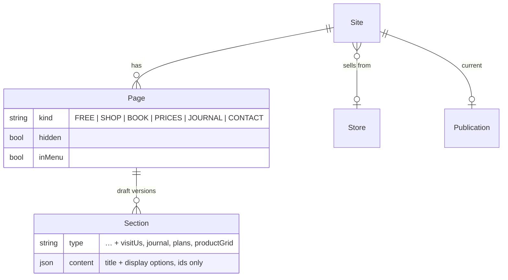
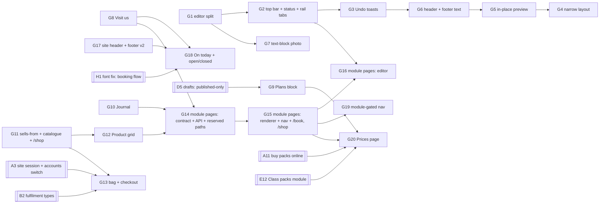

# Site editor and customer site

## Summary

First split `site-editor.tsx` (2,160 lines, #260) into hooks and panels with
no change in behaviour. Then give the editor the design's frame:

- a top bar whose status is still true after a reload;
- rail tabs Page · Add · Brand;
- Undo toasts in place of confirmations;
- a narrow layout with an overlay inspector;
- an in-place preview;
- the header and footer text edited in the inspector.

Blocks that read live data come next: Visit us, Journal, Plans, and a Product
grid, the last on a new public catalogue and product page. After them come
module pages (Shop/Book, Prices, Journal, Contact), added **beside** the
free-form pages that stay (DEC-046).

The customer site gets the design's v2 header and footer, "On today", open or
closed worked out from the hours, nav that follows the modules, a shop with a
bag and checkout, and a Prices page. The brand (colours, fonts, logo) is plan
008 (H); Hindi is later.

---

## Problem Frame

The #334 frame of the Site Editor is done: the top bar, locks, Add groups,
pinned feedback, a canvas drawn with the real site blocks, and loading and
error states. The newer designs change the content model more than the look.
Some blocks read the catalogue, plans, posts and the storefront instead of
typed copies. A business with modules gets pages that follow them. The
customer site becomes a small app: shop, prices, booking and an account.

`site-editor.tsx` holds all of the editor's state, effects and layout in one
component. Every new panel would add to it, so the split has to come first.
Merchant sites also cannot sell products: `packages/site-blocks` has a
product page component, which only the workspace's Customer view uses, and
there is no public catalogue endpoint. Staff-made orders are paid through
`saroh.app/[domain]/checkout/[orderId]`.

---

## Requirements

- R1. `site-editor.tsx` is split into hooks and panels with no change in
  behaviour. Every control and readout it has today stays (00-universal §15).
- R2. The top bar says what is true after a reload: "Published", "Not
  published · N changes" or "Not published yet". Publish says what it will
  put live.
- R3. The rail's tabs are Page · Add · Brand. The Brand tab keeps today's
  Style panel until plan H replaces it.
- R4. Removing a section, a reset, or reordering shows an Undo toast instead
  of a confirmation. Only irreversible actions still ask first.
- R5. Below the desk width the editor works one-handed: the canvas fills the
  screen and the inspector is an overlay sheet.
- R6. Preview in place: the same canvas and renderer with the editing tools
  removed, and the site fully usable, with no second renderer.
- R7. The header's business name and the footer's text are edited in the
  inspector. Header and footer stay fixed: they can't be removed or moved,
  and the lock says so.
- R8. The text block can carry a photo.
- R9. Bound blocks read live data, and only their section title is typed:
  - **Visit us** reads the storefront's address and opening hours;
  - **Journal** reads published posts;
  - **Plans** reads published subscription plans;
  - **Product grid** reads the storefront's listings.

  Each block's panel says where the real value lives.
- R10. A public catalogue and product page on the merchant's site, read
  through listings at one storefront (ADR-010), with Sold out honoured
  (DEC-032). The storefront the site sells from is chosen by the merchant
  or shown to them, never picked silently.
- R11. A bag and checkout that turn into an order at the storefront, paid
  online. The customer signs in at the last step (plan A, defaults 2 and 3).
  A site without customer accounts, or without a way to take payment,
  offers "Ask about ordering" instead of a checkout.
- R12. Module pages — Shop/Book, Prices, Journal, Contact — sit beside
  free-form pages (DEC-046). They appear only for modules that are on, and
  each list section has display options:
  - a section title;
  - Cards or List;
  - Photos, Descriptions and Prices on or off;
  - a button label;
  - a highlight for plans;
  - move and hide.
- R13. The customer site's nav follows the modules and each page's "Show in
  menu".
- R14. Customer site v2 header, in one row: logo or name, the menu, a bag with
  its count, Sign in or the avatar, and Book or Order. Below 820px it becomes
  a menu button and a full-width primary button. The footer ends with "Runs on
  Saroh" (default 67).
- R15. "On today" and "Open now · closes 9pm" / "Closed · opens …" are worked
  out from the storefront's structured hours, in the business's time zone
  (DEC-033, DEC-034).
- R16. The Prices page: "Try it once" · Memberships · Class packs, with join
  and buy.
- R17. New-site setup: start from the modules or from one of four templates,
  with placeholder text marked per field on the server (default 64) and
  "Publish anyway" when placeholders remain. **Moved to the Brand track with
  G21** (2026-09-27): each template carries a brand, so it follows H9. Kept
  here so the ID is not reused.
- R18. Publishing while a page is out for review stays allowed, and the
  bypass is recorded as today (DEC-047, #278).
- R19. Merchant sites never wear Saroh's brand. The `check:blocks` gates G2
  and G6 stay green, and every new site component lives in
  `packages/site-blocks`.

---

## Scope Boundaries

- The brand — palettes and a custom colour, backgrounds, font pairings, logo,
  contrast, starting themes — is plan 008 (H). The font-leak fix is H1, in phase 1.
- Hindi (EN | हिंदी) is later (DEC-046; default 70). Contract changes here
  leave room for a `locales` list and add none.
- The customer account area, sign-in, credits online, buying packs online,
  the waitlist and messages are plan 001 (A). This plan puts the Sign in and
  avatar slot in the header and calls plan A's sign-in at checkout.
- Joining a plan with autopay is plan 004 (D12). Until then, Prices' "Join"
  issues the first invoice and sends a pay link.
- Desktop and Phone stay, and **Tablet and Zoom stay too** (default 62,
  §15; #347 put them back once already).
- The reviewer keeps `/sites/:id/review` (#275) and does not work in the
  editor. Members don't reply to notes (default 63).
- Publishing is not blocked during review (DEC-047).

### Deferred to Follow-Up Work

- Hindi fields in the contract, API, renderer and editor (plan 008 "Later").
- Drawn layout previews for the new-site templates (design round 2 audit,
  still open there).
- Corner and button styles; removing "Runs on Saroh" (overview "Later").
- A second website per business (ADR-006 stands for websites).
- Guest checkout. Where accounts are on, sign-in is asked for at the last
  step (default 3). Where they are not yet on (per-site rollout, default
  71), the shop shows "Ask about ordering" and has no checkout (G13).
- New-site setup with templates (G21, R17): the Brand track, after H9.
- Pay-at-pickup on the shop. The site takes online payment only; staff take
  counter payments in the workspace.

---

## Context & Research

### Relevant Code and Patterns

- **Editor:**
  - `apps/app.saroh.in/components/sites/site-editor.tsx` is 2,160 lines,
    mounted by `app/(editor)/sites/[siteId]/page.tsx`. It holds the zoom
    state (`zoom`, `zoomScale`), the Tablet viewport, and the Remove-section
    confirmation that replaced `window.confirm`.
  - Panels already out of it: `editor-chrome.tsx`, `block-inspector.tsx`,
    `pages-panel.tsx`, `add-block-panel.tsx`, `style-panel.tsx`,
    `section-preview.tsx`, `block-feedback.tsx`, `pre-publish-check.tsx`,
    `site-versions.tsx`, `review-panel.tsx`, `use-leave-guard.ts`,
    `use-services-for-picker.ts`, and the per-block field editors in
    `section-fields/`.
  - App lib: `lib/sites/{editor-status,editor-prefs,editor-positions,site-state,style,pending,service,actions}.ts`
    (with tests).
- **Publish bypass during review (#278):**
  - `site-editor.tsx` near its publish handler;
  - `components/sites/pre-publish-check.tsx`, `site-versions.tsx` and
    `lib/sites/editor-status.ts`;
  - API: `apps/api.saroh.in/src/modules/sites/review-route.ts` and
    `sites.service.ts` (`publishSite`, `authorize(ctx, "site:publish")`).
- **Contract (ADR-002):**
  - `packages/block-contract/src/section-contract.ts`: `SECTION_TYPES` and a
    registry keyed `type@version`. A breaking change ships as a new version;
    an optional field extends a version in place. `servicesList` v1 (#255)
    is the existing **bound block**: ids only, read live.
  - Also in `packages/block-contract/src/`: `variants.ts`, `rendered.ts`,
    `to-rendered.ts`, `fixtures.ts` and `examples.ts`, with tests.
- **Renderer:**
  - `packages/site-blocks/src/section-renderer.tsx`, `site-chrome.tsx`
    (`SiteHeader`, `SiteFooter`, one implementation shared by the live site,
    the preview and the editor canvas, #252), `site-theme.tsx`, and the
    blocks in `blocks/`, including `services-list.tsx` and `contact.tsx`;
  - `product/product-page.tsx`, which only the workspace Customer view uses
    (`components/commerce/product-page/customer-view.tsx`);
  - the `booking-flow/` folder.
- **Site data:**
  - `Site` has `style`, `footer`, `navigation` and `currentPublicationId`.
    `Page` has `path`, `title`, `isHome` and `hidden`, unique
    `(siteId, path)`.
  - `Section.type` and `contractVersion`, and `Publication` snapshots, are in
    `packages/database/prisma/schema.prisma`.
  - Footer and navigation parsing: `modules/sites/site-footer.ts` and
    `site-navigation.ts` (`resolveSiteNavigation` drops hidden pages at
    publish).
  - `updateStyle`, `updateFooter` and `updateNavigation` require
    `site:update`; section edits require `section:write`.
- **Public reads:**
  - `modules/sites/public-sites.controller.ts` (`public/sites`: by-subdomain,
    by-hostname, `:siteId/posts`, `:siteId/publication`, preview).
  - `modules/bookings/public-bookings.controller.ts` (`public/services`,
    `public/sites/:siteId/booking`).
  - `modules/payments/public-payments.controller.ts` (`public/orders/:orderId/payment-intent`,
    receipt).
  - saroh.app's readers are in `apps/saroh.app/lib/publication.ts` and
    `checkout.ts`. Its routes are `app/[domain]/{page,[slug]/page,[slug]/[postSlug]/page,book/page,checkout/[orderId]/page}.tsx`
    and `app/preview/[token]/*`.
  - `app/[domain]/book/page.tsx` is a **static** segment, so it wins over
    `[slug]`; its own comment says a merchant page at `/book` is shadowed.
    The seeds already have such pages: Northwind's "Book a walkthrough" and
    two showcase sites' "Free intro" sit at `/book` and cannot be seen today
    (`packages/database/src/seed/data.ts`, `seed/showcase/data.ts`).
  - Page paths are checked by `assertPathIsFree(siteId, path)` in
    `modules/sites/site-access.ts`, called on page create and rename in
    `sites.service.ts`. Nothing reserves a path yet.
  - Every saroh.app read runs on its server, so the API sees saroh.app's
    address, not the visitor's. The booking flow is the exception: it calls
    the API from the browser (`packages/site-blocks/src/booking-flow/api.ts`).
- **Catalogue (ADR-010):** `modules/products/{listings.service,listings.controller,catalogue-page,organization-products.controller}.ts`.
  Stock and "can sell" are in `modules/stock/` (DEC-032).
- **Online orders (round-1 plan, R5):**
  - `reserveOnPayment(tx, { organizationId, orderId, paymentIntentId })` in
    `modules/stock/reserve.ts` locks an intent **whose `orderId` is that
    order**, then the order, then the rows. It refuses any other intent. So
    the order must exist, unpaid, before its intent is made. Nothing calls it
    yet ("when the online checkout exists").
  - An unpaid online order's lines have no `stockRow`, so they hold nothing
    (reserve.ts). A refusal records a PENDING refund keyed
    `sold-out:<intent>`, and `PaymentsService.sendAutomaticRefund` sends it
    after the transaction commits.
  - Intents are made in `payments.service.ts`: `createIntentForOrder`
    (staff, `payment:manage`) and `createIntentForOrderPublic`. Both go
    through `createIntentInternal`, which takes the amount only from
    `order.total` and the provider from the storefront's `checkoutProvider`.
  - The order's invoice is made on payment (`ensureOrderInvoice` in
    `modules/invoices/order-invoicing.ts`), so an unpaid order takes no
    invoice number.
  - `Order` has no field that marks an order as placed online, and no
    `paidAt`.
- **Tenant context on public paths:** `OrgRlsInterceptor` sets the
  organization only for `OrganizationGuard` requests. Public paths fall
  through to the permissive branch. `modules/payments/public-invoices.service.ts`
  is the pattern: resolve the organization from the row, then run the work
  in `runInOrgContext(organizationId, …)`.
- **Rate limits:** `FixedWindowRateLimiter` (`modules/bookings/rate-limiter.ts`),
  keyed by the DEC-027 client address. Plan A (A2/A3) adds the signed
  client-address header by which saroh.app's server passes on the visitor's
  address. Unsigned callers are limited by their own address.
- **Hours and places:** `StoreSettings.openingHours` (JSON), written to every
  storefront from Settings › Hours (DEC-034). `StoreSettings.kind` is `SHOP`
  (a place with an address, hours and collection) or `ONLINE` (none of
  them). The time zone is `BusinessProfile.timezone` (DEC-033).
- **Picking a storefront:** `apps/app.saroh.in/lib/stores/pick.ts` returns
  the only storefront, or `undefined` when there are several and none is
  named, so the page asks rather than guesses (ADR-010).
- **Gates:** `scripts/check-blocks.mjs` (G2: no Saroh token in a site block;
  G6: nothing outside `packages/site-blocks` draws `--site-*`), run by
  `pnpm run check:blocks`.
- **Tests:**
  - `packages/site-blocks/src/blocks.test.tsx` and per-block tests;
  - `packages/block-contract/src/section-contract.test.ts` and
    `variants.test.ts`;
  - the API's `modules/sites/*.spec.ts` (`publication-renderability`,
    `site-navigation`, `site-footer`, `sites-pages.service`,
    `pending-site-changes`);
  - e2e `e2e/tests/site-review.spec.ts` and `site-versions.spec.ts`.

### Institutional Learnings

- #334 dropped Tablet, zoom, the whole-site review panel, status details,
  block previews and settled notes, and #347 put every one back. The split
  (G1) and each frame unit list the controls before and after.
- Two renderers drifted apart before #189. The canvas, the preview and the
  live site stay one implementation; G5 removes tools and never swaps
  renderers.
- The public side reads only what publish wrote (ADR-002). Bound blocks store
  ids and options in the snapshot and read live values at view time, like
  `servicesList`. They never copy values into content.

### External References

- None; local patterns cover every layer.

---

## Key Technical Decisions

- **G1 is a pure move.** Split into hooks — `use-editor-draft` (sections and
  pages state, autosave), `use-editor-selection`, `use-editor-viewport`
  (Desktop/Tablet/Phone, zoom, fit), `use-publish` (pre-publish check,
  bypass) and `use-editor-review` (pinned feedback) — and panels (top bar,
  rail, canvas, inspector host). No copy, route or API changes. The snapshot
  tests and e2e stay green unchanged.
- **Status is derived, not remembered.** "Published / Not published · N
  changes / Not published yet" compares the draft with the current
  publication through the existing `pending-changes.ts` (API) and
  `lib/sites/pending.ts`. Nothing new is stored.
- **Undo is client-side and draft-only.** The draft autosaves as today, and an
  Undo re-applies the previous draft. The toast lasts 10 seconds and one Undo
  undoes one action. The timer is one shared helper
  (`apps/app.saroh.in/lib/hold-undo.ts`), built in G3 because G3 lands first,
  so B6's bulk hold and F4's hold-before-send use it too and time out the
  same way. Only these still confirm:
  - "Start this site again";
  - discarding every unpublished change;
  - restoring a past version.
- **Bound blocks are new section types at version 1:** `visitUs`, `journal`,
  `plans` and `productGrid`, each holding a title and display options and
  never item values. The public read for each is a narrow endpoint that
  derives the organization from the Site (backend-auth-and-access: "derive
  the organization; never accept it").
- **The storefront a site sells from is shown, never silent** (G11). A site
  has one "sells from" storefront (`Site.storefrontId`, nullable). It is set
  automatically only when the business has exactly one open storefront with
  listings, and the editor then says so: "Your site sells from Online ·
  Change". With several, it stays unset, as `pickStorefront` does, until
  the merchant answers "Which storefront does this site sell from?". Until
  then the shop, Product grid and checkout render nothing live, and the
  pre-publish check says why. Product grid, the catalogue and checkout read
  it. **Visit us does not**: an `ONLINE` storefront has no address or hours,
  so Visit us binds its own `SHOP` storefront (G8).
- **Module pages are `Page` rows with a `kind`**: `FREE` (today's pages),
  `SHOP`, `BOOK`, `PRICES`, `JOURNAL` or `CONTACT`, with at most one of each
  module kind per site (a partial unique index). The merchant adds one from
  the page menu. Its sections are ordinary sections, so review notes,
  versions and the snapshot keep working, and its list sections are the bound
  blocks. A module page whose module is off leaves the nav, and its address
  shows "This isn't available right now" with a link home rather than a 404,
  so shared links still land somewhere.
- **`/book` and `/shop` are dedicated routes, and the Book and Shop module
  pages dress them** (decided here; G11, G14, G15):
  - The two routes stay static segments. They exist whenever their module
    is on (`/book` today, `/shop` from G11), whether or not a module page
    has been added, so default 132 holds: nothing is added to an existing
    site's menu.
  - The Book and Shop pages **have fixed paths** (`/book`, `/shop`), which
    can't be edited. `[slug]` never renders them; their route does. The
    route draws the module page's sections, with their display options, in
    place of its built-in listing. Without a module page it draws the
    built-in listing: today's booking flow, or a product grid of everything
    sold. Deep links (`/book?service=`, `/shop/<product>`) always go
    straight to the flow or the product page.
  - **Reserved paths:** `/book`, `/shop` and `/checkout`, and everything
    under them. `assertPathIsFree` refuses a free-form page at one, naming
    what the address is for and suggesting another.
  - **Pages already there:** a free-form page at `/book` is shadowed today
    and stays so, and the editor flags it with "Change address". A
    free-form page at `/shop` is live today through `[slug]`. The `/shop`
    route keeps rendering it until the merchant moves it, so G11 hides
    nothing that is live. A Shop page can't be added while it's there.
  - Prices, Journal and Contact pages are rendered by `[slug]`, at default
    paths the merchant can change.
- **The bag is the browser's until checkout**: per site, in `localStorage`
  (wrapped in try/catch), holding only listing and variant ids and
  quantities. Prices and availability are re-read at checkout.
- **Checkout follows the existing online-order pattern** (G13, round-1
  R5). Checkout start creates an **unpaid online order** at the sells-from
  storefront. The server prices it from listings, it holds no stock, and
  it is marked `placedOnline`. Its intent comes from the
  `createIntentForOrder` path, with the amount taken only from the order.
  The success webhook calls `reserveOnPayment(tx, { organizationId,
  orderId, paymentIntentId })` and then `ensureOrderInvoice`. An abandoned
  (unpaid online) order stays hidden from Orders, as B1 says, takes no
  invoice number, and is closed after 24 hours. A late payment for a closed
  order is refunded by `reserveOnPayment` (DEC-032).
- **Checkout needs customer accounts on the site.** The checkout is offered
  only where plan A's per-site accounts switch is on (read live through
  A2's options read, not from the snapshot), a provider is connected and
  the storefront isn't paused. Anywhere else, the product page and bag
  offer **"Ask about ordering"**, which opens the site's enquiry form with
  the product named. No guest checkout is built.
- **Public shop, bag and checkout endpoints run in the site's tenant
  context and are rate-limited per visitor.** Each resolves the Site, and
  so its organization, first. It then runs in `runInOrgContext(organizationId)`,
  as `public-invoices.service.ts` does, so RLS scopes every query even if a
  filter is missing. Limits use `FixedWindowRateLimiter`, keyed by the
  visitor's address: plan A's signed client-address header when saroh.app
  relays the call, otherwise the caller's own DEC-027 address. Checkout
  start is also limited per customer account.
- **Header and footer text:** the header's name is the site's `name`, and the
  footer text is the existing `Site.footer`. Both are edited in the inspector
  under `site:update`, locked from Remove and Move, with the reason written
  beside the lock (never hover-only).
- **Placeholders are per field on the server** (default 64): a section field
  carries `placeholder: true` until edited, and the sample quote never
  renders on the live site.
- **Nothing reaches the site that `check:blocks` would refuse.** New site
  components go in `packages/site-blocks` and draw only `--site-*` tokens.
  Until plan H, type comes from the neutral stack H1 sets.

---

## Permissions touched

No new action. Everything maps to today's keys (see the permission matrix §2, "Website, team and settings").

| What | Needs |
|---|---|
| Edit sections, add or remove blocks, module-page display options, text-block photo | `section:write` |
| Header name, footer text, navigation, the "sells from" storefront, adding or hiding a module page | `site:update` |
| Publish, including during review (DEC-047) | `site:publish` |
| Open the editor | `section:write`; without it, `/sites/:id` redirects to `/review` (#275) |
| Comment and approve | `site:comment`, `site:approve` (unchanged) |
| Public reads (Visit us, Journal, Plans, catalogue, product page) | none; the organization is derived from the Site, the read runs in that organization's RLS context, and only published, live records are served |
| Checkout (quote and start) | a signed-in customer session (plan A) on a site with accounts on; the quote alone needs none. Rate-limited per visitor address and, for start, per account |
| Media upload for the text-block photo | `media:write` (unchanged) |

---

## Open Questions

### Resolved During Planning

- Free-form pages and module pages side by side (DEC-046).
- Publish during review stays allowed (DEC-047).
- Tablet and Zoom stay (default 62). The reviewer works on `/review`
  (default 63). Placeholders are per field on the server (default 64).
- "Runs on Saroh" stays in the footer (default 67).
- Which services a Book page lists follows each service's "Show on booking
  page" (default 43, plan E1).
- Checkout signs in at the last step, and guest checkout ends where accounts
  are on (defaults 2 and 3). Where accounts are not on yet, the shop offers
  "Ask about ordering" and no checkout (2026-09-27).
- How `/book` and `/shop` relate to the Book and Shop module pages: they are
  dedicated routes at reserved paths, and a module page supplies their
  sections and menu entry (Key Technical Decisions).
- Checkout creates an unpaid online order at start, and the webhook holds
  stock with `reserveOnPayment` (the round-1 pattern, 2026-09-27).
- The sells-from storefront is set on its own only when there is one
  candidate, and the editor says which. Otherwise the merchant picks.
- New-site setup (G21) moves to the Brand track (user, 2026-09-27).
- Phase 1 is G1–G6, G8, G17 and G18 (user, 2026-09-27). The catalogue and
  Product grid (G11, G12) move to phase 2 with checkout, so no product page
  goes live without a way to order.

### Deferred to Implementation

- Exact hook boundaries in G1, once the file has been read end to end. The
  list above is the target, not a contract.
- Whether the Journal block and the Journal module page share one public
  endpoint with the existing `public/sites/:siteId/posts`. That is likely;
  check the fields each needs.
- The breakpoint for the narrow layout (the design switches near 1,024px);
  settle it with the four-scenes checks.

---

## High-Level Technical Design

> *Directional guidance for review, not implementation specification.*

---

## Implementation Units

**Phase 1 (9 units): G1–G6, G8, G17, G18.** Phase 2 (11 units): G7, G9–G16,
G19, G20. G21 is the **Brand track** (after H9), not in this round's phases
or counts.

**Order within phase 1.** G2–G6 all edit the hooks and panels G1 creates, so
they land **one after another, not in parallel**: G1 → G2 → G3 → G6 → G5 →
G4. G2 settles the top bar and rail first. G3 changes the draft hook. G6
touches the inspector and canvas, and G5 then adds the preview flag to the
canvas. G4 goes last because it re-lays out the rail, inspector host and
canvas that the others have just changed. Each rebases on the one before.
G8, G17 and G18 don't touch the editor files and run beside that chain.
G8 and G18 both extend `section-contract.ts`, so G8 lands first. G18's
header line follows G17 (`site-chrome.tsx`). Its link into the booking flow
follows H1, which edits every booking-flow step for fonts in phase 1 (and
E7, which edits the same steps).

---

### G1. Split `site-editor.tsx` (#260)

**Goal:** The editor is a thin composition of hooks and panels, with no change
in behaviour, so every later unit edits a small file.

**Requirements:** R1

**Dependencies:** None · **Phase:** 1

**Files:**
- Modify: `apps/app.saroh.in/components/sites/site-editor.tsx`
- Create: `apps/app.saroh.in/components/sites/editor/{use-editor-draft,use-editor-selection,use-editor-viewport,use-publish,use-editor-review}.ts`,
  `components/sites/editor/{editor-top-bar,editor-rail,editor-canvas,inspector-host}.tsx`
- Test: `apps/app.saroh.in/lib/sites/*.test.ts` (unchanged, must pass), new
  `components/sites/editor/use-editor-viewport.test.ts` (zoom and fit maths),
  `e2e/tests/site-review.spec.ts` and `site-versions.spec.ts` (unchanged)

**Approach:**
- Before moving anything, write the inventory into the PR description: every
  control, readout and state. That covers Desktop/Tablet/Phone, zoom and fit,
  pinned feedback, the pre-publish check, the bypass, versions, preview
  links, the leave guard, and the Remove confirmation.
- Move state and effects into hooks one at a time, each move its own commit.
- The top-level component only composes them.

**Execution note:** Characterization-first. Pin the current behaviour with a
render test of the editor's shell (panels present, viewport switch, zoom
readout) before the first move.

**Patterns to follow:** the product editor v2 split
(`components/commerce/product-editor-v2/*`); `use-leave-guard.ts`.

**Test scenarios:**
- Happy path: the characterization test passes before and after every commit.
- Edge case: zoom "fit" at a narrow window gives the same scale as before.
- Integration: the e2e review and versions flows pass untouched.

**Verification:** The PR's inventory list is ticked item by item against the
running editor. `site-editor.tsx` is under 300 lines.

---

### G2. Top bar, true status and rail tabs

**Goal:** The top bar says what is true after a reload, and the rail has tabs
Page · Add · Brand.

**Requirements:** R2, R3, R18

**Dependencies:** G1, and first in the editor chain (G1 → G2 → G3 → G6 → G5
→ G4) · **Phase:** 1

**Files:**
- Modify: `components/sites/editor/editor-top-bar.tsx`, `editor-rail.tsx`,
  `lib/sites/editor-status.ts`, `components/sites/pre-publish-check.tsx`
- Test: `lib/sites/editor-status.test.ts`, `e2e/tests/site-versions.spec.ts`
  (reload shows "Not published · N changes")

**Approach:**
- Status comes from pending changes against the current publication:
  "Published", "Not published · 2 blocks, footer" or "Not published yet".
  The Publish confirmation names what goes live.
- The rail tabs are Page (the layers and page menu), Add (the block groups)
  and Brand (today's `style-panel.tsx` until H8 replaces it).
- The bypass during review keeps its wording and record (DEC-047).
- The page title drops the "/" address, as the design does, and the address
  moves to the page menu.

**Test scenarios:**
- Happy path: edit, reload → "Not published · 1 block". Publish →
  "Published".
- Edge case: a site never published reads "Not published yet".
- Edge case: publishing a page in review still works, and records the bypass
  as today.
- Error path: a failed pending-changes read shows "Couldn't check what's
  changed" and never "Published".

**Verification:** Side by side with Saroh Site Editor.dc.html's top bar.

---

### G3. Undo toasts and the add flow

**Goal:** Reversible actions act at once with Undo; the Add tab adds at the
selected position.

**Requirements:** R4

**Dependencies:** G2 (after it in the editor chain) · **Phase:** 1

**Files:**
- Modify: `components/sites/editor/use-editor-draft.ts`, `add-block-panel.tsx`,
  `block-inspector.tsx`
- Create: `apps/app.saroh.in/lib/hold-undo.ts` (the shared, pure 10-second
  hold: start, undo, commit, and what happens on navigation and failure),
  `components/sites/editor/use-undo.ts` (the editor's hook over it)
- Test: `apps/app.saroh.in/lib/hold-undo.test.ts`,
  `components/sites/editor/use-undo.test.ts`

**Approach:**
- `use-undo` keeps the previous draft for one action for 10 seconds.
- The timer lives in `lib/hold-undo.ts`, not in the editor, because B6
  (bulk moves in Orders) and F4 (hold before sending) need the same
  hold-then-commit-or-undo. G3 is the first of the three to land, so it
  builds the helper and the others reuse it.
- Removing, moving, hiding or resetting a theme shows "Removed Quote ·
  Undo". The Remove-section confirmation dialog goes.
- Adding inserts below the selected section and selects the new one.
- Irreversible actions (discard all changes, restore a version, start again)
  still ask first.

**Test scenarios:**
- Happy path: remove a section, then Undo → it is back, in its place, with
  its content.
- Edge case: two removes in a row → Undo restores the second only; the first
  toast is gone.
- Edge case: autosave fires during the toast → Undo saves the restored draft.
- Error path: an autosave failure after Undo shows the existing save-failed
  notice.

**Verification:** No `window.confirm` or remove dialog is left in the editor.

---

### G4. Narrow layout with an overlay inspector

**Goal:** The editor works on a phone: a full-width canvas, the rail as a
bottom bar, and the inspector as a sheet.

**Requirements:** R5

**Dependencies:** G5. Last in the editor chain, because it re-lays out the
rail, inspector host and canvas that G2, G3, G5 and G6 change · **Phase:** 1

**Files:**
- Modify: `components/sites/editor/{editor-rail,inspector-host,editor-canvas}.tsx`
- Test: `e2e/tests/site-editor-narrow.spec.ts` (new, phone viewport)

**Approach:**
- Below the breakpoint, selecting a section opens the inspector as a
  focus-trapped sheet, and Esc or Close returns focus to the section.
- The top bar collapses Publish, status and the viewport switch into one
  menu.
- The targets are sized for thumbs.

**Test scenarios:**
- Happy path (e2e, 390px): select the hero, edit its heading in the sheet,
  close, see the change.
- Edge case: rotating to landscape keeps the selection.
- Integration: keyboard: Tab stays inside the open sheet, and Esc closes it.

**Verification:** Four-scenes check (phone and evening).

---

### G5. In-place preview

**Goal:** Preview removes the editing tools from the same canvas; the site is
fully usable, and navigating updates the editor.

**Requirements:** R6

**Dependencies:** G6 (both edit `editor-canvas.tsx`) · **Phase:** 1

**Files:**
- Modify: `components/sites/editor/editor-canvas.tsx`,
  `use-editor-selection.ts`, `use-editor-viewport.ts`
- Test: `components/sites/editor/editor-canvas.test.tsx`

**Approach:**
- One flag hides outlines, handles and the inspector, and lets clicks through
  to links and buttons.
- Internal links switch the editor's page, and external ones open a new tab.
- Tablet, Phone and Zoom apply in preview too.
- The existing preview links (`preview-links.tsx`) are unchanged.

**Test scenarios:**
- Happy path: Preview, then click the menu's Contact → the editor's page
  menu shows Contact.
- Edge case: a form in preview doesn't submit (it says "Preview — not
  sent").
- Integration: the section renderer used in preview is the one the live site
  uses (there is no second import path).

**Verification:** `check:blocks` G6 passes, and the canvas imports only
`@saroh/site-blocks`.

---

### G6. Header and footer text in the inspector

**Goal:** Selecting the header edits the site's name; selecting the footer
edits the footer text. Both are locked from Remove and Move, with the reason
shown.

**Requirements:** R7

**Dependencies:** G3 (both edit `block-inspector.tsx`) · **Phase:** 1

**Files:**
- Modify: `components/sites/block-inspector.tsx`, `editor-canvas.tsx`,
  `lib/sites/service.ts`, `lib/sites/actions.ts`
- Modify: `apps/api.saroh.in/src/modules/sites/sites.service.ts` (the site
  name through the existing settings save, `site:update`)
- Test: `apps/api.saroh.in/src/modules/sites/site-footer.spec.ts` (unchanged
  rules), `lib/sites/editor-status.test.ts` (footer and name count as
  pending)

**Approach:**
- The name and footer save through the existing `site:update` calls, and
  pending changes include them.
- Someone with `section:write` but not `site:update` sees both fields
  read-only, with a line saying who can change them (the wording H8 uses).
  Roles are default bundles (DEC-039), so the gate is the capability, never
  a role name.
- The lock reads "On every page — can't be removed or moved", beside the
  control, never in a tooltip.

**Test scenarios:**
- Happy path: edit the footer, publish → the live footer changes.
- Error path: a role without `site:update` → the fields are read-only, and the
  API refuses with 403.
- Edge case: an empty footer renders nothing, as `SiteFooter` does today.

**Verification:** Side by side with the design's header and footer inspector.

---

### G7. Photo on the text block

**Goal:** The text block ("Heading and text") can carry one photo, left or
right.

**Requirements:** R8

**Dependencies:** G1 · **Phase:** 2 (re-sliced 2026-09-27). It edits the
contract and a field editor, not G1's files.

**Files:**
- Modify: `packages/block-contract/src/section-contract.ts` (an optional
  `image` and `imageSide` on richText v1, which extends the version in place,
  as the contract's rule for optional fields allows)
- Modify: `packages/site-blocks/src/blocks/rich-text.tsx`,
  `apps/app.saroh.in/components/sites/section-fields/rich-text.tsx`
  (`media-picker.tsx`)
- Test: `packages/block-contract/src/section-contract.test.ts`,
  `packages/site-blocks/src/blocks.test.tsx`

**Approach:**
- The photo is a media id resolved at publish, like the hero's. It has alt
  text, which is required.
- Uploads are unchanged (`media:write`, the existing limits and types).

**Test scenarios:**
- Happy path: add a photo, publish → it renders beside the text, and stacks
  on phones.
- Edge case: old richText content without the field still validates.
- Error path: a photo without alt text is flagged before publish.

**Verification:** `check:blocks` passes, and the fixtures and examples gain a
photo case.

---

### G8. Bound block: Visit us

**Goal:** A block showing the storefront's address, hours, phone, "Open now ·
closes 9pm" and Get directions, all read live.

**Requirements:** R9, R15

**Dependencies:** None (the open-or-closed rule is shared with G18) ·
**Phase:** 1

**Files:**
- Modify: `packages/database/prisma/schema.prisma` (`Site.storefrontId`,
  nullable, composite FK to the org's store), plus a migration
- Modify: `packages/block-contract/src/section-contract.ts` (`visitUs` v1:
  title, `showMap`, `showHours`)
- Create: `packages/site-blocks/src/blocks/visit-us.tsx`,
  `packages/site-blocks/src/lib/opening-hours.ts` (pure: open now, next
  opening, in a time zone)
- Modify: `apps/api.saroh.in/src/modules/sites/public-sites.controller.ts`
  (`GET :siteId/visit`, returning address, phone, hours and timezone from the
  "sells from" storefront and the business profile)
- Create: `apps/app.saroh.in/components/sites/section-fields/visit-us.tsx`
- Test: `packages/site-blocks/src/lib/opening-hours.test.ts`,
  `blocks.test.tsx`, `apps/api.saroh.in/src/modules/sites/public-visit.spec.ts`

**Approach:**
- `opening-hours.ts` is pure and test-first. It covers DST, overnight hours
  and a closed day. It takes the business's zone (DEC-033), with India when
  none is set.
- The panel says "Hours and address live in Settings › Business" with a link
  there.
- Get directions is a maps link built from the address.
- "Sells from" defaults to the first open storefront with listings, and the
  picker shows only when there are several.

**Test scenarios:**
- Happy path: at 18:00 with close at 21:00 → "Open now · closes 9pm".
- Edge case: Sunday closed, Monday 08:00 → "Closed · opens Mon 8am".
- Edge case: no hours saved → the hours row is hidden, and the block says
  nothing false.
- Error path: another business's site id → 404. A soft-closed storefront is
  never served.

**Verification:** Rye's Visit us matches the design at desk and phone widths.

---

### G9. Bound block: Plans

**Goal:** A block listing the business's published, active subscription plans
with price and interval, and a Join button.

**Requirements:** R9

**Dependencies:** D5 (only published plans are read; drafts and pending
changes never show) · **Phase:** 2

**Files:**
- Modify: `packages/block-contract/src/section-contract.ts` (`plans` v1:
  title, highlight `first | none`, button label, show descriptions)
- Create: `packages/site-blocks/src/blocks/plans.tsx`,
  `apps/app.saroh.in/components/sites/section-fields/plans.tsx`
- Modify: `apps/api.saroh.in/src/modules/subscriptions/subscriptions.controller.ts`
  or a new `public-plans.controller.ts` (`GET public/sites/:siteId/plans`,
  published and active only, gated on Payments being on)
- Test: `apps/api.saroh.in/src/modules/subscriptions/public-plans.spec.ts`,
  `packages/site-blocks/src/blocks.test.tsx`

**Approach:**
- Only the section title and options are typed; the panel says "Plans live
  in Payments › Subscriptions › Plans".
- Join goes to G20's join sheet when that exists, and to a "Ask about
  joining" enquiry otherwise. It never promises autopay before D12.

**Test scenarios:**
- Happy path: two active plans render in order, the first highlighted.
- Edge case: a Draft plan and a plan with pending changes → only the
  published values show.
- Edge case: with Payments off, the block renders nothing, and the editor
  says why.
- Error path: archived plans are never served.

**Verification:** Side by side with the design's Plans section.

---

### G10. Bound block: Journal

**Goal:** A block listing the site's latest published posts, bound to the
posts the site owns (ADR-004).

**Requirements:** R9

**Dependencies:** None · **Phase:** 1

**Files:**
- Modify: `packages/block-contract/src/section-contract.ts` (`journal` v1:
  title, count 3/6, show excerpts, show images)
- Create: `packages/site-blocks/src/blocks/journal.tsx`,
  `apps/app.saroh.in/components/sites/section-fields/journal.tsx`
- Modify: `apps/saroh.app/lib/publication.ts` (reuse `getPublishedPosts`)
- Test: `packages/site-blocks/src/blocks.test.tsx`

**Approach:**
- Reads through the existing `public/sites/:siteId/posts`.
- Links go under the site's `postsPrefix`.
- The panel says "Posts live in Website › Journal".

**Test scenarios:**
- Happy path: 4 published posts, count 3 → the newest three.
- Edge case: no posts → the section renders nothing on the live site, and the
  editor canvas shows "No posts yet".
- Integration: the preview token shows draft-site posts as the preview
  already does.

**Verification:** Links open the post pages that exist today.

---

### G11. Public catalogue and product page (#473)

**Goal:** A merchant site lists and shows products sold at its "sells from"
storefront, with price, variants, photos and Sold out, read through listings.

**Requirements:** R10

**Dependencies:** G8 (`Site.storefrontId`) · **Phase:** 1

**Files:**
- Create: `apps/api.saroh.in/src/modules/products/public-catalogue.controller.ts`,
  `public-catalogue.service.ts` (`GET public/sites/:siteId/products`,
  `…/products/:slug`)
- Modify: `apps/api.saroh.in/src/modules/products/products.module.ts`,
  `modules/capabilities/module-annotations.spec.ts` (public route, Commerce)
- Create: `apps/saroh.app/app/[domain]/shop/page.tsx`,
  `app/[domain]/shop/[productSlug]/page.tsx`, `apps/saroh.app/lib/catalogue.ts`
- Modify: `packages/site-blocks/src/product/product-page.tsx` (a public mode:
  no staff controls, and an "Add to bag" slot)
- Test: `apps/api.saroh.in/src/modules/products/public-catalogue.db.spec.ts`,
  `packages/site-blocks/src/product/product-page.test.tsx`

**Approach:**
- The API serves only products that are published, not archived and listed
  at the storefront, with the variants sold there (ADR-010).
- "Can sell" is on hand minus promised, or Sold out by hand for untracked
  products (DEC-032).
- An explicit allow-list serializer: no cost, no stock numbers, only "Sold
  out", "Only 2 left" (≤ the warning level) or available.
- The organization is derived from the site. The Commerce module must be on,
  or the endpoints 404.
- The product's page-level "Shown on the website" (round-1 plan) now reads
  true.

**Test scenarios:**
- Happy path: the listed products show; an unlisted product's slug → 404.
- Edge case: a variant left out of this storefront isn't offered.
- Edge case: on hand equal to promised → "Sold out", and Add to bag is off.
- Error path: another business's product slug via this site → 404.
- Integration: the product page renders from the same component the
  workspace Customer view uses.

**Verification:** Rye's Online storefront shows its products on its site.
`check:blocks` passes.

---

### G12. Bound block: Product grid

**Goal:** A section showing chosen or newest products from the catalogue,
bound by ids and options.

**Requirements:** R9

**Dependencies:** G11 · **Phase:** 1

**Files:**
- Modify: `packages/block-contract/src/section-contract.ts` (`productGrid` v1:
  title, source `newest | collection | picked`, collection id or product ids,
  count, show prices)
- Create: `packages/site-blocks/src/blocks/product-grid.tsx`,
  `apps/app.saroh.in/components/sites/section-fields/product-grid.tsx`
- Test: `packages/block-contract/src/section-contract.test.ts`,
  `packages/site-blocks/src/blocks.test.tsx`,
  `apps/api.saroh.in/src/modules/sites/publication-renderability.spec.ts`

**Approach:**
- Collections come from DEC-031.
- A picked product that is later archived or unlisted drops out at view time;
  the editor flags it before publish (the flag engine).
- The panel says "Products live in Sell › Products".

**Test scenarios:**
- Happy path: a "Breads" collection with 5 products, count 4 → 4 cards
  linking to their product pages.
- Edge case: every picked product archived → the section renders nothing
  live, and the editor flags it.
- Error path: a collection id from another business is refused at save.

**Verification:** Side by side with the design's product grid.

---

### G13. Bag and checkout to an order

**Goal:** Visitors add to a bag. At checkout they pick Pick-up or Local
delivery (or Shipping, where the storefront offers it), sign in, pay online,
and an order is created at the storefront when the payment succeeds.

**Requirements:** R11

**Dependencies:** G11, A3 (site session and sign-in sheet), B2 (fulfilment
types), and the round-1 `reserveOnPayment` · **Phase:** 2

**Files:**
- Create: `packages/site-blocks/src/shop/{bag,bag-sheet,checkout-sheet}.tsx`,
  `packages/site-blocks/src/shop/bag-store.ts` (browser storage, try/catch)
- Create: `apps/saroh.app/app/[domain]/shop/checkout/actions.ts`
- Create: `apps/api.saroh.in/src/modules/orders/public-checkout.controller.ts`,
  `public-checkout.service.ts` (quote: re-price from listings; start: create a
  payment intent for the quote; the success webhook creates the order via
  `reserveOnPayment`)
- Modify: `apps/api.saroh.in/src/modules/webhooks/webhooks.service.ts`
  (checkout intents), `modules/payments/payments.service.ts`
- Test: `apps/api.saroh.in/src/modules/orders/public-checkout.db.spec.ts`,
  `packages/site-blocks/src/shop/bag-store.test.ts`,
  `e2e/tests/site-shop.spec.ts`

**Approach:**
- The bag holds ids and quantities only. The quote re-reads prices, the GST
  rules (DEC-023) and availability from the server, and a client amount is
  ignored.
- The customer is asked for a code at the last step ("Last step: confirm it's
  you", plan A, default 2).
- The order belongs to the signed-in account's contact and store customer
  (ADR-011), and its fulfilment type is one every item allows (default 15).
- If the last unit is lost to a race, the full automatic refund and its copy
  come from DEC-032.
- Online payment only (Deferred: pay at pickup).
- With no payment provider connected, the checkout button says "This shop
  isn't taking online orders yet" and nothing is created.

**Test scenarios:**
- Happy path: add 2 items, sign in, pay → one order at the storefront, stock
  promised, an invoice (DEC-023).
- Edge case: the price changed since adding → the quote shows the new total
  before paying.
- Edge case: two customers pay for the last unit → one order; the other is
  refunded automatically.
- Error path: a tampered amount or quantity in the request is ignored or
  refused.
- Integration (e2e on Northwind): bag → checkout → the order appears in
  Orders.

**Verification:** The order's timeline says "by the customer". No order exists
for an abandoned checkout.

---

### G14. Module pages: contract and API

**Goal:** A site can hold one page per module kind — Shop, Book, Prices,
Journal, Contact — beside free-form pages, published like any page.

**Requirements:** R12

**Dependencies:** G8, G10, G12 · **Phase:** 2

**Files:**
- Modify: `packages/database/prisma/schema.prisma` (`Page.kind` enum, default
  FREE; `Page.inMenu`; a partial unique index on `(siteId, kind)` where kind
  ≠ FREE) and a migration
- Modify: `apps/api.saroh.in/src/modules/sites/sites.service.ts`
  (add a module page with its default sections; refuse a kind whose module is
  off; path collision → 409 "Pick another address"), `dto.ts`,
  `site-navigation.ts` (a page's `inMenu`)
- Modify: `apps/api.saroh.in/src/modules/sites/publication-renderability.ts`
  (module pages in the snapshot with their kind)
- Test: `apps/api.saroh.in/src/modules/sites/sites-pages.service.spec.ts`,
  `site-navigation.spec.ts`, `publication-renderability.spec.ts`

**Approach:**
- Each kind has default sections:
  - Shop: a product grid (all products);
  - Book: the services list;
  - Prices: plans and packs (G20);
  - Journal: the journal list;
  - Contact: Visit us and enquiry.
- Default paths are `/shop`, `/book`, `/prices`, `/journal` and `/contact`,
  and the title is also the menu name.
- Existing sites get no module pages automatically; the merchant adds them.
- The migration is additive, and existing pages become FREE.

**Test scenarios:**
- Happy path: add a Book page → `/book` with a services list, published into
  the snapshot with its kind.
- Edge case: a second Book page → 409.
- Edge case: a free-form page already at `/shop` → 409 with a path
  suggestion.
- Error path: adding a Shop page with Commerce off → 409 naming the module.
- Integration: `db:verify:replay` passes.

**Verification:** Old publications render unchanged.

---

### G15. Module pages: renderer and site nav

**Goal:** The live site renders module pages and shows them in the menu. A
module page whose module is off leaves the menu and shows "This isn't
available right now".

**Requirements:** R12, R13

**Dependencies:** G14 · **Phase:** 2

**Files:**
- Modify: `apps/saroh.app/app/[domain]/[slug]/page.tsx`, `apps/saroh.app/lib/publication.ts`
- Modify: `packages/site-blocks/src/site-chrome.tsx` (menu from resolved
  navigation plus module pages in order)
- Create: `packages/site-blocks/src/module-page-unavailable.tsx`
- Test: `packages/site-blocks/src/blocks.test.tsx`, `apps/saroh.app/lib/*.test.ts`

**Approach:**
- The module state is read with the publication (the API adds each module's
  on or off to the public site read).
- The renderer never guesses. An unknown module state fails open to showing
  the page, as the workspace's module gate does.

**Test scenarios:**
- Happy path: Book in the menu after Home, in the editor's order.
- Edge case: Appointments turned off → Book leaves the menu, and `/book` says
  "This isn't available right now" with a link home (not a 404).
- Edge case: a page with "Show in menu" off is reachable by link but not
  listed.

**Verification:** Pulse's menu reads Home · Book · Prices · Journal · Contact.

---

### G16. Module pages: page menu and display options in the editor

**Goal:** The editor's page menu lists free-form and module pages. A module
page's list sections offer the design's display options.

**Requirements:** R12

**Dependencies:** G15, G2 · **Phase:** 2

**Files:**
- Modify: `apps/app.saroh.in/components/sites/pages-panel.tsx`,
  `components/sites/editor/editor-top-bar.tsx` (the page dropdown with a
  tick, "Not in menu" and a crossed-out hidden state)
- Modify: `components/sites/section-fields/{services-list,product-grid,plans,journal}.tsx`
  (Show as Cards/List, Photos, Descriptions, Prices, Button label, Highlight)
- Modify: `packages/block-contract/src/section-contract.ts` (the display
  options as optional fields on each bound block's v1)
- Test: `lib/sites/editor-positions.test.ts`, `packages/site-blocks/src/blocks.test.tsx`

**Approach:**
- "Add a page" offers the module kinds that are on and not yet added, then
  "Blank page".
- A page's top has its title (which is also its menu name), an intro, and a
  Show in menu switch.
- The dropdown is a real button and list, never a native select that could
  show the wrong page (as the design notes say). Esc closes it.

**Test scenarios:**
- Happy path: switch Services to List without prices, publish → the live
  site matches.
- Edge case: hiding a section keeps it in the layers list, marked hidden.
- Error path: without `site:update`, "Add a page" is off with the reason.

**Verification:** Side by side with the design's page menu and section
options.

---

### G17. Customer site v2 header and footer (no brand)

**Goal:** The one-row header and the footer from Saroh Customer Site.dc.html,
in the site's existing tokens.

**Requirements:** R14, R19

**Dependencies:** None (the bag count and sign-in slot are filled by G13 and
A3 when they land) · **Phase:** 1

**Files:**
- Modify: `packages/site-blocks/src/site-chrome.tsx` (`SiteHeader`:
  logo-or-name, menu, bag slot, account slot, primary action; `SiteFooter`:
  one line, then "Runs on Saroh" linking to saroh.in)
- Modify: `apps/saroh.app/app/[domain]/layout.tsx`
- Test: `packages/site-blocks/src/blocks.test.tsx` (header snapshot at desk and
  narrow), `scripts/check-blocks.mjs` via `pnpm run check:blocks`

**Approach:**
- The primary action is "Book" with Appointments on, "Order" with only
  Commerce, and otherwise none.
- Below 820px the menu becomes a button with a dropdown list, and the primary
  action goes full-width.
- Slots render nothing until their unit lands, so there is never a dead
  button.
- "Runs on Saroh" is plain text in the site's own footer tokens (default 67),
  never Saroh's colours or font.

**Test scenarios:**
- Happy path: Pulse at desk → name, menu, Book. At 390px → menu button, and a
  full-width Book.
- Edge case: a site with no modules → no primary action.
- Integration: `check:blocks` G2 finds no Saroh token in the header.

**Verification:** Side by side with the design's header, apart from the brand
(plan H).

---

### G18. On today, and open or closed

**Goal:** The home page's split hero shows "On today": the next classes with
places, and the next free appointment times. The header and Visit us say
Open now or Closed.

**Requirements:** R15

**Dependencies:** G8 (`opening-hours.ts`) · **Phase:** 1

**Files:**
- Create: `packages/site-blocks/src/blocks/on-today.tsx` (a hero option, not a
  new section type: the hero v2 gains an optional `onToday` flag)
- Modify: `packages/block-contract/src/section-contract.ts`,
  `apps/api.saroh.in/src/modules/bookings/public-bookings.controller.ts`
  (`GET public/sites/:siteId/today`: up to 4 items, from existing availability
  and class sessions after now and the booking rules' notice)
- Test: `apps/api.saroh.in/src/modules/bookings/public-today.spec.ts`,
  `packages/site-blocks/src/blocks.test.tsx`

**Approach:**
- Only businesses with Appointments get items.
- A shop-only business gets no On today; the hero stays full-width, since
  there is no data for "this morning's bakes".
- Starts are on the half hour (default 41), and staff names are display
  names only (ADR-008).
- Each item links to the Book page with the time picked.

**Test scenarios:**
- Happy path: at 10:10 with a class at 11:00 with 3 places → "11:00 Hatha ·
  3 left".
- Edge case: after closing → "Nothing more today · See tomorrow".
- Error path: the today read fails → the hero renders without the panel,
  never an empty "nothing on".

**Verification:** Pulse and Kavi's heroes against the design.

---

### G19. Nav that follows the modules

**Goal:** The customer site's menu and primary action follow the modules that
are on, the module pages and "Show in menu" — including on sites that never
added module pages.

**Requirements:** R13

**Dependencies:** G15 · **Phase:** 2

**Files:**
- Modify: `apps/api.saroh.in/src/modules/sites/site-navigation.ts`
  (`resolveSiteNavigation` drops entries that point at a module page whose
  module is off), `packages/site-blocks/src/site-chrome.tsx`
- Test: `apps/api.saroh.in/src/modules/sites/site-navigation.spec.ts`

**Approach:**
- The menu's order is the navigation's.
- Module state is re-checked at view time, as in G15, so turning a module
  off takes effect without a republish.

**Test scenarios:**
- Happy path: turn Commerce off → Shop leaves the menu, and the primary
  action changes from Order to none.
- Edge case: a hand-made menu entry to a free-form page stays.

**Verification:** Settings › Modules turn-off copy (F13) can say "Your website
stops showing Shop".

---

### G20. Prices page: Try it once, Memberships, Class packs

**Goal:** The Prices module page lists the drop-in services, the published
plans and the published class packs, with Join and Buy.

**Requirements:** R16

**Dependencies:** G9, G15, A11 (buy packs online), E12 (the Class packs
module); D12 for autopay on Join when it lands · **Phase:** 2

**Files:**
- Modify: `packages/block-contract/src/section-contract.ts` (`packs` v1,
  bound like plans)
- Create: `packages/site-blocks/src/blocks/packs.tsx`,
  `packages/site-blocks/src/prices/join-sheet.tsx`
- Create: `apps/api.saroh.in/src/modules/class-packs/public-packs.controller.ts`
  (published and active packs only)
- Test: `apps/api.saroh.in/src/modules/class-packs/public-packs.spec.ts`,
  `packages/site-blocks/src/blocks.test.tsx`

**Approach:**
- "Try it once" lists services marked "Show on booking page" that have a
  price, linking to Book.
- Join signs in (plan A) and subscribes. The first invoice's pay link opens
  at once; "UPI Autopay or card" shows only once D12 is live and the
  provider supports it (DEC-038).
- Buy is plan A's A11 flow.
- Packs appear only with the Class packs module on (default 44).

**Test scenarios:**
- Happy path: Pulse shows Try a class, 2 memberships and 2 packs.
- Edge case: a Draft pack, or one with pending changes → the published values
  only.
- Error path: Join with Payments off → no Join button, and "Ask about joining"
  instead.

**Verification:** Side by side with the design's Prices page.

---

### G21. New-site setup: templates and placeholders

**Goal:** A business with no site starts from what it has switched on, or
from one of four templates (Shop & café, Classes & studio, Clinic &
practice, Coach & creator). Placeholder text is marked per field and counted.

**Requirements:** R17

**Dependencies:** H2 and H3 (each template carries a brand: a palette and a font pairing from the catalogues), G14 · **Phase:** 2

**Files:**
- Modify: `apps/api.saroh.in/src/modules/sites/sites.service.ts`
  (`createFromTemplate` gains the four templates, module-filtered sections,
  and placeholder flags), `public-sites.controller.ts` (`templates`)
- Modify: `packages/block-contract/src/section-contract.ts` (an optional
  `placeholders: string[]` of field paths on a section)
- Modify: `apps/app.saroh.in/components/sites/create-site-form.tsx`,
  `pre-publish-check.tsx` ("7 placeholders to replace", "Publish anyway")
- Test: `apps/api.saroh.in/src/modules/sites/public-templates.spec.ts`,
  `sites-editing.service.spec.ts`

**Approach:**
- Editing a field removes its path from `placeholders`.
- The sample quote is a placeholder that the renderer never draws live.
- The suggested template follows the business's modules.
- "Start this site again…" asks first (irreversible).
- The one-website cap stays (ADR-006).

**Test scenarios:**
- Happy path: Classes & studio for Pulse → Home, Book and Prices, with 7
  placeholders marked.
- Edge case: publishing with 2 placeholders left asks once ("Publish
  anyway"), and the live site omits the sample quote.
- Error path: a second site → 409 (ADR-006).

**Verification:** A new business on Northwind's seed reaches a live site in
four steps.

---

## System-Wide Impact

- **Interaction graph:**
  - the site editor and its panels, and the block contract with every
    renderer (live, preview, canvas);
  - saroh.app's routes, the public controllers (sites, bookings,
    subscriptions, packs, products, orders checkout) and the webhook's
    checkout path;
  - Settings › Modules (module pages follow it).
- **Error propagation:** a failed live read in a bound block renders the
  section's "couldn't load" state in the editor and nothing on the live site.
  It is never a zero, and never "nothing on today".
- **State lifecycle risks:**
  - bound blocks never snapshot values, so an archived product or plan drops
    out at view time;
  - checkout creates orders only on payment, so there are no orphan holds.
- **API surface parity:** new public reads derive the organization from the
  Site, and are listed in `module-annotations.spec.ts` (public checkout is
  never module-gated off mid-payment).
- **Unchanged invariants:**
  - `draft → publish → snapshot` (ADR-002), with no in-place contract edits;
  - one website per business (ADR-006);
  - the publish bypass during review (DEC-047);
  - merchant sites use `--site-*` only (G2 and G6).

---

## Risks & Dependencies

| Risk | Mitigation |
|------|------------|
| The editor split loses a capability (as #334 did) | An inventory before G1, characterization tests, a pure move, each capability re-checked |
| A bound block shows a draft or archived record | Public reads serve published or active only; tests per block |
| A checkout race oversells | `reserveOnPayment` with automatic refund (DEC-032) |
| A module page 404s shared links when a module turns off | "This isn't available right now" page, not a 404 |
| Saroh's brand reaches a site through a new component | `check:blocks` in CI; H1 removes the fonts first |
| Plan A or B slips and blocks G13 | G11 and G12 ship first; the shop shows products with "Ask about ordering" until checkout lands |

---

## Documentation / Operational Notes

- Update `docs/patterns/saroh-product.md` "Websites" (bound blocks, module
  pages, sells-from storefront), `docs/patterns/frontend-design-system.md`
  (site chrome v2 stays on `--site-*`), and `docs/architecture/DEV_LEARNINGS.md`
  if the split teaches something.
- Add each new public route to `module-annotations.spec.ts`.
- Every schema change gets RLS where rows carry an organization and passes
  `db:verify:replay`.

---

## Sources & References

- Designs: Saroh Site Editor.dc.html, Saroh Customer Site.dc.html, and
  DESIGN-NOTES.md (Site Editor, 26 Sep sections; Customer website + account).
- Gap reports: site-editor.md, bookings-site.md (Customer Site).
- Decisions: DEC-046, DEC-047, ADR-002, ADR-004, ADR-006, ADR-010, ADR-011,
  DEC-031, DEC-032, DEC-033, DEC-034.
- Overview: `docs/plans/2026-09-26-000-round-2-overview.md`. Related plans:
  001 (A), 002 (B), 004 (D), 005 (E), 008 (H).
- Issues: #260 (split), #278 (bypass), #275 (review page), #334 and #347
  (the frame), #473 (public catalogue).
