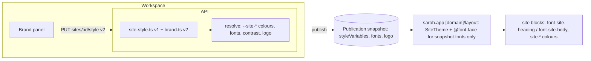
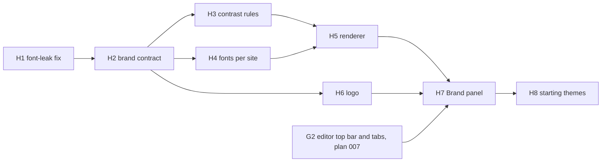

# Design system: Brand v2

## Summary

Two things, in this order. The first is a bug fix. `apps/saroh.app` loads
Saroh's own faces, Geist and Bricolage Grotesque, into every merchant site, and
the booking flow sets its headings in Saroh's `font-display`. **H1 fixes that
in phase 1**: merchant pages load no Saroh font, the blocks draw type from new
`--site-font-*` tokens, and a check fails the build if a Saroh face comes back.

The rest is **Brand v2**, the merchant's own small design system, as the Site
Editor's Brand tab draws it:

- a main colour (any hex);
- a background mode (Light, Warm, Cool, Dark) that sets every neutral together;
- a heading font and a body font from a short, self-hosted list with
  Devanagari coverage;
- a logo;
- contrast worked out automatically;
- four starting themes and "Go back to the template's look".

It is a new version of the site style (`Site.style`). It resolves into the same
`--site-*` layer at publish, so every existing publication keeps rendering
exactly as it did.

Hindi is not part of this round. It is described under "Later" and not counted
as units.

---

## Problem Frame

- **The leak.** `apps/saroh.app/app/layout.tsx` wraps every request in
  `localFont` Geist (`--font-sans`) and Bricolage Grotesque (`--font-display`)
  from `packages/ui/fonts`, and sets `font-sans` on `<body>`. The booking flow
  in `packages/site-blocks/src/booking-flow` writes `font-display` in eight
  files. A dental clinic's booking page is therefore set in Saroh's
  typography. That breaks the rule AGENTS.md lists under "Rules that bite" —
  merchant sites never inherit Saroh's brand, and the `--site-*` layer is
  separate by design — which `pnpm run check:blocks` (G2, G6) enforces for
  colour but not for type.
- **The brand.** Today a site's look is six colour rows of five curated
  swatches and five spacing scalars (#189, `site-style.ts`), stored as choice
  keys. The designs give a merchant:
  - their own colour as any hex;
  - a background mode that retunes every neutral;
  - heading and body fonts;
  - a logo that replaces the letter in the header;
  - automatic contrast (button text white or dark, links in the nearest
    shade that reaches 4.5:1);
  - four starting themes: Warm bakery, Bright studio, Calm clinic, Evening.

  None of that fits the curated-keys model, and there are no type tokens on
  the merchant layer at all.

---

## Requirements

- R1. No merchant page (`apps/saroh.app/app/[domain]/**`, the booking flow, checkout, the pay page, preview and review) loads a Saroh font file or sets text in a Saroh font variable.
- R2. The merchant token layer carries type: `--site-font-heading` and `--site-font-body`. Every `SiteTheme` default is a neutral system stack, and blocks set type only through these tokens.
- R3. A build-time check fails if a site block uses Saroh's `font-sans`, `font-display` or `font-mono`, or if `apps/saroh.app` loads a face from `packages/ui/fonts` for a merchant route.
- R4. A site's style gains a version 2 — a brand:
  - a main colour (`#RRGGBB`);
  - a background mode (Light, Warm, Cool or Dark);
  - a heading font key and a body font key;
  - a logo (a media id or none) and a logo letter;
  - the starting theme it came from, if any.
- R5. A version 1 style keeps validating, reading and publishing unchanged. When the Brand panel first opens on a v1 site, it offers the nearest v2 values (default 65), and nothing changes until the merchant saves.
- R6. Contrast is automatic and explained:
  - button text is white or dark, whichever reads better on the main colour;
  - link and accent text use the nearest shade of the main colour that reaches 4.5:1 on the background;
  - the panel says when it adjusted a colour (default 66).
- R7. Fonts come from a curated list: five heading faces and three body faces, each with a Devanagari fallback. They are self-hosted by `saroh.app` and preloaded only for the faces a site uses; nothing is fetched from a third party at view time (default 69).
- R8. A site shows the business's logo (`BusinessProfile.logoUrl`) unless a site logo is set, with the logo letter as the fallback (default 68). A site logo follows DEC-029: PNG, JPEG or WebP under 1 MB, never SVG.
- R9. The Site Editor has a Brand tab:
  - before a brand exists, four starting themes (the one matching the business marked Suggested) or Start from scratch;
  - afterwards, theme chips, main colour (7 swatches or any hex), background, heading type, body type, logo, and "Go back to the template's look";
  - Undo on theme and reset.
- R10. The brand is part of the site, not the page. A change is an unpublished change until Publish, and the canvas shows it live.
- R11. "Runs on Saroh" stays in every site's footer this round (default 67), set in the site's own type and colours.

---

## Scope Boundaries

- Colours and type on merchant sites only. Saroh's own tokens (`packages/ui/src/globals.css`, `tooling/tailwind-config`) and ADR-005's Ink & Saffron are unchanged.
- No corner or button styles, no custom font uploads, and no photo uploads here: Site Editor photo slots are plan 007 (G7, G8).
- New-site setup with templates and placeholders is plan 007 (G21), which builds on H2 and H8.
- No change to how publishing, review and the review bypass work (DEC-047).

### Deferred to Follow-Up Work

- **Hindi** — see "Later" below.
- Removing "Runs on Saroh" from a site.
- Corner radius and button shape as brand choices.
- A merchant's own uploaded font.
- Retiring the v1 swatch rows once no site uses them (a later migration, with its own count).

---

## Context & Research

### Relevant Code and Patterns

- **Where the leak comes from.** A grep for `font-display`, `Geist` and
  `Bricolage` over `apps/saroh.app` and `packages/site-blocks/src` finds:
  - `apps/saroh.app/app/layout.tsx` — `localFont` for
    `packages/ui/fonts/Geist-latin.woff2` (`--font-sans`) and
    `BricolageGrotesque-latin.woff2` (`--font-display`), and `font-sans` on
    `<body>`, for every route;
  - `apps/saroh.app/app/page.tsx` — the bare renderer apex, the one
    Saroh-owned surface here (it draws `<Wordmark>`, which is outlined and
    needs no font);
  - `font-display` in
    `packages/site-blocks/src/booking-flow/{booking-flow,summary}.tsx`;
  - `font-display` in
    `packages/site-blocks/src/booking-flow/steps/{done-card,sessions,paying-card,step-head,one-to-one,expired-card}.tsx`.

  That is twelve matches in the booking flow and the apex. H1 re-greps for
  `font-sans` and `font-mono` too, which fall back to the same Saroh
  variables through `tooling/tailwind-config/tailwind.config.ts`
  (`fontFamily`).
- **The merchant layer:**
  - `packages/site-blocks/src/site-theme.tsx` (`SiteTheme` with defaults for
    every `--site-*` colour, `SiteThemeScope`, `cssVariables` and
    `safeSelector` checks);
  - `packages/site-blocks/src/tailwind-preset.ts` (`siteColors`,
    `siteBlocksPreset`, with no `fontFamily`);
  - `apps/saroh.app/tailwind.config.ts`;
  - `packages/site-blocks/src/site-chrome.tsx` (`SiteHeader` and
    `SiteFooter`, which show the name and have no logo today).
- **The gates.** `scripts/check-blocks.mjs` (`pnpm run check:blocks`) has G2
  (no Saroh colour token in blocks, `SAROH_TOKEN_RE`, which matches colour
  utilities only) and G6 (no `--site-*` outside the package, plus an
  allowlist of Saroh surfaces on merchant pages). The pattern is
  `docs/patterns/frontend-design-system.md`, "Two token layers, never mixed"
  and "Type and the mark", whose line "`saroh.app` keeps its old faces" is
  exactly the leak and must change.
- **Site style today:**
  - `apps/api.saroh.in/src/modules/sites/site-style.ts` (`STYLE_ROWS`, choice
    keys, pure) and its spec `site-style.spec.ts`;
  - `sites.service.ts` `updateStyle` (authorised by `site:update`, behind
    `PUT sites/:siteId/style` in `sites.controller.ts`);
  - the publish path (`parseSiteStyle` → the snapshot's `style` and
    `styleVariables`, around `sites.service.ts:1713–1775`);
  - `packages/database/prisma/schema.prisma` `Site.style Json?`, whose
    comment says curated keys, not hex;
  - `apps/app.saroh.in/lib/sites/style.ts` (the pure resolver the editor
    preview shares) and `apps/app.saroh.in/components/sites/style-panel.tsx`;
  - the renderer reads `styleVariables` from the snapshot
    (`apps/saroh.app/lib/publication.ts`) into `<SiteTheme>` in
    `apps/saroh.app/app/[domain]/layout.tsx`.
- **The logo:**
  - `BusinessProfile.logoMediaId` and `logoUrl` in `schema.prisma`;
  - `apps/api.saroh.in/src/modules/organizations/organization-settings.service.ts`
    and `modules/media/media.service.ts` (DEC-029 formats).
- **Fonts on disk:** `packages/ui/fonts/` holds Geist, Bricolage Grotesque,
  Space Grotesk, JetBrains Mono and CalSans — all Saroh's product faces,
  which the merchant list must not share by path.
- **The editor:** `apps/app.saroh.in/components/sites/site-editor.tsx`
  (2,160 lines; plan 007 G1 splits it and G2 adds the Page · Add · Brand
  tabs), `components/sites/section-preview.tsx` (the canvas),
  `lib/sites/editor-status.ts` (unpublished changes).
- **Tests:**
  - api unit `apps/api.saroh.in/jest.config.js` (explicit `testMatch`);
  - `apps/app.saroh.in` vitest on `lib/**`;
  - `apps/saroh.app/vitest.config.ts` (`lib/**/*.test.ts`, node);
  - `packages/site-blocks/src/blocks.test.tsx` with `__snapshots__`;
  - e2e `e2e/tests/public-booking.spec.ts` and `e2e/tests/site-versions.spec.ts`.

### Design references

- `Saroh Site Editor.dc.html`, Brand tab:
  - five heading choices — Geometric, Serif, Plain, Lively, Book;
  - three body choices — Plain, Book, Lively;
  - each with a Devanagari fallback;
  - four presets: Warm bakery, Bright studio, Calm clinic, Evening;
  - background modes: Light, Warm, Cool, Dark;
  - 7 swatches or any hex, a logo upload that replaces the letter, and
    "Go back to the template's look".
- `Saroh Customer Site.dc.html` — the site wearing the brand (header logo
  and name, colours, heading and body type).
- DESIGN-NOTES "Site Editor — every business, Hindi, brand (26 Sep)" —
  contrast is automatic and the panel says when it adjusted.

### Institutional Learnings

- A publication is immutable (ADR-002). A style change must never restyle
  something already published; `SiteTheme`'s defaults exist because
  pre-#189 publications carry no variables. The same holds for fonts: a
  publication with no font variables renders in the neutral default after
  H1, which is intended — that is the fix.
- The palette's values live in one place, the API's `site-style.ts`, and the
  app resolves in the browser from options the API serves (#189), so the
  preview and the publish cannot drift. Brand v2 keeps this: the contrast
  and resolution maths is one pure module, mirrored in the app the same way.
- 00-universal §15: a redesign keeps every capability. The v1 swatch rows and
  spacing sliders stay reachable.

### External References

- WCAG 2.2 contrast ratio (relative luminance), 4.5:1 for body-size text. The
  maths is small and pure; no library.

---

## Key Technical Decisions

- **Type joins the merchant layer as two tokens.** `--site-font-heading` and
  `--site-font-body`, with defaults in `SiteTheme` set to a neutral system
  stack (`ui-sans-serif, system-ui, -apple-system, "Segoe UI", Roboto,
  "Noto Sans", "Noto Sans Devanagari", sans-serif`). `siteBlocksPreset` gains
  `fontFamily: { "site-heading": …, "site-body": … }`, so blocks write
  `font-site-heading` and `font-site-body`. The booking flow's `font-display`
  becomes `font-site-heading`.
- **`saroh.app` loads no Saroh face at all.** The root layout drops both
  `localFont` calls. The apex page and the other Saroh-drawn surfaces on
  merchant pages (the 404, error and loading boundaries, checkout chrome, the
  G6 allowlist) render in the neutral stack under `data-skin="mono"`, as they
  already do for colour. Loading Geist for the apex alone is not worth a
  per-route split. The pay page, which ADR-007 says is in the business's site
  theme, uses the site tokens.
- **The check is static and in the browser.** `check-blocks.mjs` gains G7:
  - no `font-sans`, `font-display` or `font-mono` utility inside
    `packages/site-blocks/src`;
  - no import of `packages/ui/fonts` or `next/font` anywhere in
    `apps/saroh.app`.

  An e2e test also loads a merchant page and the booking page. It fails if
  any font request names a Saroh face, or if the computed `font-family` of a
  heading contains one.
- **Brand v2 is a version of `Site.style`, not a new column.** It is stored
  as `{ version: 2, brand: {...}, spacing: {...} }`. v1 (no version key) keeps
  its parser, and both resolve to the same `--site-*` variables at publish.
  Old publications are untouched because they carry resolved variables.
  Retiring v1 is a later, counted migration.
- **Hex is allowed, and contrast is derived, never stored.**
  - The API validates `#RRGGBB` and computes the derived tokens:
    - `accent-fg` (white or near-black, whichever has the higher ratio);
    - a link or accent-text shade (step the colour's lightness in HSL toward
      the background's opposite until the ratio is at least 4.5:1, at most
      20 steps, else fall back to the foreground);
    - hero, CTA and footer grounds and their foregrounds from the background
      mode.
  - Pure module `brand.ts` beside `site-style.ts`, mirrored in
    `apps/app.saroh.in/lib/sites/brand.ts` with a shared fixture test that
    pins identical outputs.
  - The result carries `adjusted: ["link", …]` so the panel can say what it
    changed.
- **Background modes are four fixed neutral sets** (Light, Warm, Cool, Dark),
  each a full set of `bg`, `surface`, `fg`, `body`, `muted` and `border` HSL
  values tuned so body text is well above 4.5:1. That meets PRODUCT.md's
  shop-floor rule on the merchant's site too. Dark is a first-class mode, not
  an inversion.
- **Fonts are a curated catalogue served by the renderer.**
  - `packages/site-blocks/src/fonts.ts` lists keys → family, weight and a
    `/site-fonts/<file>.woff2` path.
  - The files live in `apps/saroh.app/public/site-fonts/` — a copy
    deliberately separate from `packages/ui/fonts`, so G7 can forbid the
    latter.
  - The list follows the design: Geometric (Space Grotesk), Serif (Instrument
    Serif), Plain (Geist), Lively (Bricolage Grotesque) and Book (Literata)
    for headings; Plain, Book and Lively for body. Noto Sans Devanagari
    (subset) is the fallback in every stack.
  - A merchant who chooses Plain gets Geist as their own font through the
    site tokens. It is not Saroh's layout variable, so it is their choice
    and not a leak.
  - All the faces are OFL; the licence files ship with them.
  - The snapshot carries `fonts: [key…]`, and the tenant layout emits
    `@font-face` rules and `<link rel="preload">` only for those.
- **The logo resolves at publish.** The site logo's media URL if set, else
  `BusinessProfile.logoUrl`, else none. The letter defaults to the site
  name's first letter. The snapshot carries `logo: { url | null, letter }`,
  so a later change to the business logo does not restyle a published site.
  It shows on the next publish, like any other site change.
- **Starting themes are data, not code paths.**
  - Four theme records live in the brand module: colour, mode, heading font
    and body font.
  - The one to suggest is chosen from the business's modules and type,
    using the same heuristic the design uses: a clinic suggests Calm clinic,
    classes suggest Bright studio, a shop suggests Warm bakery.
  - "Go back to the template's look" restores the site's template theme, or
    the v1 look for a pre-v2 site.
- **The brand save stays `site:update`** (today's `updateStyle`), a whole
  replacement and not a merge, as #189 reasoned. The logo upload uses the
  existing media purpose and checks (`media:write`).
- **The v1 panel stays reachable.** The six swatch rows and five spacing
  sliders move under "Advanced" in the Brand tab. The spacing scalars carry
  into v2 unchanged. Picking a swatch row on a v2 site overrides the derived
  value for that band.

### Permissions touched

| Action | Needs | Change |
|---|---|---|
| Read the brand and its options | `site:read` | none |
| Save the brand (colour, mode, fonts, theme, reset, advanced rows) | `site:update` | none (today's `PUT sites/:id/style`) |
| Upload or remove a site logo | `media:write` + `site:update` | none |
| Publish the brand with the site | `site:publish` | none (DEC-047 bypass unchanged) |
| See the Brand tab as a Reviewer | — | a Reviewer never opens the editor (#275) |

No new action. Nothing here is blocked on the matrix review.

---

## Open Questions

### Resolved During Planning

- The font leak is fixed before any brand work, alone, in phase 1 (DEC-046).
- Old styles map to the nearest v2 values, and the old version keeps validating (default 65).
- Any hex, with automatic contrast (default 66).
- "Runs on Saroh" stays (default 67).
- The business logo is reused unless a site logo is set, with the letter as the fallback (default 68).
- Fonts are self-hosted from a curated list with Devanagari coverage (default 69).

### Deferred to Implementation

- The exact neutral values of the four background modes, tuned against the design's swatches and checked by the contrast tests.
- Whether the Devanagari fallback is one subset file or split by weight, after measuring file sizes.
- The per-font `size-adjust` or `ascent-override` descriptors that stop layout shift when the site font swaps in.

---

## High-Level Technical Design

> *Directional guidance for review, not implementation specification.*

---

## Implementation Units

### H1. The font-leak fix: merchant sites load no Saroh font

**Goal:** No merchant page is set in Saroh's typography, and nothing can put it back unnoticed.

**Requirements:** R1, R2, R3

**Dependencies:** None

**Phase:** 1 — first, alone, small.

**Files:**
- Modify: `apps/saroh.app/app/layout.tsx` (drop both `localFont` loads and the `font-sans` body class; keep `data-skin="mono"`)
- Modify: `packages/site-blocks/src/site-theme.tsx` (add `--site-font-heading` and `--site-font-body` defaults: a neutral system stack with `Noto Sans Devanagari`)
- Modify: `packages/site-blocks/src/tailwind-preset.ts` (add a `fontFamily` for `site-heading` and `site-body`)
- Modify: `packages/site-blocks/src/booking-flow/{booking-flow,summary}.tsx`, `booking-flow/steps/{done-card,sessions,paying-card,step-head,one-to-one,expired-card}.tsx` (`font-display` → `font-site-heading`)
- Modify: `apps/saroh.app/app/page.tsx` (the apex: no `font-display`; system stack)
- Modify: any other site-blocks file the G7 grep finds using `font-sans` or `font-mono`
- Modify: `scripts/check-blocks.mjs` (add G7)
- Modify: `docs/patterns/frontend-design-system.md` (replace "`saroh.app` keeps its old faces" with the rule, and add G7 to "Two token layers")
- Create: `e2e/tests/site-fonts.spec.ts`
- Test: `packages/site-blocks/src/blocks.test.tsx` (snapshots updated; assert that the booking-flow heading carries `font-site-heading`)

**Approach:**
- Grep first and list every hit in the PR description. Check `font-sans` and `font-mono` as well as `font-display`, since all three resolve to Saroh variables through `tooling/tailwind-config`.
- The system stack is the default for every publication, old and new. That is the visible change of this unit, and it is intended.
- G7 in `check-blocks.mjs`:
  - (a) `\bfont-(sans|display|mono)\b` in `packages/site-blocks/src` code (comments stripped by the existing `code()` helper) fails;
  - (b) any `packages/ui/fonts` path or `next/font` import under `apps/saroh.app` fails.

  Both print the reason in merchant-site words, like G2 and G6.
- The e2e test opens a seeded merchant home page and the booking page (Pulse, read-only) and collects font requests. It fails on any URL containing `Geist`, `Bricolage`, `SpaceGrotesk` or `JetBrainsMono`, and asserts that an `h1` and a booking step heading have a computed `font-family` without those names.

**Patterns to follow:** G2 and G6 in `scripts/check-blocks.mjs`; the `SiteTheme` default comments ("every siteColors key has a default").

**Test scenarios:**
- Happy path: a merchant home page and the booking page make no request to a Saroh font file; headings compute to the system stack.
- Edge case: a publication from before #189 (no `styleVariables`) renders with the default type tokens and no unstyled text.
- Error path: reintroducing `font-display` in a booking step makes `pnpm run check:blocks` fail with G7.
- Error path: adding `localFont` for `packages/ui/fonts` to the saroh.app layout fails G7.
- Integration: the checkout, pay page, 404 and error boundary still render legibly (visual check in the four scenes, dark included).

**Verification:** `pnpm run check:blocks` passes with G7. The e2e test passes. Side-by-side on Pulse's booking page shows no Saroh face, and DevTools' network panel shows no `packages/ui/fonts` file.

---

### H2. Brand v2 contract: the style's second version

**Goal:** `Site.style` can hold a brand, and v1 styles keep working.

**Requirements:** R4, R5, R10

**Dependencies:** H1

**Phase:** 2

**Files:**
- Modify: `apps/api.saroh.in/src/modules/sites/site-style.ts` (a version switch; `parseSiteStyle` returns a union; v1 is untouched)
- Create: `apps/api.saroh.in/src/modules/sites/brand.ts` (types, keys, background modes, theme records, validation)
- Modify: `apps/api.saroh.in/src/modules/sites/sites.service.ts` (`updateStyle` accepts v1 or v2; the site read serves the brand options: fonts, modes, themes and swatches)
- Modify: `apps/api.saroh.in/src/modules/sites/dto.ts`
- Modify: `packages/database/prisma/schema.prisma` (the `Site.style` comment only; no migration)
- Modify: `apps/app.saroh.in/lib/sites/style.ts` (types for v2 and the options)
- Test: `apps/api.saroh.in/src/modules/sites/brand.spec.ts`, updates to `site-style.spec.ts` and `sites-look.service.spec.ts`; add `brand.spec.ts` to `jest.config.js` `testMatch`

**Approach:**
- Store v2 as `{ version: 2, brand: { color, mode, headingFont, bodyFont, logoMediaId, logoLetter, theme }, spacing, overrides? }`.
  - `color` is `#RRGGBB`, upper-cased.
  - `mode` is one of `light`, `warm`, `cool`, `dark`.
  - `logoLetter` is one character, any script.
  - `overrides` holds the v1 band rows (hero, CTA, footer) chosen under Advanced.
- Unknown keys are refused, and the whole style is replaced on save (as #189).
- `nearestV2(v1)` maps a v1 style to v2: its accent swatch's HSL becomes the hex, and the page ground picks the mode (paper→light, bone or sand→warm, mist→cool, slate→dark). It is only a suggestion the panel offers, never written on read.
- The publish path records `styleVersion` in the snapshot, so the renderer and support can tell which resolved it.

**Patterns to follow:** `site-style.ts` (pure, no DI), `STYLE_ROWS` served with the site so the app never copies values.

**Test scenarios:**
- Happy path: a v2 style saves and reads back identically; a v1 style saves and reads back identically.
- Edge case: `nearestV2` for each v1 page ground returns the mapped mode; an unknown v1 key falls back to the defaults.
- Error path: `#12345`, `red`, an unknown font key, an unknown mode, a two-character letter, or extra fields → 400 with a field-named message.
- Error path: another business's site → 404; a Member → 403 (`site:update`).
- Integration: publishing a v1 site after this unit produces the same `styleVariables` as before (a snapshot test against today's output).

**Verification:** Existing sites publish byte-identical variables; the API serves brand options.

---

### H3. Contrast and brand rules: one pure module in the API and the app

**Goal:** A brand resolves into `--site-*` colours with guaranteed contrast, and the resolution is identical in the editor preview and at publish.

**Requirements:** R6

**Dependencies:** H2

**Phase:** 2

**Files:**
- Modify: `apps/api.saroh.in/src/modules/sites/brand.ts` (`resolveBrand(brand) → { variables, adjusted }`)
- Create: `apps/app.saroh.in/lib/sites/brand.ts` (the mirror, no server imports)
- Create: `packages/block-contract/src/brand-fixtures.ts` (worked examples shared by both test suites)
- Test: `apps/api.saroh.in/src/modules/sites/brand.resolve.spec.ts`, `apps/app.saroh.in/lib/sites/brand.test.ts`

**Approach:**
- Use WCAG relative luminance and ratio.
- `accent-fg` is white or `#111`, whichever gives the higher ratio against the main colour.
- The link shade is the main colour's hue and saturation, with lightness stepped toward the background's opposite in 2% steps until it reaches 4.5:1 on the background. If none does within 20 steps, it falls back to `fg` and is reported adjusted.
- The hero, CTA and footer grounds derive from the mode and the main colour: the hero is the background's surface, the CTA is the main colour, and the footer is a darkened neutral. Each has its foreground chosen by ratio.
- The body text of every mode is checked to be at least 7:1, and the muted text at least 4.5:1.
- The resolver returns HSL triples, as the `--site-*` layer expects.
- The app mirror is kept identical by the shared fixtures: both suites run every fixture and compare with the expected variables.

**Patterns to follow:** `lib/invoices/invoice-number.ts` ↔ `invoices/numbering.ts` (a pure rule mirrored and kept in step by tests); `site-style.ts`.

**Test scenarios:**
- Happy path: the four themes' colours in each mode produce the fixture variables.
- Edge case: a mid-yellow (`#F0A92B`) on Light gets dark button text and a darkened link shade, and `adjusted` includes `link`.
- Edge case: a very dark colour on Dark gets a lightened link shade.
- Edge case: a grey that no shade can lift to 4.5:1 falls back to `fg` and reports it.
- Integration: every fixture resolves identically in the API and the app.

**Verification:** Both suites pass on the shared fixtures; no mode's body text is below 7:1.

---

### H4. Fonts per site: the curated catalogue, self-hosted

**Goal:** A site can use its chosen heading and body faces, served by `saroh.app`, with only the faces it uses loaded.

**Requirements:** R7, R2

**Dependencies:** H2

**Phase:** 2

**Files:**
- Create: `packages/site-blocks/src/fonts.ts` (the catalogue: key, label, family, weights, file paths and stacks with the Devanagari fallback)
- Create: `apps/saroh.app/public/site-fonts/` (woff2 files: Space Grotesk, Instrument Serif, Geist, Bricolage Grotesque, Literata and a Noto Sans Devanagari subset, with `OFL.txt` per family)
- Create: `packages/site-blocks/src/site-fonts.tsx` (`SiteFonts`: `@font-face` rules and preloads for a list of keys)
- Modify: `packages/site-blocks/src/index.ts` (exports)
- Modify: `apps/api.saroh.in/src/modules/sites/brand.ts` (font keys validated against the catalogue; the catalogue is imported from the package or mirrored by a test)
- Modify: `apps/api.saroh.in/src/modules/sites/sites.service.ts` (the snapshot gains `fonts: string[]`)
- Modify: `apps/saroh.app/lib/publication.ts` (types and the shape check)
- Test: `packages/site-blocks/src/fonts.test.ts`, `apps/saroh.app/lib/publication-fonts.test.ts`

**Approach:**
- The font files are copied into `public/site-fonts`, never referenced from `packages/ui/fonts`, which G7 forbids.
- `font-display: swap`, with metric overrides where measured.
- `SiteFonts` writes `--site-font-heading` and `--site-font-body` stacks. With no brand, it writes nothing and `SiteTheme`'s defaults apply.
- A snapshot names at most two families plus Devanagari, so a page never preloads the whole catalogue.
- The editor preview (plan 007's canvas) loads the same `SiteFonts` from the same public path. `app.saroh.in` needs a same-origin copy or a rewrite to the renderer, decided in H7 with the preview's frame.

**Patterns to follow:** `SiteTheme` (validated names and values before they reach a `<style>`); `shareImages` in `lib/publication.ts` for snapshot-derived head tags.

**Test scenarios:**
- Happy path: `fonts: ["serif", "plain"]` emits two `@font-face` rules, the Devanagari rule and two preloads.
- Edge case: the same key for heading and body emits one rule.
- Error path: an unknown key in a snapshot is dropped and the default stack is used; no request is made for it.
- Integration: the e2e test from H1 still passes on a site using "Plain", because the requests go to `/site-fonts/`, not the Saroh font path.

**Verification:** A test site set to Serif and Book loads exactly those files. The H1 check still passes.

---

### H5. The renderer draws the brand

**Goal:** A published v2 site renders with its colours, modes, fonts and contrast; a v1 site renders as before.

**Requirements:** R6, R7, R10, R11

**Dependencies:** H3, H4

**Phase:** 2

**Files:**
- Modify: `apps/api.saroh.in/src/modules/sites/sites.service.ts` (publish: v2 → `resolveBrand` → `styleVariables`, plus `fonts` and `styleVersion`)
- Modify: `apps/saroh.app/app/[domain]/layout.tsx` (render `SiteFonts` from the snapshot)
- Modify: `packages/site-blocks/src/site-theme.tsx` (defaults for any new variables, e.g. `--site-link`)
- Modify: `packages/site-blocks/src/tailwind-preset.ts` (`link` in `siteColors`)
- Modify: `packages/site-blocks/src/blocks/*.tsx` (headings on `font-site-heading`, body on `font-site-body`, links on `text-site-link`)
- Modify: `packages/site-blocks/src/site-chrome.tsx` (footer "Runs on Saroh" in the site's type and colours, linking to saroh.in)
- Modify: `apps/saroh.app/components/invoice-pay.tsx`, `apps/saroh.app/components/checkout.tsx` (use the site type tokens)
- Test: `packages/site-blocks/src/blocks.test.tsx` (snapshots per mode), `apps/api.saroh.in/src/modules/sites/sites.service.spec.ts` (publish v2)

**Approach:**
- Every block moves to the two type tokens and the link token in one pass. The G7 check keeps them there.
- The pay page and checkout take the site's variables when the snapshot is available and the defaults otherwise.
- Dark mode is a site choice, not the visitor's system setting. A Dark site is dark for everyone, as the design shows.

**Patterns to follow:** #189's move from hard-coded defaults to snapshot variables; G6's allowlist for Saroh surfaces on merchant pages.

**Test scenarios:**
- Happy path: a v2 Warm bakery site publishes and renders its colours, serif headings and link shade; the snapshot carries `fonts` and `styleVersion: 2`.
- Edge case: a v1 site publishes identically to before; a pre-#189 publication renders with defaults.
- Edge case: a Dark site's footer, CTA and booking flow all meet 4.5:1 (an automated contrast check over the rendered blocks in the test).
- Integration: the booking flow on a v2 site uses the site's heading font and button colours.

**Verification:** Side-by-side with `Saroh Customer Site.dc.html` for Rye (Warm), Pulse (Light) and Kavi (Cool). The four-scene check passes, dark included.

---

### H6. The logo on the site

**Goal:** A site shows a logo — its own, else the business's — with the letter as the fallback.

**Requirements:** R8

**Dependencies:** H2

**Phase:** 2

**Files:**
- Modify: `apps/api.saroh.in/src/modules/sites/brand.ts` (`logoMediaId` validated: the business's own media, an image purpose, PNG, JPEG or WebP under 1 MB per DEC-029)
- Modify: `apps/api.saroh.in/src/modules/sites/sites.service.ts` (publish resolves `logo: { url | null, letter }`: the site logo, else `BusinessProfile.logoUrl`, else null)
- Modify: `packages/site-blocks/src/site-chrome.tsx` (`SiteHeader` draws the logo image with the site name as alt text, or the letter in a disc on the main colour)
- Modify: `apps/saroh.app/lib/publication.ts` (shape)
- Test: `apps/api.saroh.in/src/modules/sites/brand.logo.spec.ts`, `packages/site-blocks/src/blocks.test.tsx` (the header with a logo, a letter, neither)

**Approach:**
- The logo is resolved at publish, so a later change of the business logo shows on the next publish, as an unpublished change the editor's status names ("brand").
- The image is height-bound in the header (at most 40 px tall), and width is automatic.
- No SVG.

**Patterns to follow:** DEC-029's checks in `media.service.ts` and `organization-settings.service.ts`.

**Test scenarios:**
- Happy path: a site logo set → the header shows it; removed → the business logo; neither → the letter.
- Error path: an SVG or a 2 MB PNG → 400; another business's media id → 404.
- Edge case: a Devanagari logo letter renders in the Devanagari fallback.
- Integration: changing the business logo marks the site as having unpublished changes.

**Verification:** Rye shows its logo, Pulse the letter, and the header reads well on a phone and in each mode.

---

### H7. The Brand panel in the Site Editor

**Goal:** A merchant sets up and changes their brand in the editor, sees it live on the canvas, and publishes it with the site.

**Requirements:** R6, R9, R10

**Dependencies:** H5, H6, G2 (plan 007: the top bar and the Page · Add · Brand rail tabs, after G1's split)

**Phase:** 2

**Files:**
- Create: `apps/app.saroh.in/components/sites/brand-panel/{brand-panel,theme-chips,colour-field,mode-picker,font-picker,logo-field,advanced-rows}.tsx`
- Modify: `apps/app.saroh.in/components/sites/style-panel.tsx` (becomes the "Advanced" section inside the Brand panel; nothing removed)
- Modify: `apps/app.saroh.in/lib/sites/{style,actions,editor-status}.ts` (v2 saves; status names "brand" as unpublished)
- Modify: the canvas and preview component from plan 007 G1 and G5 (apply `resolveBrand` variables and `SiteFonts` live)
- Test: `apps/app.saroh.in/lib/sites/brand.test.ts` (panel state rules), `e2e/tests/site-brand.spec.ts` (Northwind only: set a colour and a font, publish, see it live)

**Approach:**
- **Before a brand exists** (v1 or no style), the page list says "Your brand isn't set up yet". The tab offers the four themes (H8) and "Start from scratch", which starts from `nearestV2`.
- **After:**
  - theme chips;
  - main colour (7 swatches plus a hex field, validated as typed);
  - background (Light, Warm, Cool, Dark);
  - heading type (5) and body type (3), each shown as a sample set in that face;
  - the logo (upload, remove, letter);
  - Advanced (the v1 rows and spacing);
  - "Go back to the template's look".
- **Contrast notes:** when `adjusted` is not empty, the panel says so in words ("Links use a darker shade of your colour so they're easy to read"). Colour is never the only signal.
- **Undo** on a theme change and on reset: a toast with Undo, using plan 007 G3's toast pattern, not a confirm.
- **Read-only** without `site:update`: the fields show values but are disabled, with a line saying who can change them.
- **Four scenes:**
  - phone: the panel is the overlay inspector from plan 007 G4;
  - no hover-only controls;
  - the hex field has a large target.

**Patterns to follow:** `style-panel.tsx` (options served by the API, resolved in the browser); `.agents/skills/saroh-four-scenes/SKILL.md`; `docs/patterns/frontend-forms.md`.

**Test scenarios:**
- Happy path: choose Calm clinic, change the colour to a hex, pick Serif headings, publish → the live site matches.
- Edge case: typing an invalid hex shows an inline message and does not save; the canvas keeps the last valid colour.
- Edge case: a v1 site opens with "Your brand isn't set up yet"; Start from scratch offers the nearest values; closing without saving changes nothing.
- Error path: a save fails → a named error in the panel, and the canvas reverts to the saved brand.
- Error path: a Member sees the panel read-only.
- Integration: the editor status says "Not published · brand" until Publish.

**Verification:** Side-by-side with the Brand tab in `Saroh Site Editor.dc.html`. Browser checks write only on Northwind.

---

### H8. Starting themes and "Go back to the template's look"

**Goal:** A merchant can start from one of four themes, with the right one suggested, and get back to their template's look in one step.

**Requirements:** R9

**Dependencies:** H7

**Phase:** 2

**Files:**
- Modify: `apps/api.saroh.in/src/modules/sites/brand.ts` (the four theme records; `suggestTheme(business)` from modules and business type; the template's theme)
- Modify: `apps/api.saroh.in/src/modules/sites/sites.service.ts` (the site read serves `suggestedTheme` and `templateTheme`)
- Modify: `apps/app.saroh.in/components/sites/brand-panel/theme-chips.tsx`, `brand-panel.tsx`
- Test: `apps/api.saroh.in/src/modules/sites/brand.themes.spec.ts`, `apps/app.saroh.in/lib/sites/brand.test.ts`

**Approach:**
- The themes are Warm bakery, Bright studio, Calm clinic and Evening. Each has its colour, mode, heading font and body font, as in the design.
- The suggestion:
  - Appointments on with a clinic-like service mix → Calm clinic;
  - Appointments with classes or packs → Bright studio;
  - Commerce only → Warm bakery;
  - otherwise none.
- "Go back to the template's look" writes the template's theme, or for a site made before v2, restores its last v1 style kept in the style record's `overrides`. It is Undo-able.
- Plan 007 G21 (new-site setup) reuses these records.

**Test scenarios:**
- Happy path: Kavi Dental is suggested Calm clinic, Pulse Bright studio, Rye Warm bakery.
- Edge case: a business with no modules gets no suggestion, and the chips show without a Suggested mark.
- Happy path: after changes, "Go back to the template's look" restores it, and Undo brings the changes back.

**Verification:** Side-by-side with the design's four theme cards for all three sample businesses.

---

## Later — Hindi (not counted this round)

- **HL1. Locales in the contract, API and renderer.**
  - A general `locales` list on the site (English always; Hindi the only
    other one offered, default 70).
  - Every text field in the section contract gains optional per-locale
    values, as a new contract version beside the old (ADR-002).
  - Header and footer text and names stay single-language.
  - The renderer serves `/hi/...` (or a switch that sets a cookie on the
    site's host) with English as the fallback per field.
  - The customer site's UI strings get a Hindi catalogue.
  - The fonts from H4 already carry Devanagari.
- **HL2. Hindi in the editor.**
  - An EN | हिंदी switch in the top bar edits each field's Hindi value, with
    the English as a faint placeholder.
  - Blocks are tagged "EN only".
  - The bar shows "Hindi: N of M filled", and Publish says how many still
    show English.

Both wait for plan 007's module pages (G14–G16) and the editor split (G1).

---

## System-Wide Impact

- **Interaction graph:**
  - `saroh.app`'s root and tenant layouts, every site block, the booking
    flow, checkout and the pay page;
  - the site style API and publish path;
  - the editor's style panel and canvas;
  - `check-blocks.mjs`;
  - the design-system pattern file.
- **Visible change on day one:** after H1, every merchant site's text moves
  from Geist and Bricolage to the system stack. This is intended (DEC-046),
  and the release note says so.
- **State lifecycle risks:** publications are immutable. v1 and v2 resolve to
  the same variable names, so the renderer never branches on version for
  colour — only for fonts and the logo, which old snapshots lack and fall
  back from.
- **API surface parity:** `PUT sites/:id/style` accepts both versions.
  Nothing else changes shape except the snapshot's new optional fields.
- **Unchanged invariants:**
  - Saroh's tokens and faces in the product apps;
  - G2 and G6;
  - `site:update` for the look;
  - the review and publish rules (DEC-047).

---

## Risks & Dependencies

| Risk | Mitigation |
|------|------------|
| H1 makes merchant sites look plainer overnight | Intended by DEC-046. The neutral stack is tuned (weights, sizes) in the same PR, and a release note names it. |
| Contrast maths drifts between the API and the app | One fixture set in `packages/block-contract`, run by both suites. |
| Font files bloat the page | Preload only the snapshot's faces; subset Devanagari; `swap`; measure in the four-scene check. |
| A merchant picks Geist or Bricolage and it looks like a leak | These are the merchant's choice through site tokens and a separate file path. G7 forbids only the Saroh path and Saroh variables. |
| The Brand panel lands before the editor split | H7 depends on plan 007 G1 and G2; H2–H6 do not. |
| Font licensing | OFL faces only, with licence files shipped beside them. |

---

## Documentation / Operational Notes

- Update `docs/patterns/frontend-design-system.md`:
  - "Type and the mark" loses "`saroh.app` keeps its old faces" and gains
    the rule "merchant pages load no Saroh face; site type comes from
    `--site-font-*`";
  - "Two token layers" gains G7 and the type tokens.
- A DEV_LEARNINGS entry if the metric overrides or the editor preview's
  font origin teach something.
- New api unit specs go in the explicit `testMatch` of
  `apps/api.saroh.in/jest.config.js`.
- No migration and no environment variable.

---

## Sources & References

- Designs: `Saroh Site Editor.dc.html` (Brand tab, fonts, themes), `Saroh Customer Site.dc.html`, `DESIGN-NOTES.md` (26 Sep sections on the brand and the audit round 2).
- Decisions: DEC-046 (this track and the font-leak fix), DEC-029 (logo formats), ADR-002 (immutable publications, versioned contract), ADR-005 (Saroh's own brand), DEC-047.
- Overview: `docs/plans/2026-09-26-000-round-2-overview.md` (epic H; defaults 65–70).
- Related plans: `docs/plans/2026-09-26-007-feat-site-editor-customer-site-plan.md` (G1, G2, G3, G4, G5, G21).
- Code: `apps/saroh.app/app/layout.tsx`, `packages/site-blocks/src/{site-theme,tailwind-preset,site-chrome}.tsx`, `packages/site-blocks/src/booking-flow/**`, `apps/api.saroh.in/src/modules/sites/site-style.ts`, `scripts/check-blocks.mjs`.
