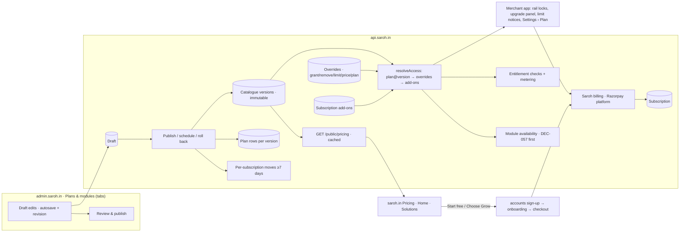

# feat: Plans & modules catalogue (admin) and Marketing Site V2

## Summary

Build one versioned **pricing catalogue** — plans, a module-by-plan matrix with limits, offers (yearly, GST, trials, add-ons, coupons) and per-business overrides — edited in a new tabbed **Plans & modules** screen in admin.saroh.in, served to everyone from the API, enforced for every business, and charged through Saroh's own billing. On top of it, rebuild **saroh.in** to the 17 "Marketing Site V2" designs, with Pricing (and the plan teasers on Home and Solutions) reading the published catalogue, light only, and screenshots captured from the real app. The V2 site goes live early in **waitlist mode** (the `Saroh Waitlist` design, collecting who's interested and why) and one switch moves every CTA to open sign-up when paid plans and enforcement are ready.

---

## Problem Frame

The Marketing Site V2 designs sell three plans (Free ₹0, Grow ₹1,000, Pro ₹5,000) with a detailed matrix, a yearly offer, trials, add-ons and coupons, and they say "Start free" straight into sign-up. None of that is true in the product today:

- Saroh's own billing has versioned `Plan` rows keyed `free/pro/business` with a small `entitlements` map; only websites, storefronts and custom domains are enforced (`billing/entitlement.service.ts`). Products, orders a month, bookings a month, blog posts, team members and integrations are not counted or capped anywhere. Almost every business has no subscription and runs on a hard-coded `FREE_ENTITLEMENTS`.
- There is no way for a merchant to pay Saroh: `razorpay.provider.ts` sends no plan id, there is no checkout, and Settings › Plan and billing shows its buttons disabled (`canChangePlanHere()` is false).
- There is no admin screen for pricing; the admin console only changes one business's plan, trial or a raised limit.
- saroh.in is the V1 site: five job pages, a waitlist as the only ask (#261 gated sign-up), dark mode, no Pricing page, no tests.

The designs define the target: `Saroh Admin Plans v2` (a tabbed catalogue editor with draft → review → publish, versions, scheduled go-live and "keep or move" for existing businesses) and `saroh-catalog.js` (the shared contract: `access()`, `menuState()`, `limitNotice()`, `cardLines()`, `price()`), plus the V2 marketing pages. Verbatim copies are in `docs/prototypes/marketing-site-v2/`.

---

## Requirements

**Catalogue (Track A)**
- R1. One catalogue model with plans, groups, modules and per-plan cells (included with comparison text, card text, limit and period; or excluded as locked/hidden), yearly, GST display, trials per plan, add-ons, published as immutable **versions**; coupons live outside versions.
- R2. Admin **Plans & modules** screen in admin.saroh.in using the design's **tabbed layout**: Plans · Modules · Offers · Versions · Review & publish, with the live/draft status bar, a shared autosaved draft, preview on the pricing page, publish now or on a date, "keep their terms" or "move them" for existing businesses, cancel a scheduled version, roll back, and a server-computed impact view.
- R3. Every catalogue write is permissioned, idempotent and audited with a reason, like the Releases page.
- R4. Per-business overrides (grant or remove a module, set a limit, custom price) and moving one business, on the existing business page (user decision).
- R5. The API serves the **published** catalogue publicly (cached) and the draft only to staff (preview).
- R6. What a business can use comes from the catalogue: its plan on its version, then overrides, then bought add-ons — on the server; the merchant app only mirrors it (DEC-014).
- R7. The catalogue's limits are enforced and metered (products, orders a month, bookings a month, blog posts, team members, integrations, custom roles, themes, site review), with the design's notices at 80% and 100%; anything already over a new limit stays, read-only.
- R8. Locked modules show with an upgrade panel; hidden ones don't show; DEC-057 (rolled-out-off modules never shown) still wins.
- R9. Merchants can pay: choose or change plan, monthly or yearly, trials that convert, coupons, add-ons — charged through Saroh's platform Razorpay, with Saroh's own invoices (user decision: build paid upgrades too).
- R10. Existing businesses are grandfathered on Grow until a date the user sets; new sign-ups start on Free (user decision).

**Marketing Site V2 (Track B)**
- R11. All 17 V2 designs in `apps/saroh.in`: Home, Pricing, 8 Features pages from one template, 3 Solutions pages from one template, shared Nav and Footer — matching the designs exactly (icons, sizes, spacing, colour roles, copy).
- R12. Light only (user decision); no theme toggle.
- R13. Pricing, and the plan teasers on Home and Solutions, read the published catalogue; `?preview` renders a draft for staff.
- R14. "Start free" and plan CTAs go to open sign-up (user decision: lift #261), carrying the chosen plan into onboarding and checkout.
- R15. Product screenshots are captured from the real app's demo businesses by a repeatable script (user decision).
- R16. Every claim on the site matches what ships (`PRODUCT.md`, `docs/patterns/saroh-product.md`).
- R17. Old URLs redirect without chains; sitemap, canonical, Open Graph and structured data cover the new pages.
- R18. The site has tests: content integrity, smoke, visual comparison with the designs, accessibility and Lighthouse.

**Waitlist (interim ask, user 2026-09-29)**
- R19. A `/waitlist` page to the `Saroh Waitlist` design: business name, kind of business, email, city, the source (`?src=`) and a referral link (`?ref=`); the confirmation shows the place on the list and the business's own referral link. It is the site's ask until launch and teaches us who is interested and why.
- R20. While in waitlist mode every "Start free" / "Choose ‹plan›" CTA goes to `/waitlist` (keeping the chosen plan); one launch switch moves them all to sign-up (U27). The launch offer on the page ("3 months of Grow free" from the opening date) is honoured: invites create accounts with a 90-day Grow trial (U31).

---

## Scope Boundaries

- The design's alternate hero copies (`once`, `morning`, `chats`, `original`) and closers (`screen`, `plain`) are not built; the defaults (`saroh` hero, `band` closer) are.
- No CMS for marketing content; content lives in typed files in `apps/saroh.in`.
- No blog, help or docs pages; no Hindi marketing site.
- Merchant sites (`saroh.app`) and their `--site-*` tokens are untouched (AGENTS.md: merchant sites never inherit Saroh's brand).
- Editing catalogue groups, a module's menu mapping or id, reordering or deleting plans: not in the design; not built (see Deferred).

### Deferred to Follow-Up Work

- Group editing, plan reordering/deletion, module deletion in the admin screen: a later batch once the design covers them.
- The 2-minute tour video itself: the site hides "See it in action" until a video is set (see KTD-12).
- Removing the old `/api/waitlist` route and waitlist rows: one release after open sign-up proves out.
- Proration for mid-period plan changes beyond the simple rule in U15: revisit with real usage.

---

## Context & Research

### Relevant Code and Patterns

- **Admin console** (`apps/admin.saroh.in/AGENTS.md`): every page `requireStaff(permission)` (`lib/console.ts`), every write through `OperatorDialog` (`components/operator-dialog.tsx`: what changes, a reason, one idempotency key per attempt), server actions as thin forwarders (`lib/flag-actions.ts`, `lib/business-actions.ts`, `lib/control-plane.ts` → `/admin/*`). Releases page: `app/flags/page.tsx`, `components/flag-card.tsx`, `flag-inspector.tsx`. Business page "Plan and limits": `app/businesses/[organizationId]/page.tsx`, `components/business/plan-actions.tsx`. Nav: `components/console-nav.tsx` (`navFor()`). No tabs pattern in admin; `packages/ui/src/components/ui/tabs.tsx` (Radix) and route tabs in `apps/app.saroh.in/components/settings/settings-tabs.tsx`.
- **Admin API** (`apps/api.saroh.in/src/modules/admin/`): `@AdminRoutes()`, `@RequireAdminPermission`, `IdempotencyService.run`, `AdminAuditService.write(tx, …)` inside the transaction; permissions in `admin-permissions.ts`, checked by `admin.controller.permissions.spec.ts` (every permission must be required by an endpoint). `admin-lifecycle.service.ts` (changePlan, trial, raiseLimit, revokeLimit), `admin-organization-view.service.ts` (limits with usage).
- **Billing & entitlements**: `packages/database/prisma/schema.prisma` `Plan`, `Subscription` (one per org), `EntitlementOverride` (numeric, raise-only), `BillingWebhookEvent`; `billing/entitlement.service.ts` (`FREE_ENTITLEMENTS`, `check()`, `can()`), `billing/plans.service.ts`, `billing/providers/{razorpay,cashfree}.provider.ts`, `platform-secrets.ts`; enforcement points `sites.service.ts`, `stores.service.ts`, `domains.service.ts`; `capabilities/module-availability.service.ts` (authorized → rollout → OrganizationModule → project → entitlement → readiness), `module-registry.ts` (`entitlementKey`, validated against `FREE_ENTITLEMENTS` keys, unused).
- **Merchant app**: `apps/app.saroh.in/components/settings/plan-billing.tsx`, `lib/saroh-billing/{plan,service}.ts`.
- **saroh.in** (`apps/saroh.in`, package `web`, portless `saroh`): App Router, `app/{page,[job],how-it-works,coming-soon}`, `app/api/waitlist`, `robots.ts`, `sitemap.ts`, `lib/{links,site-content}.ts`, `components/{site,home,works}/`, `public/{product,shots}/`, `env.ts` (`NEXT_PUBLIC_ACCOUNTS_URL`, `API_URL`), `next.config.js` redirects, GA4 in `app/layout.tsx`, fonts via `next/font/local` from `packages/ui/fonts` (Geist, Space Grotesk; Plus Jakarta Sans not present), tokens in `packages/ui/src/globals.css` (ADR-005 Ink & Saffron) + `app/site.css`.
- **Design sources**: `docs/prototypes/marketing-site-v2/` (Home, Pricing, Nav, Footer, Features Template with all 8 features' content, Solutions Template with shops/gyms/clinics, Admin Plans v2, `saroh-catalog.js.txt`).
- **Seed demo businesses** for screenshots: Rye & Co. (bakery), Pulse Fitness (gym), Kavi Dental (clinic) — `packages/database/src/seed/showcase/`.

### Institutional Learnings

- Decisions on record: DEC-013 (flags separate from entitlements), DEC-014 (versioned plan/subscription/entitlement enforced server-side; migrate every org to an explicit set), DEC-016 (rollout, pricing and configuration are independent gates), DEC-018/DEC-030 (product caps beside entitlements; the lower wins), DEC-021 (admin console; charging for Saroh deferred then), DEC-057, DEC-059, DEC-062–065.
- `PRODUCT.md`: claims must match what ships; the "one customer record" claim was removed on purpose (commit `38b8b87`) and must not return — V2 copy reintroduces it (see U28).
- Vercel build quota: work lands through the daily batch branch; one push per batch (memory: daily batch flow).
- Full local API integration runs can crash (worker segfault); run in module groups.

### External References

- Razorpay Subscriptions (plans, subscriptions, add-ons, offers, trials via `start_at`, `subscription.*` webhooks) for U15–U17; the platform account uses `SAROH_RAZORPAY_*` keys. Verify current API behaviour in test mode during U15 (a spike step, as D11 did for mandates).

---

## Key Technical Decisions

- **KTD-1. A shared pure package, `packages/pricing-catalog`.** Types and a zod schema for a catalogue snapshot, the design's seed catalogue, and the pure rules from `saroh-catalog.js`: `cardLines`, `diff` (change wording verbatim), `resolveAccess` (plan/version → overrides → add-ons → state, limit, upgradeTo), `limitNotice` (nothing < 80%, warn ≥ 80%, blocked at 100%), price helpers (GST 18%, yearly "pay for N months"), and the move-date rule. The API, admin, merchant app and saroh.in all import it; it never imports `@saroh/database` (frontends may use it — AGENTS.md rule holds). One implementation of each rule means the admin preview, the pricing page and enforcement can't disagree.
- **KTD-2. Versions are immutable JSON snapshots validated by the schema; billing keeps its `Plan` rows.** A new `PricingCatalogVersion` table holds `{version, catalog, goLiveAt, policy, note, changes, publishedBy}`. On publish, the API also writes one `Plan` row per catalogue plan (`key` = catalogue plan id, `version` = catalogue version, price, entitlements derived from the cells) so `Subscription.planId` keeps pointing at an immutable billable thing. The live version is the newest whose `goLiveAt` has passed, resolved at read time (no cron needed to "go live").
- **KTD-3. One shared draft with a revision number.** The design autosaves one shared draft; keep that, and add a `revision` so a second editor's stale save is a 409 naming who saved since (the D5 plan-draft pattern). No per-staff drafts.
- **KTD-4. "Move them" is per subscription, not "the 1st of the month".** The prototype assumes every business renews on the 1st; real renewal dates are per subscription (ADR-007). A move is scheduled for each business at its first billing date at least 7 days after go-live (or after publish), stored on `Subscription` as a pending plan version and date, applied by the renewal path, and announced to the business 7 days before.
- **KTD-5. Add-ons are versioned with the catalogue; purchases live on the subscription.** The prototype reads add-on definitions from the live catalogue even for businesses on older versions — an inconsistency. Add-on definitions belong to the version a business is on; bought quantities are a `SubscriptionAddon` row. Coupons are global (outside versions, as designed) with a redemption table enforcing one use per business and unique codes (the prototype enforces neither).
- **KTD-6. Overrides generalise `EntitlementOverride`.** Add a `kind` (raise, grant, remove, limit, price, plan) and a module key; keep the current raise-only rows working. A `plan` override is how grandfathering works (KTD-7). Overrides apply in order and last until removed or expired.
- **KTD-7. Grandfathering = a time-bound "plan: grow" override for every existing business**, written by a backfill and removed on the date the user sets; new businesses start on the published Free. The hard-coded `FREE_ENTITLEMENTS` fallback is replaced by the published Free plan only after the backfill has run (release order in Operational Notes).
- **KTD-8. Catalogue modules map onto product modules and limits explicitly.** The catalogue's rows (website, themes, review, blog, products, orders, subscriptions, bookings, invoicing, members, roles, integrations) are not the registry's modules (WEBSITE, COMMERCE, APPOINTMENTS…). A mapping table in `packages/pricing-catalog` names, for each catalogue row, the registry module and/or the metered limit key it governs and the menu entry it locks (`menu`/`child`). DEC-057's rollout gate is evaluated first; a module rolled out off is hidden whatever the plan says.
- **KTD-9. Metering counts from the existing tables, with per-month windows in the business's time zone.** Products (active, non-archived), orders placed this month, bookings made this month, blog posts published, team members (memberships + pending invites), integrations (connected providers). Enforcement throws the existing 403 shape with a catalogue-worded message and a stable code; "over the limit" on a plan change leaves existing things readable, blocks creating more.
- **KTD-10. Pricing on saroh.in is statically generated with revalidation.** Pages fetch `GET /public/pricing` at build and revalidate (ISR, e.g. 5 minutes) plus on-demand revalidation called by the API when a version is published or goes live. Draft preview uses a short-lived signed token minted by the admin console (`?preview=<token>`), so saroh.in never needs a staff session.
- **KTD-11. Screenshots are captured, not copied.** A Playwright capture script signs in to the local stack's demo businesses and shoots the ~35 named views at fixed viewports, writing optimised images under `apps/saroh.in/public/shots/v2/` with a manifest mapping the design's shot keys to files. Re-run whenever the app changes.
- **KTD-12. The tour video is optional content.** "See it in action · 2 min" buttons and the `#video` section render only when a video is configured in content; until then they are hidden rather than showing the design's placeholder slot.
- **KTD-13. Marketing content is typed data mirroring the design's data blocks.** `F`, `LINE`, `SOL`, `S`, `FAQ_ALL`, `FAQ_ONE`, Home's `modules`/`kinds`/`faq` become typed files; templates render them. Plan names and prices on the site come from the catalogue; plan *summaries* in teasers come from the catalogue's card lines, not duplicated copy.
- **KTD-14. Light only; Saroh tokens.** The V2 palette (paper `#F5F2EC`, ink `#1C1C1A`, saffron `#D98A15` / button `#F0A92B`, link `#91550C`, body `#43403A`, muted `#6B665A`, lines `#D9D6CC`/`#BCB8AC`) maps onto the ADR-005 tokens in `packages/ui/src/globals.css` where they match; site-only values go in `apps/saroh.in/app/site.css`. `--accent` is not renamed. The theme provider is forced to light for this app only.
- **KTD-16. A single launch switch.** `apps/saroh.in` reads one setting (`launchMode: waitlist | open`, from env) that every CTA builder uses; waitlist mode sends CTAs to `/waitlist?plan=…&src=…`, open mode to sign-up. The waitlist page's opening date and offer are content, not hard-coded copy.
- **KTD-17. The waitlist is data, not a mailing list.** Entries store business, kind, email (normalised, unique), city, source, referrer and position; referrals are counted per referrer; the admin console's existing `/waitlist` screen gains filters and counts by kind, city and source so the team can learn from it. Invites are sent once, on the opening date, as the page promises.
- **KTD-15. Admin screen uses the design's dark admin palette through the console's existing tokens** and URL-driven tabs (`?tab=plans|modules|offers|versions|publish`) so a tab can be linked and survives reload.

---

## Open Questions

### Resolved During Planning

- Tabs: the design already specifies the tabbed layout (Plans · Modules · Offers · Versions · Review & publish); build that.
- Paid upgrades: in scope (user).
- Existing businesses: grandfathered on Grow; new sign-ups on Free (user).
- Overrides: on the business page, not a Businesses tab (user).
- Sign-up: open (user); dark mode: off (user); screenshots: captured from the app (user).

### Deferred to Implementation

- The grandfathering end date: the user sets it at release; the backfill takes it as an argument.
- Razorpay Subscriptions details (plan per version per cycle, add-ons as subscription add-ons or separate charges, trial mechanics, offers vs our coupons): settled by U15's test-mode spike.
- Saroh's own GST invoice details (Saroh's GSTIN, SAC, invoice series) for U17: confirm with the user when U17 starts.
- Exact metering queries per limit and indexes needed: U13, after reading each module's tables.
- Which screens show limit notices first: U14 follows each screen's design; where no design shows one, use the design's shared notice block.

---

## High-Level Technical Design

> *This illustrates the intended approach and is directional guidance for review, not implementation specification. The implementing agent should treat it as context, not code to reproduce.*

Shared rules (`cardLines`, `diff`, `resolveAccess`, `limitNotice`, price helpers) live once in `packages/pricing-catalog` and are imported by API, admin, merchant app and saroh.in.

---

## Output Structure

    packages/pricing-catalog/
      package.json
      src/
        schema.ts            # zod schema + types for a catalogue snapshot
        seed.ts              # the design's first catalogue (Free/Grow/Pro)
        card-lines.ts
        diff.ts
        access.ts            # resolveAccess, menu state, upgradeTo
        limit-notice.ts
        price.ts             # GST, yearly, formatting
        moves.ts             # move-date rule
        module-map.ts        # catalogue row → registry module / limit key / menu
        *.test.ts
    apps/api.saroh.in/src/modules/pricing/
      pricing.module.ts
      public-pricing.controller.ts
      admin-pricing.controller.ts
      catalogue.service.ts   # draft, publish, schedule, rollback, reads
      impact.service.ts      # server-side impact + usage
      coupons.service.ts
      *.spec.ts / *.db.spec.ts
    apps/admin.saroh.in/app/plans/
      page.tsx
      (tabs as components under components/plans/)
    apps/saroh.in/
      app/{page,pricing,features/[slug],solutions/[slug]}/…
      content/{home,features,solutions,faq,shots}.ts
      components/v2/…
      public/shots/v2/…
    e2e/marketing-shots/capture.ts
    e2e/tests/marketing.spec.ts

---

## Implementation Units

Two tracks. **A** = catalogue, admin, enforcement, billing. **B** = saroh.in V2. Batches in "Phased Delivery".

### U1. Catalogue data model and migration

**Goal:** Store catalogue versions, the draft, coupons and their redemptions, subscription add-ons, pending moves and general overrides.

**Requirements:** R1, R4, R5, R9

**Dependencies:** None

**Files:**
- Modify: `packages/database/prisma/schema.prisma` (`PricingCatalogVersion`, `PricingCatalogDraft`, `PricingCoupon`, `PricingCouponRedemption`, `SubscriptionAddon`; `Subscription.pendingPlanId`/`pendingFrom`/`billingCycle`; `EntitlementOverride.kind`/`moduleKey`, nullable `value` for non-numeric kinds)
- Create: `packages/database/prisma/migrations/<ts>_pricing_catalogue/migration.sql` (additive; seeds version 1 = the design's catalogue, go-live now, policy "keep"; RLS on tenant-readable tables like `SubscriptionAddon`)
- Test: `packages/database/src/**/pricing-catalogue*.test.ts` or API db specs in U3/U4

**Approach:**
- New fields at the end of model blocks; expand-only (DEC migration rules). `EntitlementOverride.kind` defaults to `raise` so existing rows keep their meaning.
- Coupon `code` unique (upper-cased); redemption unique on (coupon, organization).
- Version 1's snapshot comes from `packages/pricing-catalog` seed (U2) — the migration inlines the same JSON so the database never depends on app code.

**Patterns to follow:** `20260923150000_products_v2` (RLS policy shape), `backend-data-and-money.md`.

**Test scenarios:**
- Happy path: migrate an empty DB → version 1 exists, live, matching the seed's plan ids `free/grow/pro`.
- Edge case: an existing `EntitlementOverride` row reads as kind `raise` after migration.
- Error path: inserting two coupons with codes `launch500` and `LAUNCH500` → unique violation.
- Integration: `db:verify:replay` passes from empty.

**Verification:** replay passes; Prisma client generates; version 1 readable.

### U2. `packages/pricing-catalog`: schema and shared rules

**Goal:** One implementation of the catalogue's types and rules for every app.

**Requirements:** R1, R6, R7, R13

**Dependencies:** None (parallel with U1)

**Files:**
- Create: `packages/pricing-catalog/{package.json,tsconfig.json}`, `src/{schema,seed,card-lines,diff,access,limit-notice,price,moves,module-map,index}.ts`
- Test: `packages/pricing-catalog/src/*.test.ts`

**Approach:**
- Port the logic of `docs/prototypes/marketing-site-v2/saroh-catalog.js.txt` minus storage: `cardLines`, `diff` (wording verbatim — it is the change log), `resolveAccess` (plan@version → overrides in order → add-ons from the business's version), `limitNotice`, `price` (GST 18%, yearly `paid` months, `en-IN` formatting), `moveDateFor(billingDate, goLiveAt)` (first renewal ≥ 7 days after), `module-map` (KTD-8).
- The schema validates snapshots: exactly one featured plan at most, trial days 1–60 on paid plans only, yearly `paid` 1–12, cell limits positive integers, add-on kinds and modes from the design.
- No imports of `@saroh/database`; ESLint boundary stays green.

**Patterns to follow:** existing pure packages (`packages/block-contract`).

**Test scenarios:**
- Happy path: `cardLines(seed, "grow")` → lead "Everything in Free, plus:" and lines that differ from Free (e.g. "Your website on your own domain", "100 products").
- Happy path: `diff(v1, v1 with Grow ₹1,200)` → `["Grow: ₹1,000 → ₹1,200 a month"]`.
- Happy path: `resolveAccess` for a Free business on `invoicing` → locked, upgradeTo "Grow" ₹1,000.
- Edge case: a `grant` override then a `remove` for the same module → removed (order matters); a `limit` override on products → the override value with period kept.
- Edge case: a products add-on pack (qty 100) bought twice on Grow → limit 300.
- Edge case: `limitNotice` at 79% → off; 80% → warning copy "You've used 80 of 100 products on Grow"; 100% → blocked copy.
- Edge case: `moveDateFor(renews 3 Oct, goLive 1 Oct)` → the renewal after 8 Oct.
- Error path: schema rejects two featured plans, a trial on Free, yearly paid 0.

**Verification:** package builds, tests pass, consumed by U3 and U18 without boundary lint errors.

### U3. Catalogue reads: public and admin

**Goal:** Serve the published catalogue publicly and the full picture (live, draft, versions, counts, impact) to staff.

**Requirements:** R2, R5, R13

**Dependencies:** U1, U2

**Files:**
- Create: `apps/api.saroh.in/src/modules/pricing/{pricing.module,public-pricing.controller,admin-pricing.controller,catalogue.service,impact.service}.ts`
- Modify: `apps/api.saroh.in/src/modules/admin/admin-permissions.ts` (`pricing:read`, `pricing:edit`, `pricing:publish`, `coupons:manage`; Billing role gets read/edit, Platform Owner all), `admin.controller.permissions.spec.ts`
- Test: `pricing/public-pricing.db.spec.ts`, `pricing/admin-pricing.db.spec.ts`, `pricing/impact.spec.ts`

**Approach:**
- `GET /public/pricing` → the live snapshot (plans not retired, modules not hidden, offers, add-ons), with `ETag` and cache headers; `?preview=<token>` verifies a short-lived signed token (minted by `POST /admin/pricing/preview-token`) and serves the draft.
- `GET /admin/pricing` → live version, draft (with revision, who/when), versions (newest first, status Live/Scheduled/Earlier, businesses on it and moving to it), per-plan business counts, per-module usage lines ("3 of 4 use it · highest 64 · 1 over the limit") computed from real counts (U13 metering where available; counts that don't exist yet return null and the UI hides the line).
- `GET /admin/pricing/impact` → the design's impact items (Takes away / Check / Gives more / Pricing page) and revenue now → next, computed on the server from real subscriptions and usage; price-overridden businesses excluded from the revenue change.

**Patterns to follow:** `admin.controller.ts` flags reads, `admin-organization-view.service.ts` (limits with usage), public controllers under `@Controller("public/…")`.

**Test scenarios:**
- Happy path: public read returns version 1 with 3 plans; ETag stable across calls; a retired plan is absent.
- Happy path: a scheduled version with goLive tomorrow → public still serves the previous one; admin shows it as Scheduled.
- Error path: `?preview=` with an expired or forged token → 404, never the draft.
- Error path: admin read without `pricing:read` → 403.
- Integration: impact for a draft lowering Grow products to 50 lists the Grow businesses with >50 products under "Takes away".

**Verification:** endpoints respond per spec; permissions spec passes.

### U4. Catalogue writes: draft, publish, schedule, roll back, coupons

**Goal:** All catalogue changes, safe and audited.

**Requirements:** R1, R2, R3

**Dependencies:** U3

**Files:**
- Modify: `apps/api.saroh.in/src/modules/pricing/{admin-pricing.controller,catalogue.service}.ts`
- Create: `pricing/coupons.service.ts`, `pricing/moves.service.ts`
- Modify: `apps/api.saroh.in/src/modules/billing/plans.service.ts` (Plan rows per version)
- Test: `pricing/catalogue-writes.db.spec.ts`, `pricing/coupons.db.spec.ts`, `pricing/moves.db.spec.ts`

**Approach:**
- `PUT /admin/pricing/draft {catalog, revision}` validates with the schema; stale revision → 409 naming who saved since; `DELETE /admin/pricing/draft` discards.
- `POST /admin/pricing/publish {goLiveAt?, policy: keep|move, note, idempotencyKey, reason}` → new version with `changes = diff(live, draft)`, `Plan` rows per plan (KTD-2), per-subscription moves when `move` (KTD-4) with the 7-day notice notification queued, draft cleared. `DELETE /admin/pricing/versions/:v` cancels a scheduled version and its moves. `POST /admin/pricing/versions/:v/rollback` republishes that snapshot as the next version, policy keep; refused while a draft exists (design rule).
- Coupons: `POST/PATCH/DELETE /admin/pricing/coupons` apply immediately (outside versions), with a confirmation step in the UI; code uniqueness enforced.
- Every write: `IdempotencyService.run` + `AdminAuditService.write` in the same transaction, with the reason.

**Patterns to follow:** flags writes (`PUT /admin/flags/:key` with reason + idempotency), D5 plan drafts (revision 409).

**Test scenarios:**
- Happy path: save draft (rev 0→1), publish now with policy keep → version 2 live, Plan rows `grow@2` etc., draft gone, audit row with reason.
- Happy path: publish with policy move → each subscription gets a pending version at its first renewal ≥7 days away; notification queued 7 days before.
- Edge case: publish scheduled for tomorrow → public keeps serving v1 until then; cancel schedule → version and pending moves removed.
- Edge case: roll back to v1 → v3 = v1's snapshot, policy keep; refused (409) while a draft exists.
- Error path: stale draft revision → 409 with the other editor's name; same idempotency key with a different body → 409.
- Error path: invalid catalogue (two featured plans) → 400 with the schema's message.
- Integration: a coupon code created lower-case is stored upper-case; a second coupon with the same code → 409; deleting requires `coupons:manage`.

**Verification:** the Versions list shows the full history with changes; nothing changes without an audit row.

### U5. Existing plans and grandfathering

**Goal:** Move today's billing plans and businesses onto the catalogue without blocking anyone.

**Requirements:** R6, R10

**Dependencies:** U1, U4

**Files:**
- Create: `packages/database/src/backfill/pricing-grandfather{.ts,.cli.ts}`
- Modify: `apps/api.saroh.in/src/modules/billing/entitlement.service.ts` (plan override precedence), `packages/database/src/seed/data.ts` (seed on catalogue plans)
- Modify: `docs/architecture/ROUND_2_PHASE_2_ROLLOUT.md` or a new `docs/architecture/PRICING_ROLLOUT.md` (release steps)
- Test: `packages/database/src/backfill/pricing-grandfather.test.ts`, `billing/entitlement.plan-override.db.spec.ts`

**Approach:**
- Legacy `Plan` rows (`business`, and any `free`/`pro` in production) stay for existing subscriptions (FK RESTRICT). A mapping note records `business → grow`, legacy `pro → grow`.
- The backfill writes a `plan: grow` override with `expiresAt = <date the user sets>` for every existing organization without a paid subscription; idempotent; counts only; `DATABASE_TARGET_CONFIRM` guard.
- New organizations start on the published Free. `FREE_ENTITLEMENTS` stops being the fallback only after the backfill has run in that environment (a release step), so no existing business is ever read as Free.

**Patterns to follow:** existing backfill CLIs (`store-members-to-memberships`, `business-type-pvt`).

**Test scenarios:**
- Happy path: 3 orgs without subscriptions → 3 grandfather overrides; a second run adds 0.
- Edge case: an org with an active paid subscription → untouched.
- Integration: a grandfathered org resolves to Grow (products 100, invoicing on) until `expiresAt`, then to Free with over-limit items read-only.

**Verification:** backfill counts reported; no business reads as Free that didn't sign up after the release.

### U6. Admin Plans & modules page: shell, status bar and tabs

**Goal:** The page frame the tabs live in.

**Requirements:** R2, R3

**Dependencies:** U3 (reads), U4 (draft writes)

**Files:**
- Create: `apps/admin.saroh.in/app/plans/page.tsx`, `components/plans/{plans-shell,status-bar,plans-tabs,draft-store,toast}.tsx`, `lib/pricing-actions.ts`
- Modify: `apps/admin.saroh.in/components/console-nav.tsx` (Instance › "Plans & modules", `pricing:read`), `lib/control-plane.ts`
- Test: `apps/admin.saroh.in/**/*.test.tsx` (add vitest to the admin app: it has none today)

**Approach:**
- Header (eyebrow "Admin console", title "Plans & modules"), status bar in its two states (Live · Version N · Published … · scheduled pill; or the amber "Draft · N changes" banner with affected businesses, revenue delta, first changes, "Preview pricing page ↗", "Discard draft", "Review & publish").
- Tabs from the design: **Plans · Modules · Offers · Versions · N · Review & publish · N**, URL-driven (`?tab=`), keyboard accessible (Radix tabs from `packages/ui`), scrolling tab row on small screens.
- The draft store: the first edit clones live into a draft; autosave debounced to the draft endpoint with the revision; conflict shows who saved and offers reload.
- "Preview pricing page ↗" mints a preview token and opens `https://saroh.in/pricing?preview=<token>` (env-based site URL).
- Dark admin palette via the console's tokens; standing rules (pointer cursor, hover/focus/pressed, accessible names, 320px).

**Patterns to follow:** `app/flags/page.tsx` (searchParams-driven inspector), `operator-dialog.tsx`, `settings-tabs.tsx` (route tabs).

**Test scenarios:**
- Happy path: no draft → Live bar; editing a plan price → Draft banner "Draft · 1 change".
- Edge case: `?tab=versions` loads the Versions tab directly; unknown tab → Plans.
- Error path: autosave 409 → a notice naming the other editor with "Reload draft".
- Error path: staff without `pricing:edit` → fields read-only, no Review & publish button.

**Verification:** matches the design at desktop and 320px; tabs linkable.

### U7. Plans tab

**Goal:** The design's "Plan by plan" editor.

**Requirements:** R1, R2

**Dependencies:** U6

**Files:**
- Create: `apps/admin.saroh.in/components/plans/tab-plans.tsx`, `plan-fields.tsx`, `module-row.tsx`
- Test: `tab-plans.test.tsx`

**Approach:** Plan chips (name, price, changed dot, dimmed if retired), "+ Plan" (starts "New plan", ₹0, CTA "Choose plan"), the count line, plan fields with the design's labels ("Price a month, before GST (₹)", "Button", "One line under the name"), "Highlight this card"/"Remove highlight" (one featured at most), "Retire plan"/"Offer again", the yearly note; module rows grouped with include checkbox, "Changed" chip, usage line, included fields (Comparison table, Plan card, Limit, Counted: In total/Each month) or excluded Locked|Hidden segmented control with the design's hints.

**Test scenarios:**
- Happy path: tick "Invoicing" for Free → text defaults "Included"; changed chip shows; draft saved.
- Edge case: highlight Pro while Grow is highlighted → Grow's highlight clears.
- Edge case: retire Grow → dimmed chip; "Offer again" restores.
- Error path: price "-5" or letters → field refuses, draft not saved with an invalid value.

**Verification:** visual match; every design control present and working.

### U8. Modules tab

**Goal:** The "All modules" matrix.

**Requirements:** R1, R2

**Dependencies:** U6

**Files:**
- Create: `apps/admin.saroh.in/components/plans/tab-modules.tsx`, `module-details.tsx`
- Test: `tab-modules.test.tsx`

**Approach:** Search ("Find a module"), Collapse/Expand all, "+ Add module" (starts "Coming soon", empty cells, first group), collapsible group rows ("N modules · M changed"), columns Module | one per non-retired plan (price · business count) | Pricing page (Shown / Coming soon / Hidden) | Order ↑↓ within its group; clicking a cell jumps to the Plans tab with that plan and row focused; clicking a name opens the inline "Module details" row (Name, Row group, What it does, menu note, Done). Matrix scrolls sideways (min width 860).

**Test scenarios:**
- Happy path: search "prod" → only Products row; group counts update.
- Happy path: click Grow × Orders cell → Plans tab, Grow selected, Orders row focused.
- Edge case: move a module up at the top of its group → button disabled.
- Integration: set Themes "Hidden" on the pricing page → public preview omits the row.

**Verification:** visual match including legend copy.

### U9. Offers tab

**Goal:** Yearly billing, GST display, trials, add-ons and coupons.

**Requirements:** R1, R2, R9

**Dependencies:** U6, U4 (coupons)

**Files:**
- Create: `apps/admin.saroh.in/components/plans/{tab-offers,offer-yearly,offer-gst,offer-trials,addons-panel,coupons-panel}.tsx`
- Test: `tab-offers.test.tsx`

**Approach:** Three cards (Yearly "Pay for [10] months, get 12" clamped 6–12 as the input says; GST "Visitors can switch … Choose which they see first."; Free trials per paid plan, 1–60 days, with the design's explanation), Add-ons panel (kinds with the design's presets; module add-ons list only modules some plan lacks; "No add-ons yet."), Coupons panel ("Not part of a version: changes here apply straight away…", "+ New coupon" starting inactive, Pause/Resume, Delete **with a confirmation** (the design has none; deletion is irreversible), uses count from redemptions).

**Test scenarios:**
- Happy path: turn yearly on with 10 → draft changes "Yearly billing on"; preview shows "Yearly · 2 months free".
- Edge case: yearly paid 13 → clamped to 12; trial on Free → not offered.
- Error path: duplicate coupon code → the API's 409 shown inline.
- Integration: deleting a coupon with redemptions asks to confirm and keeps redemption history.

**Verification:** visual match; coupons apply immediately, everything else via the draft.

### U10. Versions tab and Review & publish tab

**Goal:** History, impact and publishing.

**Requirements:** R2, R3

**Dependencies:** U4, U6

**Files:**
- Create: `apps/admin.saroh.in/components/plans/{tab-versions,version-card,tab-publish,impact-list,compare-table,publish-panel}.tsx`
- Test: `tab-publish.test.tsx`, `tab-versions.test.tsx`

**Approach:** Versions: cards newest first with Live/Scheduled/Earlier, when · by, policy text, note, up to 6 changes, "N on it" / "N moving to it" / "Nobody on it", "Cancel schedule", "Roll back to this" with the inline confirm (disabled while a draft exists). Review & publish: "What this draft does" (impact cards and items from U3), "Live and draft, side by side", and the publish panel (Now / On a date from tomorrow; policy keep or "Move them on {date}" with the design's copy; note; the button whose label says what's missing; publishing goes through `OperatorDialog` for the reason and idempotency key). After publish: switch to Versions and toast "Version N is live on the pricing page" / "Version N goes live on {date}".

**Test scenarios:**
- Happy path: publish now with keep and a reason → toast; Versions shows Live v2.
- Edge case: no policy chosen → button reads "Choose what happens to existing businesses" and is disabled; a past date → "Pick a date from tomorrow on".
- Integration: roll back v1 → "Version 1's pricing is live again as version 3".
- Error path: publish without `pricing:publish` → button hidden; API 403 if forced.

**Verification:** the full publish loop works against the real API; copy verbatim.

### U11. Business page: overrides and single-business moves

**Goal:** Per-business exceptions where staff already manage a business's plan.

**Requirements:** R4

**Dependencies:** U1, U2, U4

**Files:**
- Modify: `apps/admin.saroh.in/app/businesses/[organizationId]/page.tsx`, `components/business/plan-actions.tsx`
- Modify: `apps/api.saroh.in/src/modules/admin/{admin-lifecycle.service,admin-organizations.controller}.ts`
- Test: `admin/admin-overrides.db.spec.ts`

**Approach:** Extend "Plan and limits": show the business's catalogue version and plan, resolved module states (from `resolveAccess`), and actions — Grant a module, Remove a module, Set a limit (up or down, optional end date), Custom price, Move to the live version now or at next renewal, Remove an override. Each through `OperatorDialog` with a reason; audit + the business's own audit event.

**Test scenarios:**
- Happy path: grant Invoicing to a Free business → resolves on; audit row with reason.
- Edge case: set products limit below current count → allowed with a warning that existing products stay read-only.
- Error path: custom price on a provider-managed subscription → refused as changePlan is today.

**Verification:** the business page reflects the resolved access after each change.

### U12. Entitlements and module availability read the catalogue

**Goal:** Server-side access comes from the catalogue.

**Requirements:** R6, R8

**Dependencies:** U2, U5

**Files:**
- Modify: `apps/api.saroh.in/src/modules/billing/entitlement.service.ts`, `capabilities/module-availability.service.ts`, `capabilities/module-registry.ts`
- Create: `billing/catalogue-access.service.ts`, `GET organizations/:org/billing/access` (all module states, limits, usage, upgradeTo, price, pending move)
- Test: `billing/catalogue-access.db.spec.ts`, `capabilities/module-availability.catalogue.spec.ts`

**Approach:** `resolveAccess` over the org's subscription (plan@version, or pending move once due), overrides, add-ons. Module availability adds the catalogue step after the rollout gate (DEC-057 first) using `module-map`. Existing `sites`/`storefronts`/`customDomain` checks read their limits from the catalogue map; the lower of product caps and plan limits wins (DEC-030).

**Test scenarios:**
- Happy path: Free business → invoicing locked, subscriptions locked, products limit 5.
- Edge case: rollout flag off for COMMERCE → orders hidden even on Pro.
- Edge case: grandfathered business → Grow until `expiresAt`.
- Integration: a pending move whose date has passed → access follows the new version.

**Verification:** `GET …/billing/access` matches `resolveAccess` for the demo businesses.

### U13. Metering and enforcement

**Goal:** The catalogue's limits are real.

**Requirements:** R7

**Dependencies:** U12

**Files:**
- Create: `apps/api.saroh.in/src/modules/billing/metering.service.ts`
- Modify: enforcement points in `products/*.service.ts` (create), `orders/*` (place, incl. public checkout — refuse on the site with a friendly message, never lose a paid order: check before payment), `bookings/*` (book, incl. public), `sites/journal` (publish post), `members`/`invitations` (invite), payment/messaging provider connect (integrations), roles (custom role create), site themes/review gates
- Test: `billing/metering.db.spec.ts`, per-module `*.limits.db.spec.ts`

**Approach:** Counts per KTD-9 with the business's time zone for monthly windows; checks throw the existing 403 shape with a stable code (`PLAN_LIMIT_REACHED`, `MODULE_LOCKED`) and catalogue wording; "over after a downgrade" leaves existing things readable and blocks creating more. Public flows (booking page, shop checkout) check before taking money.

**Test scenarios:**
- Happy path: Free business creates its 5th product → ok; 6th → 403 "You've reached your 5 products on Free".
- Edge case: 10 bookings this month on Free → the site's booking page shows a friendly "not taking bookings online right now"; no payment is taken.
- Edge case: month boundary in Asia/Kolkata → the 11th booking on the 1st succeeds.
- Error path: invite a 2nd team member on Free → 403; pending invites count.
- Integration: downgrade Grow→Free with 40 products → products readable, edit allowed, create refused.

**Verification:** every catalogue limit has an enforcement test.

### U14. Merchant app: locks, upgrade panel, limit notices, Settings › Plan

**Goal:** Merchants see what their plan gives and how to get more.

**Requirements:** R7, R8, R9

**Dependencies:** U12, U13

**Files:**
- Modify: `apps/app.saroh.in/components/settings/plan-billing.tsx`, `lib/saroh-billing/{plan,service}.ts`, the rail/nav components, screens with limits (products list, bookings, team, blog)
- Create: `apps/app.saroh.in/components/billing/{upgrade-panel,limit-notice}.tsx`, `lib/billing/access.ts`
- Test: `lib/billing/access.test.ts`, `components/billing/*.test.tsx`

**Approach:** Read `…/billing/access`; locked menu rows show a lock and open the upgrade panel (module "what it does", upgradeTo and price, "Upgrade" → U15 checkout); hidden rows absent; `limitNotice` block on list screens at ≥80%; limit 403s render the notice instead of raw errors; Settings › Plan shows plan, version, card lines, next charge, pending move notice ("Your plan changes on {date}"), add-ons bought, and the plan chooser (monthly/yearly, trial when offered, coupon field).

**Test scenarios:**
- Happy path: Free business rail shows Invoicing locked; click → upgrade panel "Billing and invoicing is in Grow, ₹1,000 a month".
- Edge case: 85 of 100 products → warning notice; 100 → blocked notice with "Upgrade or add more".
- Edge case: grandfathered business sees "Grow, free until {date}".
- Error path: a raw `PLAN_LIMIT_REACHED` from a create → rendered as the notice, not a toast of the API text.

**Verification:** matches the design's upgrade panel and notice styles; DEC-057 respected.

### U15. Saroh billing: provider plans, subscribe and change plan

**Goal:** Merchants can pay for Grow or Pro.

**Requirements:** R9

**Dependencies:** U4, U12

**Files:**
- Modify: `apps/api.saroh.in/src/modules/billing/{billing.controller,billing.service,providers/razorpay.provider,providers/billing-provider.port}.ts`, webhooks for `subscription.*`
- Create: `billing/provider-plan-sync.service.ts` (catalogue version × plan × cycle → provider plan id), `billing/checkout.service.ts`
- Test: `billing/checkout.db.spec.ts`, `billing/provider-plan-sync.spec.ts`, Razorpay fixtures

**Approach:** Start with a Razorpay test-mode spike on the platform account (plans, subscriptions, `start_at` for trials, add-ons, offers vs our coupons; webhook events) and record answers in `backend-integrations.md`. On publish, sync provider plans for each paid plan and cycle. Subscribe/change plan from Settings › Plan: upgrade immediately (charge the difference or start a new subscription per the spike), downgrade at period end; provider-managed subscriptions change only through this path. Webhooks move `Subscription` status; failed renewal → PAST_DUE then Free per the design's trial rule.

**Execution note:** start with the test-mode spike; don't build the port before the answers are written down.

**Test scenarios:**
- Happy path (fake + Razorpay fixtures): Free → Grow monthly → subscription ACTIVE on grow@current version; access updates.
- Edge case: Grow → Free requested mid-period → effective at renewal.
- Error path: payment failed → PAST_DUE; after the retry window → Free with over-limit items read-only.
- Integration: a published price change with policy keep leaves existing subscriptions on their provider plan.

**Verification:** a real test-mode upgrade on local Northwind.

### U16. Trials, yearly, coupons and add-on purchases

**Goal:** The rest of the offers, charged correctly.

**Requirements:** R9

**Dependencies:** U15

**Files:**
- Modify: `billing/checkout.service.ts`, `billing/billing.controller.ts`, `pricing/coupons.service.ts`
- Test: `billing/offers.db.spec.ts`

**Approach:** Trials: card or UPI Autopay first, charged at trial end, drop to Free if that charge fails (design copy). Yearly: "pay for N months, get 12". Coupons: code entry at checkout, one use per business, applies ₹ off for N months, monthly and yearly. Add-ons: buy/remove from Settings › Plan, billed monthly with the plan; limits rise immediately.

**Test scenarios:**
- Happy path: Grow with a 14-day trial → trialing; at day 14 charge succeeds → ACTIVE.
- Edge case: coupon used twice by one business → second refused; inactive coupon → refused.
- Error path: trial end charge fails → Free, notice shown.
- Integration: buy a products pack → limit +100 in access immediately.

**Verification:** each offer works end to end in test mode.

### U17. Saroh's own invoices and billing emails

**Goal:** Merchants get proper invoices for what Saroh charges.

**Requirements:** R9

**Dependencies:** U15

**Files:**
- Create: `billing/saroh-invoices.service.ts`, templates in the transactional email path
- Modify: Settings › Plan (invoices list, download)
- Test: `billing/saroh-invoices.db.spec.ts`

**Approach:** A numbered Saroh invoice series with Saroh's GSTIN and SAC (confirm details with the user), GST split by the merchant's state, PDF via the D16 renderer, emailed on payment; failed-payment and trial-ending emails.

**Test scenarios:**
- Happy path: a paid renewal → invoice numbered in series, GST split (CGST+SGST within Karnataka, IGST otherwise).
- Edge case: a coupon month → invoice shows the discount.
- Error path: email provider down → invoice still created; email retried by the job.

**Verification:** invoice PDFs match the invoice paper style.

### U18. saroh.in V2 foundation

**Goal:** The shell, tokens, primitives and content model every V2 page uses.

**Requirements:** R11, R12, R16

**Dependencies:** U2 (types for plan teasers)

**Files:**
- Modify: `apps/saroh.in/app/layout.tsx` (light only, GA kept, fonts incl. Plus Jakarta Sans 600 for the wordmark via `next/font`), `app/site.css`, `env.ts` (sign-up and sign-in URLs, `API_URL`), `lib/links.ts`
- Create: `apps/saroh.in/components/v2/{container,eyebrow,section-heading,button,pill,card-link,screenshot-frame,lightbox,cta-band,faq}.tsx`, `apps/saroh.in/content/{types,home,features,solutions,faq,shots}.ts`
- Delete (end of Track B, in U26): V1 pages and components not reused
- Test: `apps/saroh.in/content/content.test.ts` (add vitest to `web`)

**Approach:** Max width 1280, gutters `clamp(20px, 5vw, 56px)`, the design's type scale (Space Grotesk 700 display with its letter-spacing; Geist body), buttons (ink primary, outline secondary, saffron on dark bands), screenshot frame (radius 14/18, shadows), lightbox (click to enlarge, Esc/click to close, focus trapped), FAQ with `
`. Content files mirror the design's data blocks (KTD-13).

**Test scenarios:**
- Happy path: every feature/solution slug in content has headline, sub, steps with shot keys that exist in the shot manifest.
- Edge case: a "Works with" link or "Used by" chip pointing at a missing slug → test fails.
- Integration: lightbox opens on click and closes on Esc, returning focus.

**Verification:** primitives render per design at 1280/390/320.

### U19. Nav and Footer

**Goal:** The shared chrome.

**Requirements:** R11

**Dependencies:** U18

**Files:**
- Create: `apps/saroh.in/components/v2/{site-nav,site-footer,mobile-menu}.tsx`
- Test: `components/v2/site-nav.test.tsx`

**Approach:** Per the design: logo mark + "Saroh"; Features menu (2-column, 8 items with lines), Solutions menu (3 items), Pricing link, Sign in, "Start free"; current page underlined in saffron; menus close on outside click and Esc (focus returns to the trigger), arrow keys move within a menu; below 760px a full-screen sheet with Features/Solutions accordions (the current section open), Pricing, Sign in, Start free. Footer: four columns as designed ("For shops, studios and clinics in India.", Features, Solutions, Saroh: Pricing, Questions → `/#faq`, Contact mailto, Sign in).

**Test scenarios:**
- Happy path: on `/features/orders` the Features trigger is underlined and "Orders" has `aria-current=page`.
- Edge case: Esc in the Solutions menu closes it and focuses the Solutions button.
- Edge case: 375px → hamburger; opening the sheet on a Solutions page shows Solutions expanded.

**Verification:** visual match; keyboard and screen-reader behaviour as the design's script.

### U20. Screenshot capture pipeline

**Goal:** The ~35 product screenshots, from the real app.

**Requirements:** R15, R16

**Dependencies:** None (runs against the local stack); the demo businesses must show what the captions say

**Files:**
- Create: `e2e/marketing-shots/{capture.ts,shots.config.ts}`, `apps/saroh.in/public/shots/v2/*`, `apps/saroh.in/content/shots.ts` (manifest)
- Test: the content test in U18 checks every key has a file

**Approach:** One entry per design shot key (`s-home`, `s-orders`, `r-order`, `d-order`, `r-invoice`, `r-customers`, `s-customer`, `g-customer`, `d-customer`, `d-customers`, `g-bookings`, `g-book`, `g-courses`, `g-packs`, `d-book`, `r-subdetail`, `g-site`, `s-subs`, `s-billing`, `d-billing`, `g-billing`, `s-insights`, `i-compare`, `i-weeks`, `i-store`, `p-products`, `p-editor`, `p-site`, `p-stock`, `p-detail`, `d-home`, `g-home`, `r-calendar`, `d-site`, `g-subs`): business, route, viewport, sign-in role, any UI state to set (e.g. open a peek), crop. Light mode, 2× DPR, optimised WebP; alt text from the design. Writes only on the demo stores (read-only captures; never save).

**Test scenarios:**
- Test expectation: the capture script itself is exercised by running it; the U18 content test fails if any manifest key lacks a file or an alt.

**Verification:** every design screenshot has a real-app counterpart that matches its caption (e.g. "Order #1020: waiting 16 minutes, a sesame allergy warning"); captions that the app can't show are reworded in U28.

### U21. Home

**Goal:** `/` as designed.

**Requirements:** R11, R13, R14

**Dependencies:** U18, U19, U20, U24's plan teaser component

**Files:**
- Modify: `apps/saroh.in/app/page.tsx`
- Create: `apps/saroh.in/components/v2/home/*`
- Test: covered by U29 smoke + visual

**Approach:** Hero (eyebrow, the "Services, Appointments, Retail, Orders. Handled." headline with saffron initials and its aria-label, sub, Start free, See it in action (KTD-12), the free-plan line from the catalogue, chips), hero screenshot; "Works for" chips; "Eight parts that know about each other." grid (Dashboard first); tour video section (KTD-12); Solutions cards; Pricing teaser (3 plans from the catalogue with the design's styling, "Billed monthly. Prices before GST.", "Compare every plan →"); Questions (6 FAQs, `#faq`); dark CTA band; Footer.

**Test scenarios:**
- Happy path: pricing teaser shows the catalogue's names and prices; changing Grow's price in a published version changes Home after revalidation.
- Edge case: no video configured → no "See it in action" button anywhere on the page.

**Verification:** side-by-side with the design at 1280 and 320.

### U22. Features template and the 8 feature pages

**Goal:** `/features/[slug]` for dashboard, products, orders, customers, bookings, subscriptions, billing, insights.

**Requirements:** R11

**Dependencies:** U18–U20

**Files:**
- Create: `apps/saroh.in/app/features/[slug]/page.tsx` (`generateStaticParams`, `dynamicParams = false`, `generateMetadata`), `components/v2/feature/*`
- Test: U29

**Approach:** Breadcrumb (Features / name), headline, sub, CTAs, free-plan line, hero shot with lightbox; "How it works" + steps alternating sides with numbered saffron rings, who-line and shot; "What it does" points grid; "Works with" cards (with the design's lines); "Used by" chips to solutions; CTA band with the page's closer.

**Test scenarios:**
- Happy path: `/features/billing` renders "Invoices you don't have to write." with 3 steps and 6 points.
- Edge case: `/features/unknown` → 404.

**Verification:** each of the 8 pages side-by-side with the design (template + feature prop).

### U23. Solutions template and the 3 solution pages

**Goal:** `/solutions/[slug]` for shops, gyms, clinics.

**Requirements:** R11, R13

**Dependencies:** U18–U20, U24's plan teaser

**Files:**
- Create: `apps/saroh.in/app/solutions/[slug]/page.tsx`, `components/v2/solution/*`
- Test: U29

**Approach:** Breadcrumb (Solutions / name), headline, sub, CTAs, hero shot + hero note; "What changes" segments (label incl. the design's sub-labels, pain quote with left rule, title, body, "See {feature} →" only on the first segment of each area, shot); pricing block (featured plan card with the "fit" line + a second plan, names/prices from the catalogue); Questions (general + the solution's own); CTA band.

**Test scenarios:**
- Happy path: `/solutions/gyms` second price card is Free (design), clinics/shops show Pro.
- Edge case: gyms has three Bookings segments; only the first shows "See Bookings →".

**Verification:** side-by-side for all three.

### U24. Pricing page and plan teasers

**Goal:** `/pricing` from the catalogue, and the teaser component Home and Solutions use.

**Requirements:** R11, R13, R16

**Dependencies:** U2, U3 (public read), U18, U19

**Files:**
- Create: `apps/saroh.in/app/pricing/page.tsx`, `components/v2/pricing/{plan-cards,billing-toggle,gst-toggle,addons,compare-table,preview-banner,plan-teaser}.tsx`, `lib/pricing.ts` (fetch + revalidate)
- Create: `apps/saroh.in/app/api/revalidate/route.ts` (secret-guarded on-demand revalidation called by the API on publish/go-live)
- Test: `components/v2/pricing/*.test.tsx`

**Approach:** Header copy as designed; Monthly/Yearly radiogroup (only when yearly is on), "Show prices with GST" checkbox (default from catalogue), plan cards (tagline, price, per, sub "Free for good / + GST / Incl. GST / About ₹X a month", CTA — "Start N-day trial" when a trial is on, lead + trial + `cardLines`), footnote; "Need a little more?" add-ons; "Compare the plans" table by group with "Coming soon" pills and the featured column tint; CTA band. `?preview=<token>` renders the draft with the amber "Draft preview. Visitors still see the published pricing." banner (no link back unless staff). CTAs go to sign-up with `?plan=<id>&cycle=<month|year>`.

**Test scenarios:**
- Happy path: seed catalogue → 3 cards; Grow featured; Pro lead "Everything in Grow, plus:".
- Happy path: yearly on (paid 10) → toggle shows "Yearly · 2 months free"; Grow yearly ₹10,000 "About ₹833 a month + GST".
- Edge case: GST on → prices ×1.18 and footnote "Prices include 18% GST."
- Edge case: a module "Coming soon" → pill in the table and "(coming soon)" on the card.
- Error path: API down at build → the last successful static page keeps serving (no empty pricing).

**Verification:** matches the design; changes published in admin appear after revalidation.

### U25. (reserved — merged into U24)

### U30. Waitlist page and API

**Goal:** `/waitlist` to the design, stored properly, as the site's ask until launch.

**Requirements:** R19, R20

**Dependencies:** U18 (primitives), U19 not used (the page has its own header/footer per the design)

**Files:**
- Create: `apps/saroh.in/app/waitlist/page.tsx`, `components/v2/waitlist/{waitlist-form,waitlist-done,referral-link}.tsx`, `content/waitlist.ts` (opening date, offer text, kinds)
- Modify: `apps/saroh.in/app/api/waitlist/route.ts` (new fields; keep the `{status}` contract, X-Forwarded-For and 500-when-`API_URL`-unset behaviour), `apps/saroh.in/lib/links.ts` (KTD-16)
- Modify: `apps/api.saroh.in/src/modules/waitlist/*` (business name, kind, city, source, referrer, position; unique normalised email → re-joining returns the same position; referral count), migration `<ts>_waitlist_v2` (additive columns)
- Modify: `apps/admin.saroh.in/app/waitlist/page.tsx` (filters and counts by kind, city, source; top referrers)
- Test: `apps/saroh.in/components/v2/waitlist/*.test.tsx`, `apps/api.saroh.in/src/modules/waitlist/waitlist.db.spec.ts`

**Approach:** Match the design (header with mark + "Saroh" and the mono "Opens Tue 27 Oct"; hero with the saffron initials and "Made in India, priced in ₹."; "For people who run" chips; the form card with its validation messages "Add your business name.", "Pick the closest one.", "Enter an email like name@shop.in."; the done state "YOU'RE IN", "‹Business› is #N on the list.", referral link with Copy/Copied, "Add another business"; footer "सारोह · sa (with) + aaroh (rising) · Let's rise together."). The position comes from the API (not the prototype's `311 + n`). Referral links use a stable short id per entry, not the business-name slug (collisions). Noto Sans Devanagari for the footer word. Rate-limit the endpoint; no email is sent on join (the page promises one email, on opening day).

**Test scenarios:**
- Happy path: valid entry → done state with the API's position and a referral link; admin shows the entry with kind and city.
- Edge case: same email again → same position, no duplicate; `?ref=<id>` credits the referrer once.
- Edge case: `?src=instagram` stored as source; missing → `direct`.
- Error path: invalid email / no kind / no name → the design's messages, nothing sent; API down → a retry message, form kept.
- Integration: a Pricing "Choose Grow" click in waitlist mode lands on `/waitlist?plan=grow` and the plan is stored.

**Verification:** side-by-side with the design at 1280 and 320; entries visible in admin.

### U31. Opening-day invites and the launch offer

**Goal:** Keep the waitlist's promise when Saroh opens.

**Requirements:** R20, R9

**Dependencies:** U27 (open sign-up), U16 (trials), U30

**Files:**
- Create: `apps/api.saroh.in/src/modules/waitlist/invites.service.ts` (+ job), email template "Your Saroh invite"
- Modify: `apps/admin.saroh.in/app/waitlist/page.tsx` (send invites in bulk with a dry run — `BulkAction`)
- Modify: accounts sign-up / onboarding (an invite token pre-fills business and email and marks the offer)
- Test: `waitlist/invites.db.spec.ts`

**Approach:** On the opening date staff send invites in bulk (dry run first, one email per entry, idempotent). Signing up through an invite starts **Grow with a 90-day trial**: payment details added at start, nothing charged for 3 months, can move to Free any time (the page's words), using U16's trial mechanics; the entry is marked joined. Referral counts stay for later thanks.

**Test scenarios:**
- Happy path: invite → sign-up → business on Grow trialing, trial ends in 90 days.
- Edge case: sending invites twice → the second run sends none.
- Error path: invite token used by a different email → refused politely.

**Verification:** a test invite end to end on dev.

### U26. Routes, redirects, SEO and V1 removal

**Goal:** A clean URL set with no broken or chained redirects.

**Requirements:** R17

**Dependencies:** U21–U24

**Files:**
- Modify: `apps/saroh.in/next.config.js`, `app/sitemap.ts`, `app/robots.ts`
- Create: `apps/saroh.in/app/opengraph-image.tsx` (+ per-route OG via `next/og`), JSON-LD helper
- Delete: `app/[job]`, `app/how-it-works`, `app/coming-soon`, V1 components and `lib/site-content.ts`
- Test: `apps/saroh.in/redirects.test.ts`

**Approach:** Redirects (301): `/sell → /features/orders`, `/website → /` (no V2 website page), `/bookings → /features/bookings`, `/contacts → /features/customers`, `/insights → /features/insights`, `/how-it-works → /`, `/coming-soon → /pricing`, and repoint the existing `/modules/*` and `/about` rules straight to their final targets (no chains). Sitemap lists `/`, `/pricing`, 8 features, 3 solutions. Canonicals on `https://www.saroh.in`. JSON-LD: Organization, and a SoftwareApplication with offers from the catalogue. Update the stale `apps/saroh.in/README.md` and `DESIGN.md`.

**Test scenarios:**
- Happy path: every old sitemap URL returns one 301 to a 200 page.
- Edge case: `/modules/commerce` → one hop to its final page.

**Verification:** no 404s from the old sitemap; Search Console sitemap resubmitted at launch.

### U27. Open sign-up with plan intent

**Goal:** Lift #261 so "Start free" and plan CTAs work.

**Requirements:** R14

**Dependencies:** U15 for paid intents to complete; Free works earlier

**Files:**
- Modify: `apps/accounts.saroh.in` sign-up route and the gate behind #261; onboarding (carry `plan`/`cycle` to the end of onboarding → Settings › Plan checkout for paid plans)
- Modify: `apps/saroh.in/lib/links.ts`
- Test: `e2e/tests/signup-from-marketing.spec.ts`

**Approach:** Find and remove the gate (commit `8f009575` made the waitlist the ask); verify the accounts sign-up and onboarding flow end to end; carry plan intent; paid intents land on checkout after onboarding (or Free if they skip). Waitlist UI removed from the site; the API route stays one release (Deferred).

**Test scenarios:**
- Happy path: Start free → sign-up → onboarding → workspace on Free.
- Happy path: Choose Grow → after onboarding → checkout for Grow monthly.
- Edge case: already signed in → Start free goes to the workspace.

**Verification:** a new account can be created in production-like local and dev.

### U28. Claims ledger and copy decisions

**Goal:** Every claim on the site is true when it goes live.

**Requirements:** R16

**Dependencies:** None (runs first; blocks launch)

**Files:**
- Create: `docs/architecture/MARKETING_CLAIMS.md` (claim → where it's true → status)
- Modify: content files as decided

**Approach:** List every factual claim in the V2 content and each screenshot caption; mark shipped / behind a flag / not built. Known risks to decide with the user before launch: "Your site works in English and Hindi" (merchant i18n?), "pause, skip a week or change plan from their account" (A8 built pause only), "failed payments are retried" and "Joining sets up Autopay" (autopay off in production until the D19 run passes), "One record … on one page" (PRODUCT.md removed the "one customer record" claim on purpose), "Moves and cancellations from their account" (SITE_ACCOUNT_AREA is off), "Reviews you can answer", "Export the month as a spreadsheet", the video. Each gets: keep (true), ship it first, reword, or remove — the user decides.

**Test scenarios:**
- Test expectation: none — a documented decision gate; U29 checks the site copy against the ledger's final wording.

**Verification:** the ledger has no "not built" claim still on the site.

### U29. Marketing verification and CI

**Goal:** The site has a safety net.

**Requirements:** R18

**Dependencies:** U21–U26

**Files:**
- Create: `apps/saroh.in/vitest.config.ts`, `e2e/tests/marketing.spec.ts`, `e2e/marketing-visual/compare.ts`
- Modify: `.github/workflows/ci.yml` (run `web` unit tests; add saroh.in to the E2E build set or a light marketing smoke job)

**Approach:** Unit: content integrity (U18). E2E smoke: every route 200, nav menus, mobile sheet, FAQ, lightbox, pricing toggles, redirects. Visual: render each design copy (`docs/prototypes/marketing-site-v2/*` with the design project's `support.js`) and the built page at 1280 and 390, and diff with a tolerance; review diffs by eye before merge (match-design-fidelity). Accessibility: axe on every page. Lighthouse ≥ 90 performance/accessibility/SEO on Home and Pricing.

**Test scenarios:**
- Happy path: all 14 routes pass smoke; axe reports no serious violations.
- Edge case: Pricing smoke with the API stubbed down still renders the static page.

**Verification:** CI green including the new jobs.

---

## System-Wide Impact

- **Interaction graph:** catalogue publish → Plan rows, provider plan sync, pending moves, notifications, saroh.in revalidation; access resolution → module availability, enforcement in products/orders/bookings/journal/members/providers/roles/themes/review, merchant rail and screens.
- **Error propagation:** limit and lock refusals carry stable codes and catalogue wording to the merchant app (never raw API text); public flows refuse before payment.
- **State lifecycle risks:** scheduled versions and per-subscription moves (cancellation must clear pending moves); grandfather expiry (a job or read-time check); trials ending (charge or drop to Free); coupons redeemed once.
- **API surface parity:** the merchant app, admin console and saroh.in all read the same resolved data; `packages/pricing-catalog` is the single rule source.
- **Integration coverage:** publish → public read → site revalidation; plan change → access → enforcement; webhook → subscription → access.
- **Unchanged invariants:** DEC-057 (rollout-off modules never shown), DEC-013/016 (flags, pricing, configuration independent), merchant sites' `--site-*` tokens, `--accent` name, frontends never import `@saroh/database`.

---

## Risks & Dependencies

| Risk | Mitigation |
|------|------------|
| Enforcing new limits blocks existing businesses | Grandfather first (U5), enforcement ships after the backfill; "over" stays readable |
| Pricing promises something not enforced or not sold | Launch gate: Pricing goes live only with U12–U16 in production; claims ledger (U28) |
| Razorpay Subscriptions behaviour differs from assumptions | U15 starts with a test-mode spike; answers recorded before building |
| Two admins edit the draft at once | Revision + 409 naming the other editor (KTD-3) |
| Plan key rename confuses old code | Keys are labels; old `Plan` rows kept for existing subscriptions; mapping recorded; comments updated |
| Screenshots drift from the app | Capture script re-runnable; content test checks the manifest |
| Vercel build quota | Daily batch branch; one push per batch |
| Visual drift from the designs | Visual compare in CI plus manual side-by-side before merge |

---

## Phased Delivery

| Batch | Track A (catalogue) | Track B (saroh.in) |
|---|---|---|
| 1 | U1, U2, U3 | U18, U19, U20, U28 (ledger drafted, decisions asked), U30 (waitlist) |
| 2 | U4, U5, U6 | U22, U23 (with a temporary teaser reading U3) |
| 3 | U7, U8, U9, U10, U11 | U21, U24 |
| 4 | U12, U13 | U26, U29 |
| 5 | U14, U15 | U27 (Free sign-up can open here) |
| 6 | U16, U17 | Launch: U27 switch to open mode, U31 invites, paid CTAs on |

**Early go-live in waitlist mode:** once Batches 1–4 of Track B are in (V2 pages, Pricing reading the catalogue, U26 redirects, U29 checks, U30 waitlist) and the claims ledger (U28) is settled, saroh.in can switch to V2 with every CTA pointing to `/waitlist`. Pricing then shows what Saroh will charge, with the opening date. The later launch (open sign-up, paid plans) is only the U27 switch plus U31.

Each batch: full checks → one push → PR into development → dev checks in the browser → production when the batch is safe on its own (API before apps). Track B pages can merge to development early but the public switch-over (U26 redirects) waits for the launch gate.

---

## Operational / Rollout Notes

- **Release order for the catalogue:** API with U1–U4 (catalogue v1 live, nothing reads it for enforcement) → run the grandfather backfill (U5) with the user's end date → API with U12 (access from the catalogue; `FREE_ENTITLEMENTS` retired only now) → U13 enforcement → apps (U14) → billing (U15–U17) with provider plans synced.
- **Waitlist-mode go-live:** V2 pages + U26 redirects + U30, with `launchMode=waitlist`; claims ledger settled for the pages shown. Resubmit the sitemap.
- **Marketing launch gate (open mode):** U12–U16 in production, the claims ledger resolved, sign-up open (U27), visual and smoke checks green. Then deploy saroh.in with U26 redirects and resubmit the sitemap.
- **Monitoring:** log `pricing_published`, `pricing_move_applied`, `plan_limit_reached` (by limit key), `checkout_failed`; watch limit refusals in the first week after enforcement.
- **Rollback:** catalogue versions roll back through the admin (a new version); enforcement can be switched off by rolling the API back to before U13 (reads stay); saroh.in rolls back as a normal Vercel deploy (redirects included).

---

## Sources & References

- Designs: `docs/prototypes/marketing-site-v2/` (claude.ai/design project `1fef6fb9-c3b1-4c04-bfc2-86d09cb32a65`)
- `apps/admin.saroh.in/AGENTS.md`, `docs/patterns/backend-auth-and-access.md`, `backend-nestjs.md`, `backend-data-and-money.md`, `backend-integrations.md`, `frontend-design-system.md`, `frontend-verification.md`, `saroh-product.md`, `PRODUCT.md`
- `docs/architecture/DECISIONS.md` (DEC-013, 014, 016, 018, 021, 030, 057, 059, 062–065), ADR-005, ADR-007
- `docs/plans/2026-09-23-001-feat-admin-console-plan.md`
